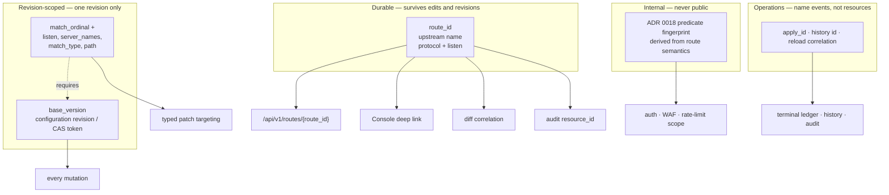
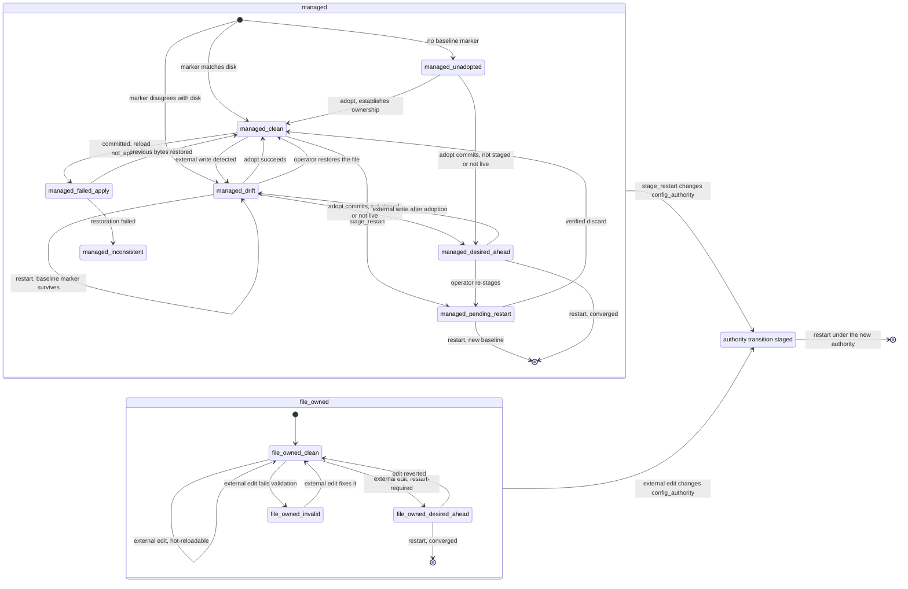

# ADR 0019 — Configuration authority, generated contracts, resource identity and remote automation

- **Status:** Accepted
- **Date:** 2026-08-24 (revised 2026-08-24 after external review)
- **Deciders:** Jul.IA maintainer
- **Applies to:** configuration ownership and persistence, the file watcher and SIGHUP, managed apply,
  drift and adoption, configuration history and rollback, planned restart, durable resource identity,
  the typed patch API, route projections, the admin HTTP surface, generated machine contracts, the
  Console, the CLI, and every future external automation client
- **Source:** #118 (`[ADR][CGC-05]`), re-audit of `main` at `44cc6eb1`
- **Related:** [ADR 0018](0018-bounded-route-matching-and-response-policy.md) (delegates durable route
  identity here, and freezes `match_ordinal` as a revision-scoped selector),
  [ADR 0011](0011-reload-plan.md) (one reload transaction, one closed-world lifecycle registry),
  [ADR 0014](0014-operability-surfaces.md) (one backend implementation behind every surface),
  [ADR 0015](0015-managed-apply-terminal-ledger.md) (managed apply identity and terminal outcomes),
  [ADR 0009](0009-two-tier-editing.md) (Quick vs Designer editing),
  [ADR 0010](0010-console-rbac.md) (admin RBAC), [ADR 0016](0016-inbound-identity-and-backend-peer-trust.md)
  (`config:trust` and the listener-granularity endpoint this record generalizes),
  [ADR 0013](0013-project-operating-model-and-completeness.md) (portfolio entry, D13, D14)

## Revision log

| Date | Change |
| --- | --- |
| 2026-08-24 | Initial record. |
| 2026-08-24 | External review. Three architectural defects and one insufficiently-evidenced decision, all fixed rather than argued down. **§9.1: the derived default is withdrawn.** `[admin].enabled` proves the admin *surface* exists, not that it *owns configuration* — a deployment running the Console for visibility while operating by GitOps would have been derived into `managed` and silently lost SIGHUP, which is the exact population the derivation was meant to protect. There is no other signal in the schema to derive from, so the default is now fixed at **`file_owned`**, chosen on the asymmetry of failure visibility: a wrong `managed` default fails *silently* (SIGHUP no-ops), a wrong `file_owned` default fails *loudly* (a Console banner naming the field). **§11/§12: invariant M1 was falsified by §12's own restart row** — M1 said "no restart" and §12 said the file wins — and `baseline_adopted_at_startup` was unimplementable, because nothing persisted the baseline for a new process to compare against. A managed baseline **digest marker** now persists it, reusing the `PlannedRestartMarker` pattern, and a restart into drift starts in `managed_drift` instead of adopting. **§27: a client-supplied idempotency key is added**, reversing this record's own rejection of one; mandatory CAS prevents the lost update but leaves the client unable to distinguish "my retry lost" from "someone else won", which for a pipeline is exit 0 versus exit 5. **§4.7: preview now mints and returns the `route_id`** and the client's apply carries it — the earlier text had preview and apply minting independently, so the previewed diff showed an identifier that never existed. **§24: `/api/v1/config/raw` is withdrawn from v1**, resolving a direct contradiction with #150's "no secret readback". **§28.1: plaintext remote mutation is now *rejected*, not warned about.** Corrections: §3 defines **seven** identity classes, not six; §29 includes `StabilityDeprecated` in OpenAPI; the resource catalog covers *configuration* resources only; §27's CAS basis was wrong in the safe direction — `verifyBaselineLocked` compares **raw** bytes, so a comment-only change already conflicts; `--json` output goes to stdout on failure too; §24a fixes collection ordering, pagination, retention, limits and content types; §23 fixes the JSON Schema dialect and the TOML↔JSON representation; §33 gains the error-code-to-exit-code matrix. |
| 2026-08-24 | Second external review round. Three blocking findings, all upheld. **§11.2: the digest-only baseline marker could not satisfy §14.** Adoption must diff against the previous managed configuration and snapshot its exact bytes, and after an external overwrite a digest cannot reconstruct them — so the baseline is now a marker **plus a snapshot of the exact last-managed bytes**, updated through a two-phase `preparing` → `current` protocol with the crash-recovery decision procedure `PlannedRestartStore` already implements. The `.bak` sidecar is the precedent; this is not a second source of desired state. **§11.2.1: an absent marker no longer means "first managed boot".** It meant ownership could be reset by deleting a file, so it becomes `managed_unadopted` — one of **three origins behind one gate**, distinct from `managed_drift` and `managed_inconsistent` because they differ in what adoption can produce and in whether they are worth alerting on. `managed_inconsistent` gains a bounded `reason`, having previously named two unrelated events. **§11.2.2: the "cannot silently execute an external edit" claim is withdrawn.** It contradicted this record's own restart behaviour — the external bytes are served, because refusing to start would convert a configuration problem into an outage. M1 is narrowed to what is true and achievable: no external edit becomes Jul's *desired state* without an explicit act. The two alternatives, serving the snapshot and failing startup, are recorded as rejected with the incident case that decides it. **§27.1: the idempotency key is bound to `principal + method + path + request fingerprint`**, registered *before* side effects in a `pending` state, with typed conflicts for reuse and for in-flight duplicates — a principal-scoped key could return a previous success for a different operation, and completion-time registration left concurrent duplicates undefined. `--idempotency-key` is added because a per-invocation key defeats the crash-and-rerun case the mechanism exists for. Contract fixes: `payload_too_large` and `unsupported_media_type` become codes of their own rather than overloading `invalid_request`, which is fixed at 400; parameters accompanying a raw TOML body travel as query parameters; §28's pre-authentication `403` is documented as a named exception that discloses nothing; and §28.1's claim is scoped to `/api/v1` rather than to the admin API as a whole. |
| 2026-08-24 | Third external review round. **§11.2's transaction was wrong in a way that defeated its own purpose.** It wrote the snapshot from the *current* bytes and never updated it, so a completed write left marker and file at revision N+1 and the snapshot at N — and the next adoption would have diffed against the wrong revision and preserved the wrong configuration. The cause was following the `.bak` precedent one step too far: `.bak` holds the **old** bytes because it is rollback material, whereas a steady-state baseline must finish holding the **new** ones. The snapshot is now written after the rename, from the bytes in hand, and recovery takes the **snapshot digest as a third input** — an earlier draft could resolve a missing or stale snapshot to `managed_clean`, the one state that asserts the baseline is trustworthy. A `.next` slot with garbage collection was considered and rejected: whenever the file matches `current_digest` the file *is* the snapshot's content, so a lost snapshot is repairable rather than fatal, which removes the need for a third artifact and a promotion step. **§17.1 contradicted §11.2.1** by having startup establish the baseline automatically, which reintroduced the hole `managed_unadopted` exists to close; the transition now enters `managed_unadopted` and an explicit adoption creates the marker and snapshot. **§17.2 had nobody delete the baseline artifacts**, leaving a snapshot of exact configuration bytes — possibly containing literal secrets — beside a file the operator now believes their pipeline owns; `file_owned` startup now removes them once, as a named and bounded exception to writing nothing. **§27.1's fingerprint is defined as a tuple** over method, path, canonical query, content type and a digest of the exact body bytes, because the earlier description named only the body, `mode` and `base_version` while §24a puts other parameters in the query string; the method and path are stored rather than only hashed, since `idempotency_key_reused` promises them. Also: the 1 MiB cap applies to every body-bearing request rather than only mutations; `insecure_transport` no longer returns the listen address, which is a configuration value returned before authentication; the failure matrix covers a restart into an unparseable drifted file, where startup fails rather than substituting the snapshot; a merged row in the §10 state table is repaired; and the downstream table stops describing the withdrawn derived default and states `[DRAFT]` removal as happening on merge. |
| 2026-08-25 | Fourth external review round. **§11.2 defined the successful path and left the failing ones undefined.** Moving the snapshot after the rename means steps 3 and 4 can fail *after* the configuration has already changed, and the failure matrix still claimed persistence failures happen "before the rename". The transaction now names its **durable commit point** — the rename — states that the reload is enqueued at that point and does not wait for provenance, and gives a per-step failure outcome: a failure before the commit is `503 storage_unavailable` with nothing changed, and a failure after it returns **success with `baseline_error`**, joining the `HistoryError` and `FinalizationError` fields the ledger already carries for exactly this class. A repair that cannot be persisted is `managed_inconsistent`/`baseline_unwritable` and **never** `managed_clean`. **The recovery table claimed three inputs and then wrote `any` in every `preparing` row**, discarding the evidence it had just introduced; the full matrix now distinguishes the pre-commit abort, the post-restoration case, the roll-forward, and — materially — the two `matches neither` cases, since a surviving snapshot at the intended digest is ordinary drift with a usable baseline while one at the prior digest is not. Every repair writes **the same verified buffer**, never a re-read of the path, closing a time-of-check/time-of-use window. **§11.2.3 is new: the composition of the baseline and planned-restart state machines**, which `marker_contradicts_staged_restart` had named without defining. They are layered rather than peers — planned restart is authoritative for which bytes belong on disk, the baseline for what Jul last wrote, and planned restart reconciles first — so there is no combined matrix. A `stage_restart` advances the baseline to the staged candidate, which is what keeps §16's expected desired-versus-active divergence from being reported as drift. **§27.2 is new:** the terminal ledger is an in-memory map, so "512 records or one hour" overstated the guarantee; retention is now scoped to one server **boot**, the ledger is deliberately not persisted, and the already-existing `applyInstanceID` is surfaced as `boot_id` so a client can detect the boundary rather than infer a durable window. **§27.1's fingerprint encoding was ambiguous** — decoded query values can contain any separator, so `a="b&c=d"` and `a="b", c="d"` collided; every component is now length-prefixed. `recorded_path` becomes `recorded_operation` carrying the **route template**, because a concrete path contains a `route_id` or listener address and §26 forbids configuration values in `details`. **§11.2.1 no longer conflates a first installation with state loss:** a marker absent beside a surviving snapshot or non-empty managed history is `managed_inconsistent`/`marker_missing` and alertable, and the case where all three are gone is stated as a filesystem-trust residual rather than an assertion that nothing existed. |
| 2026-08-25 | Fifth external review round. **A legitimate authority round trip was classified as corruption.** The fourth round admitted non-empty managed history as evidence of marker loss, which misreads `managed → file_owned → managed` — §17.2 deliberately retains history while removing the baseline artifacts, so every operator who hands a configuration to a pipeline and takes it back would have been told their state was damaged. History is **withdrawn as evidence**: it records what Jul did, not which epoch it is in. The epoch boundary is now an explicit **handoff tombstone**, written by the `file_owned` startup that closes a managed epoch, carrying no configuration bytes and therefore safe to leave in place. §17.1's "managed history begins empty" was false on every epoch after the first and is corrected. The inverse case — a cleanup that could not run on a read-only mount, leaving a previous epoch's marker to be read as current — is stated as a named residual with its cost, rather than left to be discovered. **The protocol covered writes and was being reused for transitions that write nothing.** Adoption of already-present bytes, first establishment, and the rewind after a restoration or discard were all routed through a rename-committed protocol that does not describe them. There are now **four transaction primitives** — T1 advance, T2 establish, T3 adopt-in-place, T4 rewind — each with its own ordered writes, commit point, per-step failure outcome and crash behaviour. T2 and T3 write no configuration and perform no reload; T3's commit point is last, so a failure before it is an operation that did not happen rather than a degraded success. The background retry now **re-verifies the configuration digest under `applyMu` and abandons** if a restoration superseded it, which closes a concrete race. §11.2.3 gains an **I/O-failure table** for all seven staged writes and answers the three questions it had left open: a failed baseline write still promotes the planned-restart marker, a step-7 failure is a `staging_error` rather than a `baseline_error`, and the retry cannot outrun a restoration. **§33.2 is new: `baseline_error` was invisible to clients.** A provenance failure could commit the change, return success and leave managed writes refused while the CLI exited 0 — green pipeline, stalled control plane. A bounded `degraded` array now appears in the v1 apply DTO, the polling result and the CLI JSON; **exit 4 broadens to "success with a degraded outcome"**; `staged` plus a degradation takes exit 4; and the cross-product is stated explicitly — a degradation never upgrades or downgrades a terminal outcome, so a post-commit provenance failure cannot turn a `not_applied` reload into an API success. Idempotent replay returns the identical array. Also: the §34 shorthand "no marker ⇒ unadopted" is qualified, fingerprint lengths are UTF-8 byte lengths, and §26's "four rules" enumerated five. |
| 2026-08-26 | Sixth external review round. **The four-primitive protocol inferred intent from digests, and two different operations left identical digests behind while requiring opposite recoveries.** Adoption (T3) wrote a `preparing` marker, so an adoption whose snapshot write failed — and whose API response reported failure — left artifacts indistinguishable from an interrupted apply, which the recovery matrix then rolled *forward*, silently committing it. Separately, T4's promised crash recovery was impossible: because the snapshot advanced at **commit**, the previous bytes existed only in process memory during the reload window, so a crash before restoration left nothing to restore from. Both are structural, and both are fixed by the same two changes rather than by more rows. There are now **two primitives**: **T-write**, for anything that changes the configuration file, and **T-mark**, for anything that does not. **The snapshot advances at terminalization, not at commit**, which makes the pre-existing snapshot the durable rollback material for exactly the window a restoration could need it — aligning with `completeManagedApply`, the single point where history, audit, metrics and the ledger already finalize, and which already carries `baseline.Raw`. **T-mark commits with one atomic marker write and never writes `preparing`**, so the collision is unreachable rather than tabulated around. §11.2.3's ordering changes accordingly: the planned-restart promotion now precedes the baseline writes, which is the stronger form of the guarantee it previously stated. **§14.2 is new: adoption bound itself to an `observed_digest` that nothing could hold still**, since external writers do not take `applyMu`. The fence is now defined as a linearization point at T-mark's marker write, with all three orderings specified — before it, `409`; after it, **success plus `drift_after_adopt` in the same response with no compensating write**, because rolling back would discard a committed adoption and overwriting would destroy the external writer's bytes; and a failed post-fence re-read yields `drift_unknown` with assessment deferred to §12's triggers. **§33.1's outcome table is now total and keyed on the terminal outcome**, replacing a `not_applied` row that read "1 or 5 per §33.1" — unresolvable, because §33.1 maps error codes and a reload that returns `not_applied` produces none; the distinguishing fact is whether restoration succeeded (exit 1) or failed (exit 5). This also corrects the claim that a post-commit baseline failure yields "success with `baseline_error`", which contradicted §33.2 in the one case that matters: restoration inside a failed apply. Finally, §11.2.2's "both artifacts absent in `file_owned`" contradicted §17.2's deliberate tombstone; the invariant is restated as **no configuration bytes and no live baseline**, and corrected in §17.2, the Consequences and both test bullets. |
| 2026-08-25 | Seventh external review round. **Naming `completeManagedApply` as the terminalization point was wrong, and the coordinator says so in its own comment: *"A later apply may start while that work finishes."*** It is serialized by `finalizeMu` only — not by the configuration mutation gate — and all three call sites run after `inFlightState` is cleared and `c.mu` released. Apply A could therefore promote `current(I)` *after* apply B had written `preparing(I→J)`, destroying B's marker and leaving configuration *J* with baseline *I*, undetectably. §11.2.0.1 relocates the baseline terminalization point to **the end of the configuration-path mutation phase, under `c.mu`, before `inFlightState` is cleared** — the same critical section that already performs configuration-path disk writes through `restorePreviousLocked`. History, audit, metrics and ledger publication stay after the release. **Baseline mutation is part of the configuration-path transaction; telemetry is not.** **§11.2.4 is new: `stage_restart` adoption had no defined transaction and would have destroyed data.** `PlannedRestartStore.StageManaged` writes `.bak` from the previous *on-disk* bytes, which in an adoption are the bytes being adopted — so `.bak(I)` would make discard a silent no-op while T-mark had already replaced the snapshot holding *P*, losing the last known-good configuration permanently. The composition now takes `baseRaw` **from the baseline snapshot, never the file**, omits the candidate write that §11.2.3 assumes, and holds the snapshot overwrite until `.bak(P)` and the `staged` marker are both durable, with all six ordered writes tabulated. **§14.2's linearization claim is corrected**: the fence is step 8's verification read, conditional on the marker write succeeding — not the marker write itself, because an external write landing between the two is physically before the marker yet reported as after, and a fence Jul cannot observe is not one it can claim. Behaviour is unchanged. Also: the fence failure reuses the existing **`409 drift_detected`** rather than an undefined `config_changed`, keeping §26 closed at 22 codes; exit 5's description and the `exit_codes` capability broaden to include uncertain state after a failed restoration; §34's post-rename row no longer says every such failure returns success; the `managed_drift` row now names the **baseline** as desired state rather than the externally written file; and the T-mark test bullet no longer asserts that one snapshot failure both succeeded and failed. |
| 2026-08-25 | Self-audit of the seventh round, before review. **§11.2.4 as first written reintroduced the very defect §11.2.0 was corrected for.** Its `prepared` marker preceded the commit point, and `PlannedRestartStore.Reconcile` promotes a `prepared` marker to `staged` whenever the configuration file matches the **candidate** digest — which in an adopt-and-stage is true from the outset, because the candidate is already on disk. A failed baseline marker write would therefore have returned failure to the client and had the stage silently committed by the next start. The baseline commit now precedes the planned-restart marker, under a stated invariant: **nothing a later `Reconcile` can complete may precede the commit point.** §11.2.3 satisfies the same invariant by the opposite ordering, because its file matches the *base* digest until the rename commits, so `Reconcile` clears rather than promotes — the invariant is general, the ordering that achieves it is not. Also corrected: §11.2.0.1 claimed **all three** `completeManagedApply` call sites run after the gate is released. Only the asynchronous reload path does; `applyStageRestart` is reached from `ApplyRaw`, which holds `applyMu` across the whole call and is already safe. The rule is restated as a property of the gate rather than of a function, so it holds on both paths without overclaiming about either. |
| 2026-08-25 | Second self-audit, mechanical this time: every `§` cross-reference, every closed set, and the state diagram checked against their declarations. The closed sets hold — §26 has exactly 22 codes with none referenced that it does not define, the six `degraded` kinds declared and used match exactly, all ten `managed_inconsistent` reasons are enumerated, and the §10 state diagram and state table carry the same six states. **One real inconsistency was found and fixed: §33.1 escalated every successful outcome to exit 4 when a degradation was present — except `saved_not_live`, left at "either → 3".** That is not theoretical: §11.2.4's rows 4 and 5 produce exactly a successful, not-live adoption carrying `staging_error`, which would have exited 3 while every comparable outcome exited 4. The row is split, and §11.2.4 now names `saved_not_live` as its terminal outcome explicitly rather than leaving an implementer to infer it — `staged` would assert a pending restart that does not exist. |
| 2026-08-25 | Eighth external review round. **§11.2.4 specified `PromoteToStaged` where `PromoteToStagedVerified` exists precisely to close the window it opened.** The unverified call would let an external writer replace the file between the `prepared` marker and the promotion, and Jul would record `staged(I)` and report success while the file held *J*. §11.2.4.1 requires the verified call and defines what a mismatch means **after** the adoption has already committed, where a `409` is no longer available: the adoption is preserved, the planned-restart marker and `.bak` are removed **without touching the file** — the store's own contract is *"do not repair the file"*, and §14.2 forbids overwriting an external writer's bytes — and the response reports `drift_after_adopt` plus `staging_incomplete`; a failed cleanup is `managed_inconsistent`/`cleanup_incomplete`. **A reachable state had no name and a reachable outcome was given the one value that means the opposite of terminal.** §11.2.4 row 4 and §14 step 10 both leave baseline and file at *I*, the runtime at *P*, and nothing staged. The `file_owned` side of the state model already had `file_owned_desired_ahead`; the managed side had no counterpart, so an earlier draft gestured at the analogy instead of deciding. **§11.2.5 adds `managed_desired_ahead`** with entry conditions, allowed operations — managed writes are **permitted**, because the on-disk state is coherent and refusing would lock an operator out over Jul's own staging failure — recovery by restart or re-stage, and its state-diagram edges. **§33.1 adds the terminal outcome `owned_not_serving` and removes `saved_not_live` from the terminal table entirely**: `isTerminalApplyResult` returns **false** for `saved_not_live` and the API answers `202`, so the previous round's row would have told clients to stop polling for a result that had not arrived — and using it for adoption would have told them to poll forever for one that had. `staging_incomplete` joins §33.2's closed set, distinct from `staging_error` because that one is reconciled automatically and this one never will be. **Two data-integrity fixes:** §14 step 11 wrote history "from the baseline snapshot", which T-mark has by then advanced to *I* — history would have recorded the adopted revision as its own predecessor, so the verified *P* buffer is now retained at step 5 and reopening the path is forbidden; and §11.2.4's failed-baseline path deleted nothing, leaving a `.bak` holding *P* that `Reconcile` never collects because it reads "no marker" as clean. That orphan carries resolved secrets, so it is deleted on failure and §17.2's `file_owned` startup now removes any orphan backup even when no planned marker exists — without which §11.2.2's "no configuration bytes survive" was simply false. |

## Context

#118 was written on 2026-08-03 against baseline `66c71b2d`. It records two accepted decisions —
D13 (an explicit `managed`/`file_owned` authority mode) and D14 (generated machine contracts derived
from the server-side schema authority) — and asks this record to fix the exact names, states,
artifacts, API surface and CLI contract so that #148, #149, #150 and #151 can be implemented without
inventing public semantics.

Four things have changed since that text was written, and each of them changes what this record has
to do.

**ADR 0018 is accepted, and it delegated a decision here.** ADR 0018 §14 fixes `match_ordinal` as a
CAS-bound, revision-relative *selector* and explicitly not an identity, moves internal auth/WAF/rate
scopes onto a canonical predicate fingerprint, and states that *"a durable external route identity is
deferred to ADR 0019"*. #118's original scope contains no resource-identity section at all. It does
now, and a record that deferred route identity a second time would leave #147 and #150 unable to
proceed — which is precisely the failure mode an accepted ADR exists to prevent.

**#89 landed, so the schema and lifecycle authority D14 depends on already exists.**
`internal/config/inventory.go` produces 322 canonical schema paths and 274 leaves, deterministically
and independently of build tags. `internal/lifecycle` holds 274 registry entries across 49
subsystems and five classes, renders them to three committed mirrors, and proves determinism,
secret-freedom and check-mode non-mutation in Go tests. D14's remaining work is a *rendering* problem,
not an authority problem, and this record must say so rather than re-opening it.

**Phase 5 landed, so the managed write path already has most of the machinery D13 assumes.**
`ConfigApplyCoordinator` serializes every managed write behind one mutex, keeps the exact previous
raw bytes, runs preflight before persisting, writes atomically, suppresses the watcher echo of its own
write, submits a correlated reload, waits for the terminal outcome, and restores the previous bytes on
a pre-`Publish` failure. It already performs a compare-and-swap against the on-disk baseline
immediately before writing, and already refuses a hot apply while a planned restart is pending. D13
does not need a new engine. It needs an ownership rule layered onto the one that exists.

**The audit falsified two assumptions in the issue text.** Both are recorded below because a design
built on either would have been wrong.

### Four facts from the re-audit that shaped this record more than the issue text did

**Jul today has two authoritative writers, and the file watcher is one of them.** #118 says external
file changes "can race managed writes", which understates it: an external edit to a *hot-reloadable*
field is not a race, it is the documented supported workflow. `docs/reload-semantics.md` states that
*"direct file edits followed by SIGHUP are safe for hot-reloadable changes"*, and `WatchFile` plus the
fan-in in `internal/app/wiring.go` reload the process from whatever is on disk. `external_divergence`
— the one existing drift state — is set only by `pendingRestartCheck`, which compares *startup-bound*
subsystems against the startup fingerprint. A hot-reloadable external edit therefore produces no
drift signal at all, because it has already been adopted. Making `managed` the unconditional default
would silently remove a documented workflow from every existing deployment on upgrade. §9 resolves
this with a fixed `file_owned` default rather than by weakening the ownership rule.

**`ServerConfig.Name` is not a latent server identity, and the lifecycle registry already says so.**
The field exists (`Name string \`toml:"name"\``), but no validator reads it: there is no requiredness
check, no uniqueness check, no character-set bound and no length bound anywhere in
`internal/config/validate*.go`. Its single consumer is `RouteProjection.Name` in
`internal/admin/projections.go`. The registry entry is explicit about what it is:

```go
hot("servers.*.name", SubServerIdentity, "the block label appears only in configuration
    projections, which are rebuilt from the effective config on each reload"),
```

Every operational path — `findServerTarget`, `findServerByNames`, `serverIndex` in the diff,
`AuthScope`, `WAFScope`, the rate-limit scope, and the shared-listener consistency rules — keys on
`(listen, server_names)` instead. Promoting `name` to a public resource key would mean adding
requiredness, uniqueness and a grammar to a field that thousands of existing configurations either
omit or set to a duplicate human label. §5.3 rejects it on that evidence.

**An optional identity field can be added without rewriting anybody's routes, and this was measured
rather than assumed.** The concern that a managed configuration would be mass-rewritten to carry IDs
rests on how `config.Marshal` behaves. A characterization probe written for this record confirms two
properties of `go-toml/v2` as vendored: `omitempty` is honoured on a string field inside an
array-of-tables, so an absent `route_id` produces no key at all; and declaration order of the
array-of-tables survives a `Marshal`/`Unmarshal` round trip unchanged. The probe also confirms the
inverse, which matters just as much: fields *without* `omitempty` are emitted at their zero value, so
`config.Marshal` already writes `name = ''` for every unnamed server. A structured patch apply
therefore already rewrites the whole file canonically and already discards comments — a pre-existing
property this record documents (§11) rather than introduces.

**The admin listener has no transport security whatsoever.** `AdminConfig` has `enabled`, `listen`,
`token`, `rbac`, `console`, history, rate-limit, audit and plugin-upload fields — and no TLS field, no
certificate field and no client-certificate field. `internal/admin/mtls.go` projects the *data
plane's* mTLS state; it does not secure the admin listener. The server logs a warning when the admin
listener binds off-loopback, and `docs/deployment.md` treats loopback as the assumption. #151 asks for
a remote mutating CLI. This record will not promise one over a plaintext bearer-token endpoint; §28
makes admin transport security an explicit hard prerequisite instead.

## Existing architecture

### Configuration writers

Every path on `main` that can influence desired configuration state. A missed writer would invalidate
the authority model, so this table is the inventory #148 §1 asks for, resolved here.

| Writer/source | Where | Reads | Writes | Persists | Reloads | Authority today | Side effects |
| --- | --- | --- | --- | --- | --- | --- | --- |
| Startup load | `cmd/jul` → `app.Serve` → `src.Load()` | config file | — | no | n/a | file | builds the startup candidate and fingerprint |
| SIGHUP | `internal/signals` → `wiring.go` fan-in | config file at swap time | — | no | yes | **file (adopts)** | restart-required checks run at swap; failure leaves the old generation |
| File watcher | `config.WatchFile` → `wiring.go` fan-in | config file at swap time | — | no | yes | **file (adopts)** | parent-directory watch, 200 ms debounce, one-shot echo suppression |
| Raw admin apply | `POST /api/config/apply`, `/api/config/raw` → `ConfigApplyCoordinator.ApplyRaw` | request body + on-disk baseline | config file, **verbatim bytes** | yes | yes | admin | history snapshot, audit, ledger record, echo suppression |
| Structured patch apply | `POST /api/config/patch/apply` → `deps.ApplyConfig` → `ApplyRaw` | ops + baseline | config file, **`config.Marshal` canonical bytes** | yes | yes | admin | as above; comments and formatting are lost |
| Settings/wizard editors | `/api/config/settings`, `/api/wizard*` | baseline | via the same coordinator | yes | yes | admin | as above |
| Listener client-address patch | `PATCH /api/listeners/{addr}/client_address` | baseline | via the same coordinator | yes | yes | admin | writes every sibling `[[servers]]` block atomically; `config:trust`; own audit category |
| History rollback | `POST /api/history/rollback`, `/api/config/rollback` → `rollbackToSnapshot` | snapshot + baseline | config file | yes | yes | admin | serialized under `applyMu`; CAS on `base_version`; snapshots the current config first |
| Planned-restart stage | `mode = "stage_restart"` → `PlannedRestartStore` | baseline | config file **plus** `<cfg>.pending-restart.json` and `<cfg>.pending-restart.bak` | yes | no | admin | marker `prepared` → `staged`; crash recovery reconciles at startup |
| Planned-restart discard | `POST /api/config/pending-restart/discard` | marker, disk, live version | restores `.bak` over the config file | yes | no | admin | verified discard; refuses on digest mismatch |
| Failed-apply restoration | `restorePreviousLocked` | previous raw bytes | config file | yes | no | admin | only for managed writes; records a `recovery` history snapshot when it fails |
| Startup reconciliation | `PlannedRestartStore.Reconcile` via `OnInitialGenerationReady` | marker + disk | marker; possibly the config file | yes | no | admin | promotes or repairs a `prepared` marker |
| `jul fmt -w` | `cmd/jul/cli.go` | config file | config file (canonical) | yes | no | **external, offline** | not a running-server writer; the watcher sees it as an external edit |
| `jul import -o` | `cmd/jul/cli.go` | NGINX source | new TOML file | yes | no | **external, offline** | never applies |
| Test helpers | `internal/admin`, `internal/app` tests | fixtures | temp files | yes | varies | n/a | not a production writer |

Two properties of that table matter more than the rest. Every persistent write goes through
`atomicfile.Write` — same-directory temp file, `fsync`, `chmod`, rename, best-effort directory
`fsync`, `0o600` for a new file and the existing mode preserved for an existing one — so no writer
can leave a truncated configuration behind. And every *managed* write is serialized behind
`applyMu`/`c.mu` and performs a compare-and-swap against the on-disk baseline immediately before the
rename:

```go
// internal/app/config_apply.go
changed, currentVersion, verifyErr := c.verifyBaselineLocked(baseline)
if changed {
	c.mu.Unlock()
	return c.conflictResult(mode, persistedVersion, desiredVersion, currentVersion), nil
}
if err := atomicfile.Write(c.Path, data, 0o600); err != nil {
```

That CAS is the foundation §12 builds drift detection on. It exists, it is tested, and this record
adds an ownership rule above it rather than a second mechanism beside it.

### Resource addressability

How every externally addressable configuration resource is identified on `main`.

| Resource | Go type | Current locator/key | Uniqueness validated? | Mutable? | Admin endpoints addressing it |
| --- | --- | --- | --- | --- | --- |
| Configuration revision | — | `CanonicalVersion` = first 8 bytes of `sha256(config.Marshal(cfg))`, hex | n/a (derived) | n/a | `base_version` / `current_version` on every mutating endpoint |
| HTTP server / vhost | `ServerConfig` | `(listen, server_names)`, `server_names` compared as an unordered set | no explicit rule; `findServerByNames` rejects an ambiguous target at call time | yes — both coordinates | typed patch targets; `GET /api/routes` |
| Route / location | `LocationConfig` | `(listen, server_names, match_type, path)`; ADR 0018 adds `match_ordinal` + `base_version` | no; `findLocation` rejects ambiguity at call time | yes — every coordinate | typed patch targets; `GET /api/routes`; `POST /api/routes/test` |
| Listener | — (no `[[listeners]]` block) | the listen address; `CanonicalListenAddr` is `strings.TrimSpace` | implicitly, by cross-block consistency rules | yes | `GET /api/listeners`, `GET|PATCH /api/listeners/{addr}/client_address` |
| Upstream pool | `UpstreamConfig` | `name` | **yes** — required and duplicate-rejected in `Validate()` | yes | `GET /api/upstreams`, `GET /api/upstreams/{name}/resilience` |
| Upstream backend | `UpstreamServer` | `address` within a pool | **no** — duplicate addresses are legal (weighting) | yes | none individually |
| Discovery endpoint | runtime only | provider-specific | n/a | n/a | none; never persisted |
| L4 stream | `StreamServer` | `(protocol, listen)`, protocol defaulting to `tcp` | **yes** — duplicate rejected in `validateStreams` | yes | `GET /api/streams` |
| Plugin | `map[string]PluginConfig` | map key | structurally, by the map | key is the identity | `GET /api/plugins`, `POST /api/plugins/upload` |
| RBAC role / principal | `AdminRole`, `AdminPrincipal` | `name` | **yes** — required, unique, `[a-zA-Z0-9._@-]`, predefined names reserved | yes | none individually |
| Certificate | runtime projection | subject/path | n/a | n/a | `GET /api/certs`, `GET /api/tls` |
| Managed apply operation | `ManagedApplyRecord` | `apply_id` = `rl_<instance>_<seq>` | process-unique by construction | no | `GET /api/config/applies/{id}` |
| History revision | history file | `id` = `20060102T150405.000Z`, `_n` on collision | directory-unique by construction | no | `GET /api/config/history/{id}`, `/{id}/diff`, rollback |
| Reload transaction | `ReloadResult` | correlated to `apply_id` | n/a | no | embedded in apply results |

And how routes are keyed *internally*, which is a different question the record must keep separate:

| Consumer | Key | File |
| --- | --- | --- |
| Typed patch target | `(listen, server_names, match_type, path)` | `internal/admin/patch_helpers.go` `findLocation` |
| Diff correlation | `"<match_type> <path>"` within a server keyed `"<first server_name> <listen>"` | `internal/admin/diff_helpers.go` `locationKey`, `serverIndex` |
| Lint duplicate rule | `match_type + "\x00" + match_path` | `internal/config/lint.go` |
| Auth / WAF scope | `listen + "\|" + join(server_names) + "\|" + match.path` | `internal/app/wiring.go` `AuthScope`, `WAFScope` |
| Rate-limit scope | `"loc:" + listen + "\|" + join(server_names) + "\|" + match.path` | `internal/app/factory.go` |

ADR 0018 §14 already replaces the last two with a canonical predicate fingerprint. This record does
not touch that decision; §6 states why the fingerprint must not become the public identity.

### Admin surface, contracts and CLI

| Concern | Where | State before this record |
| --- | --- | --- |
| Route catalog | `internal/admin/route_catalog.go` | 63 `RouteSpec` entries; `Pattern`, `Methods`, `Permissions`, `Permission`, `AnyPermissions`, `Public`, `Authenticated`, `Handler`. A guard test derives the mux from it. **No internal/external classification field.** |
| RBAC | `internal/rbac` | 17 permissions plus `*`; 401 unauthenticated, 403 forbidden, 503 when RBAC is desired but no policy built |
| Admin transport | `internal/admin/server.go` | plaintext HTTP, bearer token or RBAC principals, loopback assumed, warning when bound elsewhere. **No TLS, no mTLS.** |
| Error shapes | `internal/admin` | five structured shapes (`validationErrorResponse`, `conflictResponse`, `adminGuardResponse`, `patchOperationFailureResponse`, `ConfigApplyResult`) plus ad-hoc `map[string]string{"error": …}`. **No stable machine codes, no request correlation id.** |
| Optimistic concurrency | apply, patch, rollback | optional `base_version`; 409 with `current_version` on mismatch; omitted means force |
| Apply outcomes | `internal/server/reload_result.go` | `applied_live`, `applied_degraded`, `not_applied`, `saved_not_live`, and **`owned_not_serving` added by this record** (§33.1) |
| Pending restart | `internal/app/planned_restart.go` | `none`, `managed_staged`, `external_divergence`, `inconsistent` |
| Schema inventory | `internal/config/inventory.go` | `SchemaPaths()` 322, `SchemaLeaves()` 274, build-tag independent |
| Lifecycle authority | `internal/lifecycle` | 274 entries, 49 subsystems, 5 classes, 8 flags; `lifecyclegen`; `make lifecycle-generate` / `make generated-check` |
| Generated artifacts | `docs/generated/` | `config-lifecycle.json`, `config-lifecycle.md`, plus `docs/config-lifecycle.yaml` |
| Value contract | `docs/config-value-contract.json` | 110 audited enum/grammar/bound entries, checked by `internal/config/value_contract_test.go` |
| JSON Schema / OpenAPI | — | **neither exists** |
| Capabilities | `cmd/jul/capabilities*.go` | 13 build-tag features plus the exit-code table, emitted by `jul capabilities --json` |
| CLI | `cmd/jul` | `lint`, `fmt`, `run`, `serve`, `check`, `healthcheck`, `import`, `version`, `capabilities`, `completion`; exit codes 0/1/2; `healthcheck` is the only HTTP client |

## Constraints from accepted decisions

1. **ADR 0018 §14.** `match_ordinal` is a 0-based, declaration-order-relative selector, meaningful
   only within one configuration revision, requiring `base_version`, rejected when that is absent or
   stale, and **explicitly not identity**. The canonical predicate fingerprint is internal
   correlation and state identity. Neither may be persisted or exported as a durable resource name.
   This record consumes both and redefines neither.
2. **ADR 0018 routing representation.** Declaration order of `match.headers`, `match.query` and
   `response_headers` is contract; omitted and explicit-empty are distinct everywhere; `op` is a
   closed enum; server-side validation is authoritative; the Console implements no matching or CORS
   logic. Generated contracts and API DTOs must preserve all of it.
3. **ADR 0011.** One reload transaction, one closed-world lifecycle registry. Every field introduced
   here gets exactly one registry entry and can only become live through `Publish`.
4. **ADR 0014 and #108.** One server-side implementation behind raw TOML, the typed API, the Console
   and the CLI. A remote client is a client.
5. **ADR 0015.** Managed apply already owns an operation identity (`apply_id`) and a terminal ledger.
   This record adds no second operation-identity namespace.
6. **D03.** Unknown TOML fields fail immediately everywhere. There is no permissive mode, and
   generated contracts must not imply one.
7. **#89.** The Go lifecycle registry and `SchemaPaths()` are the machine authority. Generated
   artifacts are mirrors. No second field registry.
8. **D13.** `managed` and `file_owned` are the two initial values; `controller_owned` stays
   validation-rejected; authority is restart-bound; managed never silently adopts; file-owned is never
   rewritten by Jul.

## Decision summary

1. **D14 is widened** to cover resource identity and addressability alongside generated contracts, so
   identity is no longer architecturally orphaned and no second identity registry appears (§1).
2. **Seven identity namespaces are named and separated**, and it is a defect for any surface to
   conflate them (§2).
3. **Every configuration resource is classified** into one of seven identity classes. Route identity is
   *decided*; every other resource is *audited and classified*, and only one of them changes (§3–§5).
4. **`route_id` is added**: optional, on `[[servers.locations]]`, globally unique within one
   configuration, durable across route-semantic edits, never derived from mutable content, never
   written into file-owned configuration, and minted by Jul only when a managed structured API call
   *creates* a route (§4).
5. **`[global].config_authority` is the authority field.** Its default is **`file_owned`** — fixed,
   not derived — chosen because a wrong `managed` default fails silently and a wrong `file_owned`
   default fails loudly. It is restart-bound (§9).
6. **In managed mode, neither the file watcher nor SIGHUP adopts an external edit.** Both report typed
   drift. Adoption is one explicit, authenticated, CAS-bound operation that reuses the whole Phase 5
   pipeline (§11–§14).
7. **In file-owned mode, every mutating endpoint fails closed before any side effect** with one stable
   error, and Jul never writes the configuration file (§15).
8. **Generated contracts gain three artifacts** — JSON Schema, machine metadata and a factual
   reference — all rendered from `SchemaPaths()` plus one bounded metadata table, all deterministic
   and drift-checked (§19–§23).
9. **`/api/v1` is a new, deliberately small external namespace** aliasing existing handlers. Existing
   `/api/…` routes are declared internal and unstable (§24–§25).
10. **One error envelope with bounded machine codes** is frozen for the external namespace, together
    with the wire semantics an automation client cannot infer (§26, §24a).
11. **Remote mutation over cleartext is rejected**, and admin transport security is a hard
    prerequisite this record declares and does not design (§28.1).
12. **The remote CLI is a thin client** with a frozen JSON envelope, a client-supplied idempotency key
    and a small exit-code set with an exhaustive error mapping (§27.1, §31–§33).

## Decision

### 1. D14 is widened; no new decision number is created

D14 currently reads:

> JSON Schema, lifecycle/capability metadata and factual reference derive from the server-side
> schema/metadata authority; no second field registry.

It is replaced in the #62 register by:

> **D14 — Generated machine contracts and resource identity/addressability.** JSON Schema,
> lifecycle/capability/identity metadata and factual reference derive from the server-side
> schema/metadata authority; every externally addressable configuration resource has exactly one
> explicit identity model — durable identity, natural key, or revision-scoped selector — and no
> second field registry or identity registry exists.

Primary issues become #89, #128, #147, #149, #150, #151.

**Why widen rather than add D17.** D17 is free, so numbering was not the reason. The reason is that
the two halves of this decision are the same decision seen from two sides. "Which field is the
identity of this resource" is a fact about the configuration schema, and the *only* defensible place
to record it is the same authority that already records type, lifecycle, capability and secrecy for
every leaf — otherwise Jul acquires precisely the second registry #89 was created to prevent. The
consumers are also the same: #149 renders the metadata, #150 consumes the addressability, #147 and
#151 target resources with it. Two register rows pointing at one ADR with overlapping scope would
describe a separation that does not exist in the implementation.

**What widening D14 does not do.** It does not make identity a documentation-generation concern.
`route_id` is a real configuration field with real validation, and §4 is a public-contract decision
of the same weight as D12 or D13. D14's widened text records where identity *lives*; §4 records what
it *is*.

### 2. Seven namespaces, and conflating them is a defect

Jul now has seven distinct kinds of identifier. They are listed together, once, because every one of
the failure modes this record exists to prevent begins with two of them being treated as
interchangeable.

| Namespace | Example | Answers | Stable across revisions? | Public? |
| --- | --- | --- | --- | --- |
| **Schema path** | `servers.*.locations.*.match.headers` | *where in the configuration structure?* | yes | yes — generated contracts |
| **Lifecycle keying** | `AddressKeyed`, `CollectionKeyed` | *how does this field behave across a reload?* | yes | yes — lifecycle metadata |
| **Durable resource identity** | `route_id`, upstream `name` | *which logical resource?* | **yes** | yes — API, Console, diff, audit |
| **Revision-scoped selector** | `match_ordinal` + `base_version` | *which element of this exact revision?* | **no** | yes — patch targeting only |
| **Internal semantic fingerprint** | ADR 0018's predicate fingerprint | *which runtime scope owns this state?* | derived; changes with semantics | **no** |
| **Configuration revision / CAS token** | `base_version`, `current_version` | *against which state?* | it *is* the state | yes |
| **Operation identity** | `apply_id`, history `id`, reload correlation | *which operation?* | yes, but names an event | yes |

Four rules follow, and they are contract:

1. **A schema path is not a resource identity.** `servers[0].locations[2]` is a location in a
   document, not a route.
2. **A lifecycle key is not a resource identity.** `CollectionKeyed` exists so that a fingerprint
   comparison considers only elements present on both sides. It classifies *reload behaviour*. It
   happens to be derived from coordinates that resemble identity, and that resemblance is a trap.
3. **A revision-scoped selector is never durable.** ADR 0018 already froze this for `match_ordinal`.
   No surface may present one as a resource name, persist one, or correlate across revisions with one.
4. **Resource identity and revision identity answer different questions and are always both present
   on a mutation.** Identity answers *which resource*; CAS answers *against which state*. An API that
   accepts one without the other is either unsafe or unusable.

The separation, drawn once so that no future contributor has to reconstruct it from prose:



The four boxes are disjoint by contract: a durable identity is never derived from the fingerprint,
never substituted by a selector, and never confused with an operation id. Nothing may convert one
into another.

### 3. Resource identity taxonomy

Seven classes. Every configuration or runtime resource lands in exactly one.

| Class | Meaning | Examples |
| --- | --- | --- |
| **Durable natural key** | an existing field is already stable, unique and validated identity | upstream `name`, plugin map key, RBAC role/principal `name` |
| **Explicit durable ID** | identity independent of mutable semantics, because no natural key exists | `route_id` |
| **Composite natural key** | a validated tuple of fields is the identity; changing any member is delete + create | `[[stream]]` `(protocol, listen)`, listener `listen` |
| **Revision-scoped selector** | exact targeting inside one known revision, never durable | `match_ordinal` + `base_version`; `(listen, server_names, match_type, path)` |
| **Internal fingerprint** | derived, used for runtime state correlation, never public | ADR 0018's predicate fingerprint |
| **Ephemeral runtime identity** | exists for one runtime generation or discovery instance; must never become persistent configuration identity | discovered backends, handler generations |
| **No public identity required** | the projection has no individually addressable resource | certificate projections, per-backend entries |

The classification is applied in §5. It exists to make the *absence* of an ID a positive decision
rather than an oversight, which is the discipline #118 asks for and the reason this record adds
exactly one identifier.

### 4. `route_id`

ADR 0018 delegated this decision here, so this section decides it completely.

#### 4.1 Home and name

```toml
[[servers.locations]]
route_id = "public-api"
proxy_pass = "http://api"

[servers.locations.match]
type = "prefix"
path = "/api/"
```

The field is `route_id`, on `LocationConfig`, as a sibling of `match` and the action fields.

`route_id` is chosen over a generic `id` for two reasons. Jul's configuration has no other `id`
field, so a bare `id` would be the first member of a namespace this record explicitly declines to
create — the moment a second resource gains one, `id` on a location and `id` on something else are
two grammars sharing a name. And the field must remain readable when a location grows further
semantics: `route_id` still says *this identifies the route* after ADR 0018's predicates, response
policy and CORS have all landed on the same block, whereas `id` increasingly reads like a property of
whatever the reader was last looking at. The cost of the choice is a slightly longer key; the cost of
the alternative is a permanent ambiguity in a public schema.

The Go field is a pointer:

```go
RouteID *string `toml:"route_id,omitempty"`
```

A pointer because ADR 0018 froze the rule that omitted and explicit-empty are distinct everywhere and
must not collapse. `route_id = ""` is present-and-empty; §4.4 rejects it. A plain `string` could not
tell that apart from absence, and silently reading it as absence would leave a route the operator
believed was addressable with no durable identity and a broken deep link. `AdminConfig.Console *bool`
and `LocationConfig.RateLimit *RateLimitConfig` are the existing precedent for this shape.

#### 4.2 Optional, permanently

`route_id` is optional and will not become required.

Making it required would invalidate every configuration in existence, every example in the
documentation, every fixture in `testdata/`, and every file a GitOps pipeline currently ships — to
buy an API convenience. It would also be unenforceable in the direction that matters: a file-owned
configuration is authored outside Jul, so "required" would mean *Jul refuses to start*, which is a
disproportionate response to a missing label on a route that works.

The consequence is stated rather than hidden: **a route without `route_id` has no durable identity**,
and every surface must represent that truthfully. §4.13 and §24 define exactly what such a route can
and cannot do.

#### 4.3 Uniqueness scope: global within one configuration

A `route_id` is unique across the entire configuration document — every `[[servers]]` block, every
`[[servers.locations]]`. A duplicate is a **validation error**, not a lint finding, naming both
locations by schema path.

Per-server uniqueness was considered and rejected. It would make the API resource name a composite of
the route ID *and* the server coordinates, and those coordinates are mutable route semantics — the
exact thing §2 rule 4 and #118 §19 forbid encoding into a supposedly stable URI. `/api/v1/routes/{route_id}`
only works if `{route_id}` alone resolves. Global uniqueness also makes diff correlation, Console deep
links, audit attribution and CLI targeting one lookup instead of four, and makes "this ID moved to a
different vhost" expressible as a modification of one resource rather than as a delete plus a create.

The cost is real and is accepted: an operator who copies a `[[servers]]` block to add a second vhost
must change the route IDs in the copy. Validation names both sides, so the failure is immediate and
self-explanatory rather than latent.

#### 4.4 Syntax

| Rule | Value |
| --- | --- |
| Length | 1–64 bytes |
| Alphabet | `a`–`z`, `0`–`9`, `-`, `_` |
| First character | `a`–`z` or `0`–`9` |
| Case | lowercase only; an uppercase character is **rejected**, never folded |
| Whitespace | rejected, including leading and trailing |
| Present-and-empty (`route_id = ""`) | **rejected** |
| Comparison | byte-exact |
| Normalization | none — validation rejects rather than rewrites |

The alphabet is a strict subset of RFC 3986 unreserved characters, so a `route_id` is safe in a URI
path segment, a query parameter, a JSON string, a shell argument and an HTML attribute without
escaping in any of them. That is the whole reason the grammar is bounded: an identifier that appears
in `/api/v1/routes/{route_id}` and in a Console deep link must not require five different escaping
rules to be correct in five different places.

Rejecting uppercase rather than folding follows ADR 0018 §2's method rule and for the same reason:
mechanical rewriting means the value in the operator's file is not the value the system uses, so a
`grep` for the ID they wrote finds nothing. Rejecting is one error message; folding is a class of
confusion.

#### 4.5 Operator slugs and minted IDs share one grammar

Both are legal. `public-api` is a valid `route_id`; so is `r-k7m2q9x4vb8nfp3jd6ths5wzy0`. There is no
second field, no flag distinguishing them, and no surface that treats them differently.

Two grammars were rejected. A readable-slug-only rule cannot be minted safely (§4.6). An
opaque-only rule would force an operator hand-writing TOML to invent a random string, which they
would inevitably make meaningful anyway, and Jul would have banned the thing it could not prevent.
One bounded grammar that admits both is smaller than either and has no undefined case.

#### 4.6 Who may create an ID

| Creator | May mint? | Notes |
| --- | --- | --- |
| Operator, editing TOML | yes | any value satisfying §4.4 |
| Managed structured API — **route creation** | **yes** | mints when the request omits one; §4.7 bounds when |
| Managed structured API — route *edit* | no | preserves what is there; never adds |
| Managed raw apply | no | the bytes are the operator's |
| Adoption of an external file | no | the bytes are the external source's |
| NGINX importer | no | §35 |
| File-owned mode, any path | **never** | §15 |
| Jul at startup, parse, validate, reload | **never** | §4.7 |

A minted identifier is:

> `r-` followed by **26 characters** of unpadded lowercase RFC 4648 base32 encoding **128 bits** read
> from `crypto/rand`.

Total length 28, inside §4.4's bound and grammar. The `r-` prefix makes a minted ID recognisable at a
glance without being semantically load-bearing — nothing may parse it.

**It carries no timestamp and encodes nothing about the route.** A ULID or a UUIDv7 would embed
creation time, which leaks operational history into a configuration file, invites clients to sort by
it, and would eventually be treated as a creation-order contract that Jul never promised. Random is
enough: at 128 bits the collision probability is negligible, and validation rejects a duplicate
anyway, so the failure mode is a rejected write rather than a corrupted identity space.

**A minted ID is never derived from route content.** This is the hard constraint #118 §11.6 states
and it is worth restating in the form that catches the tempting mistake: a digest of the route's
matcher, path, action or coordinates is a *fingerprint*, and a fingerprint changes when the content
changes, which is exactly when a durable identity must not. So are the slice index, the source line,
the route coordinates and `match_ordinal`. None of them is an identity, and none of them may be
presented as one.

**The NGINX importer emits no `route_id`, and that is the honest output.** `jul import` is a
translation tool whose output must be reproducible: running it twice on the same source must produce
the same bytes, so injecting random identifiers is not available. The alternative — deriving an ID
deterministically from the NGINX source location or the translated route's content — would produce a
value that is a stable *import key* and not a durable identity: it survives re-running the importer,
and stops meaning anything the first time an operator edits the route it names. Claiming durability
the value does not have is worse than omitting it. Imported routes therefore arrive without IDs, are
fully usable through the revision-scoped selector (§4.13), and acquire durable identity when and if
an operator assigns one.

#### 4.7 Minting never happens during a read, and preview and apply mint the same ID

Minting occurs in exactly one kind of operation: a managed structured route *creation* whose request
omits a `route_id`.

The following **must not** mint, and each is listed because each is a plausible place to put it:

- parsing (`config.Parse`) and `applyDefaults`;
- validation and `jul check`;
- `jul lint` and `jul fmt`;
- schema, metadata and reference generation;
- any status, projection or diff read;
- SIGHUP, file-watch, and any reload;
- adoption of an external file (§14);
- startup and planned-restart reconciliation.

The rule has a one-sentence justification: **a read that invents durable identity makes the identity
depend on who looked at the configuration and when**, which is not identity. It also has a mechanical
consequence worth naming — `config.Parse` must stay free of `crypto/rand`, so the property is
testable by construction rather than by review.

**Preview and apply are two requests, and an earlier draft of this record did not say which one
mints.** That omission was a defect, not an ambiguity: preview is side-effect-free and apply is a
separate call, so each would have minted independently and the identifier in the diff the operator
approved would never have existed. A preview that shows a fictitious identity is worse than one that
shows none.

The rule, in one sentence:

> **Preview mints the identifier and returns it; the client's apply carries it back as an ordinary
> `route_id`. Apply mints only when the request omits one — which happens only when no preview
> occurred.**

Three properties make this the smallest correct answer:

- **Preview stays side-effect-free.** Generating a random string and returning it persists nothing,
  creates no reservation and leaves no state to expire. There is no preview token, no frozen
  candidate and no server-side cache — all three would be new state with their own lifetime, and
  none is needed.
- **It requires no new field.** The returned identifier goes back in the apply request as the
  `route_id` the schema already defines, so the previewed operation and the applied operation are
  byte-identical. A client that echoes what it previewed applies exactly what it saw.
- **The omitted case is still honest.** A client that applies without previewing gets an identifier
  minted at apply time and returned in the result. A client that previews and then *drops* the
  identifier gets a different one, and the diff it approved differs in exactly one opaque field —
  stated here so the behaviour is documented rather than surprising.

Minting itself remains inside the operation that produces the candidate, before validation, so a
minted identifier is validated against §4.4 and checked for uniqueness (§4.3) like any other.

#### 4.8 Changing an ID is delete plus create

Jul does not prevent an operator from editing `route_id` in raw TOML — it is their file, and a
gateway that refused the edit would be claiming an ownership it does not have over a text file. But
every surface interprets the change the same way:

> **Changing or removing a `route_id` ends one logical resource and, if a new ID appears, begins
> another.**

There is no rename operation, and the typed API offers none. Diff renders a removal and an addition
(§7). History shows the old resource ending. A Console deep link to the old ID becomes a
resolvable-but-absent resource, not a silent redirect. Audit records both events.

The alternative — treating an ID change as a rename when the route's content is otherwise identical —
was rejected because it makes identity depend on content comparison, which is the fingerprint model
wearing an identity's clothes. It would also mean two operators who independently changed an ID and a
matcher in one edit get different correlation results depending on which change the differ noticed
first.

#### 4.9 Reuse after deletion is permitted, and the limitation is documented

An ID may be reused after the route carrying it is deleted. Jul keeps no tombstone registry.

A tombstone registry would be permanent state, would need its own persistence, ownership, pruning,
backup and authority-transition semantics, and would be unenforceable the moment an operator edits
raw TOML or restores a file from backup — which is a supported workflow in both modes. It would buy
protection against an ABA sequence that `base_version` already covers for every mutation: a client
holding a stale revision cannot act on it at all, whether or not an ID was reused in between.

The residual is stated plainly rather than left to be discovered: **a Console deep link or an audit
entry that names a deleted `route_id` may, after a later edit, resolve to a different logical route
that reuses the string.** History entries are bound to a configuration revision, so historical
records remain unambiguous; live deep links are not, and the Console must therefore show the route's
current content rather than assume continuity.

#### 4.10 `route_id` has no effect on routing

It does not participate in matching, candidate enumeration, precedence, tie-breaking, CORS,
proxying, or any per-request decision. It is control-plane metadata. The compiled router does not
carry it, so the request hot path cannot observe it and cannot be slowed by it.

#### 4.11 Internal runtime scopes keep the predicate fingerprint

ADR 0018 §14 keys `AuthScope`, `WAFScope` and the per-location rate-limit scope on a canonical
predicate fingerprint. **That decision stands unchanged, and `route_id` does not replace it.**

Replacing it was considered and is rejected on four grounds, any one of which is sufficient:

- **Most routes have no ID.** `route_id` is optional and file-owned configuration may never receive
  one, so an ID-keyed scope needs a fallback for the common case — which means the fingerprint has to
  exist anyway, and now there are two keying schemes instead of one.
- **The semantics are wrong in the direction that matters.** A rate-limit bucket carries live state.
  Resetting it is correct exactly when the route's *matching behaviour* changes, which is what the
  fingerprint tracks. An ID-keyed bucket survives a matcher rewrite that makes it a different route,
  handing accumulated limiter state to traffic it was never measuring.
- **Renaming would silently reset security state.** Under an ID-keyed scope, editing a `route_id` —
  a control-plane label with no routing effect (§4.10) — would rebuild the auth and WAF scope and drop
  the rate-limit bucket. A field documented as having no runtime effect would have one.
- **It would make identity load-bearing for security.** §28 requires the opposite: an identifier is
  never an authorization or isolation mechanism.

The two mechanisms coexist because they answer different questions, and the record says so in §2.

#### 4.12 `route_id` is never a metric label

Predicate values, header values, query values and origins are already excluded from telemetry labels
by ADR 0018. `route_id` joins them. A stable identifier does not make an unbounded label bounded: an
operator with ten thousand routes has ten thousand label values, and the fact that they are now
*durable* makes the cardinality problem permanent rather than transient. Route identity appears in
the route-test diagnostic, the API, the diff, history and audit — all of which are bounded, requested
surfaces — and nowhere in `/metrics`.

#### 4.13 What a route without a `route_id` can do

This is the compatibility contract, and it is deliberately generous.

| Capability | With `route_id` | Without |
| --- | --- | --- |
| Serve traffic | yes | yes — identical |
| Appear in projections and diffs | yes | yes |
| Be edited through the typed API | yes | yes — via the ADR 0018 selector plus `base_version` |
| Be addressed as `/api/v1/routes/{route_id}` | yes | **no** — collection-only |
| Carry a stable Console deep link | yes | **no** — the link is revision-bound and may become stale |
| Correlate across revisions in a diff | by ID | best-effort, by ADR 0018's internal fingerprint |
| Be targeted by `jul … --route-id` | yes | **no** — the selector flags are used instead |
| Produce a lint suggestion to add one | n/a | yes, informational severity, in managed mode only |

The lint finding is informational and managed-only on purpose. In file-owned mode Jul is a guest in
someone else's file, and a warning that the operator cannot act on without changing their pipeline is
noise, not guidance.

### 5. Every other resource: audited, classified, and almost entirely unchanged

The commitment here is deliberately asymmetric. Route identity had to be decided, because ADR 0018
delegated it and #147 and #150 consume it. Every other resource is audited and classified so that the
absence of an identifier is a recorded decision — but **no other resource gains a field.** The only
other change is that one rule every consumer already relies on is written down (§5.4).

| Resource | Identity class | Public representation | Persistence owner | Mutable? | Cross-revision? | Change in this record |
| --- | --- | --- | --- | --- | --- | --- |
| Route / location | **explicit durable ID**, else revision-scoped selector | `route_id`, else `(listen, server_names, match_type, path, match_ordinal)` + `base_version` | config owner | ID no, coordinates yes | yes when the ID is present | **`route_id` added** |
| Upstream pool | durable natural key | `name` | config owner | rename = delete + create | yes | none |
| Upstream backend | no public identity required | position within a pool | config owner | yes | no | none |
| Discovery endpoint | ephemeral runtime identity | provider address | **runtime only** | n/a | no | none |
| HTTP server / vhost | revision-scoped selector | `(listen, server_names)` | config owner | yes | no | none; §5.3 |
| Listener | composite natural key | `listen` | config owner | relocation = delete + create | yes | `CanonicalListenAddr` stated as the identity form; §5.4 |
| L4 stream | composite natural key | `(protocol, listen)` | config owner | relocation = delete + create | yes | none |
| Plugin | durable natural key | map key | config owner | rename = delete + create | yes | none |
| RBAC role / principal | durable natural key | `name` | config owner | rename = delete + create | yes | none |
| Certificate | no public identity required | projection only | runtime | n/a | no | none |
| Configuration revision | CAS token | `base_version` | config authority | it is the state | no — it *names* a state | none |
| Managed apply operation | operation identity | `apply_id` | runtime ledger | no | operation lifetime | none |
| History revision | operation identity | history `id` | history store (managed only) | no | yes | none |
| Reload transaction | operation identity | correlated `apply_id` | runtime | no | no | none |

The per-resource reasoning that is not obvious from the table:

**5.1 Upstream pool — `name` is already the right answer.** It is required, duplicate-rejected in
`Validate()`, referenced by name from `proxy_pass`, and already the URL segment in
`GET /api/upstreams/{name}/resilience`. Adding an `upstream_id` would create a second way to name the
same thing, and would have to answer "what happens when they disagree" forever. Renaming a pool is
correctly delete-plus-create: every route referencing the old name must change too, so the rename is
never a local edit and there is no continuity to preserve.
*Re-entry trigger:* an accepted requirement to rename a pool while preserving its resilience state,
health history and metrics series across the rename.

**5.2 Upstream backend — no identity, deliberately.** Duplicate addresses inside one pool are legal
and used for weighting, so `address` is not a key. There is no endpoint that addresses a single
backend, and none is planned: backends are edited as a set. Discovered backends are ephemeral by
construction and must never acquire persistent configuration identity — that would turn a transient
service-registry answer into durable desired state.
*Re-entry trigger:* an accepted requirement to address one static backend individually, e.g. an
administrative drain of a single endpoint.

**5.3 HTTP server / vhost — `name` is not promoted, on the registry's own evidence.** The audit
question was whether `ServerConfig.Name` is an underused natural key or a label that was never
designed to be one. The evidence is unambiguous and is quoted in the Context: no validator reads it,
its only consumer is a projection field, and the lifecycle registry describes it as *"the block label
[that] appears only in configuration projections"*. Promoting it would require adding requiredness,
uniqueness and a grammar to a field that existing configurations omit or duplicate freely, which is a
breaking schema change; and it would buy an addressability that nothing currently needs, because no
endpoint addresses a server block individually — the typed API targets one, and it does so with
coordinates plus `base_version`, which is the correct model for a mutable target.

So the server block stays a **revision-scoped selector**, exactly as it is today, and `name` stays
descriptive. This is the single clearest example of the discipline this record is trying to hold: the
symmetric-looking move is to give servers an ID because routes got one, and the evidence says the two
resources are not in the same situation.
*Re-entry trigger:* an accepted external requirement to address a virtual host across a change to its
`listen` or `server_names` — for example a Console deep link to a vhost that must survive an
SNI-list edit. Adding an optional `server_id` later is additive and compatible, and §4's grammar,
uniqueness rule and minting rule are reusable verbatim.

**5.4 Listener — the listen address is already a public resource key, and this record only makes it
honest.** `GET|PATCH /api/listeners/{addr}/client_address` already puts a listen address in a URL, and
`listenerAddrFromPath` compares it byte-exactly against `strings.TrimSpace(server.Listen)` — the same
canonical form as `config.CanonicalListenAddr`. That is a working composite natural key and it needs
no ID. Relocating a listener is correctly delete-plus-create: a socket is bound to an address, ADR
0011 classifies address changes as `new_listener_only` or restart-required, and there is no state to
carry across a relocation that is not already carried by the configuration itself.

What this record adds is a validation rule, not a field: **`CanonicalListenAddr` is the identity
form, and two `[[servers]]` blocks whose `listen` values differ only by surrounding whitespace are
the same listener.** That is already what every consumer assumes; stating it as a rule stops a future
change from introducing a second normalization.
*Re-entry trigger:* promotion of a first-class `[[listeners]]` block. The endpoint URL is unchanged
by that promotion — only the backing storage moves — which is the forward-compatibility hedge #115
recorded and this record preserves.

**5.5 L4 stream — `(protocol, listen)` is validated and sufficient.** `validateStreams` already
rejects a duplicate `protocol + "/" + listen`. There is no endpoint that mutates one stream by name,
and `GET /api/streams` is a projection. A synthetic `stream_id` would exist only for symmetry with
`route_id`, which is precisely the reason §3 exists.
*Re-entry trigger:* an accepted external API requirement for stream continuity across a `listen` or
`protocol` change.

**5.6 Plugins and RBAC — map keys and validated names.** Plugin identity is the map key, which the
data structure makes unique. RBAC role and principal names are required, unique, character-set-bounded
and protected against shadowing a predefined role. Both are durable natural keys today. Neither
changes.

**5.7 Operation identities are not resource identities.** `apply_id` (`rl_<instance>_<seq>`), the
history `id` (`20060102T150405.000Z`) and reload correlation name *events*. They are already distinct
namespaces with distinct formats, and §26's error envelope keeps them in distinct fields so a client
can never mistake one for a resource. This record adds no new operation-identity namespace; ADR 0015
already owns that one.

### 6. Identity × authority

A durable identifier cannot be designed independently of who owns the bytes it lives in. This matrix
is the contract.

| Situation | `managed` | `file_owned` |
| --- | --- | --- |
| Existing route with no `route_id` | stays without one; no startup rewrite; informational lint suggests adding one | stays without one; no lint noise; Jul never writes |
| Route created through the structured API | ID minted if omitted, persisted in the same atomic write, visible in the preview diff | **denied** — `config_authority_read_only`, before any side effect |
| Route created by raw apply with no ID | accepted as-is; no ID is injected | denied |
| Route edited, ID present | preserved verbatim | denied (edit); the external source owns it |
| Route edited, ID absent | stays absent; editing never adds one | denied |
| Duplicate ID in a candidate | **validation error**, candidate rejected, nothing written | **validation error**, reload fails, file untouched, previous generation keeps serving |
| Route deleted | ID released; reusable (§4.9) | external source's decision |
| Route copied within the API | the copy has **no** ID unless one is supplied or minted for it as a creation | denied |
| Adoption of an external file (§14) | IDs in the external bytes are adopted exactly; **none are added** | n/a |
| `file_owned` → `managed` | the first managed baseline is the external file byte-for-byte; no IDs are minted by the transition | n/a |
| `managed` → `file_owned` | IDs are handed off as ordinary configuration fields in the exported bytes | the external source must adopt those bytes |
| Rollback to a historical revision | the historical bytes' IDs are restored exactly; no ID is fabricated | rollback writes are denied |

Two invariants are load-bearing and are stated as invariants rather than left implicit:

> **Invariant I1 — Jul never writes an identifier into configuration it does not own.** In
> `file_owned` mode Jul never writes the configuration file at all, so this is a consequence of §15
> rather than a separate rule. It is stated separately because "just add the ID, it is only metadata"
> is exactly the reasoning that would break it.

> **Invariant I2 — no identity sidecar exists.** A Jul-owned mapping from route semantics to a
> persistent ID would be a second source of identity truth, invisible to GitOps, absent from backups,
> meaningless after a restore, and undefined across an authority transition. It is rejected in
> *Alternatives considered*, and no part of this record may be implemented by introducing one.

### 7. Identity and diff

Diff correlation is defined in one ordered rule, so no surface invents a second one.

```
for each route in the before and after configurations:
    1. both sides carry the same durable route_id      -> the SAME resource
    2. either side carries a route_id the other lacks  -> NOT the same resource
    3. neither side carries a route_id                 -> correlate by ADR 0018's
                                                          internal predicate fingerprint
                                                          (best effort, never presented as identity)
    4. no correlation found                            -> addition or removal
```

Rule 2 is the one that needs saying out loud: **two routes with identical content but different
explicit IDs are never correlated**, and a route that gains or loses an ID is never correlated with
its former self. Both are consequences of §4.8, and both are the behaviour that keeps the diff
truthful rather than flattering.

| Change | Rendered as |
| --- | --- |
| Route moved or reordered, ID unchanged | a **move**, not a mutation of every route below it |
| Matcher, path or action edited, ID unchanged | a **modification** of one resource |
| `route_id` introduced on an existing route | remove + add (§4.8), annotated so the operator sees why |
| `route_id` removed | remove + add, annotated |
| `route_id` changed | remove + add, annotated |
| Duplicate `route_id` in the candidate | no diff is produced — the candidate fails validation first (§6) |
| Two no-ID routes, one reordered | correlated by fingerprint; rendered as a move |
| No-ID route whose predicates changed | fingerprint differs, so it renders as remove + add; the diff labels this as *uncorrelated (no route_id)* rather than claiming the route was replaced |

The last row is the honest limit of the fallback, and the annotation is required. A no-ID route whose
semantics changed is indistinguishable from a deletion plus an insertion, because without an
identifier there is nothing that says otherwise. The diff must say "I could not correlate this"
rather than assert a replacement it cannot know occurred.

### 8. Identity in history, audit and the Console

**History.** A history entry names a configuration *revision*. Its `id` and `previous_version` /
`candidate_version` fields stay exactly as they are (ADR 0015). Route identity appears inside the
snapshot's bytes, where it belongs, and inside a rollback *preview* diff, computed by §7's rules
against the current configuration.

**No identity is ever fabricated retroactively.** A snapshot taken before `route_id` existed contains
routes without IDs, and every surface that renders it shows routes without IDs. Minting one at read
time would present an identity as historically durable when it was invented seconds ago — the exact
failure §4.7 exists to prevent, arriving through a different door.

**Audit.** Audit events carry the resource identity when one exists, in a field named `resource_id`,
alongside — never merged with — `apply_id`, the history `id` and the configuration versions. When a
mutation targets a route without an ID, `resource_id` is absent and the event carries the
revision-scoped selector instead. Audit records the operation class and safe identifiers; it does not
record arbitrary header or query predicate values, per #147.

**Console deep links.** A route with a `route_id` gets a stable link that survives edits, reordering
and reloads. A route without one gets a **revision-bound** link that carries `base_version`, and the
Console must render it as such: when the revision has moved on, the correct behaviour is to say so
and re-resolve, not to silently show a different route. Deletion produces a resolvable-but-absent
resource, not a redirect. The frontend derives no identity of its own and implements no correlation
algorithm — it consumes what the server sends, per ADR 0014.

### 9. The authority field

```toml
[global]
config_authority = "managed"   # or "file_owned"
```

| Property | Value |
| --- | --- |
| Path | `global.config_authority` |
| Type | closed enum |
| Accepted values | `managed`, `file_owned` |
| Rejected value | `controller_owned` — validation error naming it as not yet implemented |
| Default | **`file_owned`**; see §9.1 |
| Lifecycle class | `restart_required`, subsystem `config_authority`, startup-consumed |
| Changed through | `stage_restart` staging the complete candidate |

`[global]` is the right home because authority governs the whole process's persistence ownership, not
the admin surface. Every other process-scope policy — `log_level`, `shutdown_timeout`,
`reload_timeout`, `worker_threads`, `redact_min_secret_length` — already lives there. Putting it in
`[admin]` would imply that disabling the admin API changes the ownership of the file, which is
precisely the confusion §9.1's fixed default resolves explicitly rather than by placement.

#### 9.1 The default is `file_owned`, and this is the record's largest compatibility decision

> **When `config_authority` is omitted the effective mode is `file_owned`. An explicit value always
> wins. There is no derivation from any other field.**

D13 fixed the default as `managed` "to preserve current Console/admin write behavior". The re-audit
shows that an unconditional `managed` default would *not* preserve current behaviour — it would remove
a different, equally documented one. `docs/reload-semantics.md` states that direct file edits followed
by SIGHUP are safe for hot-reloadable changes, and the watcher/SIGHUP fan-in implements exactly that.
Under `managed` those edits become drift and stop being applied (§12). So neither default preserves
both workflows, because the two workflows are the two writers this record is separating.

**A derived default was drafted and withdrawn.** The withdrawn rule made the mode `managed` when
`[admin].enabled` is true and `file_owned` otherwise, reasoning that a process with no admin block has
no writer that could own anything. The reasoning is sound in one direction and unsound in the other:
`admin.enabled` proves the admin *surface* exists, it does not prove that surface *owns
configuration*. A deployment that enables the admin API for observation — status, metrics, a
read-only Console — while shipping `server.toml` from a GitOps pipeline is both realistic and
common, and the derivation would have placed exactly that deployment in `managed` and silently
removed its SIGHUP workflow. That is the population the derivation existed to protect. No other field
in the schema signals write intent, so no better derivation exists and the choice collapses to a
fixed default.

**`file_owned` is chosen on the asymmetry of failure visibility.** Both defaults are wrong for some
deployment; they are not wrong in the same way.

| Wrong default | How the operator finds out |
| --- | --- |
| `managed` for a file-operated deployment | **Silently.** They edit `server.toml`, send SIGHUP, and nothing happens. The reload is refused into a status field they were not looking at. The most likely conclusion is that the setting they changed does not work |
| `file_owned` for a Console-operated deployment | **Immediately.** Every edit control is disabled, the banner names `config_authority` and the value to set, and the server returns a typed error with the same information |

A default whose failure mode is a self-explanatory banner is strictly better than one whose failure
mode is a no-op. Two further reasons point the same way. `file_owned` is the **fail-safe** direction:
Jul never writes a file it may not own, and a wrong `managed` default hands Jul write authority over
someone else's artifact. And it matches how Jul already treats privileged capability — `admin.enabled`,
`plugin_upload_enabled` and RBAC all default to off, so *write authority over the configuration file*
defaulting to off is the consistent choice rather than a new posture.

The accepted cost is stated plainly: **a deployment that operates through the Console and never
declares `config_authority` becomes read-only at its next restart after upgrade.** One line of
configuration restores it, the banner names that line, and the changelog names it as a required
migration step. That is an explicit, one-time, informed opt-in to Jul owning the file — which is
precisely the decision D13 exists to make explicit rather than implicit.

Three requirements make the default operable:

1. **The effective mode and its origin are both reported.** Status, the Console banner, `jul status`
   and the capability document all carry `config_authority` and `config_authority_source`
   (`explicit` | `default` | `no_config_file`). An operator never has to infer the mode.
2. **A defaulted mode logs once at startup**, at info level, naming the field to set to make it
   explicit.
3. **`jul lint` emits an informational finding** recommending an explicit `config_authority` on any
   configuration that enables the admin API, because that is the deployment most likely to want
   `managed` and least likely to have said so.

**One property the fixed default has and the derived one did not: no other configuration change can
alter authority.** Under the derivation, toggling `admin.enabled` — for any reason, including turning
the Console off temporarily — would have changed who owns the configuration file at the next restart.
Authority now changes only when `config_authority` itself changes, which is a restart-bound edit an
operator makes deliberately (§17).

#### 9.1.1 A process with no configuration file

`jul run --serve` and `jul run --proxy` synthesise a configuration in memory and never read or write
a file; `ConfigApplyCoordinator` is not constructed at all when the config path is empty. There is no
desired-state file to own, so authority is not a meaningful property of such a process.

It reports `config_authority: "file_owned"` with `config_authority_source: "no_config_file"`, and
every mutating endpoint returns the same `config_authority_read_only` error as any other file-owned
deployment. This is the truthful answer rather than a special case: the running configuration cannot
be changed by the control plane, which is exactly what `file_owned` means to a client. The source
value is distinct from `default` so an operator can tell "nobody declared it" from "there is nothing
to declare it about".

#### 9.2 Authority is restart-bound

Changing `config_authority` cannot be hot-applied, because the change moves ownership of persistence,
history and drift between subsystems that are wired at startup. It is staged as a complete candidate
through the existing `stage_restart` path and takes effect at the next restart. Until then the
current authority remains fully in force — including its mutation rules, so a managed→file-owned
transition does not make the Console read-only the moment it is staged. §17 defines both transitions.

### 10. Authority state model

The states are runtime states of one process. Authority itself never changes while the process runs
(§9.2), so the two halves of this diagram are disjoint: a process lives entirely in one of them.



| State | Desired state lives in | Active runtime | Managed writes | Reload from disk |
| --- | --- | --- | --- | --- |
| `managed_clean` | the file, owned by Jul | matches | allowed | Jul's own writes only |
| `managed_unadopted` | none yet — ownership not established | the file | **refused** until adopted | n/a |
| `managed_drift` | the last managed baseline — the file is **not** written by Jul and is not authoritative | last managed version, or the drifted file after a restart | **refused** until resolved | refused |
| `managed_pending_restart` | the file (staged candidate) + marker | previous version | refused (existing rule) | n/a |
| `managed_desired_ahead` | the file, owned by Jul — it **matches** the baseline | **previous version**; the runtime is behind the desired state and **no restart is staged** | allowed (§11.2.5) | Jul's own writes only |
| `managed_failed_apply` | previous bytes restored to the file | previous version | allowed once restored | n/a |
| `managed_inconsistent` | ambiguous — see the reason | previous version | **refused** | refused |
| `file_owned_clean` | the file, owned externally | matches | denied (always) | yes |
| `file_owned_desired_ahead` | the file, owned externally | previous version | denied | attempted; restart-bound part rejected at swap |
| `file_owned_invalid` | the file, owned externally, unparseable | previous version | denied | attempted and failed; file untouched |
| `authority transition staged` | staged candidate | current authority still fully in force | per current authority | per current authority |

`managed_pending_restart`, `managed_inconsistent` and the external-divergence detection already exist
as `PlannedRestartStateEnum` values. This record **reuses that enum rather than adding a second state
machine**: `external_divergence` is generalized from "startup-bound subsystems differ" to §12's
definition, and `managed_drift` is that same state under the managed ownership rule.

### 11. Managed semantics

In `managed` mode Jul owns the configuration file.

1. **The authoritative desired state is the bytes Jul last persisted**, and Jul knows their digest.
   That digest is the *managed baseline*. It is **persisted** (§11.2) and updated on exactly three
   events: a successful managed write, a successful adoption (§14), and a verified planned-restart
   discard.
2. **Managed history and rollback are Jul's**, unchanged from ADR 0015.
3. **An external write to the file is drift** (§12). It is never adopted implicitly, by any path.
4. **The file watcher no longer triggers a reload.** In managed mode it becomes a *drift detector*:
   it computes the digest, compares it with the managed baseline, and either recognises Jul's own
   write (the existing one-shot echo suppression) or records drift. It never enqueues a reload
   request.
5. **SIGHUP does not adopt either.** It refreshes the drift assessment and returns; the reload is not
   performed and the response is recorded in status and the process log with the exact command needed
   to adopt. This is the sharpest behaviour change in the record, and §9.1's `file_owned` default is
   what keeps it from reaching a deployment that did not ask for it.
6. **The runtime keeps serving the last managed version** while drift exists. Drift is a
   control-plane condition; it never touches the data plane.
7. **Managed writes are refused while drift exists**, with a typed error naming the drift and the
   adopt-or-resolve options. This is the same shape as the existing refusal of a hot apply while a
   planned restart is pending, and it exists for the same reason: writing would silently discard
   something the operator did.
8. **The existing CAS is retained and is now doubly meaningful.** `verifyBaselineLocked` already
   re-reads the file under the write lock and rejects a changed baseline with a conflict. Under
   managed authority that check is also the last line of drift detection, catching a write that
   landed after the drift assessment and before the rename.
9. **A structured write canonicalizes the file; a raw write does not.** This is pre-existing
   behaviour, not something this record adds: `ApplyRaw` persists the operator's bytes verbatim,
   while the structured patch path goes through `config.Marshal` and therefore rewrites the whole
   document in canonical form, discarding comments and emitting zero values for fields without
   `omitempty`. It is stated here because managed mode makes Jul the owner of those bytes, and an
   operator who keeps comments in a managed configuration should know which surface preserves them.
   `route_id` carries `omitempty`, so a canonical rewrite adds nothing to routes that do not have one.

> **Invariant M1 — no external edit becomes Jul's desired state without an explicit, authenticated,
> audited act.** No watcher event, no signal, no status read, no reload, no rollback and no restart
> advances the managed baseline. Only §14's adoption does.

**M1 is a statement about ownership, not about execution, and this record no longer claims otherwise.**
An earlier draft asserted that managed mode never silently *adopts* an external edit and then, in a
security consideration, that it never silently *executes* one. The first is achievable and §11.2 makes
it true across restarts; the second is not, because after a restart the file is the only configuration
that exists and refusing to serve it would convert a configuration-management problem into an outage.
§11.2.2 states the trade-off directly.

#### 11.2 The managed baseline is persisted, so a restart cannot launder ownership

A managed baseline that exists only in a running process cannot survive the one event it most needs
to survive. Without persistence, a restart into a drifted file is indistinguishable from a normal
start, the new process treats whatever it loaded as its own, and an external writer acquires managed
desired state by waiting for a restart.

**Managed mode persists the baseline as a marker plus a snapshot, adjacent to the configuration
file**, both written with the discipline the planned-restart sidecar already uses: `atomicfile.Write`,
`0o600`, temp-file rename.

| Artifact | Content |
| --- | --- |
| marker | state, raw `sha256` of the bytes Jul last persisted, their canonical version, the digest of the write in progress, and timestamps. **No configuration content** |
| snapshot | the **exact bytes** Jul last persisted |

**The snapshot is required, not a convenience, and an earlier draft's digest-only marker was
incompatible with this record's own adoption procedure.** §14 must compute a diff against the previous
managed configuration and must write a history snapshot of its exact bytes. After an external
overwrite and a restart, those bytes exist nowhere — the file holds the external content and a digest
cannot reconstruct what it summarises. A digest-only marker would therefore have made §14 silently
degrade, in the one situation an operator most needs a diff and a restorable prior state.

This is not a new mechanism, and it is not a second source of desired state. `PlannedRestartStore`
already persists exactly this pair — `<cfg>.pending-restart.json` carrying digests and versions,
`<cfg>.pending-restart.bak` carrying the exact previous raw bytes — and already restores from the
second on a verified discard. The managed baseline applies the same pattern to the steady state
rather than to the staging window. The configuration file remains the only *desired* state; the
snapshot is recovery material, in the same sense `.bak` already is.

**The two files are updated as one transaction, and the snapshot ends the transaction holding the
bytes that were just written.** This is the part an earlier draft got backwards, and the mistake is
worth naming because it came from following the precedent one step too far. `PlannedRestartStore`
writes `.bak` holding the **old** bytes, because `.bak` is *rollback* material for a change that has
not been accepted yet. A steady-state baseline is the opposite: it must finish holding the **new**
bytes, because it answers *"what did Jul last persist?"*. The earlier ordering wrote the snapshot
first, from the current bytes, and never updated it — leaving marker and file at revision N+1 and the
snapshot at N, so the next adoption would have diffed against the wrong revision and written a
history snapshot of the wrong configuration. That would have defeated the entire reason §11.2 exists.

**There are two baseline transactions, and the difference between them is the only thing that
matters: whether the configuration file changes.** Earlier drafts had one write-shaped protocol, then
four, and both were wrong in the same way — they inferred what had happened from digests, and two
different operations can leave identical digests behind while requiring opposite recoveries. The model
below removes the inference instead of tabulating around it.

**T-write — the configuration file changes.** A managed apply, a stage, a planned-restart discard, or
the restoration arm of a failed apply.

```
1. write the marker "preparing"(P → I)
2. write the configuration                        <- COMMIT
3. reload, or stage, and wait for the terminal outcome
4. AT TERMINALIZATION — the end of the configuration-path mutation phase,
   while the mutation gate is still held (§11.2.0.1) — and only then:
     success   -> write the snapshot from the committed bytes; promote to "current"(I)
     restored  -> the configuration is back at P; rewrite the marker to "current"(P)
```

**T-mark — the configuration file does not change.** Establishing the first baseline, and adopting
bytes that are already on disk.

```
1. read the configuration once; verify it; retain that exact buffer; its digest is D
2. write the marker "current"(D)                  <- COMMIT
3. write the snapshot from the retained buffer
```

#### 11.2.0 Why the snapshot advances at terminalization, not at commit

This is the load-bearing change, and it resolves two problems at once.

**It gives the failed-apply path durable rollback material it otherwise does not have.** The
coordinator holds the previous bytes in memory as `baseline.Raw`. If the snapshot advanced at commit,
then between the configuration write and the reload outcome the *only* copy of the previous
configuration would be that in-memory buffer — and a crash in that window would leave nothing to
restore from. By deferring the advance, **the existing snapshot still holds the previous bytes for
exactly as long as a restoration might need them**, and no third artifact, rollback slot or
garbage-collection step is required.

**It makes a `preparing` marker mean exactly one thing.** Only T-write writes `preparing`, and it does
so only around a configuration change. T-mark writes `current` directly, in one atomic rename, so it
has no intermediate state at all. An earlier draft gave adoption a two-phase marker, which produced a
`preparing` state whose artifacts were indistinguishable from an interrupted apply — so the recovery
matrix would roll it *forward*, committing an adoption whose API response had already reported
failure. That contradiction is not fixable by adding rows; it is fixable by making the state
unreachable, which is what this ordering does.

**T-mark's ordering is marker-before-snapshot for the same reason.** A failure or crash before the
marker write leaves the prior marker and prior snapshot both intact — the operation simply did not
happen. A crash *after* it leaves a `current(D)` marker whose digest the configuration file matches
and a snapshot that does not, which the recovery matrix repairs from the file. Every interruption
lands somewhere well-defined, and nothing is ever destroyed before its replacement is durable.

##### 11.2.0.1 "Terminalization" is the end of the config-path mutation phase, not `completeManagedApply`

An earlier draft of this section placed the baseline advance in `completeManagedApply`, on the
reasoning that history, audit, metrics and the ledger already finalize there. **That was wrong, and
the coordinator says so in its own comment: *"A later apply may start while that work finishes."***
`completeManagedApply` is serialized by `finalizeMu` only — **not** by the configuration mutation
gate.

Being exact about which path is exposed, because the three call sites are not alike. The
**`stage_restart` site is already safe**: `applyStageRestart` is reached from `ApplyRaw`, which holds
`applyMu` for the whole call, so no second apply can be admitted around it. The hazard is the
**asynchronous reload path**, where `applyMu` is deliberately released before the reload wait and the
admission gate is `inFlightState` instead — that goroutine clears the gate, unlocks `c.mu`, and only
then calls `completeManagedApply`. Putting baseline writes there admits this interleaving:

```
apply A: commits config I, reaches its terminal outcome
apply A: clears inFlightState, releases the gate
apply B: admitted; writes preparing(I -> J)
apply A: (delayed) writes snapshot I and promotes current(I)   <-- overwrites B's marker
apply B: writes config J
                                        result: config J with baseline I
```

The baseline would be silently wrong, and — worse — B's `preparing` marker would be destroyed, so the
recovery matrix could not detect it either.

> **The baseline terminalization point is therefore the end of the configuration-path mutation phase,
> stated as a property of the gate rather than of a function: the baseline snapshot write and marker
> promotion must complete before the operation releases whatever admits the next apply.** On the
> asynchronous reload path that means under `c.mu`, immediately before `inFlightState` is cleared; on
> the `stage_restart` path it means before `ApplyRaw` returns and drops `applyMu`. History, audit,
> metrics and ledger publication remain where they are, after the release.

This is a narrower claim than "the baseline finalizes where everything else terminal finalizes", and
it is the correct one. **Baseline mutation is part of the configuration-path transaction; history and
telemetry are not.** The distinction is exactly the one the coordinator already draws — the same
critical section already performs configuration-path disk writes under `c.mu` through
`restorePreviousLocked`, so a baseline write there is consistent with the existing design rather than
a new burden on the lock. The corollary is that the admission gate now means what a client reads it
to mean: **when the next apply is admitted, the previous apply's baseline is already durable.**

The property this preserves is the one §11.2.0 exists for. The snapshot still holds the *previous*
bytes for the whole reload window — the window closes at the end of the mutation phase, not at
`completeManagedApply` — so restoration material remains available exactly as long as restoration is
possible, and the enqueue-failure path, whose `restorePreviousLocked` runs under the same lock before
`inFlightState` is cleared, rewinds the baseline in that same critical section.

#### 11.2.1a Commit points, and what a failure at each step means

> **Everything after a transaction's commit point records provenance. Provenance never changes the
> operation's terminal outcome, in either direction.**

For T-write the commit is the configuration write, which follows the coordinator's existing shape —
`atomicfile.Write`, then enqueue the reload. **The reload is enqueued at the commit point and does not
wait for the baseline**, which is stated rather than left as an implementation liberty; the baseline
work happens at terminalization, after the reload outcome is known.

| | Failure at | Configuration | Operation result |
| --- | --- | --- | --- |
| T-write | marker `preparing` | unchanged | fails, `503 storage_unavailable`; nothing was attempted |
| T-write | the configuration write | unchanged; marker left `preparing` | fails, `503 storage_unavailable`; the next settle rolls the marker back, because the file still matches *P* |
| T-write | snapshot or promotion at terminalization | **committed** | **the operation's own outcome, unchanged**, plus a `baseline_error` degradation (§33.2) |
| T-mark | the digest fence (§14.2) | unchanged | fails, `409`; the file changed under the operation |
| T-mark | marker `current` | unchanged | **fails**; the prior baseline is intact and the state is unchanged |
| T-mark | snapshot | unchanged | **succeeds**, plus a `baseline_error` degradation; the marker is repairable from the file |

**A post-commit baseline failure does not make a failed operation succeed.** The third row says *the
operation's own outcome, unchanged* rather than "success", because T-write is also the restoration arm
of an apply whose reload returned `not_applied`. In that case the apply failed, the baseline
degradation is reported alongside it, and §33.2's rule — a degradation never upgrades or downgrades an
outcome — is what governs. An earlier draft wrote "success with `baseline_error`" here and
contradicted §33.2 in the one case where it matters.

After a post-commit failure the process schedules **one** retry. It takes `applyMu`, **re-verifies
that the configuration still matches the digest it intends to record**, and abandons otherwise —
without that check, a retry could record a digest that a restoration had already superseded. If the
retry fails or is abandoned, the process enters **`managed_inconsistent`, reason
`baseline_unwritable`**: managed writes are refused, the operator is told the configuration applied
but its provenance did not, and the next start reconciles deterministically.

**Recovery may never resolve `managed_clean` unless a repair actually persisted.** A repair whose write
fails is `managed_inconsistent`/`baseline_unwritable`, never a clean state on the strength of an
intention.

#### 11.2.1b Recovery

Recovery reads three inputs — the marker, the configuration digest and the snapshot digest — and
because `preparing` is now reachable only from T-write, it never has to guess which operation
produced a state. During `preparing` the snapshot is *expected* to hold the prior bytes; that is the
point of deferring its advance.

| Marker | Configuration | Snapshot | Resolution |
| --- | --- | --- | --- |
| `current(D)` | matches *D* | matches *D* | `managed_clean` |
| `current(D)` | matches *D* | missing / unreadable / mismatched | **repair** the snapshot from the verified configuration buffer → `managed_clean`, logged once. A failed repair → `managed_inconsistent`, `baseline_unwritable` |
| `current(D)` | does **not** match | matches *D* | `managed_drift`, with a usable baseline |
| `current(D)` | does **not** match | missing / unreadable / mismatched | `managed_inconsistent`: `snapshot_missing`, `snapshot_unreadable` or `snapshot_digest_mismatch` |
| `preparing(P→I)` | matches *I* | any | the configuration write landed. **Roll forward**: write the snapshot from the verified configuration buffer, promote to `current(I)` |
| `preparing(P→I)` | matches *P* | matches *P* | the write never landed, or a restoration completed. **Roll back**: rewrite the marker to `current(P)` |
| `preparing(P→I)` | matches *P* | missing / mismatched | roll back, repairing the snapshot from the verified configuration buffer |
| `preparing(P→I)` | matches **neither** | matches *P* | an external write landed inside the transaction. `managed_inconsistent`, `marker_contradicts_disk`; the last confirmed baseline is *P* |
| `preparing(P→I)` | matches **neither** | anything else | `managed_inconsistent`: `marker_contradicts_disk`, or the relevant snapshot reason |
| absent | any | **absent** | `managed_unadopted` (§11.2.1) |
| tombstone (`closed`) | any | absent | `managed_unadopted` — a closed epoch (§11.2.1) |
| absent or tombstone | any | **present** | `managed_inconsistent`: `marker_missing` or `cleanup_incomplete` (§11.2.1) |
| unreadable | any | any | `managed_inconsistent`, reason `marker_unreadable` |

**Rolling forward is the right default for an interrupted T-write**, and the reason is that the
configuration file is the desired state: after a crash the process will serve whatever the file holds,
so the baseline must name those bytes or it is lying. The prior bytes remained available in the
snapshot right up to that decision, which is what makes the choice a decision rather than a
consequence.

**Every repair writes the exact buffer whose digest was verified, never a re-read of the path.**
Reading the configuration, checking its digest, and then reading it again to copy it is a
time-of-check/time-of-use window an external writer can win — and the whole point of the repair is
that the digest proves the content. One read, one verification, one write of that same buffer.

**Two artifacts are sufficient, and a third was considered.** A separate `.next` slot with garbage
collection would persist the intended bytes before the rename and collect the prior one afterwards.
It is sound, and it is strictly more machinery for the same guarantee — a third artifact, a promotion
step, a collection step, and a window in which two snapshots exist and something must decide which is
authoritative. Two properties remove the need for it: **whenever the configuration file matches the
marker's digest, the file *is* the snapshot's content**, so a snapshot lost to a backup tool is
repairable rather than fatal; and deferring the advance to terminalization keeps the prior bytes
durable for exactly the window in which a restoration could need them.

#### 11.2.1 Three origins, one gate
Three distinct startup conditions produce the **same operator-visible behaviour** — serve the file,
refuse managed writes, resolve with one explicit act — and they are **not the same state**, because
they have different causes, different remedies and different alerting value.

| State | Origin | What adoption can produce | Alertable |
| --- | --- | --- | --- |
| `managed_unadopted` | **no marker and no snapshot**, or a closed handoff tombstone: a first managed boot, or a new managed epoch after a `file_owned` period | **ownership establishment** through T-mark. No diff and no prior-configuration snapshot, because no prior managed state is recoverable. The response says so explicitly rather than returning an empty diff | no — every fresh managed install and every legitimate authority round trip passes through it |
| `managed_drift` | marker present and disagreeing with the disk | **full §14**, also through T-mark. Diff against the baseline snapshot, and an exact history snapshot of the prior managed configuration | **yes** |
| `managed_inconsistent` | `marker_unreadable`, `marker_missing`, `cleanup_incomplete`, `marker_contradicts_disk`, `marker_contradicts_staged_restart`, `snapshot_missing`, `snapshot_unreadable`, `snapshot_digest_mismatch`, `baseline_unwritable`, or `restoration_failed` | adoption is available, but the operator should establish why Jul's own state is damaged first | yes, and differently — this can indicate storage trouble rather than a human edit |

**A missing marker is not automatically a first installation, and an earlier draft said it was.** It
listed "first managed boot, or a marker that was deleted or lost" as one origin and then asserted that
no prior managed state ever existed — which is a claim about the past that a missing file cannot
support, and it made a state-loss event non-alertable.

**A later draft then over-corrected, and the correction was worse.** It admitted non-empty managed
history as evidence of marker loss — which misclassifies a completely legitimate
`managed → file_owned → managed` round trip as corruption, because §17.2 deliberately *retains*
managed history across the handoff while removing the baseline artifacts. Every operator who hands a
configuration to a pipeline and later takes it back would have been told their state was damaged.
**History is therefore withdrawn as evidence entirely**: it records what Jul did, not which epoch it
is in, and using it for the second question was the error.

What distinguishes the cases is an explicit **handoff tombstone**, written by the `file_owned` startup
that closes a managed epoch (§17.2). It contains a state, a timestamp and the last digest — **no
configuration bytes** — so it is safe to leave in place indefinitely.

| Marker | Snapshot | Result |
| --- | --- | --- |
| absent | absent | `managed_unadopted` — a first managed boot, **not alertable** |
| **tombstone** (`closed`) | absent | `managed_unadopted` — a previous managed epoch was explicitly closed and this is a new one. **Not alertable**: this is the ordinary round trip |
| absent | **present** | `managed_inconsistent`, reason `marker_missing` — Jul demonstrably wrote here and the marker is gone. **Alertable** |
| **tombstone** | **present** | `managed_inconsistent`, reason `cleanup_incomplete` — the epoch closed but the snapshot survived, and it may hold secrets. **Alertable** |
| `current` / `preparing` | any | the recovery matrix in §11.2 |

**The residual, stated as a filesystem-trust limit rather than an assertion.** If the marker, the
tombstone *and* the snapshot are all removed, a first installation and a total loss of managed state
are indistinguishable, and Jul reports `managed_unadopted` because that is the only defensible reading
of the evidence available. It does not claim nothing existed; it claims nothing is recoverable. An
actor able to delete all three has write access to Jul's own state directory, which
*Security considerations* already places outside what `config_authority` can defend.

**And the inverse residual, which is why §17.2's cleanup is not merely best-effort.** If the
`file_owned` startup could not write the tombstone — a read-only mount — a later return to `managed`
finds a `current` marker from the *previous* epoch. Where the external source kept the bytes verbatim,
as §17.2 instructs, that marker matches the file and Jul would resume ownership without the explicit
adoption `managed_unadopted` exists to require. The bytes in that case are the ones Jul itself last
wrote, so nothing diverges and the cost is a skipped confirmation — but it is a real gap, it is named
here rather than discovered later, `jul lint` reports surviving artifacts in `file_owned` mode, and an
operator who wants the confirmation can force it by removing them.

Collapsing the first two into one state was the earlier draft's mistake and is worth naming, because
the failure is operational rather than logical. If drift is a condition an operator pages on, and
every fresh managed install reports drift, the page is disabled within a week. A status field that
cries wolf on first boot is worse than no status field.

`managed_inconsistent` carries a bounded `reason` for the same discipline: an earlier draft used one
state name for a malformed marker and for a failed restoration, which are unrelated events with
unrelated remedies. This mirrors `PendingRestartStatus`, which is already an authoritative `State`
enum plus explanatory fields rather than a set of overloaded booleans.

**An absent marker is not treated as a first managed boot that adopts silently.** It once was, and
that made ownership trivially resettable: delete the marker, restart, and the external file becomes
the baseline. Requiring one explicit act instead costs a fresh managed installation a single
adoption — which is arguably what it should always have been, since under §9.1's `file_owned` default
a move to `managed` is a deliberate transfer of ownership over an operator's file, and asking them to
confirm the bytes Jul is about to take responsibility for is proportionate.

#### 11.2.2 What a restart into drift serves

The process **serves the file.** Refusing to start because someone edited a configuration file would
convert a configuration-management problem into an outage, and the file is the only configuration in
existence. The **baseline does not advance**: the marker keeps naming the bytes Jul last wrote, the
snapshot keeps holding them, the process starts in `managed_drift`, and managed writes are refused
until the operator adopts or restores.

**When the drifted file does not parse, there is nothing to serve and startup fails**, exactly as it
does today for any unparseable configuration. This record does **not** silently substitute the
baseline snapshot for it: doing so would be the rejected "serve the snapshot" alternative, arriving
through an error path instead of a decision, and an operator whose gateway came back running a
configuration they cannot see in any file would have no way to reason about it. The startup error
names the snapshot path, so restoring it is one copy.

**This record does not claim that managed mode prevents external bytes from executing, and an earlier
draft did.** The distinction between *running* and *owned* is real and load-bearing for the control
plane, but it does not rescue a runtime-integrity claim: the external bytes run. Two alternatives were
considered and rejected in *Alternatives considered* — serving the persisted snapshot instead of the
file, and failing startup — and both were rejected on the same operational case, which is worth
stating because it is where the decision actually turns:

> The Console is unavailable during an incident. The operator edits the configuration file directly
> and restarts. Under either alternative, nothing they did takes effect, for reasons that are not
> visible at three in the morning.

What managed mode does guarantee is narrower and is what D13 and #111 asked for: **Jul's own writers
cannot compete, and no external edit becomes Jul's desired state without an explicit, authenticated,
audited act.** `config_authority` is an ownership mechanism, not a defence against someone who can
write the file and restart the process — that is what filesystem permissions are for, and it is true
of every file-configured daemon. §35's security section states the trade-off as availability over
runtime integrity rather than implying an integrity property Jul does not have.

Adoption after a restart is therefore cheap and honest: the bytes are already live, so §14's sequence
reduces to validation, a diff against the snapshot, a history snapshot of the previous managed
configuration, an audit entry and a baseline advance. **No reload is needed and none is performed.**

**`baseline_adopted_at_startup` is withdrawn.** An earlier draft promised that status field; it was
unimplementable, because a process with no persisted baseline has no evidence that anything was
adopted. The replacement is a state with an origin, not a claim.

**The snapshot and any live marker are absent in `file_owned` mode; a secret-free `closed` tombstone
may remain.** Both are **excluded from every export, diagnostic bundle and history snapshot** and are
not part of the configuration contract. An earlier draft said both artifacts were absent outright,
which §17.2 then contradicted by deliberately leaving a tombstone behind — the two requirements could
not both hold. The invariant that survives is the one that matters: **`file_owned` mode retains no
configuration bytes and no live baseline.** The tombstone carries a state, a timestamp and a digest,
which is why it is safe to leave and why it can serve as the epoch boundary §11.2.1 needs.

#### 11.2.3 Composition with the planned-restart state machine

A `stage_restart` under managed authority now touches five artifacts: the planned-restart `.bak`, the
planned-restart `prepared`/`staged` marker, the configuration file, the baseline snapshot and the
baseline `preparing`/`current` marker. An earlier draft named `marker_contradicts_staged_restart` as a
reason without ever defining which combined states are valid, which would have left #148 to invent the
most dangerous part of the implementation.

**One rule removes the combinatorial problem: the two state machines are layered, not peers.**

> **The planned-restart store is authoritative for *which bytes belong on disk*. The baseline is
> authoritative for *what Jul last wrote there*. Planned restart reconciles first; the baseline
> reconciles second, against the configuration file that reconciliation leaves behind.**

The baseline is downstream, so there is no combined matrix — §11.2's table is evaluated once, after
planned-restart reconciliation has finished, against whatever it produced. This is the same layering
the artifacts already imply: `.bak` is rollback material for an *intent* that may be abandoned, while
the baseline records a *fact* about the file.

**The baseline therefore follows the file across every Jul-owned transition**, which makes the three
events §11 lists a single rule rather than a list:

| Event | Configuration file becomes | Baseline becomes |
| --- | --- | --- |
| Managed hot apply | the candidate | the candidate |
| `stage_restart` | the staged candidate | **the staged candidate** — Jul persisted it, so it is not drift, even though the runtime still serves the previous generation |
| Restart consuming a staged candidate | unchanged | unchanged — already correct |
| Verified planned-restart discard | the restored `.bak` | **the restored bytes** |
| Failed-apply restoration | the restored previous bytes | the restored previous bytes |

The `stage_restart` row is the one worth stating explicitly: a staged restart deliberately leaves the
candidate on disk while the runtime serves the previous configuration, so §16's desired-versus-active
divergence is expected and **must not be reported as drift**. Advancing the baseline at stage time is
what keeps that true.

Write ordering for a managed `stage_restart`, extending the existing sequence rather than replacing
it. A stage terminalizes as soon as the candidate is on disk — there is no reload to wait for — so
T-write's step 4 follows immediately:

```
1. write .bak                                     (existing)
2. write the planned-restart marker "prepared"    (existing)
3. write the baseline marker "preparing"(P -> I)
4. rename the configuration into place            (existing)   <- COMMIT
5. promote the planned-restart marker to "staged" (existing)
6. write the baseline snapshot I                              -- T-write step 4,
7. promote the baseline marker to "current"(I)                --  at terminalization
```

The baseline transaction nests **inside** the planned-restart transaction, so at every crash point the
outer machine reconciles first and the inner one then sees a settled configuration file. **Step 5
precedes 6 and 7** deliberately: the outer machine's promotion is the one that must not be lost, and
the baseline is provenance.

**I/O failure at each step, not only crashes.** The two machines fail independently and an earlier
draft tabulated neither:

| Fails at | Planned-restart | Configuration | Baseline | Result |
| --- | --- | --- | --- | --- |
| 1, `.bak` | none | unchanged | unchanged | stage fails, `503 storage_unavailable` |
| 2, `prepared` | none | unchanged | unchanged | stage fails, `503 storage_unavailable` |
| 3, baseline `preparing` | `prepared` | unchanged | unchanged | stage fails; the next reconciliation clears the `prepared` marker because the file still matches the base digest |
| 4, configuration rename | `prepared` | unchanged | marker `preparing` | stage fails; **both** markers settle at the next reconciliation, outer first |
| 5, `staged` promotion | `prepared` | **staged, committed** | still `preparing` | **stage succeeds with a `staging_error` degradation**; `Reconcile` promotes the marker at the next start, which is the existing store's contract for a `prepared` marker. Steps 6 and 7 still run |
| 6, baseline snapshot | `staged` | **staged, committed** | snapshot at *P* | **stage succeeds**, `baseline_error` |
| 7, baseline promotion | `staged` | **staged, committed** | snapshot correct | **stage succeeds**, `baseline_error` |

Three of those answer questions an earlier draft left dangerous for #148. **A failed baseline write
does not prevent the planned-restart promotion** — it cannot, because the promotion now happens first,
which is the stronger form of the same guarantee: skipping it would leave a staged restart
unrecognized at the next boot, far worse than a stale baseline. **A failed `staged` promotion is not a
`baseline_error`** — the baseline is fine and the *staging* is what degraded, so it is a distinct
`staging_error` (§33.2) resolved by the reconciliation path that already exists. And **the baseline's
background retry cannot outrun a restoration**, because §11.2.1a's retry re-verifies the configuration
digest under `applyMu` before recording anything.

`marker_contradicts_staged_restart` now has a definition rather than a name: **after planned-restart
reconciliation has settled the configuration file, the baseline marker names a `current` digest that
matches neither that file nor the snapshot.** Every other combination is resolved by the table in
§11.2, because by then only one machine is still deciding.

#### 11.2.4 Adopt-and-stage: the one composition where the backup cannot come from the file

§14 permits adoption with `mode: "stage_restart"`, for the case where the external bytes are
restart-required. This composition is **not** covered by §11.2.3, and assuming it was would have
destroyed data. §11.2.3 sequences a *configuration rename*; adoption performs none, because the bytes
are already on disk. The situation is:

| | Bytes |
| --- | --- |
| Baseline snapshot, and what the runtime is serving | *P* |
| The configuration file, written externally | *I* |
| The planned-restart `.bak`, which discard restores | **must be *P*** |

**`PlannedRestartStore.StageManaged` takes `baseRaw` and, on a fresh stage, writes it to `.bak`;
callers today pass the previous *on-disk* bytes, because for a normal stage the file has not changed
yet.** In adopt-and-stage the file has *already* changed. Passing what is on disk would write
`.bak(I)` — a discard would then "restore" the bytes being discarded, silently becoming a no-op, and
*P* would be unrecoverable because T-mark had meanwhile replaced the snapshot holding it. That is
permanent loss of the operator's last known-good configuration, produced by a path that reports
success.

> **In adopt-and-stage, `baseRaw` comes from the baseline snapshot, never from the configuration
> file.** The snapshot is the only durable copy of *P* at that moment, which is the whole reason
> §11.2 persists bytes.

Ordered writes. Note that step 3 of the ordinary planned-restart sequence — *caller writes the
candidate* — is **absent**, and promotion is therefore called directly — through
**`PromoteToStagedVerified`**, never the unverified variant (§11.2.4.1):

```
1. read the baseline snapshot P and verify it against current_digest
2. write .bak from P                       (from the snapshot, NOT the file)
3. write the baseline marker "current"(I)                          <- COMMIT
4. write the planned-restart marker "prepared"(base=P, candidate=I)
5. promote the planned-restart marker to "staged"   (verified; see 11.2.4.1)
6. overwrite the baseline snapshot with I
```

**The commit point is step 3 — T-mark's marker write — placed after the backup exists and *before*
the planned-restart marker.** That last ordering is not cosmetic, and it is the opposite of §11.2.3's.
The reason is `Reconcile`:

> `Reconcile` promotes a `prepared` marker to `staged` whenever the configuration file matches the
> **candidate** digest, because for an ordinary stage that means the candidate write completed and only
> the state transition was lost.

In an adopt-and-stage the file matches the candidate *from the outset* — that is the whole premise.
So a `prepared` marker written **before** the commit would be promoted by the next start even though
the adoption had returned failure: an operation that reports failure and then silently commits, which
is the exact defect this record was corrected for in §11.2.0. Committing the baseline first makes the
composition satisfy a stronger and simpler invariant:

> **Nothing a later `Reconcile` can complete may precede the commit point.** Every step after step 3
> belongs to an operation that has already succeeded and said so, so a reconciliation finishing the
> job can never contradict what the client was told.

The second invariant is about the bytes:

> **The previous baseline bytes must remain durably readable until the planned-restart state that
> depends on them is durable.** *P* is in `.bak` from step 2 and in the snapshot until step 6, so at
> no instant is it absent from disk.

| Fails at | `.bak` | Planned marker | Baseline | Result |
| --- | --- | --- | --- | --- |
| 1, snapshot unreadable or mismatched | — | — | unchanged | adoption fails, `managed_inconsistent` per §11.2.1b — there is nothing to back up, and staging without a backup would make discard unsafe |
| 2, `.bak` write | — | — | unchanged | adoption fails, `503 storage_unavailable`; nothing happened |
| 3, baseline marker | deleted | — | unchanged | **adoption fails**, and nothing can complete it: there is no planned marker, so `Reconcile` sees a clean state. **`.bak` is deleted on this path**, because `Reconcile` treats "no marker" as clean and would never collect it — an orphan holding *P* could otherwise outlive the deployment and carry literal secrets. A cleanup failure is `managed_inconsistent`, reason `cleanup_incomplete` |
| 4, `prepared` write | *P* | — | `current(I)` | **adoption succeeds**, terminal outcome **`owned_not_serving`**, with a **`staging_incomplete`** degradation: the bytes are owned but no restart is staged and nothing will reconcile it. The state is **`managed_desired_ahead`** (§11.2.5). The operator re-stages or restarts |
| 5, `staged` promotion | *P* | `prepared` | `current(I)` | **adoption succeeds** with a `staging_error` degradation; `Reconcile` promotes at the next start — consistent with the reported outcome, because the operation had already committed. A **verified-promotion mismatch** is a different case entirely, resolved by §11.2.4.1 |
| 6, snapshot overwrite | *P* | `staged` | marker at *I*, snapshot at *P* | **adoption succeeds** with `baseline_error`; the snapshot is repairable from the file, which matches `current_digest` (§11.2.1b) |

**Discard semantics are unchanged and now actually work**: a verified discard restores `.bak(P)` over
the configuration file, which is a real configuration write, so it rewinds the baseline through
**T-write** exactly as §11.2.3's discard does. The runtime was serving *P* throughout, so nothing
reloads.

**The terminal outcome for rows 4 and 5 is `owned_not_serving`** (§33.1), a terminal app-layer outcome
meaning *owned and persisted, not serving, nothing staged*. It is **not** `saved_not_live`: that value
is explicitly non-terminal — `isTerminalApplyResult` returns false and the API answers `202` — so using
it here would have told the client to poll indefinitely for a result it had already been given.
Claiming `staged` would be equally wrong, because it asserts a pending restart that does not exist.

**A crash between steps 3 and 6** leaves the marker at *I*, the file at *I* and the snapshot at *P* —
`current(D)` with the file matching and the snapshot not, which §11.2.1b **repairs** from the verified
file buffer. `.bak(P)` is untouched by that repair, so discard remains correct.

**§11.2.3 satisfies the same commit-point invariant, for a different reason.** There the `prepared`
marker precedes the configuration rename, but the file matches the *base* digest until the rename
commits — so `Reconcile` clears the marker rather than promoting it, and no pre-commit failure can be
completed later either. The invariant is general; only the ordering that achieves it differs, because
one sequence changes the file and the other does not.

##### 11.2.4.1 Promotion must be verified, and a post-commit mismatch cannot be a `409`

**Step 5 uses `PromoteToStagedVerified`, never `PromoteToStaged`.** An earlier draft specified the
unverified call, which would have opened exactly the window the verified one exists to close:

```
1. T-mark commits the baseline at current(I)
2. Jul writes prepared(candidate=I)
3. an external writer replaces the file with J
4. unverified promotion records staged(I)
5. the operation reports success while the file holds J
```

`PromoteToStagedVerified` re-reads the configuration immediately **before** and **after** the marker
update, returns `ErrStagedCandidateChanged` on either mismatch, and — importantly — its contract is
already *"do not report success and do not repair the file."* That is the correct instinct and this
record keeps it: **Jul must never write the external writer's bytes away** (§14.2).

The outcomes have to differ from the ordinary stage, because **adoption has already committed at step
3**. A `409` is not available; the operator owns *I* whether or not the staging finished.

| Condition | Resolution |
| --- | --- |
| Mismatch on the **pre**-promotion read | The marker is still `prepared`. **Adoption is preserved.** Delete the planned-restart marker and `.bak`, leaving the file untouched, and report success with `drift_after_adopt` **and** `staging_incomplete` |
| Mismatch on the **post**-promotion read | The marker is already `staged` and the store has set its own `inconsistent` flag. Same resolution — the artifacts are removed rather than trusted, because a `staged` marker naming bytes the file no longer holds would be reconciled into a restart of the wrong revision |
| The cleanup write itself fails | `managed_inconsistent`, reason **`cleanup_incomplete`**, with managed writes refused. Reported, not swallowed: a planned-restart marker naming a revision the file does not hold is exactly the condition `marker_contradicts_staged_restart` describes at the next start |

**Removing the planned artifacts is not the same as restoring the file, and only the second is
forbidden.** The `.bak` and the marker are Jul's own bookkeeping for a stage that provably did not
complete; leaving them would arm a restart to a revision nobody chose. The external writer's bytes are
left exactly where they are, and the resulting state — file *J*, baseline *I* — is ordinary
`managed_drift`, resolved by the ordinary §14 loop.

#### 11.2.5 `managed_desired_ahead`: the state two paths reach and the model had no name for

Two paths produce the same condition — **baseline and file both at *I*, the runtime still serving *P*,
and no durable staged restart**:

- **§11.2.4 row 4**, where the `prepared` marker write fails after the baseline committed;
- **§14 step 10**, where adoption commits and the subsequent hot reload does not take.

An earlier draft called this "the managed analogue of §16's desired-ahead state" and left it there.
That was a description, not a decision: the managed state model contained no such member, so the
condition was none of `managed_clean` (the runtime does not match), `managed_drift` (the file *does*
match the baseline), `managed_pending_restart` (nothing is staged), `managed_failed_apply` (nothing
was restored, and the operation succeeded) or any enumerated `managed_inconsistent` reason. **The
`file_owned` side of the state model already has `file_owned_desired_ahead`; the managed side simply
lacked its counterpart**, which is why the analogy was reachable but the state was not.

| | |
| --- | --- |
| **Entry** | an adoption that committed the baseline but neither staged a restart nor became live |
| **Desired state** | the configuration file, which matches the baseline — there is no drift |
| **Active runtime** | the previous generation, *P* |
| **Managed writes** | **allowed** |
| **Recovery** | a process restart converges it, because the file already holds *I*; or the operator re-stages explicitly, entering `managed_pending_restart` |
| **Leaves the state by** | restart, re-stage, or an external write (which makes it `managed_drift`) |
| **Alertable** | yes — the runtime is not serving the owned configuration |

**Managed writes are allowed here, and that is a deliberate departure from `managed_pending_restart`,
which refuses them.** The reason is that the on-disk state is completely coherent: file, baseline and
desired state agree, and nothing is ambiguous. The divergence is runtime-only, which §16 already
models as legitimate rather than damaged. Refusing writes would lock an operator out of the control
plane because *Jul's own* staging step failed, leaving a restart as the only exit — a worse outcome
than the condition being reported. Lifecycle classification for any subsequent apply continues to be
computed against the **live** generation, exactly as it is today, so a further restart-required change
is still correctly identified as such.

#### 11.3 Managed mode requires a writable, non-symlinked config path

`atomicfile.Write` creates its temporary file in the config file's directory and renames over the
path. Two deployment shapes therefore cannot be managed, and both are common enough to name:

- **A read-only mounted config path.** `os.CreateTemp` fails, so every managed write fails. This is
  the "Read-only" shape `docs/deployment.md` already describes; under this record it should declare
  `config_authority = "file_owned"` and get a typed refusal instead of a filesystem error.
- **A symlinked config path.** A Kubernetes ConfigMap or Secret mount is a symlink farm
  (`server.toml` → `..data/server.toml`). `os.Stat` follows the link when copying the mode, but
  `os.Rename` replaces **the symlink itself** with a regular file, detaching the configuration from
  the volume that is supposed to update it. The mount is also read-only, so in practice the write
  fails first — but the failure mode if it ever did not is bad enough to state as a rule.

**`jul lint` reports an error-severity finding when `config_authority` resolves to `managed` and the
config path is a symlink**, and a warning when its directory is not writable. Both are checked at
startup as well, where the finding is logged once. This is validation-adjacent rather than
validation, because the filesystem is not part of the configuration document and a check that fails
the configuration on a property of the machine would make a config file non-portable.

### 12. Drift detection

**Definition.** Drift exists when the digest of the configuration file differs from the managed
baseline, and the difference was not produced by Jul.

`sha256` over the exact file bytes is the comparison, not the canonical or effective form. Three
different equality notions are in play across this record and §20 keeps them apart; for *ownership*
the only correct one is raw bytes, because the question is "did someone else write this file", not
"does it mean the same thing". A semantically-identical rewrite by an external tool is still an
external write, and treating it as a no-op would mean Jul silently ceded ownership to whatever
produced it.

**Detection points.** Drift is assessed at exactly four places, all event-driven. There is no polling
loop.

| Trigger | Cost | Notes |
| --- | --- | --- |
| Watcher event (post-debounce) | one read + digest | the existing 200 ms debounce coalesces bursts |
| SIGHUP | one read + digest | replaces the reload |
| Before every managed write | one read + digest | the existing `verifyBaselineLocked` CAS |
| Explicit drift/status refresh | one read + digest | operator- or Console-initiated only |

**Time-of-check/time-of-use analysis.** Each case, with the mechanism that covers it:

| Case | Behaviour |
| --- | --- |
| Ordinary in-place write (`>` truncate) | intermediate states are possible; debounce coalesces; a partial read produces a digest that is simply "not the baseline" → drift. Nothing is adopted, so a torn file can never become live. |
| Atomic rename (editor save, `jul fmt -w`) | the watcher watches the *parent directory*, so a rename is seen; digest differs → drift |
| Editor temp-file churn (`.swp`, `4913`, backups) | filtered — the watcher already ignores events whose cleaned name is not the config path |
| Partial/truncated write | drift; adoption then fails at parse and reports the parse error. The invalid bytes never reach the runtime. |
| Symlinked path | §11.3 — unsupported under managed authority, reported by lint and at startup |
| File changes between preview and adopt | adoption binds to the digest observed at preview; a mismatch is a `409` conflict (§14 step 8) |
| Jul's own write producing a watcher event | the existing one-shot suppression: the coordinator stores the digest **before** enqueueing, and the watcher consumes it with `lastAdminDigest.Swap(nil)`, so a later legitimate external write of identical bytes is not permanently suppressed |
| Concurrent API mutation during adoption | both take `applyMu`; the second observes the first's baseline and conflicts |
| Crash between persistence and reload | unchanged from Phase 5: the file holds the candidate, the runtime holds the previous generation, and startup reconciliation resolves it |
| Restart while drift exists | **drift survives the restart.** The persisted baseline marker (§11.2) still names the bytes Jul last wrote, so the new process starts in `managed_drift`: it serves the file, because that is the only configuration there is, but the managed baseline does not advance and managed writes stay refused until the operator adopts or restores. |

That last row is the one an earlier draft got wrong, and it is worth naming the mistake. That draft
reasoned that managed mode can only protect a *running* process's desired state, because the file is
the only persistence there is — and concluded that a restart must therefore adopt. The premise was
false: the file is the only persistence for *configuration*, but a 32-byte digest of what Jul last
wrote is not configuration, and the repository already persists exactly that shape across a restart in
`PlannedRestartMarker`. §11.2 does the same for the steady state, so drift now survives a restart and
an external writer cannot acquire managed desired state by waiting for one.

What a restart genuinely cannot do is refuse to serve. The process runs the file because that is the
only configuration in existence — but running bytes and *owning* them are different facts, and only
the second one requires adoption.

**What drift does and does not affect.** Drift is advisory for the data plane and blocking for the
control plane: `/healthz` and `/readyz` are unchanged and traffic is unaffected, while managed
mutations are refused. Readiness must not depend on drift, because a gateway that removes itself from
a load balancer because someone edited a file has converted a configuration-management problem into an
outage.

### 13. Managed drift: bounded, secret-free reporting

Drift status carries: a boolean, the timestamp of first detection, the managed baseline's canonical
version, the on-disk canonical version *if the disk content parses*, the on-disk raw digest truncated
to the same 16 hex characters `CanonicalVersion` uses, and a parse-error summary if it does not parse.

It does **not** carry the external bytes, a diff of them, resolved secrets, or any value from the
external file. A diff of the drifted file is available only through the adoption *preview* (§14),
which is an authenticated operation with an explicit permission — because rendering an unadopted
external file is a read of content Jul has not validated and whose secrets it has not resolved.

Metrics use a fixed gauge with no labels derived from paths or digests.

### 14. Adoption of an external file

One operation, in managed mode only, authenticated, permissioned, and reusing the entire Phase 5
pipeline. There is **no reduced validation path**.

```
POST /api/v1/config/adopt-external
  { "observed_digest": "<from the preview>", "base_version": "<managed baseline>", "mode": "hot"|"stage_restart" }
```

Preview is the same request against `POST /api/v1/config/adopt-external/preview`, which is
side-effect-free.

1. observe the condition and read the **exact** current external bytes;
2. strict decode (D03: unknown fields fail), resolve secrets, validate;
3. lint, and return findings with severities (§22) without converting them into invalidity;
4. classify lifecycle against the live generation, producing `hot` / `stage_restart` / refused;
5. compute the diff **against the baseline snapshot** (§7's rules), and **retain that verified
   snapshot buffer *P* in memory for the remainder of the operation** — T-mark overwrites the snapshot
   with the adopted bytes, so anything later needing the *previous* managed configuration must use
   this buffer and not the path;
6. bind the operation to **both** the observed external digest and the managed baseline version;
7. require explicit confirmation that managed ownership resumes over these bytes;
8. under `applyMu`, re-read the file and re-check the digest — a change since the preview is a `409`.
   **This read produces the buffer the whole transaction uses**; nothing re-reads the path afterwards
   (§14.2);
9. establish or adopt the baseline through **T-mark** (§11.2) — **no configuration is written**,
   because the bytes being adopted are already on disk, so T-mark's single atomic marker write is the
   commit point and no `preparing` state exists;
10. if the adopted bytes are **not already live**, reload or stage them through the existing
   coordinator. A **hot** reload uses it unchanged. A **`stage_restart` adoption does not**, and must
   follow §11.2.4: the existing stage path takes its `.bak` from the previous on-disk bytes, which in
   an adoption are the bytes being adopted, so used unchanged it would back up the wrong revision and
   make discard a no-op. Adoption after a restart skips this step entirely: the bytes are already
   serving (§11.2.2). **The baseline is established before the reload**, which is safe because the
   configuration file needs no change and therefore nothing can require rolling back. **A reload that
   then fails does not fail the adoption** — the bytes are owned, and no restoration is possible or
   wanted because nothing was written. The operation terminates as **`owned_not_serving`** (§33.1)
   and the process enters **`managed_desired_ahead`** (§11.2.5). It is specifically **not**
   `not_applied`: that outcome's exit mapping turns on whether a restoration succeeded, and an
   adoption has nothing to restore, so routing this case through it would have produced exit 1 or 5
   for an operation that succeeded;
11. write a history snapshot of the *previous managed* configuration **from the pre-adoption buffer
   retained at step 5** — **never** by reopening the snapshot path, which T-mark has by now advanced
   to the adopted bytes. From `no_baseline` there is none, so none is written (§14.1);
12. audit the adoption with actor, origin, digests and versions — never the content;
13. return the exact resulting state, including the terminal reload outcome and any `degraded`
   entries (§33.2).

**Steps 11 and §14.1's diff are the reason §11.2 persists bytes and not only a digest.** Both read the
previous managed configuration, and after an external overwrite the file no longer contains it.

#### 14.1 Adoption reports which condition it is resolving

§11.2.1 defines three origins behind one gate, and they differ in what adoption can honestly produce.
The preview response carries an `origin` discriminator so a client never has to infer it:

| `origin` | Steps 5 and 11 | Response |
| --- | --- | --- |
| `drift` | performed in full | `diff` present; the history snapshot records the prior managed configuration |
| `no_baseline` | **not performed** | `diff` is **absent**, with `diff_unavailable_reason: "no_prior_managed_state"`. No history snapshot is written, because nothing prior existed. The operation is an ownership *establishment*, audited as such |
| `inconsistent` | attempted; degraded if the snapshot is unreadable | `diff` present or absent with the reason; the response carries the `managed_inconsistent` reason so the operator can decide whether to investigate before proceeding |

An absent diff is reported as absent. It is never rendered as an empty diff, because an empty diff
asserts that nothing changed, and in the `no_baseline` case Jul does not know whether anything did.

Identity behaviour during adoption is fixed by §6 and repeated here because step 10 is where someone
would be tempted to break it: **adoption preserves the `route_id` values present in the external
bytes exactly, and mints none.** Adoption is not a creation operation; it is a transfer of ownership
over bytes that already exist.

**Adoption while a planned restart is pending is rejected**, with an error naming the staged state.
The operator discards or completes the staged restart first. Silently replacing a staged candidate
with an external file would discard a change the operator explicitly staged and previewed, and
"adopt" would then mean two different things depending on invisible state.

**Adoption is a distinct permission**, `config:adopt`, not a reuse of `config:apply`. Adopting means
accepting bytes that Jul did not produce and no reviewer necessarily saw, which is a different trust
decision from applying a candidate the operator constructed — the same reasoning ADR 0016 used to
split `config:trust` out of `config:write`. No predefined role except `admin` holds it.

#### 14.2 The digest fence, and what it can and cannot promise

Adoption binds itself to an `observed_digest` (step 6) and re-checks it under `applyMu` (step 8). It
is worth being exact about what that buys, because **an external writer does not take `applyMu`** —
that is the entire premise of drift. The file can change between the check and the marker write, and
no amount of locking inside Jul prevents it. So the fence is defined by a linearization point rather
than by mutual exclusion — and the point has to be the *read*, not the write:

> **The fence is step 8's successful verification read, conditional on the marker write that follows
> it succeeding.** The adoption is linearized there. The verified buffer from that read — never a
> re-read of the path — is what the snapshot is written from.

An earlier draft named T-mark's *marker write* as the fence. That claim is not sound, and the
imprecision matters because it is unobservable in exactly the wrong direction: an external write
landing between the verification read and the marker write is physically **before** the marker, yet
the post-commit re-read reports it as **after**. Jul cannot distinguish that interleaving, so a fence
it cannot observe is not a fence it can claim. Anchoring on the verification read makes the claim
true: **every external write after that read is concurrent with the adoption and is ordered after
it**, which is precisely what the implementation reports. The behaviour below is unchanged; only the
formal claim is corrected.

Three outcomes follow, and all three are specified because the middle one is the one an implementer
would otherwise invent badly:

1. **The external write is ordered before the fence.** The step-8 re-check sees a different digest and
   the adoption fails with **`409 drift_detected`**, carrying `observed_digest` and `disk_version`
   alongside the existing `baseline_version` and `detected_at` details. §26's catalogue is closed and
   this needs no new member: the condition *is* drift — the disk no longer holds the bytes the
   operator previewed and confirmed — and it maps to exit 5 through the existing conflict row.
   Nothing was written and no state changed.
2. **The external write is ordered after the fence.** The adoption **succeeds** — it correctly adopted
   the bytes it observed and reported. Jul then re-reads the configuration once after the commit, finds
   it no longer matches, and **reports `managed_drift` in the same response**, in the `degraded` array
   (§33.2) with reason `drift_after_adopt`. **No compensation is attempted**: rolling the baseline back
   would discard a committed adoption on the strength of a race, and overwriting the file would
   destroy the external writer's bytes, which is precisely the thing managed mode must never do
   without an explicit act. The operator is told they now own a configuration that has already drifted,
   and the ordinary §14 loop resolves it.
3. **The post-commit re-read fails on I/O.** The adoption still succeeded. Drift assessment is
   **deferred to the next assessment point** (§12's four triggers) rather than guessed at, and the
   response carries a `degraded` entry with reason `drift_unknown`.

The honest summary is that **adoption guarantees "these exact bytes became the baseline", not "the
file still holds them"** — the second is not a property any process can promise about a file other
processes write. Everything downstream is built on the first, which is why §11.2's snapshot stores
bytes: the baseline remains exact and self-describing no matter what the file does afterwards.

### 15. File-owned semantics

In `file_owned` mode the external file is the desired state and Jul is a reader.

| Operation | `managed` | `file_owned` |
| --- | --- | --- |
| validate / `jul check` | yes | **yes** |
| plan / preview / diff | yes | **yes** |
| lint | yes | **yes** |
| status / drift / pending state | yes | **yes** |
| diagnostics, support bundle | yes | **yes** |
| route test | yes | **yes** |
| history *list* and *export* | yes | yes, observational only (§18) |
| config export (safe projection) | yes | **yes** |
| config export (raw) | yes, `config:raw` | yes, `config:raw` |
| raw apply | yes | **denied** |
| structured patch apply | yes | **denied** |
| listener client-address patch | yes | **denied** |
| stage / update / discard a planned restart | yes | **denied** |
| history rollback (write) | yes | **denied** |
| adopt external | yes | **n/a** — there is nothing to adopt from |
| Console editing | yes | **read-only**, with a server-provided reason |

**Denial happens before any side effect.** The check runs before the request body is parsed into a
candidate, before any temp file, before any history write, before any audit mutation record and
before any lock is taken. One typed error is used everywhere:

```json
{
  "error": {
    "code": "config_authority_read_only",
    "message": "Configuration is file-owned; the running server does not write it.",
    "details": { "config_authority": "file_owned", "config_authority_source": "explicit" },
    "request_id": "…"
  }
}
```

HTTP status **409 Conflict**, not 403. 403 means *this principal may not*; the denial here is a
property of the server's configuration, identical for every principal including a wildcard admin, and
returning 403 would send operators to look at RBAC. `409` with a stable code says *the resource is
not in a state that permits this*, which is exactly true.

**Preview is deliberately still allowed.** A file-owned operator planning a change wants to know
whether it validates and what it would do before committing it to their pipeline; that is a read.
Denying it would push them to run a second Jul instance to find out, which is worse in every way.

**Jul never rewrites the file, including on failure.** A failed external reload leaves the previous
generation serving and the file exactly as the external owner wrote it. The managed restoration
guarantee does not apply and must not be offered — `docs/reload-semantics.md` already says the
restoration guarantee covers managed writes only, and this record makes that a mode property rather
than an incidental one.

**The watcher and SIGHUP behave exactly as they do today.** This is the entire point of the mode, and
it is why §9.1's `file_owned` default leaves a file-first deployment here without an edit.

### 16. Desired state and active state are different, and both are reported

A file-owned, restart-required external edit legitimately produces:

```
authoritative desired configuration = X   (on disk, externally owned)
active runtime configuration        = Y   (the previous generation)
restart required to converge
```

This is `file_owned_desired_ahead` in §10 and it is not an error. Every surface reports both, using
the existing vocabulary rather than a new one:

| Field | Meaning |
| --- | --- |
| `desired_version` | canonical version of the authoritative desired configuration |
| `serving_version` | canonical version of what the runtime is actually serving |
| `persisted_version` | canonical version of the bytes on disk |
| `pending_restart.state` | `none`, `managed_staged`, `external_divergence`, `inconsistent` |
| `config_authority` / `config_authority_source` | who owns the desired state, and whether that was explicit |

No surface may present `desired_version` as what is being served, and the Console banner must
distinguish them. This is not new — Phase 5 already carries all four fields — but a file-owned mode
makes the divergence a normal steady state rather than a transient, so the distinction stops being a
detail.

### 17. Authority transitions

Both directions are staged as a complete candidate and take effect at restart. The current authority
stays fully in force until then.

#### 17.1 `file_owned` → `managed`

1. The candidate declaring `config_authority = "managed"` is staged through `stage_restart`. In
   file-owned mode staging is denied (§15) — so the transition is performed by **editing the external
   file**, which is correct: the external owner is the only party who may hand ownership over.
2. At the next startup the process reads the file, validates it, serves it — and enters
   **`managed_unadopted`**, because there is no live baseline marker (§11.2.1). Managed writes are
   blocked. This is equally true of a first managed boot and of a **return** to managed after a
   `file_owned` period, which §11.2.1's tombstone distinguishes from marker loss.
3. **The transition does not establish the baseline; an explicit adoption does.** An earlier draft had
   startup establish the file as the initial baseline automatically, which contradicted §11.2.1's rule
   that an absent marker requires an explicit act — and reintroduced the hole that rule exists to
   close, since deleting the marker would have re-run this same automatic path. The two statements
   were mutually exclusive and this one yields.
4. The first adoption creates the marker and the snapshot through **T-mark** (§11.2), over the external
   bytes **byte-for-byte**, and removes any handoff tombstone. Its `origin` is `no_baseline`, so it
   produces no diff and no history snapshot (§14.1) — there is no prior managed state to compare
   against or preserve. **No configuration is written**, which is what makes T-mark the right
   primitive.
5. **No IDs are minted, no fields are added, and the file is not rewritten** (§6). The first managed
   baseline is the external bytes exactly as they were.
6. **Managed history is not reset by an authority transition.** A first managed epoch begins with an
   empty history; a *second* one continues the history the first left behind, which §17.2 deliberately
   retains. An earlier draft said history "begins empty", which is false on every epoch after the
   first and was the same conflation that made §11.2.1 misread a round trip as corruption. In both
   cases the first managed *write* of the new epoch produces the next history snapshot, and history
   never retroactively claims revisions Jul did not create.
7. If the file is a symlink or its directory is not writable, startup logs the §11.3 finding: the
   process runs, serves traffic and reports the mode, but managed writes — including the adoption in
   step 4 — will fail. This is reported rather than fatal.

The operator-visible cost is one adoption on the first managed boot, which §11.2.1 argues is
proportionate: under §9.1's `file_owned` default, moving to `managed` is a deliberate transfer of
ownership over the operator's own file, and confirming the bytes Jul is about to take responsibility
for is the moment to do it.

#### 17.2 `managed` → `file_owned`

1. The candidate is staged through the managed path, with the preview naming the consequence: after
   the restart the Console becomes read-only and Jul stops writing this file.
2. The staged candidate **is** the handoff artifact. It is ordinary TOML on disk, containing every
   field including any `route_id` values, and the external source must adopt those exact bytes into
   its own pipeline.
3. At the next startup Jul reads the file and never writes it again.
4. Managed history is **retained and remains readable and exportable**. It is not deleted: it is
   evidence of what Jul did while it owned the file, and destroying it on a mode change would lose
   audit history for no benefit. Rollback *writes* become denied (§18).
5. A pending planned restart **blocks the transition**. Staging an authority change while another
   staged candidate exists is rejected, because the two staged states would have to be reconciled at
   startup under two different ownership rules. The operator discards or completes the pending
   restart first. This is the same rule as §14's adoption-versus-pending rule and it exists for the
   same reason.
6. Drift **blocks the transition** in the same way: an unresolved external write means the bytes that
   would be handed off are not the bytes Jul thinks it owns.
7. **The managed epoch is closed at the first `file_owned` startup, and this is the one write
   file-owned mode ever performs.** §11.2.2 says the marker and snapshot are absent in `file_owned`,
   and §17.2 says the new process never writes the file — which left nobody to close them. They
   cannot simply be abandoned: **the snapshot contains exact configuration bytes and may therefore
   contain literal secret material**, sitting beside a file the operator now believes their pipeline
   owns.

   So a `file_owned` process that finds baseline artifacts adjacent to its configuration performs two
   operations, once, at startup, before serving — logged and audited:

   ```
   1. delete the snapshot                     (the secret-bearing artifact goes first)
   2. delete any orphan planned-restart .bak  (also configuration bytes; see below)
   3. replace the marker with a tombstone     {state: "closed", closed_at, last_digest}
   ```

   **Step 2 exists because `Reconcile` will not do it.** It treats an absent planned-restart marker as
   a clean state and leaves the backup untouched, so a `.bak` orphaned by a failed stage or a failed
   adopt-and-stage (§11.2.4) can survive indefinitely — and it holds **literal configuration bytes,
   including resolved secrets**. Without this step §11.2.2's invariant would be false in a way that
   matters far more than the tombstone did: the claim is that `file_owned` retains *no configuration
   bytes*, and an orphan `.bak` is exactly that.

   The tombstone carries **no configuration bytes**, so it is safe to leave in place indefinitely, and
   it is what makes a later `file_owned → managed` return distinguishable from marker loss (§11.2.1).
   **The secret-bearing artifacts are deleted before the tombstone is written**, so a failure partway
   through leaves the safe artifact behind rather than a secret-bearing one. §11.2.2's invariant is
   therefore that no configuration bytes and no **live** baseline survive — not that the directory is
   empty.

   The exception is named and bounded rather than left implicit:

   > **`file_owned` mode writes no configuration, ever. It performs exactly one other write, once, at
   > startup: closing a managed epoch it inherited.**

   If either operation fails — a read-only mount, which is a normal file-owned deployment — it warns
   rather than failing startup, `jul lint` reports the surviving artifacts, and §11.2.1 records the
   residual that leaves. Both operations are idempotent, so a crash between them is resolved by the
   next start.

#### 17.3 No other configuration change can alter authority

An earlier draft of this record derived the default from `[admin].enabled`, which meant toggling that
field changed the authority mode at the next restart — and required this section to describe a
transition an operator had not asked for. §9.1 withdrew the derivation, and one of the reasons was
exactly this: **authority changes only when `config_authority` itself changes.**

So there is no third transition. §17.1 and §17.2 are the complete set, both are deliberate
restart-bound edits, and no other field — `admin.enabled`, `admin.listen`, `admin.rbac.enabled` or
any other — can move ownership of the configuration file as a side effect.

> **Invariant T1 — no restart may leave ownership ambiguous.** The authority mode is derived from the
> effective startup configuration exactly once, before any writer is wired. There is no path on which
> a process is running with two candidate authorities, and no path on which a staged authority change
> is partially applied — `stage_restart` stages the complete candidate, never a hot subset.

### 18. History ownership

| Concern | `managed` | `file_owned` |
| --- | --- | --- |
| Who creates entries | Jul, on managed writes | nobody; no entries are created |
| Snapshot content | exact prior raw bytes | n/a |
| List / read / export | allowed per RBAC | allowed per RBAC, for entries created while managed |
| Rollback **preview** | allowed | **allowed** — it is a diff |
| Rollback **write** | allowed | **denied**, `config_authority_read_only` |
| Retention | existing `history_keep` and TTL rules | unchanged; entries are not pruned by the mode change |

**File-owned mode records no history**, and this is a decision rather than an omission. #148 floats
"observed versions/metadata" as optional. It is rejected: recording every externally-observed version
would make Jul a change log for a pipeline that already has one (the git history that produced the
file), would store configuration snapshots the operator never asked Jul to keep — with the secret
handling, retention and disclosure obligations that implies — and would populate a history UI whose
only available action is denied. A history that cannot be rolled back to is a trap.

**No endpoint has hidden mode-dependent write behaviour.** The rollback endpoint does not silently
become a no-op in file-owned mode; it returns the typed authority error, and the Console does not
render an Apply control that the server will refuse.

### 19. Schema, lifecycle and identity authority — one source, no second registry

D14 as widened (§1) fixes this completely:

- **Structure** comes from `internal/config/inventory.go`. `SchemaPaths()` and `SchemaLeaves()` are
  the only schema walkers in the repository and must remain so. A JSON Schema generator is a
  *rendering* of that inventory, not a third reflection pass.
- **Disposition** comes from `internal/lifecycle`. Class, subsystem, reason and the eight flags are
  the machine authority; `BuildMetadata()` is their projection.
- **Value constraints** come from `docs/config-value-contract.json`, already audited and already
  test-enforced against the numeric and enum leaves.
- **Identity** comes from a small explicit table described in §21.
- **Cross-field and cross-object rules** stay in the Go validators, which remain authoritative (§22).

Nothing in this record introduces a parallel registry, and #149 must not create one. The failure mode
being avoided is concrete and has a name in #89: a repository with config structs *plus* a lifecycle
registry *plus* a schema registry *plus* an API identity registry *plus* Console and CLI mirrors, all
maintained by hand, all overlapping, and all able to disagree.

### 20. Three notions of equality, kept apart

Different operations require different comparisons, and conflating them produces bugs that look like
either false drift or silent clobbering.

| Comparison | Used for | Why |
| --- | --- | --- |
| **Raw bytes** (`sha256` of the file) | drift detection (§12), managed baseline, watcher echo suppression, CAS before write | the question is *who wrote this file*, and a semantically-equal rewrite is still someone else's write |
| **Canonical form** (`sha256(config.Marshal(cfg))`, first 8 bytes) | `base_version`, `current_version`, `desired_version`, `serving_version`, no-op detection, history correlation | insensitive to comments and whitespace, so an operator reformatting their file does not invalidate a preview |
| **Effective form** (defaults applied, prefixes parsed, sorted, deduplicated) | shared-listener invariants, `client_address` sibling consistency, lifecycle fingerprint comparison | two textually different blocks can be legitimately equal, as #135 recorded |

`route_id` participates in **resource matching**, which is a fourth thing entirely and is not an
equality notion at all: it answers *which resource*, and equality answers *is this the same state*.
§7's correlation rules and §27's concurrency rules are the two places that distinction is load-bearing.

### 21. Generated-contract metadata

Reflection cannot infer defaults, enums, bounds, lifecycle, capability, deprecation, secrecy or
identity. The metadata that supplies them is bounded to what a real consumer needs, and it comes from
three sources that already exist plus one small new table.

| Concept | Source | New? |
| --- | --- | --- |
| type, nesting, optionality, TOML name, dynamic-map wildcard | `config.SchemaPaths()` | no |
| lifecycle class, subsystem, reason, `startup_consumed`, `address_keyed`, `collection_keyed`, `conditional`, `deprecated`, `ignored`, `reserved`, `secret_digested` | `lifecycle.BuildMetadata()` | no |
| enum values, grammar, numeric/duration/size bounds, zero semantics, activation condition | `docs/config-value-contract.json` | no |
| documented default, concise factual description, safe example | one description table beside the registry | **yes** |
| required build tag / capability | the capability registry (§30) | extended |
| **resource identity** | the resource catalog below | **yes** |

**The resource catalog is a table of about ten rows, not a field-annotation system.** This is the
smallest mechanism that expresses §5's classification, and the alternative — annotating individual
schema leaves with identity roles — was rejected because identity is a property of a *resource*, not
of a field, and a composite natural key like `(protocol, listen)` cannot be expressed by annotating
either field alone.

```go
// Illustrative shape; the exact Go form is #149's two-way door.
type Resource struct {
    Kind            string   // "route", "upstream", "listener", "stream", "plugin", "rbac_role", …
    CollectionPath  string   // "servers.*.locations.*"
    IdentityClass   string   // durable_id | natural_key | composite_natural_key |
                             // revision_selector | none
    IdentityFields  []string // ["route_id"] | ["name"] | ["protocol", "listen"] | nil
    UniquenessScope string   // "configuration" | "collection" | "none"
    Required        bool
    Renameable      bool     // false means changing it is delete + create
    ExternalPath    string   // "/api/v1/routes/{route_id}", or "" for collection-only
}
```

Its consumers are concrete: the JSON Schema (uniqueness and grammar for `route_id`), OpenAPI path
generation (§29), the Console (which resource is addressable and how), the CLI (targeting flags,
§32), and the generated reference. If a consumer for a proposed field cannot be named, the field is
not added.

Two properties are required and testable: **every entry's `CollectionPath` and `IdentityFields` must
resolve against `SchemaPaths()`** — so the catalog cannot drift from the schema — and **every
*configuration* resource in §5's table must appear exactly once**, so a new addressable resource
cannot be introduced without classifying it.

**The catalog covers configuration resources only.** §5's table also lists the configuration revision,
the managed apply operation, the history revision and the reload transaction, and those have no schema
path because they are not configuration — they are the CAS token and the operation identities of §2,
and `SchemaPaths()` would never resolve them. They appear in §5 as documentation of the taxonomy, not
as catalog entries, and the coverage test is scoped accordingly. Conflating the two would either
break the resolve-against-the-schema property or force fake paths into the inventory.

### 22. Presence semantics are first-class, and validity is not safety

#### 22.1 Presence

Six states must never collapse into each other: **omitted**, **explicitly empty**, **zero**,
**false**, **null**, and **defaulted or inherited**. The existing evidence is not hypothetical:

- `forwarded_headers` omitted means the default order; `forwarded_headers = []` means trust no
  forwarding header at all — a stricter, deliberately reachable, security-relevant state (#135);
- ADR 0018 makes `match.methods` omitted mean *unconstrained* and `methods = []` a validation error;
- `admin.console` is `*bool` precisely so omitted differs from `false`;
- `route_id` is `*string` for the same reason (§4.1).

Every generated contract, DTO, diff, CLI JSON payload and Console form preserves the distinction. A
schema generator that normalises absent and empty-array to one thing silently changes a security
setting, and a JSON DTO that marshals an omitted pointer as `null` and an explicit empty as `null`
has already lost the information.

The rule for generated JSON Schema follows: **typed objects get `"additionalProperties": false`**,
matching Jul's strict TOML decoder (D03), while **dynamic maps** — `plugins`, `error_pages`, header
maps — get a controlled `additionalProperties` *schema* describing the value type. Three shapes are
distinguished and must not be conflated: a typed object (closed), a keyed dynamic map (open keys,
typed values), and intentionally arbitrary user or plugin data (open, and there is very little of it).

#### 22.2 Validity versus lint

> **Schema validity is necessary and not sufficient. `jul check` is authoritative.**

This is stated in the generated artifacts themselves, not only in prose, because an external
automation client that validates against the schema alone will otherwise construct configurations the
server refuses. The constraints a per-field schema cannot express are real and load-bearing:

- every `[[servers]]` block sharing a `listen` must declare the same *effective* `client_address`
  policy (#135);
- `validateACMEConsistency`;
- the TLS/plaintext mixing rule on a shared address;
- `backend_tls`: `client_cert` xor `client_key`; `ca_file` required by two `ca_mode` values and
  rejected by the third; `insecure_skip_verify` incompatible with `peer_identities` (#137);
- ADR 0018's forwarded-header predicate precondition on `trusted_proxies`;
- **`route_id` global uniqueness** (§4.3) — expressible in JSON Schema only via `uniqueItems` on a
  projection that does not exist, so it is documented as a cross-object rule and enforced in Go.

And the reverse asymmetry is equally contractual: **a configuration may validate while lint reports
an error-severity finding.** `insecure_skip_verify` passes `Validate()` and `jul check` while
`jul lint` reports it at error severity and exits non-zero. ADR 0018 adds more of these. Generated
contracts must not convert lint policy into structural invalidity, and the external API must expose
the distinction — every preview, plan and adopt response carries `validation_errors` and `lint`
findings as **separate** fields, each finding carrying its own severity.

### 23. Generated artifacts

Three new committed artifacts, added to the three that exist.

| Path | Content | Rendered from |
| --- | --- | --- |
| `docs/generated/config.schema.json` | JSON Schema of the complete configuration surface | `SchemaPaths()` + metadata (§21) |
| `docs/generated/config-metadata.json` | compact machine metadata keyed by canonical path, plus the `resources` catalog | the same |
| `docs/generated/config-reference.md` | exhaustive factual field reference | the same |
| `docs/generated/config-lifecycle.json` | *existing* | `lifecycle.BuildMetadata()` |
| `docs/generated/config-lifecycle.md` | *existing* | the same |
| `docs/config-lifecycle.yaml` | *existing* | the same |

Every requirement below is already proven achievable by `lifecyclegen`, whose tests
(`TestRenderIsDeterministic`, `TestGeneratedArtifactsCarryNoEnvironmentState`,
`TestCheckModeDetectsStaleAndWritesNothing`, `TestGeneratedArtifactsCarryNoSecrets`) are the template:

- deterministic and byte-identical across repeated runs, clean checkouts and supported platforms;
- committed;
- network-free;
- **build-tag independent in structural inventory** — a lean binary renders the same schema as a
  fully tagged one, which `SchemaPaths()` already guarantees because the schema lives in one tag-free
  file. Capability *availability* is metadata on the field, never the field's absence (§30);
- no timestamps, no absolute paths, no map-iteration order;
- no secrets, no resolved secret values, no PEM material, no example that resembles a credential;
- `--check` writes nothing and prints the exact regeneration command;
- wired into `make generated-check` and therefore `make ci-pr`.

**The schema `$id` is tied to the Jul contract version, never to a local path.** A `$id` containing a
developer's working directory is the canonical example of the environment leakage the existing tests
already forbid.

#### 23.1 Dialect, and how TOML is represented in JSON

A JSON Schema for a TOML document has to say which JSON it describes, and an earlier draft of this
record fixed neither. Both are frozen here, because a consumer that guesses either one produces
validation results that disagree with the server.

- **Dialect: JSON Schema 2020-12**, declared in `$schema`. It is what current editors and CI
  validators support, and `$defs`/`unevaluatedProperties` are the constructs the strict-object and
  dynamic-map split (§22.1) needs.
- **The schema describes the JSON projection of a TOML document**, and the projection is defined
  rather than assumed:

| TOML | JSON | Note |
| --- | --- | --- |
| table | object | |
| array of tables (`[[servers]]`) | array of objects | **order is significant** and is contract (ADR 0018) |
| `Duration` (`"30s"`) | string, `pattern`-constrained | never a number; the unit is part of the value |
| `Size` (`"1MiB"`) | string, `pattern`-constrained | same |
| offset date-time | string, `format: date-time` | |
| integer / float / boolean | same | |
| comments | **absent** | comments are not part of the data model, which is why §20's canonical form ignores them and §12's raw comparison does not |

- **Absent means absent.** An omitted key is a missing property, never `null`, so §22.1's
  omitted-versus-explicit-empty distinction survives the projection. `null` is not a valid value
  anywhere in the schema.
- **`default` is annotation only.** The schema documents Jul's documented default without implying
  that a validator materialises it — the decoder does that, and a client that pre-applies defaults
  would produce an explicit value where the operator wrote none, which §22.1 makes a different
  configuration.

**No fourth artifact is added for identity.** The resource catalog is a section of
`config-metadata.json`, because a separate file would need its own versioning, its own check and its
own consumers, and it has none of those.

### 24. External API classification

> **Being in the admin route catalog does not make a route public.**

`internal/admin/route_catalog.go` already holds all 63 routes with their methods, permissions and
handlers, and a guard test already derives the mux from it. It gains one field:

```go
// Stability classifies a route for external-contract purposes. The zero value
// is StabilityInternal, so a new route is never external by accident.
Stability RouteStability
```

with the closed set `StabilityInternal` (zero), `StabilityExternal`, `StabilityPublic` (no
authentication) and `StabilityDeprecated`. The zero value is the fail-closed default #150 asks for: a
route added without thinking about it is internal, and the guard test asserts that every external
route also appears in the OpenAPI document (§29).

**The initial external surface, deliberately small.** These are the endpoints an automation client
and the remote CLI need, and nothing else.

| `/api/v1` path | Methods | Permission | Purpose |
| --- | --- | --- | --- |
| `/api/v1/status` | GET | `status:read` | serving/desired/persisted versions, authority + source, drift, pending restart, last transaction |
| `/api/v1/capabilities` | GET | `status:read` | build tags, API version, schema version, optional-endpoint availability (§30) |
| `/api/v1/config` | GET | `config:read` | versions, authority, pending, drift — metadata, no bytes |
| `/api/v1/config/export` | GET | `config:read` | safe redacted structured projection |
| `/api/v1/config/validate` | POST | `config:write` | validate a candidate; no side effects |
| `/api/v1/config/plan` | POST | `config:write` | diff + lifecycle + can-apply/can-stage + lint; no side effects |
| `/api/v1/config/apply` | POST | `config:apply` | apply or stage; `base_version` required (§27) |
| `/api/v1/config/patch` | POST | `config:write` | typed ops preview |
| `/api/v1/config/patch/apply` | POST | `config:apply` | typed ops apply |
| `/api/v1/config/adopt-external` | POST | `config:adopt` | §14 |
| `/api/v1/config/adopt-external/preview` | POST | `config:adopt` | §14, side-effect free |
| `/api/v1/config/applies/{apply_id}` | GET | any of `status:read`, `config:apply`, `history:rollback` | terminal outcome of one operation |
| `/api/v1/config/pending-restart` | GET | any of `config:read`, `config:write`, `config:apply` | staged state |
| `/api/v1/config/pending-restart/discard` | POST | `config:apply` | verified discard |
| `/api/v1/config/history` | GET | `history:read` | list |
| `/api/v1/config/history/{id}` | GET | `history:raw` | snapshot bytes |
| `/api/v1/config/history/{id}/diff` | GET | `history:rollback` | rollback preview |
| `/api/v1/config/rollback` | POST | `history:rollback` | rollback |
| `/api/v1/routes` | GET | `status:read` | route collection; each entry carries `route_id` **or** the revision-scoped selector |
| `/api/v1/routes/{route_id}` | GET | `status:read` | one route — **only** when it has a durable ID (§4.13) |
| `/api/v1/routes/test` | POST | `config:write` | ADR 0018's route-test diagnostic |
| `/api/v1/upstreams` | GET | `status:read` | collection |
| `/api/v1/upstreams/{name}` | GET | `status:read` | one pool by natural key |
| `/api/v1/listeners` | GET | `config:read` | collection |
| `/api/v1/listeners/{addr}/client_address` | GET, PATCH | `config:read` / `config:trust` | ADR 0016's listener-granularity policy |
| `/api/v1/streams` | GET | `status:read` | collection |

**Raw configuration export is deliberately absent from v1.** An earlier draft listed
`GET /api/v1/config/raw` returning *"exact bytes, secrets included"*, which contradicts #150's stated
non-goal, **"no secret readback"**, in the same breath. The two are reconcilable in principle — #150's
non-goal is really about never returning a write-only value the operator set, while raw export returns
a file whose literal contents the operator chose to put there, behind a dedicated `config:raw`
permission — but reconciling them belongs in a decision that reviews secret handling on its own terms,
not in a table row.

So v1 publishes only the **redacted** projection. Raw export remains available exactly as it is today,
on the internal `/api/config` route under `config:raw`, for the Console and for local operators; it is
simply not part of the supported external contract. §36 records the re-entry trigger. The practical
cost is that `jul export --raw` is local-only in v1, which is acceptable because the deployment that
needs exact bytes — the managed → file-owned handoff of §17.2 — is one where the operator has
filesystem access to the file itself.

### 24a. Wire semantics the external contract must fix

Per-field DTO shapes belong in #150's generated OpenAPI and are not duplicated here — §29 makes the
Go DTOs their source, and restating 27 endpoints' fields in prose would create exactly the second,
driftable definition this record exists to prevent. But a handful of behaviours are **public
semantics rather than DTO detail**, and #150 would otherwise have to invent them. They are fixed here.

| Concern | Contract |
| --- | --- |
| Request content type | `application/json` for structured bodies; `application/toml` (with `text/plain` accepted) for raw candidate bodies. Anything else is `415 unsupported_media_type` |
| **Parameters alongside a raw body** | a raw TOML body cannot also be a structured DTO, so `base_version`, `mode` and any other operation parameter travel as **query parameters** on those operations — matching the existing `?confirm_admin=true` precedent. `Idempotency-Key` is a header and is unaffected |
| Response content type | `application/json` for every response including errors; raw candidate *echoes* are never returned |
| Unknown request fields | **rejected**, mirroring D03's strict TOML decoder. An automation client that misspells a field learns immediately rather than having it silently ignored |
| Unknown response fields | clients **must ignore** them; adding one is an additive change (§25) |
| Request body limit | the existing 1 MiB admin cap applies to **every body-bearing `/api/v1` request**, not only mutations — `plan`, `validate`, `patch` preview and the adoption preview all ingest candidate bodies; exceeding it is `413 payload_too_large` with the limit in `details` |
| Collection ordering | **deterministic and declaration-ordered**: routes in server-then-location declaration order, upstreams, listeners and streams in configuration order. Never map-iteration order, and never sorted by an identifier — ADR 0018 makes declaration order part of the routing contract, and a collection that reorders it would misrepresent precedence |
| History ordering | newest first, by history `id`, which is monotonic by construction |
| Pagination | `limit` and `cursor` query parameters on `/config/history` only — the one collection whose size is unbounded. `limit` defaults to 50 and caps at 200; `cursor` is an opaque server-supplied string. Every other v1 collection is bounded by the configuration itself and returns in full, because paginating a route list would make an operator page through their own configuration |
| Ledger retention as a client contract | the terminal ledger's bounds — 512 records or one hour, **within one server boot** — are **published**, in `/api/v1/capabilities`, alongside the `boot_id` that delimits them. They bound how long `applies/{apply_id}` and idempotent replay (§27.1) remain answerable, so a client that polls or retries must know both the bound and the boundary rather than discover them (§27.2) |
| Polling interval | the client's choice, bounded by admin rate limits; `202` responses carry `retry_after_seconds` as a hint, and `429` carries it as a requirement |
| Timestamps | RFC 3339 with a `Z` offset, matching the existing audit and history metadata |
| Durations in responses | integer milliseconds in a `_ms`-suffixed field, matching `phase_durations_ms`; never a Go duration string |

Two of these are one-way doors and are listed as such in the reversibility table: unknown-field
rejection on requests, and declaration-ordered collections.

**Unversioned and external by necessity:** `/healthz`, `/readyz` and `/metrics` keep their current
paths and are declared `StabilityPublic` / external at those paths. Moving a liveness probe or a
Prometheus scrape target under `/api/v1` would break every deployment for no benefit; their contracts
are already released.

**Explicitly internal in v1**, with the reason, because "why is this not external" is the question
each will attract:

| Internal route(s) | Why not external |
| --- | --- |
| `/api/stats`, `/api/apps`, `/api/search`, `/api/traffic-controls`, `/api/runtime/overview` | Console dashboard shapes that change with the UI |
| `/api/observability/*` | ring-buffer projections tuned to the Console; sizes and shapes are not a contract |
| `/api/events`, `/api/observability/logs/stream` | SSE without `Last-Event-ID` resume; §31 has the CLI poll the apply ledger instead |
| `/api/certs`, `/api/tls`, `/api/mtls`, `/api/security`, `/api/plugins` | runtime projections that will change as those subsystems complete |
| `/api/wizard`, `/api/wizard/generate` | authoring aids for the Console, not a machine contract |
| `/api/plugins/upload`, `/api/transcode/descriptor-upload` | multipart upload contracts; external exposure needs its own size, path and permission review |
| `/api/audit`, `/api/audit/export` | strong external candidate; deferred so the export format is designed once rather than frozen by accident |
| `/cache/purge`, `/reload` | legacy unversioned operational endpoints; `/reload` in particular has no place in a managed-authority world |
| `/debug/pprof/` | a Go runtime detail |
| `/api/admin/me`, `/api/admin/health`, `/api/admin/client-errors` | Console plumbing |
| `/` | the Console shell |
| all existing `/api/config/*`, `/api/history/*`, `/api/listeners/*`, `/api/routes*`, `/api/upstreams*` | retained for the Console; **not** stable, and the `/api/v1` route is the supported one |

**Aliases share handlers; they never duplicate logic.** An `/api/v1` route is the same
`RouteSpec.Handler` bound at a second pattern, with the same permission and the same authority checks.
Where the v1 response shape differs from the Console shape, the difference is a *response encoder*,
never a second implementation of the operation — ADR 0014 forbids the alternative, and a permission
or authority check that exists on one path and not the other is exactly the drift #150 warns about.

### 25. API versioning

- **`/api/v1` is the version namespace.** The version is in the URI, not in a media type or a header,
  because it must be visible in a log line, a `curl` command and a Console link.
- **What is versioned:** the set of external paths, their request and response schemas, the error
  codes, the operation IDs and the resource-addressability model. Not the Console's internal routes,
  not lint text, not human-readable messages.
- **Additive within a version:** new optional request fields, new response fields, new enum members
  *in response-only positions*, new endpoints, new optional query parameters. Clients must ignore
  unknown response fields, and the documentation says so.
- **Breaking, requiring `/api/v2`:** removing or renaming a field or endpoint, changing a type,
  narrowing an accepted enum, changing a status-code mapping, changing the meaning of an error code,
  or making an optional request field required.
- **Deprecation:** a deprecated external endpoint keeps working for at least one minor release,
  responds with `Deprecation` and `Sunset` headers, and is marked in OpenAPI and the compatibility
  document.
- **No per-resource versioning.** One version for the namespace. Per-resource versions multiply the
  compatibility matrix by the number of resources to solve a problem a single namespace version
  already solves.
- **No implicit version selection.** Never from a user agent, never from a header default. A request
  to an unversioned path gets the internal, unstable route it asked for.

### 26. The error envelope

One shape for every `/api/v1` response that is not a success:

```json
{
  "error": {
    "code": "stale_base_version",
    "message": "The configuration changed since this edit was prepared.",
    "details": {
      "current_version": "9f2c1ab7d4e05863",
      "base_version": "1c0d5e9a77b34f21"
    },
    "request_id": "01J9…"
  }
}
```

`code` is the machine contract. `message` is for humans and may change in any release. `details` is a
bounded, per-code object. `request_id` correlates with the server log and is echoed in an
`X-Request-ID` response header; the admin surface does not assign one today, so the external
namespace adds it.

| Code | HTTP | Meaning | `details` |
| --- | --- | --- | --- |
| `invalid_request` | 400 | malformed body, bad parameter, unparseable JSON | `field` |
| `validation_failed` | 400 | the candidate is not a valid configuration | `errors[]` of `{code, path, summary, detail, severity}` |
| `operation_failed` | 400 | a typed patch operation was rejected | `op_index`, `op`, `errors[]` |
| `unauthenticated` | 401 | no or invalid credential | — |
| `forbidden` | 403 | authenticated, lacks the permission | `required_permission` |
| `insecure_transport` | 403 | a mutating request arrived in cleartext on a non-loopback listener (§28.1) | `required` |
| `not_found` | 404 | the addressed resource does not exist | `kind`, `id` |
| `config_authority_read_only` | 409 | file-owned; the server does not write configuration | `config_authority`, `config_authority_source` |
| `stale_base_version` | 409 | CAS failure | `base_version`, `current_version` |
| `drift_detected` | 409 | managed mode, external write present — including an adoption whose bytes changed under it at §14.2's fence | `baseline_version`, `disk_version`, `detected_at`, and `observed_digest` when the request bound one |
| `pending_restart_conflict` | 409 | a staged restart blocks this operation | `pending_restart` |
| `restart_required` | 409 | the candidate cannot be hot-applied | `subsystems[]`, `can_stage` |
| `admin_reachability_confirmation_required` | 409 | the change would alter admin reachability | `changes[]` |
| `rate_limited` | 429 | admin rate limit | `retry_after_seconds` |
| `payload_too_large` | 413 | the request body exceeded the 1 MiB cap (§24a) | `limit_bytes` |
| `unsupported_media_type` | 415 | the `Content-Type` is not accepted for this operation (§24a) | `accepted[]` |
| `idempotency_key_reused` | 409 | the key matches a recorded operation with a different request fingerprint (§27.1) | `recorded_method`, `recorded_operation` |
| `idempotency_key_in_flight` | 409 | the key matches an operation that has not reached a terminal state (§27.1) | `apply_id` |
| `internal_error` | 500 | unexpected server failure | — |
| `not_implemented` | 501 | the capability is not in this build | `capability` |
| `storage_unavailable` | 503 | the configuration or history store cannot be read or written | — |
| `operation_timeout` | 504 | `reload_timeout` was exceeded | `timed_out_phase` |

Five rules bound the catalogue:

1. **Raw Go errors are never a machine contract.** They may appear in `message`; they never appear in
   `code`, and `errors.Is` results are mapped to a code explicitly.
2. **One code, one status.** A code never carries more than one HTTP status — an earlier draft mapped
   oversized and unsupported bodies onto `invalid_request`, which is fixed at 400, so `413` and `415`
   had no code that could represent them. `payload_too_large` and `unsupported_media_type` exist for
   that reason rather than to enlarge the catalogue.
3. **`details` never carries candidate bytes, resolved secrets, tokens, or a value read from a
   configuration field.** Field *paths* are safe; field *values* are not. `insecure_transport` is the
   case that tests the rule: an earlier draft returned the `listen` address in `details`, which is a
   configuration value, and returned it **before authentication**. It carries only `required` — the
   condition the caller must satisfy, such as `tls_or_loopback` — which is a constant of the contract
   rather than a fact about this server.
4. **The set is bounded and grows deliberately.** A new code is an additive API change and appears in
   OpenAPI, the compatibility document and the contract tests.
5. **`validation_failed` keeps the existing five-field finding shape** from
   `internal/admin/humanerrors.go`, so Console error-to-field attachment and ADR 0018's exact
   predicate paths (`servers[0].locations[2].match.headers[1]`) work unchanged.

The five existing internal shapes are not deleted. They stay on the Console's internal routes; the
external encoder is a new, single, shared helper, and the migration is one endpoint at a time as
routes are classified `StabilityExternal`.

### 27. Optimistic concurrency

One model, stated once:

> **Resource identity answers *which resource*. `base_version` answers *against which state*. Every
> external mutation carries both.**

| Rule | Value |
| --- | --- |
| `base_version` on `/api/v1` mutations | **required**; absent is `invalid_request` |
| Force-apply | not available in `/api/v1` |
| Mismatch | `409 stale_base_version` with `current_version` |
| Token basis | the canonical form (§20), so reformatting does not invalidate a preview |
| Verification basis | **raw bytes**, at the write, via the existing `verifyBaselineLocked` |
| Managed drift | checked in addition to CAS; `409 drift_detected` |
| Point of check | under `applyMu`, immediately before the write |
| `match_ordinal` | requires `base_version` (ADR 0018 §14); unchanged |
| `route_id` targeting | still requires `base_version`; an ID is not a substitute for CAS |
| Idempotency key | optional on `/api/v1` mutations; required by the CLI (§27.1) |

**The token and the verification use different bases, deliberately, and an earlier draft of this
record described only the first.** `base_version` is the canonical version, so an operator who
reformats their file or edits a comment does not invalidate a preview they are about to apply. The
check that actually guards the write compares **raw bytes** — `verifyBaselineLocked` re-reads the file
under the lock and compares `sha256` against the baseline snapshot — so a comment-only change *does*
produce a conflict rather than being silently overwritten. The implementation is stricter than the
token suggests, which is the safe direction, and this record now says so rather than describing only
the looser half.

**Making `base_version` mandatory on `/api/v1` is a deliberate divergence from the existing internal
endpoints, where it is optional and an empty value means force.** An interactive Console user who
force-applies has just looked at the screen; an automation client that omits it has no idea what it is
overwriting, and lost-update races are the failure mode that motivated #111 in the first place. The
internal endpoints keep their current behaviour so the Console is unaffected.

**`route_id` and CAS solve different problems and neither substitutes for the other.** Deleting and
recreating a route with the same ID within one revision cannot confuse a client, because the client's
`base_version` no longer matches and the mutation is rejected before identity is consulted. That is
the property §4.9 relies on when it declines to build a tombstone registry.

#### 27.1 Idempotency: CAS prevents the lost update, but not the ambiguous outcome

Consider the sequence this record must not ignore:

```
client sends apply       ->  server commits  ->  connection drops
client never receives the response, and therefore never learns the apply_id
```

**CAS already prevents the dangerous outcome.** A blind retry carries the same `base_version`, so it
either applies exactly once or returns `409 stale_base_version`. There is no double-apply and no lost
update. An earlier draft of this record concluded from that fact that no further mechanism was needed,
comparing `base_version` against `/api/v1/status` to decide what happened.

**That conclusion was wrong, because it answers a different question than the client asked.** A
changed `base_version` does not prove *this client's* operation committed — another writer may have
moved it. An unchanged one does not prove the operation failed — it may still be in flight, or it may
have committed and been restored. And the `409` a retry receives is indistinguishable between *"my
first attempt won"* and *"someone else won"*. For an interactive operator that ambiguity is a shrug;
for a pipeline it is the difference between exit 0 and exit 5 (§33), which is a wrong build result.

So `/api/v1` mutations accept a **client-supplied idempotency key**:

| Property | Value |
| --- | --- |
| Transport | `Idempotency-Key` request header |
| Grammar | 8–128 bytes, `[A-Za-z0-9_-]`; anything else is `invalid_request` |
| Generation | the client's, opaque to the server, never parsed |
| **Binding** | `principal` plus the **request fingerprint** defined below |
| Storage | four fields on the existing `ManagedApplyRecord` — the key, the fingerprint, and the recorded method and **route template**; no new store |
| Registration | the key is recorded **before any side effect**, in a `pending` state, under the same lock that guards the write |
| Retention | the ledger's existing bounds, 512 records or one hour — **within one server boot** (§27.2) |
| Replay of a **terminal** record | the recorded outcome is returned, **the operation is not executed**, and the response carries `idempotent_replay: true` |
| Replay of a **pending** record | `409 idempotency_key_in_flight`, carrying the `apply_id` so the client polls rather than racing |
| Same key, **different** fingerprint | `409 idempotency_key_reused`, carrying the recorded fingerprint's method and path |
| Replay after eviction | ordinary CAS semantics; the client falls back to §31's inspection |
| Optionality | optional on the API for compatibility; **the CLI always sends one** |

**The binding is what makes the key safe, and an earlier draft scoped it only to the principal.** A
key scoped to a principal alone can be replayed against a *different* operation — a different
endpoint, body, mode or `base_version` — and would return the previous success for a request that was
never made. `ManagedApplyRecord` carries no request fingerprint today, so one is added and compared: a
matching key with a non-matching fingerprint is a client bug, and it is reported as one rather than
silently answered.

**The fingerprint is defined exactly, because "the canonical request body" is not a specification.**
It is `sha256` over five components, each **length-prefixed** so the encoding is injective:

```
for each component c:  decimal_byte_length(c) ":" c

  1. method
  2. request path, exactly as routed
  3. canonical query      -- parse, percent-decode, sort by (name, value), then emit
                             each pair as len(name) ":" name len(value) ":" value
  4. content type
  5. sha256(exact request body bytes)
```

All lengths are **UTF-8 byte lengths**, not rune counts, so the encoding is unambiguous for a
multi-byte name or value and does not depend on the decoder's string model.

**The length prefixes are not decoration.** An earlier draft said the query is "percent-decoded,
sorted" and placed in a newline-separated tuple, which is ambiguous: decoded values can contain the
delimiters, so `a="b&c=d"` and the pair set `a="b", c="d"` serialize identically and would fingerprint
the same. Any separator can appear inside a decoded value, so no separator-based encoding is safe;
prefixing each component with its length makes the encoding unambiguous by construction rather than by
escaping rules someone must remember.

Three properties follow, and each closes a gap an earlier draft left:

- **Every semantics-affecting parameter is covered.** §24a puts `base_version`, `mode` and any other
  operation parameter in the query string for raw-TOML bodies, and an earlier fingerprint named only
  the body, `mode` and `base_version` — so a raw apply that changed some *other* query parameter would
  have fingerprinted identically. Hashing the whole canonical query removes the enumeration and the
  need to maintain it.
- **The body is hashed as exact received bytes, not re-canonicalized.** Re-serializing would raise the
  question §22.1 spends a section on — whether omitted, `null` and empty survive the round trip — and
  answering it here would create a second canonicalization beside the TOML one. Exact bytes preserve
  every presence distinction by construction. The cost is that a client which re-serializes its retry
  with different key ordering gets `idempotency_key_reused` instead of a replay, which is the
  fail-safe direction: a typed error rather than a wrong answer.
- **The method and route template are stored, not only hashed.** `idempotency_key_reused` promises
  `recorded_method` and `recorded_operation` in `details`, and neither can be recovered from a digest.
  What is stored and returned is the **route template** — `/api/v1/routes/{route_id}` — not the routed
  path, because a concrete path contains a `route_id` or a listener address, both of which are
  configuration values that §26 forbids in `details`. The *fingerprint* hashes the concrete path so
  two different resources never collide; the *error* names the template, which is bounded, constant
  across deployments and exactly what a client needs to see that it reused a key across two different
  operations.

**Pending registration is what makes concurrency defined.** Recording the key only on completion
leaves a duplicate that arrives while the first request is still executing with nothing to match
against, so it would execute a second time — which CAS then rejects, correctly but confusingly. The
key is therefore registered before side effects, and the duplicate gets a typed in-flight conflict
naming the operation it should poll.

Three properties keep it small. It reuses `ManagedApplyRecord`, which already exists, already has
retention, and is already the thing `GET /api/v1/config/applies/{apply_id}` reads — so this is four
fields, not a subsystem. It is **not** a general-purpose HTTP idempotency layer: it applies to the
mutating `/api/v1` operations and nothing else. And it does not replace CAS, which still runs: the key
answers *"is this the same request?"*, `base_version` answers *"against the same state?"*, and a
request that is new but stale is still rejected.

**The client must be able to choose the key, and the CLI must let it.** A key generated per invocation
solves nothing for the scenario the mechanism exists for: a CI job whose process is killed mid-apply
re-runs, generates a *new* key, and is back to guessing. So `jul` accepts `--idempotency-key`, and the
documentation directs automation to supply a stable value derived from something the job already has —
a build or run identifier — so a re-run of the same logical operation carries the same key. A generated
per-invocation key remains the default for interactive use, where the operator is present to inspect.

The retention bound is a **client-visible contract**, not an implementation detail, and §24a publishes
it: a client that retries after the window has passed gets ordinary CAS semantics and must inspect
rather than assume.

#### 27.2 The replay window does not survive a restart, and the contract says so

`ManagedApplyRegistry` is a `map[string]*ManagedApplyRecord` guarded by a mutex. It is **process-local
and not persisted**, which an earlier draft's "512 records or one hour" quietly overstated: a restart
loses every terminal outcome, every key binding, every pending record and all replay attribution, and
a client reading only that bound would infer a durable window that does not exist.

> **Retention is 512 records or one hour *within one server boot*. A restart invalidates the replay
> window.**

The ledger is deliberately **not** persisted. Making it durable would add an on-disk store with its
own format, retention, corruption handling, authority-transition semantics and secret review, in order
to lengthen a window whose purpose is to cover a dropped connection — an event measured in seconds,
not across a restart. A restart is also the one case where the client has independent evidence: the
server it was talking to is gone, so "my retry might replay" was never a safe assumption there.

**The boot identity is exposed so a client can detect the boundary rather than guess at it.** The
coordinator already mints `applyInstanceID` once per process and embeds it in every apply id
(`rl_<instance>_<seq>`), so the identifier exists rather than needing to be invented; it is surfaced
as `boot_id` in `/api/v1/capabilities` and `/api/v1/status`. A client that observes a changed
`boot_id` knows its keys are gone and that the fallback below is all it has.

And the fallback is stated as what it is: comparing `base_version` against `/api/v1/status` is an
**inspection, not a proof** (§31). Across a restart boundary it is the only mechanism available, which
is an argument for sending a key and retrying promptly, not for building a persistent ledger.

### 28. Authentication, RBAC and transport security

**RBAC is reused unchanged.** The 17 permissions, the 401/403/503 mapping and the per-route
declaration in the catalog all carry over to `/api/v1`. One permission is added, `config:adopt`
(§14), held by no predefined role except `admin`.

**Resource identifiers are not secrets and never an authorization mechanism.** A `route_id` is
guessable by design — it appears in the Console URL bar. Authorization is `status:read` for reads and
the write permissions for mutations, evaluated before the resource is resolved.

**Existence disclosure follows one rule:**

| Caller | Response for a protected resource |
| --- | --- |
| Unauthenticated | `401 unauthenticated` — no existence signal |
| Authenticated, lacks the permission | `403 forbidden` — no existence signal, and the check happens **before** the lookup |
| Authorized, resource absent | `404 not_found` |

Checking permission before lookup is what makes the 403/404 boundary meaningful; the reverse order
turns every 404-vs-403 difference into an oracle for an unauthorized caller.

**One named exception: the transport check of §28.1 runs before all of this.** A mutating `/api/v1`
request on a cleartext non-loopback listener is rejected with `403 insecure_transport` **before route
lookup and before authentication**, so an unauthenticated caller receives a `403` where the table
above would give a `401`. The exception is deliberate and discloses nothing: the verdict is a property
of the listener, identical for every request and every principal, and reached without consulting the
credential or the target. Rejecting after authentication would defeat the purpose — the credential
would already have crossed the wire in the clear.

#### 28.1 The admin listener has no transport security, and remote mutation is blocked on it

`AdminConfig` has no TLS field, no certificate field and no client-certificate field. The listener is
plaintext HTTP with a bearer token, loopback is the documented assumption, and the server warns when
it binds elsewhere.

> **ADR 0019 does not promise a remote mutating CLI over that listener, and #151's remote mutation is
> a hard-blocked dependency on admin transport security.**

- **This record does not design that surface.** `[admin].tls`, certificate sourcing, rotation,
  optional client-certificate authentication and their interaction with `restart_required` admin
  fields are a security decision that deserves its own review and its own record. Designing it inside
  an already very large ADR is how a transport-security surface gets frozen without being read.
- **A new prerequisite issue is filed** for admin TLS and optional mTLS, and #151 gains it as a hard
  dependency alongside #150.
- **Until then the supported remote deployment is an external terminator** — an SSH tunnel, a
  systemd-activated socket, a loopback-bound sidecar proxy — documented explicitly in the remote CLI
  guide, not implied.
- **The CLI never silently disables verification.** There is no `--insecure`. When TLS is eventually
  supported, verification is on and a verification failure is exit code 8 with the reason.

**Plaintext remote mutation is rejected by the server, not merely warned about.** An earlier draft of
this record said remote mutation required secure transport and then permitted it with a CLI warning,
which is not a control — a warning on the client cannot constrain a client, and the thing being
protected is a bearer token that grants full read/write access.

> **A mutating `/api/v1` request received on a listener that is neither TLS-terminated nor bound to
> loopback is rejected with `403 insecure_transport`, before authentication and before any side
> effect.**

| Property | Value |
| --- | --- |
| Applies to | mutating `/api/v1` operations |
| Does not apply to | reads, `/healthz`, `/readyz`, `/metrics`, and **every existing `/api/…` route** |
| Test | the connection's local address is loopback, **or** the connection is TLS |
| Order | before authentication, so a credential is never accepted over a channel that would expose it |
| Override | **none** — a server-side bypass would be the same hole as the `--insecure` this record already refuses |

**Scoping it to `/api/v1` is what makes it shippable.** Every documented safe deployment presents to
Jul as a loopback connection — an SSH tunnel terminates locally, a systemd socket is local, a sidecar
proxy is loopback-bound — so the rule permits all of them and rejects only the shape nobody should be
running: a bearer token in cleartext across a network. And because it binds to the new namespace, an
existing deployment mutating over `0.0.0.0` on a private network through the current `/api/…` routes
is untouched, keeping this a forward-looking contract rather than a breaking change. The changelog
still names it, because that deployment will hit the rule the day it adopts `/api/v1`.

Once #336 lands, a TLS-terminated admin listener satisfies the test on any address, which is the
point: the rule does not forbid remote administration, it forbids doing it in cleartext.

### 29. OpenAPI generation

One committed artifact, `docs/generated/openapi.json`, containing **only** routes classified
`StabilityExternal`, `StabilityPublic` or `StabilityDeprecated`.

`StabilityDeprecated` is included deliberately, and an earlier draft of this record omitted it — which
would have made §25's deprecation policy unimplementable, since an endpoint that is still served, still
supported and still under a `Sunset` header must be described somewhere a client can find it.
Deprecated operations carry OpenAPI's `deprecated: true` and the sunset date in their description.

- **Paths come from the route catalog**, so a route cannot be in one and absent from the other. The
  existing guard test is extended: every external route appears in OpenAPI, every OpenAPI path is an
  external route, and permissions and methods agree on both sides.
- **Schemas come from the Go DTOs**, generated or exhaustively fixture-checked. No hand-maintained
  parallel schema — that is Contracts Option B, already rejected by #118.
- **The error envelope and code catalogue (§26) are components**, referenced by every operation.
- **Resource paths come from the resource catalog (§21)**, so `/api/v1/routes/{route_id}` exists
  because the catalog says routes have a durable ID with that external path — not because someone
  wrote it down twice.
- **Operation IDs are stable** and suitable for generated clients.
- **Security schemes carry no example resembling a credential**, and no example anywhere contains a
  local path or a real host.
- Deterministic, committed, `--check`ed in CI, and linted with repository-local tooling.

`config.schema.json` (§23) and `openapi.json` are separate artifacts describing separate contracts —
the configuration document and the HTTP API — and neither is generated from the other.

### 30. Capability discovery

An external client must not have to infer capability from an error.

`GET /api/v1/capabilities` returns:

| Field | Content |
| --- | --- |
| `api_version` | `v1` |
| `config_schema_version` | version of `config.schema.json` this binary implements |
| `build` | the 13 existing feature flags from `cmd/jul/capabilities.go` |
| `endpoints` | external paths this build actually serves, with unavailable ones flagged and their required capability named |
| `config_authority`, `config_authority_source` | §9.1 |
| `boot_id` | the process's apply-instance identity; a change means the terminal ledger and every idempotency binding were discarded (§27.2) |
| `ledger_retention` | `{max_records: 512, ttl_seconds: 3600}`, scoped to `boot_id` |
| `exit_codes` | the CLI contract table (§33), so `jul capabilities` and the API agree. Each entry carries the **full** meaning, including exit 5's second sense — conflict *or* uncertain state after a failed restoration |

Two boundaries:

- **The configuration schema stays build-independent.** A lean binary generates and reports the same
  schema as a fully tagged one; a field belonging to an uncompiled feature is present and *annotated*
  with its required capability. Omitting it would make the generated contract depend on the tags that
  happened to run the generator, which §23 forbids and #89 already solved.
- **API surface availability is not the same as schema surface.** An endpoint that does not exist in
  a lean build is reported as unavailable and returns `501 not_implemented` with the capability named,
  rather than `404`.

### 31. The remote CLI

`jul plan`, `jul diff`, `jul apply`, `jul stage`, `jul status`, `jul rollback`, `jul export`,
`jul diagnostics` — a thin client over `/api/v1`, implementing no configuration, validation,
lifecycle, authorization or apply logic of its own.

**Namespace.** The existing ten commands (`lint`, `fmt`, `run`, `serve`, `check`, `healthcheck`,
`import`, `version`, `capabilities`, `completion`) keep their exact current semantics and exit codes.
The new commands are **remote-only and require an endpoint**: there is no mode in which `jul apply`
silently operates on a local file. `jul check` remains the local preflight and `jul plan` is its
remote counterpart, which is why they have different names.

**Every command maps onto the §24 surface, and this table is the proof that the surface is
sufficient.** If a command needed an endpoint that is not classified external, either the
classification or the command would be wrong.

| Command | Endpoints | Notes |
| --- | --- | --- |
| `jul plan` | `POST /api/v1/config/plan` | diff, lifecycle, lint, can-apply/can-stage; side-effect free; allowed in both modes |
| `jul diff` | `POST /api/v1/config/plan`, `GET /api/v1/config/history/{id}/diff` | local candidate versus remote, or one historical revision versus current |
| `jul apply` | `POST /api/v1/config/apply` (`mode: "hot"`), then `GET /api/v1/config/applies/{apply_id}` | refuses a restart-required candidate rather than staging it silently |
| `jul stage` | `POST /api/v1/config/apply` (`mode: "stage_restart"`), then the same poll | never applies a hot subset |
| `jul status` | `GET /api/v1/status`, `GET /api/v1/config/pending-restart`, optionally `GET /api/v1/config/applies/{apply_id}` | one command, both authority modes |
| `jul rollback` | `GET /api/v1/config/history`, `GET /api/v1/config/history/{id}/diff`, `POST /api/v1/config/rollback` | previews before writing; denied in file-owned mode |
| `jul export` | `GET /api/v1/config/export` (redacted) | raw export is **not available remotely in v1** (§24); `jul fmt`/direct file access remain the local route |
| `jul diagnostics` | `GET /api/v1/status`, `GET /api/v1/capabilities` | see below |
| *(adoption)* | `POST /api/v1/config/adopt-external/preview`, `POST /api/v1/config/adopt-external` | exposed as a subcommand of `jul apply`, e.g. `jul apply --adopt-external`, so drift resolution does not need a ninth top-level verb |

**`jul diagnostics` ships reduced in the first tranche, and says so.** A support-bundle download
endpoint does not exist yet — it is #112/OPS-01's — so §24 classifies none. Until it lands,
`jul diagnostics` renders the read-only diagnostic state that *does* exist: authority and its origin,
serving versus desired versus persisted versions, drift, pending restart, the last transaction, and
build capabilities. It gains bundle streaming, checksum verification and a redaction manifest when
#112 provides them, as an additive change. This is stated here so that #151 does not invent a
diagnostics endpoint to fill the gap.

**Endpoint and credential precedence**, highest first:

1. explicit flags (`--endpoint`, `--profile`);
2. a named profile in a CLI configuration file, owner-only permissions, warned about if wider;
3. environment (`JUL_ENDPOINT`, `JUL_TOKEN_FILE`, `JUL_TOKEN`);
4. **nothing** — there is no default remote endpoint.

**Credential rules.** A token is read from a file, environment variable or stdin. There is no
`--token` flag: it would put the credential in the process table and the shell history. The token is
never printed, never logged, never included in `--verbose` output, and never embedded in a URL in an
error message. `--verbose` shows the request id, the operation id and bounded phase names — not
headers, not bodies.

**Timeouts and cancellation.** One client timeout for ordinary calls. `apply`, `stage` and `rollback`
use the server's transaction deadline plus bounded polling of
`/api/v1/config/applies/{apply_id}` — the CLI does not hold an SSE stream, because §24 keeps SSE
internal in v1. Ctrl-C cancels the local wait only; it never claims the server transaction was
cancelled, and the CLI prints the `apply_id` and the exact command to retrieve the outcome. There is
no unbounded polling.

**Retry ambiguity.** The sequence *client sends apply → server commits → connection drops* is resolved
by §27.1's idempotency key, which **the CLI always sends** — by default generated per invocation, or
taken from `--idempotency-key` when the caller supplies one, which is what automation is directed to
do so that a re-run of the same logical operation carries the same key. It is surfaced in
`--json` as `idempotency_key`, and reused verbatim on every retry of that invocation. A retry inside
the ledger window returns the original terminal outcome with `idempotent_replay: true`, so the exit
code reports what actually happened rather than what the retry encountered. Outside the window, or
when no key was sent, the client falls back to inspecting `applies/{apply_id}` and then comparing
`base_version` against `/api/v1/status` — and §27.1 states plainly that this fallback is an
inspection, not a proof.

**Endpoint and token cutover.** A configuration change may alter the channel that controls
configuration — relocating the admin listener, rotating the token, changing RBAC. `admin.listen` and
`admin.token` are `restart_required`, so such a change is staged rather than applied, and the CLI:
prints, before confirmation, that the change alters admin reachability (reusing the existing
`admin_change` guard, surfaced as `admin_reachability_confirmation_required`); reports the outcome
before the cutover takes effect, since it takes effect at restart; and after a restart-time cutover,
tells the operator which endpoint or credential to use next. A staged change that would strand the
client is therefore visible before it is confirmed, not after.

### 32. CLI resource targeting

The CLI consumes the API's identity model and invents nothing.

| Flag | Meaning |
| --- | --- |
| `--route-id <id>` | durable identity; valid only for a route that has one |
| `--listen`, `--server-name`, `--match-type`, `--path`, `--match-ordinal` | ADR 0018's revision-scoped selector; requires `--base-version` |
| `--upstream <name>` | natural key |
| `--listener <addr>` | natural key |
| `--base-version <v>` | required for every mutation (§27) |
| `--idempotency-key <k>` | §27.1; automation should supply a stable, job-scoped value so a re-run of the same logical operation carries the same key |

It must not invent a route hash, a local index, a coordinate encoding of its own, or a client-side
identity cache. If a route cannot be addressed by ID, the CLI uses the selector and says so; it does
not synthesise an identifier to make its own output tidier.

`--route-id` and `--apply-id` are separate flags with separate names because §2 requires resource
identity and operation identity to stay visibly distinct in every surface, including a shell script.

### 33. CLI machine output and exit codes

`--json` is a compatibility contract; human output is not.

> **In `--json` mode the command emits exactly one JSON object on stdout, on success and on failure
> alike, with no ANSI codes and no progress output. stderr carries only human diagnostics and is never
> required to interpret the result.**

An earlier draft said "one object on stdout … errors go to stderr", which is ambiguous about the case
that matters most: a script that captures stdout and parses it must get a parseable object when the
command fails, not an empty stream and a message it cannot machine-read. The rule above resolves it in
the only direction that is usable.

```json
{
  "command": "apply",
  "ok": true,
  "outcome": "staged",
  "apply_id": "rl_9f2c1ab7_41",
  "idempotency_key": "ci-build-8842",
  "idempotent_replay": false,
  "base_version": "1c0d5e9a77b34f21",
  "desired_version": "9f2c1ab7d4e05863",
  "serving_version": "1c0d5e9a77b34f21",
  "config_authority": "managed",
  "config_authority_source": "explicit",
  "restart_required": true,
  "subsystems": ["cache", "listener"],
  "degraded": [],
  "lint": [],
  "error": null
}
```

A failure carries `"ok": false`, a `null` outcome and the §26 `error` object verbatim, so the CLI and
the API report the same code for the same condition.

| Exit | Meaning |
| --- | --- |
| 0 | success — applied live, or a read completed |
| 1 | validation or configuration error *(unchanged)* |
| 2 | usage error: bad flags, missing argument, disabled admin *(unchanged)* |
| 3 | success, **staged** for the next restart |
| 4 | success with a **degraded outcome** — applied degraded, or committed with a non-empty `degraded` array (§33.2) |
| 5 | conflict, **or state left uncertain by a failed restoration** — the operation could not proceed against current state, or it failed and the previous configuration could not be put back (§33.1). In both cases re-reading state is required before retrying |
| 6 | authority denial: the server is file-owned |
| 7 | authentication or authorization failure |
| 8 | connectivity or TLS failure |
| 9 | server or internal failure |

Codes 0, 1 and 2 keep their exact current meanings, so every existing script and the published
`jul capabilities` table stay correct. The new codes are additive.

**A staged result is a success, not an error.** Exit 3 exists so a pipeline can distinguish "the
change is live" from "the change will be live after a restart" without parsing JSON — the distinction
an operator most often needs and most often gets wrong. Exit 4 is separate from 3 for the same
reason: degraded is a success that requires investigation, and folding it into either 0 or 3 would
hide it.

#### 33.1 Every error code maps to exactly one exit code

Without this table #151 would have to invent the mapping, and two commands could plausibly map the
same server condition differently. It is exhaustive over §26.

| §26 error code | Exit | Why |
| --- | --- | --- |
| *(none — success, `applied_live`)* | 0 | |
| *(none — success, `staged`)* | 3 | restart required to converge |
| *(none — success, `applied_degraded`)* | 4 | published, but a subsystem rejected it |
| `validation_failed` | 1 | the candidate is not a valid configuration |
| `operation_failed` | 1 | a typed operation was rejected |
| `invalid_request` | 2 | the client built a bad request — a usage error |
| `unsupported_media_type` | 2 | the client sent the wrong `Content-Type` |
| `payload_too_large` | 2 | the client sent a body over the published cap |
| `not_found` | 2 | the operator named a resource that does not exist |
| `stale_base_version` | 5 | conflict |
| `drift_detected` | 5 | conflict |
| `pending_restart_conflict` | 5 | conflict |
| `idempotency_key_reused` | 5 | conflict — the same key was sent for a different operation |
| `idempotency_key_in_flight` | 5 | conflict — poll `applies/{apply_id}` instead of retrying |
| `restart_required` | 5 | conflict — `apply` refuses rather than silently staging (§31) |
| `admin_reachability_confirmation_required` | 5 | conflict; re-run with confirmation |
| `config_authority_read_only` | 6 | authority denial |
| `unauthenticated` | 7 | |
| `forbidden` | 7 | |
| `insecure_transport` | 7 | the credential was refused for the channel, not the principal |
| `rate_limited` | 8 | connectivity class; `retry_after_seconds` is surfaced |
| *(transport failure, DNS, TLS verification, timeout)* | 8 | |
| `not_implemented` | 9 | the server cannot serve this operation |
| `storage_unavailable` | 9 | |
| `operation_timeout` | 9 | |
| `internal_error` | 9 | |

Three placements are worth their justification. `invalid_request`, `unsupported_media_type`,
`payload_too_large` and `not_found` are **2, not 1**, because 1 has always meant *"your configuration
is wrong"* and these mean *"your command was wrong"* — collapsing them would make exit 1 useless as a
validation signal. `insecure_transport` is **7** because it is an authentication-class refusal: the
credential was declined for the channel it arrived on. And `rate_limited` is **8** rather than a code
of its own, because the operator action is identical to any other connectivity failure — wait and
retry — and `retry_after_seconds` in the JSON carries the detail.

**`idempotency_key_in_flight` is exit 5 rather than a success**, even though the operation it names
may well be about to succeed. The command in front of the operator did not do anything, and reporting
success for work another invocation is performing would be a lie; the JSON carries the `apply_id` so
the caller can poll for the real outcome.

#### 33.2 Degradations are part of the contract, not a log line

A provenance failure can commit the configuration, return success, and leave the process
`managed_inconsistent` with managed writes refused (§11.2). An earlier draft carried that only in an
internal ledger field, so an `applied_live` result with a `baseline_error` would have exited **0** —
a green pipeline in front of a control plane that has stopped accepting writes. That is the worst
shape a contract can have: correct in the field nobody reads, wrong in the one everybody does.

Every v1 apply DTO, the apply-polling result and the CLI `--json` object therefore carry a bounded
`degraded` array:

```json
"degraded": [
  { "kind": "baseline_error", "message": "baseline snapshot could not be written" }
]
```

| `kind` | Meaning |
| --- | --- |
| `baseline_error` | the change committed; its provenance did not (§11.2) |
| `staging_error` | the candidate **is** staged; the planned-restart marker was not promoted and **will be reconciled** at the next start (§11.2.3) |
| `staging_incomplete` | the operation committed but **nothing is staged and nothing will reconcile it**; the operator must re-stage explicitly (§11.2.4, §11.2.4.1). Distinct from `staging_error` precisely because that one is self-healing and this one is not |
| `drift_after_adopt` | the adoption committed, and an external write landed after the fence; the configuration is already in `managed_drift` (§14.2) |
| `drift_unknown` | the adoption committed, and the post-fence re-read failed; drift assessment is deferred to the next assessment point (§14.2) |
| `history_error` | the history snapshot failed — the existing `HistoryError`, surfaced |
| `finalization_error` | the existing `FinalizationError`, surfaced |

The set is closed and grows the same way error codes do. `message` is a bounded human string carrying
an **error class, never a path, a digest or configuration content** — §26's redaction rule applies
unchanged, and these are returned to the same clients.

**Exit code 4 broadens from "applied degraded" to "success with a degraded outcome."** It already
means *succeeded, and someone must look*; a provenance failure is exactly that, and inventing a
tenth code for it would split one operator action across two.

| Terminal outcome | Restoration | `degraded` | Exit |
| --- | --- | --- | --- |
| `applied_live` | n/a | empty | 0 |
| `applied_live` | n/a | non-empty | **4** |
| `applied_degraded` | n/a | either | **4** |
| `staged` | n/a | empty | 3 |
| `staged` | n/a | non-empty | **4** — degradation takes precedence over staging |
| `owned_not_serving` | n/a | empty | 3 |
| `owned_not_serving` | n/a | non-empty | **4** — same precedence rule |
| `not_applied` | restored cleanly | either | **1** |
| `not_applied` | restoration failed | either | **5** |

**`saved_not_live` is deliberately absent from this table, because it is not a terminal outcome.**
`internal/server/reload_result.go` defines it as *"the configuration was persisted but the live reload
outcome is not yet known"*, `isTerminalApplyResult` returns **false** for it, and the API answers
`202 Accepted`. It therefore maps to no exit code at all: the CLI **keeps polling**. Reaching the poll
deadline is `operation_timeout` (§26) and exits through §33.1's error map. An earlier draft listed it
as a terminal row worth exit 3, which would have told a client to stop waiting for an outcome that
had not happened yet.

**`owned_not_serving` is new, and it is what §11.2.4 row 4 and §14 step 10 actually produce**: the
configuration is owned and on disk, the runtime is not serving it, and **no restart is staged**. It is
defined at the app layer and never produced by the server, following the existing precedent of
`saved_not_live` — but unlike it, **it is terminal**, because nothing further is pending. Reusing
`saved_not_live` for this was wrong in the most damaging way available: it is the one outcome that
means *keep polling*, so a client would have waited forever for a result that had already arrived.
The corresponding managed state is `managed_desired_ahead` (§11.2.5).

**The table is total, and it is keyed on the terminal outcome rather than on an error code.** An
earlier draft wrote "1 or 5 per §33.1" in the `not_applied` row, which does not resolve: §33.1 maps
**error codes** to exit codes, and a reload that ran and returned `not_applied` did not produce one.
The distinguishing fact is whether the coordinator's restoration arm put the previous configuration
back — clean restoration means the system is where it started, which is exit 1, an ordinary failure;
a failed restoration means it is not, which is exit 5, the code reserved for *state is uncertain,
intervene*. Reading it off an error code left the most serious outcome the CLI can report dependent
on which error happened to be attached.

**A degradation never upgrades an outcome, and never downgrades one.** The two questions are
independent: *did the change take effect* is answered by the terminal outcome, *is anything about
this operation unhealthy* by `degraded`. A post-commit provenance failure must not make an API
success out of a reload that ended `not_applied` and restored the previous configuration — in that
case the operation failed, and the `degraded` array still reports the provenance problem alongside
it. This is the cross-product an earlier draft left unstated, and it is the one that would have been
got wrong.

**Idempotent replay returns the identical `degraded` array**, because it is part of the recorded
terminal result rather than a property of the request that produced it. A retry must not appear
healthier than the operation it is replaying.

The convention is identical across every command. Every exit code is part of the API version's
compatibility surface, appears in `jul capabilities --json`, and is contract-tested.

### 34. Failure and recovery matrix

| State or failure | Authoritative desired state | Active runtime | Identity truth | Recovery |
| --- | --- | --- | --- | --- |
| Malformed external edit, `managed` | last managed bytes (baseline) | last managed version | unchanged | drift is reported with the parse error; adopt fails at step 2; operator fixes or reverts the file |
| Malformed external edit, `file_owned` | the file, as written | previous generation | as in the file | reload failed and is reported; Jul does not rewrite; the external owner fixes it |
| Managed drift, valid external bytes | last managed bytes | last managed version | unchanged | adopt (§14), or restore the file so the digest matches the baseline |
| Adoption fails at validation | last managed bytes | unchanged | unchanged | nothing was written; findings are returned |
| Adoption fails at CAS (file changed since preview) | last managed bytes | unchanged | unchanged | `409`; re-preview against the new digest |
| Stale `base_version` | unchanged | unchanged | unchanged | `409 stale_base_version` with `current_version`; re-plan |
| Duplicate `route_id` in a candidate | unchanged | unchanged | unchanged | `validation_failed` naming both locations; nothing written |
| Persistence fails **before** the configuration rename | unchanged | unchanged | unchanged | `503 storage_unavailable`; `atomicfile` leaves the previous complete file (§11.2) |
| Persistence fails **after** the rename — the snapshot or marker write | **committed** | new version | stale until repaired | **the operation's own terminal outcome, unchanged**, plus `baseline_error` (§33.2) — so a failed apply stays `not_applied`; retried once, then `managed_inconsistent`/`baseline_unwritable`; the next start rolls forward (§11.2) |
| Apply committed, reload `not_applied` | previous bytes restored | previous version | previous | existing Phase 5 restoration |
| Restoration itself fails | ambiguous — candidate on disk | previous version | ambiguous | `recovery` history snapshot written; `managed_inconsistent`; managed writes refused until resolved |
| Restart with a staged candidate | staged bytes | new version after restart | as staged | existing planned-restart reconciliation |
| Restart while drift exists | last managed bytes, per the persisted marker and snapshot | the file, because nothing else exists | unchanged — the baseline does not advance | starts in `managed_drift`; adopt or restore (§11.2.2) |
| Restart while drift exists **and the drifted file does not parse** | last managed bytes, in the snapshot | **none — startup fails**, exactly as it does today for any unparseable configuration | unchanged | the error names the snapshot path so the operator can restore it or fix the file. "Serve the file" is not available when the file is not a configuration, and this record does not silently substitute the snapshot for it (§11.2.2) |
| Restart with a baseline snapshot that is missing or corrupt, no drift | the file, which matches `current_digest` | the file | **repaired** from the file | logged once; `managed_clean` |
| Restart with a baseline snapshot that is missing or corrupt, **with** drift | unrecoverable | the file | none usable | `managed_inconsistent`, reason `snapshot_missing` / `snapshot_unreadable` / `snapshot_digest_mismatch`; adoption proceeds without a diff and says so |
| Restart with no live baseline marker — absent, or a closed handoff tombstone | none established | the file | none yet | starts in `managed_unadopted`; one explicit adoption establishes ownership through T-mark (§11.2.1). A marker absent *beside a surviving snapshot* is instead `managed_inconsistent` |
| `managed` → `file_owned` → `managed` round trip | the file, owned externally then re-adopted | the file | closed, then re-established | the tombstone makes the return `managed_unadopted`, **not** marker loss (§11.2.1); managed history is retained across both transitions |
| Crash at any step of the baseline transaction | resolved by the marker × config-digest × snapshot-digest table | previous version until the reload lands | rolled **back** to the prior digest or **forward** to the intended one, deterministically | §11.2's recovery procedure; a repair that cannot be persisted is `managed_inconsistent`, never `managed_clean` |
| Crash during a managed `stage_restart` | planned restart reconciles first, then the baseline against what it left | previous version | follows the settled configuration file | §11.2.3 |
| Authority transition fails at startup | the file | none — startup failed | as in the file | existing staged-restart recovery: backup retained, marker preserved |
| Endpoint or token cutover | staged candidate | previous | unchanged | the change is `restart_required`; the CLI names the new endpoint before confirmation (§31) |
| Route with no `route_id` | as in the file | as in the file | **no durable identity** | the revision-scoped selector remains fully functional (§4.13) |
| Deleted `route_id` later reused | as in the file | as in the file | the string names a new resource | history entries stay revision-bound and unambiguous; live deep links may resolve to a different route (§4.9) |

### 35. Compatibility and migration

| Change class | Policy |
| --- | --- |
| Adding an optional configuration field | additive; appears automatically once it has registry and metadata entries |
| Adding a required configuration field | breaking; requires a major-version decision |
| Extending an enum accepted in configuration | breaking for downgrade, since D03 makes unknown values fail; treated as a minor-version feature and documented |
| Changing a documented default | breaking; requires an explicit compatibility decision |
| Changing a lifecycle class | compatibility-relevant; the generated mirror makes it visible in review |
| Changing presence semantics | breaking; §22.1 |
| `route_id` grammar | **one-way**; may only be *widened*, never narrowed |
| `route_id` requiredness | frozen optional (§4.2) |
| API response field added | additive; clients ignore unknown fields |
| API resource name or path changed | breaking; `/api/v2` |
| Error `code` added | additive |
| Error `code` meaning changed | breaking |
| CLI `--json` field added | additive |
| CLI `--json` field removed or retyped | breaking |
| Exit-code meaning changed | breaking |
| Generated schema version | tracks the configuration contract, published in `capabilities` |

**Migration for existing deployments.** No existing configuration file becomes invalid, and none
requires editing to keep serving traffic. **One deployment shape requires a one-line edit to keep its
control plane writable, and the changelog names it as a required migration step.**

1. **A file-operated deployment** — edits `server.toml`, sends SIGHUP or relies on the watcher, with
   or without the admin API enabled — gets `file_owned` and behaves **exactly as it does today**.
   This is the majority shape and the reason the default is what it is.
2. **A Console- or API-operated deployment that has not declared `config_authority`** becomes
   **read-only at its next restart**. Every edit control is disabled, and the banner and the typed
   error both name the fix:

   ```toml
   [global]
   config_authority = "managed"
   ```

   Setting it restores exactly today's behaviour — with the one deliberate difference in (3).
3. **In `managed` mode, a direct file edit is no longer adopted by SIGHUP or the watcher.** It is
   reported as drift and adopted explicitly (§14). This is the record's behaviour change, it applies
   only to deployments that opt into `managed`, and it is what the mode is for.
4. **`jul lint` recommends declaring the field explicitly** whenever the admin API is enabled, which
   is the population most likely to want `managed` and least likely to have said so.
5. **`route_id` is purely additive.** No file gains one on upgrade; `omitempty` keeps it out of
   canonical rewrites; no existing route changes behaviour. The only downgrade hazard is the ordinary
   D03 one: a configuration containing `route_id` is rejected by a binary predating it, which is true
   of every new field and is what strict decoding is for.
6. **Existing `/api/…` routes keep working**, reclassified as internal rather than removed — so
   §28.1's plaintext-mutation rejection, which is scoped to `/api/v1`, changes nothing for a client
   using them today.

### 36. What is not built

| Excluded | Re-entry trigger |
| --- | --- |
| `controller_owned` authority | a real external controller exists with a defined reconciliation contract; until then validation rejects the value |
| Reconciliation loops, ownership fields, controller leases, status conditions, finalizers, generation tracking | the same trigger; none of it is designed speculatively |
| A universal resource-ID system | none — §3's classification exists to prevent it |
| `server_id`, `listener_id`, `stream_id`, `upstream_id`, `backend_id` | §5's per-resource re-entry triggers; each is additive and reuses §4's grammar |
| A tombstone registry for released `route_id` values | evidence that `base_version` is insufficient for a real ABA failure (§4.9) |
| An identity sidecar mapping route semantics to a Jul-owned ID | none — rejected as a second source of identity truth |
| A rename operation for `route_id` | evidence that delete-plus-create semantics cost operators something concrete (§4.8) |
| File-owned observational history | a concrete consumer that is not better served by the pipeline's own history (§18) |
| Mixed writers / simultaneous-writer reconciliation | none — rejected by D13 |
| A hot authority switch | none — authority wires subsystems at startup |
| Admin listener TLS/mTLS design | **owned by the prerequisite issue §28.1 files**; this record only states the dependency |
| A generic job scheduler for long-running operations | an operation whose duration the existing ledger plus bounded polling cannot express |
| A general-purpose HTTP idempotency layer beyond §27.1's mutating-operation key | an operation outside `/api/v1` mutations that needs replay protection |
| **Raw configuration export as an external v1 contract** (§24) | a decision that reviews secret handling on its own terms and reconciles it with #150's "no secret readback"; raw export remains available on the internal route under `config:raw` meanwhile |
| External SSE contracts, `Last-Event-ID` resume | an external client that genuinely cannot poll |
| Audit export as an external contract | the export format is reviewed on its own terms |
| Plugin upload and descriptor upload as external contracts | a size, path, permission and streaming-error review |
| A generated client library published as a supported artifact | #151 chooses generation or hand-writing; publishing one is a separate release decision |
| Generated conceptual, architecture or security documentation | none — §23 generates facts only |
| A network-based schema registry | none |

## Reversibility and one-way doors

| Decision | Reversibility | Why | Reversal cost |
| --- | --- | --- | --- |
| `global.config_authority` name, location and enum (§9) | **One-way door** | public configuration; every deployment declares it | schema migration plus a deprecation window |
| **Default `file_owned`, fixed** (§9.1) | **One-way door** | changes the effective mode of every deployment that never declares it; changing it later moves write authority silently | breaking; only escapable by making the field required, which is worse |
| Managed mode: watcher and SIGHUP stop adopting (§11) | **One-way door** | an operational contract operators build runbooks on | breaking in both directions |
| Managed baseline persisted as marker **plus snapshot** (§11.2) | Expensive two-way door | removing it re-opens the restart-laundering hole and breaks §14's diff and history guarantees; the file formats are private state | the *behaviour* is not reversible; the formats are |
| An absent marker means `managed_unadopted`, not first boot (§11.2.1) | Expensive two-way door | operators encounter it once per managed installation | relaxing it later is additive; tightening it later is breaking |
| Managed mode serves the drifted file after a restart (§11.2.2) | **One-way door** | availability-over-integrity contract that runbooks depend on | breaking in both directions |
| Idempotency key semantics, binding and retention window (§27.1) | **One-way door** | clients branch on `idempotent_replay` and on the two typed conflicts, and the window bounds their retry logic | additive now; narrowing the window later is breaking |
| `Idempotency-Key` grammar (§27.1) | One-way to *narrow*, additive to *widen* | widening accepts strictly more | low upward |
| Preview mints and returns the `route_id` (§4.7) | Expensive two-way door | clients echo it back; changing which side mints changes what a diff means | client migration |
| Raw export withdrawn from v1 (§24) | **Two-way door** | adding an endpoint later is additive | none |
| Plaintext mutation rejected on `/api/v1` (§28.1) | **One-way door** to relax | relaxing is a security regression; it is scoped to v1 so nothing existing breaks | one-directional |
| Unknown request fields rejected (§24a) | **One-way door** | accepting them later is additive, rejecting them later is breaking | one-directional |
| Declaration-ordered collections (§24a) | **One-way door** | clients and the Console depend on the order matching routing precedence | breaking |
| Ledger retention published as a client contract (§24a) | Expensive two-way door | raising it is additive, lowering it breaks retry logic | one-directional |
| JSON Schema dialect 2020-12 and the TOML→JSON projection (§23.1) | **One-way door** | every external validator is written against it | consumer migration |
| Authority is restart-bound (§9.2) | Expensive two-way door | relaxing to a hot switch later is additive; tightening is not | one-directional |
| File-owned denial is `409` with a stable code (§15) | **One-way door** | clients branch on the status and the code | breaking |
| File-owned records no history (§18) | Expensive two-way door | adding observational history later is additive | new storage, retention and disclosure policy |
| **`route_id` as the field name** (§4.1) | **One-way door** | public TOML, JSON Schema, API paths, Console links, CLI flags | schema migration, dual-read parsing, deprecation |
| `route_id` optional, permanently (§4.2) | **One-way door** to require it; additive to keep | requiring it invalidates every existing configuration | not reversible in practice |
| **Global uniqueness scope** (§4.3) | **One-way door** | `/api/v1/routes/{route_id}` depends on it; narrowing later breaks every deep link | breaking |
| `route_id` grammar (§4.4) | One-way to *narrow*, additive to *widen* | widening accepts strictly more | low upward |
| Present-and-empty rejected; `*string` (§4.1, §4.4) | **One-way door** | changes what a deployed configuration means | breaking |
| Jul mints on managed structured create (§4.6) | Expensive two-way door | clients come to expect created routes to be addressable | removing it is breaking; adding it later would have been additive |
| Minted format `r-` + base32(128 bits) (§4.6) | **Two-way door** | opaque and unparsed by contract; only newly minted values change | none for existing values |
| Never mint during a read (§4.7) | **One-way door** | a correctness property, not a preference | not reversible without breaking identity |
| ID change is delete + create (§4.8) | **One-way door** | diff, history, audit and deep-link semantics | breaking |
| Reuse permitted, no tombstones (§4.9) | Two-way door | adding a registry later is additive | new persistent state |
| Predicate fingerprint retained for runtime scopes (§4.11) | Internal two-way door | ADR 0018 already classified it as internal | local |
| `route_id` never a metric label (§4.12) | **One-way door** to relax | cardinality is not recoverable after clients depend on the series | breaking dashboards |
| Rejecting `ServerConfig.Name` as identity (§5.3) | **Two-way door** | an optional `server_id` remains additive | low |
| Listen address as listener identity (§5.4) | Expensive two-way door | already a URL segment | endpoint migration |
| D14 widened rather than split (§1) | **Two-way door** | a register row in #62 | edit a table |
| `/api/v1` URI versioning (§25) | **One-way door** | every client hard-codes it | `/api/v2` |
| Initial external endpoint set (§24) | One-way to *remove*, additive to *add* | removing a published endpoint is breaking | one-directional |
| `Stability` zero value is internal (§24) | **Two-way door** | internal fail-closed default | local |
| Error envelope shape and code catalogue (§26) | **One-way door** | clients branch on `code` | API version bump |
| `base_version` mandatory on `/api/v1` (§27) | One-way to *relax* only | making it optional later is additive; requiring it later is breaking | one-directional |
| 403-before-404 ordering (§28) | **One-way door** | a security property | breaking is a disclosure regression |
| `config:adopt` as its own permission (§14) | Expensive two-way door | RBAC policies grant it explicitly | policy migration |
| Admin TLS declared a prerequisite, not designed (§28.1) | **Two-way door** | a sequencing decision | none |
| CLI `--json` envelope (§33) | **One-way door** | scripts parse it | CLI version policy |
| CLI exit codes 3–9 (§33) | **One-way door** | pipelines branch on them | breaking |
| Existing exit codes 0/1/2 unchanged (§33) | Already frozen | published in `jul capabilities` | n/a |
| No `--token` flag, no `--insecure` (§31) | **Two-way door** to add | adding either is possible and would be wrong | none technical |
| Generated artifact paths (§23) | Expensive two-way door | external tooling references them | redirects and a deprecation note |
| Resource-catalog Go shape (§21) | **Two-way door** | internal; only its rendering is public | local refactor |
| Generator package layout, encoder internals | **Two-way door** | entirely private | local refactor |

**The four decisions most expensive to discover wrong in twelve months** are the `file_owned` default
(§9.1), because it determines who owns the file in every deployment that never declares one; the
`route_id` uniqueness scope (§4.3), because every external path and deep link is built on it;
mandatory `base_version` on `/api/v1` (§27), because relaxing it later is additive but tightening it
is not; and the managed-mode SIGHUP change (§11), because it is the behaviour an operator who opts
into `managed` will notice first. Each is argued from source evidence in its own section rather than
asserted, and §35 defines the migration for the two that are operator-visible.

**One of the four was got wrong once already**, which is the strongest available argument for stating
them this way. The first revision of this record derived the default from `[admin].enabled` and
defended the derivation at length; external review showed the reasoning held in only one direction,
and §9.1 now records both the withdrawn rule and why it failed. A reversibility table is worth little
if the entries it names are not the ones that actually move.

## Security considerations

1. **A resource identifier is never an authorization mechanism.** `route_id` is guessable by design.
   Authorization is evaluated from RBAC before the resource is resolved, so a hard-to-guess ID confers
   nothing and a well-known one costs nothing (§28).
2. **Existence is not disclosed to unauthorized callers.** The permission check precedes the lookup,
   so 403 and 404 cannot be used as an oracle (§28).
3. **No external edit becomes Jul's desired state without an explicit, authenticated, audited act.**
   Invariant M1, made true across restarts by §11.2's persisted baseline: a partially written,
   truncated or hostile file becomes drift, and **not even a restart advances the baseline** — an
   external writer cannot acquire managed ownership by waiting for one, and cannot reset ownership by
   deleting the marker (§11.2.1). Adoption re-validates from scratch through the same pipeline as any
   other candidate (§14).

   **This is an ownership property, not a runtime-integrity property, and the difference is stated
   rather than blurred.** After a restart the external bytes *are served*, because the file is the
   only configuration in existence (§11.2.2). An earlier draft of this record claimed managed mode
   "cannot silently execute an external edit", which was not true and is withdrawn.
   `config_authority` prevents Jul's own writers from competing; it is not a defence against someone
   who can write the configuration file and restart the process. That is what filesystem permissions
   are for, and it is true of every file-configured daemon.
4. **File-owned mode cannot be tricked into a write.** Denial precedes body parsing, temp files,
   history writes and lock acquisition, and it is the same check for every principal including a
   wildcard admin (§15).
5. **Drift reporting discloses no configuration content.** Digests, canonical versions, timestamps and
   a parse-error summary — never the external bytes, never a value, never a resolved secret. A diff of
   unadopted external content requires `config:adopt` (§13).
6. **Adoption is a distinct privilege.** Accepting bytes Jul did not produce is a different trust
   decision from applying a reviewed candidate, so it is a distinct permission held by no predefined
   role but `admin` (§14) — the same reasoning ADR 0016 used for `config:trust`.
7. **Generated artifacts cannot carry secrets or environment state.** The existing
   `TestGeneratedArtifactsCarryNoSecrets` and `TestGeneratedArtifactsCarryNoEnvironmentState`
   properties extend to the three new artifacts, including the schema `$id` (§23).
8. **Error details carry paths, never values.** No candidate bytes, no resolved secrets, no token, no
   configuration value (§26).
9. **Identity does not become an unbounded metric label.** ADR 0018's cardinality rule is preserved
   and extended to `route_id` (§4.12).
10. **The remote CLI cannot leak a credential.** No token flag, no token in a URL, no header dumps,
    no token in `--verbose`, owner-only profile permissions, and no implicit verification bypass
    (§31).
11. **Remote privileged traffic is not promised over an insecure transport.** §28.1 makes admin
    transport security a hard prerequisite rather than an assumption, and a plaintext endpoint is
    reported to the operator on every invocation.
12. **An unknown route is never external by accident.** `Stability`'s zero value is internal and a
    guard test enforces the correspondence with OpenAPI (§24).
13. **A managed write cannot silently detach a mounted configuration.** §11.3 rejects a symlinked
    config path under managed authority in lint and reports it at startup, so a ConfigMap-style mount
    cannot be replaced by a regular file.
14. **A credential is never accepted over an exposing channel *on the external namespace*.** §28.1
    rejects a mutating `/api/v1` request on a cleartext non-loopback listener before authentication,
    with no server-side override. The scope is deliberate and is stated rather than implied: the
    existing unversioned `/api/…` routes keep their current behaviour, so a deployment mutating over
    a private network today is not broken by this record. It will meet the rule the day it adopts
    `/api/v1`, and the changelog says so.
15. **The default authority is the fail-safe one.** §9.1 defaults to `file_owned`, so an upgraded
    deployment never grants Jul write authority over a file nobody said it owned.

**Residual exposure, stated plainly.** A restart while drift exists causes the external bytes to be
*served*, because a gateway that refuses to start rather than run the only configuration it has has
turned a configuration-management problem into an outage (§11.2.2). They do not become the managed
desired state: the persisted baseline keeps naming what Jul last wrote, the process starts in
`managed_drift`, and managed writes stay refused. **This record chooses availability over runtime
integrity at that point, deliberately, and says so rather than implying an integrity property Jul
does not have.** More broadly, anyone who can write the configuration file and restart the process
can change what is served — which is true of any file-configured daemon, and is why file permissions,
not `config_authority`, are the security boundary. `config_authority` prevents *Jul* from becoming a
second writer, not the filesystem from having one.

## Observability

- `config_authority` and `config_authority_source` appear in status, the runtime overview, the
  Console banner, `jul status` and `/api/v1/capabilities`.
- Drift exposes a boolean gauge and a first-detected timestamp. **No label carries a path, a digest,
  a version or a resource identifier.**
- Authority-denied mutations increment a counter with a fixed `reason` label drawn from §26's code
  set — a bounded vocabulary, not a free-form string.
- Adoption emits audit events for attempt, success, rejection and conflict, with actor, digests and
  versions, never content.
- `resource_id` appears in audit events and API responses; it never appears in a metric label.
- Drift never affects `/healthz` or `/readyz`. It is a control-plane condition and a data plane that
  removes itself from a load balancer because a file was edited has turned a configuration problem
  into an outage.

## Required tests

Grouped by the decision each pins.

- **§4 identity:** grammar accept/reject across length, alphabet, leading character, uppercase,
  whitespace and present-and-empty; duplicate ID rejected by `Validate()` naming both paths; ID
  survives a matcher, path and action edit; ID survives reorder; ID absent survives a canonical
  rewrite **without being added**; `config.Parse` contains no randomness source, proven structurally;
  no mint on parse, validate, `jul check`, lint, fmt, schema generation, status read, reload or
  adoption; mint on managed structured create only, persisted in the same write and present in the
  preview diff; a minted ID satisfies §4.4; `route_id` changes nothing about route selection, which
  is asserted by an end-to-end matching test with and without IDs.
- **§4.11 scope separation:** editing a `route_id` does **not** change the auth, WAF or rate-limit
  scope, and does not reset a rate-limit bucket.
- **§4.7 preview and apply mint the same ID:** a preview that omits `route_id` returns a minted one;
  an apply carrying that value persists **exactly** it; an apply that omits it mints its own and
  returns it; the previewed diff and the applied diff are identical when the client echoes the value;
  `config.Parse` reaches no randomness source, proven structurally.
- **§27.1 idempotency:** a replayed key inside the window returns the recorded outcome with
  `idempotent_replay: true` and **does not execute the operation** — asserted by observing that the
  configuration file is untouched and no second ledger record appears; **the same key with a different
  body, mode, path or `base_version` is `idempotency_key_reused`, never a replayed success**; **a
  duplicate arriving while the first is pending is `idempotency_key_in_flight` carrying the
  `apply_id`**, asserted under real concurrency; a key from a different principal does not collide; a
  malformed key is `invalid_request`; a replay after eviction falls through to ordinary CAS; a new key
  with a stale `base_version` is still rejected; `--idempotency-key` is honoured and a re-run supplying
  the same value replays rather than re-applies; **a raw apply differing only in a query parameter
  other than `base_version` or `mode` fingerprints differently**; **a body differing only in JSON key
  order fingerprints differently and yields `idempotency_key_reused`, never a replay**; **the
  length-prefixed encoding is injective** — `?a=b%26c%3Dd` and `?a=b&c=d` fingerprint differently;
  `details` carries the route **template**, never a concrete path containing a `route_id` or listener
  address.
- **§27.2 boot boundary:** a restart discards every key binding and terminal record; `boot_id` changes
  across the restart and is reported in both `/api/v1/capabilities` and `/api/v1/status`; a replay
  attempted across the boundary falls through to ordinary CAS rather than returning a stale outcome.
- **§5 taxonomy:** every **configuration** resource in §5's table appears exactly once in the resource
  catalog; every `CollectionPath` and `IdentityField` resolves against `SchemaPaths()`; no operation
  identity appears in the catalog.
- **§6 identity × authority:** every cell — including that adoption preserves external IDs and mints
  none, that `file_owned` → `managed` mints none, that rollback restores historical IDs exactly, and
  that a duplicate ID fails a file-owned reload without touching the file.
- **§7 diff:** same ID correlates; different IDs never correlate despite identical content; ID
  introduced, removed or changed renders as remove + add and is annotated; reorder with IDs renders
  as a move; no-ID reorder correlates by fingerprint; a no-ID route whose predicates changed is
  labelled *uncorrelated*.
- **§9 authority field:** the default is `file_owned` with the admin API enabled **and** disabled;
  an explicit value wins in both directions; `controller_owned` is rejected; `config_authority_source`
  reports `explicit`, `default` and `no_config_file` correctly; the field is `restart_required` and
  stageable; a hot patch of it is refused; **toggling `admin.enabled` does not change authority**.
- **§11–§12 managed:** a watcher event does **not** reload; SIGHUP does **not** reload; both report
  drift; Jul's own write is suppressed exactly once and a later identical external write is not;
  managed writes are refused while drift exists; a torn or truncated file never reaches the runtime;
  editor temp files are ignored; drift never changes `/readyz`.
- **§11.2 the persisted baseline:** a restart into a drifted file starts in `managed_drift`, serves
  the file, and **does not advance the baseline**; managed writes stay refused until adoption; **a
  missing marker is `managed_unadopted`, not a silent rebaseline**, and requires an explicit adoption;
  a malformed marker is `managed_inconsistent` with the correct `reason`; the marker contains no
  configuration content; the snapshot contains the exact last-managed bytes; in `file_owned` mode no
  configuration bytes and no live marker survive, a secret-free `closed` tombstone may remain, and
  every artifact is excluded from exports, diagnostic bundles and history snapshots.
  **The falsification tests:** an external writer that edits the file and waits for a restart must not
  advance the baseline; and one that *deletes the marker* and restarts must not either.
- **§11.2 crash recovery:** every row of the marker × config-digest × **snapshot-digest** table,
  including both `matches neither` rows, which must resolve differently. **The regression test for the
  defect this protocol was corrected for:** after a completed managed write,
  `sha256(snapshot) == marker.current_digest == sha256(config file)` — the snapshot must be at
  revision N+1, not N. A missing or corrupt snapshot with a matching config file is **repaired** and
  resolves `managed_clean`; the same with a non-matching config file is `managed_inconsistent` with
  the correct reason. A repair whose write **fails** resolves `managed_inconsistent`/`baseline_unwritable`,
  **never** `managed_clean`. **The snapshot holds the *prior* bytes throughout a `preparing` window**,
  which is what makes a restoration possible after a crash.
- **§11.2 fault injection, not only crashes:** an I/O failure **and** an external write injected at
  every inter-step boundary of **both** transactions. A T-write failure after its commit returns **the
  operation's own terminal outcome** plus `baseline_error` — specifically, a restoration inside an
  apply that ended `not_applied` still reports failure and still exits 1 or 5 per §33.1's outcome
  table, never 0 or 4. A T-mark failure **before** its marker write returns **failure**, because
  nothing on disk changed. The reload is enqueued at T-write's commit point and does not wait for the
  baseline.
- **§11.2 transaction primitives:** T-mark writes **no configuration**, performs **no reload**, and
  **never writes a `preparing` marker**. The regression test for the defect this model was corrected
  for is that **a T-mark whose *marker* write fails returns failure and leaves nothing for a later
  recovery pass to commit** — the prior marker and snapshot are both intact and the state is unchanged.
  A T-mark whose *snapshot* write fails is a different case and must **succeed** with `baseline_error`,
  because its marker already committed; an earlier draft asserted both of these of the same write and
  could not have had both. A crash between T-mark's marker and its snapshot resolves `managed_clean`
  by repair. T-write's rewind arm leaves the baseline naming the restored bytes, and a crash mid-window
  must be recoverable **from the snapshot alone**, with the process holding no in-memory copy.
- **§11.2.0.1 the baseline is durable before the next apply is admitted:** a test that pauses apply A
  immediately before its baseline terminalization and submits apply B concurrently must find B
  **refused as in-flight**, not admitted — and must never produce a configuration whose baseline names
  a different revision. This is the deterministic falsification of the interleaving that made
  `completeManagedApply` the wrong home for baseline writes.
- **§11.2.4 adopt-and-stage:** `.bak` after an adopt-and-stage contains **the previous serving bytes
  *P*, taken from the baseline snapshot, never the external bytes *I* already on disk** — asserted by
  content, and paired with a discard that must restore *P* and actually change the file rather than
  being a silent no-op. The baseline snapshot is not overwritten until `.bak(P)` and the `staged`
  marker both exist; an injected I/O failure at each of the six ordered writes leaves *P* readable
  from disk at every instant. **The commit-point falsification:** fail the baseline marker write,
  assert the adoption reports failure, then run `Reconcile` and assert **no staged restart appears** —
  the ordering exists precisely because `Reconcile` promotes a `prepared` marker whenever the file
  matches the candidate digest, which in an adoption is true from the start. **The orphan-backup
  test:** after that same failure, assert `.bak` is **gone**, because `Reconcile` treats "no marker"
  as clean and would never collect it.
- **§11.2.4.1 verified promotion:** an external write injected between the `prepared` marker and the
  promotion must **not** produce a reported-successful stage. Assert `PromoteToStagedVerified` is the
  call used, that the adoption is **preserved**, that the planned-restart marker and `.bak` are
  removed, that **the configuration file is byte-for-byte the external writer's bytes** — Jul never
  repairs it — and that the response carries both `drift_after_adopt` and `staging_incomplete`. Inject
  the same write after the marker update to exercise the post-promotion branch, and fail the cleanup
  write to assert `managed_inconsistent`/`cleanup_incomplete`.
- **§11.2.5 `managed_desired_ahead`:** both entry paths — a failed `prepared` write, and an adoption
  whose hot reload does not take — resolve to this state with terminal outcome `owned_not_serving`,
  **not** `saved_not_live` and **not** `not_applied`. Assert the result **is terminal**, so a polling
  client stops; assert managed writes remain **allowed**; assert a restart converges without any
  further operator act; and assert an external write from this state becomes `managed_drift`.
- **§14 step 11 history provenance:** after an adoption, the history snapshot contains **the previous
  managed bytes *P*, byte-for-byte** — the regression test being that the snapshot *path* by then
  holds *I*, so any implementation that reopens it instead of using the retained buffer fails.
- **§17.2 orphan cleanup:** a `file_owned` startup that inherits an orphan planned-restart `.bak` —
  with no planned marker present — removes it. This is asserted by content, because the orphan may
  hold resolved secrets and `Reconcile` will not collect it.
- **§14.2 the digest fence:** an external write ordered **before** the fence yields `409 drift_detected`
  and changes nothing; ordered **after** it, the adoption **succeeds** and the same response reports
  `drift_after_adopt` — no compensating write to the configuration file is issued, which is asserted
  by digest, not by inspection; a post-fence re-read I/O failure yields `drift_unknown` and defers
  assessment. Every repair and snapshot write uses the **verified buffer**, never a re-read of the
  path, which is exercised by mutating the file between the verification and the write.
- **§11.2 retry precondition:** a background baseline retry that runs **after** a restoration has put
  the prior bytes back must **abandon** rather than record the superseded digest — asserted by
  interleaving a post-commit T-write failure with the restoration arm.
- **§11.2 repair races:** a repair copies the exact buffer whose digest was verified; an external write
  landing between the verification and the copy must not be captured, asserted by injecting one.
- **§11.2.3 composition:** a managed `stage_restart` advances the baseline to the staged candidate and
  is **not** reported as drift while the runtime serves the previous generation; a verified discard
  rewinds it through T-write; a crash **and an injected I/O failure** at each of the seven ordered
  writes reconciles planned-restart first and the baseline second; **the planned-restart promotion
  precedes the baseline writes and therefore cannot be lost to a baseline failure**; a failed `staged`
  promotion produces `staging_error`, not `baseline_error`, and `Reconcile` promotes the marker at the
  next start; `marker_contradicts_staged_restart` is produced only by its defined condition.
- **§11.2.2 unparseable drift:** a restart into a drifted file that does not parse **fails startup**
  and names the snapshot path; the snapshot is **not** silently served.
- **§11.2.1 origins:** `managed_unadopted`, `managed_drift` and `managed_inconsistent` are reported as
  distinct states with distinct audit categories; adoption from `no_baseline` returns **no diff** with
  `diff_unavailable_reason` and writes **no** history snapshot; adoption from `drift` returns a diff
  computed against the snapshot and writes a history snapshot of the prior managed configuration;
  **a marker deleted while a snapshot survives is `managed_inconsistent`/`marker_missing` and
  alertable**, not `managed_unadopted`; **a closed tombstone beside a surviving snapshot is
  `cleanup_incomplete`**.
- **§11.2.1 / §17 the authority round trip — the regression test for the defect this rule was corrected
  for:** a full `managed → file_owned → managed` cycle must end in **`managed_unadopted`, not
  alertable**, with managed history retained across both transitions. Run it twice: once with the
  `file_owned` cleanup succeeding, and once with it **failing** on a read-only path, which must warn,
  leave the artifacts, produce a lint finding, and — per §11.2.1's stated residual — may resume
  without an explicit adoption when the external source preserved the bytes verbatim.
- **§11.3:** lint reports a symlinked config path under managed authority at error severity, and a
  non-writable directory as a warning; both are reported at startup; neither is fatal.
- **§13:** drift status contains no external bytes and no configuration values; a drift diff requires
  `config:adopt`.
- **§14 adoption:** success, invalid candidate, lint findings returned without blocking, CAS conflict
  when the file changes between preview and adopt, rejection while a planned restart is pending,
  RBAC denial without `config:adopt`, history snapshot of the *previous* configuration, audit without
  content, and the terminal result returned exactly.
- **§15 file-owned:** every mutating endpoint denied with `409 config_authority_read_only` **before**
  any side effect — asserted by a filesystem observer proving no temp file, no history write and no
  marker appears; preview, plan, validate, lint, status, diagnostics, route test and export remain
  available; a failed external reload leaves the file byte-identical; the watcher and SIGHUP behave
  exactly as they do today.
- **§33.2 degradations:** an `applied_live` result carrying `baseline_error` exits **4, not 0**;
  `staged` plus a degradation exits 4; a `not_applied` outcome with a degradation is **not** reported
  as success; the `degraded` array is present in the v1 apply DTO, the polling result and the CLI
  JSON; an idempotent replay returns the **identical** array; `message` carries no path, digest or
  configuration content.
- **§17 transitions:** both directions; **`file_owned` → `managed` enters `managed_unadopted` and does
  not establish a baseline until an explicit adoption**, whose `origin` is `no_baseline`; the first
  managed baseline is byte-identical to the external file; managed history is retained across
  `managed` → `file_owned`; **a `file_owned` startup removes leftover baseline artifacts exactly once,
  audits it, and warns rather than failing when the path is read-only**; a pending restart blocks the
  transition; drift blocks the transition; no restart yields an ambiguous authority.
- **§18 history:** file-owned rollback preview allowed, rollback write denied; no history entry is
  created in file-owned mode; no endpoint has hidden mode-dependent write behaviour.
- **§20 equality:** drift compares raw bytes, so a semantically-identical external rewrite is drift;
  `base_version` compares canonical form, so reformatting does not invalidate a preview; the
  shared-listener invariant compares effective form.
- **§21–§23 generated contracts:** every schema leaf appears exactly once; typed objects are
  `additionalProperties: false` and dynamic maps use a value schema; absent versus explicit-empty
  round-trips through schema, DTO and CLI JSON; **the dialect is 2020-12 and `null` is not a valid
  value anywhere**; durations and sizes are pattern-constrained strings; deterministic and
  byte-identical regeneration from a clean checkout and on repeat; check mode writes nothing and
  prints the command; a stale artifact fails; no secret, timestamp, absolute path or local `$id`;
  artifacts are identical under lean and full build tags; **the resource catalog resolves against
  `SchemaPaths()` and contains no operation identity**.
- **§22 validity versus safety:** a configuration that satisfies the JSON Schema but violates a
  cross-object rule is accepted by the schema and rejected by `jul check`; a configuration that
  validates while lint reports error severity is applied successfully and reports the finding
  separately.
- **§24–§25 API:** every `StabilityExternal` route appears in OpenAPI and vice versa, **and every
  `StabilityDeprecated` route appears with `deprecated: true`**; permissions and methods agree; a new
  route with no `Stability` is internal; an internal route is absent from OpenAPI; a v1 alias and its
  internal counterpart enforce identical permissions and authority checks; **no v1 route returns raw
  configuration bytes**.
- **§24a wire semantics:** an unknown request field is rejected; an unknown *response* field is
  tolerated by the CLI; a body over 1 MiB is rejected with the limit in `details`; route, upstream,
  listener and stream collections return in declaration order and that order survives a reload;
  history paginates with `limit`/`cursor` and caps at 200; the published retention bounds match the
  ledger's actual behaviour.
- **§26 errors:** every code maps to its documented status; `details` never contains a configuration
  value or secret; `request_id` is present and echoed in the header; the validation shape preserves
  ADR 0018's exact predicate paths.
- **§27 concurrency:** a v1 mutation without `base_version` is `invalid_request`; a stale one is
  `409`; concurrent Console and CLI writes produce exactly one success and one conflict; a
  `route_id`-targeted mutation still requires CAS; `match_ordinal` still requires it.
- **§28 authorization:** 401 without a credential, 403 with a credential lacking the permission and
  **no existence signal**, 404 only when authorized; `config:adopt` is required for adoption and held
  by no predefined role but `admin`.
- **§28.1 transport:** a mutating `/api/v1` request over plaintext on a non-loopback listener is
  rejected with `403 insecure_transport` **before authentication** — asserted by proving the
  credential was never evaluated; the same request over loopback succeeds; a read over plaintext
  succeeds; the same mutation on the internal `/api/…` route is unaffected.
- **§30 capabilities:** a lean build reports the same configuration schema as a full build; an
  endpoint absent from the build returns `501 not_implemented` naming the capability, not `404`;
  `jul capabilities --json` and `/api/v1/capabilities` agree on the exit-code table.
- **§31–§33 CLI:** flag, environment and profile precedence; no default endpoint; the token never
  appears in output, logs, `--verbose` or a URL; a wide-permission profile warns; **every error code
  in §33.1 produces its mapped exit code**; `--json` emits one parseable object on **stdout on failure
  as well as success**; a dropped connection after commit is resolved through the idempotency key;
  Ctrl-C prints the `apply_id` and does not claim cancellation; a staged admin-reachability change is
  announced before confirmation.
- **Race and E2E:** adoption racing a managed apply; watcher events during a managed write;
  concurrent drift detection and apply; a real-server E2E for each authority mode covering plan,
  apply or denial, status, rollback or denial, and adoption.

## Consequences

1. **`LocationConfig` gains one field**, `RouteID *string`, with validation, a lifecycle registry
   entry under a `server_identity`-adjacent subsystem, a `docs/config-value-contract.json` entry for
   its grammar, strict-decoder tests, and regenerated mirrors. This is the complete configuration
   surface added by this record.
2. **`GlobalConfig` gains one field**, `ConfigAuthority`, with the same five-step contract and a new
   `config_authority` subsystem.
3. **The file watcher becomes mode-dependent.** In managed mode it is a drift detector that never
   enqueues a reload; in file-owned mode it is unchanged. The fan-in in `internal/app/wiring.go` gains
   the branch; the existing echo suppression is retained and now serves drift detection.
4. **SIGHUP becomes mode-dependent** for the same reason. It affects only deployments that opt into
   `managed`, because the default is `file_owned` (§9.1).
5. **A managed baseline marker and snapshot are added** adjacent to the configuration file, reusing
   `PlannedRestartStore`'s atomic-write, `0o600`, two-phase-marker and crash-recovery discipline. The
   marker holds digests and versions; the snapshot holds the exact last-managed bytes, which §14
   requires, and **advances at terminalization rather than at commit** so it doubles as the durable
   rollback material for the reload window (§11.2.0). **The coordinator gains one ordering constraint:
   the baseline write completes before `inFlightState` is cleared**, so the next apply is never
   admitted while the previous one's baseline is still pending (§11.2.0.1). In `file_owned` mode no
   configuration bytes and no live marker survive; a secret-free `closed` tombstone remains as the
   epoch boundary, and any orphan planned-restart `.bak` is removed with it (§17.2).
   **`managed_unadopted` and `managed_desired_ahead` join the state vocabulary**, `managed_inconsistent`
   gains a bounded `reason`, and the app layer gains one terminal outcome, **`owned_not_serving`**
   (§33.1), for a configuration that is owned and persisted but neither serving nor staged.
6. **`external_divergence` is generalized** from "startup-bound subsystems differ" to §12's digest
   comparison, and the existing `PlannedRestartStateEnum` is reused rather than duplicated.
7. **One new permission**, `config:adopt`, and one new mutating endpoint pair for adoption.
8. **`ManagedApplyRecord` gains four fields** — the idempotency key, the request fingerprint, and the
   recorded method and route template (§27.1) — plus registration before side effects, and
   `baseline_error` alongside the existing `HistoryError` and `FinalizationError` (§11.2). No new
   store, no new retention policy; the ledger's existing 512-record/one-hour bounds become a published
   contract, **scoped to one boot** and delimited by a `boot_id` the coordinator already mints (§27.2).
9. **`RouteSpec` gains `Stability`**, and the existing guard test grows an OpenAPI correspondence
   assertion covering external, public and deprecated routes.
10. **A new external response encoder** is added and adopted endpoint by endpoint; the five existing
    internal error shapes stay on the internal routes.
11. **The admin server gains a transport check** on mutating `/api/v1` requests, evaluated before
    authentication (§28.1).
12. **Three generated artifacts are added** and wired into `make generated-check` and `make ci-pr`.
13. **A new prerequisite issue is filed** for admin listener TLS and optional mTLS; #151 gains it as a
    hard dependency.
14. **Documentation:** `docs/configuration.md`, `docs/deployment.md` (the "Editable"/"Read-only"
    shapes become the two authority modes), `docs/reload-semantics.md` (the SIGHUP and watcher change),
    `docs/console.md`, `docs/architecture.md`, `docs/security-posture.md`, `docs/compatibility.md`,
    `docs/troubleshooting.md`, `docs/observability.md`, `docs/specs/core-gateway-completeness.md`
    (§10 and §11), the generated reference, and `CHANGELOG.md`. **The changelog names the read-only
    Console migration (§35 step 2) as a required action, not a note.**
15. **#62's decision register is updated** with D14's widened text.

## Alternatives considered

**An unconditional `managed` default.** Rejected in §9.1 on evidence rather than preference: it would
remove a workflow `docs/reload-semantics.md` documents as safe from every deployment that has ever
edited a config file, and its failure mode is *silent* — SIGHUP simply stops working.

**A default derived from `[admin].enabled`.** Drafted, and withdrawn in §9.1 after external review.
The rule reasoned that a process with no admin block has no writer that could own persistence, which
is true — but the converse it relied on is false. `admin.enabled` proves the admin *surface* exists,
not that it *owns configuration*, and a deployment that enables the admin API for observation while
shipping `server.toml` from a pipeline would have been derived into `managed` and silently lost
SIGHUP. That is precisely the population the derivation was introduced to protect. No other field
signals write intent, so the choice collapses to a fixed default, and §9.1 chooses `file_owned` on
failure visibility.

**An unconditional `file_owned` default — accepted, with its cost named.** It makes the Console
read-only on upgrade for every operator who has not declared `config_authority`. That cost is
accepted because the failure is loud, self-describing and one line to fix, whereas the alternative
fails silently (§9.1).

**A required `config_authority` field.** Rejected: it invalidates every existing configuration to
avoid explaining one default, and it turns the field's absence into a startup failure. The lint
recommendation in §9.1 gets most of the benefit at none of the cost.

**Managed mode where SIGHUP adopts and only the watcher reports drift.** Genuinely close, and
rejected. It preserves the classic workflow, and `ReloadSource` already distinguishes the two so it
was implementable. But it makes an external writer authoritative *inside* the mode whose entire
purpose is that Jul is authoritative, and it does so without CAS, without a preview and without an
operator having seen a diff — so `managed` would mean two different ownership rules depending on
which mechanism fired. The `file_owned` default achieves the same operator outcome by leaving those
deployments where they already are, in a mode where the behaviour is not an exception but the
definition.

**Promoting `ServerConfig.Name` to a durable server identity.** Rejected in §5.3 on the lifecycle
registry's own description of the field and the complete absence of validation. It would require
adding requiredness, uniqueness and a grammar to a field existing configurations omit or duplicate
freely, and no endpoint currently addresses a server block individually.

**A generic `id` field on every resource.** Rejected in §3 and §5. Upstream `name`, plugin map keys,
RBAC names, `(protocol, listen)` and the listen address are already durable, validated identities;
adding a parallel `id` beside each would create a second way to name every resource and a permanent
obligation to define what happens when the two disagree.

**Deriving `route_id` from route content.** Rejected in §4.6. A digest of the matcher, path or
coordinates changes exactly when the route's semantics change, which is precisely when a durable
identity must not. It is a fingerprint, and ADR 0018 already has one for the job fingerprints are
good at.

**Using `route_id` for auth, WAF and rate-limit scopes.** Rejected in §4.11 on four independent
grounds, the sharpest being that editing a label documented as having no runtime effect would reset
security state and drop rate-limit buckets.

**A Jul-owned identity sidecar mapping route semantics to persistent IDs.** Rejected as invariant I2.
It is a second source of identity truth, invisible to GitOps, absent from backups, meaningless after
a restore, and undefined across an authority transition — and it would have to be reconciled against
the configuration on every read.

**A tombstone registry preventing `route_id` reuse.** Rejected in §4.9: permanent state with its own
persistence, pruning, backup and transition semantics, unenforceable against a raw edit or a restore,
solving an ABA case `base_version` already covers.

**Per-server `route_id` uniqueness.** Rejected in §4.3: it forces the API resource name to embed
mutable server coordinates, which is exactly the mutable-coordinates-in-a-stable-URI mistake #118
§19 warns against.

**A ULID or UUIDv7 minted identifier.** Rejected in §4.6: an embedded timestamp leaks operational
history into a configuration file and invites clients to treat creation order as a contract Jul never
made. Random is sufficient, and validation catches the collision that randomness does not prevent.

**Requiring `route_id`, or minting one for every route at startup.** Rejected in §4.2 and §4.7. The
first invalidates every existing configuration; the second is a read that invents identity, and it
would also rewrite the operator's file on a boot they did not ask for anything from.

**File-owned observational history.** Rejected in §18: it stores snapshots the operator never asked
Jul to keep, duplicates the history the pipeline already has, and produces a history view whose only
action is denied.

**Adding a new decision D17 for resource identity.** Rejected in §1: the "no second identity
registry" half is a D14-shaped concern, the consumers are identical, and two register rows pointing at
one ADR would describe a separation the implementation does not have.

**Publishing every existing `/api/…` route as `/api/v1/…`.** Rejected in §24, as #150 already
anticipated: it would freeze Console dashboard shapes, SSE payloads and runtime projections as
permanent compatibility surface in exchange for saving an inventory pass.

**A hand-written OpenAPI document.** Rejected: it is Contracts Option B under a different name and
reproduces the drift problem the audit identified.

**Making `base_version` optional on `/api/v1`, matching the internal endpoints.** Rejected in §27: a
human who force-applies has looked at the screen, and an automation client that omits it does not know
what it is overwriting. The internal endpoints keep their behaviour so the Console is unaffected.

**Designing admin TLS inside this record.** Rejected in §28.1 on scope discipline: a transport
security surface appended to an already very large ADR is one that gets frozen without being read.

**Serving the persisted baseline snapshot instead of the file after a restart into drift.** Rejected
in §11.2.2, and it was technically available once §11.2 persisted the bytes. It is the strongest
integrity position short of refusing to start, and the argument against it is entirely operational:
the file on disk and the running configuration would diverge with no operator action and no way to
converge except an explicit act, and the case where that bites is the worst possible one — the Console
is down during an incident, the operator edits the file directly, restarts, and nothing changes for
reasons that are not visible at three in the morning. An operator who edits a file and restarts a
daemon has an unambiguous expectation, and a gateway that silently declines to meet it is not safer,
only harder to reason about. It also needs a fallback for the case where the snapshot is missing or
unparseable, which is the very case a corrupted-state recovery path is most likely to hit.

**Failing startup when drift is present.** Rejected in §11.2.2 as a default: a gateway that refuses to
start because someone touched a configuration file converts a configuration-management problem into an
outage, which is the wrong trade for an edge proxy. §36 records it as a possible future opt-in with a
re-entry trigger rather than a third authority mode.

**A digest-only managed baseline marker.** Drafted, and replaced in §11.2 after external review. It
was incompatible with this record's own §14: adoption must diff against the previous managed
configuration and snapshot its exact bytes, and after an external overwrite a digest cannot
reconstruct what it summarises. The alternative to persisting the bytes was to let §14 silently
degrade after a restart, which withdraws the diff and the restorable prior state in exactly the
situation that needs them most.

**Treating an absent baseline marker as a first managed boot that adopts silently.** Drafted, and
replaced in §11.2.1. It made ownership trivially resettable — delete the marker, restart, and the
external file becomes the baseline — which is the same laundering hole persistence was added to close,
reached through a different door. Requiring one explicit adoption costs a fresh managed installation a
single act and makes "Jul now owns this file" something an operator performs rather than something
that happens to them.

**Collapsing `managed_unadopted` into `managed_drift`.** Rejected in §11.2.1. The two share a gate but
not a cause: one means Jul has no prior managed state, the other means Jul knows exactly what it last
wrote and the disk disagrees. They differ in what adoption can honestly produce — the first has no
diff and no prior configuration to snapshot — and, decisively, in alerting value: if drift is a
condition an operator pages on, and every fresh managed install reports drift, the page is disabled
within a week.

**An idempotency key for apply.** Rejected in the first revision of this record on the grounds that
`apply_id` is assigned at admission and `base_version` comparison covers the rest — and **that
rejection was wrong and is withdrawn**. Mandatory CAS does prevent the lost update, so the mechanism
is not needed for safety; what it is needed for is *outcome attribution*. A changed `base_version`
does not prove this client's operation committed, an unchanged one does not prove it failed, and the
`409` a retry receives cannot distinguish "my first attempt won" from "someone else won". §27.1 adds
the key as four fields on a ledger record that already exists, with the existing retention, rather than
as a subsystem.

**Exposing `/api/events` as an external SSE contract in v1.** Rejected in §24: without `Last-Event-ID`
resume, a documented reconnection contract and a stable payload, publishing it would freeze a Console
transport. The CLI polls the terminal ledger instead, which is bounded and already correlated.

## Downstream issue changes

| Issue | Change |
| --- | --- |
| **#118** | closed with the ADR-closure comment on merge; **D13's default is amended** from `managed` to `file_owned` (§9.1) and its "serve the last managed version during drift" expectation is superseded by §11.2.2; D14's widened text recorded |
| **#111** | programme invariants updated on merge: invariant 1 gains the fixed-default rule; invariant 8 is narrowed to ownership rather than execution; a ninth invariant records that no second identity registry exists |
| **#108** | `docs/specs/core-gateway-completeness.md` §10 and §11 updated with the authority default, identity model and external API classification |
| **#62** | D14's register row replaced; #118 marked accepted; #148–#151 reclassified |
| **#89** | no change; consumed as the schema and lifecycle authority. §21's resource catalog is explicitly additional metadata, not a second registry |
| **#128** | scope reduced to cross-artifact orchestration not already enforced by §23's check mode |
| **#147** | `[DRAFT]` comes off **on merge**. Consumes `route_id` (§4), the selector fallback (§4.13), §7's diff rules, ADR 0018's `match_ordinal` and field-order/presence rules unchanged. It no longer needs to invent "exact server/location identity": §5's table is the answer, and the server block is deliberately a revision-scoped selector |
| **#148** | `[DRAFT]` comes off **on merge**. Implements §9–§18 exactly: the fixed `file_owned` default, the persisted baseline and its transaction, the three origins behind one gate, the drift definition, the adoption sequence, the denial matrix, the transitions including sidecar cleanup, and the history rules. Its open questions about ID ownership are answered by §6 and it must not invent any |
| **#149** | `[DRAFT]` comes off **on merge**. Implements §21–§23: three artifacts, `additionalProperties: false` for typed objects, controlled dynamic maps, presence preservation, the resource catalog, and the `route_id` grammar and uniqueness metadata — consuming #89, creating no second registry |
| **#150** | remains blocked on #148; contract fixed. Implements §24–§29: the `Stability` field, the initial external set, `/api/v1`, the error envelope, mandatory CAS, and generated OpenAPI checked against the catalog. It must not invent route hashes, composite mutable URIs or any other identifier |
| **#151** | remains blocked on #150 **and** on the new admin-transport prerequisite. Implements §31–§33; consumes #150's identity model and invents no targeting scheme of its own |
| **new** | admin listener TLS and optional mTLS (§28.1), a hard dependency of #151 |

`[DRAFT]` removal follows `docs/operating-model.md` §4: the gate comes off when the architecture and
public contract can no longer materially change, which is at **acceptance**, so the issue-body edits
are part of merging this record rather than something that precedes it. #150 and #151 keep a
hard-predecessor block rather than a draft gate, because their contracts are now fixed but their
prerequisites are not merged.

## Related

- #118 — this record's decision issue
- #111 — automation epic; #148, #149, #150, #151 are its children
- #108 — Core Gateway Completeness epic; `docs/specs/core-gateway-completeness.md` §10, §11
- #89 — closed-world lifecycle authority and the schema-path inventory this record consumes
- #77–#82 — Phase 5 managed apply, whose coordinator, CAS, ledger and planned-restart machinery this
  record builds on rather than replaces
- #62 — master programme tracker and the D01–D16 decision register
- [ADR 0018](0018-bounded-route-matching-and-response-policy.md) §14 — delegated durable route
  identity here; `match_ordinal` and the predicate fingerprint are consumed unchanged
- [ADR 0015](0015-managed-apply-terminal-ledger.md) — `apply_id` and terminal outcomes
- [ADR 0014](0014-operability-surfaces.md) — one backend implementation behind every surface
- [ADR 0011](0011-reload-plan.md) — the reload transaction and the lifecycle registry
- [ADR 0016](0016-inbound-identity-and-backend-peer-trust.md) — `config:trust`, the precedent for
  splitting a privileged capability into its own permission


