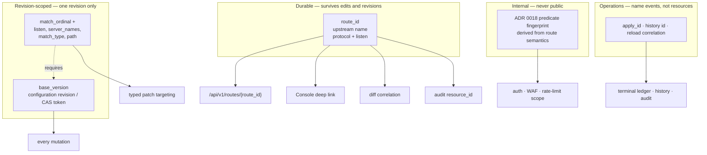
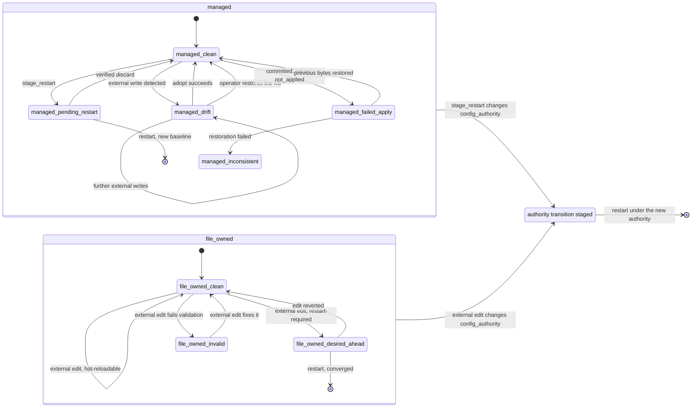

# ADR 0019 — Configuration authority, generated contracts, resource identity and remote automation

- **Status:** Accepted
- **Date:** 2026-08-24
- **Deciders:** Jul.IA maintainer
- **Applies to:** configuration ownership and persistence, the file watcher and SIGHUP, managed apply,
  drift and adoption, configuration history and rollback, planned restart, durable resource identity,
  the typed patch API, route projections, the admin HTTP surface, generated machine contracts, the
  Console, the CLI, and every future external automation client
- **Source:** #118 (`[ADR][CGC-05]`), re-audit of `main` at `44cc6eb1`
- **Related:** [ADR 0018](0018-bounded-route-matching-and-response-policy.md) (delegates durable route
  identity here, and freezes `match_ordinal` as a revision-scoped selector),
  [ADR 0011](0011-reload-plan.md) (one reload transaction, one closed-world lifecycle registry),
  [ADR 0014](0014-operability-surfaces.md) (one backend implementation behind every surface),
  [ADR 0015](0015-managed-apply-terminal-ledger.md) (managed apply identity and terminal outcomes),
  [ADR 0009](0009-two-tier-editing.md) (Quick vs Designer editing),
  [ADR 0010](0010-console-rbac.md) (admin RBAC), [ADR 0016](0016-inbound-identity-and-backend-peer-trust.md)
  (`config:trust` and the listener-granularity endpoint this record generalizes),
  [ADR 0013](0013-project-operating-model-and-completeness.md) (portfolio entry, D13, D14)

## Revision log

| Date | Change |
| --- | --- |
| 2026-08-24 | Initial record. |

## Context

#118 was written on 2026-08-03 against baseline `66c71b2d`. It records two accepted decisions —
D13 (an explicit `managed`/`file_owned` authority mode) and D14 (generated machine contracts derived
from the server-side schema authority) — and asks this record to fix the exact names, states,
artifacts, API surface and CLI contract so that #148, #149, #150 and #151 can be implemented without
inventing public semantics.

Four things have changed since that text was written, and each of them changes what this record has
to do.

**ADR 0018 is accepted, and it delegated a decision here.** ADR 0018 §14 fixes `match_ordinal` as a
CAS-bound, revision-relative *selector* and explicitly not an identity, moves internal auth/WAF/rate
scopes onto a canonical predicate fingerprint, and states that *"a durable external route identity is
deferred to ADR 0019"*. #118's original scope contains no resource-identity section at all. It does
now, and a record that deferred route identity a second time would leave #147 and #150 unable to
proceed — which is precisely the failure mode an accepted ADR exists to prevent.

**#89 landed, so the schema and lifecycle authority D14 depends on already exists.**
`internal/config/inventory.go` produces 322 canonical schema paths and 274 leaves, deterministically
and independently of build tags. `internal/lifecycle` holds 274 registry entries across 49
subsystems and five classes, renders them to three committed mirrors, and proves determinism,
secret-freedom and check-mode non-mutation in Go tests. D14's remaining work is a *rendering* problem,
not an authority problem, and this record must say so rather than re-opening it.

**Phase 5 landed, so the managed write path already has most of the machinery D13 assumes.**
`ConfigApplyCoordinator` serializes every managed write behind one mutex, keeps the exact previous
raw bytes, runs preflight before persisting, writes atomically, suppresses the watcher echo of its own
write, submits a correlated reload, waits for the terminal outcome, and restores the previous bytes on
a pre-`Publish` failure. It already performs a compare-and-swap against the on-disk baseline
immediately before writing, and already refuses a hot apply while a planned restart is pending. D13
does not need a new engine. It needs an ownership rule layered onto the one that exists.

**The audit falsified two assumptions in the issue text.** Both are recorded below because a design
built on either would have been wrong.

### Four facts from the re-audit that shaped this record more than the issue text did

**Jul today has two authoritative writers, and the file watcher is one of them.** #118 says external
file changes "can race managed writes", which understates it: an external edit to a *hot-reloadable*
field is not a race, it is the documented supported workflow. `docs/reload-semantics.md` states that
*"direct file edits followed by SIGHUP are safe for hot-reloadable changes"*, and `WatchFile` plus the
fan-in in `internal/app/wiring.go` reload the process from whatever is on disk. `external_divergence`
— the one existing drift state — is set only by `pendingRestartCheck`, which compares *startup-bound*
subsystems against the startup fingerprint. A hot-reloadable external edit therefore produces no
drift signal at all, because it has already been adopted. Making `managed` the unconditional default
would silently remove a documented workflow from every existing deployment on upgrade. §9 resolves
this with a derived default rather than by weakening the ownership rule.

**`ServerConfig.Name` is not a latent server identity, and the lifecycle registry already says so.**
The field exists (`Name string \`toml:"name"\``), but no validator reads it: there is no requiredness
check, no uniqueness check, no character-set bound and no length bound anywhere in
`internal/config/validate*.go`. Its single consumer is `RouteProjection.Name` in
`internal/admin/projections.go`. The registry entry is explicit about what it is:

```go
hot("servers.*.name", SubServerIdentity, "the block label appears only in configuration
    projections, which are rebuilt from the effective config on each reload"),
```

Every operational path — `findServerTarget`, `findServerByNames`, `serverIndex` in the diff,
`AuthScope`, `WAFScope`, the rate-limit scope, and the shared-listener consistency rules — keys on
`(listen, server_names)` instead. Promoting `name` to a public resource key would mean adding
requiredness, uniqueness and a grammar to a field that thousands of existing configurations either
omit or set to a duplicate human label. §5.3 rejects it on that evidence.

**An optional identity field can be added without rewriting anybody's routes, and this was measured
rather than assumed.** The concern that a managed configuration would be mass-rewritten to carry IDs
rests on how `config.Marshal` behaves. A characterization probe written for this record confirms two
properties of `go-toml/v2` as vendored: `omitempty` is honoured on a string field inside an
array-of-tables, so an absent `route_id` produces no key at all; and declaration order of the
array-of-tables survives a `Marshal`/`Unmarshal` round trip unchanged. The probe also confirms the
inverse, which matters just as much: fields *without* `omitempty` are emitted at their zero value, so
`config.Marshal` already writes `name = ''` for every unnamed server. A structured patch apply
therefore already rewrites the whole file canonically and already discards comments — a pre-existing
property this record documents (§11) rather than introduces.

**The admin listener has no transport security whatsoever.** `AdminConfig` has `enabled`, `listen`,
`token`, `rbac`, `console`, history, rate-limit, audit and plugin-upload fields — and no TLS field, no
certificate field and no client-certificate field. `internal/admin/mtls.go` projects the *data
plane's* mTLS state; it does not secure the admin listener. The server logs a warning when the admin
listener binds off-loopback, and `docs/deployment.md` treats loopback as the assumption. #151 asks for
a remote mutating CLI. This record will not promise one over a plaintext bearer-token endpoint; §28
makes admin transport security an explicit hard prerequisite instead.

## Existing architecture

### Configuration writers

Every path on `main` that can influence desired configuration state. A missed writer would invalidate
the authority model, so this table is the inventory #148 §1 asks for, resolved here.

| Writer/source | Where | Reads | Writes | Persists | Reloads | Authority today | Side effects |
| --- | --- | --- | --- | --- | --- | --- | --- |
| Startup load | `cmd/jul` → `app.Serve` → `src.Load()` | config file | — | no | n/a | file | builds the startup candidate and fingerprint |
| SIGHUP | `internal/signals` → `wiring.go` fan-in | config file at swap time | — | no | yes | **file (adopts)** | restart-required checks run at swap; failure leaves the old generation |
| File watcher | `config.WatchFile` → `wiring.go` fan-in | config file at swap time | — | no | yes | **file (adopts)** | parent-directory watch, 200 ms debounce, one-shot echo suppression |
| Raw admin apply | `POST /api/config/apply`, `/api/config/raw` → `ConfigApplyCoordinator.ApplyRaw` | request body + on-disk baseline | config file, **verbatim bytes** | yes | yes | admin | history snapshot, audit, ledger record, echo suppression |
| Structured patch apply | `POST /api/config/patch/apply` → `deps.ApplyConfig` → `ApplyRaw` | ops + baseline | config file, **`config.Marshal` canonical bytes** | yes | yes | admin | as above; comments and formatting are lost |
| Settings/wizard editors | `/api/config/settings`, `/api/wizard*` | baseline | via the same coordinator | yes | yes | admin | as above |
| Listener client-address patch | `PATCH /api/listeners/{addr}/client_address` | baseline | via the same coordinator | yes | yes | admin | writes every sibling `[[servers]]` block atomically; `config:trust`; own audit category |
| History rollback | `POST /api/history/rollback`, `/api/config/rollback` → `rollbackToSnapshot` | snapshot + baseline | config file | yes | yes | admin | serialized under `applyMu`; CAS on `base_version`; snapshots the current config first |
| Planned-restart stage | `mode = "stage_restart"` → `PlannedRestartStore` | baseline | config file **plus** `<cfg>.pending-restart.json` and `<cfg>.pending-restart.bak` | yes | no | admin | marker `prepared` → `staged`; crash recovery reconciles at startup |
| Planned-restart discard | `POST /api/config/pending-restart/discard` | marker, disk, live version | restores `.bak` over the config file | yes | no | admin | verified discard; refuses on digest mismatch |
| Failed-apply restoration | `restorePreviousLocked` | previous raw bytes | config file | yes | no | admin | only for managed writes; records a `recovery` history snapshot when it fails |
| Startup reconciliation | `PlannedRestartStore.Reconcile` via `OnInitialGenerationReady` | marker + disk | marker; possibly the config file | yes | no | admin | promotes or repairs a `prepared` marker |
| `jul fmt -w` | `cmd/jul/cli.go` | config file | config file (canonical) | yes | no | **external, offline** | not a running-server writer; the watcher sees it as an external edit |
| `jul import -o` | `cmd/jul/cli.go` | NGINX source | new TOML file | yes | no | **external, offline** | never applies |
| Test helpers | `internal/admin`, `internal/app` tests | fixtures | temp files | yes | varies | n/a | not a production writer |

Two properties of that table matter more than the rest. Every persistent write goes through
`atomicfile.Write` — same-directory temp file, `fsync`, `chmod`, rename, best-effort directory
`fsync`, `0o600` for a new file and the existing mode preserved for an existing one — so no writer
can leave a truncated configuration behind. And every *managed* write is serialized behind
`applyMu`/`c.mu` and performs a compare-and-swap against the on-disk baseline immediately before the
rename:

```go
// internal/app/config_apply.go
changed, currentVersion, verifyErr := c.verifyBaselineLocked(baseline)
if changed {
	c.mu.Unlock()
	return c.conflictResult(mode, persistedVersion, desiredVersion, currentVersion), nil
}
if err := atomicfile.Write(c.Path, data, 0o600); err != nil {
```

That CAS is the foundation §12 builds drift detection on. It exists, it is tested, and this record
adds an ownership rule above it rather than a second mechanism beside it.

### Resource addressability

How every externally addressable configuration resource is identified on `main`.

| Resource | Go type | Current locator/key | Uniqueness validated? | Mutable? | Admin endpoints addressing it |
| --- | --- | --- | --- | --- | --- |
| Configuration revision | — | `CanonicalVersion` = first 8 bytes of `sha256(config.Marshal(cfg))`, hex | n/a (derived) | n/a | `base_version` / `current_version` on every mutating endpoint |
| HTTP server / vhost | `ServerConfig` | `(listen, server_names)`, `server_names` compared as an unordered set | no explicit rule; `findServerByNames` rejects an ambiguous target at call time | yes — both coordinates | typed patch targets; `GET /api/routes` |
| Route / location | `LocationConfig` | `(listen, server_names, match_type, path)`; ADR 0018 adds `match_ordinal` + `base_version` | no; `findLocation` rejects ambiguity at call time | yes — every coordinate | typed patch targets; `GET /api/routes`; `POST /api/routes/test` |
| Listener | — (no `[[listeners]]` block) | the listen address; `CanonicalListenAddr` is `strings.TrimSpace` | implicitly, by cross-block consistency rules | yes | `GET /api/listeners`, `GET|PATCH /api/listeners/{addr}/client_address` |
| Upstream pool | `UpstreamConfig` | `name` | **yes** — required and duplicate-rejected in `Validate()` | yes | `GET /api/upstreams`, `GET /api/upstreams/{name}/resilience` |
| Upstream backend | `UpstreamServer` | `address` within a pool | **no** — duplicate addresses are legal (weighting) | yes | none individually |
| Discovery endpoint | runtime only | provider-specific | n/a | n/a | none; never persisted |
| L4 stream | `StreamServer` | `(protocol, listen)`, protocol defaulting to `tcp` | **yes** — duplicate rejected in `validateStreams` | yes | `GET /api/streams` |
| Plugin | `map[string]PluginConfig` | map key | structurally, by the map | key is the identity | `GET /api/plugins`, `POST /api/plugins/upload` |
| RBAC role / principal | `AdminRole`, `AdminPrincipal` | `name` | **yes** — required, unique, `[a-zA-Z0-9._@-]`, predefined names reserved | yes | none individually |
| Certificate | runtime projection | subject/path | n/a | n/a | `GET /api/certs`, `GET /api/tls` |
| Managed apply operation | `ManagedApplyRecord` | `apply_id` = `rl_<instance>_<seq>` | process-unique by construction | no | `GET /api/config/applies/{id}` |
| History revision | history file | `id` = `20060102T150405.000Z`, `_n` on collision | directory-unique by construction | no | `GET /api/config/history/{id}`, `/{id}/diff`, rollback |
| Reload transaction | `ReloadResult` | correlated to `apply_id` | n/a | no | embedded in apply results |

And how routes are keyed *internally*, which is a different question the record must keep separate:

| Consumer | Key | File |
| --- | --- | --- |
| Typed patch target | `(listen, server_names, match_type, path)` | `internal/admin/patch_helpers.go` `findLocation` |
| Diff correlation | `"<match_type> <path>"` within a server keyed `"<first server_name> <listen>"` | `internal/admin/diff_helpers.go` `locationKey`, `serverIndex` |
| Lint duplicate rule | `match_type + "\x00" + match_path` | `internal/config/lint.go` |
| Auth / WAF scope | `listen + "\|" + join(server_names) + "\|" + match.path` | `internal/app/wiring.go` `AuthScope`, `WAFScope` |
| Rate-limit scope | `"loc:" + listen + "\|" + join(server_names) + "\|" + match.path` | `internal/app/factory.go` |

ADR 0018 §14 already replaces the last two with a canonical predicate fingerprint. This record does
not touch that decision; §6 states why the fingerprint must not become the public identity.

### Admin surface, contracts and CLI

| Concern | Where | State before this record |
| --- | --- | --- |
| Route catalog | `internal/admin/route_catalog.go` | 63 `RouteSpec` entries; `Pattern`, `Methods`, `Permissions`, `Permission`, `AnyPermissions`, `Public`, `Authenticated`, `Handler`. A guard test derives the mux from it. **No internal/external classification field.** |
| RBAC | `internal/rbac` | 17 permissions plus `*`; 401 unauthenticated, 403 forbidden, 503 when RBAC is desired but no policy built |
| Admin transport | `internal/admin/server.go` | plaintext HTTP, bearer token or RBAC principals, loopback assumed, warning when bound elsewhere. **No TLS, no mTLS.** |
| Error shapes | `internal/admin` | five structured shapes (`validationErrorResponse`, `conflictResponse`, `adminGuardResponse`, `patchOperationFailureResponse`, `ConfigApplyResult`) plus ad-hoc `map[string]string{"error": …}`. **No stable machine codes, no request correlation id.** |
| Optimistic concurrency | apply, patch, rollback | optional `base_version`; 409 with `current_version` on mismatch; omitted means force |
| Apply outcomes | `internal/server/reload_result.go` | `applied_live`, `applied_degraded`, `not_applied`, `saved_not_live` |
| Pending restart | `internal/app/planned_restart.go` | `none`, `managed_staged`, `external_divergence`, `inconsistent` |
| Schema inventory | `internal/config/inventory.go` | `SchemaPaths()` 322, `SchemaLeaves()` 274, build-tag independent |
| Lifecycle authority | `internal/lifecycle` | 274 entries, 49 subsystems, 5 classes, 8 flags; `lifecyclegen`; `make lifecycle-generate` / `make generated-check` |
| Generated artifacts | `docs/generated/` | `config-lifecycle.json`, `config-lifecycle.md`, plus `docs/config-lifecycle.yaml` |
| Value contract | `docs/config-value-contract.json` | 110 audited enum/grammar/bound entries, checked by `internal/config/value_contract_test.go` |
| JSON Schema / OpenAPI | — | **neither exists** |
| Capabilities | `cmd/jul/capabilities*.go` | 13 build-tag features plus the exit-code table, emitted by `jul capabilities --json` |
| CLI | `cmd/jul` | `lint`, `fmt`, `run`, `serve`, `check`, `healthcheck`, `import`, `version`, `capabilities`, `completion`; exit codes 0/1/2; `healthcheck` is the only HTTP client |

## Constraints from accepted decisions

1. **ADR 0018 §14.** `match_ordinal` is a 0-based, declaration-order-relative selector, meaningful
   only within one configuration revision, requiring `base_version`, rejected when that is absent or
   stale, and **explicitly not identity**. The canonical predicate fingerprint is internal
   correlation and state identity. Neither may be persisted or exported as a durable resource name.
   This record consumes both and redefines neither.
2. **ADR 0018 routing representation.** Declaration order of `match.headers`, `match.query` and
   `response_headers` is contract; omitted and explicit-empty are distinct everywhere; `op` is a
   closed enum; server-side validation is authoritative; the Console implements no matching or CORS
   logic. Generated contracts and API DTOs must preserve all of it.
3. **ADR 0011.** One reload transaction, one closed-world lifecycle registry. Every field introduced
   here gets exactly one registry entry and can only become live through `Publish`.
4. **ADR 0014 and #108.** One server-side implementation behind raw TOML, the typed API, the Console
   and the CLI. A remote client is a client.
5. **ADR 0015.** Managed apply already owns an operation identity (`apply_id`) and a terminal ledger.
   This record adds no second operation-identity namespace.
6. **D03.** Unknown TOML fields fail immediately everywhere. There is no permissive mode, and
   generated contracts must not imply one.
7. **#89.** The Go lifecycle registry and `SchemaPaths()` are the machine authority. Generated
   artifacts are mirrors. No second field registry.
8. **D13.** `managed` and `file_owned` are the two initial values; `controller_owned` stays
   validation-rejected; authority is restart-bound; managed never silently adopts; file-owned is never
   rewritten by Jul.

## Decision summary

1. **D14 is widened** to cover resource identity and addressability alongside generated contracts, so
   identity is no longer architecturally orphaned and no second identity registry appears (§1).
2. **Seven identity namespaces are named and separated**, and it is a defect for any surface to
   conflate them (§2).
3. **Every configuration resource is classified** into one of six identity classes. Route identity is
   *decided*; every other resource is *audited and classified*, and only one of them changes (§3–§5).
4. **`route_id` is added**: optional, on `[[servers.locations]]`, globally unique within one
   configuration, durable across route-semantic edits, never derived from mutable content, never
   written into file-owned configuration, and minted by Jul only when a managed structured API call
   *creates* a route (§4).
5. **`[global].config_authority` is the authority field.** Its default is **derived**: `managed` when
   `[admin].enabled` is true, `file_owned` otherwise. An explicit value always wins. It is
   restart-bound (§9).
6. **In managed mode, neither the file watcher nor SIGHUP adopts an external edit.** Both report typed
   drift. Adoption is one explicit, authenticated, CAS-bound operation that reuses the whole Phase 5
   pipeline (§11–§14).
7. **In file-owned mode, every mutating endpoint fails closed before any side effect** with one stable
   error, and Jul never writes the configuration file (§15).
8. **Generated contracts gain three artifacts** — JSON Schema, machine metadata and a factual
   reference — all rendered from `SchemaPaths()` plus one bounded metadata table, all deterministic
   and drift-checked (§19–§23).
9. **`/api/v1` is a new, deliberately small external namespace** aliasing existing handlers. Existing
   `/api/…` routes are declared internal and unstable (§24–§25).
10. **One error envelope with bounded machine codes** is frozen for the external namespace (§26).
11. **Remote mutation is blocked on admin transport security**, which this record declares a hard
    prerequisite and does not design (§28).
12. **The remote CLI is a thin client** with a frozen JSON envelope and a small exit-code set (§31–§33).

## Decision

### 1. D14 is widened; no new decision number is created

D14 currently reads:

> JSON Schema, lifecycle/capability metadata and factual reference derive from the server-side
> schema/metadata authority; no second field registry.

It is replaced in the #62 register by:

> **D14 — Generated machine contracts and resource identity/addressability.** JSON Schema,
> lifecycle/capability/identity metadata and factual reference derive from the server-side
> schema/metadata authority; every externally addressable configuration resource has exactly one
> explicit identity model — durable identity, natural key, or revision-scoped selector — and no
> second field registry or identity registry exists.

Primary issues become #89, #128, #147, #149, #150, #151.

**Why widen rather than add D17.** D17 is free, so numbering was not the reason. The reason is that
the two halves of this decision are the same decision seen from two sides. "Which field is the
identity of this resource" is a fact about the configuration schema, and the *only* defensible place
to record it is the same authority that already records type, lifecycle, capability and secrecy for
every leaf — otherwise Jul acquires precisely the second registry #89 was created to prevent. The
consumers are also the same: #149 renders the metadata, #150 consumes the addressability, #147 and
#151 target resources with it. Two register rows pointing at one ADR with overlapping scope would
describe a separation that does not exist in the implementation.

**What widening D14 does not do.** It does not make identity a documentation-generation concern.
`route_id` is a real configuration field with real validation, and §4 is a public-contract decision
of the same weight as D12 or D13. D14's widened text records where identity *lives*; §4 records what
it *is*.

### 2. Seven namespaces, and conflating them is a defect

Jul now has seven distinct kinds of identifier. They are listed together, once, because every one of
the failure modes this record exists to prevent begins with two of them being treated as
interchangeable.

| Namespace | Example | Answers | Stable across revisions? | Public? |
| --- | --- | --- | --- | --- |
| **Schema path** | `servers.*.locations.*.match.headers` | *where in the configuration structure?* | yes | yes — generated contracts |
| **Lifecycle keying** | `AddressKeyed`, `CollectionKeyed` | *how does this field behave across a reload?* | yes | yes — lifecycle metadata |
| **Durable resource identity** | `route_id`, upstream `name` | *which logical resource?* | **yes** | yes — API, Console, diff, audit |
| **Revision-scoped selector** | `match_ordinal` + `base_version` | *which element of this exact revision?* | **no** | yes — patch targeting only |
| **Internal semantic fingerprint** | ADR 0018's predicate fingerprint | *which runtime scope owns this state?* | derived; changes with semantics | **no** |
| **Configuration revision / CAS token** | `base_version`, `current_version` | *against which state?* | it *is* the state | yes |
| **Operation identity** | `apply_id`, history `id`, reload correlation | *which operation?* | yes, but names an event | yes |

Four rules follow, and they are contract:

1. **A schema path is not a resource identity.** `servers[0].locations[2]` is a location in a
   document, not a route.
2. **A lifecycle key is not a resource identity.** `CollectionKeyed` exists so that a fingerprint
   comparison considers only elements present on both sides. It classifies *reload behaviour*. It
   happens to be derived from coordinates that resemble identity, and that resemblance is a trap.
3. **A revision-scoped selector is never durable.** ADR 0018 already froze this for `match_ordinal`.
   No surface may present one as a resource name, persist one, or correlate across revisions with one.
4. **Resource identity and revision identity answer different questions and are always both present
   on a mutation.** Identity answers *which resource*; CAS answers *against which state*. An API that
   accepts one without the other is either unsafe or unusable.

The separation, drawn once so that no future contributor has to reconstruct it from prose:



The four boxes are disjoint by contract: a durable identity is never derived from the fingerprint,
never substituted by a selector, and never confused with an operation id. Nothing may convert one
into another.

### 3. Resource identity taxonomy

Six classes. Every configuration or runtime resource lands in exactly one.

| Class | Meaning | Examples |
| --- | --- | --- |
| **Durable natural key** | an existing field is already stable, unique and validated identity | upstream `name`, plugin map key, RBAC role/principal `name` |
| **Explicit durable ID** | identity independent of mutable semantics, because no natural key exists | `route_id` |
| **Composite natural key** | a validated tuple of fields is the identity; changing any member is delete + create | `[[stream]]` `(protocol, listen)`, listener `listen` |
| **Revision-scoped selector** | exact targeting inside one known revision, never durable | `match_ordinal` + `base_version`; `(listen, server_names, match_type, path)` |
| **Internal fingerprint** | derived, used for runtime state correlation, never public | ADR 0018's predicate fingerprint |
| **Ephemeral runtime identity** | exists for one runtime generation or discovery instance; must never become persistent configuration identity | discovered backends, handler generations |
| **No public identity required** | the projection has no individually addressable resource | certificate projections, per-backend entries |

The classification is applied in §5. It exists to make the *absence* of an ID a positive decision
rather than an oversight, which is the discipline #118 asks for and the reason this record adds
exactly one identifier.

### 4. `route_id`

ADR 0018 delegated this decision here, so this section decides it completely.

#### 4.1 Home and name

```toml
[[servers.locations]]
route_id = "public-api"
proxy_pass = "http://api"

[servers.locations.match]
type = "prefix"
path = "/api/"
```

The field is `route_id`, on `LocationConfig`, as a sibling of `match` and the action fields.

`route_id` is chosen over a generic `id` for two reasons. Jul's configuration has no other `id`
field, so a bare `id` would be the first member of a namespace this record explicitly declines to
create — the moment a second resource gains one, `id` on a location and `id` on something else are
two grammars sharing a name. And the field must remain readable when a location grows further
semantics: `route_id` still says *this identifies the route* after ADR 0018's predicates, response
policy and CORS have all landed on the same block, whereas `id` increasingly reads like a property of
whatever the reader was last looking at. The cost of the choice is a slightly longer key; the cost of
the alternative is a permanent ambiguity in a public schema.

The Go field is a pointer:

```go
RouteID *string `toml:"route_id,omitempty"`
```

A pointer because ADR 0018 froze the rule that omitted and explicit-empty are distinct everywhere and
must not collapse. `route_id = ""` is present-and-empty; §4.4 rejects it. A plain `string` could not
tell that apart from absence, and silently reading it as absence would leave a route the operator
believed was addressable with no durable identity and a broken deep link. `AdminConfig.Console *bool`
and `LocationConfig.RateLimit *RateLimitConfig` are the existing precedent for this shape.

#### 4.2 Optional, permanently

`route_id` is optional and will not become required.

Making it required would invalidate every configuration in existence, every example in the
documentation, every fixture in `testdata/`, and every file a GitOps pipeline currently ships — to
buy an API convenience. It would also be unenforceable in the direction that matters: a file-owned
configuration is authored outside Jul, so "required" would mean *Jul refuses to start*, which is a
disproportionate response to a missing label on a route that works.

The consequence is stated rather than hidden: **a route without `route_id` has no durable identity**,
and every surface must represent that truthfully. §4.13 and §24 define exactly what such a route can
and cannot do.

#### 4.3 Uniqueness scope: global within one configuration

A `route_id` is unique across the entire configuration document — every `[[servers]]` block, every
`[[servers.locations]]`. A duplicate is a **validation error**, not a lint finding, naming both
locations by schema path.

Per-server uniqueness was considered and rejected. It would make the API resource name a composite of
the route ID *and* the server coordinates, and those coordinates are mutable route semantics — the
exact thing §2 rule 4 and #118 §19 forbid encoding into a supposedly stable URI. `/api/v1/routes/{route_id}`
only works if `{route_id}` alone resolves. Global uniqueness also makes diff correlation, Console deep
links, audit attribution and CLI targeting one lookup instead of four, and makes "this ID moved to a
different vhost" expressible as a modification of one resource rather than as a delete plus a create.

The cost is real and is accepted: an operator who copies a `[[servers]]` block to add a second vhost
must change the route IDs in the copy. Validation names both sides, so the failure is immediate and
self-explanatory rather than latent.

#### 4.4 Syntax

| Rule | Value |
| --- | --- |
| Length | 1–64 bytes |
| Alphabet | `a`–`z`, `0`–`9`, `-`, `_` |
| First character | `a`–`z` or `0`–`9` |
| Case | lowercase only; an uppercase character is **rejected**, never folded |
| Whitespace | rejected, including leading and trailing |
| Present-and-empty (`route_id = ""`) | **rejected** |
| Comparison | byte-exact |
| Normalization | none — validation rejects rather than rewrites |

The alphabet is a strict subset of RFC 3986 unreserved characters, so a `route_id` is safe in a URI
path segment, a query parameter, a JSON string, a shell argument and an HTML attribute without
escaping in any of them. That is the whole reason the grammar is bounded: an identifier that appears
in `/api/v1/routes/{route_id}` and in a Console deep link must not require five different escaping
rules to be correct in five different places.

Rejecting uppercase rather than folding follows ADR 0018 §2's method rule and for the same reason:
mechanical rewriting means the value in the operator's file is not the value the system uses, so a
`grep` for the ID they wrote finds nothing. Rejecting is one error message; folding is a class of
confusion.

#### 4.5 Operator slugs and minted IDs share one grammar

Both are legal. `public-api` is a valid `route_id`; so is `r-k7m2q9x4vb8nfp3jd6ths5wzy0`. There is no
second field, no flag distinguishing them, and no surface that treats them differently.

Two grammars were rejected. A readable-slug-only rule cannot be minted safely (§4.6). An
opaque-only rule would force an operator hand-writing TOML to invent a random string, which they
would inevitably make meaningful anyway, and Jul would have banned the thing it could not prevent.
One bounded grammar that admits both is smaller than either and has no undefined case.

#### 4.6 Who may create an ID

| Creator | May mint? | Notes |
| --- | --- | --- |
| Operator, editing TOML | yes | any value satisfying §4.4 |
| Managed structured API — **route creation** | **yes** | mints when the request omits one; §4.7 bounds when |
| Managed structured API — route *edit* | no | preserves what is there; never adds |
| Managed raw apply | no | the bytes are the operator's |
| Adoption of an external file | no | the bytes are the external source's |
| NGINX importer | no | §35 |
| File-owned mode, any path | **never** | §15 |
| Jul at startup, parse, validate, reload | **never** | §4.7 |

A minted identifier is:

> `r-` followed by **26 characters** of unpadded lowercase RFC 4648 base32 encoding **128 bits** read
> from `crypto/rand`.

Total length 28, inside §4.4's bound and grammar. The `r-` prefix makes a minted ID recognisable at a
glance without being semantically load-bearing — nothing may parse it.

**It carries no timestamp and encodes nothing about the route.** A ULID or a UUIDv7 would embed
creation time, which leaks operational history into a configuration file, invites clients to sort by
it, and would eventually be treated as a creation-order contract that Jul never promised. Random is
enough: at 128 bits the collision probability is negligible, and validation rejects a duplicate
anyway, so the failure mode is a rejected write rather than a corrupted identity space.

**A minted ID is never derived from route content.** This is the hard constraint #118 §11.6 states
and it is worth restating in the form that catches the tempting mistake: a digest of the route's
matcher, path, action or coordinates is a *fingerprint*, and a fingerprint changes when the content
changes, which is exactly when a durable identity must not. So are the slice index, the source line,
the route coordinates and `match_ordinal`. None of them is an identity, and none of them may be
presented as one.

**The NGINX importer emits no `route_id`, and that is the honest output.** `jul import` is a
translation tool whose output must be reproducible: running it twice on the same source must produce
the same bytes, so injecting random identifiers is not available. The alternative — deriving an ID
deterministically from the NGINX source location or the translated route's content — would produce a
value that is a stable *import key* and not a durable identity: it survives re-running the importer,
and stops meaning anything the first time an operator edits the route it names. Claiming durability
the value does not have is worse than omitting it. Imported routes therefore arrive without IDs, are
fully usable through the revision-scoped selector (§4.13), and acquire durable identity when and if
an operator assigns one.

#### 4.7 Minting never happens during a read

Minting occurs at exactly one place: while a managed structured route-creation operation is building
its candidate, before that candidate is validated and persisted, inside the write path that already
holds `applyMu`. The generated value is part of the candidate the operator previews, part of the
bytes that are persisted atomically, and part of the diff.

The following **must not** mint, and each is listed because each is a plausible place to put it:

- parsing (`config.Parse`) and `applyDefaults`;
- validation and `jul check`;
- `jul lint` and `jul fmt`;
- schema, metadata and reference generation;
- any status, projection or diff read;
- SIGHUP, file-watch, and any reload;
- adoption of an external file (§14);
- startup and planned-restart reconciliation.

The rule has a one-sentence justification: **a read that invents durable identity makes the identity
depend on who looked at the configuration and when**, which is not identity. It also has a mechanical
consequence worth naming — `config.Parse` must stay free of `crypto/rand`, so the property is
testable by construction rather than by review.

#### 4.8 Changing an ID is delete plus create

Jul does not prevent an operator from editing `route_id` in raw TOML — it is their file, and a
gateway that refused the edit would be claiming an ownership it does not have over a text file. But
every surface interprets the change the same way:

> **Changing or removing a `route_id` ends one logical resource and, if a new ID appears, begins
> another.**

There is no rename operation, and the typed API offers none. Diff renders a removal and an addition
(§7). History shows the old resource ending. A Console deep link to the old ID becomes a
resolvable-but-absent resource, not a silent redirect. Audit records both events.

The alternative — treating an ID change as a rename when the route's content is otherwise identical —
was rejected because it makes identity depend on content comparison, which is the fingerprint model
wearing an identity's clothes. It would also mean two operators who independently changed an ID and a
matcher in one edit get different correlation results depending on which change the differ noticed
first.

#### 4.9 Reuse after deletion is permitted, and the limitation is documented

An ID may be reused after the route carrying it is deleted. Jul keeps no tombstone registry.

A tombstone registry would be permanent state, would need its own persistence, ownership, pruning,
backup and authority-transition semantics, and would be unenforceable the moment an operator edits
raw TOML or restores a file from backup — which is a supported workflow in both modes. It would buy
protection against an ABA sequence that `base_version` already covers for every mutation: a client
holding a stale revision cannot act on it at all, whether or not an ID was reused in between.

The residual is stated plainly rather than left to be discovered: **a Console deep link or an audit
entry that names a deleted `route_id` may, after a later edit, resolve to a different logical route
that reuses the string.** History entries are bound to a configuration revision, so historical
records remain unambiguous; live deep links are not, and the Console must therefore show the route's
current content rather than assume continuity.

#### 4.10 `route_id` has no effect on routing

It does not participate in matching, candidate enumeration, precedence, tie-breaking, CORS,
proxying, or any per-request decision. It is control-plane metadata. The compiled router does not
carry it, so the request hot path cannot observe it and cannot be slowed by it.

#### 4.11 Internal runtime scopes keep the predicate fingerprint

ADR 0018 §14 keys `AuthScope`, `WAFScope` and the per-location rate-limit scope on a canonical
predicate fingerprint. **That decision stands unchanged, and `route_id` does not replace it.**

Replacing it was considered and is rejected on four grounds, any one of which is sufficient:

- **Most routes have no ID.** `route_id` is optional and file-owned configuration may never receive
  one, so an ID-keyed scope needs a fallback for the common case — which means the fingerprint has to
  exist anyway, and now there are two keying schemes instead of one.
- **The semantics are wrong in the direction that matters.** A rate-limit bucket carries live state.
  Resetting it is correct exactly when the route's *matching behaviour* changes, which is what the
  fingerprint tracks. An ID-keyed bucket survives a matcher rewrite that makes it a different route,
  handing accumulated limiter state to traffic it was never measuring.
- **Renaming would silently reset security state.** Under an ID-keyed scope, editing a `route_id` —
  a control-plane label with no routing effect (§4.10) — would rebuild the auth and WAF scope and drop
  the rate-limit bucket. A field documented as having no runtime effect would have one.
- **It would make identity load-bearing for security.** §28 requires the opposite: an identifier is
  never an authorization or isolation mechanism.

The two mechanisms coexist because they answer different questions, and the record says so in §2.

#### 4.12 `route_id` is never a metric label

Predicate values, header values, query values and origins are already excluded from telemetry labels
by ADR 0018. `route_id` joins them. A stable identifier does not make an unbounded label bounded: an
operator with ten thousand routes has ten thousand label values, and the fact that they are now
*durable* makes the cardinality problem permanent rather than transient. Route identity appears in
the route-test diagnostic, the API, the diff, history and audit — all of which are bounded, requested
surfaces — and nowhere in `/metrics`.

#### 4.13 What a route without a `route_id` can do

This is the compatibility contract, and it is deliberately generous.

| Capability | With `route_id` | Without |
| --- | --- | --- |
| Serve traffic | yes | yes — identical |
| Appear in projections and diffs | yes | yes |
| Be edited through the typed API | yes | yes — via the ADR 0018 selector plus `base_version` |
| Be addressed as `/api/v1/routes/{route_id}` | yes | **no** — collection-only |
| Carry a stable Console deep link | yes | **no** — the link is revision-bound and may become stale |
| Correlate across revisions in a diff | by ID | best-effort, by ADR 0018's internal fingerprint |
| Be targeted by `jul … --route-id` | yes | **no** — the selector flags are used instead |
| Produce a lint suggestion to add one | n/a | yes, informational severity, in managed mode only |

The lint finding is informational and managed-only on purpose. In file-owned mode Jul is a guest in
someone else's file, and a warning that the operator cannot act on without changing their pipeline is
noise, not guidance.

### 5. Every other resource: audited, classified, and almost entirely unchanged

The commitment here is deliberately asymmetric. Route identity had to be decided, because ADR 0018
delegated it and #147 and #150 consume it. Every other resource is audited and classified so that the
absence of an identifier is a recorded decision — but **no other resource gains a field.** The only
other change is that one rule every consumer already relies on is written down (§5.4).

| Resource | Identity class | Public representation | Persistence owner | Mutable? | Cross-revision? | Change in this record |
| --- | --- | --- | --- | --- | --- | --- |
| Route / location | **explicit durable ID**, else revision-scoped selector | `route_id`, else `(listen, server_names, match_type, path, match_ordinal)` + `base_version` | config owner | ID no, coordinates yes | yes when the ID is present | **`route_id` added** |
| Upstream pool | durable natural key | `name` | config owner | rename = delete + create | yes | none |
| Upstream backend | no public identity required | position within a pool | config owner | yes | no | none |
| Discovery endpoint | ephemeral runtime identity | provider address | **runtime only** | n/a | no | none |
| HTTP server / vhost | revision-scoped selector | `(listen, server_names)` | config owner | yes | no | none; §5.3 |
| Listener | composite natural key | `listen` | config owner | relocation = delete + create | yes | `CanonicalListenAddr` stated as the identity form; §5.4 |
| L4 stream | composite natural key | `(protocol, listen)` | config owner | relocation = delete + create | yes | none |
| Plugin | durable natural key | map key | config owner | rename = delete + create | yes | none |
| RBAC role / principal | durable natural key | `name` | config owner | rename = delete + create | yes | none |
| Certificate | no public identity required | projection only | runtime | n/a | no | none |
| Configuration revision | CAS token | `base_version` | config authority | it is the state | no — it *names* a state | none |
| Managed apply operation | operation identity | `apply_id` | runtime ledger | no | operation lifetime | none |
| History revision | operation identity | history `id` | history store (managed only) | no | yes | none |
| Reload transaction | operation identity | correlated `apply_id` | runtime | no | no | none |

The per-resource reasoning that is not obvious from the table:

**5.1 Upstream pool — `name` is already the right answer.** It is required, duplicate-rejected in
`Validate()`, referenced by name from `proxy_pass`, and already the URL segment in
`GET /api/upstreams/{name}/resilience`. Adding an `upstream_id` would create a second way to name the
same thing, and would have to answer "what happens when they disagree" forever. Renaming a pool is
correctly delete-plus-create: every route referencing the old name must change too, so the rename is
never a local edit and there is no continuity to preserve.
*Re-entry trigger:* an accepted requirement to rename a pool while preserving its resilience state,
health history and metrics series across the rename.

**5.2 Upstream backend — no identity, deliberately.** Duplicate addresses inside one pool are legal
and used for weighting, so `address` is not a key. There is no endpoint that addresses a single
backend, and none is planned: backends are edited as a set. Discovered backends are ephemeral by
construction and must never acquire persistent configuration identity — that would turn a transient
service-registry answer into durable desired state.
*Re-entry trigger:* an accepted requirement to address one static backend individually, e.g. an
administrative drain of a single endpoint.

**5.3 HTTP server / vhost — `name` is not promoted, on the registry's own evidence.** The audit
question was whether `ServerConfig.Name` is an underused natural key or a label that was never
designed to be one. The evidence is unambiguous and is quoted in the Context: no validator reads it,
its only consumer is a projection field, and the lifecycle registry describes it as *"the block label
[that] appears only in configuration projections"*. Promoting it would require adding requiredness,
uniqueness and a grammar to a field that existing configurations omit or duplicate freely, which is a
breaking schema change; and it would buy an addressability that nothing currently needs, because no
endpoint addresses a server block individually — the typed API targets one, and it does so with
coordinates plus `base_version`, which is the correct model for a mutable target.

So the server block stays a **revision-scoped selector**, exactly as it is today, and `name` stays
descriptive. This is the single clearest example of the discipline this record is trying to hold: the
symmetric-looking move is to give servers an ID because routes got one, and the evidence says the two
resources are not in the same situation.
*Re-entry trigger:* an accepted external requirement to address a virtual host across a change to its
`listen` or `server_names` — for example a Console deep link to a vhost that must survive an
SNI-list edit. Adding an optional `server_id` later is additive and compatible, and §4's grammar,
uniqueness rule and minting rule are reusable verbatim.

**5.4 Listener — the listen address is already a public resource key, and this record only makes it
honest.** `GET|PATCH /api/listeners/{addr}/client_address` already puts a listen address in a URL, and
`listenerAddrFromPath` compares it byte-exactly against `strings.TrimSpace(server.Listen)` — the same
canonical form as `config.CanonicalListenAddr`. That is a working composite natural key and it needs
no ID. Relocating a listener is correctly delete-plus-create: a socket is bound to an address, ADR
0011 classifies address changes as `new_listener_only` or restart-required, and there is no state to
carry across a relocation that is not already carried by the configuration itself.

What this record adds is a validation rule, not a field: **`CanonicalListenAddr` is the identity
form, and two `[[servers]]` blocks whose `listen` values differ only by surrounding whitespace are
the same listener.** That is already what every consumer assumes; stating it as a rule stops a future
change from introducing a second normalization.
*Re-entry trigger:* promotion of a first-class `[[listeners]]` block. The endpoint URL is unchanged
by that promotion — only the backing storage moves — which is the forward-compatibility hedge #115
recorded and this record preserves.

**5.5 L4 stream — `(protocol, listen)` is validated and sufficient.** `validateStreams` already
rejects a duplicate `protocol + "/" + listen`. There is no endpoint that mutates one stream by name,
and `GET /api/streams` is a projection. A synthetic `stream_id` would exist only for symmetry with
`route_id`, which is precisely the reason §3 exists.
*Re-entry trigger:* an accepted external API requirement for stream continuity across a `listen` or
`protocol` change.

**5.6 Plugins and RBAC — map keys and validated names.** Plugin identity is the map key, which the
data structure makes unique. RBAC role and principal names are required, unique, character-set-bounded
and protected against shadowing a predefined role. Both are durable natural keys today. Neither
changes.

**5.7 Operation identities are not resource identities.** `apply_id` (`rl_<instance>_<seq>`), the
history `id` (`20060102T150405.000Z`) and reload correlation name *events*. They are already distinct
namespaces with distinct formats, and §26's error envelope keeps them in distinct fields so a client
can never mistake one for a resource. This record adds no new operation-identity namespace; ADR 0015
already owns that one.

### 6. Identity × authority

A durable identifier cannot be designed independently of who owns the bytes it lives in. This matrix
is the contract.

| Situation | `managed` | `file_owned` |
| --- | --- | --- |
| Existing route with no `route_id` | stays without one; no startup rewrite; informational lint suggests adding one | stays without one; no lint noise; Jul never writes |
| Route created through the structured API | ID minted if omitted, persisted in the same atomic write, visible in the preview diff | **denied** — `config_authority_read_only`, before any side effect |
| Route created by raw apply with no ID | accepted as-is; no ID is injected | denied |
| Route edited, ID present | preserved verbatim | denied (edit); the external source owns it |
| Route edited, ID absent | stays absent; editing never adds one | denied |
| Duplicate ID in a candidate | **validation error**, candidate rejected, nothing written | **validation error**, reload fails, file untouched, previous generation keeps serving |
| Route deleted | ID released; reusable (§4.9) | external source's decision |
| Route copied within the API | the copy has **no** ID unless one is supplied or minted for it as a creation | denied |
| Adoption of an external file (§14) | IDs in the external bytes are adopted exactly; **none are added** | n/a |
| `file_owned` → `managed` | the first managed baseline is the external file byte-for-byte; no IDs are minted by the transition | n/a |
| `managed` → `file_owned` | IDs are handed off as ordinary configuration fields in the exported bytes | the external source must adopt those bytes |
| Rollback to a historical revision | the historical bytes' IDs are restored exactly; no ID is fabricated | rollback writes are denied |

Two invariants are load-bearing and are stated as invariants rather than left implicit:

> **Invariant I1 — Jul never writes an identifier into configuration it does not own.** In
> `file_owned` mode Jul never writes the configuration file at all, so this is a consequence of §15
> rather than a separate rule. It is stated separately because "just add the ID, it is only metadata"
> is exactly the reasoning that would break it.

> **Invariant I2 — no identity sidecar exists.** A Jul-owned mapping from route semantics to a
> persistent ID would be a second source of identity truth, invisible to GitOps, absent from backups,
> meaningless after a restore, and undefined across an authority transition. It is rejected in
> *Alternatives considered*, and no part of this record may be implemented by introducing one.

### 7. Identity and diff

Diff correlation is defined in one ordered rule, so no surface invents a second one.

```
for each route in the before and after configurations:
    1. both sides carry the same durable route_id      -> the SAME resource
    2. either side carries a route_id the other lacks  -> NOT the same resource
    3. neither side carries a route_id                 -> correlate by ADR 0018's
                                                          internal predicate fingerprint
                                                          (best effort, never presented as identity)
    4. no correlation found                            -> addition or removal
```

Rule 2 is the one that needs saying out loud: **two routes with identical content but different
explicit IDs are never correlated**, and a route that gains or loses an ID is never correlated with
its former self. Both are consequences of §4.8, and both are the behaviour that keeps the diff
truthful rather than flattering.

| Change | Rendered as |
| --- | --- |
| Route moved or reordered, ID unchanged | a **move**, not a mutation of every route below it |
| Matcher, path or action edited, ID unchanged | a **modification** of one resource |
| `route_id` introduced on an existing route | remove + add (§4.8), annotated so the operator sees why |
| `route_id` removed | remove + add, annotated |
| `route_id` changed | remove + add, annotated |
| Duplicate `route_id` in the candidate | no diff is produced — the candidate fails validation first (§6) |
| Two no-ID routes, one reordered | correlated by fingerprint; rendered as a move |
| No-ID route whose predicates changed | fingerprint differs, so it renders as remove + add; the diff labels this as *uncorrelated (no route_id)* rather than claiming the route was replaced |

The last row is the honest limit of the fallback, and the annotation is required. A no-ID route whose
semantics changed is indistinguishable from a deletion plus an insertion, because without an
identifier there is nothing that says otherwise. The diff must say "I could not correlate this"
rather than assert a replacement it cannot know occurred.

### 8. Identity in history, audit and the Console

**History.** A history entry names a configuration *revision*. Its `id` and `previous_version` /
`candidate_version` fields stay exactly as they are (ADR 0015). Route identity appears inside the
snapshot's bytes, where it belongs, and inside a rollback *preview* diff, computed by §7's rules
against the current configuration.

**No identity is ever fabricated retroactively.** A snapshot taken before `route_id` existed contains
routes without IDs, and every surface that renders it shows routes without IDs. Minting one at read
time would present an identity as historically durable when it was invented seconds ago — the exact
failure §4.7 exists to prevent, arriving through a different door.

**Audit.** Audit events carry the resource identity when one exists, in a field named `resource_id`,
alongside — never merged with — `apply_id`, the history `id` and the configuration versions. When a
mutation targets a route without an ID, `resource_id` is absent and the event carries the
revision-scoped selector instead. Audit records the operation class and safe identifiers; it does not
record arbitrary header or query predicate values, per #147.

**Console deep links.** A route with a `route_id` gets a stable link that survives edits, reordering
and reloads. A route without one gets a **revision-bound** link that carries `base_version`, and the
Console must render it as such: when the revision has moved on, the correct behaviour is to say so
and re-resolve, not to silently show a different route. Deletion produces a resolvable-but-absent
resource, not a redirect. The frontend derives no identity of its own and implements no correlation
algorithm — it consumes what the server sends, per ADR 0014.

### 9. The authority field

```toml
[global]
config_authority = "managed"   # or "file_owned"
```

| Property | Value |
| --- | --- |
| Path | `global.config_authority` |
| Type | closed enum |
| Accepted values | `managed`, `file_owned` |
| Rejected value | `controller_owned` — validation error naming it as not yet implemented |
| Default | **derived**; see below |
| Lifecycle class | `restart_required`, subsystem `config_authority`, startup-consumed |
| Changed through | `stage_restart` staging the complete candidate |

`[global]` is the right home because authority governs the whole process's persistence ownership, not
the admin surface. Every other process-scope policy — `log_level`, `shutdown_timeout`,
`reload_timeout`, `worker_threads`, `redact_min_secret_length` — already lives there. Putting it in
`[admin]` would imply that disabling the admin API changes the ownership of the file, which is
precisely the confusion the derived default below has to resolve explicitly rather than by placement.

#### 9.1 The default is derived, and this is the record's largest compatibility decision

> **When `config_authority` is omitted, the effective mode is `managed` if `[admin].enabled` is true,
> and `file_owned` otherwise. An explicit value always wins.**

D13 fixed the default as `managed` "to preserve current Console/admin write behavior". The re-audit
shows that an unconditional `managed` default would *not* preserve current behaviour — it would
remove a different, equally documented one. Today `docs/reload-semantics.md` states that direct file
edits followed by SIGHUP are safe for hot-reloadable changes, and the watcher/SIGHUP fan-in
implements exactly that. Under `managed` those edits become drift and stop being applied (§12). So:

- an unconditional `managed` default breaks every deployment that operates by editing the file;
- an unconditional `file_owned` default breaks every deployment that operates through the Console,
  by making it read-only on upgrade;
- neither default preserves both, because the two workflows are the two writers this record is
  separating.

The derived default resolves it on a fact that is already in the configuration.
**`[admin].enabled` defaults to `false`.** A deployment with no admin block has no control plane that
could own persistence — there is no Console, no API, no managed history, and nothing that can write
the file. Calling such a process "managed" would be a claim about an owner that does not exist. A
deployment that has deliberately enabled the admin API has opted into exactly that owner.

This is not a heuristic about intent; it is a statement about capability, and it is stable for the
lifetime of the process because `admin.enabled` is itself `restart_required`. The derived value
therefore cannot change under a hot reload, and there is no window in which the process is unsure who
owns its configuration.

Three requirements keep the derivation from becoming magic:

1. **The effective mode and its origin are both reported.** Status, the Console banner, `jul status`
   and the capability document all carry `config_authority` and `config_authority_source`
   (`explicit` | `derived` | `no_config_file`). An operator never has to infer the mode.
2. **A derived `managed` mode logs once at startup**, at info level, naming the field to set to make
   it explicit. A derived `file_owned` mode does the same.
3. **Generated documentation states the derivation as the documented default**, not as an
   implementation detail, and `jul lint` emits an informational finding recommending an explicit
   value for any configuration that enables the admin API — because an explicit declaration is the
   only version of this that survives someone later toggling `admin.enabled`.

That last point is the honest cost, and it is why the recommendation to be explicit is part of the
decision rather than an afterthought: **toggling `admin.enabled` on a configuration that never
declared `config_authority` changes the authority mode at the next restart.** The staged-restart
preview names that consequence (§17), the lint finding warns before it happens, and the status field
makes it visible after. An operator who sets the field explicitly is immune to all of it.

#### 9.1.1 A process with no configuration file

`jul run --serve` and `jul run --proxy` synthesise a configuration in memory and never read or write
a file; `ConfigApplyCoordinator` is not constructed at all when the config path is empty. There is no
desired-state file to own, so authority is not a meaningful property of such a process.

It reports `config_authority: "file_owned"` with `config_authority_source: "no_config_file"`, and
every mutating endpoint returns the same `config_authority_read_only` error as any other file-owned
deployment. This is the truthful answer rather than a special case: the running configuration cannot
be changed by the control plane, which is exactly what `file_owned` means to a client.

#### 9.2 Authority is restart-bound

Changing `config_authority` cannot be hot-applied, because the change moves ownership of persistence,
history and drift between subsystems that are wired at startup. It is staged as a complete candidate
through the existing `stage_restart` path and takes effect at the next restart. Until then the
current authority remains fully in force — including its mutation rules, so a managed→file-owned
transition does not make the Console read-only the moment it is staged. §17 defines both transitions.

### 10. Authority state model

The states are runtime states of one process. Authority itself never changes while the process runs
(§9.2), so the two halves of this diagram are disjoint: a process lives entirely in one of them.



| State | Desired state lives in | Active runtime | Managed writes | Reload from disk |
| --- | --- | --- | --- | --- |
| `managed_clean` | the file, owned by Jul | matches | allowed | Jul's own writes only |
| `managed_drift` | the file, **not** written by Jul | last managed version | **refused** until resolved | refused |
| `managed_pending_restart` | the file (staged candidate) + marker | previous version | refused (existing rule) | n/a |
| `managed_failed_apply` | previous bytes restored to the file | previous version | allowed once restored | n/a |
| `managed_inconsistent` | ambiguous — recovery snapshot exists | previous version | **refused** | refused |
| `file_owned_clean` | the file, owned externally | matches | denied (always) | yes |
| `file_owned_desired_ahead` | the file, owned externally | previous version | denied | attempted; restart-bound part rejected at swap |
| `file_owned_invalid` | the file, owned externally, unparseable | previous version | denied | attempted and failed; file untouched |
| `authority transition staged` | staged candidate | current authority still fully in force | per current authority | per current authority |

`managed_pending_restart`, `managed_inconsistent` and the external-divergence detection already exist
as `PlannedRestartStateEnum` values. This record **reuses that enum rather than adding a second state
machine**: `external_divergence` is generalized from "startup-bound subsystems differ" to §12's
definition, and `managed_drift` is that same state under the managed ownership rule.

### 11. Managed semantics

In `managed` mode Jul owns the configuration file.

1. **The authoritative desired state is the bytes Jul last persisted**, and Jul knows their digest.
   That digest is the *managed baseline*. It is established at startup from the file Jul loaded, and
   updated on exactly three events: a successful managed write, a successful adoption (§14), and a
   verified planned-restart discard.
2. **Managed history and rollback are Jul's**, unchanged from ADR 0015.
3. **An external write to the file is drift** (§12). It is never adopted implicitly, by any path.
4. **The file watcher no longer triggers a reload.** In managed mode it becomes a *drift detector*:
   it computes the digest, compares it with the managed baseline, and either recognises Jul's own
   write (the existing one-shot echo suppression) or records drift. It never enqueues a reload
   request.
5. **SIGHUP does not adopt either.** It refreshes the drift assessment and returns; the reload is not
   performed and the response is recorded in status and the process log with the exact command needed
   to adopt. This is the sharpest behaviour change in the record and §9.1 explains why the derived
   default makes it survivable.
6. **The runtime keeps serving the last managed version** while drift exists. Drift is a
   control-plane condition; it never touches the data plane.
7. **Managed writes are refused while drift exists**, with a typed error naming the drift and the
   adopt-or-resolve options. This is the same shape as the existing refusal of a hot apply while a
   planned restart is pending, and it exists for the same reason: writing would silently discard
   something the operator did.
8. **The existing CAS is retained and is now doubly meaningful.** `verifyBaselineLocked` already
   re-reads the file under the write lock and rejects a changed baseline with a conflict. Under
   managed authority that check is also the last line of drift detection, catching a write that
   landed after the drift assessment and before the rename.
9. **A structured write canonicalizes the file; a raw write does not.** This is pre-existing
   behaviour, not something this record adds: `ApplyRaw` persists the operator's bytes verbatim,
   while the structured patch path goes through `config.Marshal` and therefore rewrites the whole
   document in canonical form, discarding comments and emitting zero values for fields without
   `omitempty`. It is stated here because managed mode makes Jul the owner of those bytes, and an
   operator who keeps comments in a managed configuration should know which surface preserves them.
   `route_id` carries `omitempty`, so a canonical rewrite adds nothing to routes that do not have one.

> **Invariant M1 — managed mode never silently adopts an external file edit.** No watcher event, no
> signal, no status read, no reload, no rollback and no restart converts external bytes into the
> managed desired state. Only §14's explicit, authenticated, CAS-bound adoption does.

#### 11.1 Managed mode requires a writable, non-symlinked config path

`atomicfile.Write` creates its temporary file in the config file's directory and renames over the
path. Two deployment shapes therefore cannot be managed, and both are common enough to name:

- **A read-only mounted config path.** `os.CreateTemp` fails, so every managed write fails. This is
  the "Read-only" shape `docs/deployment.md` already describes; under this record it should declare
  `config_authority = "file_owned"` and get a typed refusal instead of a filesystem error.
- **A symlinked config path.** A Kubernetes ConfigMap or Secret mount is a symlink farm
  (`server.toml` → `..data/server.toml`). `os.Stat` follows the link when copying the mode, but
  `os.Rename` replaces **the symlink itself** with a regular file, detaching the configuration from
  the volume that is supposed to update it. The mount is also read-only, so in practice the write
  fails first — but the failure mode if it ever did not is bad enough to state as a rule.

**`jul lint` reports an error-severity finding when `config_authority` resolves to `managed` and the
config path is a symlink**, and a warning when its directory is not writable. Both are checked at
startup as well, where the finding is logged once. This is validation-adjacent rather than
validation, because the filesystem is not part of the configuration document and a check that fails
the configuration on a property of the machine would make a config file non-portable.

### 12. Drift detection

**Definition.** Drift exists when the digest of the configuration file differs from the managed
baseline, and the difference was not produced by Jul.

`sha256` over the exact file bytes is the comparison, not the canonical or effective form. Three
different equality notions are in play across this record and §20 keeps them apart; for *ownership*
the only correct one is raw bytes, because the question is "did someone else write this file", not
"does it mean the same thing". A semantically-identical rewrite by an external tool is still an
external write, and treating it as a no-op would mean Jul silently ceded ownership to whatever
produced it.

**Detection points.** Drift is assessed at exactly four places, all event-driven. There is no polling
loop.

| Trigger | Cost | Notes |
| --- | --- | --- |
| Watcher event (post-debounce) | one read + digest | the existing 200 ms debounce coalesces bursts |
| SIGHUP | one read + digest | replaces the reload |
| Before every managed write | one read + digest | the existing `verifyBaselineLocked` CAS |
| Explicit drift/status refresh | one read + digest | operator- or Console-initiated only |

**Time-of-check/time-of-use analysis.** Each case, with the mechanism that covers it:

| Case | Behaviour |
| --- | --- |
| Ordinary in-place write (`>` truncate) | intermediate states are possible; debounce coalesces; a partial read produces a digest that is simply "not the baseline" → drift. Nothing is adopted, so a torn file can never become live. |
| Atomic rename (editor save, `jul fmt -w`) | the watcher watches the *parent directory*, so a rename is seen; digest differs → drift |
| Editor temp-file churn (`.swp`, `4913`, backups) | filtered — the watcher already ignores events whose cleaned name is not the config path |
| Partial/truncated write | drift; adoption then fails at parse and reports the parse error. The invalid bytes never reach the runtime. |
| Symlinked path | §11.1 — unsupported under managed authority, reported by lint and at startup |
| File changes between preview and adopt | adoption binds to the digest observed at preview; a mismatch is a `409` conflict (§14 step 8) |
| Jul's own write producing a watcher event | the existing one-shot suppression: the coordinator stores the digest **before** enqueueing, and the watcher consumes it with `lastAdminDigest.Swap(nil)`, so a later legitimate external write of identical bytes is not permanently suppressed |
| Concurrent API mutation during adoption | both take `applyMu`; the second observes the first's baseline and conflicts |
| Crash between persistence and reload | unchanged from Phase 5: the file holds the candidate, the runtime holds the previous generation, and startup reconciliation resolves it |
| Restart while drift exists | **the file wins, because it is the only desired state that survives a restart.** The new process's managed baseline is whatever it loaded. Drift is cleared, and the fact is recorded in the process log and in status as `baseline_adopted_at_startup`. |

That last row is the uncomfortable one and it is stated deliberately. Managed mode protects the
*running* process's desired state; it cannot protect a state that exists only in a running process
against a restart, because the file is the only persistence there is. The mitigation is not a second
sidecar copy of the configuration — that would create a second source of truth and a new class of
divergence — it is that the adoption is *recorded* rather than silent, so an operator investigating
"why did my config change" has an event to find.

**What drift does and does not affect.** Drift is advisory for the data plane and blocking for the
control plane: `/healthz` and `/readyz` are unchanged and traffic is unaffected, while managed
mutations are refused. Readiness must not depend on drift, because a gateway that removes itself from
a load balancer because someone edited a file has converted a configuration-management problem into an
outage.

### 13. Managed drift: bounded, secret-free reporting

Drift status carries: a boolean, the timestamp of first detection, the managed baseline's canonical
version, the on-disk canonical version *if the disk content parses*, the on-disk raw digest truncated
to the same 16 hex characters `CanonicalVersion` uses, and a parse-error summary if it does not parse.

It does **not** carry the external bytes, a diff of them, resolved secrets, or any value from the
external file. A diff of the drifted file is available only through the adoption *preview* (§14),
which is an authenticated operation with an explicit permission — because rendering an unadopted
external file is a read of content Jul has not validated and whose secrets it has not resolved.

Metrics use a fixed gauge with no labels derived from paths or digests.

### 14. Adoption of an external file

One operation, in managed mode only, authenticated, permissioned, and reusing the entire Phase 5
pipeline. There is **no reduced validation path**.

```
POST /api/v1/config/adopt-external
  { "observed_digest": "<from the preview>", "base_version": "<managed baseline>", "mode": "hot"|"stage_restart" }
```

Preview is the same request against `POST /api/v1/config/adopt-external/preview`, which is
side-effect-free.

1. observe drift and read the **exact** current external bytes;
2. strict decode (D03: unknown fields fail), resolve secrets, validate;
3. lint, and return findings with severities (§22) without converting them into invalidity;
4. classify lifecycle against the live generation, producing `hot` / `stage_restart` / refused;
5. compute the diff against the managed baseline, by §7's rules;
6. bind the operation to **both** the observed external digest and the managed baseline version;
7. require explicit confirmation that managed ownership resumes over these bytes;
8. under `applyMu`, re-read the file and re-check the digest — a change since the preview is a `409`;
9. apply or stage through the existing coordinator, unchanged;
10. persist under managed ownership; the adopted bytes become the new managed baseline **verbatim**;
11. write a history snapshot of the *previous managed* configuration, with the adoption source
    recorded in the metadata sidecar;
12. audit the adoption with actor, digests and versions — never the content;
13. return the exact resulting state, including the terminal reload outcome.

Identity behaviour during adoption is fixed by §6 and repeated here because step 10 is where someone
would be tempted to break it: **adoption preserves the `route_id` values present in the external
bytes exactly, and mints none.** Adoption is not a creation operation; it is a transfer of ownership
over bytes that already exist.

**Adoption while a planned restart is pending is rejected**, with an error naming the staged state.
The operator discards or completes the staged restart first. Silently replacing a staged candidate
with an external file would discard a change the operator explicitly staged and previewed, and
"adopt" would then mean two different things depending on invisible state.

**Adoption is a distinct permission**, `config:adopt`, not a reuse of `config:apply`. Adopting means
accepting bytes that Jul did not produce and no reviewer necessarily saw, which is a different trust
decision from applying a candidate the operator constructed — the same reasoning ADR 0016 used to
split `config:trust` out of `config:write`. No predefined role except `admin` holds it.

### 15. File-owned semantics

In `file_owned` mode the external file is the desired state and Jul is a reader.

| Operation | `managed` | `file_owned` |
| --- | --- | --- |
| validate / `jul check` | yes | **yes** |
| plan / preview / diff | yes | **yes** |
| lint | yes | **yes** |
| status / drift / pending state | yes | **yes** |
| diagnostics, support bundle | yes | **yes** |
| route test | yes | **yes** |
| history *list* and *export* | yes | yes, observational only (§18) |
| config export (safe projection) | yes | **yes** |
| config export (raw) | yes, `config:raw` | yes, `config:raw` |
| raw apply | yes | **denied** |
| structured patch apply | yes | **denied** |
| listener client-address patch | yes | **denied** |
| stage / update / discard a planned restart | yes | **denied** |
| history rollback (write) | yes | **denied** |
| adopt external | yes | **n/a** — there is nothing to adopt from |
| Console editing | yes | **read-only**, with a server-provided reason |

**Denial happens before any side effect.** The check runs before the request body is parsed into a
candidate, before any temp file, before any history write, before any audit mutation record and
before any lock is taken. One typed error is used everywhere:

```json
{
  "error": {
    "code": "config_authority_read_only",
    "message": "Configuration is file-owned; the running server does not write it.",
    "details": { "config_authority": "file_owned", "config_authority_source": "explicit" },
    "request_id": "…"
  }
}
```

HTTP status **409 Conflict**, not 403. 403 means *this principal may not*; the denial here is a
property of the server's configuration, identical for every principal including a wildcard admin, and
returning 403 would send operators to look at RBAC. `409` with a stable code says *the resource is
not in a state that permits this*, which is exactly true.

**Preview is deliberately still allowed.** A file-owned operator planning a change wants to know
whether it validates and what it would do before committing it to their pipeline; that is a read.
Denying it would push them to run a second Jul instance to find out, which is worse in every way.

**Jul never rewrites the file, including on failure.** A failed external reload leaves the previous
generation serving and the file exactly as the external owner wrote it. The managed restoration
guarantee does not apply and must not be offered — `docs/reload-semantics.md` already says the
restoration guarantee covers managed writes only, and this record makes that a mode property rather
than an incidental one.

**The watcher and SIGHUP behave exactly as they do today.** This is the entire point of the mode, and
it is why §9.1's derived default sends a file-first deployment here.

### 16. Desired state and active state are different, and both are reported

A file-owned, restart-required external edit legitimately produces:

```
authoritative desired configuration = X   (on disk, externally owned)
active runtime configuration        = Y   (the previous generation)
restart required to converge
```

This is `file_owned_desired_ahead` in §10 and it is not an error. Every surface reports both, using
the existing vocabulary rather than a new one:

| Field | Meaning |
| --- | --- |
| `desired_version` | canonical version of the authoritative desired configuration |
| `serving_version` | canonical version of what the runtime is actually serving |
| `persisted_version` | canonical version of the bytes on disk |
| `pending_restart.state` | `none`, `managed_staged`, `external_divergence`, `inconsistent` |
| `config_authority` / `config_authority_source` | who owns the desired state, and whether that was explicit |

No surface may present `desired_version` as what is being served, and the Console banner must
distinguish them. This is not new — Phase 5 already carries all four fields — but a file-owned mode
makes the divergence a normal steady state rather than a transient, so the distinction stops being a
detail.

### 17. Authority transitions

Both directions are staged as a complete candidate and take effect at restart. The current authority
stays fully in force until then.

#### 17.1 `file_owned` → `managed`

1. The candidate declaring `config_authority = "managed"` is staged through `stage_restart`. In
   file-owned mode staging is denied (§15) — so the transition is performed by **editing the external
   file**, which is correct: the external owner is the only party who may hand ownership over.
2. At the next startup the process reads the file, validates it, and — only after the data plane is
   live — establishes it as the initial managed baseline **byte-for-byte**.
3. **No IDs are minted, no fields are added, and the file is not rewritten** (§6). The first managed
   baseline is the external bytes exactly as they were.
4. Managed history begins empty. The first managed write produces the first snapshot. History does
   not retroactively claim revisions Jul did not create.
5. If the file is a symlink or its directory is not writable, startup logs the §11.1 finding: the
   process runs, serves traffic and reports the mode, but managed writes will fail. This is reported
   rather than fatal — refusing to serve because of a future write failure would turn a warning into
   an outage.

#### 17.2 `managed` → `file_owned`

1. The candidate is staged through the managed path, with the preview naming the consequence: after
   the restart the Console becomes read-only and Jul stops writing this file.
2. The staged candidate **is** the handoff artifact. It is ordinary TOML on disk, containing every
   field including any `route_id` values, and the external source must adopt those exact bytes into
   its own pipeline.
3. At the next startup Jul reads the file and never writes it again.
4. Managed history is **retained and remains readable and exportable**. It is not deleted: it is
   evidence of what Jul did while it owned the file, and destroying it on a mode change would lose
   audit history for no benefit. Rollback *writes* become denied (§18).
5. A pending planned restart **blocks the transition**. Staging an authority change while another
   staged candidate exists is rejected, because the two staged states would have to be reconciled at
   startup under two different ownership rules. The operator discards or completes the pending
   restart first. This is the same rule as §14's adoption-versus-pending rule and it exists for the
   same reason.
6. Drift **blocks the transition** in the same way: an unresolved external write means the bytes that
   would be handed off are not the bytes Jul thinks it owns.

#### 17.3 A transition caused by toggling `admin.enabled`

When `config_authority` is omitted, changing `[admin].enabled` changes the derived authority (§9.1).
That is a real authority transition and is treated as one, not as a side effect:

- **The lifecycle classifier reports it.** `admin.enabled` is already `restart_required`, so such a
  candidate is staged rather than hot-applied. The staged-restart preview additionally names the
  authority change — *"after restart, configuration authority becomes `file_owned`; the Console will
  be read-only"* — computed by comparing the effective authority of the candidate against the
  effective authority of the running configuration, not by comparing the field, which is absent on
  both sides.
- **§17.1 and §17.2's rules apply unchanged**, including the blocks on a pending restart and on
  unresolved drift.
- **`jul lint` warns before it can happen**, recommending an explicit `config_authority` on any
  configuration that enables the admin API without declaring one.

An operator who declared the field explicitly never encounters this path, which is exactly why the
lint finding exists.

> **Invariant T1 — no restart may leave ownership ambiguous.** The authority mode is derived from the
> effective startup configuration exactly once, before any writer is wired. There is no path on which
> a process is running with two candidate authorities, and no path on which a staged authority change
> is partially applied — `stage_restart` stages the complete candidate, never a hot subset.

### 18. History ownership

| Concern | `managed` | `file_owned` |
| --- | --- | --- |
| Who creates entries | Jul, on managed writes | nobody; no entries are created |
| Snapshot content | exact prior raw bytes | n/a |
| List / read / export | allowed per RBAC | allowed per RBAC, for entries created while managed |
| Rollback **preview** | allowed | **allowed** — it is a diff |
| Rollback **write** | allowed | **denied**, `config_authority_read_only` |
| Retention | existing `history_keep` and TTL rules | unchanged; entries are not pruned by the mode change |

**File-owned mode records no history**, and this is a decision rather than an omission. #148 floats
"observed versions/metadata" as optional. It is rejected: recording every externally-observed version
would make Jul a change log for a pipeline that already has one (the git history that produced the
file), would store configuration snapshots the operator never asked Jul to keep — with the secret
handling, retention and disclosure obligations that implies — and would populate a history UI whose
only available action is denied. A history that cannot be rolled back to is a trap.

**No endpoint has hidden mode-dependent write behaviour.** The rollback endpoint does not silently
become a no-op in file-owned mode; it returns the typed authority error, and the Console does not
render an Apply control that the server will refuse.

### 19. Schema, lifecycle and identity authority — one source, no second registry

D14 as widened (§1) fixes this completely:

- **Structure** comes from `internal/config/inventory.go`. `SchemaPaths()` and `SchemaLeaves()` are
  the only schema walkers in the repository and must remain so. A JSON Schema generator is a
  *rendering* of that inventory, not a third reflection pass.
- **Disposition** comes from `internal/lifecycle`. Class, subsystem, reason and the eight flags are
  the machine authority; `BuildMetadata()` is their projection.
- **Value constraints** come from `docs/config-value-contract.json`, already audited and already
  test-enforced against the numeric and enum leaves.
- **Identity** comes from a small explicit table described in §21.
- **Cross-field and cross-object rules** stay in the Go validators, which remain authoritative (§22).

Nothing in this record introduces a parallel registry, and #149 must not create one. The failure mode
being avoided is concrete and has a name in #89: a repository with config structs *plus* a lifecycle
registry *plus* a schema registry *plus* an API identity registry *plus* Console and CLI mirrors, all
maintained by hand, all overlapping, and all able to disagree.

### 20. Three notions of equality, kept apart

Different operations require different comparisons, and conflating them produces bugs that look like
either false drift or silent clobbering.

| Comparison | Used for | Why |
| --- | --- | --- |
| **Raw bytes** (`sha256` of the file) | drift detection (§12), managed baseline, watcher echo suppression, CAS before write | the question is *who wrote this file*, and a semantically-equal rewrite is still someone else's write |
| **Canonical form** (`sha256(config.Marshal(cfg))`, first 8 bytes) | `base_version`, `current_version`, `desired_version`, `serving_version`, no-op detection, history correlation | insensitive to comments and whitespace, so an operator reformatting their file does not invalidate a preview |
| **Effective form** (defaults applied, prefixes parsed, sorted, deduplicated) | shared-listener invariants, `client_address` sibling consistency, lifecycle fingerprint comparison | two textually different blocks can be legitimately equal, as #135 recorded |

`route_id` participates in **resource matching**, which is a fourth thing entirely and is not an
equality notion at all: it answers *which resource*, and equality answers *is this the same state*.
§7's correlation rules and §27's concurrency rules are the two places that distinction is load-bearing.

### 21. Generated-contract metadata

Reflection cannot infer defaults, enums, bounds, lifecycle, capability, deprecation, secrecy or
identity. The metadata that supplies them is bounded to what a real consumer needs, and it comes from
three sources that already exist plus one small new table.

| Concept | Source | New? |
| --- | --- | --- |
| type, nesting, optionality, TOML name, dynamic-map wildcard | `config.SchemaPaths()` | no |
| lifecycle class, subsystem, reason, `startup_consumed`, `address_keyed`, `collection_keyed`, `conditional`, `deprecated`, `ignored`, `reserved`, `secret_digested` | `lifecycle.BuildMetadata()` | no |
| enum values, grammar, numeric/duration/size bounds, zero semantics, activation condition | `docs/config-value-contract.json` | no |
| documented default, concise factual description, safe example | one description table beside the registry | **yes** |
| required build tag / capability | the capability registry (§30) | extended |
| **resource identity** | the resource catalog below | **yes** |

**The resource catalog is a table of about ten rows, not a field-annotation system.** This is the
smallest mechanism that expresses §5's classification, and the alternative — annotating individual
schema leaves with identity roles — was rejected because identity is a property of a *resource*, not
of a field, and a composite natural key like `(protocol, listen)` cannot be expressed by annotating
either field alone.

```go
// Illustrative shape; the exact Go form is #149's two-way door.
type Resource struct {
    Kind            string   // "route", "upstream", "listener", "stream", "plugin", "rbac_role", …
    CollectionPath  string   // "servers.*.locations.*"
    IdentityClass   string   // durable_id | natural_key | composite_natural_key |
                             // revision_selector | none
    IdentityFields  []string // ["route_id"] | ["name"] | ["protocol", "listen"] | nil
    UniquenessScope string   // "configuration" | "collection" | "none"
    Required        bool
    Renameable      bool     // false means changing it is delete + create
    ExternalPath    string   // "/api/v1/routes/{route_id}", or "" for collection-only
}
```

Its consumers are concrete: the JSON Schema (uniqueness and grammar for `route_id`), OpenAPI path
generation (§29), the Console (which resource is addressable and how), the CLI (targeting flags,
§32), and the generated reference. If a consumer for a proposed field cannot be named, the field is
not added.

Two properties are required and testable: **every entry's `CollectionPath` and `IdentityFields` must
resolve against `SchemaPaths()`** — so the catalog cannot drift from the schema — and **every
resource in §5's table must appear exactly once**, so a new addressable resource cannot be introduced
without classifying it.

### 22. Presence semantics are first-class, and validity is not safety

#### 22.1 Presence

Six states must never collapse into each other: **omitted**, **explicitly empty**, **zero**,
**false**, **null**, and **defaulted or inherited**. The existing evidence is not hypothetical:

- `forwarded_headers` omitted means the default order; `forwarded_headers = []` means trust no
  forwarding header at all — a stricter, deliberately reachable, security-relevant state (#135);
- ADR 0018 makes `match.methods` omitted mean *unconstrained* and `methods = []` a validation error;
- `admin.console` is `*bool` precisely so omitted differs from `false`;
- `route_id` is `*string` for the same reason (§4.1).

Every generated contract, DTO, diff, CLI JSON payload and Console form preserves the distinction. A
schema generator that normalises absent and empty-array to one thing silently changes a security
setting, and a JSON DTO that marshals an omitted pointer as `null` and an explicit empty as `null`
has already lost the information.

The rule for generated JSON Schema follows: **typed objects get `"additionalProperties": false`**,
matching Jul's strict TOML decoder (D03), while **dynamic maps** — `plugins`, `error_pages`, header
maps — get a controlled `additionalProperties` *schema* describing the value type. Three shapes are
distinguished and must not be conflated: a typed object (closed), a keyed dynamic map (open keys,
typed values), and intentionally arbitrary user or plugin data (open, and there is very little of it).

#### 22.2 Validity versus lint

> **Schema validity is necessary and not sufficient. `jul check` is authoritative.**

This is stated in the generated artifacts themselves, not only in prose, because an external
automation client that validates against the schema alone will otherwise construct configurations the
server refuses. The constraints a per-field schema cannot express are real and load-bearing:

- every `[[servers]]` block sharing a `listen` must declare the same *effective* `client_address`
  policy (#135);
- `validateACMEConsistency`;
- the TLS/plaintext mixing rule on a shared address;
- `backend_tls`: `client_cert` xor `client_key`; `ca_file` required by two `ca_mode` values and
  rejected by the third; `insecure_skip_verify` incompatible with `peer_identities` (#137);
- ADR 0018's forwarded-header predicate precondition on `trusted_proxies`;
- **`route_id` global uniqueness** (§4.3) — expressible in JSON Schema only via `uniqueItems` on a
  projection that does not exist, so it is documented as a cross-object rule and enforced in Go.

And the reverse asymmetry is equally contractual: **a configuration may validate while lint reports
an error-severity finding.** `insecure_skip_verify` passes `Validate()` and `jul check` while
`jul lint` reports it at error severity and exits non-zero. ADR 0018 adds more of these. Generated
contracts must not convert lint policy into structural invalidity, and the external API must expose
the distinction — every preview, plan and adopt response carries `validation_errors` and `lint`
findings as **separate** fields, each finding carrying its own severity.

### 23. Generated artifacts

Three new committed artifacts, added to the three that exist.

| Path | Content | Rendered from |
| --- | --- | --- |
| `docs/generated/config.schema.json` | JSON Schema of the complete configuration surface | `SchemaPaths()` + metadata (§21) |
| `docs/generated/config-metadata.json` | compact machine metadata keyed by canonical path, plus the `resources` catalog | the same |
| `docs/generated/config-reference.md` | exhaustive factual field reference | the same |
| `docs/generated/config-lifecycle.json` | *existing* | `lifecycle.BuildMetadata()` |
| `docs/generated/config-lifecycle.md` | *existing* | the same |
| `docs/config-lifecycle.yaml` | *existing* | the same |

Every requirement below is already proven achievable by `lifecyclegen`, whose tests
(`TestRenderIsDeterministic`, `TestGeneratedArtifactsCarryNoEnvironmentState`,
`TestCheckModeDetectsStaleAndWritesNothing`, `TestGeneratedArtifactsCarryNoSecrets`) are the template:

- deterministic and byte-identical across repeated runs, clean checkouts and supported platforms;
- committed;
- network-free;
- **build-tag independent in structural inventory** — a lean binary renders the same schema as a
  fully tagged one, which `SchemaPaths()` already guarantees because the schema lives in one tag-free
  file. Capability *availability* is metadata on the field, never the field's absence (§30);
- no timestamps, no absolute paths, no map-iteration order;
- no secrets, no resolved secret values, no PEM material, no example that resembles a credential;
- `--check` writes nothing and prints the exact regeneration command;
- wired into `make generated-check` and therefore `make ci-pr`.

**The schema `$id` is tied to the Jul contract version, never to a local path.** A `$id` containing a
developer's working directory is the canonical example of the environment leakage the existing tests
already forbid.

**No fourth artifact is added for identity.** The resource catalog is a section of
`config-metadata.json`, because a separate file would need its own versioning, its own check and its
own consumers, and it has none of those.

### 24. External API classification

> **Being in the admin route catalog does not make a route public.**

`internal/admin/route_catalog.go` already holds all 63 routes with their methods, permissions and
handlers, and a guard test already derives the mux from it. It gains one field:

```go
// Stability classifies a route for external-contract purposes. The zero value
// is StabilityInternal, so a new route is never external by accident.
Stability RouteStability
```

with the closed set `StabilityInternal` (zero), `StabilityExternal`, `StabilityPublic` (no
authentication) and `StabilityDeprecated`. The zero value is the fail-closed default #150 asks for: a
route added without thinking about it is internal, and the guard test asserts that every external
route also appears in the OpenAPI document (§29).

**The initial external surface, deliberately small.** These are the endpoints an automation client
and the remote CLI need, and nothing else.

| `/api/v1` path | Methods | Permission | Purpose |
| --- | --- | --- | --- |
| `/api/v1/status` | GET | `status:read` | serving/desired/persisted versions, authority + source, drift, pending restart, last transaction |
| `/api/v1/capabilities` | GET | `status:read` | build tags, API version, schema version, optional-endpoint availability (§30) |
| `/api/v1/config` | GET | `config:read` | versions, authority, pending, drift — metadata, no bytes |
| `/api/v1/config/export` | GET | `config:read` | safe redacted structured projection |
| `/api/v1/config/raw` | GET | `config:raw` | exact bytes, secrets included |
| `/api/v1/config/validate` | POST | `config:write` | validate a candidate; no side effects |
| `/api/v1/config/plan` | POST | `config:write` | diff + lifecycle + can-apply/can-stage + lint; no side effects |
| `/api/v1/config/apply` | POST | `config:apply` | apply or stage; `base_version` required (§27) |
| `/api/v1/config/patch` | POST | `config:write` | typed ops preview |
| `/api/v1/config/patch/apply` | POST | `config:apply` | typed ops apply |
| `/api/v1/config/adopt-external` | POST | `config:adopt` | §14 |
| `/api/v1/config/adopt-external/preview` | POST | `config:adopt` | §14, side-effect free |
| `/api/v1/config/applies/{apply_id}` | GET | any of `status:read`, `config:apply`, `history:rollback` | terminal outcome of one operation |
| `/api/v1/config/pending-restart` | GET | any of `config:read`, `config:write`, `config:apply` | staged state |
| `/api/v1/config/pending-restart/discard` | POST | `config:apply` | verified discard |
| `/api/v1/config/history` | GET | `history:read` | list |
| `/api/v1/config/history/{id}` | GET | `history:raw` | snapshot bytes |
| `/api/v1/config/history/{id}/diff` | GET | `history:rollback` | rollback preview |
| `/api/v1/config/rollback` | POST | `history:rollback` | rollback |
| `/api/v1/routes` | GET | `status:read` | route collection; each entry carries `route_id` **or** the revision-scoped selector |
| `/api/v1/routes/{route_id}` | GET | `status:read` | one route — **only** when it has a durable ID (§4.13) |
| `/api/v1/routes/test` | POST | `config:write` | ADR 0018's route-test diagnostic |
| `/api/v1/upstreams` | GET | `status:read` | collection |
| `/api/v1/upstreams/{name}` | GET | `status:read` | one pool by natural key |
| `/api/v1/listeners` | GET | `config:read` | collection |
| `/api/v1/listeners/{addr}/client_address` | GET, PATCH | `config:read` / `config:trust` | ADR 0016's listener-granularity policy |
| `/api/v1/streams` | GET | `status:read` | collection |

**Unversioned and external by necessity:** `/healthz`, `/readyz` and `/metrics` keep their current
paths and are declared `StabilityPublic` / external at those paths. Moving a liveness probe or a
Prometheus scrape target under `/api/v1` would break every deployment for no benefit; their contracts
are already released.

**Explicitly internal in v1**, with the reason, because "why is this not external" is the question
each will attract:

| Internal route(s) | Why not external |
| --- | --- |
| `/api/stats`, `/api/apps`, `/api/search`, `/api/traffic-controls`, `/api/runtime/overview` | Console dashboard shapes that change with the UI |
| `/api/observability/*` | ring-buffer projections tuned to the Console; sizes and shapes are not a contract |
| `/api/events`, `/api/observability/logs/stream` | SSE without `Last-Event-ID` resume; §31 has the CLI poll the apply ledger instead |
| `/api/certs`, `/api/tls`, `/api/mtls`, `/api/security`, `/api/plugins` | runtime projections that will change as those subsystems complete |
| `/api/wizard`, `/api/wizard/generate` | authoring aids for the Console, not a machine contract |
| `/api/plugins/upload`, `/api/transcode/descriptor-upload` | multipart upload contracts; external exposure needs its own size, path and permission review |
| `/api/audit`, `/api/audit/export` | strong external candidate; deferred so the export format is designed once rather than frozen by accident |
| `/cache/purge`, `/reload` | legacy unversioned operational endpoints; `/reload` in particular has no place in a managed-authority world |
| `/debug/pprof/` | a Go runtime detail |
| `/api/admin/me`, `/api/admin/health`, `/api/admin/client-errors` | Console plumbing |
| `/` | the Console shell |
| all existing `/api/config/*`, `/api/history/*`, `/api/listeners/*`, `/api/routes*`, `/api/upstreams*` | retained for the Console; **not** stable, and the `/api/v1` route is the supported one |

**Aliases share handlers; they never duplicate logic.** An `/api/v1` route is the same
`RouteSpec.Handler` bound at a second pattern, with the same permission and the same authority checks.
Where the v1 response shape differs from the Console shape, the difference is a *response encoder*,
never a second implementation of the operation — ADR 0014 forbids the alternative, and a permission
or authority check that exists on one path and not the other is exactly the drift #150 warns about.

### 25. API versioning

- **`/api/v1` is the version namespace.** The version is in the URI, not in a media type or a header,
  because it must be visible in a log line, a `curl` command and a Console link.
- **What is versioned:** the set of external paths, their request and response schemas, the error
  codes, the operation IDs and the resource-addressability model. Not the Console's internal routes,
  not lint text, not human-readable messages.
- **Additive within a version:** new optional request fields, new response fields, new enum members
  *in response-only positions*, new endpoints, new optional query parameters. Clients must ignore
  unknown response fields, and the documentation says so.
- **Breaking, requiring `/api/v2`:** removing or renaming a field or endpoint, changing a type,
  narrowing an accepted enum, changing a status-code mapping, changing the meaning of an error code,
  or making an optional request field required.
- **Deprecation:** a deprecated external endpoint keeps working for at least one minor release,
  responds with `Deprecation` and `Sunset` headers, and is marked in OpenAPI and the compatibility
  document.
- **No per-resource versioning.** One version for the namespace. Per-resource versions multiply the
  compatibility matrix by the number of resources to solve a problem a single namespace version
  already solves.
- **No implicit version selection.** Never from a user agent, never from a header default. A request
  to an unversioned path gets the internal, unstable route it asked for.

### 26. The error envelope

One shape for every `/api/v1` response that is not a success:

```json
{
  "error": {
    "code": "stale_base_version",
    "message": "The configuration changed since this edit was prepared.",
    "details": {
      "current_version": "9f2c1ab7d4e05863",
      "base_version": "1c0d5e9a77b34f21"
    },
    "request_id": "01J9…"
  }
}
```

`code` is the machine contract. `message` is for humans and may change in any release. `details` is a
bounded, per-code object. `request_id` correlates with the server log and is echoed in an
`X-Request-ID` response header; the admin surface does not assign one today, so the external
namespace adds it.

| Code | HTTP | Meaning | `details` |
| --- | --- | --- | --- |
| `invalid_request` | 400 | malformed body, bad parameter, unparseable JSON | `field` |
| `validation_failed` | 400 | the candidate is not a valid configuration | `errors[]` of `{code, path, summary, detail, severity}` |
| `operation_failed` | 400 | a typed patch operation was rejected | `op_index`, `op`, `errors[]` |
| `unauthenticated` | 401 | no or invalid credential | — |
| `forbidden` | 403 | authenticated, lacks the permission | `required_permission` |
| `not_found` | 404 | the addressed resource does not exist | `kind`, `id` |
| `config_authority_read_only` | 409 | file-owned; the server does not write configuration | `config_authority`, `config_authority_source` |
| `stale_base_version` | 409 | CAS failure | `base_version`, `current_version` |
| `drift_detected` | 409 | managed mode, external write present | `baseline_version`, `disk_version`, `detected_at` |
| `pending_restart_conflict` | 409 | a staged restart blocks this operation | `pending_restart` |
| `restart_required` | 409 | the candidate cannot be hot-applied | `subsystems[]`, `can_stage` |
| `admin_reachability_confirmation_required` | 409 | the change would alter admin reachability | `changes[]` |
| `rate_limited` | 429 | admin rate limit | `retry_after_seconds` |
| `internal_error` | 500 | unexpected server failure | — |
| `not_implemented` | 501 | the capability is not in this build | `capability` |
| `storage_unavailable` | 503 | the configuration or history store cannot be read or written | — |
| `operation_timeout` | 504 | `reload_timeout` was exceeded | `timed_out_phase` |

Four rules bound the catalogue:

1. **Raw Go errors are never a machine contract.** They may appear in `message`; they never appear in
   `code`, and `errors.Is` results are mapped to a code explicitly.
2. **`details` never carries candidate bytes, resolved secrets, tokens, or a value read from a
   configuration field.** Field *paths* are safe; field *values* are not.
3. **The set is bounded and grows deliberately.** A new code is an additive API change and appears in
   OpenAPI, the compatibility document and the contract tests.
4. **`validation_failed` keeps the existing five-field finding shape** from
   `internal/admin/humanerrors.go`, so Console error-to-field attachment and ADR 0018's exact
   predicate paths (`servers[0].locations[2].match.headers[1]`) work unchanged.

The five existing internal shapes are not deleted. They stay on the Console's internal routes; the
external encoder is a new, single, shared helper, and the migration is one endpoint at a time as
routes are classified `StabilityExternal`.

### 27. Optimistic concurrency

One model, stated once:

> **Resource identity answers *which resource*. `base_version` answers *against which state*. Every
> external mutation carries both.**

| Rule | Value |
| --- | --- |
| `base_version` on `/api/v1` mutations | **required**; absent is `invalid_request` |
| Force-apply | not available in `/api/v1` |
| Mismatch | `409 stale_base_version` with `current_version` |
| Comparison basis | canonical form, not raw bytes (§20) |
| Managed drift | checked in addition to CAS; `409 drift_detected` |
| Point of check | under `applyMu`, immediately before the write — the existing `verifyBaselineLocked` |
| `match_ordinal` | requires `base_version` (ADR 0018 §14); unchanged |
| `route_id` targeting | still requires `base_version`; an ID is not a substitute for CAS |

**Making `base_version` mandatory on `/api/v1` is a deliberate divergence from the existing internal
endpoints, where it is optional and an empty value means force.** An interactive Console user who
force-applies has just looked at the screen; an automation client that omits it has no idea what it is
overwriting, and lost-update races are the failure mode that motivated #111 in the first place. The
internal endpoints keep their current behaviour so the Console is unaffected.

**`route_id` and CAS solve different problems and neither substitutes for the other.** Deleting and
recreating a route with the same ID within one revision cannot confuse a client, because the client's
`base_version` no longer matches and the mutation is rejected before identity is consulted. That is
the property §4.9 relies on when it declines to build a tombstone registry.

### 28. Authentication, RBAC and transport security

**RBAC is reused unchanged.** The 17 permissions, the 401/403/503 mapping and the per-route
declaration in the catalog all carry over to `/api/v1`. One permission is added, `config:adopt`
(§14), held by no predefined role except `admin`.

**Resource identifiers are not secrets and never an authorization mechanism.** A `route_id` is
guessable by design — it appears in the Console URL bar. Authorization is `status:read` for reads and
the write permissions for mutations, evaluated before the resource is resolved.

**Existence disclosure follows one rule:**

| Caller | Response for a protected resource |
| --- | --- |
| Unauthenticated | `401 unauthenticated` — no existence signal |
| Authenticated, lacks the permission | `403 forbidden` — no existence signal, and the check happens **before** the lookup |
| Authorized, resource absent | `404 not_found` |

Checking permission before lookup is what makes the 403/404 boundary meaningful; the reverse order
turns every 404-vs-403 difference into an oracle for an unauthorized caller.

#### 28.1 The admin listener has no transport security, and remote mutation is blocked on it

`AdminConfig` has no TLS field, no certificate field and no client-certificate field. The listener is
plaintext HTTP with a bearer token, loopback is the documented assumption, and the server warns when
it binds elsewhere.

> **ADR 0019 does not promise a remote mutating CLI over that listener, and #151's remote mutation is
> a hard-blocked dependency on admin transport security.**

- **This record does not design that surface.** `[admin].tls`, certificate sourcing, rotation,
  optional client-certificate authentication and their interaction with `restart_required` admin
  fields are a security decision that deserves its own review and its own record. Designing it inside
  an already very large ADR is how a transport-security surface gets frozen without being read.
- **A new prerequisite issue is filed** for admin TLS and optional mTLS, and #151 gains it as a hard
  dependency alongside #150.
- **Until then the supported remote deployment is an external terminator** — an SSH tunnel, a
  systemd-activated socket, a loopback-bound sidecar proxy — documented explicitly in the remote CLI
  guide, not implied.
- **The CLI never silently disables verification.** There is no `--insecure`. When TLS is eventually
  supported, verification is on and a verification failure is exit code 8 with the reason.
- **A plaintext remote endpoint produces a prominent warning** from the CLI on every invocation, on
  stderr, and a `transport: "plaintext"` field in `--json` output — because a script that pipes a
  bearer token over plaintext should be able to detect that it did.

### 29. OpenAPI generation

One committed artifact, `docs/generated/openapi.json`, containing **only** routes classified
`StabilityExternal` or `StabilityPublic`.

- **Paths come from the route catalog**, so a route cannot be in one and absent from the other. The
  existing guard test is extended: every external route appears in OpenAPI, every OpenAPI path is an
  external route, and permissions and methods agree on both sides.
- **Schemas come from the Go DTOs**, generated or exhaustively fixture-checked. No hand-maintained
  parallel schema — that is Contracts Option B, already rejected by #118.
- **The error envelope and code catalogue (§26) are components**, referenced by every operation.
- **Resource paths come from the resource catalog (§21)**, so `/api/v1/routes/{route_id}` exists
  because the catalog says routes have a durable ID with that external path — not because someone
  wrote it down twice.
- **Operation IDs are stable** and suitable for generated clients.
- **Security schemes carry no example resembling a credential**, and no example anywhere contains a
  local path or a real host.
- Deterministic, committed, `--check`ed in CI, and linted with repository-local tooling.

`config.schema.json` (§23) and `openapi.json` are separate artifacts describing separate contracts —
the configuration document and the HTTP API — and neither is generated from the other.

### 30. Capability discovery

An external client must not have to infer capability from an error.

`GET /api/v1/capabilities` returns:

| Field | Content |
| --- | --- |
| `api_version` | `v1` |
| `config_schema_version` | version of `config.schema.json` this binary implements |
| `build` | the 13 existing feature flags from `cmd/jul/capabilities.go` |
| `endpoints` | external paths this build actually serves, with unavailable ones flagged and their required capability named |
| `config_authority`, `config_authority_source` | §9.1 |
| `exit_codes` | the CLI contract table (§33), so `jul capabilities` and the API agree |

Two boundaries:

- **The configuration schema stays build-independent.** A lean binary generates and reports the same
  schema as a fully tagged one; a field belonging to an uncompiled feature is present and *annotated*
  with its required capability. Omitting it would make the generated contract depend on the tags that
  happened to run the generator, which §23 forbids and #89 already solved.
- **API surface availability is not the same as schema surface.** An endpoint that does not exist in
  a lean build is reported as unavailable and returns `501 not_implemented` with the capability named,
  rather than `404`.

### 31. The remote CLI

`jul plan`, `jul diff`, `jul apply`, `jul stage`, `jul status`, `jul rollback`, `jul export`,
`jul diagnostics` — a thin client over `/api/v1`, implementing no configuration, validation,
lifecycle, authorization or apply logic of its own.

**Namespace.** The existing ten commands (`lint`, `fmt`, `run`, `serve`, `check`, `healthcheck`,
`import`, `version`, `capabilities`, `completion`) keep their exact current semantics and exit codes.
The new commands are **remote-only and require an endpoint**: there is no mode in which `jul apply`
silently operates on a local file. `jul check` remains the local preflight and `jul plan` is its
remote counterpart, which is why they have different names.

**Every command maps onto the §24 surface, and this table is the proof that the surface is
sufficient.** If a command needed an endpoint that is not classified external, either the
classification or the command would be wrong.

| Command | Endpoints | Notes |
| --- | --- | --- |
| `jul plan` | `POST /api/v1/config/plan` | diff, lifecycle, lint, can-apply/can-stage; side-effect free; allowed in both modes |
| `jul diff` | `POST /api/v1/config/plan`, `GET /api/v1/config/history/{id}/diff` | local candidate versus remote, or one historical revision versus current |
| `jul apply` | `POST /api/v1/config/apply` (`mode: "hot"`), then `GET /api/v1/config/applies/{apply_id}` | refuses a restart-required candidate rather than staging it silently |
| `jul stage` | `POST /api/v1/config/apply` (`mode: "stage_restart"`), then the same poll | never applies a hot subset |
| `jul status` | `GET /api/v1/status`, `GET /api/v1/config/pending-restart`, optionally `GET /api/v1/config/applies/{apply_id}` | one command, both authority modes |
| `jul rollback` | `GET /api/v1/config/history`, `GET /api/v1/config/history/{id}/diff`, `POST /api/v1/config/rollback` | previews before writing; denied in file-owned mode |
| `jul export` | `GET /api/v1/config/export` (default, redacted), `GET /api/v1/config/raw` (explicit flag, `config:raw`) | raw output requires an explicit acknowledgement and writes with owner-only permissions |
| `jul diagnostics` | `GET /api/v1/status`, `GET /api/v1/capabilities` | see below |
| *(adoption)* | `POST /api/v1/config/adopt-external/preview`, `POST /api/v1/config/adopt-external` | exposed as a subcommand of `jul apply`, e.g. `jul apply --adopt-external`, so drift resolution does not need a ninth top-level verb |

**`jul diagnostics` ships reduced in the first tranche, and says so.** A support-bundle download
endpoint does not exist yet — it is #112/OPS-01's — so §24 classifies none. Until it lands,
`jul diagnostics` renders the read-only diagnostic state that *does* exist: authority and its origin,
serving versus desired versus persisted versions, drift, pending restart, the last transaction, and
build capabilities. It gains bundle streaming, checksum verification and a redaction manifest when
#112 provides them, as an additive change. This is stated here so that #151 does not invent a
diagnostics endpoint to fill the gap.

**Endpoint and credential precedence**, highest first:

1. explicit flags (`--endpoint`, `--profile`);
2. a named profile in a CLI configuration file, owner-only permissions, warned about if wider;
3. environment (`JUL_ENDPOINT`, `JUL_TOKEN_FILE`, `JUL_TOKEN`);
4. **nothing** — there is no default remote endpoint.

**Credential rules.** A token is read from a file, environment variable or stdin. There is no
`--token` flag: it would put the credential in the process table and the shell history. The token is
never printed, never logged, never included in `--verbose` output, and never embedded in a URL in an
error message. `--verbose` shows the request id, the operation id and bounded phase names — not
headers, not bodies.

**Timeouts and cancellation.** One client timeout for ordinary calls. `apply`, `stage` and `rollback`
use the server's transaction deadline plus bounded polling of
`/api/v1/config/applies/{apply_id}` — the CLI does not hold an SSE stream, because §24 keeps SSE
internal in v1. Ctrl-C cancels the local wait only; it never claims the server transaction was
cancelled, and the CLI prints the `apply_id` and the exact command to retrieve the outcome. There is
no unbounded polling.

**Retry ambiguity.** The sequence *client sends apply → server commits → connection drops* is
resolved with mechanisms that already exist and needs no idempotency key. The client knows the
`apply_id` before the connection drops, because it is assigned at admission and returned in the
provisional `202` response, and `GET /api/v1/config/applies/{apply_id}` is the terminal ledger. If the
response was lost before any id was received, the client compares `base_version` against
`/api/v1/status`: unchanged means the mutation did not commit, changed means it did. An idempotency
key would be a third mechanism for a question two existing ones already answer exactly.

**Endpoint and token cutover.** A configuration change may alter the channel that controls
configuration — relocating the admin listener, rotating the token, changing RBAC. `admin.listen` and
`admin.token` are `restart_required`, so such a change is staged rather than applied, and the CLI:
prints, before confirmation, that the change alters admin reachability (reusing the existing
`admin_change` guard, surfaced as `admin_reachability_confirmation_required`); reports the outcome
before the cutover takes effect, since it takes effect at restart; and after a restart-time cutover,
tells the operator which endpoint or credential to use next. A staged change that would strand the
client is therefore visible before it is confirmed, not after.

### 32. CLI resource targeting

The CLI consumes the API's identity model and invents nothing.

| Flag | Meaning |
| --- | --- |
| `--route-id <id>` | durable identity; valid only for a route that has one |
| `--listen`, `--server-name`, `--match-type`, `--path`, `--match-ordinal` | ADR 0018's revision-scoped selector; requires `--base-version` |
| `--upstream <name>` | natural key |
| `--listener <addr>` | natural key |
| `--base-version <v>` | required for every mutation (§27) |

It must not invent a route hash, a local index, a coordinate encoding of its own, or a client-side
identity cache. If a route cannot be addressed by ID, the CLI uses the selector and says so; it does
not synthesise an identifier to make its own output tidier.

`--route-id` and `--apply-id` are separate flags with separate names because §2 requires resource
identity and operation identity to stay visibly distinct in every surface, including a shell script.

### 33. CLI machine output and exit codes

`--json` is a compatibility contract; human output is not. Every command's `--json` emits exactly one
object on stdout, with no ANSI codes and no progress output; errors go to stderr.

```json
{
  "command": "apply",
  "ok": true,
  "outcome": "staged",
  "apply_id": "rl_9f2c1ab7_41",
  "base_version": "1c0d5e9a77b34f21",
  "desired_version": "9f2c1ab7d4e05863",
  "serving_version": "1c0d5e9a77b34f21",
  "config_authority": "managed",
  "config_authority_source": "explicit",
  "restart_required": true,
  "subsystems": ["cache", "listener"],
  "lint": [],
  "error": null
}
```

A failure carries `"ok": false` and the §26 `error` object verbatim, so the CLI and the API report the
same code for the same condition.

| Exit | Meaning |
| --- | --- |
| 0 | success — applied live, or a read completed |
| 1 | validation or configuration error *(unchanged)* |
| 2 | usage error: bad flags, missing argument, disabled admin *(unchanged)* |
| 3 | success, **staged** for the next restart |
| 4 | success, **applied degraded** — published, but a subsystem rejected the change |
| 5 | conflict: stale `base_version`, drift, or a pending restart |
| 6 | authority denial: the server is file-owned |
| 7 | authentication or authorization failure |
| 8 | connectivity or TLS failure |
| 9 | server or internal failure |

Codes 0, 1 and 2 keep their exact current meanings, so every existing script and the published
`jul capabilities` table stay correct. The new codes are additive.

**A staged result is a success, not an error.** Exit 3 exists so a pipeline can distinguish "the
change is live" from "the change will be live after a restart" without parsing JSON — the distinction
an operator most often needs and most often gets wrong. Exit 4 is separate from 3 for the same
reason: degraded is a success that requires investigation, and folding it into either 0 or 3 would
hide it.

The convention is identical across every command. Every exit code is part of the API version's
compatibility surface, appears in `jul capabilities --json`, and is contract-tested.

### 34. Failure and recovery matrix

| State or failure | Authoritative desired state | Active runtime | Identity truth | Recovery |
| --- | --- | --- | --- | --- |
| Malformed external edit, `managed` | last managed bytes (baseline) | last managed version | unchanged | drift is reported with the parse error; adopt fails at step 2; operator fixes or reverts the file |
| Malformed external edit, `file_owned` | the file, as written | previous generation | as in the file | reload failed and is reported; Jul does not rewrite; the external owner fixes it |
| Managed drift, valid external bytes | last managed bytes | last managed version | unchanged | adopt (§14), or restore the file so the digest matches the baseline |
| Adoption fails at validation | last managed bytes | unchanged | unchanged | nothing was written; findings are returned |
| Adoption fails at CAS (file changed since preview) | last managed bytes | unchanged | unchanged | `409`; re-preview against the new digest |
| Stale `base_version` | unchanged | unchanged | unchanged | `409 stale_base_version` with `current_version`; re-plan |
| Duplicate `route_id` in a candidate | unchanged | unchanged | unchanged | `validation_failed` naming both locations; nothing written |
| Persistence fails (disk full, read-only, symlink) | unchanged | unchanged | unchanged | typed error before the rename; `atomicfile` leaves the previous complete file |
| Apply committed, reload `not_applied` | previous bytes restored | previous version | previous | existing Phase 5 restoration |
| Restoration itself fails | ambiguous — candidate on disk | previous version | ambiguous | `recovery` history snapshot written; `managed_inconsistent`; managed writes refused until resolved |
| Restart with a staged candidate | staged bytes | new version after restart | as staged | existing planned-restart reconciliation |
| Restart while drift exists | **the file wins** | whatever the file says | whatever the file says | recorded as `baseline_adopted_at_startup` in status and the log (§12) |
| Authority transition fails at startup | the file | none — startup failed | as in the file | existing staged-restart recovery: backup retained, marker preserved |
| Endpoint or token cutover | staged candidate | previous | unchanged | the change is `restart_required`; the CLI names the new endpoint before confirmation (§31) |
| Route with no `route_id` | as in the file | as in the file | **no durable identity** | the revision-scoped selector remains fully functional (§4.13) |
| Deleted `route_id` later reused | as in the file | as in the file | the string names a new resource | history entries stay revision-bound and unambiguous; live deep links may resolve to a different route (§4.9) |

### 35. Compatibility and migration

| Change class | Policy |
| --- | --- |
| Adding an optional configuration field | additive; appears automatically once it has registry and metadata entries |
| Adding a required configuration field | breaking; requires a major-version decision |
| Extending an enum accepted in configuration | breaking for downgrade, since D03 makes unknown values fail; treated as a minor-version feature and documented |
| Changing a documented default | breaking; requires an explicit compatibility decision |
| Changing a lifecycle class | compatibility-relevant; the generated mirror makes it visible in review |
| Changing presence semantics | breaking; §22.1 |
| `route_id` grammar | **one-way**; may only be *widened*, never narrowed |
| `route_id` requiredness | frozen optional (§4.2) |
| API response field added | additive; clients ignore unknown fields |
| API resource name or path changed | breaking; `/api/v2` |
| Error `code` added | additive |
| Error `code` meaning changed | breaking |
| CLI `--json` field added | additive |
| CLI `--json` field removed or retyped | breaking |
| Exit-code meaning changed | breaking |
| Generated schema version | tracks the configuration contract, published in `capabilities` |

**Migration for existing deployments.** No existing configuration file becomes invalid, and no
existing file requires editing.

1. **A deployment with `[admin].enabled = false`** resolves to `file_owned`. SIGHUP, the file watcher
   and direct edits behave exactly as they do today. Nothing changes.
2. **A deployment with the admin API enabled** resolves to `managed`. The Console and API behave
   exactly as they do today. **What changes is that a direct file edit is no longer adopted by SIGHUP
   or the watcher; it is reported as drift and adopted explicitly.** This is the one behaviour change
   in the record, it is named in the changelog as such, and the two remedies are one line each: set
   `config_authority = "file_owned"` to keep the old behaviour, or adopt the edit through the API,
   Console or CLI.
3. **Both are told to be explicit.** `jul lint` recommends declaring `config_authority` whenever the
   admin API is enabled, because an explicit declaration is immune to a later `admin.enabled` toggle
   changing the mode (§9.1).
4. **`route_id` is purely additive.** No file gains one on upgrade; `omitempty` keeps it out of
   canonical rewrites; no existing route changes behaviour. The only downgrade hazard is the ordinary
   D03 one: a configuration containing `route_id` is rejected by a binary predating it, which is true
   of every new field and is what strict decoding is for.
5. **Existing `/api/…` routes keep working.** They are reclassified as internal, not removed.

### 36. What is not built

| Excluded | Re-entry trigger |
| --- | --- |
| `controller_owned` authority | a real external controller exists with a defined reconciliation contract; until then validation rejects the value |
| Reconciliation loops, ownership fields, controller leases, status conditions, finalizers, generation tracking | the same trigger; none of it is designed speculatively |
| A universal resource-ID system | none — §3's classification exists to prevent it |
| `server_id`, `listener_id`, `stream_id`, `upstream_id`, `backend_id` | §5's per-resource re-entry triggers; each is additive and reuses §4's grammar |
| A tombstone registry for released `route_id` values | evidence that `base_version` is insufficient for a real ABA failure (§4.9) |
| An identity sidecar mapping route semantics to a Jul-owned ID | none — rejected as a second source of identity truth |
| A rename operation for `route_id` | evidence that delete-plus-create semantics cost operators something concrete (§4.8) |
| File-owned observational history | a concrete consumer that is not better served by the pipeline's own history (§18) |
| Mixed writers / simultaneous-writer reconciliation | none — rejected by D13 |
| A hot authority switch | none — authority wires subsystems at startup |
| Admin listener TLS/mTLS design | **owned by the prerequisite issue §28.1 files**; this record only states the dependency |
| A generic job scheduler for long-running operations | an operation whose duration the existing ledger plus bounded polling cannot express |
| An idempotency-key mechanism | evidence that `apply_id` plus `base_version` comparison leaves a real ambiguity (§31) |
| External SSE contracts, `Last-Event-ID` resume | an external client that genuinely cannot poll |
| Audit export as an external contract | the export format is reviewed on its own terms |
| Plugin upload and descriptor upload as external contracts | a size, path, permission and streaming-error review |
| A generated client library published as a supported artifact | #151 chooses generation or hand-writing; publishing one is a separate release decision |
| Generated conceptual, architecture or security documentation | none — §23 generates facts only |
| A network-based schema registry | none |

## Reversibility and one-way doors

| Decision | Reversibility | Why | Reversal cost |
| --- | --- | --- | --- |
| `global.config_authority` name, location and enum (§9) | **One-way door** | public configuration; every deployment declares it | schema migration plus a deprecation window |
| **Derived default** `managed` iff `[admin].enabled` (§9.1) | **One-way door** | changes the effective mode of deployments that never declare it | breaking; only escapable by making the field required, which is worse |
| Managed mode: watcher and SIGHUP stop adopting (§11) | **One-way door** | an operational contract operators build runbooks on | breaking in both directions |
| Authority is restart-bound (§9.2) | Expensive two-way door | relaxing to a hot switch later is additive; tightening is not | one-directional |
| File-owned denial is `409` with a stable code (§15) | **One-way door** | clients branch on the status and the code | breaking |
| File-owned records no history (§18) | Expensive two-way door | adding observational history later is additive | new storage, retention and disclosure policy |
| **`route_id` as the field name** (§4.1) | **One-way door** | public TOML, JSON Schema, API paths, Console links, CLI flags | schema migration, dual-read parsing, deprecation |
| `route_id` optional, permanently (§4.2) | **One-way door** to require it; additive to keep | requiring it invalidates every existing configuration | not reversible in practice |
| **Global uniqueness scope** (§4.3) | **One-way door** | `/api/v1/routes/{route_id}` depends on it; narrowing later breaks every deep link | breaking |
| `route_id` grammar (§4.4) | One-way to *narrow*, additive to *widen* | widening accepts strictly more | low upward |
| Present-and-empty rejected; `*string` (§4.1, §4.4) | **One-way door** | changes what a deployed configuration means | breaking |
| Jul mints on managed structured create (§4.6) | Expensive two-way door | clients come to expect created routes to be addressable | removing it is breaking; adding it later would have been additive |
| Minted format `r-` + base32(128 bits) (§4.6) | **Two-way door** | opaque and unparsed by contract; only newly minted values change | none for existing values |
| Never mint during a read (§4.7) | **One-way door** | a correctness property, not a preference | not reversible without breaking identity |
| ID change is delete + create (§4.8) | **One-way door** | diff, history, audit and deep-link semantics | breaking |
| Reuse permitted, no tombstones (§4.9) | Two-way door | adding a registry later is additive | new persistent state |
| Predicate fingerprint retained for runtime scopes (§4.11) | Internal two-way door | ADR 0018 already classified it as internal | local |
| `route_id` never a metric label (§4.12) | **One-way door** to relax | cardinality is not recoverable after clients depend on the series | breaking dashboards |
| Rejecting `ServerConfig.Name` as identity (§5.3) | **Two-way door** | an optional `server_id` remains additive | low |
| Listen address as listener identity (§5.4) | Expensive two-way door | already a URL segment | endpoint migration |
| D14 widened rather than split (§1) | **Two-way door** | a register row in #62 | edit a table |
| `/api/v1` URI versioning (§25) | **One-way door** | every client hard-codes it | `/api/v2` |
| Initial external endpoint set (§24) | One-way to *remove*, additive to *add* | removing a published endpoint is breaking | one-directional |
| `Stability` zero value is internal (§24) | **Two-way door** | internal fail-closed default | local |
| Error envelope shape and code catalogue (§26) | **One-way door** | clients branch on `code` | API version bump |
| `base_version` mandatory on `/api/v1` (§27) | One-way to *relax* only | making it optional later is additive; requiring it later is breaking | one-directional |
| 403-before-404 ordering (§28) | **One-way door** | a security property | breaking is a disclosure regression |
| `config:adopt` as its own permission (§14) | Expensive two-way door | RBAC policies grant it explicitly | policy migration |
| Admin TLS declared a prerequisite, not designed (§28.1) | **Two-way door** | a sequencing decision | none |
| CLI `--json` envelope (§33) | **One-way door** | scripts parse it | CLI version policy |
| CLI exit codes 3–9 (§33) | **One-way door** | pipelines branch on them | breaking |
| Existing exit codes 0/1/2 unchanged (§33) | Already frozen | published in `jul capabilities` | n/a |
| No `--token` flag, no `--insecure` (§31) | **Two-way door** to add | adding either is possible and would be wrong | none technical |
| Generated artifact paths (§23) | Expensive two-way door | external tooling references them | redirects and a deprecation note |
| Resource-catalog Go shape (§21) | **Two-way door** | internal; only its rendering is public | local refactor |
| Generator package layout, encoder internals | **Two-way door** | entirely private | local refactor |

**The four decisions most expensive to discover wrong in twelve months** are the derived default
(§9.1), because it silently determines who owns the file in deployments that never declare it; the
`route_id` uniqueness scope (§4.3), because every external path and deep link is built on it;
mandatory `base_version` on `/api/v1` (§27), because relaxing it later is additive but tightening it
is not; and the managed-mode SIGHUP change (§11), because it is the one behaviour every existing
operator will notice. Each is argued from source evidence in its own section rather than asserted,
and §35 defines the migration for the two that are operator-visible.

## Security considerations

1. **A resource identifier is never an authorization mechanism.** `route_id` is guessable by design.
   Authorization is evaluated from RBAC before the resource is resolved, so a hard-to-guess ID confers
   nothing and a well-known one costs nothing (§28).
2. **Existence is not disclosed to unauthorized callers.** The permission check precedes the lookup,
   so 403 and 404 cannot be used as an oracle (§28).
3. **Managed mode cannot silently execute an external edit.** Invariant M1. A partially written,
   truncated or hostile file becomes drift, never a live configuration, and adoption re-validates from
   scratch through the same pipeline as any other candidate (§14).
4. **File-owned mode cannot be tricked into a write.** Denial precedes body parsing, temp files,
   history writes and lock acquisition, and it is the same check for every principal including a
   wildcard admin (§15).
5. **Drift reporting discloses no configuration content.** Digests, canonical versions, timestamps and
   a parse-error summary — never the external bytes, never a value, never a resolved secret. A diff of
   unadopted external content requires `config:adopt` (§13).
6. **Adoption is a distinct privilege.** Accepting bytes Jul did not produce is a different trust
   decision from applying a reviewed candidate, so it is a distinct permission held by no predefined
   role but `admin` (§14) — the same reasoning ADR 0016 used for `config:trust`.
7. **Generated artifacts cannot carry secrets or environment state.** The existing
   `TestGeneratedArtifactsCarryNoSecrets` and `TestGeneratedArtifactsCarryNoEnvironmentState`
   properties extend to the three new artifacts, including the schema `$id` (§23).
8. **Error details carry paths, never values.** No candidate bytes, no resolved secrets, no token, no
   configuration value (§26).
9. **Identity does not become an unbounded metric label.** ADR 0018's cardinality rule is preserved
   and extended to `route_id` (§4.12).
10. **The remote CLI cannot leak a credential.** No token flag, no token in a URL, no header dumps,
    no token in `--verbose`, owner-only profile permissions, and no implicit verification bypass
    (§31).
11. **Remote privileged traffic is not promised over an insecure transport.** §28.1 makes admin
    transport security a hard prerequisite rather than an assumption, and a plaintext endpoint is
    reported to the operator on every invocation.
12. **An unknown route is never external by accident.** `Stability`'s zero value is internal and a
    guard test enforces the correspondence with OpenAPI (§24).
13. **A managed write cannot silently detach a mounted configuration.** §11.1 rejects a symlinked
    config path under managed authority in lint and reports it at startup, so a ConfigMap-style mount
    cannot be replaced by a regular file.

**Residual exposure, stated plainly.** A restart while drift exists adopts whatever is on disk,
because the file is the only desired state that survives a process (§12). The event is recorded, not
silent. Anyone who can write the configuration file and restart the process can change the
configuration — which is true of any file-configured daemon, and is why file permissions, not
`config_authority`, are the security boundary.

## Observability

- `config_authority` and `config_authority_source` appear in status, the runtime overview, the
  Console banner, `jul status` and `/api/v1/capabilities`.
- Drift exposes a boolean gauge and a first-detected timestamp. **No label carries a path, a digest,
  a version or a resource identifier.**
- Authority-denied mutations increment a counter with a fixed `reason` label drawn from §26's code
  set — a bounded vocabulary, not a free-form string.
- Adoption emits audit events for attempt, success, rejection and conflict, with actor, digests and
  versions, never content.
- `resource_id` appears in audit events and API responses; it never appears in a metric label.
- Drift never affects `/healthz` or `/readyz`. It is a control-plane condition and a data plane that
  removes itself from a load balancer because a file was edited has turned a configuration problem
  into an outage.

## Required tests

Grouped by the decision each pins.

- **§4 identity:** grammar accept/reject across length, alphabet, leading character, uppercase,
  whitespace and present-and-empty; duplicate ID rejected by `Validate()` naming both paths; ID
  survives a matcher, path and action edit; ID survives reorder; ID absent survives a canonical
  rewrite **without being added**; `config.Parse` contains no randomness source, proven structurally;
  no mint on parse, validate, `jul check`, lint, fmt, schema generation, status read, reload or
  adoption; mint on managed structured create only, persisted in the same write and present in the
  preview diff; a minted ID satisfies §4.4; `route_id` changes nothing about route selection, which
  is asserted by an end-to-end matching test with and without IDs.
- **§4.11 scope separation:** editing a `route_id` does **not** change the auth, WAF or rate-limit
  scope, and does not reset a rate-limit bucket.
- **§5 taxonomy:** every resource in §5's table appears exactly once in the resource catalog; every
  `CollectionPath` and `IdentityField` resolves against `SchemaPaths()`.
- **§6 identity × authority:** every cell — including that adoption preserves external IDs and mints
  none, that `file_owned` → `managed` mints none, that rollback restores historical IDs exactly, and
  that a duplicate ID fails a file-owned reload without touching the file.
- **§7 diff:** same ID correlates; different IDs never correlate despite identical content; ID
  introduced, removed or changed renders as remove + add and is annotated; reorder with IDs renders
  as a move; no-ID reorder correlates by fingerprint; a no-ID route whose predicates changed is
  labelled *uncorrelated*.
- **§9 authority field:** default derives to `managed` with the admin API enabled and `file_owned`
  without it; explicit value wins in both directions; `controller_owned` is rejected;
  `config_authority_source` is reported; the field is `restart_required` and stageable; a hot patch of
  it is refused.
- **§11–§12 managed:** a watcher event does **not** reload; SIGHUP does **not** reload; both report
  drift; Jul's own write is suppressed exactly once and a later identical external write is not;
  managed writes are refused while drift exists; a torn or truncated file never reaches the runtime;
  editor temp files are ignored; a restart while drift exists adopts the file and records
  `baseline_adopted_at_startup`; drift never changes `/readyz`.
- **§11.1:** lint reports a symlinked config path under managed authority at error severity, and a
  non-writable directory as a warning; both are reported at startup; neither is fatal.
- **§13:** drift status contains no external bytes and no configuration values; a drift diff requires
  `config:adopt`.
- **§14 adoption:** success, invalid candidate, lint findings returned without blocking, CAS conflict
  when the file changes between preview and adopt, rejection while a planned restart is pending,
  RBAC denial without `config:adopt`, history snapshot of the *previous* configuration, audit without
  content, and the terminal result returned exactly.
- **§15 file-owned:** every mutating endpoint denied with `409 config_authority_read_only` **before**
  any side effect — asserted by a filesystem observer proving no temp file, no history write and no
  marker appears; preview, plan, validate, lint, status, diagnostics, route test and export remain
  available; a failed external reload leaves the file byte-identical; the watcher and SIGHUP behave
  exactly as they do today.
- **§17 transitions:** both directions; the first managed baseline is byte-identical to the external
  file; managed history is retained across managed → file-owned; a pending restart blocks the
  transition; drift blocks the transition; no restart yields an ambiguous authority.
- **§18 history:** file-owned rollback preview allowed, rollback write denied; no history entry is
  created in file-owned mode; no endpoint has hidden mode-dependent write behaviour.
- **§20 equality:** drift compares raw bytes, so a semantically-identical external rewrite is drift;
  `base_version` compares canonical form, so reformatting does not invalidate a preview; the
  shared-listener invariant compares effective form.
- **§21–§23 generated contracts:** every schema leaf appears exactly once; typed objects are
  `additionalProperties: false` and dynamic maps use a value schema; absent versus explicit-empty
  round-trips through schema, DTO and CLI JSON; deterministic and byte-identical regeneration from a
  clean checkout and on repeat; check mode writes nothing and prints the command; a stale artifact
  fails; no secret, timestamp, absolute path or local `$id`; artifacts are identical under lean and
  full build tags.
- **§22 validity versus safety:** a configuration that satisfies the JSON Schema but violates a
  cross-object rule is accepted by the schema and rejected by `jul check`; a configuration that
  validates while lint reports error severity is applied successfully and reports the finding
  separately.
- **§24–§25 API:** every `StabilityExternal` route appears in OpenAPI and vice versa; permissions and
  methods agree; a new route with no `Stability` is internal; an internal route is absent from
  OpenAPI; a v1 alias and its internal counterpart enforce identical permissions and authority checks.
- **§26 errors:** every code maps to its documented status; `details` never contains a configuration
  value or secret; `request_id` is present and echoed in the header; the validation shape preserves
  ADR 0018's exact predicate paths.
- **§27 concurrency:** a v1 mutation without `base_version` is `invalid_request`; a stale one is
  `409`; concurrent Console and CLI writes produce exactly one success and one conflict; a
  `route_id`-targeted mutation still requires CAS; `match_ordinal` still requires it.
- **§28 authorization:** 401 without a credential, 403 with a credential lacking the permission and
  **no existence signal**, 404 only when authorized; `config:adopt` is required for adoption and held
  by no predefined role but `admin`.
- **§30 capabilities:** a lean build reports the same configuration schema as a full build; an
  endpoint absent from the build returns `501 not_implemented` naming the capability, not `404`;
  `jul capabilities --json` and `/api/v1/capabilities` agree on the exit-code table.
- **§31–§33 CLI:** flag, environment and profile precedence; no default endpoint; the token never
  appears in output, logs, `--verbose` or a URL; a wide-permission profile warns; every exit code is
  produced by its condition; `--json` is one object with no ANSI output; a dropped connection after
  commit is resolved through `applies/{apply_id}` and through `base_version` comparison; Ctrl-C
  prints the `apply_id` and does not claim cancellation; a staged admin-reachability change is
  announced before confirmation.
- **Race and E2E:** adoption racing a managed apply; watcher events during a managed write;
  concurrent drift detection and apply; a real-server E2E for each authority mode covering plan,
  apply or denial, status, rollback or denial, and adoption.

## Consequences

1. **`LocationConfig` gains one field**, `RouteID *string`, with validation, a lifecycle registry
   entry under a `server_identity`-adjacent subsystem, a `docs/config-value-contract.json` entry for
   its grammar, strict-decoder tests, and regenerated mirrors. This is the complete configuration
   surface added by this record.
2. **`GlobalConfig` gains one field**, `ConfigAuthority`, with the same five-step contract and a new
   `config_authority` subsystem.
3. **The file watcher becomes mode-dependent.** In managed mode it is a drift detector that never
   enqueues a reload; in file-owned mode it is unchanged. The fan-in in `internal/app/wiring.go` gains
   the branch; the existing echo suppression is retained and now serves drift detection.
4. **SIGHUP becomes mode-dependent** for the same reason, and this is the record's one operator-visible
   behaviour change (§35).
5. **`external_divergence` is generalized** from "startup-bound subsystems differ" to §12's digest
   comparison, and the existing `PlannedRestartStateEnum` is reused rather than duplicated.
6. **One new permission**, `config:adopt`, and one new mutating endpoint pair for adoption.
7. **`RouteSpec` gains `Stability`**, and the existing guard test grows an OpenAPI correspondence
   assertion.
8. **A new external response encoder** is added and adopted endpoint by endpoint; the five existing
   internal error shapes stay on the internal routes.
9. **Three generated artifacts are added** and wired into `make generated-check` and `make ci-pr`.
10. **A new prerequisite issue is filed** for admin listener TLS and optional mTLS; #151 gains it as a
    hard dependency.
11. **Documentation:** `docs/configuration.md`, `docs/deployment.md` (the "Editable"/"Read-only"
    shapes become the two authority modes), `docs/reload-semantics.md` (the SIGHUP and watcher change),
    `docs/console.md`, `docs/architecture.md`, `docs/security-posture.md`, `docs/compatibility.md`,
    `docs/troubleshooting.md`, `docs/observability.md`, `docs/specs/core-gateway-completeness.md`
    (§10 and §11), the generated reference, and `CHANGELOG.md`.
12. **#62's decision register is updated** with D14's widened text.

## Alternatives considered

**An unconditional `managed` default.** Rejected in §9.1 on evidence rather than preference: it would
remove a workflow `docs/reload-semantics.md` documents as safe from every deployment that has ever
edited a config file, in exchange for a default that most of those deployments cannot even use,
because a process with no admin API has no managed writer at all.

**An unconditional `file_owned` default.** Rejected for the mirror-image reason: it makes the Console
read-only on upgrade for every operator who uses it, which is a larger and less recoverable surprise.

**A required `config_authority` field.** Rejected: it invalidates every existing configuration to
avoid explaining one derivation rule, and it makes the field's absence a startup failure rather than a
documented default. The lint recommendation in §9.1 gets most of the benefit at none of the cost.

**Managed mode where SIGHUP adopts and only the watcher reports drift.** Genuinely close, and
rejected. It preserves the classic workflow, and `ReloadSource` already distinguishes the two so it
was implementable. But it makes an external writer authoritative *inside* the mode whose entire
purpose is that Jul is authoritative, and it does so without CAS, without a preview and without an
operator having seen a diff — so `managed` would mean two different ownership rules depending on
which mechanism fired. The derived default achieves the same operator outcome by putting those
deployments in `file_owned`, where the behaviour is not an exception but the definition.

**Promoting `ServerConfig.Name` to a durable server identity.** Rejected in §5.3 on the lifecycle
registry's own description of the field and the complete absence of validation. It would require
adding requiredness, uniqueness and a grammar to a field existing configurations omit or duplicate
freely, and no endpoint currently addresses a server block individually.

**A generic `id` field on every resource.** Rejected in §3 and §5. Upstream `name`, plugin map keys,
RBAC names, `(protocol, listen)` and the listen address are already durable, validated identities;
adding a parallel `id` beside each would create a second way to name every resource and a permanent
obligation to define what happens when the two disagree.

**Deriving `route_id` from route content.** Rejected in §4.6. A digest of the matcher, path or
coordinates changes exactly when the route's semantics change, which is precisely when a durable
identity must not. It is a fingerprint, and ADR 0018 already has one for the job fingerprints are
good at.

**Using `route_id` for auth, WAF and rate-limit scopes.** Rejected in §4.11 on four independent
grounds, the sharpest being that editing a label documented as having no runtime effect would reset
security state and drop rate-limit buckets.

**A Jul-owned identity sidecar mapping route semantics to persistent IDs.** Rejected as invariant I2.
It is a second source of identity truth, invisible to GitOps, absent from backups, meaningless after
a restore, and undefined across an authority transition — and it would have to be reconciled against
the configuration on every read.

**A tombstone registry preventing `route_id` reuse.** Rejected in §4.9: permanent state with its own
persistence, pruning, backup and transition semantics, unenforceable against a raw edit or a restore,
solving an ABA case `base_version` already covers.

**Per-server `route_id` uniqueness.** Rejected in §4.3: it forces the API resource name to embed
mutable server coordinates, which is exactly the mutable-coordinates-in-a-stable-URI mistake #118
§19 warns against.

**A ULID or UUIDv7 minted identifier.** Rejected in §4.6: an embedded timestamp leaks operational
history into a configuration file and invites clients to treat creation order as a contract Jul never
made. Random is sufficient, and validation catches the collision that randomness does not prevent.

**Requiring `route_id`, or minting one for every route at startup.** Rejected in §4.2 and §4.7. The
first invalidates every existing configuration; the second is a read that invents identity, and it
would also rewrite the operator's file on a boot they did not ask for anything from.

**File-owned observational history.** Rejected in §18: it stores snapshots the operator never asked
Jul to keep, duplicates the history the pipeline already has, and produces a history view whose only
action is denied.

**Adding a new decision D17 for resource identity.** Rejected in §1: the "no second identity
registry" half is a D14-shaped concern, the consumers are identical, and two register rows pointing at
one ADR would describe a separation the implementation does not have.

**Publishing every existing `/api/…` route as `/api/v1/…`.** Rejected in §24, as #150 already
anticipated: it would freeze Console dashboard shapes, SSE payloads and runtime projections as
permanent compatibility surface in exchange for saving an inventory pass.

**A hand-written OpenAPI document.** Rejected: it is Contracts Option B under a different name and
reproduces the drift problem the audit identified.

**Making `base_version` optional on `/api/v1`, matching the internal endpoints.** Rejected in §27: a
human who force-applies has looked at the screen, and an automation client that omits it does not know
what it is overwriting. The internal endpoints keep their behaviour so the Console is unaffected.

**Designing admin TLS inside this record.** Rejected in §28.1 on scope discipline: a transport
security surface appended to an already very large ADR is one that gets frozen without being read.

**An idempotency key for apply.** Rejected in §31: `apply_id` is assigned at admission and returned in
the provisional response, and `base_version` comparison resolves the case where even that was lost.
Two existing mechanisms already answer the question.

**Exposing `/api/events` as an external SSE contract in v1.** Rejected in §24: without `Last-Event-ID`
resume, a documented reconnection contract and a stable payload, publishing it would freeze a Console
transport. The CLI polls the terminal ledger instead, which is bounded and already correlated.

## Downstream issue changes

| Issue | Change |
| --- | --- |
| **#118** | closed with the ADR-closure comment; D13 refined by §9.1's derived default; D14's widened text recorded |
| **#111** | programme invariants updated: invariant 1 gains the derived-default rule; a ninth invariant records that no second identity registry exists |
| **#108** | `docs/specs/core-gateway-completeness.md` §10 and §11 updated with the authority default, identity model and external API classification |
| **#62** | D14's register row replaced; #118 marked accepted; #148–#151 reclassified |
| **#89** | no change; consumed as the schema and lifecycle authority. §21's resource catalog is explicitly additional metadata, not a second registry |
| **#128** | scope reduced to cross-artifact orchestration not already enforced by §23's check mode |
| **#147** | `[DRAFT]` removed. Consumes `route_id` (§4), the selector fallback (§4.13), §7's diff rules, ADR 0018's `match_ordinal` and field-order/presence rules unchanged. It no longer needs to invent "exact server/location identity": §5's table is the answer, and the server block is deliberately a revision-scoped selector |
| **#148** | `[DRAFT]` removed. Implements §9–§18 exactly: the derived default, the drift definition, the adoption sequence, the denial matrix, the transitions and the history rules. Its open questions about ID ownership are answered by §6 and it must not invent any |
| **#149** | `[DRAFT]` removed. Implements §21–§23: three artifacts, `additionalProperties: false` for typed objects, controlled dynamic maps, presence preservation, the resource catalog, and the `route_id` grammar and uniqueness metadata — consuming #89, creating no second registry |
| **#150** | remains blocked on #148; contract fixed. Implements §24–§29: the `Stability` field, the initial external set, `/api/v1`, the error envelope, mandatory CAS, and generated OpenAPI checked against the catalog. It must not invent route hashes, composite mutable URIs or any other identifier |
| **#151** | remains blocked on #150 **and** on the new admin-transport prerequisite. Implements §31–§33; consumes #150's identity model and invents no targeting scheme of its own |
| **new** | admin listener TLS and optional mTLS (§28.1), a hard dependency of #151 |

`[DRAFT]` removal follows `docs/operating-model.md` §4: the gate comes off when the architecture and
public contract can no longer materially change. #150 and #151 keep a hard-predecessor block rather
than a draft gate, because their contracts are now fixed but their prerequisites are not merged.

## Related

- #118 — this record's decision issue
- #111 — automation epic; #148, #149, #150, #151 are its children
- #108 — Core Gateway Completeness epic; `docs/specs/core-gateway-completeness.md` §10, §11
- #89 — closed-world lifecycle authority and the schema-path inventory this record consumes
- #77–#82 — Phase 5 managed apply, whose coordinator, CAS, ledger and planned-restart machinery this
  record builds on rather than replaces
- #62 — master programme tracker and the D01–D16 decision register
- [ADR 0018](0018-bounded-route-matching-and-response-policy.md) §14 — delegated durable route
  identity here; `match_ordinal` and the predicate fingerprint are consumed unchanged
- [ADR 0015](0015-managed-apply-terminal-ledger.md) — `apply_id` and terminal outcomes
- [ADR 0014](0014-operability-surfaces.md) — one backend implementation behind every surface
- [ADR 0011](0011-reload-plan.md) — the reload transaction and the lifecycle registry
- [ADR 0016](0016-inbound-identity-and-backend-peer-trust.md) — `config:trust`, the precedent for
  splitting a privileged capability into its own permission


