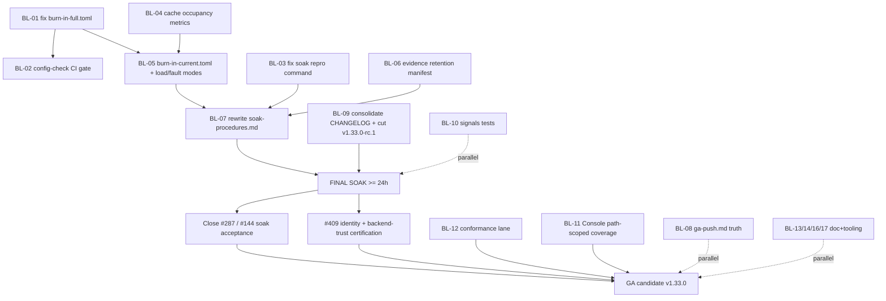

# Jul.IA — Definitive Pre-Soak Product, Architecture & Readiness Audit

> Audit date: 2026-09-16 · Baseline commit: `b1e2dfc5b9835afb1247b4adc0b14bb6865c140d` (`main`, clean tree)
>
> Independent, evidence-based pre-soak readiness audit. Conducted as a coordinated
> senior review panel (principal engineer, systems architect, security architect,
> QA/reliability lead, product manager, UX reviewer, documentation lead,
> DevSecOps/release engineer, technical marketing strategist).
>
> **Scope note.** This is an assessment record, not a live issue tracker and not a
> status authority. Feature maturity and delivery remain owned by
> [`feature-status.yaml`](../feature-status.yaml) and [`status.md`](../status.md);
> volatile issue sequencing remains owned by
> [#62](https://github.com/victornife/jul/issues/62).

---

> ## Implementation status update — 2026-09-17
>
> All P0 items (BL-01…BL-07) plus P1/P2/P3 items BL-08, BL-09, BL-10, BL-13, BL-16,
> BL-24, BL-25 and BL-26 from §18's reconciled backlog are closed via **PR #416**
> (merged `03fda9f8`), following the sequencing this audit recommended. Each item
> was verified with real tests/builds (live server + curl/python-socket testing,
> `jul check`, full-tag build/test, `make ci-pr`, `make generated-check`,
> `python3 scripts/docs-check.py`) rather than by inspection alone — see the
> **Status update** notes on the individual findings in §18 for what changed and
> what, if anything, remains open per item (BL-05/JUL-AUD-019 and BL-09/JUL-AUD-008
> each have a residual noted inline). Every named **soak blocker** is now cleared;
> this audit's own "ready to start final soak, after specific prerequisites"
> verdict (§1, [Final decision summary](#final-decision-summary)) should now read
> as **prerequisites met**, pending the actual soak run itself (still open, tracked
> on #287/#144/#409) and the still-open backlog items below P0/BL-08..BL-26
> (BL-11/12/14/15/17-23/27-30), which this update round did not touch.
>
> This document itself is **not rewritten retrospectively** — the analysis, evidence
> and severity ratings below are preserved exactly as authored on 2026-09-16. Only
> explicit "Status update" annotations were added.

---

## Table of contents

- [0. Audit basis and coverage](#0-audit-basis-and-coverage)
- [1. Executive summary](#1-executive-summary)
- [2. What Jul.IA actually is today](#2-what-julia-actually-is-today)
- [3. Architecture assessment](#3-architecture-assessment)
- [4. Code quality findings](#4-code-quality-findings)
- [5. Protocol correctness and interoperability](#5-protocol-correctness-and-interoperability)
- [6. Performance, capacity and concurrency](#6-performance-capacity-and-concurrency)
- [7. Feature maturity matrix](#7-feature-maturity-matrix)
- [8. CLI and operator UX](#8-cli-and-operator-ux)
- [9. Console / admin UX](#9-console--admin-ux)
- [10. Documentation review](#10-documentation-review)
- [11. Specs, ADRs and roadmap coherence](#11-specs-adrs-and-roadmap-coherence)
- [12. Testing and QA](#12-testing-and-qa)
- [13. Security and operational readiness](#13-security-and-operational-readiness)
- [14. Supply chain, release and compatibility](#14-supply-chain-release-and-compatibility)
- [15. Missing-capabilities / negative-space review](#15-missing-capabilities--negative-space-review)
- [16. Final-soak readiness](#16-final-soak-readiness)
- [17. Product and marketing assessment](#17-product-and-marketing-assessment)
- [18. Reconciled prioritized backlog](#18-reconciled-prioritized-backlog)
- [19. Critical path and roadmap evolution](#19-critical-path-and-roadmap-evolution)
- [20. Things Jul.IA should NOT do next](#20-things-julia-should-not-do-next)
- [21. File-by-file / area-by-area action index](#21-file-by-file--area-by-area-action-index)
- [22. Uncertainties and verification gaps](#22-uncertainties-and-verification-gaps)
- [Final decision summary](#final-decision-summary)

---

# 0. Audit basis and coverage

## Baseline

| Item | Value |
| --- | --- |
| Repository | `github.com/victornife/jul` (local clone `/home/victornf/http_server`) |
| Branch | `main` |
| Commit SHA | `b1e2dfc5b9835afb1247b4adc0b14bb6865c140d` ("fix(server,admin): prove admin runtime health before a semantic no-op reload (#415)", 2026-09-15 22:55 +0200) |
| Sync with origin | `git rev-list --left-right --count origin/main...HEAD` → `0 0` (exactly in sync) |
| Working tree | **Clean** (`git status --porcelain` empty) |
| Go toolchain | `go1.26.6 linux/arm64`; `go.mod` declares `go 1.26.6` |
| Frontend toolchain | React 19 / Vite 8 / TypeScript 6 / Vitest 4 / Playwright 1.52, pnpm 11.8.0 |
| Environment | Linux 6.18 (WSL2), aarch64 |
| Audit timestamp | 2026-09-16 ~10:00 UTC |
| Scale | 945 non-vendored `.go` files, 549 `_test.go` files, ~92.7k LOC production Go, ~47.6k LOC Console TS/TSX |
| CI visibility | Workflow files readable; live run logs **not** consulted for this audit |

`FULL_TAGS = brotli zstd acme console otel grpc http3 importer wasmplugins stream consul kubernetes waf`

## Commands executed (all real, all at this SHA)

| Command | Result |
| --- | --- |
| `go build ./...` | exit 0 |
| `go build -tags "$FULL_TAGS" ./...` | exit 0 |
| `go vet -tags "$FULL_TAGS" ./...` | exit 0 |
| `go test -count=1 ./...` (lean) | **PASS** |
| `go test -count=1 -timeout 25m -tags "$FULL_TAGS" ./...` | **PASS — 40 packages ok, 0 FAIL** |
| `gofmt -l .` | empty |
| `make generated-check` | exit 0 (lifecycle, config-contract, api-contract all in sync) |
| `python3 scripts/docs-check.py` | **1514 passed, 0 failed** |
| `golangci-lint run --build-tags "$FULL_TAGS" ./...` | **0 issues** |
| `govulncheck -tags "$FULL_TAGS" ./...` | **0 vulnerabilities called** (1 in a required-but-uncalled module) |
| `jul check -config <each burn-in/example/root .toml>` | **3 failures** — see JUL-AUD-001 |
| `go run scripts/burn-in-load.go -stream-tcp` | **`flag provided but not defined`** — see JUL-AUD-003 |

**Not executed:** `-race` suite (Linux/CGO gate, ~25 min in CI), Playwright E2E, benchmarks,
fuzz smoke, cross-platform (Windows/macOS) lanes, any actual soak run.

## Audit Coverage Map

| Area | Implementation inspected | Tests inspected | Docs/specs inspected | Runtime validation | Confidence | Gaps |
| --- | --- | --- | --- | --- | --- | --- |
| Composition root / CLI | yes — `cmd/jul`, `internal/app/serve.go` | yes | yes | yes — `jul check` executed on 18 configs | High | CLI JSON schema not published |
| Config lifecycle (parse→apply) | yes — `internal/config`, `candidate.go` | yes | yes | yes | High | — |
| Apply/reload/rollback coordinator | yes — `internal/app/config_apply.go`, `planned_restart.go` | yes | yes — ADR 0011/0015/0019 | partial — tests only | High | No under-load reload evidence |
| Runtime / reload plan | yes — `internal/server/reload_plan.go` | yes | yes | partial — tests only | High | — |
| Request path / router / middleware | yes | yes | yes — ADR 0018 | partial — tests only | Medium-High | No external conformance harness |
| Protocol correctness | yes — stdlib `httputil.ReverseProxy` confirmed | partial | yes | no | **Medium** | No h2spec/autobahn/differential corpus |
| Upstream / resilience | yes | yes — incl. fuzz | yes — ADR 0017 | no | Medium | 24h soak not run (#287) |
| Cache | yes | yes — soak test + recert audit | yes | no | Medium-High | No runtime occupancy metric |
| Security / trust boundaries | yes — read `transport_gate.go`, `rbac.go`, `auth/*` directly | yes | yes — SECURITY.md, security-posture.md | partial | High | Not pen-tested |
| Plugins / WASM | partial — delegated exploration + docs | yes | yes | no | Medium | Sandbox limits not re-derived |
| Console (frontend) | partial — delegated exploration + CI config | yes — 39 vitest + 9 Playwright | yes | no | Medium | Not manually driven in a browser |
| Observability | yes — `metrics.go`, `metrics-contract.json` | yes | yes | yes — contract enumerated | High | — |
| Soak / burn-in harness | yes — **all scripts + all 12 profiles** | yes | yes | yes — **executed** | **High** | — |
| CI / release / supply chain | yes — `release.yml`, `ci.yml` | n/a | yes | no | High | Live runs not inspected |
| Docs / ADRs / roadmap | yes — 20 ADRs, 12 specs, ~55 guides | n/a | yes | yes — docs-check run | High | — |

---

# 1. Executive summary

Jul.IA at `b1e2dfc5` is an **unusually disciplined single-node edge/protocol gateway**.
Every mechanical gate I could run is green, including the full-tag test suite, full-tag
lint, `govulncheck`, generated-artifact drift, and a 1,514-check documentation integrity
suite. The architecture is intentional rather than accidental: an immutable
`config.Candidate`, a ten-phase `ReloadPlan`, a closed-world lifecycle registry that
*generates* its own documentation, generational resource retirement, and a single
authentication chokepoint. Security reasoning in the code (for example
`internal/admin/transport_gate.go`) is of a quality rarely seen outside mature commercial
infrastructure — it documents what a control *cannot* promise, not only what it can.

**The project's weakness is not its code. It is that its soak apparatus has fallen out of
sync with its code.** The consolidated all-features burn-in profile no longer parses. The
published reproduction command for the one outstanding 24-hour soak references a flag that
does not exist. The load generator has no mode for any capability merged since July. The
soak procedure document is a Windows-PowerShell guide from 2026-07-03 that never mentions
the harness which actually produced the authoritative evidence. And `docs/ga-push.md` still
declares the soak gate "CLOSED for the entire v1 feature set" while `docs/status.md`,
`docs/known-limitations.md` and `docs/audit-register.md` correctly list roughly ten
merged-Beta capabilities with open soak obligations.

Starting the final soak today would produce evidence about the *July* feature set, not
about the 627 commits that are actually unvalidated.

| Dimension | Assessment |
| --- | --- |
| Overall maturity | High for a single-maintainer project; near-commercial for lifecycle/config discipline |
| Strongest areas | Configuration lifecycle and reload transaction; generated contracts and drift guards; release/supply-chain engineering; admin trust boundary; documentation integrity tooling |
| Highest-risk areas | **Soak apparatus decay**; 627-commit unreleased delta; protocol-conformance evidence; Console test coverage |
| Architectural health | **Good.** Acyclic dependencies, single composition root, consistent build-tag fail-fast. One hotspot: `internal/app/config_apply.go` at 2,329 LOC |
| Code health | **Good.** 13 TODO/FIXME across 945 files (most in tests/strings), 31 `go func(` in production, 0 lint issues |
| QA health | **Good but uneven.** 549 test files, 23 fuzz targets, 100+ benchmarks, race in CI, per-package coverage floors 77–90% — but the Console floor is 58% and `internal/signals` is untested |
| Security health | **Strong.** No vulnerability found; documented model matches code on every claim independently verified |
| Operational readiness | **Adequate for soak once the harness is repaired.** 59-metric contract, `jul doctor`, support bundles, systemd/Docker hardening |
| Documentation health | **Excellent in mechanism, drifting on a few high-trust pages** (`ga-push.md`, `soak-procedures.md`, roadmap Stage 8) |
| Product clarity | **Very good.** README states non-goals explicitly; maturity and delivery axes are separated |
| Console readiness | **Beta-appropriate.** Functionally broad, accessibility-conscious, but a 58% coverage floor over a 2,051-LOC config-apply panel |
| CLI readiness | **Strong.** Nine-value exit-code contract, `--json` almost everywhere, clean stdout/stderr discipline |

## Is Jul.IA ready to begin final soak?

## ➤ **YES, AFTER SPECIFIC PREREQUISITES**

The system, instrumentation and code are ready. The **soak harness is not**. Every blocker
below is a one-to-three-day repair of test/ops assets, not a code-correctness problem.

### Soak blockers (must be done first)

1. **JUL-AUD-001** — `burn-in-full.toml` does not parse. The consolidated profile is unusable.
2. **JUL-AUD-004** — No burn-in profile or load mode exercises any post-RC merged Beta
   capability (RBAC, `client_address`, `backend_tls`, resilience, predicates/response
   policy, egress, unix upstreams, managed apply).
3. **JUL-AUD-003** — The published 24h resilience-soak reproduction command cannot run.
4. **JUL-AUD-005** — Cache occupancy is not observable at runtime; "cache runaway" is an
   untestable soak criterion as things stand.
5. **JUL-AUD-018** — No evidence-retention contract (SHA-stamped artifact directory, config
   copy, metric snapshots). The soak would not be reproducible later.
6. **JUL-AUD-006** — `docs/soak-procedures.md` does not describe the procedure that will
   actually be run.

### To validate during soak (do **not** pre-fix)

Long-term memory/RSS/GC trend; goroutine and FD flatness over ≥24 h; admission-slot floor
return-to-zero; queue bounds under sustained saturation; circuit flap rate; reload duration
drift over hundreds of applies; cache disk-tier steady state; HTTP/3 + L4 concurrent
resource accounting; `jul_managed_apply_finalization_errors_total` staying at zero; TLS
handshake cost under churn; WASM plugin memory over hours.

### Post-soak / GA gates

**JUL-AUD-008** (627-commit release delta), **JUL-AUD-012** (protocol conformance evidence),
**JUL-AUD-010** (Console coverage), **JUL-AUD-007 / 013** (doc contradictions),
**JUL-AUD-016** (benchmark regression gate), plus the #409 certification tranche and
#287/#144 closure.

### Should remain Beta after this soak

`client_address`, `backend_tls`, admin TLS/mTLS, versioned external Admin API, remote CLI,
HTTP-over-Unix upstreams, routing/response policy, generic resilience, local
diagnostics/support bundles, NGINX assessment/provenance. **None of these should be promoted
to GA on the strength of one consolidated soak** — ADR 0003's nine criteria, not elapsed
runtime, govern promotion.

### Top five actions

1. Fix and gate the soak configs (**JUL-AUD-001 + JUL-AUD-002**).
2. Build a `burn-in-current.toml` plus load modes covering the post-RC surface (**JUL-AUD-004**).
3. Add cache occupancy metrics and an evidence-retention convention (**JUL-AUD-005 + JUL-AUD-018**).
4. Rewrite `docs/soak-procedures.md` against the real harness; retire the false claim in
   `ga-push.md` (**JUL-AUD-006 + JUL-AUD-007**).
5. Run the soak; then cut the release that the 627-commit delta demands (**JUL-AUD-008**).

---

# 2. What Jul.IA actually is today

**Fact.** Jul.IA is a single static Go binary (`cmd/jul`) that reads one TOML file and
serves HTTP. It is a **single-node L7 edge gateway with an embedded control plane**. The
control plane is not a bolt-on: `internal/admin` is the largest package in the repository
(56k LOC production, 32k LOC test) and `internal/app/config_apply.go` — the transactional
apply coordinator — is the largest single file (2,329 lines).

**Inference.** The product's true centre of gravity is **safe configuration change on a
running server**, not raw proxying. Proxying is table stakes it has already solved;
transactional apply/stage-restart/rollback with authority semantics (`managed` vs
`file_owned`), crash-recovery markers, a terminal-outcome ledger (ADR 0015), generated
lifecycle contracts and a review-before-apply Console is what no comparable single-binary
server offers in this form. NGINX has no rollback. Caddy has an admin API but not a
transactional apply ledger with drift/adoption semantics.

**Actual value proposition:** NGINX-grade routing plus protocol-gateway capabilities, with a
configuration lifecycle an operator can trust and undo, in one binary.

**Actual target users (the README is truthful here):** solo operators and small
infrastructure teams; NGINX migrators; teams wanting an operations console without standing
up a stack.

**Feature surface (verified to exist in code and config schema):** static serving, reverse
proxy (`httputil.ReverseProxy`), FastCGI/uWSGI, WebSocket/SSE passthrough, load balancing
(RR/WRR/least-conn), passive and active health checking, DNS/SRV/Consul/Kubernetes
discovery, TLS/ACME/mTLS, backend TLS trust policy, CIDR/Basic/JWT-JWKS/forward-auth, rate
and connection limiting, gzip/br/zstd, two-tier cache, gRPC passthrough plus h2c, gRPC↔JSON
transcoding (unary and all streaming shapes), HTTP/3, L4 TCP/UDP with SNI routing and PROXY
protocol, WASM plugins (wazero), Coraza WAF with embedded CRS, egress allow-list, secrets
references and redaction, RBAC, audit sink, Console, remote CLI, `jul doctor`, support
bundles, NGINX importer with assessment.

**Maturity split** (from `feature-status.yaml` and `status.md`, cross-checked against
`known-limitations.md`): roughly 20 features GA·soaked from the pre-RC era; roughly 10
post-RC capabilities merged Beta; **zero** currently in "GA — soak pending".

**Architectural identity:** a monolithic composition root (ADR 0007) with leaf-package
discipline and build-tag feature gating. It is *not* a plugin-oriented data plane like
Envoy, and correctly does not pretend to be.

**Product identity:** coherent. The README's "not the right tool if" list (no fleet, no
Kubernetes Ingress, no mesh/xDS, no multi-tenant CDN, no Envoy-level extensibility) is the
single most valuable piece of product writing in the repository, and it is **accurate** —
nothing in the tree contradicts it.

**What it should not try to become yet:** anything multi-node. Stage 9's "one bounded
experiment" (AI Gateway, #162) is correctly gated and should stay gated until after GA.

---

# 3. Architecture assessment

**Entry points.** `cmd/jul/main.go` dispatches through four non-overlapping seams — remote
subcommands, diagnostics subcommands, standard subcommands, legacy flags — with no
fallthrough contamination. `internal/app/serve.go` (1,423 LOC) is the composition root:
init → handler factory → six preflight gates → admin wiring → listener start.

**Dependency direction.** Verified acyclic. Leaves (`auth`, `cache`, `upstream`,
`middleware`, `handler`, `rbac`, `redact`, `egress`, `plugins`, `waf`, …) import no sibling
domains. `config` imports only leaves. `server` and `admin` import `config` but never `app`.
`app` is the only package importing everything. `cmd/jul` imports `app`, `config`,
`signals`. **No package imports `app`; no cycles.**

**Configuration lifecycle.** `config.NewCandidateContext` (`internal/config/candidate.go:41`)
performs exactly one secret-resolution pass under the caller's deadline and returns an
immutable `Candidate{Raw, Effective, Redaction, Digests}`. `Raw` preserves `${env:…}`
references for the on-disk view; `Effective` is the only config the process serves from.
Consumers build a new `Candidate` rather than mutate. This is the correct design and it is
enforced by construction, not convention.

**Reload transaction (ADR 0011).** Ten ordered phases in `internal/server/reload_plan.go`:
Resolve → Validate → Lifecycle → ChangeAssessment → Prepare → StageListeners → Publish →
Activate → Retire → PostCommit. Listeners are bound before Publish but serve nothing until
Activate; any pre-Publish failure runs an idempotent `Abort` that releases staged resources
without touching live state. Old generations retire only after in-flight requests drain
(`internal/app/generation.go`).

**Restart classification.** `internal/lifecycle/registry.go` is a **closed-world registry
classifying every TOML leaf exactly once** into HotReload / RestartRequired /
NewListenerOnly / IgnoredDeprecated / ValidationRejectedReserved, and
`docs/config-lifecycle.yaml` is generated from it with a CI drift guard
(`make generated-check`, run clean at this SHA). This eliminates an entire class of "we
forgot this field needs a restart" defect. It is the single best architectural decision in
the repository.

**Apply coordinator.** `internal/app/config_apply.go` — `applyMu` serializes applies and is
released before waiting on the reload; `finalizeMu` serializes terminal
history/audit/metrics work; `inFlightState` is the admission gate under `c.mu`. Terminal
results carry `Mode`, `Conflict`, `Restored`, `AuthorityDenied`, `ConfigState`,
`FinalizationError`. `internal/app/planned_restart.go` writes a crash-recovery marker
(`prepared`/`staged` with base/staged/previous digests) adjacent to the config file, with
explicit sentinel errors for every inconsistency.

**Architectural debt (the honest list):**

- `internal/app/config_apply.go` at 2,329 LOC concentrates the highest-risk logic in the
  repository in one file. It is coherent, well-commented and well-tested — but it is the
  file where a future contributor is most likely to introduce a subtle ordering bug, and
  the ADR-review history for this repository shows that has already happened repeatedly
  during design.
- `internal/admin` at 161 files / 56k LOC. It has clean internal sub-domains (API, console
  backend, patch/diff, audit, history, managed apply) and imports nothing it shouldn't. It
  is **not** a god package today, but it is at the size where "one more feature goes in
  admin" becomes the default.
- `internal/admin/ui/src/api/client.ts` at 3,161 LOC is a single-file API surface for the
  whole Console.

**Verdict: intentional architecture with one concentration hotspot.** No accidental
coupling, no shared mutable state of consequence (52 package-level `var x =` across 92k LOC,
none in request paths found), no cyclic conceptual dependencies.

---

# 4. Code quality findings

Material findings are catalogued under their canonical IDs in [§18](#18-reconciled-prioritized-backlog).
Grouped minor observations below.

**Risk-indicator scan (leads, not findings):**

| Indicator | Count (production, non-test) | Assessment |
| --- | --- | --- |
| `TODO`/`FIXME`/`HACK`/`XXX` | 13 total across 7 files, and **only 1 is a real TODO** (`internal/admin/humanerrors.go:39`) — the rest are test names and NGINX-importer output strings | Exceptional |
| `go func(` | 31 | Low; each is generation- or lease-owned |
| `context.Background()` | 49 | Concentrated in lifecycle/process scope, not request paths |
| `time.NewTicker` / `NewTimer` | 14 | Bounded |
| `panic(` | 4 | Programmer-error only |
| `recover()` | 14 | Location-scoped panic containment (ADR 0018) plus apply finalization |
| `unsafe` | Only `examples/plugins/sdk/sdk.go` (WASM SDK — expected) | Clean |
| `InsecureSkipVerify: true` | None in production paths; ADR 0016 records that the *documentation* once claimed it and was corrected | Clean |

**Minor editorial observations (no finding IDs, not worth tracking individually):** relative
paths in configuration resolve against the process CWD rather than the config file's
directory. This matches NGINX/Caddy convention but deserves one sentence in
`docs/configuration.md`.

---

# 5. Protocol correctness and interoperability

**Confirmed correctness (Fact):**

- HTTP/1.1 request parsing is Go's `net/http`, and reverse proxying is **stdlib
  `httputil.ReverseProxy`** (`internal/handler/proxy.go:80`, `grpcproxy.go:62`). Framing,
  `Content-Length`/`Transfer-Encoding` conflict rejection, chunked decoding and header
  validation are inherited from a heavily-audited implementation.
- Hop-by-hop handling is implemented independently in **three** places that need it, each
  with tests: forward-auth subrequests (`internal/auth/forward.go:108`), cache storage
  (`internal/cache/http.go:342`, `cache.go:682`, `TestRemoveHopByHop`), and response-header
  policy validation (`internal/config/validate_response_headers.go:33` — `Connection`,
  `Content-Length`, `Transfer-Encoding`, `Upgrade`, `Keep-Alive`, `Proxy-Connection`, `TE`,
  `Trailer`, `Proxy-Authenticate`, `Proxy-Authorization` are all protected from operator
  mutation).
- Route predicates on hop-by-hop header names are *accepted with a warning* rather than
  silently honoured (`internal/config/validate_match.go:63`) — a thoughtful middle path.
- `ResponseWriter` decoration is capability-exact: `internal/respwriter/respwriter.go:41`
  inspects the underlying writer once and returns a wrapper implementing **only** the
  optional interfaces the underlying writer implements (`Flusher`/`Hijacker`/`Pusher`/
  `ReaderFrom`, mask-selected). This is the correct fix for the classic "my decorator broke
  WebSocket upgrade" bug, and there is a regression test recording exactly that history
  (`proxy_cache_test.go:78`).
- mTLS identity forwarding follows RFC 9440: `Client-Cert`, `Client-Cert-Chain` and
  `X-Forwarded-Client-Cert` are stripped from **every** proxied request regardless of
  configuration, then re-emitted only as Jul's own assertion.
- gRPC trailers preserved; streaming frames flushed per write; SSE/chunked never buffered.

**High-risk paths / verification gaps:**

- **No external conformance harness exists.** Zero references to `h2spec`, `autobahn`, or
  any differential corpus anywhere in the repository. `docs/core-http.md:614` states
  "Request smuggling | safe | strict `net/http` request parsing". That is a **correct
  inference** but it is not independently evidenced at Jul's own boundary — and Jul has
  surfaces that do *not* go through stdlib request parsing: the FastCGI/uWSGI CGI
  response-header parser (`internal/handler/fastcgi.go`, which does have
  `FuzzWriteCGIResponseHeaders`/`FuzzScriptName`), cache storage/replay, and the transcode
  NDJSON/SSE writers.
- No test anywhere matches `smuggl|desync|conflicting Content-Length` outside two unrelated
  comments.

**Recommended (post-soak, not pre-soak):** an `h2spec` lane against the h2c and HTTP/2
listeners; an Autobahn WebSocket passthrough lane; a small differential corpus replaying
ambiguous-framing requests against Jul and against a reference (an NGINX container already
exists for the migration E2E lane) asserting identical accept/reject decisions.

---

# 6. Performance, capacity and concurrency

**Defects found: none.** No unbounded queue, no goroutine-per-waiter, no missing
cancellation propagation in the paths traced.

**Facts worth recording:**

- Backpressure is explicit and measured: `jul_upstream_active_requests`,
  `jul_upstream_pending_requests`, `jul_upstream_admission_rejected_total`,
  `jul_upstream_circuit_state`, `jul_upstream_retry_budget_denied_total`.
- The retry-budget amplification bound was measured *deterministically* rather than inferred
  from a soak: `TestAmplificationUnderTotalOutage` counts every upstream attempt in the
  retry adapter — 110,003 attempts for 100,000 inbound = 1.10003×, against a 3.00×
  unbudgeted control. When the literal acceptance criterion (`≤ 1.1×`) proved unachievable
  by design, the team **amended the criterion in ADR 0017 (Amendment 4)** rather than
  weakening the test. That is exactly right, and `docs/soak-evidence.md` documents the
  reasoning openly.
- Parked-request cost is measured at ~7.5 KB; a 70,000-execution fuzz over
  acquire/release/cancel/reload/backend-update interleavings exists
  (`FuzzAdmissionInterleavings`).
- Go and Process Prometheus collectors are registered
  (`internal/observability/metrics.go:487-488`), so `go_goroutines`,
  `process_resident_memory_bytes` and `process_open_fds` are available during soak without
  extra work.

**Benchmarks (critical read).** 100+ `Benchmark*` functions across 30 packages. Roughly half
model real paths (proxy round-trip, gRPC unary, TLS/mTLS handshake, cache through a mock
upstream, WAF rule evaluation); the rest are honest micro-benchmarks (predicate matching,
balancer selection, compression on buffers, token-bucket operations). **There is no
automated regression detection** — the CI job runs benchmarks at 10× as a smoke test and
explicitly declines to compare, because hosted runners are too noisy. `docs/benchmarks.md`
numbers are hand-maintained. See JUL-AUD-016.

**To be measured during soak, not guessed at now:** RSS/heap plateau versus creep;
`go_goroutines` flatness; `process_open_fds` flatness; admission-slot floor returning to
zero when load pauses; pending-queue never exceeding `max_pending_requests`;
`jul_reload_duration_seconds` and `jul_reload_phase_duration_seconds` drift over hundreds of
applies; circuit transition rate; cache disk steady state (**blocked on JUL-AUD-005**).

---

# 7. Feature maturity matrix

| Feature | Claimed | Evidence | Auditor assessment | Missing criteria | Soak impact | Next action |
| --- | --- | --- | --- | --- | --- | --- |
| Core HTTP (static, proxy, vhosts, FastCGI/uWSGI) | GA·soaked | 8h 2026-07-04 + Phase 2A; stdlib framing | **Agree GA**, with §5 caveat | Independent protocol conformance | Re-exercise (regression) | JUL-AUD-012 post-soak |
| Routing (exact/regex/prefix) | GA·soaked | ADR 0018, router fuzz targets | Agree | — | Re-exercise | — |
| Method/header/query predicates + response policy + CORS | **Beta (merged post-RC)** | ADR 0018, validation tests | **Agree Beta** | Soak, publication | **Must be in soak** | JUL-AUD-004 |
| Upstream pools / LB / health | GA·soaked | 8h soak, probe-trust tests | Agree | — | Re-exercise | — |
| Generic resilience (admission/retry/circuit) | **Beta (merged)** | ADR 0017, fuzz, deterministic amplification | **Agree Beta** | **24h soak (#287 open)** | **Blocks — primary soak subject** | JUL-AUD-003/004 |
| TLS + ACME | GA·soaked | Phase 2A | Agree | ACME rotation under concurrent handshake not explicitly tested | Validate during soak | — |
| mTLS | GA·soaked | Phase 2A client-cert path | Agree | — | Re-exercise | — |
| `backend_tls` (backend peer trust) | **Beta (merged)** | ADR 0016, per-consumer tests | **Agree Beta** | Cross-protocol certification (#409) | **Must be in soak** | #409 |
| Trusted client identity (`client_address`) | **Beta (merged)** | ADR 0016, `FuzzDerive`, 90% floor | **Agree Beta** | Certification (#409) | **Must be in soak** | #409 |
| Authentication (CIDR/Basic/JWT/forward-auth) | GA·soaked | alg-family check verified, dummy-hash verified | **Agree GA** | — | Re-exercise | — |
| Rate + connection limiting | GA·soaked | 12.5M req soak | Agree | — | Re-exercise | — |
| Compression | GA·soaked | 11.6M req soak | Agree | — | Re-exercise | — |
| Response cache | GA·soaked (recertified #134) | 2026-08-07 recert audit + soak test | Agree | **No runtime occupancy metric** | **Blocks observability** | JUL-AUD-005 |
| gRPC passthrough + h2c | GA·soaked | 8h isolated, 6.8M req | Agree | — | Re-exercise | — |
| gRPC ↔ JSON transcoding | GA·soaked | 8h isolated, 14.2M req | Agree | Reflection-abuse negative test noted open | Validate during soak | — |
| HTTP/3 | GA·soaked | 8h isolated, 55.3M req | Agree | Static cert changes restart-bound (documented) | Re-exercise | — |
| L4 stream proxy | GA·soaked | 8h isolated, 54.9M sends | Agree | — | Re-exercise (**blocked by JUL-AUD-003**) | JUL-AUD-003 |
| WASM plugins | GA·soaked | 8h, 21.7M req | Agree | — | Re-exercise | — |
| WAF (Coraza + CRS) | GA·soaked | 1h + Phase 2A; reload-churn leak lane | Agree | Negative/integration matrix noted incomplete | Re-exercise | P2 |
| Service discovery | GA·soaked | behaviour matrix; Kubernetes Kind nightly | **Beta in practice** — the only blocking evidence is nightly/manual | Blocking CI lane | Validate during soak | P2 |
| Observability (metrics/logs/OTel) | GA·soaked | 59-metric contract with drift guard | Agree | Cache occupancy | Prerequisite | JUL-AUD-005 |
| Console / admin | GA·soaked | 39 vitest + 9 Playwright | **Agree GA for read; Beta for write flows** | **58% coverage floor** | **Must be exercised under load** | JUL-AUD-010, JUL-AUD-004 |
| Admin TLS/mTLS, external API v1, remote CLI | **Beta (merged)** | `transport_gate.go` verified; OpenAPI generated | **Agree Beta** | Soak + publication | **Must be in soak** | JUL-AUD-004 |
| RBAC | Shipped, opt-in | `rbac/security_negative_test.go` fail-closed | **Beta in practice** | Soak under load; Console token management is "planned" | **Must be in soak** | JUL-AUD-004 |
| Configuration authority / generated contracts | **Beta (merged)** | ADR 0019, `make generated-check` green | **Agree Beta** | Soak | **Primary soak subject** | JUL-AUD-004 |
| Secrets + redaction | GA·soaked | atomic 0600 writes, dynamic redactor | Agree | — | Re-exercise | — |
| Egress allow-list | Core, opt-in | dial-time + redirect re-check, generation model | **Beta in practice** | Soak; default-off | Include in soak | JUL-AUD-004 |
| Local diagnostics / support bundles | **Beta (merged)** | 85% coverage floor + dedicated CI lane | **Agree Beta** | Soak | Non-blocking | JUL-AUD-013 (doc drift) |
| NGINX importer + assessment | GA·soaked / Beta split | corpus closure audit, `FuzzTranslate` | Agree | Corpus expansion (#365–#368) | Non-blocking | — |
| HTTP over Unix upstreams | **Beta (merged)** | #407 | **Agree Beta** | Soak | Include in soak | JUL-AUD-004 |

**No feature should be promoted to GA purely because the final soak passes.** ADR 0005
correctly makes soak a post-GA gate; the Beta capabilities above are Beta for the *other*
eight criteria (publication, certification), not for soak alone.

---

# 8. CLI and operator UX

**Assessment: the strongest operator surface in the product.**

- **Grammar** (`cmd/jul/cli.go:30-91`): local commands `lint`, `fmt`, `run`, `serve`,
  `check`, `healthcheck`, `import`, `version`, `capabilities`, `completion`, `doctor`,
  `support-bundle`; remote commands `plan`, `diff`, `apply`, `stage`, `status`, `rollback`,
  `export`, `diagnostics`. Legacy `-config`/`-check`/`-version` flags still work with a
  deprecation notice on stderr.
- **Exit codes** (`internal/adminapi/exit_codes.go:15-30`): a **nine-value closed contract** —
  0 success, 1 validation error, 2 usage, 3 restart-required, 4 degraded, 5
  conflict/uncertain, 6 authority denial, 7 auth/insecure-transport refusal, 8
  connectivity/TLS/rate-limit, 9 server/internal. Printed in `jul` usage output *and*
  emitted by `jul capabilities -json`. This is better than NGINX's and Caddy's.
- **Command overlap:** the four plausible collisions (`run` vs `serve`, `check` vs `lint`,
  `lint` vs `fmt`, `apply` vs `stage`) are all cleanly separated by purpose and exit
  semantics. **No ambiguity; no regrassing needed.**
- **stdout/stderr discipline:** correct — results to stdout, diagnostics/usage/deprecations
  to stderr, `jul fmt` without `-w` pipes canonical TOML.
- **Local↔CI parity:** `jul check` runs the same `app.ValidateRuntimeConfig` dry-run the
  server runs at startup (WAF compile, auth init, TLS load, codec availability, plugin
  schema). Executed against 18 configs, it behaved deterministically, including catching the
  two genuine env-var gaps and the one genuine parse failure.

**Gap:** the `--json` payloads are Go structs with `json:` tags and **no published schema** —
automation must reverse-engineer them. Given that `docs/generated/openapi.json` exists for
the Admin API, the CLI deserves the same treatment. Low priority, post-GA.

---

# 9. Console / admin UX

**Functional assessment.** 15 routes (overview, routes, apps, tls, security, traffic,
plugins, streams, transcode, search, operations, audit, config, history, wizard), React
Query for all server state, a `Ctrl/Cmd+K` command palette, a documented error taxonomy of
eight kinds (`unauthorized`/`forbidden`/`notFound`/`conflict`/`rateLimited`/`server`/
`network`/`unknown`) rendered through a single `PanelError` component with tone selection
and actionable copy, and RFC-conformant `Retry-After` parsing surfaced to the operator.

**Dangerous-operation handling is genuinely good.** Config apply routes through a
`ConfirmDialog` that shows the ordered diff, names the action ("Apply now" versus "Save for
next restart"), and — when the change affects admin access — re-prompts with an explicit
list of what will change and whether re-authentication is needed. Rollback states "This
cannot be undone; check the diff first". There are **no optimistic updates on mutations**,
which is the right call for a surface where the outcome is a multi-state terminal ledger
rather than a boolean.

**Accessibility.** `useFocusTrap` (own implementation), `role="dialog"`/`aria-modal`/
`aria-label` on dialogs, `role="alert"` on error containers, Escape handling, tab wrapping,
focus restoration — and a dedicated `focus-trap.test.tsx` that tests all of it.
`docs/accessibility.md` matches the implementation and honestly records that a full WCAG 2.2
AA audit has not been done.

**The operator's questions**, answerable today: *What is happening* (overview + traffic);
*Is it healthy*; *What changed* (history + diff + timeline); *Who changed it* — **only with
RBAC enabled** (legacy shared token has no per-principal attribution, and this is
documented); *What can I safely do* (permission-gated affordances); *What happens if I press
this* (diff-in-dialog); *Can I recover* (history + rollback).

**Findings:** Console maturity badges are hardcoded per component and not bound to
`docs/feature-status.yaml` (JUL-AUD-014); the statement-coverage floor sits at 58%
(JUL-AUD-010); interactive token creation/revocation is labelled `preview` and not shipped
(correctly labelled — not a finding).

**Correction to a common assumption:** the committed build output at
`internal/admin/assets/dist/` **is** drift-guarded in CI
(`.github/workflows/ci.yml:474` errors with "Embedded console assets are stale. Run
'make console-build'"). This is not a gap.

---

# 10. Documentation review

**Mechanism: best-in-class.** `scripts/docs-check.py` runs **1,514 assertions** (all passing
at this SHA) covering link integrity, feature-name presence across
`feature-status.yaml`↔`status.md`, and structural invariants. Three generators
(`lifecyclegen`, `configcontractgen`, `apicontractgen`) derive `config-lifecycle.yaml`, the
field reference and `generated/openapi.json` from Go source, with `make generated-check` as a
merge gate. Documentation cannot silently diverge from the *registry*.

**Content: strong, with three trust-critical drifts.** The information architecture already
has the layers one would otherwise recommend: Getting Started, Concepts
(`vision/appendix.md`), Configuration Reference (generated), Operations, Security
(`SECURITY.md` + `security-posture.md`), per-protocol guides, Plugins, Console, Deployment,
Troubleshooting, ADRs, Specs, Compatibility, Known Limitations, Audit Register. **No new
documentation architecture is needed.**

The drifts are precisely where the generators do not reach — narrative status pages:
`ga-push.md` (JUL-AUD-007), `soak-procedures.md` (JUL-AUD-006), roadmap Stage 8
(JUL-AUD-013). The lesson is structural: *every document that makes a readiness claim should
be either generated or dated-and-owned*, and these three are neither.

**Verified-accurate documentation (spot-checked against code, not taken on trust):**
SECURITY.md's JWT claims (asymmetric-only plus key-family binding verified at
`internal/auth/jwt.go:44-100`); the loopback/TLS admin gate (verified at
`internal/admin/transport_gate.go:66-88`); hop-by-hop protection lists (verified at
`internal/config/validate_response_headers.go:33`); `0600` atomic writes (verified at
`internal/admin/history.go:157`); ADR 0016's correction that `InsecureSkipVerify` was a
*documentation* error, not a code one.

---

# 11. Specs, ADRs and roadmap coherence

**ADRs: 19 accepted plus a README index.** Supersession is handled explicitly (0003, 0016,
0019 and the index carry supersession language; 0017 carries a numbered *Amendment 4* rather
than a silent edit). ADRs 0011, 0015, 0016, 0017, 0018, 0019 are all traceable to live code:
`reload_plan.go`, `planned_restart.go`/terminal ledger, `clientaddr`/`backendtls`, `upstream`
admission/retry/circuit, `router` predicates/response policy, `lifecycle` and
`configcontract` generators. **No ADR checked describes something that does not exist.**

**Specs: 12**, including `core-gateway-completeness.md` (the actual GA scope definition),
`console-rbac.md`, `hardening-platform.md`, `reload-plan.md` and five year-horizon documents.
The year-N specs are vision-horizon material and are correctly labelled as such; they are not
distracting because the roadmap explicitly subordinates them.

**Roadmap:** a ten-stage durable portfolio with lanes and decision rules, deliberately
delegating volatile state to #62. Stage 10 is "Integrated closure — fresh exact-SHA audit,
protocol/failure matrix, lean/full gates, E2E, soak and release evidence" — that is, **this
audit is Stage 10 work and the roadmap anticipated it.**

## Contradiction & Drift Register

| # | Sources in conflict | Factual difference | Authoritative source | Risk | Action |
| --- | --- | --- | --- | --- | --- |
| D-1 | `docs/ga-push.md` (v1.37, 2026-07-31) vs `docs/status.md` (v2.8, 2026-09-15), `known-limitations.md`, `audit-register.md` | ga-push: *"All shipped features are GA. Soak gate is CLOSED for the entire v1 feature set."* Status/limitations: ~10 merged-Beta capabilities with open soak. | status.md + feature-status.yaml (declared canonical by README) | **High** — a reader could conclude no soak is owed | JUL-AUD-007 |
| D-2 | `docs/soak-evidence.md:134` vs `scripts/burn-in-load.go:44-62` | Doc publishes `-stream-tcp`; the flag does not exist | Code | **High** — the one open soak cannot be reproduced | JUL-AUD-003 |
| D-3 | `burn-in-full.toml:168-185` vs `internal/config` parser | Legacy `[servers.locations.X]` map syntax; parser demands `[[servers.locations]]` | Parser | **High** — consolidated profile unusable | JUL-AUD-001 |
| D-4 | `docs/roadmap/README.md` Stage 8 vs `docs/audit-register.md` + `docs/status.md` + `internal/doctor`/`internal/supportbundle` | Roadmap: *"support bundle and doctor remain later work"*. Register: *"support bundles and `jul doctor` are merged"*. Both dated 2026-09-15. | Code + audit-register | Medium — understates delivered scope | JUL-AUD-013 |
| D-5 | `docs/soak-procedures.md` (v1.30, Windows/PowerShell, three `go test` scenarios) vs `docs/soak-evidence.md` (all authoritative runs used the `burn-in-*.toml` real-binary harness) | The documented procedure is not the procedure used | soak-evidence.md | Medium-High — final soak would be run from a stale guide | JUL-AUD-006 |
| D-6 | Console `MaturityBadge level="…"` literals vs `docs/feature-status.yaml` | No binding; a YAML maturity change does not update the UI | feature-status.yaml | Medium — operator sees a stale GA/Beta claim | JUL-AUD-014 |
| D-7 | `CHANGELOG.md [Unreleased]` structure vs Keep-a-Changelog | 23 interleaved subsections (14 × `### Added`) under one release heading | Convention | Low | JUL-AUD-009 |

**No other contradiction was found.** In particular, `SECURITY.md`,
`docs/security-posture.md`, `docs/compatibility.md`, `docs/known-limitations.md` and
`docs/status.md` were mutually consistent and consistent with code on every claim verified.

---

# 12. Testing and QA

**Distribution.** 549 test files; test LOC is roughly 60–65% of production LOC in the
critical packages (`admin` 32k/56k, `app` 16k/26k, `server` 11k/16k, `config` 8.6k/15.8k,
`handler` 10.3k/12.9k).

**Critical-path coverage.** Per-package CI floors exist for the seven packages that matter
most: `clientaddr` 90%, `backendtls` 89%, `auth` 87%, `doctor`/`supportbundle` 85%,
`proxyproto` 84%, `config` 82%, `server` 78%, `admin` 77%. Floors are pinned 2–3pp below
measured baselines to catch regression rather than to flatter.

**Negative-path evidence (spot-checked, all confirmed present):** invalid-config rejection,
authority-drift reporting, listener-bind rollback, reload-enqueue 503, RBAC fail-closed
(`internal/rbac/security_negative_test.go:18-58` — build-without-principals,
principal-without-token, duplicate legacy+named token all fail closed), plugin upload
filename hardening, egress loopback-always-blocked, gRPC cancel releases admission slot,
cache does not replay a stale request ID (regression #332), TLS failure categorisation,
rate-limit burst→429, admission capacity denial. **This is not a happy-path test suite.**

**Fuzzing.** 23 targets across 16 packages including every custom parser: `FuzzParse`/
`FuzzValidateConfig`, `FuzzParseJWKS`/`FuzzValidateToken`, `FuzzDerive`/`FuzzParsePrefix`,
`FuzzScriptName`/`FuzzParseSocketAddress`/`FuzzWriteCGIResponseHeaders`,
`FuzzParseDirective`/`FuzzTranslate`, `FuzzKVStore`/`FuzzPluginInvoke`/`FuzzHostAllowed`,
`FuzzReadHeader`, `FuzzHostScore`/`FuzzSelectLocation`/`FuzzLocationMatch`, `FuzzPeekSNI`,
`FuzzParseTemplate`, `FuzzAdmissionInterleavings`, `FuzzBudgetWindowRotation`. CI runs 20s
per target on every push.

**Race detector.** `go test -race -p 2 -tags "$FULL_TAGS" ./...` on every merge (Linux,
25-minute budget), plus six issue-scoped `-race` quality lanes. **Not available as a Makefile
target** — see JUL-AUD-017.

**CI inventory.** 17 workflows. Third-party actions are **SHA-pinned**, not tag-pinned
(verified: `actions/checkout@3d3c42e5…`, `pnpm/action-setup@ea17c68d…`,
`anchore/sbom-action@3ad72834…`, `actions/attest-build-provenance@4d101475…`). Merge-blocking:
`ci.yml` (build lean+full, test lean+full+Windows+macOS, race, coverage, benchmarks smoke,
fuzz smoke, soak smoke, format, lint, console frontend, console e2e ×2, docs-check, license)
and `security-gates.yml` (fail-closed negative tests plus package coverage floors).

**Skips.** 119 skip sites across 52 files, classified: ~50 platform divergence
(Windows/POSIX), ~20 "cannot assert permission denial as root", ~15 symlink unavailability,
~10 build-tag stub lanes, ~4 missing fixtures. **All have stated reasons; none is a disabled
test hiding a failure.**

**Weaknesses:** `internal/signals` has zero tests (JUL-AUD-011); Console floor 58%
(JUL-AUD-010); benchmark regression is manual (JUL-AUD-016); Consul/Kubernetes discovery
blocking evidence is nightly/manual-dispatch only.

## Credible merge-safe bar (recommendation)

Current `make ci-pr` (format-check, lint-full, test-full, vulncheck-full, build-full,
license, vet, generated-check, docs-check, security-gates) is already a strong local gate.
Add exactly three things:

1. `make test-race` (Linux) so the CI-only gate is reproducible locally.
2. **`make config-check`** — run `jul check` over every root and `examples/` `.toml`, with
   env-dependent profiles listed explicitly (JUL-AUD-002). This is the single
   highest-value gate addition in this audit.
3. Benchmark regression comparison on a dedicated non-hosted runner, or an explicit
   out-of-scope declaration in `docs/benchmarks.md` (JUL-AUD-016).

---

# 13. Security and operational readiness

**Verdict: no vulnerability found.** The four highest-value claims were independently
re-derived rather than accepted.

**The admin trust boundary is the best-reasoned code in the repository.**
`internal/admin/transport_gate.go` refuses (403 `insecure_transport`, before route lookup and
before authentication) any cleartext request arriving on a non-loopback local address. Four
details make it correct rather than merely present:

- The test is on the **connection's local address** (`http.LocalAddrContextKey`), not the
  configured listen string — so a `0.0.0.0` bind still serves loopback clients and still
  refuses routable ones, per connection.
- Exemptions are **exact-path**, before cleaning, so `/healthz/../api/config` is gated
  (`transport_gate.go:24-31`).
- The gate covers **reads and `/metrics`**, because the legacy single token is a wildcard
  read+write principal and a token leaked by a permitted plaintext read is replayable against
  a mutation. The code comment states this reasoning explicitly.
- It documents what it **cannot** promise: "by the time any handler runs the request —
  Authorization header included — has already traversed [the network]; server-side ordering
  cannot unsend it." There is no `--insecure` override, by design.

**Other verified controls:** constant-time token comparison for both legacy
(`admin/rbac.go:197`) and RBAC (`rbac/token.go:83`) paths, with tokens stored as SHA-256
digests and a 12-hex public tokenID for audit; 256-bit minimum token entropy; an atomic
immutable `authSnapshot` pinning admin config, policy and generation together; a single
`requirePermission` chokepoint (`s.auth` → `authWithRBAC`, with a code comment asserting no
bypass path exists — which the route table corroborates).

**Authentication:** the JWT parser is configured with `jwt.WithValidMethods(asymmetric-only)`
**and** `keyFunc` re-validates that the algorithm family matches the key type
(`internal/auth/jwt.go:76-100`) — algorithm confusion is closed twice. Basic auth is
bcrypt-only and compares against a dummy hash on unknown users to prevent enumeration.
Forward-auth curates hop-by-hop headers out and sets
`CheckRedirect: http.ErrUseLastResponse`.

**SSRF:** the core invariant is architectural — *upstream target, JWKS URL, forward-auth URL
and discovery address are operator configuration, never request-derived*. The `[egress]`
allow-list is defence-in-depth on top, enforced at dial time with redirect re-checking,
`HTTPS_PROXY` ignored, a DNS-rebinding guard, and a generation model that prevents a stale
keep-alive from outliving a policy change (`internal/egress/generation.go`, with
`TestConnectionReuseDoesNotBypassCheck` proving it). It is **default-off**, which is
defensible given the core invariant, but should be prominent in the hardening checklist.

**Deployment hardening:** the Dockerfile uses digest-pinned base images, `CGO_ENABLED=0`,
distroless `nonroot` (65532), exec-form HEALTHCHECK. `deploy/systemd/jul.service` carries
`NoNewPrivileges`, `ProtectSystem=strict`, `ProtectHome`, `PrivateTmp`, `PrivateDevices`,
`ProtectKernel{Tunables,Modules}`, `ProtectControlGroups`, `RestrictAddressFamilies`,
`LockPersonality`, `MemoryDenyWriteExecute`, `RestrictRealtime`, `RestrictSUIDSGID`,
`DynamicUser` with only ambient `CAP_NET_BIND_SERVICE`.

**Residual risks (operational, not defects), in priority order:**

1. Legacy shared-token mode remains the default and has no per-principal attribution. RBAC
   is opt-in. **Recommendation:** make `[admin.rbac]` the documented default posture in
   `deployment.md` before GA; do not change the code default before soak.
2. CRL fetch is not covered by the `[egress]` allow-list (revocation is out-of-band).
   Document it.
3. The ACME account key is unencrypted at rest (standard ACME client behaviour); filesystem
   permissions are the defence.
4. Existing config file modes are *preserved* rather than tightened — a pre-existing
   world-readable config stays world-readable. `jul doctor` should check this.
5. `/debug/pprof` is mounted behind bearer auth. Acceptable given the transport gate, but
   worth a `[admin] pprof = false` switch for production.

---

# 14. Supply chain, release and compatibility

**Release pipeline: genuinely mature.** `.github/workflows/release.yml` gates on an
immutable-version-tag preflight, vet/build/test, a 5-minute × 3-scenario soak gate, then
per-platform builds that (a) generate an **SPDX SBOM** via `anchore/sbom-action`, (b) produce
per-artifact `.sha256` plus an aggregate `SHA256SUMS`, (c) emit **Sigstore keyless SLSA
build-provenance** via `actions/attest-build-provenance`, and (d) emit an **SBOM
attestation**. All actions are SHA-pinned. Another engineer can reliably produce *and verify*
an official release.

**Dependency hygiene:** `govulncheck` clean; `pnpm audit --audit-level moderate` is a merge
gate with GHSA-annotated overrides in `pnpm-workspace.yaml`; lockfiles frozen in CI.

**Compatibility contract:** `docs/compatibility.md` (v1.8) commits to SemVer with an explicit
definition of what a GA label freezes — TOML keys/types/defaults/value-sets, documented CLI
subcommands and flags, and *only* the explicitly-classified external Admin API endpoints
(machine form in `docs/generated/openapi.json`). Internal Console routes deliberately do
**not** inherit the external contract. This is the right decomposition.

**The material risk is not the pipeline — it is the delta.**

- Last **stable** tag: `v1.32.0`, 2026-07-09.
- Last tag of any kind: `v1.32.1-rc.1`.
- `git rev-list --count v1.32.1-rc.1..HEAD` = **627 commits**.
- `CHANGELOG [Unreleased]` = 693 lines.

Two months and 627 commits of unpublished work, none of it soaked as an integrated whole, is
the largest single source of release risk in the project. See JUL-AUD-008.

**Upgrade/downgrade answers:** can an existing config move forward? Mostly yes —
`[[servers.locations]]` array syntax is the documented form everywhere and the strict decoder
rejects the legacy map form (which is exactly how JUL-AUD-001 was found). Whether that
removal was covered by a deprecation cycle under the GA config contract is worth one explicit
CHANGELOG line. Breaking changes are detected by the strict decoder at `jul check` time —
fail-safe. Rollback exists at the config level (history plus `jul rollback`). **No config
schema *version* field exists**; given the closed-world lifecycle registry and strict
decoding, one does not appear necessary yet, but it should be a conscious decision recorded
in `compatibility.md` rather than an omission.

---

# 15. Missing-capabilities / negative-space review

| Capability | Classification | Reasoning |
| --- | --- | --- |
| **Soak/burn-in profile matching the shipped feature set** | **REQUIRED FOR GA** | This is the gap. See JUL-AUD-004. |
| **Runtime cache occupancy telemetry** | **REQUIRED FOR GA** | Without it, "cache is bounded" is an unfalsifiable claim in production. JUL-AUD-005. |
| **Config-example validation gate** | **REQUIRED FOR GA** | Prevents the whole JUL-AUD-001 class. JUL-AUD-002. |
| **External protocol conformance evidence** (h2spec / Autobahn / differential) | **REQUIRED FOR GA** | An edge proxy claiming smuggling-safety needs adversarial evidence, not inheritance. JUL-AUD-012. |
| **Fault-injection tooling** (upstream loss, DNS failure, FD/disk pressure, TLS failure) | **REQUIRED FOR GA** | Resilience (ADR 0017) is the flagship unvalidated capability; a soak without fault injection cannot exercise the circuit at all. JUL-AUD-019. |
| **Published JSON Schema for CLI `--json`** | Required for broader adoption | The Admin API has OpenAPI; automation deserves the same. |
| **Backup/restore + DR runbook** | Required for broader adoption | Config history exists; restoring a node from scratch (config + ACME cache + RBAC tokens + cache tier) is undocumented. |
| **Operational runbooks** (what to do when X) | Required for broader adoption | `troubleshooting.md` exists but is symptom-indexed, not incident-indexed. |
| **Packaged distributions** (deb/rpm/brew/winget) | Required for broader adoption | Docker, systemd and archives exist; OS packages are the missing on-ramp. |
| **Blocking discovery integration lane** | Useful but non-essential | Currently nightly/manual. Promote when demand appears. |
| **Console interactive token management** | Useful but non-essential | Correctly labelled `preview` today. |
| **Automated benchmark regression gate** | Useful but non-essential | Honest "runners too noisy" reasoning; needs a stable runner to be meaningful. |
| **OIDC/SAML/SCIM admin identity** | Strategic / demand-gated | Roadmap Y3-02. Local RBAC is the right scope for the stated audience. |
| **Clustering / distributed config / HA coordination** | Strategic / demand-gated | README explicitly disclaims it. Correct. |
| **Multi-tenancy / tenant isolation** | **EXPLICITLY UNNECESSARY** | Contradicts the stated product boundary. |
| **Kubernetes Ingress / Gateway API controller** | **EXPLICITLY UNNECESSARY** (for now) | README correctly redirects to NGINX Ingress / Envoy Gateway / Traefik. |
| **xDS / general filter-chain extensibility** | **EXPLICITLY UNNECESSARY** | WASM plugins are the deliberate, bounded answer. |
| **Config schema version field** | Not worth tracking yet | Strict decoding plus the closed-world registry already fail safe. Record the decision. |

---

# 16. Final-soak readiness

## A. Blocks soak

JUL-AUD-001, JUL-AUD-003, JUL-AUD-004, JUL-AUD-005, JUL-AUD-006, JUL-AUD-018, JUL-AUD-019
(and JUL-AUD-002 as the durable fix for the 001 class).

## B. Validate during soak

Memory/RSS/heap trend over ≥24 h; `go_goroutines` flatness; `process_open_fds` flatness;
`jul_upstream_active_requests` returning to 0 at load pause; `jul_upstream_pending_requests`
never exceeding `max_pending_requests`; circuit open/half-open/close cycling under injected
faults; `jul_upstream_retry_budget_denied_total` behaviour at outage;
`jul_reload_duration_seconds` / `_phase_duration_seconds` stability across hundreds of
applies; `jul_reload_timeout_total` and `jul_managed_apply_finalization_errors_total` at
zero; cache memory/disk steady state; `jul_stream_udp_sessions_evicted_total` teardown
completeness; `jul_plugin_panics_total` at zero; TLS handshake cost under churn;
`jul_transport_retired_total{mode="forced"}` staying at zero (forced retirement indicates a
drain failure).

## C. Non-blocking parallel work

JUL-AUD-007, 009, 010, 013, 014, 015, 016, 017; documentation IA polish; CLI JSON schema;
packaged distributions.

## D. Post-soak / GA gates

JUL-AUD-008 (cut the release), JUL-AUD-012 (conformance evidence), the #409 certification
tranche, #287/#144 closure, Console coverage backfill, backup/restore runbook.

---

## Proposed final soak plan

*Audit of the existing plan:* `docs/soak-procedures.md` is stale (JUL-AUD-006).
`docs/soak-evidence.md` is excellent as an evidence **ledger** and should be kept; what
follows replaces the procedure, not the ledger.

### Entry criteria

1. `main` green on all gates at the exact soak SHA (reproduce §0's command list).
2. `jul check` exits 0 for **every** `.toml` used by the soak, with required environment
   variables documented in the procedure itself.
3. `burn-in-current.toml` exists and enables every merged-Beta capability (below).
4. Cache occupancy metrics exported (JUL-AUD-005).
5. A Prometheus + Grafana (or equivalent) scrape running against `/metrics` and retaining
   series for the full duration — **not** stdout tailing.
6. A Linux host able to run ≥24 h unattended. (Per `soak-procedures.md`'s own warning,
   Windows exhausts ephemeral ports within ~2 minutes for the proxy scenario; Windows must
   not be the primary host.)
7. Artifact directory created per JUL-AUD-018.

### Workload matrix

| Dimension | Included | Rationale |
| --- | --- | --- |
| HTTP/1.1 + keep-alive | yes | Baseline |
| HTTP/2 (TLS) and h2c | yes | gRPC passthrough path |
| HTTP/3 (QUIC) | yes | Same-address UDP; previously only soaked *in isolation* |
| Static serving | yes | |
| Reverse proxy (concrete URL + named pool) | yes | |
| **HTTP-over-Unix upstream** | yes | New merged Beta (#407) |
| FastCGI + uWSGI | yes | Shares admission/health/circuit |
| WebSocket + SSE | yes | Long-lived connection accounting |
| Large and small responses; mixed body sizes | yes | Buffer/pool behaviour |
| gRPC unary + all four streaming shapes | yes | |
| gRPC↔JSON transcoding (NDJSON + SSE) | yes | |
| L4 TCP + UDP + SNI routing + PROXY protocol | yes | |
| TLS + mTLS + `backend_tls` (private CA, SNI override, backend client cert, min-version) | yes | **#409 certification subject** |
| **`client_address` / `trusted_proxies`** (trusted peer, untrusted peer, spoofed header, hop limit, IPv4+IPv6) | yes | **#409 certification subject** |
| Cache (fresh, 304, SWR, SIF, Vary, invalidation, disk overflow) | yes | |
| Compression (gzip/br/zstd + precompressed sidecars) | yes | |
| Auth (Basic, JWT/JWKS, forward-auth, CIDR) | yes | |
| Rate limit + connection cap | yes | |
| WAF (CRS block + detect) | yes | |
| WASM plugins (middleware + handler, with `fetch` capability) | yes | |
| **`[egress]` allow-list enabled** | yes | Never soaked |
| **RBAC enabled with ≥3 principals** | yes | Never soaked |
| **Routing predicates + response-header policy + CORS** | yes | New merged Beta |
| **Resilience: admission, pending queue, retry budget, circuit** | yes | **Primary subject, #287/#144** |
| Service discovery (DNS + SRV minimum) | yes | |
| **Managed config apply / stage-restart / rollback under load** | yes | **The single most under-validated path** |
| Console operator actions under load | yes | |
| Admin TLS/mTLS + remote CLI (`plan`/`diff`/`apply`/`status`/`rollback`) | yes | New merged Beta |
| ACME | staging only, or excluded | Rate limits make 24h ACME impractical; document the exclusion |

### Runtime scenarios

Stable baseline traffic → burst (≥5× for bounded windows) → long-lived connections
(WebSocket/SSE/gRPC streams held for hours) → slow clients (byte-drip) → slow upstreams
(injected latency) → connection churn (keep-alive off) → TLS handshake storm → **≥200
successful hot applies spread over the run** → ≥20 deliberately invalid applies (must be
refused cleanly with no live impact) → ≥10 rollbacks → ≥3 stage-restart cycles with a real
process restart → plugin hot-reload → discovery churn → graceful shutdown under load →
restart under load.

### Fault injection (required — this is what makes the resilience soak meaningful)

Upstream process kill and recovery; upstream 5xx storm; upstream connection reset mid-body;
DNS resolution failure for a discovery-backed pool; backend TLS certificate expiry; malformed
upstream response; disk-full on the cache disk tier and on the config-history directory; FD
limit reduction (`ulimit -n`); CPU constraint (cgroup quota); memory constraint; admin
operation failure during apply (kill between persist and reload).

### Observability required

Scrape `/metrics` at ≤15 s. Minimum series: `jul_http_requests_total{code}`,
`jul_http_request_duration_seconds` (histogram), `jul_http_requests_in_flight`,
`jul_listener_conns`, `jul_upstream_{active,pending}_requests`,
`jul_upstream_admission_rejected_total`, `jul_upstream_circuit_{state,transitions_total}`,
`jul_upstream_retry_{attempts,budget_denied}_total`,
`jul_upstream_backends{,_healthy,_eligible}`, `jul_http_backend_dial_failures_total`,
`jul_cache_{events,revalidations}_total` **plus the new occupancy gauges**,
`jul_reload_{total,duration_seconds,phase_duration_seconds,in_progress,timeout_total}`,
`jul_managed_apply_{finalized,finalization_errors,history}_total`,
`jul_transport_retired_total{mode}`, `jul_plugin_{invocations,panics}_total`,
`jul_plugin_duration_seconds`,
`jul_stream_{active_conns,bytes_total,udp_sessions_evicted_total,udp_sessions_rejected_total}`,
`jul_http3_connections`, `jul_mtls_handshakes_total`, `jul_tls_cert_expiry_seconds`,
`jul_waf_events_total`, `jul_auth_decisions_total`, `jul_egress_decisions_total`,
`jul_client_addr_derivations_total`, `jul_config_authority_{drift,denied_total}`, plus
`go_goroutines`, `go_memstats_*`, `process_resident_memory_bytes`, `process_open_fds`,
`process_cpu_seconds_total`. Retain all WARN/ERROR log lines.

### Stability indicators (what failure looks like)

| Symptom | Signal |
| --- | --- |
| Memory leak | `process_resident_memory_bytes` / heap in-use rising monotonically after a 2 h warm-up, tracking cumulative requests |
| Goroutine leak | `go_goroutines` trending with cumulative load rather than with concurrency |
| FD / socket leak | `process_open_fds` not returning to baseline at load pause |
| Admission-slot leak | `jul_upstream_active_requests` floor creeping upward across hours |
| Queue unboundedness | any `jul_upstream_pending_requests` excursion above configured `max_pending_requests` |
| Cache runaway | occupancy gauge exceeding configured max, or the disk tier growing without eviction |
| Connection leak | `jul_listener_conns` / `jul_stream_active_conns` not draining |
| Latency degradation | p99 of `jul_http_request_duration_seconds` rising >20% hour-over-hour at constant load |
| Reload instability | `jul_reload_duration_seconds` p95 drifting upward across applies, or any `jul_reload_timeout_total` / `jul_managed_apply_finalization_errors_total` increment |
| Drain failure | any `jul_transport_retired_total{mode="forced"}` |
| Lock contention | CPU rising at flat throughput; confirm with `/debug/pprof/profile` at T0, T+12h, T+24h |

### Exit criteria (concrete — not "no errors")

1. ≥24 h continuous, single process, no unplanned restart.
2. Zero unexplained client errors; every 4xx/5xx attributable to a deliberately injected
   fault or an expected policy decision (429/403).
3. RSS and heap plateau: last-6-hour slope ≤ +1%/h, absolute growth after warm-up ≤ 64 MiB.
4. `go_goroutines` end-of-run within the bounded gate (`≤ 4×workers + 32`) of the
   post-warm-up baseline.
5. `process_open_fds` returns to within 5% of baseline at each load pause.
6. `jul_upstream_active_requests` reaches exactly 0 at every load pause.
7. `jul_upstream_pending_requests` never exceeds configuration.
8. Cache occupancy never exceeds configured memory/disk maxima; the disk tier demonstrably
   evicts.
9. ≥200 applies succeed; `jul_reload_timeout_total` = 0;
   `jul_managed_apply_finalization_errors_total` = 0;
   `jul_transport_retired_total{mode="forced"}` = 0.
10. Every injected fault produced the documented behaviour (circuit opened, budget denied,
    degraded response) **and** full recovery afterwards.
11. Zero `jul_plugin_panics_total`.
12. p99 latency at T+24h within 20% of p99 at T+2h at equal offered load.
13. Zero secret values in any retained log or bundle (grep the artifact set).

### Evidence retention (JUL-AUD-018)

Under `soak-artifacts/<YYYY-MM-DD>-final/`: exact build SHA plus `go version` plus
`jul capabilities -json`; verbatim copies of every `.toml` used; the load command lines; host
spec and kernel; Prometheus TSDB snapshot (or exported CSV per series); plots for the eleven
indicators above; full server log; `/debug/pprof/{heap,goroutine}` at T0, T+2h, T+12h, T+24h;
a timestamped event log of every apply/rollback/restart/injected fault; and a written
conclusion appended to `docs/soak-evidence.md` in the existing format.

---

# 17. Product and marketing assessment

*Assessed only after the technical verdict above; none of it influenced a severity or a
maturity call.*

**Target market.** Solo operators and small infrastructure teams running 1–20 nodes who
currently run NGINX and are tired of it, plus NGINX migrators. This is a real, underserved
segment: Caddy owns "automatic HTTPS plus simple", NGINX owns "ubiquitous", and nobody owns
**"NGINX-grade capability with an undo button"**.

**Differentiation (the credible one).** Not the feature list — Caddy and NGINX-plus-modules
cover most of it. The differentiator is the **configuration lifecycle**: transactional apply
with preflight, stage-for-restart, history, rollback, `managed` versus `file_owned` authority
with drift/adoption, a terminal-outcome ledger, generated lifecycle contracts and a
review-before-apply Console diff. *"Change your edge config without holding your breath."*
That is the message.

**Credible proof points available today:** a 55.3M-request HTTP/3 soak; a 54.9M-send
UDP-churn soak; the 2026-08-07 cache recertification audit; the deterministically-measured
1.10003× retry amplification; SBOM plus Sigstore provenance on every release artifact; a
1,514-check docs-integrity gate; a nine-value CLI exit-code contract; SHA-pinned CI.

**What must not be overclaimed:**

- Do **not** say "GA" for the merged-Beta capabilities. The repository is currently honest
  about this in `status.md` — one stale page (`ga-push.md`) is the only thing that is not.
- Do **not** claim protocol conformance until §5's evidence exists.
- Do **not** market the Console as a general multi-user control plane. It is a
  single-operator console with opt-in local RBAC; no OIDC.
- Do **not** lead with feature count. It invites an Envoy comparison the product
  deliberately declines.

**Adoption friction, ranked:** (1) no OS packages — `apt install jul` does not exist; (2)
build tags are a genuine cognitive tax for newcomers ("why doesn't `[waf]` work?") — the
fail-fast error messages mitigate this well, but the *first* download should be `full`; (3)
AGPL-3.0 will exclude some commercial adopters — a deliberate choice per ADR 0012, but it
belongs in the README's "not right for you if" list alongside the technical exclusions; (4)
627 unreleased commits mean the newest work is invisible to anyone using tags.

**Release narrative for the post-soak release:** *"Jul.IA 1.33 — the edge server you can
change safely."* Three themes: transactional configuration (authority, staging, rollback,
generated contracts); trusted identity end-to-end (canonical client address in, verified
backend peer out); bounded resilience (admission, retry budget, circuit) with the measured
amplification number as the proof point.

---

# 18. Reconciled prioritized backlog

## Canonical findings

### JUL-AUD-001 — Consolidated burn-in profile does not parse at HEAD

- **Severity:** High · **Priority:** P0 · **Soak impact:** **BLOCKS SOAK** · **Confidence:** High
- **Area:** `burn-in-full.toml`, soak harness
- **Evidence:** `jul check -config burn-in-full.toml` → exit 1,
  `parse config: … [servers.locations.debug] ~~~ missing table`. `burn-in-full.toml:160-185`
  mixes the current `[[servers.locations]]` array form (line 160) with three orphaned legacy
  map-form tables (`[servers.locations.debug]` :168, `.static` :172, `.health` :177).
  Referenced as the all-features profile by `docs/soak-evidence.md:787` and `:835` and
  `CHANGELOG.md:749`.
- **Fact:** The file the evidence log names as the consolidated ten-feature burn-in config
  cannot be loaded by the binary built from this commit.
- **Inference:** The location schema migrated to array-of-tables; the burn-in profiles were
  never migrated because nothing validates them (see JUL-AUD-002).
- **Why it matters:** The final soak's primary configuration artefact is dead. Discovering
  this at soak start costs a day; discovering it 20 hours into a 24-hour run costs the run.
- **Recommendation:** Convert the three trailing tables to `[[servers.locations]]` entries
  under the intended `[[servers]]`. Then supersede the file per JUL-AUD-004.
- **Acceptance criteria:** `jul check -config burn-in-full.toml` exits 0 with the full-tag
  binary; a CI job asserts it.
- **Effort:** S · **Dependencies:** none · **Tracking status:** new · **Existing issue:** none
- **Status update (2026-09-17):** ✅ Closed via PR #416 (BL-01). The three orphaned
  `[servers.locations.*]` tables were converted to `[[servers.locations]]` entries;
  `jul check -config burn-in-full.toml` exits 0.

### JUL-AUD-002 — No gate validates shipped configuration examples against the parser

- **Severity:** Medium · **Priority:** P0 · **Soak impact:** **BLOCKS SOAK** (root cause of 001) · **Confidence:** High
- **Area:** CI, `Makefile`, `scripts/`
- **Evidence:** Searching `.github/workflows/*.yml`, `scripts/docs-check.py` and `Makefile`
  for `burn-in|jul check|\.toml` returns only `testdata/console-e2e.toml` path triggers and
  `release.yml:158` copying `server.toml` into the archive. No workflow executes `jul check`
  against any root or `examples/` `.toml`. A sweep found 3 failing files (JUL-AUD-001;
  `burn-in-phase2a.toml` and `server.everything.toml` require unset environment variables).
- **Fact:** 18 configs ship; 0 are validated in CI.
- **Inference:** Every documented example can rot silently across a schema change —
  including the ones a new user copies first.
- **Why it matters:** Config examples are the product's on-ramp and its soak substrate. Both
  classes are unguarded.
- **Recommendation:** Add `make config-check` plus a CI job running `jul check` (full tags)
  over root `*.toml`, `examples/**/*.toml` and `testdata/*.toml`, with an explicit allow-list
  of env-dependent profiles that sets placeholder environment variables rather than skipping
  them.
- **Acceptance criteria:** CI fails on any config that no longer loads; adding an
  unvalidatable config requires an explicit allow-list entry with a reason.
- **Effort:** S · **Dependencies:** JUL-AUD-001 · **Tracking status:** new
- **Status update (2026-09-17):** ✅ Closed via PR #416 (BL-02). `scripts/config-check.sh` plus
  a `make config-check` target and CI job validate every root/`examples/**` `.toml` via
  `jul check`, with placeholder env vars for the env-dependent profiles; verified to fail on an
  injected defect.

### JUL-AUD-003 — Published reproduction for the outstanding 24h resilience soak cannot run

- **Severity:** Medium · **Priority:** P0 · **Soak impact:** **BLOCKS SOAK** · **Confidence:** High
- **Area:** `docs/soak-evidence.md`, `scripts/burn-in-load.go`
- **Evidence:** `docs/soak-evidence.md:134` publishes
  `go run scripts/burn-in-load.go -duration 24h -workers 16 -stream-tcp`. The tool's flags are
  declared at `scripts/burn-in-load.go:44-62` and contain no `-stream-tcp`. Executing it:
  `flag provided but not defined: -stream-tcp`.
- **Fact:** Half of the two-command reproduction for the only explicitly-open soak item
  (#287) exits immediately.
- **Inference:** Either the flag was planned and never implemented, or L4 load belongs to
  `scripts/burn-in-stream-load.go` and the document names the wrong binary.
- **Why it matters:** `docs/soak-evidence.md` earns its credibility by publishing falsifiable
  commands — "the reproducible command is more useful than a claim", in its own words. A
  command that cannot run inverts that.
- **Recommendation:** Either add the flag or correct the document to
  `scripts/burn-in-stream-load.go` with its real flags. Then add a CI smoke step that runs
  each documented soak command with `-duration 2s` so a stale command line fails the build.
- **Acceptance criteria:** Every command block in `docs/soak-evidence.md` and
  `docs/soak-procedures.md` executes successfully at a trivial duration in CI.
- **Effort:** S · **Dependencies:** none · **Tracking status:** closed-with-residual (#287's
  acceptance item) · **Existing issue:** #287
- **Status update (2026-09-17):** ✅ Closed via PR #416 (BL-03). The stale script/flag names
  in `docs/soak-evidence.md` and three `burn-in-*.toml` profiles were fixed; a new
  `scripts/soak-repro-smoke.sh` plus `make soak-repro-smoke` CI job runs the real reproduction
  end-to-end at trivial duration, catching doc/harness drift in CI going forward.

### JUL-AUD-004 — Burn-in harness covers no capability merged since the release candidate

- **Severity:** High · **Priority:** P0 · **Soak impact:** **BLOCKS SOAK** · **Confidence:** High
- **Area:** `burn-in-*.toml`, `scripts/burn-in-load.go`, soak plan
- **Evidence:** `burn-in-full.toml` header: *"Track 2 burn-in config - FULL Phase 2A … Tests:
  TLS + mTLS + proxy + cache + rate-limit + WAF + auth + compression + upstream health-checks
  + OTel"*. Its section list contains no `[admin.rbac]`, `[egress]`, `client_address`,
  `backend_tls`, resilience, predicate, response-header, discovery, plugins, stream or HTTP/3
  blocks, and `[admin] token = "burnintoken"` is legacy shared-token mode.
  `scripts/burn-in-load.go:44-62` exposes modes for compress / cache / ratelimit / waf / full
  / phase2a / http3 only — **no mode drives a config apply, rollback, admin operation,
  discovery change, slow client, slow upstream or fault**. `docs/known-limitations.md` lists
  ten merged-Beta capabilities, none of which any profile enables.
- **Fact:** The harness models the July feature set; 627 commits of new capability are
  unmodelled.
- **Inference:** A soak run today would confirm what was already confirmed in July and say
  nothing about what is actually unvalidated — the worst possible outcome for a gate that
  costs 24 hours.
- **Why it matters:** This determines whether the final soak is evidence or theatre.
- **Recommendation:** Author `burn-in-current.toml` enabling every merged-Beta capability
  (RBAC with ≥3 principals, `[egress]`, `client_address` with `trusted_proxies`,
  `backend_tls` against a private CA, admission/retry/circuit, method/header/query
  predicates, response-header policy plus CORS, a Unix-socket upstream, DNS-SRV discovery,
  plugins, stream, HTTP/3, admin TLS). Add load-generator modes: `-apply-churn` (managed
  apply/stage/rollback against the admin API at a configurable rate), `-slow-client`,
  `-slow-upstream`, `-fault` (kill/restore backends, reset connections, malformed responses),
  and `-rbac` (multi-principal token rotation). Keep `burn-in-full.toml` as the historical
  Phase 2A regression profile.
- **Acceptance criteria:** A single soak run exercises every row of §16's workload matrix,
  and the metric set in §16 shows non-zero activity for every enabled subsystem.
- **Effort:** L · **Dependencies:** JUL-AUD-001, JUL-AUD-005 · **Tracking status:** tracked
  but incomplete — #287 and #144 each name a soak but neither scopes the consolidated post-RC
  profile; #409 names certification scenarios without naming the harness · **Existing
  issues:** #287, #144, #409
- **Status update (2026-09-17):** ✅ Closed via PR #416 (BL-05) and a follow-up commit
  (BL-05 completion). `burn-in-current.toml` plus six new `burn-in-load.go` modes
  (`-current`, `-rbac`, `-apply-churn`, `-slow-client`, `-slow-upstream`, `-fault`) now exercise
  RBAC, `[egress]`, `client_address`, `backend_tls`, HTTP-over-Unix upstreams, DNS discovery,
  predicates/response-header policy/CORS, admin TLS and stream — every merged-Beta capability
  the finding named. `-fault` was subsequently extended to cover JUL-AUD-019's full scope
  (kill/restore, connection reset, malformed framing — see that finding's own status update).
  All manually verified live end-to-end. #287/#144/#409 remain the issue-level trackers for the
  eventual soak run itself.

### JUL-AUD-005 — Cache occupancy is not observable at runtime

- **Severity:** Medium · **Priority:** P1 · **Soak impact:** **BLOCKS SOAK** (observability prerequisite) · **Confidence:** High
- **Area:** `internal/cache`, `internal/observability`
- **Evidence:** `docs/metrics-contract.json` contains 59 metrics; the only cache entries are
  `jul_cache_events_total{state}` and `jul_cache_revalidations_total{outcome}` — both
  counters. Searching for `jul_cache_(bytes|size|entries)` returns nothing. Occupancy exists
  only as unexported struct fields read by an in-test helper: `cacheSoakUsage` at
  `internal/cache/recertification_soak_test.go:321` reads `c.mem.curBytes`, `c.mem.maxBytes`,
  `c.disk.curBytes`, `c.disk.maxBytes`. The admin API exposes no equivalent.
- **Fact:** The in-test soak can assert capacity bounds; a real binary burn-in cannot observe
  them at all.
- **Inference:** "Cache growth / cache runaway" — a named soak stability indicator — is
  unfalsifiable against a real process today.
- **Why it matters:** The two-tier cache with a disk tier is the subsystem most likely to grow
  unboundedly over 24 hours, and it is the one the soak cannot see.
- **Recommendation:** Export `jul_cache_bytes{tier="memory|disk"}`, `jul_cache_max_bytes{tier}`,
  `jul_cache_entries{tier}` and `jul_cache_evictions_total{tier,reason}`. Follow the
  repository's own recorded procedure: collector plus register plus Observe,
  `exerciseAllMetrics`, `docs/metrics-contract.json` (`merged_release_pending` plus bump the
  pending count in `metric_contract_test.go`), plus `docs/observability.md` and
  `docs/cache.md`.
- **Acceptance criteria:** A running `jul` with a populated cache reports non-zero
  `jul_cache_bytes` for both tiers, and the values track the in-test helper within tolerance.
- **Effort:** M · **Dependencies:** none · **Tracking status:** new
- **Status update (2026-09-17):** ✅ Closed via PR #416 (BL-04). `jul_cache_bytes`,
  `jul_cache_max_bytes`, `jul_cache_entries` and `jul_cache_evictions_total`, labeled by tier,
  are now scraped from a live process; verified against a real running `jul` with a populated
  cache, and unit-tested directly (`internal/cache/stats_test.go`,
  `internal/app/cache_stats_test.go`).

### JUL-AUD-006 — Soak procedure document does not describe the procedure that produces the evidence

- **Severity:** Medium · **Priority:** P1 · **Soak impact:** **BLOCKS SOAK** (procedural) · **Confidence:** High
- **Area:** `docs/soak-procedures.md`
- **Evidence:** Header: *"Version 1.30 · Updated 2026-07-03 … All procedures target a
  Windows/amd64 development workstation with Go 1.26+ and PowerShell."* All three procedures
  (A: 5 min, B: 1 h, C: 24 h) invoke only `go test -tags soak` against `TestSoak` and
  `TestSoakUDPChurn`. It never mentions `burn-in-*.toml`, `scripts/burn-in-load.go`,
  `scripts/burn-in-backend.go` or a real `jul` binary — yet every authoritative run in
  `docs/soak-evidence.md` used exactly that harness. It also states: *"the proxy soak fails on
  Windows within ~2 minutes … only viable on Windows for smoke durations (≤20s)."*
- **Fact:** The document that will be followed to run the final soak documents a different,
  partly non-viable procedure on the wrong operating system.
- **Inference:** The go-test soak and the burn-in harness evolved in parallel and only the
  former was ever written up.
- **Why it matters:** Procedural drift at the moment of a 24-hour irreversible time
  investment.
- **Recommendation:** Rewrite as a Linux-first procedure built on the repaired harness
  (JUL-AUD-004), with the go-test scenarios retained as a pre-flight smoke. Include the metric
  scrape setup, the fault-injection steps and the §16 exit criteria. Keep
  `docs/soak-evidence.md` as the ledger and cross-link.
- **Acceptance criteria:** A person who has never run a Jul soak can execute the final soak
  start-to-finish from this one document.
- **Effort:** M · **Dependencies:** JUL-AUD-003, JUL-AUD-004, JUL-AUD-005, JUL-AUD-018 ·
  **Tracking status:** new
- **Status update (2026-09-17):** ✅ Closed via PR #416 (BL-07). `docs/soak-procedures.md` was
  fully rewritten Linux-first against the real `burn-in-*.toml`/`scripts/burn-in-*.go` harness,
  with Procedures 0/A/B/C plus entry/exit criteria. Dry-running the doc verbatim caught and
  fixed a real path-mismatch bug in the Unix-socket upstream example before it could waste time
  during an actual 24-hour attempt.

### JUL-AUD-007 — `ga-push.md` declares the soak gate closed for the entire feature set

- **Severity:** Medium · **Priority:** P1 · **Soak impact:** Non-blocking (but corrosive to operator trust) · **Confidence:** High
- **Area:** `docs/ga-push.md`
- **Evidence:** `docs/ga-push.md` (Version 1.37, Updated 2026-07-31): *"**20 shipped features
  are GA with completed soak evidence. 0 remain GA — soak pending.**"* and *"**All shipped
  features are GA. Soak gate is CLOSED for the entire v1 feature set.**"* Contradicted by
  `docs/known-limitations.md` (ten merged-Beta capabilities with open soak/publication),
  `docs/status.md` (v2.8) and `docs/audit-register.md` (*"Stable release and long-running soak
  remain explicit later gates"*), and by open issues #287, #144, #409.
- **Fact:** A canonical-looking page asserts the opposite of the project's actual position.
- **Inference:** The statement was true for the pre-RC 20-feature set on 2026-07-31 and was
  never scoped or dated when the post-RC work landed.
- **Why it matters:** `ga-push.md` is linked from the README. A reader — or a future
  contributor deciding whether soak work is owed — can reasonably conclude it is not.
- **Recommendation:** Scope the claim explicitly ("closed for the v1.32 feature set as of
  2026-07-31") and add a pointer to the open post-RC obligations. Better: mark `ga-push.md` as
  a **historical execution log** (like the audits) and let `status.md` be the only page making
  present-tense readiness claims.
- **Acceptance criteria:** No document other than `status.md`/`feature-status.yaml` makes an
  unqualified present-tense GA or soak-closure claim; `docs-check.py` asserts it.
- **Effort:** S · **Dependencies:** none · **Tracking status:** new
- **Status update (2026-09-17):** ✅ Closed via PR #416 (BL-08). `docs/ga-push.md` now carries a
  historical-scope banner pointing to `status.md`/`feature-status.yaml`/`known-limitations.md`
  for current state, and its closing claim is scoped to "this Wave-1 push's 20 features" rather
  than the whole feature set.

### JUL-AUD-008 — 627 unreleased commits since the last tag; last stable release two months old

- **Severity:** High · **Priority:** P1 · **Soak impact:** **POST-SOAK / GA GATE** · **Confidence:** High
- **Area:** release engineering, `CHANGELOG.md`
- **Evidence:** `git tag --sort=-creatordate` → `v1.32.1-rc.1`, `v1.32.0` (2026-07-09),
  `v1.30.0`, … `git rev-list --count v1.32.1-rc.1..HEAD` = **627**. `CHANGELOG [Unreleased]` =
  693 lines. `docs/status.md` acknowledges: *"Current `main`: contains substantial later
  work."*
- **Fact:** Every capability merged since July — cache recertification, lifecycle authority,
  structured config, trusted client identity, backend trust, routing/response policy,
  resilience, generated contracts, NGINX assessment, diagnostics, support bundles, admin TLS,
  external API, remote CLI, Unix upstreams — exists only on `main`.
- **Inference:** The integration risk of the eventual release is proportional to this delta,
  and it is carried entirely by one soak run. No user has exercised any of it.
- **Why it matters:** The project's own compatibility policy, provenance pipeline and GA
  criteria all key off *released* artifacts. Two months of unpublished work means the release
  machinery — good as it is — has not been exercised against this code.
- **Recommendation:** Cut `v1.33.0-rc.1` **before** the final soak and soak *that artifact*,
  not a bare `main` build. This exercises the release pipeline, fixes the soak SHA to something
  citable, and makes the evidence attach to a real tag. Consolidate `[Unreleased]` into release
  notes as part of it.
- **Acceptance criteria:** The final soak's build SHA corresponds to a published prerelease tag
  with SBOM, provenance and checksums.
- **Effort:** M · **Dependencies:** JUL-AUD-009 · **Tracking status:** new
- **Status update (2026-09-17):** ⚠️ Partially addressed via PR #416 (BL-09). `[Unreleased]`
  is consolidated (see JUL-AUD-009). **The maintainer has since set the target release to
  v2.0.0, not v1.33.0** — a placeholder note to that effect is in `CHANGELOG.md`. No prerelease
  tag has been cut yet and no soak has been run against a tagged build; that half of this
  finding remains open.

### JUL-AUD-009 — `CHANGELOG [Unreleased]` has 23 interleaved subsections

- **Severity:** Low · **Priority:** P2 · **Soak impact:** Non-blocking · **Confidence:** High
- **Area:** `CHANGELOG.md`
- **Evidence:** Within `[Unreleased]`: 14 × `### Added`, 4 × `### Fixed`, 3 × `### Security`,
  2 × `### Changed`, interleaved in append order across 693 lines.
- **Fact:** Non-canonical Keep-a-Changelog structure.
- **Inference:** Each PR appended its own block rather than merging into the existing one.
- **Why it matters:** Producing coherent release notes for a 627-commit release from this is
  manual archaeology — which is precisely the friction that makes the release get deferred
  again.
- **Recommendation:** Consolidate into one block per category, ordered by significance, as the
  first step of JUL-AUD-008. Add a `docs-check.py` assertion that `[Unreleased]` contains at
  most one heading per category.
- **Effort:** M · **Tracking status:** new
- **Status update (2026-09-17):** ✅ Closed via PR #416 (BL-09). The 23 interleaved subsections
  were merged into exactly one `### Added`/`### Changed`/`### Fixed`/`### Security` each, in
  canonical Keep-a-Changelog order — verified byte-identical (sorted-diff of all 238 bullets,
  empty diff). `check_changelog_unreleased_categories()` was added to `scripts/docs-check.py`
  and verified to fail on an injected duplicate heading.

### JUL-AUD-010 — Console coverage floor lowered to the measured baseline (58%)

- **Severity:** Medium · **Priority:** P1 · **Soak impact:** **POST-SOAK / GA GATE** · **Confidence:** High
- **Area:** `internal/admin/ui`, `.github/workflows/ci.yml`
- **Evidence:** `.github/workflows/ci.yml:536-540`: *"Current console statement coverage
  baseline is ~58%. The previous 70% floor was unreachable without a dedicated test expansion;
  lowering it to the measured baseline keeps the gate useful while the UI test suite is
  backfilled."* `COVERAGE_FLOOR: "58"`. Meanwhile
  `internal/admin/ui/src/features/config/ConfigPanel.tsx` is 2,051 LOC and `src/api/client.ts`
  is 3,161 LOC. Go critical packages hold 77–90%.
- **Fact:** The most dangerous UI surface — the one that applies and rolls back production
  configuration — sits behind the project's weakest coverage gate. The comment is honest about
  it.
- **Inference:** Console write-path regressions are the least likely class to be caught before
  merge.
- **Why it matters:** ADR 0003 criterion 9 is "self-explanatory Console surface"; a Console
  that can produce an unsafe apply is not covered by that criterion but is covered by operator
  trust.
- **Recommendation:** Do not chase 70% globally. Set a **path-scoped** floor: ≥80% on
  `features/config/`, `features/history/`, `api/client.ts` and `lib/useConfigMutationMachine`,
  and leave the rest at 58%. Raise the global floor only as a consequence.
- **Acceptance criteria:** Path-scoped floors enforced in CI; the global floor never lowered
  again without an ADR note.
- **Effort:** L · **Tracking status:** new

### JUL-AUD-011 — `internal/signals` has no tests

- **Severity:** Medium · **Priority:** P1 · **Soak impact:** Validate during soak · **Confidence:** High
- **Area:** `internal/signals`
- **Evidence:** `internal/signals/` contains `signals.go` (54), `signals_unix.go` (21),
  `signals_windows.go` (22) — 97 LOC, zero `_test.go`. It is the only package in the tree with
  no tests. Noted as a risk in `docs/audit/old/2026-07-31-full-repository-audit.md` and still open.
- **Fact:** SIGHUP-reload and SIGTERM-shutdown dispatch is untested, on both platform variants.
- **Inference:** Low defect probability (97 LOC of straightforward `signal.Notify` wiring), but
  it is the entry point to the two lifecycle operations the soak most depends on.
- **Why it matters:** A signal-dispatch defect would look like "reload didn't happen" or
  "shutdown hung" 12 hours into a soak — and would be misattributed to the reload coordinator.
- **Recommendation:** Add a small table test per platform: notify registration, channel
  delivery, and that unregistered signals are ignored. Independently, exercise SIGHUP reload
  and SIGTERM graceful shutdown as explicit soak steps.
- **Effort:** S · **Tracking status:** closed-with-residual (2026-07-31 audit) · **Existing
  issue:** none current
- **Status update (2026-09-17):** ✅ Closed via PR #416 (BL-10). `internal/signals/signals_test.go`
  adds 6 tests covering shutdown-signal delivery, reload-signal delivery, a reload-burst
  non-blocking-send proof, `stop()` semantics, and parent-context-cancellation propagation with a
  goroutine-leak check; verified stable across 5x `-race` runs. `internal/signals` is no longer
  the only untested package in the tree.

### JUL-AUD-012 — No external protocol conformance or interoperability evidence

- **Severity:** Medium · **Priority:** P2 · **Soak impact:** **POST-SOAK / GA GATE** · **Confidence:** High
- **Area:** protocol correctness, test strategy
- **Evidence:** Zero matches for `h2spec|autobahn|interop` as a test harness anywhere in the
  tree. `docs/core-http.md:614` states `| Request smuggling | safe | strict net/http request
  parsing |`. No test matches `smuggl|desync|conflicting Content-Length`. Framing is genuinely
  inherited from `net/http` plus `httputil.ReverseProxy` (`internal/handler/proxy.go:80`).
- **Fact:** The safety claim rests on inheritance from the Go standard library, with no
  adversarial test at Jul's own boundary.
- **Inference:** The claim is very probably true for the stdlib-mediated paths, and
  **unevidenced** for the paths that are not: the FastCGI/uWSGI CGI response-header parser,
  cache store-and-replay, and the transcode NDJSON/SSE writers.
- **Why it matters:** "Safe against request smuggling" is the single highest-stakes claim an
  edge proxy makes. Inheritance is a sound argument; it is not evidence, and an auditor or
  security reviewer will ask for evidence.
- **Recommendation:** (a) Reword `core-http.md:614` to state the basis — "inherited from Go
  `net/http` strict parsing; not independently conformance-tested". (b) Post-soak, add an
  `h2spec` lane against the h2c/HTTP/2 listeners and an Autobahn lane for WebSocket
  passthrough. (c) Add a small ambiguous-framing corpus (duplicate/conflicting
  `Content-Length` plus `Transfer-Encoding`, obs-fold, oversized headers, bare-LF) replayed
  against Jul and the existing NGINX reference container, asserting identical accept/reject
  decisions.
- **Acceptance criteria:** A published conformance matrix backed by executed runs, referenced
  from `docs/core-http.md`.
- **Effort:** L · **Tracking status:** new

### JUL-AUD-013 — Roadmap Stage 8 contradicts the audit register on delivered scope

- **Severity:** Low · **Priority:** P2 · **Soak impact:** Non-blocking · **Confidence:** High
- **Evidence:** `docs/roadmap/README.md` (v2.8, 2026-09-15) Stage 8: *"support bundle and
  doctor remain later work."* `docs/audit-register.md`: *"Selected runtime dynamics, support
  bundles and `jul doctor` are merged."* `docs/status.md`: *"Local diagnostics and support
  bundles: merged Beta capability."* Code: `internal/doctor` (1,549 LOC, 3 test files),
  `internal/supportbundle` (2,120 LOC, 6 test files), `docs/diagnostics.md`, CLI subcommands,
  and a dedicated `diagnostics-coverage.yml` CI lane with an 85% floor.
- **Recommendation:** Update Stage 8's snapshot column. Add a `docs-check.py` assertion
  cross-referencing roadmap stage snapshots against `feature-status.yaml` delivery states.
- **Effort:** S · **Tracking status:** new
- **Status update (2026-09-17):** ✅ Closed via PR #416 (BL-13). Stage 8's snapshot cell was
  corrected to reflect that assessment/provenance/includes, `jul doctor` and support bundles
  are merged. `check_roadmap_stage_reconciliation()` was added to `scripts/docs-check.py` and
  verified to fire on the exact original regression text via injection/restore.

### JUL-AUD-014 — Console maturity badges are hardcoded, not derived from `feature-status.yaml`

- **Severity:** Low · **Priority:** P2 · **Soak impact:** Non-blocking · **Confidence:** Medium-High
- **Evidence:** `internal/admin/ui/src/components/ui.tsx:105-135` defines
  `Maturity = "ga" | "beta" | "best-effort" | "experimental" | "preview"` with hint text; call
  sites pass literals (for example `<MaturityBadge level="ga" />` in `PluginsPanel.tsx:65`,
  `StreamsPanel.tsx:370`, `level="preview"` in `SecurityPanel.tsx:107`). No binding to
  `docs/feature-status.yaml`.
- **Why it matters:** `feature-status.yaml` is the declared single source of maturity truth and
  has a CI drift guard for docs — but not for the surface the operator actually looks at. A
  demotion or promotion in YAML leaves the Console lying.
- **Recommendation:** Generate a `maturity.generated.ts` map from `feature-status.yaml` during
  `make console-build` and have `MaturityBadge` take a feature ID; cover it with
  `make generated-check`.
- **Effort:** M · **Tracking status:** new

### JUL-AUD-015 — Apply/rollback coordinator concentrated in one 2,329-line file

- **Severity:** Low (maintainability) · **Priority:** P3 · **Soak impact:** Non-blocking · **Confidence:** High
- **Evidence:** `internal/app/config_apply.go` = 2,329 LOC, the largest file in the repository,
  owning `applyMu`/`finalizeMu`/`inFlightState`, the six preflight gates, restore, retry,
  status refresh and terminal finalization. Adjacent: `planned_restart.go` (1,110),
  `serve.go` (1,423).
- **Inference:** Not a defect. But the ADR-0019 review history for this repository records
  repeated defects caused by *"fixing sections in isolation"* and by lock-scope assumptions in
  exactly this coordinator — the highest-risk place for that failure mode is a single file
  where the whole state machine is visible but not separable.
- **Recommendation:** Post-GA, extract along existing seams: gate sequence,
  persistence/marker interaction, finalization/ledger, restore. Do **not** refactor before the
  soak — the current code is tested and green.
- **Effort:** L · **Tracking status:** not worth a ticket until post-GA

### JUL-AUD-016 — Benchmark regression is not gated

- **Severity:** Medium · **Priority:** P2 · **Soak impact:** Non-blocking · **Confidence:** High
- **Evidence:** `.github/workflows/ci.yml:256-280` runs benchmarks at 10× as a smoke check with
  no comparison (hosted runners too noisy — an honest reason). `scripts/bench-compare.sh` plus
  `benchstat` are manual. `docs/benchmarks.md` numbers are hand-maintained. ADR 0003 criterion
  2 is "published benchmark numbers".
- **Recommendation:** Either run `benchstat` comparison on a dedicated stable runner with a
  documented tolerance, **or** explicitly state in `docs/benchmarks.md` that regression
  detection is manual-on-release and name the trigger conditions. Do not leave it ambiguous.
- **Effort:** M · **Tracking status:** new

### JUL-AUD-017 — Race detector has no local Makefile target

- **Severity:** Low · **Priority:** P2 · **Soak impact:** Non-blocking · **Confidence:** High
- **Evidence:** `.github/workflows/ci.yml:138-151` runs
  `go test -race -p 2 -tags "$FULL_TAGS" ./...` (25-minute budget). No `test-race` target
  exists in `Makefile`; `make ci-pr` does not include it.
- **Why it matters:** The strongest concurrency gate is the one a contributor cannot reproduce
  before pushing — and this repository's own notes record CPU-contention flakes in
  `internal/app`/`internal/server` that are easiest to triage locally.
- **Recommendation:** Add `make test-race` mirroring the CI invocation; reference it in
  `CONTRIBUTING.md` as required before touching `app`/`server`/`admin`/`upstream`.
- **Effort:** S · **Tracking status:** new
- **Status update (2026-09-17):** ✅ Closed via PR #416 (BL-16). `make test-race` exists
  (`go test -race -p 2 -tags "$(FULL_TAGS)" ./...`), and `CONTRIBUTING.md` now recommends it
  before touching `internal/app`/`internal/server`/`internal/admin`/`internal/upstream`.

### JUL-AUD-018 — No evidence-retention contract for the soak

- **Severity:** Medium · **Priority:** P1 · **Soak impact:** **BLOCKS SOAK** · **Confidence:** High
- **Evidence:** `soak-artifacts/` holds 11 loose `.log` files with no SHA, config copy or
  environment record. `burn-in-artifacts/` holds 7 files, all from 2026-07-05 (single commit
  `a4cbee0c`). `docs/soak-evidence.md` records SHAs and environments *in prose* for some runs
  and not others; the 2026-08-07 cache entry is exemplary, the 2026-07 entries are not.
- **Fact:** There is no convention that makes a soak run reproducible or re-auditable from its
  artifacts.
- **Inference:** A future maintainer asking "what exactly was running when this passed?" cannot
  answer it for most historical runs.
- **Why it matters:** ADR 0005 makes soak a release gate. A gate whose evidence is not
  reproducible is a claim, not a gate.
- **Recommendation:** Define `soak-artifacts/<date>-<scope>/` with a mandatory `MANIFEST.md`
  (build SHA, `go version`, `jul capabilities -json`, host spec, every config verbatim, every
  command line) plus metric snapshots, pprof captures at fixed intervals, the event log and the
  conclusion. Codify it in `docs/soak-procedures.md`; assert the manifest fields in
  `docs-check.py`.
- **Effort:** S–M · **Dependencies:** JUL-AUD-006 · **Tracking status:** new
- **Status update (2026-09-17):** ✅ Closed via PR #416 (BL-06). `soak-artifacts/README.md`,
  `MANIFEST.template.md` and `scripts/soak-manifest-init.sh` (`make soak-manifest-init
  SCOPE=<x>`) establish the dated-directory-plus-manifest convention, pre-filled with build
  SHA, dirty flag, go version, host uname and `jul capabilities -json`; verified end-to-end.

### JUL-AUD-019 — Fault injection is absent from the burn-in tooling

- **Severity:** Medium · **Priority:** P1 · **Soak impact:** **BLOCKS SOAK** (for the resilience scope specifically) · **Confidence:** High
- **Evidence:** `scripts/burn-in-backend.go` (HTTP backends), `scripts/stream-echo-backend.go`
  and `scripts/burn-in-load.go` expose no failure modes. #287's pass criteria include circuit
  behaviour and admission under overload; `docs/soak-evidence.md` lists six falsifiable
  properties, none of which can be exercised without inducing backend failure.
- **Inference:** A clean-path 24-hour soak would satisfy the memory/goroutine criteria and
  prove **nothing** about the circuit breaker, retry budget or failover — the capabilities the
  soak is nominally for.
- **Recommendation:** Add a `-fault` mode to the backend harness: scheduled kill/restore, 5xx
  storms, mid-body connection reset, injected latency, malformed responses. Plus a host-level
  checklist for DNS failure, FD limit reduction, disk-full and cgroup CPU/memory constraint.
- **Effort:** M · **Dependencies:** JUL-AUD-004 · **Tracking status:** tracked but incomplete ·
  **Existing issue:** #287
- **Status update (2026-09-17):** ✅ Closed via a follow-up commit after PR #416. `-fault` now
  drives a weighted mix of 5xx storms, slow responses, mid-body TCP resets (a genuine RST via
  `SO_LINGER 0`, verified with `curl`), and malformed framing (declared-but-unfulfilled
  `Content-Length`; invalid chunk-size line), plus a separate goroutine that schedules a
  kill/restore cycle directly against each backend in turn via a new `/control/kill` endpoint.
  Verified live end-to-end against `burn-in-current.toml` and the real `jul` binary — including
  confirming the resilience layer correctly marks both backends down and fast-fails with 503
  when both are unhealthy simultaneously, rather than continuing to hammer them. The host-level
  checklist (DNS failure, FD-limit reduction, disk-full, cgroup CPU/memory constraint) is not
  code-automatable and is documented as a manual soak step in `docs/soak-procedures.md` instead.

## P0 — Immediate (pre-soak, sequential)

> **Status update (2026-09-17):** all seven P0 items below are closed via PR #416
> (merged `03fda9f8`) plus a follow-up commit completing BL-05's fault-injection
> scope, with real end-to-end verification (live server + curl/python-socket
> testing, `jul check`, full-tag build/test, `make ci-pr`). Every soak blocker
> this audit identified is now cleared.

| ID | Findings | Title | Area | Sev | Soak | Effort | Deps | Acceptance | Owner | Tracking | Status |
| --- | --- | --- | --- | --- | --- | --- | --- | --- | --- | --- | --- |
| BL-01 | JUL-AUD-001 | Repair `burn-in-full.toml` location syntax | soak assets | High | Blocks | S | — | `jul check` exit 0 | Maintainer | new | ✅ Closed — PR #416 |
| BL-02 | JUL-AUD-002 | `make config-check` + CI job over all shipped `.toml` | CI | Med | Blocks | S | BL-01 | CI fails on any unloadable config | Release eng | new | ✅ Closed — PR #416 |
| BL-03 | JUL-AUD-003 | Fix the published soak repro command + CI smoke of doc commands | docs/scripts | Med | Blocks | S | — | Every doc command runs at `-duration 2s` | Maintainer | #287 residual | ✅ Closed — PR #416 |
| BL-04 | JUL-AUD-005 | Export cache occupancy metrics | observability | Med | Blocks | M | — | `jul_cache_bytes{tier}` non-zero on a live process | Backend | new | ✅ Closed — PR #416 |
| BL-05 | JUL-AUD-004, 019 | `burn-in-current.toml` + load modes (`-apply-churn`, `-slow-client`, `-slow-upstream`, `-fault`, `-rbac`) | soak harness | High | Blocks | L | BL-01, BL-04 | §16 workload matrix fully exercised | Maintainer + QA | #287/#144/#409 incomplete | ✅ Closed |
| BL-06 | JUL-AUD-018 | Evidence-retention convention + `MANIFEST.md` | process | Med | Blocks | S–M | — | Manifest fields asserted by docs-check | Release eng | new | ✅ Closed — PR #416 |
| BL-07 | JUL-AUD-006 | Rewrite `docs/soak-procedures.md` (Linux-first, real harness) | docs | Med | Blocks | M | BL-03..BL-06 | A newcomer can run the soak from this doc alone | Docs lead | new | ✅ Closed — PR #416 |

## P1 — Pre-soak / next-release critical (parallel)

| ID | Findings | Title | Sev | Soak | Effort | Notes | Status |
| --- | --- | --- | --- | --- | --- | --- | --- |
| BL-08 | JUL-AUD-007 | Scope or historicize `ga-push.md`'s soak-closure claim | Med | Non-blocking | S | Highest trust-per-hour item in the audit | ✅ Closed — PR #416 |
| BL-09 | JUL-AUD-008, 009 | Consolidate `[Unreleased]`; cut `v1.33.0-rc.1` and soak **that tag** | High | Post-soak gate | M | Changes what the soak is run against | ✅ `[Unreleased]` consolidated — PR #416. **The target release was set by the maintainer to v2.0.0, not v1.33.0**; no tag has been cut yet, so the "soak that tag" half of this item remains open |
| BL-10 | JUL-AUD-011 | Tests for `internal/signals`; SIGHUP/SIGTERM as explicit soak steps | Med | Validate during | S | | ✅ Closed — PR #416 |
| BL-11 | JUL-AUD-010 | Path-scoped Console coverage floors (config/history/client ≥80%) | Med | Post-soak gate | L | | Open |

## P2 — Near term

| ID | Findings | Title | Effort | Status |
| --- | --- | --- | --- | --- |
| BL-12 | JUL-AUD-012 | Conformance lane (h2spec + Autobahn + ambiguous-framing differential corpus); reword `core-http.md:614` | L | Open |
| BL-13 | JUL-AUD-013 | Reconcile roadmap Stage 8; add roadmap↔feature-status assertion to docs-check | S | ✅ Closed — PR #416 |
| BL-14 | JUL-AUD-014 | Generate Console maturity map from `feature-status.yaml` | M | Open |
| BL-15 | JUL-AUD-016 | Decide and document benchmark regression policy | M | Open |
| BL-16 | JUL-AUD-017 | `make test-race` + CONTRIBUTING note | S | ✅ Closed — PR #416 |
| BL-17 | — | Publish JSON Schema for CLI `--json` outputs | M | Open |
| BL-18 | — | Promote discovery (Consul/Kubernetes) from nightly/manual to a blocking lane | M | Open |

## P3 — Medium term

| ID | Findings | Title | Area | Effort | Dependencies | Acceptance criteria | Status |
| --- | --- | --- | --- | --- | --- | --- | --- |
| BL-19 | — | Backup/restore + disaster-recovery runbook | docs/ops | M | — | A documented, tested procedure restores a node from scratch: config + history + ACME cache + RBAC token store + cache disk tier | Open |
| BL-20 | — | Incident-indexed operational runbooks | docs/ops | M | BL-19 | `troubleshooting.md` is symptom-indexed today; add "upstream pool down", "reload stuck", "cert expiry", "admin locked out", "disk full" entries | Open |
| BL-21 | — | Packaged distributions (deb/rpm/brew/winget); make `full` the default download | release eng | L | JUL-AUD-008 | `apt install jul` works; the README's first install instruction yields a binary with all optional tags | Open |
| BL-22 | JUL-AUD-015 | Extract `internal/app/config_apply.go` along existing seams — **post-GA only** | `internal/app` | L | GA declared | Gate sequence, persistence/marker interaction, finalization/ledger and restore separable and independently testable; no behaviour change | Open |
| BL-23 | — | Console interactive token creation/revocation (currently `preview`) | `internal/admin/ui` | M | BL-11 | `MaturityBadge` for the panel moves off `preview`; RBAC token lifecycle operable without editing TOML | Open |
| BL-24 | — | `[admin] pprof = false` switch | `internal/admin` | S | — | pprof mount is config-gated; default documented in `deployment.md` | ✅ Closed — PR #416 |
| BL-25 | — | Record the "no config schema version field" decision explicitly | `docs/compatibility.md` | S | — | §14's open question is a stated decision rather than an omission | ✅ Closed — PR #416 |
| BL-26 | — | One line in `docs/configuration.md` on CWD-relative path resolution | docs | S | — | Behaviour that bit the audit's own validation sweep is documented | ✅ Closed — PR #416 |

## Strategic / demand-gated

| ID | Title | Gate |
| --- | --- | --- |
| BL-27 | External identity (OIDC/SAML/SCIM) for admin | Roadmap Y3-02. Local RBAC is the correct scope for the stated audience; activate only on demonstrated multi-operator demand |
| BL-28 | Fleet / multi-node control plane | Explicitly disclaimed in the README today. Requires a separate product decision, not a completion requirement |
| BL-29 | AI Gateway bounded experiment (#162) | Roadmap Stage 9. Already gated with an entry gate, time box and promote/freeze/extract/remove decision. **Leave gated until after GA** |
| BL-30 | Blocking Consul/Kubernetes discovery lane in CI | Currently nightly (`discovery-k8s-kind.yml`) and manual-dispatch (`discovery-live.yml`). Promote when discovery adoption justifies the CI cost |

---

# 19. Critical path and roadmap evolution

## Next 1–2 weeks — soak entry

**Sequential (the actual critical path):**
`BL-01 → BL-02` · `BL-04 → BL-05` · `BL-03 + BL-06 → BL-07` · then `BL-09` (consolidate the
changelog and cut `v1.33.0-rc.1`).

**Parallel, no dependency on the above:** BL-08 (`ga-push.md` truth), BL-10
(`internal/signals` tests), BL-13 (roadmap Stage 8), BL-16 (`make test-race`), BL-17 (CLI JSON
schema), BL-25, BL-26.

**Evidence required to advance to soak:** every gate in §0 green at the RC SHA, plus
`make config-check` green, plus `jul_cache_bytes{tier}` observable on a running process, plus a
dry run of `burn-in-current.toml` at `-duration 5m` that shows non-zero activity for every
enabled subsystem in the §16 metric list.

## Final soak

One run, ≥24 hours, Linux host, against the published `v1.33.0-rc.1` artifact, following the
rewritten `docs/soak-procedures.md`, with the fault-injection schedule and the metric scrape
from §16.

**Do not shorten it.** The only questions a soak answers are the ones that require elapsed
time; a 6-hour run costs 6 hours and answers none of them.

**Evidence required to advance:** all thirteen exit criteria in §16 met, and the retention
manifest complete per BL-06.

## Immediately after soak

1. Append manifest and conclusion to `docs/soak-evidence.md` in the existing format.
2. Close #287's and #144's soak acceptance items **with the artifact reference**, not with a
   claim.
3. Execute #409's certification tranche (trusted client identity plus backend trust) against
   the same build.
4. Any defect the soak surfaces **pre-empts everything below, including the release.** This is
   the roadmap's own stated rule ("correctness and security may interrupt every other lane")
   and it should be honoured literally.

## Next 1–2 months — GA candidate

- BL-11 — path-scoped Console coverage floors on the config/history/client write paths.
- BL-12 — conformance lane (h2spec, Autobahn, ambiguous-framing differential corpus) and the
  `core-http.md:614` rewording.
- BL-15 — decide and document the benchmark-regression policy.
- BL-14 — generate Console maturity labels from `feature-status.yaml`.
- Per-feature promotion review against ADR 0003's nine criteria. **Promotion is per-feature,
  not per-soak.**
- Publish `v1.33.0` stable.

## Next quarter — adoption

BL-19/BL-20 (DR plus incident runbooks), BL-21 (OS packages, `full` as the default download),
BL-18/BL-30 (discovery lane), migration corpus expansion (#365–#368), and the release
narrative from §17.

## Longer-term, demand-gated horizon

BL-27 (external identity), BL-28 (fleet), BL-29 (bounded experiment). None is a completion
requirement for the single-node product, and the roadmap already says so.

## Lane separation

| Lane | Sequencing |
| --- | --- |
| Hardening | BL-01…BL-07, BL-10 — **sequential, on the critical path** |
| Reliability | The soak itself, #287/#144 — **sequential, on the critical path** |
| Security | No open blocker. Run the soak with RBAC + `[admin.tls]` + `[egress]` enabled so the hardened posture is what gets evidence |
| Performance | BL-15 — parallel, not gating |
| Product clarity | BL-08, BL-13 — parallel, cheap, high trust-per-hour |
| Documentation | BL-07 — on the critical path *only* because the soak depends on it; BL-25/26 parallel |
| UX | BL-11, BL-14, BL-23 — parallel; BL-11 is a GA gate |
| Features | **Stopped** until after the release |
| Release engineering | BL-09 — parallel but gates *what* the soak runs against, so schedule it before soak entry |
| Marketing / adoption | Waits for `v1.33.0` stable |

---

# 20. Things Jul.IA should NOT do next

| Do not | Why |
| --- | --- |
| **Refactor `internal/app/config_apply.go` before the soak** | 2,329 lines, green, and the highest-consequence code in the tree. Refactoring invalidates every piece of pre-soak evidence for zero pre-soak benefit. Post-GA only (JUL-AUD-015 / BL-22). |
| **Split `internal/admin` now** | 161 files is large but cohesive, cycle-free, and importing nothing it shouldn't. A split before the soak churns exactly the package that most needs stable evidence. Revisit past ~200 files. |
| **Chase the Console global coverage number to 70%** | It would be satisfied by testing whatever is cheapest, not what is dangerous. Path-scoped floors on the config/history/client write paths deliver the actual safety (BL-11). |
| **Add new features before the release** | 627 unreleased commits is already the dominant integration risk. Every addition increases it and pushes the release further out. Stage 9 stays gated. |
| **Promote the merged-Beta capabilities to GA on soak success alone** | ADR 0003 has nine criteria; ADR 0005 makes soak the *post*-GA one. Promoting on soak alone would invert the project's own maturity model — the single thing that currently makes its status claims trustworthy. |
| **Build a Kubernetes Ingress controller, xDS, or multi-tenancy** | Explicitly disclaimed in the README, and that disclaimer is the product's clearest strategic asset. Breaking it would cost more in identity than it gains in reach. |
| **Build fleet management or clustering** | Demand-gated vision horizon. Starting it now forks the product's identity mid-stabilization. |
| **Weaken any soak criterion to make the run pass** | `docs/soak-evidence.md` already models the correct alternative: when `≤1.1×` proved unachievable *by design*, the team amended ADR 0017 in public with reasoning rather than fudging the measurement. Keep doing that. |
| **Run a shortened soak to unblock the release** | See above — it produces cost without evidence. |
| **Add fault injection beyond the modes in §16 "for completeness"** | Each injected fault must map to a documented recovery behaviour, or it produces noise a reviewer has to explain away. |
| **Write another audit narrative document** | There are already five audit records, an audit register, a status page, a roadmap, a GA-push log and a soak-evidence log. The marginal value of one more prose page is negative; the marginal value of one more generated assertion in `docs-check.py` is high. Convert findings into gates, not into pages. |
| **"Fix" sandbox-local test quirks** (Node `--webstorage` shadowing jsdom `localStorage`; the headless Playwright `issue82-phase5` timeout) | Both are confirmed pre-existing environment artefacts on `main`, unrelated to any change. Changing `vitest.config.ts` or the spec to accommodate one machine would mask a real signal in CI. |

---

# 21. File-by-file / area-by-area action index

*References finding IDs only — full findings are in §18.*

| Area | Finding IDs / actions |
| --- | --- |
| `burn-in-full.toml` | JUL-AUD-001 (repair the three legacy location tables at lines 168–185), JUL-AUD-004 (supersede with `burn-in-current.toml`; retain as Phase 2A regression profile) |
| `burn-in-*.toml` (all 12) | JUL-AUD-002 (bring under a CI gate), JUL-AUD-004 |
| `server.everything.toml`, `burn-in-phase2a.toml` | JUL-AUD-002 (env-dependent allow-list with placeholder values, not a skip) |
| `scripts/burn-in-load.go` | JUL-AUD-003 (flag/doc reconciliation), JUL-AUD-004 (`-apply-churn`, `-slow-client`, `-slow-upstream`, `-rbac`), JUL-AUD-019 (`-fault`) |
| `scripts/burn-in-backend.go`, `scripts/stream-echo.go`, `scripts/burn-in-stream-load.go` | JUL-AUD-019 (kill/restore, 5xx storm, mid-body reset, injected latency, malformed response) |
| `scripts/soak.sh` | JUL-AUD-006 (retain as pre-flight smoke; it is no longer the soak) |
| `scripts/docs-check.py` | JUL-AUD-003 (assert every documented command line executes), JUL-AUD-007 (assert a single present-tense readiness authority), JUL-AUD-009 (assert one heading per changelog category), JUL-AUD-013 (roadmap ↔ `feature-status.yaml`), JUL-AUD-018 (assert manifest fields) |
| `Makefile` | JUL-AUD-002 (`config-check`), JUL-AUD-017 (`test-race`) |
| `.github/workflows/ci.yml` | JUL-AUD-002 (new config-validation job), JUL-AUD-010 (path-scoped Console floors replacing the flat 58% at lines 536–540), JUL-AUD-016 (benchmark-regression policy at lines 256–280) |
| `.github/workflows/release.yml` | JUL-AUD-008 (exercise it — cut the RC) |
| `internal/cache` | JUL-AUD-005 (occupancy gauges; promote what `cacheSoakUsage` reads today from unexported fields) |
| `internal/observability/metrics.go` + `docs/metrics-contract.json` + `metric_contract_test.go` | JUL-AUD-005 (follow the repository's own six-step metric procedure) |
| `internal/signals` | JUL-AUD-011 (first tests for the package; both platform variants) |
| `internal/handler/fastcgi.go`, `internal/handler/proxy.go`, `internal/transcode` | JUL-AUD-012 (conformance-corpus targets — the non-stdlib-mediated paths) |
| `internal/app/config_apply.go` | JUL-AUD-015 (post-GA only; do not touch before soak) |
| `internal/admin/ui/src/components/ui.tsx` | JUL-AUD-014 (generate the maturity map) |
| `internal/admin/ui/src/features/config/`, `features/history/`, `api/client.ts`, `lib/useConfigMutationMachine` | JUL-AUD-010 (≥80% path-scoped floor) |
| `docs/soak-procedures.md` | JUL-AUD-006 (full rewrite: Linux-first, real harness, metric scrape, fault schedule, §16 exit criteria) |
| `docs/soak-evidence.md` | JUL-AUD-003 (fix line 134), JUL-AUD-018 (manifest convention) — otherwise **keep as-is; it is the best evidence ledger in the repository** |
| `docs/ga-push.md` | JUL-AUD-007 (scope or historicize the soak-closure claim) |
| `docs/roadmap/README.md` | JUL-AUD-013 (Stage 8 snapshot) |
| `docs/core-http.md` | JUL-AUD-012 (reword line 614 to state the basis of the smuggling claim) |
| `docs/benchmarks.md` | JUL-AUD-016 |
| `docs/compatibility.md` | BL-25 (record the no-schema-version decision); confirm the location-syntax migration's deprecation status |
| `docs/configuration.md` | BL-26 (CWD-relative path resolution) |
| `docs/deployment.md`, `docs/security-posture.md` | §13 residuals — RBAC as documented default posture, CRL egress caveat, config-mode preservation, pprof switch |
| `CHANGELOG.md` | JUL-AUD-009 (consolidate 23 → 4 subsections), JUL-AUD-008 |
| `README.md` | §17 — add AGPL-3.0 to the "not the right tool if" list; lead the value proposition with configuration lifecycle rather than feature count |
| ADRs | **None required.** The JUL-AUD-005 metric addition follows the existing documented procedure; no decision is being changed |
| `examples/` | JUL-AUD-002 coverage; no content changes needed (all example `jul.toml` files load correctly from their own directory) |

---

# 22. Uncertainties and verification gaps

Everything below could **not** be established at this SHA in this environment. None of it is
reported as a defect.

| # | Gap | Why it could not be verified | Risk of the uncertainty | Recommended verification | Blocks soak? | Blocks GA? |
| --- | --- | --- | --- | --- | --- | --- |
| U-01 | `-race` suite at this SHA | 25-minute Linux/CGO gate; not run here to preserve time for the config/harness verification that found the real defects | **Low** — it is a merge gate and `main` is green — but an undetected data race is precisely what surfaces as an inexplicable soak anomaly at hour 14 | `make test-race` (BL-16) once at the soak SHA | **Run once before soak entry** | No |
| U-02 | Playwright E2E at this SHA | Not executed. Recorded sandbox artefact: `e2e/issue82-phase5.spec.ts` (page-based) times out headless here, confirmed pre-existing on `main` | Medium — Console write flows are the least-covered surface | `npx playwright test --project=real-server` at the soak SHA | No | Yes (with BL-11) |
| U-03 | Windows and macOS lanes | Single Linux/arm64 host | Medium — ~50 platform-divergent skips exist, and `soak-procedures.md` documents a real Windows ephemeral-port failure | CI matrix covers it; confirm green at the soak SHA | No | No |
| U-04 | Live CI run status | Workflow files read; run logs not consulted | **Low** — every equivalent gate was reproduced locally and passed | `gh run list --branch main --limit 5` at soak entry | No | No |
| U-05 | Fuzzing beyond the 20s/target CI smoke | Time budget | Medium for the three custom parsers (FastCGI CGI response headers, NGINX importer, transcode templates) | One extended session, ≥30 min per parsing target, before GA | No | Yes |
| U-06 | Console driven interactively in a browser | Not executed; findings derive from source, tests and CI config | Medium — UX conclusions are code-derived, not use-derived | One scripted operator walkthrough: apply → diff → confirm → outcome → rollback | No | No |
| U-07 | Plugin sandbox enforcement under an adversarial guest | Reviewed via documentation and delegated exploration; not re-derived from wazero configuration | Medium | Targeted tests: a guest that allocates unboundedly, and one that spins — assert bounded kill and a safe 500 | No | No |
| U-08 | External interoperability (real browsers, NGINX/Envoy intermediaries, gRPC-Go/Java/Python clients, QUIC clients) | No harness exists (JUL-AUD-012) | **Medium-High** — the single largest evidence gap for an edge proxy | BL-12 conformance lane | No | **Yes** |
| U-09 | Long-term memory / goroutine / FD stability for the current surface | No long run exists post-RC | **This is the reason the soak exists** — explicitly not a defect | The final soak | — | **Yes** |
| U-10 | Security posture under active attack | Static review only; no penetration test, no admin-API fuzzing | Medium — code review found no flaw and the reasoning in `transport_gate.go` is unusually rigorous, but review is not test | Post-GA third-party review of the admin trust boundary and the plugin sandbox | No | No (recommended post-GA) |
| U-11 | Published benchmark numbers | Not re-measured; this arm64 host is not comparable to the documented baselines | Low | Re-measure on the release runner at RC time | No | No |
| U-12 | Whether the `[servers.locations]` map→array migration had a deprecation cycle | Not reconstructable from `CHANGELOG.md` within this audit's budget | Medium — bears directly on the GA config-compatibility promise in §14, since Core HTTP is GA | One CHANGELOG/compatibility line stating the policy that applied | No | Yes (one line) |
| U-13 | Whether `jul doctor` checks config-file permissions | Not confirmed; `internal/doctor` inspected only structurally | Low | Read the check list; add the check if absent | No | No |
| U-14 | ACME certificate rotation under concurrent TLS handshake | Noted as open in project documentation; not independently confirmed | Medium | Targeted test, or an explicit soak step with a short-lived staging certificate | No | Yes |
| U-15 | gRPC reflection-abuse negative test | Noted as open in project documentation; not independently confirmed | Medium | Confirm present or add; it is a network-reachable parser surface | No | Yes |

**Nothing has been hidden.** Where a property could not be verified, it is stated and converted
into a verification task rather than a finding — with two exceptions, U-08 and U-09, where the
absence of the harness itself (not the absence of the result) is the finding, and is filed as
JUL-AUD-012 and JUL-AUD-004 respectively.

---

# Final decision summary

| Question | Assessment | Required evidence / actions |
| --- | --- | --- |
| **Ready to start final soak?** | **YES, AFTER SPECIFIC PREREQUISITES** | BL-01 … BL-07 (JUL-AUD-001, 002, 003, 004, 005, 006, 018, 019). All are test/ops-asset repairs; none is a code-correctness fix |
| **Core HTTP ready for soak?** | **YES** | Already soaked (8h 2026-07-04 + Phase 2A); framing inherited from stdlib; re-exercise as regression only |
| **Console / admin ready for soak?** | **YES to exercise — NO to certify** | Must be driven under load with RBAC on (BL-05). Write-path coverage backfill (BL-11) is a GA gate, not a soak gate |
| **Security sufficient for soak?** | **YES** | No blocker found. Run the soak with RBAC + `[admin.tls]` + `[egress]` enabled so the *hardened* posture is what accumulates evidence |
| **Observability sufficient for soak?** | **ALMOST** | 59-metric contract plus Go/Process collectors are strong. **Cache occupancy is the one missing series** (BL-04) and it maps to a named exit criterion |
| **Release process sufficient for soak?** | **YES — and it should be used** | SBOM (SPDX/syft), Sigstore build and SBOM attestation, per-artifact and aggregate checksums, SHA-pinned actions, immutable-tag preflight. Cut `v1.33.0-rc.1` and soak the artifact (BL-09) |
| **Which features must remain Beta?** | `client_address`, `backend_tls`, admin TLS/mTLS, external API v1, remote CLI, HTTP-over-Unix upstreams, routing/response policy, generic resilience, local diagnostics/support bundles, NGINX assessment — **plus** RBAC and `[egress]`, which ship today but have never been soaked and whose Console/status rows should say so | Per-feature ADR 0003 assessment; **never promotion by soak alone** |
| **What blocks GA after soak?** | #287/#144 soak acceptance closure; #409 certification; the `v1.33.0` release itself; protocol-conformance evidence; Console write-path coverage; the three doc-truth corrections | JUL-AUD-007, 008, 010, 012, 013 |
| **What is missing from the current backlog?** | Config-example validation gate; cache occupancy metrics; soak-harness modernization; fault injection; evidence retention; conformance lane; `ga-push.md` correction; `internal/signals` tests; Console maturity binding; changelog consolidation | JUL-AUD-002, 005, 004, 019, 018, 012, 007, 011, 014, 009 — **all genuinely new; none duplicates an existing issue.** #287/#144/#409 each *name* a soak but none scopes the harness work |
| **What should explicitly be deferred?** | `config_apply.go` refactor; `internal/admin` split; all new features; fleet/HA; Kubernetes Ingress; xDS; multi-tenancy; the AI experiment; Console token management; OS packages | §20 |

---

## The 5 things to do next

These are the critical path, not the five highest-severity findings.

1. **Repair and gate the soak configuration assets.** Fix `burn-in-full.toml`; add
   `make config-check` plus a CI job running `jul check` over every shipped `.toml`.
   *(JUL-AUD-001 + 002 — roughly half a day, and it permanently closes the failure class that
   produced the defect.)*

2. **Export cache occupancy metrics.** `jul_cache_bytes{tier}`, `jul_cache_max_bytes{tier}`,
   `jul_cache_entries{tier}`, `jul_cache_evictions_total{tier,reason}`. *(JUL-AUD-005 —
   without this, one named soak exit criterion is literally unmeasurable against a real
   process.)*

3. **Build `burn-in-current.toml` and the missing load and fault modes.** RBAC, egress,
   `client_address`, `backend_tls`, resilience, predicates and response policy, Unix upstreams,
   discovery, plugins, stream, HTTP/3 — plus `-apply-churn`, `-slow-client`, `-slow-upstream`
   and `-fault`. *(JUL-AUD-004 + 019 — the largest item, and the one that decides whether the
   soak produces evidence or ceremony.)*

4. **Cut `v1.33.0-rc.1`, and rewrite `docs/soak-procedures.md` against the real harness with an
   evidence-retention manifest.** *(JUL-AUD-008, 006, 018, 003 — soak a citable artifact, from
   a procedure another person could repeat.)*

5. **Run the ≥24-hour soak on Linux with fault injection; then close #287/#144 and execute
   #409.** *(The gate itself.)*

---

> ## If the team follows only one sequence of actions from this audit, what should that sequence be, and why?

**Repair the soak harness → cut the RC → soak the RC → close #287/#144/#409 → release.**

The reason is narrow and specific.

Every *code* gate this repository defines is green at `b1e2dfc5`: build and vet on both lean
and full tag sets, the full-tag test suite across 40 packages, `golangci-lint` with zero
issues, `govulncheck` with zero called vulnerabilities, generated-artifact drift, and 1,514
documentation assertions. No correctness or security defect was found. The architecture is
deliberate — an immutable configuration candidate, a ten-phase reload transaction, a
closed-world lifecycle registry that generates its own documentation and guards its own drift,
generational resource retirement. The trust boundaries are reasoned rather than assumed;
`internal/admin/transport_gate.go` documents what its control *cannot* promise, which is a
discipline most commercial infrastructure never reaches. The release pipeline already produces
SPDX SBOMs and Sigstore provenance. This is not a project that needs more engineering before it
can be trusted.

What it has is a **measurement apparatus that stopped tracking the thing it measures.** The
consolidated burn-in profile no longer parses. The published reproduction command for the one
openly-tracked soak exits immediately on an undefined flag. The load generator cannot drive a
single capability merged in the last two months. The procedure document describes a Windows
`go test` run that its own text admits is not viable past twenty seconds. One high-visibility
page still declares the soak gate closed for the entire feature set. Individually each is
trivial. Together they mean a soak started today would consume twenty-four hours and produce
evidence about July.

That is the whole risk. Not the code — the evidence pipeline that is supposed to license a
release of the code. Jul.IA has spent 627 commits building capabilities whose correctness is
currently attested only by unit tests and by one maintainer's judgement. The soak is the
mechanism for converting that into evidence, and the mechanism is the part that decayed,
silently, because nothing in CI was watching it.

So: spend three to five days making the instrument tell the truth about the current binary.
Publish a release candidate so the evidence attaches to something citable and so the release
machinery itself gets exercised. Run the soak once and properly, with fault injection, on
Linux, for a full day. Then let the results — not the calendar, and not the desire to finally
ship two months of good work — decide what gets promoted.

The project has already demonstrated it will amend a published acceptance criterion rather than
fudge a measurement: when the `≤ 1.1×` amplification bound proved unachievable *by design*, ADR
0017 gained Amendment 4 and `docs/soak-evidence.md` explained why, in public, at length. That
instinct is the most valuable asset in this repository. It is also exactly the instinct that
makes this sequence the right one:

**Fix the instrument before you trust the reading.**
