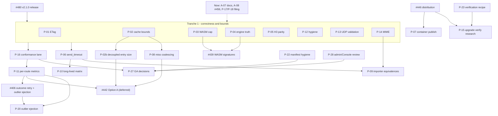

# Jul.IA — Read-only product and technical audit

| Item | Value |
| --- | --- |
| Report date | 2026-09-30 (UTC); audit started ≈10:27Z |
| Mode | **READ-ONLY.** No code, test, doc, generated file, issue, PR, comment, roadmap, manifest or release record was changed. No branch/commit/PR/tag/release created. |
| Audited revision | `main` = `origin/main` = `3258f1a392715ee8cfb2a0e557885930f326acd6` (working tree clean). This is the proposed v2.1.0 freeze owned by #480. |
| Comparison baseline | `v2.0.0` → `d56f5ceaf7ddb8a3875cbe6e27c9540db4130f75` (published 2026-09-21). `v2.0.0-rc.1` → `c9ab3a05`. No `v2.1.0` tag exists. |
| Binary examined | Copy of the #480 qualifying binary, SHA-256 `aaa7fc6d5fb26fe3ab7dbbdf2701dedc638fa7addc4706f93e79313c9510ec86`; `jul version` → `v2.1.0-rc.1`, commit `3258f1a3`, `go1.26.6`, `linux/arm64`, full profile. |
| Report location | Original working copy: `/home/victornf/jul-audit-20260930/jul-audit-report-2026-09-30.md`; publication target: `docs/audit/jul-audit-report-2026-09-30.md` |
| Post-audit baseline note | After the report was written, `main` moved to `f036b063` (PR #501: access-log writer sharing, a dependency security floor, docs). A read-only diff (8 files: `internal/observability/sinks.go` + test, CHANGELOG, three docs, Console lockfiles) shows no change to any file behind F-01–F-19, except `docs/known-limitations.md` line shifts: the cited L242 is now L238 and L510 is now L506. All findings still apply at `f036b063`. The Y1-10 access-log sink change itself was not re-reviewed. |

## Delivery status addendum — 2026-10-01

This addendum updates implementation and issue/PR status only; it does not revise the audit's 2026-09-30 evidence, frozen `3258f1a3` baseline, or confidence claims. The report's original READ-ONLY statement describes the audit session; this addendum was prepared separately for publication.

### Completed since the audit

- **#504** merged as PR #529 (`14f73b3f`) and closed: compression weakens strong ETags when the representation changes.
- **#507, #508 and #509** merged as PR #530 (`34b8859e`) and closed: HTTP/3 listener limits, truthful WASM engine reporting, and Docker/toolchain truth.
- **#505** merged as PR #531 (`52d70a24`) and closed: cache capture memory bounds. Its global in-flight budget is derived from `memory_max_size`, not a new config key; the PR documents the rationale and the resulting 2× bound.
- **PR #538** merged (`7c45643a`): ambiguous HTTP/1.x framing closes the connection after the response; the core-http request-smuggling claim now describes the evidence and mitigation.
- **PRs #541 and #542** merged: test-only fixes for UDP/TCP port selection in CI.
- **PR #544** merged (`9bcc9333`): deterministic configuration-file debounce test; the post-merge main CI run was still queued at this snapshot.

### Pending to merge

The following PR checks are green on their listed heads, but green checks alone do not make an old or conflicting base mergeable. Rebase/resolve, rerun CI, and verify main is green after each merge.

| PR | Scope / issue | Head at snapshot | CI | Remaining merge work |
| --- | --- | --- | --- | --- |
| #535 | HEAD through proxy; fixes #534 | `6b521ea5` | 61 checks green | Rebase onto the post-#544 main; confirm checks again. |
| #536 | Attribute unreadable/oversized client request bodies to the client | `c61a468d` | 62 checks green | Rebase onto the post-#544 main; confirm checks again. |
| #537 | Phase 1 remainder: #502, #506, #510, #511, #512 | `83fb79d6` | 61 checks green | Conflicting on its older `52d70a24` base; rebase after #535/#536, resolve shared CHANGELOG/contract conflicts, and rerun CI. |
| #543 | Phase 2 conformance lane (#513) | `0a39f594` | 54 checks green | Rebase after the correctness PRs and #537; then merge only on green main. Its first h3spec/Autobahn artifacts will be produced by the scheduled/manual workflow on amd64. |

### Original phase status

- **Phase 1:** #504/#505/#507/#508/#509 are complete. #502/#506/#510/#511/#512 remain pending in #537; the additional conformance-discovered HEAD and client-body fixes are #535/#536.
- **Phase 2:** #513 is pending in #543; #514/#515/#516/#517 remain open and not yet started.
- **Phase 3:** #518/#519/#520 remain open and not yet started.
- **Phase 4:** #521 remains open and not yet started.

This publication and archive-location change affects document organization only; it does not change the finding dispositions above. Issue state and live CI remain authoritative over this point-in-time table.

## Claim level — read this first

**This report is not an exhaustive certification.** It covers **every** manifest feature (42 rows in `docs/feature-status.yaml`), **every** open issue (16, re-verified at report time; 0 open PRs) plus the anomalous recent closure of #456, a list of capabilities that have no manifest row, and deep dives A–E. The depth is **not** exhaustive:

1. **No Go, Console or E2E test suite was run locally.** The #480 qualifying soak was running on the same host for the whole audit. Test status comes from CI: **61/61 check runs succeeded on `3258f1a3`**, confirmed read-only through the GitHub API.
2. **Not line-reviewed:** `internal/admin` (≈25k LOC) and the Console TypeScript (≈32k LOC). Only targeted paths were read: auth gate, origin guard, RBAC, pprof gate, off-loopback validation.
3. The 2026-09-27 documentation ledger has **112 rows marked "not reviewed"**. This audit sampled doc–code truth where it touched a finding. It did not clear the ledger.
4. **Windows and macOS were not exercised.** Only a Linux/arm64 WSL2 host was used.
5. **Unverified external facts:** the KEF product protocol set and the UPnP UDA default SSDP TTL. Both are labeled where used.
6. Dynamic probes were deliberately small. The soak had to stay undisturbed.

Severity scale: **P0** = exploitable or data-loss in default config, **P1** = serious in common config, **P2** = real defect or bound in plausible config, or a material false claim, **P3** = minor, hygiene or low-likelihood. Severity is separate from **priority**, which is timing: *Now* means backlog hygiene only, with no code work before #480. *Next* is the first post-release tranche. *Later*, *Research* and *Never* follow.

---

## 1. Executive assessment

**Bottom line.** Jul is a coherent single-node, single-binary, NGINX-inspired HTTP edge server. Its evidence discipline is unusually strong: a canonical manifest, ADR-governed GA criteria, generated contracts, about 1.5 lines of test per line of production Go, and 61 CI checks. This audit found **no P0/P1 defect**. It confirmed one standards-conformance bug by reproducing it against the release-candidate binary. It also confirmed two resource-bound defects and a cluster of documentation-truth defects, three of them in security or deployment claims. **All confirmed defects already exist in the published v2.0.0.** None is a regression in the v2.1.0 freeze, and none is a #480 blocker under the repository's own policy. The main strategic risk is not a missing feature. It is that the product's breadth has outgrown what a solo maintainer's evidence budget can keep true.

### Direct answers

**Are there bugs?** Yes. None is P0/P1.

- **F-01 (P2, confirmed on the RC binary):** on-the-fly compression reuses the origin's *strong* ETag for the gzip/br/zstd representation. `Range` + `If-Range: <that ETag>` then returns **206 identity bytes** that belong to the uncompressed representation. `If-None-Match` also cross-validates the two representations. This violates RFC 9110 §8.8.1 and §8.8.3.3. nginx has weakened strong ETags on modification since 1.7.3.
- **F-02 (P2, confirmed by code):** the response cache's per-entry cap is fixed to `memory_max_size`, which defaults to 64 MiB. Every concurrent cacheable miss can pin a capture buffer of up to that size for the whole response, because `bytes.Buffer.Reset` keeps its capacity. There is no early `Content-Length` check and no oversize metric. The docs imply the disk tier can hold larger objects; it cannot.
- **F-03 (P2, confirmed by code):** WASM plugin *active* instances have no upper bound. Only the idle pool is capped at 64. Memory scales as concurrency × `memory_limit` (+ `max_response_body` for v2 plugins). The ABI doc calls it a "bounded pool".
- Minor defects: dead `middleware.Timeout` (F-12); UDP stream config accepts multicast/broadcast backends that cannot work (F-13).

**Is it secure and safe?** Mostly, for its stated single-node scope.

- **Strengths:**
  - The admin surface defaults to loopback. A transport gate requires TLS or loopback, and validation **rejects** an off-loopback admin without a token or RBAC.
  - Token comparison is constant-time. There are CSP and an origin guard, and pprof is gated by `admin:manage`.
  - The WAF request body limit fails closed with 413.
  - Egress uses an allow-list. Secret references are redacted.
  - Static files are served through `os.Root`, which prevents traversal. Importer include traversal is bounded.
  - Releases carry Sigstore build-provenance and SBOM attestations.
- **Weaknesses are missing bounds, not open holes:**
  - WASM instance concurrency (F-03).
  - Cache capture amplification (F-02).
  - No inactivity send timeout for slow readers (F-06).
  - The HTTP/3 listener ignores listener header/idle/connection limits (F-05).
- **Some security documentation is wrong** (F-04, F-05):
  - The plugin threat model says wazero is a "pure-Go interpreter with no JIT". The default runtime compiles guests to native code.
  - The HTTP/3 threat note says quic-go enables 0-RTT by default. With Jul's `nil` `quic.Config`, it does not.
- No authentication bypass, injection or traversal was found on the paths reviewed. Confidence is medium-high for data-plane paths and medium for the admin/Console surface, which was not line-reviewed.

**Is the code complete and well structured?** Largely yes. The layers are clear, reload is generation-based, and a lifecycle registry classifies every field as hot-reload or restart-required. Contracts are generated and drift-checked, and test density is high. There are three structural concerns:

- **Weight:** the control plane (≈54k LOC, 53% of production Go) is ~1.7× the data plane (≈32k LOC). The Console adds ≈32k TS LOC and the docs ≈61.5k lines.
- **Hot spots:** four Go files are over 1,500 lines (`server/server.go` 1794, `admin/server.go` 1651, `config/schema.go` 1583, `app/serve.go` 1546). Console `client.ts` is 3350 lines and `ConfigPanel.tsx` is 2051.
- **Drift:** there is dead code (F-12) and recurring doc-truth drift (F-04, F-05, F-07, F-14).

Every GA row has its ADR 0003 evidence. The 18 Beta rows lack feature-specific soak by design.

**What does Jul offer?**

- HTTP/1.1, HTTP/2, h2c and HTTP/3 ingress.
- Static files with precompressed sidecars, reverse proxy, FastCGI, uWSGI and Unix-socket upstreams.
- Virtual hosts with bounded route predicates, response headers and CORS.
- TLS with ACME (HTTP-01/TLS-ALPN-01), OCSP stapling and mTLS client auth with CRL hot reload.
- Compression (gzip/br/zstd).
- An RFC 9111 shared cache (memory + disk).
- Rate and connection limits.
- Basic/JWT/forward-auth/CIDR authentication.
- Active HTTP/TCP/gRPC health checks.
- Upstream admission, retry, circuit breaking and consistent-hash affinity.
- A Coraza/CRS WAF.
- WASM plugins (request phase v1, response phase v2).
- gRPC passthrough and gRPC↔JSON transcoding.
- An L4 TCP/UDP stream proxy with SNI routing and PROXY protocol.
- DNS/Consul/Kubernetes service discovery.
- Transactional hot reload.
- A versioned admin API with a remote CLI.
- A Console operations cockpit with RBAC.
- `jul doctor` and support bundles.
- An NGINX importer and assessment.
- OTel tracing, Prometheus metrics and access-log sinks.
- Zero-config `jul run` and `jul lint`.
- Lean/full builds for linux/windows/darwin × amd64/arm64, systemd units and a Windows service.

**What is missing?** These are gaps relative to Jul's own charter, not competitor parity.

- **Correctness and safety bounds:** F-01, F-02, F-03, F-05, F-06.
- **Operator evidence:**
  - No per-route RED metrics (F-11).
  - No protocol-conformance lane: no h2spec, Autobahn, h3spec or cache-tests (F-16).
  - The reload × long-lived-connection behavior is not documented as a matrix (F-10).
- **Application-outcome retry** (#406); the importer blocks `proxy_next_upstream`.
- **Media hygiene:** no configurable MIME table (F-15). HLS/DASH playlists and segments get the wrong or generic `Content-Type` on distroless/minimal hosts.
- **Distribution truth:** the documented GHCR image is not published, and the Dockerfile toolchain differs from the release toolchain (F-07).
- Explicitly deferred items: DNS-01 (#433), WebSocket over H2/H3 (#435), gRPC-Web (#436), OIDC admin (#441), range-aware cache (#442) and WASM signatures (#439).

**Is the product strategy coherent?** Yes, at charter level. ADR 0013 has five lanes, an explicit non-goal registry, "one major experiment at a time" and value-ranked hot reload. Three things work against it:

1. The feature surface is wide for a solo maintainer. ADR 0013 itself cites "the solo-maintainer test matrix".
2. Governance hygiene has slipped:
   - #456 was closed as COMPLETED with no work or comment, while `#62`/roadmap/#480 still call it a deferred candidate.
   - The 2026-09-27 audit residuals D11/D12 were never filed.
3. Several "shipped" claims are false or unverifiable (the GHCR image, the plugin engine, 0-RTT).

**What next?** After #480 publishes:

1. **Tranche 1 — edge correctness and bounds (S–M):** F-01, F-02 (early drop + release buffer + oversize metric + doc), F-03 (instance cap), F-05, F-12, F-13.
2. **Tranche 2 — doc and distribution truth (S):** F-04, F-07, F-14, #456 hygiene, filing D11/D12.
3. **One mid-term capability**, chosen by ADR 0013 value ranking. The recommended order is F-06 (inactivity send timeout), then F-11 (per-route metrics), then #406. Then the protocol-conformance lane (F-16).
4. **Defer or reject:**
   - Reject an SSDP/DLNA relay and gateway media transcoding.
   - Keep the in-process auto-updater a non-goal.
   - Defer #442 (fragment cache), #443, #436 and #444.
   - Allow only a read-only `jul upgrade check/verify` as a research issue.

### Top findings

| ID | Sev | Status | Finding | Since |
| --- | --- | --- | --- | --- |
| F-01 | P2 | Confirmed (dynamic probe on RC binary) | Compression reuses strong ETag → If-Range/If-None-Match cross-representation mismatch | ≤ v2.0.0 (verified) |
| F-02 | P2 | Confirmed (code) | Cache capture buffer pinned up to `memory_max_size` per in-flight miss; no early Content-Length drop; disk tier cannot hold > memory cap; no oversize signal; docs misleading | ≤ v2.0.0 (verified) |
| F-03 | P2 | Confirmed (code) | WASM active instances unbounded under concurrency; docs claim bounded pool | ≤ v2.0.0 (verified) |
| F-04 | P2 | Confirmed (code + dependency source) | Plugin threat model says "pure-Go interpreter, no JIT" — false; systemd `MemoryDenyWriteExecute=yes` silently forces interpreter mode | ≤ v2.0.0 (verified) |
| F-05 | P3 | Confirmed (code + dependency source) | HTTP/3 listener ignores `max_header_bytes`/`idle_timeout`/`read_header_timeout`/`max_conns`; 0-RTT threat note wrong | ≤ v2.0.0 (verified) |
| F-06 | P2 (gap) | Confirmed (code) | No inactivity (send_timeout-style) downstream write timeout; `write_timeout` is absolute | long-standing |
| F-07 | P2 | Confirmed (network + code) | Documented `ghcr.io/victornife/jul:latest` not published (anonymous pull token → 403); Dockerfile Go 1.27 ≠ release 1.26.6; image = third "console-only" profile | ≤ v2.0.0 (verified) |
| F-08 | P3 | Confirmed (GitHub) | #456 closed COMPLETED without work while all authorities still call it a deferred candidate | 2026-09-29 |
| F-09 | P3 | Confirmed (importer probe) | Importer blocks ubiquitous directives Jul already satisfies (`proxy_http_version 1.1` + Upgrade idiom, `proxy_buffering off`, server-level `client_max_body_size`) | long-standing |
| F-15 | P3 | Confirmed (code + Go stdlib) | No MIME-type configuration; `.m3u8 .mpd .m4s .ts .mkv .aac` absent from Go's built-in table → wrong/octet-stream types on distroless and minimal hosts | long-standing |

Additional findings F-10–F-19 are in §4.

---

## 2. Baseline and methodology

### 2.1 Baseline

| Fact | Value | How verified |
| --- | --- | --- |
| Go toolchain | `go 1.26.6` in `go.mod`; local `go1.26.6 linux/arm64`; release workflow uses `go-version-file: go.mod` | `go.mod`, `go version`, `.github/workflows/release.yml` L45/62/104 |
| Host | WSL2, aarch64, 12 CPUs | `uname`, `nproc` |
| Full build tags | `brotli zstd acme console otel grpc http3 importer wasmplugins stream consul kubernetes waf` | Makefile `FULL_TAGS` |
| Key dependencies | quic-go v0.63.0, wazero v1.12.0, coraza v3.7.0 + coreruleset v4.25.0, otel SDK v1.46.0 (semconv v1.43.0), golang-jwt v5.3.1 | `go.mod`, module cache source |
| CI on audited SHA | 61 check runs, all `success` | `gh api …/commits/3258f1a3…/check-runs` (read-only) |
| #480 soak during audit | `integrated-qualifying-20260930T084518Z`, started 08:45:20Z, expected end ≈12:45:35Z; driver 30557, server 30652, guard 30901 still running at 11:03Z | `ps` (observation only) |
| Code size | Production Go ≈101.8k LOC; Go tests ≈152.6k; Console TS ≈32k; docs Markdown ≈61.5k lines; 20 workflows (~56 jobs) | `wc`/`find` over tracked files |
| Metrics contract | 70 metrics in `docs/metrics-contract.json` | file read |

### 2.2 Authorities read

- `docs/feature-status.yaml` (manifest, updated 2026-09-29) and `docs/status.md`.
- `docs/known-limitations.md`.
- ADRs: 0003 (maturity/GA criteria 1–9), 0005 (soak post-GA gate), 0013 (operating model and completeness), 0016–0021 (inbound identity, resilience, routing, configuration authority, WASM ABI v2, consistent hash).
- `docs/specs/core-gateway-completeness.md` and the roadmap documents.
- Issues: #62 (programme and non-goal registry), #480 (release) and every open issue, dumped read-only to `jul-audit-20260930/issues/`.
- Prior audits:
  - 2026-09-16 pre-soak audit. BL-11 (Console coverage floors) and BL-12 (protocol conformance lane) are still open.
  - 2026-09-27 documentation review. D01–D84 and D86–D87 are fixed; D11/D12 are open.
  - 2026-09-29 high-risk, cache/WAF/plugin and final high-impact batches (60 fixes).
- Per-feature guides under `docs/` for every manifest row.

### 2.3 Methods

1. **Static code reading** of the data-plane paths behind each feature, focused on bounds, failure modes, reload ownership and security gates.
2. **Seven exploratory sub-reports**, re-verified directly where they supported a finding. Claims **rejected on re-verification** (listed to prevent propagation):
   - "WASM memory growth is unbounded". Wrong: instances retire after 1000 invocations and the idle pool is capped. *Concurrency* is unbounded (F-03).
   - "WAF bodies beyond the limit bypass inspection". Wrong: the result is 413, fail-closed.
   - "The importer ignores includes". Wrong: `-follow-includes` provides bounded traversal (depth 16 / 256 files / 4 MiB per file / 32 MiB total).
   - "Releases are unsigned". Wrong: Sigstore provenance and SBOM attestations exist. `SHA256SUMS` itself is unsigned.
   - "The OTel schema-URL conflict is still present". Fixed: semconv v1.43.0 matches the SDK v1.46.0 resource, and an otel-tagged test guards it.
   - "GOMAXPROCS is not configurable". Wrong: `[global] worker_threads` exists.
   - Several guessed package paths (`internal/acme`, `internal/ratelimit`) do not exist. The real locations are in the ledger.
3. **Dynamic probes on a copy of the RC binary:**
   - Loopback-only, `nice`d, on port 18480, away from the soak's ports.
   - One Jul process was started and stopped cleanly.
   - Probes: the ETag/Range/If-Range/If-None-Match matrix under compression (F-01), `jul import nginx -assess` on a media-style config (F-09), and `jul check`.
4. **Dependency source reading** in the Go module cache: wazero runtime-config and platform compiler-support probe, quic-go `Config` defaults, coraza limits, and the otel resource schema.
5. **Go stdlib semantics** from the local `go doc` for go1.26.6:
   - `Server.Shutdown` "does not attempt to close nor wait for hijacked connections such as WebSockets".
   - `ResponseController.SetWriteDeadline`.
   - `ReverseProxy.FlushInterval` "ignored … for streaming responses or ContentLength -1".
   - `mime.TypeByExtension` built-in table plus system databases.
6. **External primary sources**, fetched in session unless marked otherwise:
   - RFC 9110 §8.8.1, §8.8.3.3, §13.1.5, §14.2 — https://www.rfc-editor.org/rfc/rfc9110.html
   - nginx CHANGES 1.7.3 ("strong [entity tags] are changed to weak" on response modification) — https://nginx.org/en/CHANGES
   - nginx `send_timeout`, `max_ranges`, `client_max_body_size` — https://nginx.org/en/docs/http/ngx_http_core_module.html
   - OCF UPnP resources — https://openconnectivity.org/developer/specifications/upnp-resources/upnp/
   - UPnP Device Architecture 2.0 PDF, saved locally. Only partial text extraction worked; the §4.1.1 same-network-segment eventing rule was extracted.
   - SSDP background — https://en.wikipedia.org/wiki/Simple_Service_Discovery_Protocol
   - Cloudflare, "Stupidly Simple DDoS Protocol (SSDP) generates 100 Gbps DDoS" — https://blog.cloudflare.com/ssdp-100gbps/ (link as recorded, not re-fetched)
   - US-CERT TA14-017A (UDP amplification) — cited, not re-fetched.
   - RFC 8216 (HLS) §4/§6 — cited from knowledge, **not re-fetched**.
   - KEF and Jellyfin DLNA pages could not be fetched, so the KEF protocol set is **unverified**.
7. **GitHub (read-only):** issue and PR metadata, check runs, and an anonymous GHCR token request for `repository:victornife/jul:pull`, which returned **HTTP 403**.

### 2.4 Not performed

- Test, fuzz, race or benchmark runs. CI and the pre-push hook own those gates, and the soak was active.
- Soak, certification and publication work. #480 owns them.
- Console UI walkthrough.
- Windows or macOS runs.
- Real ACME CA issuance.
- Consul or Kubernetes live discovery.
- Load or DoS reproduction of F-02, F-03 or F-06. These rest on code reading and are marked "confirmed (code)".

### 2.5 Side effects (full disclosure)

- **Created outside the repository**, under `/home/victornf/jul-audit-20260930/` (≈43 MB):
  - `bin/jul` — a copy of the RC binary, checksum verified.
  - `probe/` — probe config, logs, sample www files, importer input/output.
  - `refs/uda2.pdf` and `refs/uda2.txt`.
  - `issues/*.md` — 16 issue dumps (every open issue).
  - This report.
- **Processes:** one `jul` process on `127.0.0.1:18480` for the ETag probe, started and stopped. Brief `jul check` and `jul import` CLI runs. Nothing touched the soak's processes, ports or evidence root (`/home/victornf/jul-release-evidence/v2.1.0-3258f1a3/`).
- **Temporary files:** two files in `/tmp` for transcript lookup were created and then deleted. Pre-existing `/tmp/jul-pr500-*` files were left untouched.
- **Network:** GitHub API reads, one anonymous GHCR token request, and external documentation fetches.
- **Agent session notes:** stored in the editor's session memory, outside the repository. No repository-scoped memory was written.
- **Repository:** `git status --porcelain` was empty before and after.

---

## 3. Complete feature ledger

**Legend.**

- **Avail:** build profile (lean = core tags only; full = `FULL_TAGS`) / OS / release that contains it. `merged` rows are only in the unpublished v2.1.0 tree.
- **Crit:** ADR 0003 criteria 1–9. 1 conformance matrix, 2 benchmarks, 3 known limits, 4 stable contract, 5 soak, 6 example + docs, 7 threat note, 8 fuzz, 9 operability. `-` = n/a or null.
- **Bounds:** Sec = security, Fail = failure, Cap = capacity, Rel = reload.
- **C/Conf:** completeness against the documented contract / confidence of this audit's assessment.

### 3.1 GA rows (24)

#### Y1-01 — TLS + automatic HTTPS (ACME) — GA / soaked — crit 1–7,9 ✓, 8 n/a
- **Job:** terminate TLS with operator certificates, or obtain and renew them automatically.
- **Surface/sources:** `[servers.tls]`, `[acme]`; `internal/server/tls.go`, `acme.go`, `acme_ocsp.go`, `acme_preflight.go` (stub `acme_stub.go` for lean); `docs/tls-acme.md`.
- **Avail:** TLS in lean and full; ACME full only (`acme` tag); all OS; released (v1.x → v2.0.0).
- **Interactions:**
  - HTTP/3 requires TLS on the server block.
  - mTLS (Y2-07/MTLS-HOT).
  - Certificate material and OCSP policy hot-reload (HR-SELECTED).
  - Alt-Svc.
  - The admin listener is a separate TLS path (ADMIN-TLS, no ACME there).
- **Bounds:**
  - Sec: HTTP-01 and TLS-ALPN-01 only; DNS-01 deferred (#433).
  - Fail: preflight checks; renewal failure keeps serving the last certificate (per docs).
  - Rel: certificate material hot-reloads.
- **Tests/evidence:** package tests `acme_test.go`, `acme_tagged_test.go`, `acme_ocsp_test.go`, `tls_test.go`, `tls_bench_test.go`. There is no production-CA journey evidence (D12, open).
- **Defects/limits:** no wildcards without DNS-01; production-certificate journey uncertified.
- **C/Conf:** High / Medium.
- **Improve:** keep #433 deferred until wildcard demand is evidenced; add production-like TLS journey evidence under the D12 issue (§8.2 P-18).

#### Y1-02 — Compression (gzip / Brotli / Zstd) — GA / soaked — crit 1–7,9 ✓
- **Job:** reduce response bytes.
- **Surface/sources:** `[compression]`; `internal/middleware/compress.go` (+ `_brotli.go`, `_zstd.go`); precompressed sidecars in `internal/handler/static.go`; `docs/compression.md`.
- **Avail:** gzip in lean; br/zstd full only; all OS; released.
- **Interactions:**
  - Skips `Range` requests, `no-transform` and 206.
  - Deletes `Content-Length` and `Accept-Ranges` when compressing.
  - Always adds `Vary: Accept-Encoding`.
  - Sits outside the cache: the cache stores identity bytes and compression is applied per client.
  - WASM v2 response phase ordering.
- **Bounds:**
  - Cap: probe buffer is 64 KiB (`maxCompressionProbeBytes`).
  - Rel: hot-reloadable per lifecycle registry.
- **Tests/evidence:** extensive unit tests; soaked. **No ETag/validator conformance test**; F-01 slipped through.
- **Defects/limits:**
  - **F-01** (strong ETag reused).
  - An explicit `encoders = []` is silently defaulted to gzip (`config/parser.go` ≈L392–393). This may be surprising; document it or reject it.
- **C/Conf:** High, except validators / High.
- **Improve:** A-01 (weaken strong ETags); add a conformance test.

#### Y1-03 — Rate + connection limiting — GA / soaked — crit 1–7,9 ✓
- **Job:** per-key request rate limiting and a per-listener connection cap.
- **Surface/sources:** location/server `rate_limit` (`key` = `ip` | `header:<Name>` | `jwt:<claim>`), `max_conns`; `internal/middleware/ratelimit.go`, `internal/server` connection cap; `docs/ratelimit.md`.
- **Avail:** lean and full; all OS; released.
- **Interactions:**
  - Canonical client address (CGC-IN).
  - JWT claims (Y1-04).
  - Console global policy.
  - The admin listener has its own admission (HR-07A).
- **Bounds:**
  - Sec: header keys are client-controlled and documented as untrusted.
  - Cap: token bucket (`x/time/rate`), 32 lock stripes, idle TTL 10 min, so the bucket map stays bounded.
  - Fail: 429 with `Retry-After`.
  - Rel: parameters update in place.
  - `max_conns` is listener-global, holding the socket accepted but unserved.
- **Tests/evidence:** behaviour matrix fully mapped to tests in `docs/ratelimit.md`.
- **Defects/limits:**
  - Local only (no distributed limit — a non-goal).
  - `max_conns` does not apply to HTTP/3 QUIC connections (F-05).
  - `header:` keys can be used to evade limits unless Jul sits behind a trusted proxy (documented).
- **C/Conf:** High / High.
- **Improve:** extend `max_conns` to QUIC (A-05).

#### Y1-04 — Authentication (CIDR / Basic / JWT / forward-auth) — GA / soaked — crit 1–9 ✓
- **Job:** gate routes by network, credentials, JWT or an external auth probe.
- **Surface/sources:** `[servers.locations.auth]` with `.basic`, `.jwt`, `.forward_auth`; `internal/auth/{basic,jwt,forward,cidr}.go`; `docs/auth.md`.
- **Avail:** lean and full; all OS; released.
- **Interactions:**
  - Rate-limit JWT keys.
  - Resilience (dependency protection for JWKS and forward-auth).
  - WAF ordering.
  - Cache: authenticated reuse rules (core-cache).
- **Bounds:**
  - Sec: tokens only from the `Authorization` header — no query or cookie tokens, and no `secure_link`-style signed URLs.
  - One credential method per location; one issuer/audience per location; only standard claims validated.
  - Fail: forward-auth is a GET probe with dependency resilience.
  - Rel: JWKS/forward-auth clients are generation-owned.
- **Tests/evidence:** complete criteria including fuzzing.
- **Defects/limits:** no OIDC/OAuth flows, no multi-issuer, no custom claim assertions, and no signed-URL support for media/download links (gap G-07).
- **C/Conf:** High / Medium-High.
- **Improve:** a signed-URL (HMAC + expiry) capability as a WASM example first (deep dive A).

#### Y1-05 — Active health checks (HTTP / TCP probes) — GA / soaked — crit 1–7,9 ✓
- **Job:** remove unhealthy backends from balancing.
- **Surface/sources:** `health_check` in `[[upstreams]]`; `internal/upstream/health*.go`; `docs/health.md`.
- **Avail:** HTTP/TCP in lean and full; gRPC probes full only (GRPC-HC); all OS; released.
- **Interactions:**
  - Load balancing eligibility.
  - Circuit breaker.
  - Consistent-hash eligible set.
  - `backend_tls` (probes use the pool's policy).
  - Unix upstreams.
- **Bounds:**
  - Fail: threshold state machine.
  - Cap: one fresh connection per probe (keep-alive off, by design).
  - Rel: probes are generation-owned.
- **Tests/evidence:** conformance matrix in the doc.
- **Defects/limits:**
  - GET only; no custom headers or HEAD.
  - Health state is per process.
  - No outlier ejection (passive), only a consecutive-failure circuit (CGC-RES).
- **C/Conf:** High / High.
- **Improve:** custom probe headers/Host (small, frequently needed behind virtual-hosted backends). Low priority.

#### Y1-07 — Console (operations cockpit) — GA / soaked — crit 1–7,9 ✓
- **Job:** a browser UI for status, config editing (two-tier editing), apply/stage/rollback, history, security, TLS, streams, plugins, observability and diagnostics.
- **Surface/sources:** `internal/admin` (≈25k LOC) plus the Console TS app (≈32k LOC; features: apps, config, history, observability, operations, overview, plugins, routes, search, security, streams, tls, traffic-controls, transcode, wizard); `docs/console.md`; ADRs 0004/0006/0009/0010.
- **Avail:** full only (`console` tag); the Docker image default is console-only; all OS; released.
- **Interactions:**
  - AUTO-AUTH (managed drift).
  - AUTO-API.
  - RBAC (`[admin.rbac]`).
  - HR-SELECTED.
  - OPS-DIAG-UX.
  - WAF-PROVENANCE.
- **Bounds:**
  - Sec: loopback default; TLS-or-loopback transport gate; constant-time token compare; origin guard and CSP; token held in `sessionStorage`; RBAC with scoped revocable tokens; pprof requires `admin:manage`.
  - Fail: staged apply with rollback.
  - Rel: admin controls are hot where classified.
- **Tests/evidence:** Playwright journeys and coverage floors. BL-11 is open: the coverage floor was lowered from 70% to 58%.
- **Defects/limits:**
  - Single shared token by default.
  - No OIDC (#441).
  - Not line-reviewed by this audit.
  - Large files (`client.ts` 3350, `ConfigPanel.tsx` 2051).
- **C/Conf:** High / **Medium-Low** (not line-reviewed).
- **Improve:** restore coverage floors (BL-11); decompose the largest modules opportunistically.

#### Y1-08 — Zero-config + `jul lint` — GA / soaked — crit 1–9 ✓
- **Job:** `jul run --serve DIR` / `jul run --proxy TARGET` starts a working server instantly; `jul lint` gives advisory checks.
- **Surface/sources:** `cmd/jul/cli.go`; `docs/zeroconf.md`.
- **Avail:** lean and full; all OS; released.
- **Interactions:** synthesised configs go through `Validate`; lint shares the route-shadowing matcher (AUTO-CONTRACT/CGC-ROUTE).
- **Bounds:**
  - Sec: **default listen is `:8080` on all interfaces, no TLS, no admin auth.** This is documented as a local starting point.
  - Fail: synthesised configs are validated.
- **Tests/evidence:** criteria complete.
- **Defects/limits:**
  - The zeroconf threat table says the off-loopback admin case only "warns". Validation actually **rejects** it (`internal/config/validate.go` L204–205). The doc understates the protection (F-14).
  - `docs/zeroconf.md` has a duplicate "## Benchmarks" heading (L101, L119).
- **C/Conf:** High / High.
- **Improve:** consider defaulting `jul run` to `127.0.0.1:8080` in the next major version, or printing a prominent notice. P3.

#### Y1-09 — NGINX config importer — GA / soaked — crit 1–7,9 ✓
- **Job:** translate nginx configs into Jul TOML with blocking diagnostics.
- **Surface/sources:** `jul import nginx` (`-assess`, `-json`, `-follow-includes`, …); `internal/migrate/nginx` (≈7.4k LOC); `docs/nginx-importer.md`, `docs/nginx-migration-corpus.md`.
- **Avail:** full only (`importer` tag); all OS; released.
- **Interactions:** MIG-ASSESS (schema v2, provenance, includes); AUTO-CONTRACT.
- **Bounds:** Sec: include traversal is bounded; unknown directives produce blocking `NGX_DIRECTIVE_UNSUPPORTED`.
- **Tests/evidence:** corpus tests and a CI e2e workflow (`nginx-migration-e2e.yml`).
- **Defects/limits — F-09.** The probe input used common media/app idioms. Nine directives were reported as not translated:
  - `gzip_types`
  - **server-level** `client_max_body_size` — Jul supports `servers[].client_max_body_size`
  - `proxy_http_version 1.1` + `proxy_set_header Upgrade/Connection` — Jul proxies WebSocket upgrades natively
  - `proxy_buffering off` — Go's ReverseProxy flushes streaming and unknown-length responses immediately
  - `proxy_next_upstream`
  - `send_timeout` — no Jul equivalent (F-06)
  - `expires`

  Also:
  - `include mime.types` / `types {}` / `default_type` have no target (F-15).
  - Generated TOML emits every zero-valued field, which makes it noisy.
- **C/Conf:** Medium-High / High.
- **Improve:** A-09. Recognise the WebSocket idiom and `proxy_buffering off` as equivalents. Translate server-level `client_max_body_size`. Map `expires` to `cache_control` where exact. Omit zero values.

#### Y1-10 — OTel tracing + access-log sinks — GA / soaked — crit 1–7 ✓, 8/9 null
- **Job:** distributed tracing (W3C propagation, OTLP export) plus structured access logs to stdout, file (with rotation) or syslog.
- **Surface/sources:** `[tracing]`, `[logging]`; `internal/observability/tracing.go`, `internal/tracing`, logging middleware, `internal/logthrottle`; `docs/otel.md`, `docs/observability.md`.
- **Avail:** tracing full only (`otel` tag); access logs lean and full; all OS; released.
- **Interactions:**
  - Sample ratio hot reload (HR-SELECTED).
  - Access-log `client_ip` (CGC-IN).
  - Upstream attribution.
- **Bounds:** Rel: ratio updates are hot; a same-path rotation-setting change has a documented narrow window.
- **Tests/evidence:** the earlier schema-URL conflict bug is **fixed** (semconv v1.43.0 aligns with SDK v1.46.0) and guarded by `TestLocalOTLPHTTPPipelineSurvivesRatioUpdates` (otel tag).
- **Defects/limits:**
  - Criterion 9 is null — operability is not certified for this GA row. That is a manifest inconsistency: a GA row with a null criterion needs an explicit n/a rationale.
  - Metrics have no per-route dimension (F-11).
- **C/Conf:** High / Medium-High.
- **Improve:** record the criterion 8/9 rationale in the manifest; add per-route RED metrics (A-11).

#### Y1-11 — HTTP/3 over QUIC — GA / soaked — crit 1–7,9 ✓
- **Job:** serve HTTP/3 in parallel with TCP on the same address and advertise it with Alt-Svc.
- **Surface/sources:** `servers[].http3`; `internal/server/http3.go`, `http3_altsvc.go`; `docs/http3.md`.
- **Avail:** full only (`http3` tag); all OS; released.
- **Interactions:**
  - TLS required.
  - mTLS on H3 (MTLS-HOT covers H3 handshakes).
  - Cannot be combined with PROXY protocol.
  - Alt-Svc hot reload.
- **Bounds:**
  - Sec: 0-RTT is **off** (quic-go `Allow0RTT` defaults to false and Jul passes a `nil` `quic.Config`).
  - Cap: quic-go defaults apply — idle timeout 30 s, 100 incoming streams per connection, header limit 1 MiB (`http.DefaultMaxHeaderBytes`).
  - Listener `max_header_bytes`, `idle_timeout`, `read_header_timeout` and `max_conns` are **not applied** (F-05).
- **Tests/evidence:** `http3_*_test.go`; soaked. No h3spec or interop lane (F-16).
- **Defects/limits:**
  - **F-05.**
  - `docs/http3.md` threat note #1 says quic-go enables 0-RTT by default. That is inaccurate for Jul's configuration.
  - Alt-Svc is a client-cached hint (documented).
- **C/Conf:** Medium-High / High.
- **Improve:** A-05.

#### Y2-01 — gRPC ↔ JSON transcoding — GA / soaked — crit 1–9 ✓
- **Job:** expose gRPC services as JSON/HTTP.
- **Surface/sources:** location `grpc_transcode`; `internal/transcode` (≈2.5k LOC), `internal/handler/grpctranscode.go` (lean stub); `docs/grpc-transcoding.md`.
- **Avail:** full only (`grpc` tag); all OS; released.
- **Interactions:** `backend_tls` (UT-BE); resilience; Console transcode panel.
- **Bounds:**
  - Fail/Rel: `Transcoder.Close` closes the generation's `grpc.ClientConn`s. **In-flight transcoded streams are cut when a generation is force-retired after `shutdown_timeout`** (F-10).
  - Cap: bounded bodies (per doc).
- **Tests/evidence:** criteria complete including fuzz.
- **Defects/limits:** reload behaviour for long server-streaming calls is not in the known-limitations matrix (F-10).
- **C/Conf:** High / Medium.
- **Improve:** document the long-lived-stream reload behaviour and test it (A-10).

#### Y2-02 — WASM plugin system — GA / soaked — crit 1–9 ✓
- **Job:** sandboxed request-phase extensions (`jul-abi/v1`); response phase in WASM-ABI2.
- **Surface/sources:** `[[plugins]]`, location `plugins`; `internal/plugins` (≈2.9k LOC; `runtime.go`); `docs/plugins.md`, `docs/abi.md`.
- **Avail:** full only (`wasmplugins` tag); all OS; released.
- **Interactions:**
  - WAF ordering: plugins sit inside the location WAF and outside the cache.
  - Module content-identity binding (#429).
  - Console plugin upload.
  - Egress (plugins cannot make network calls; per docs).
- **Bounds:**
  - Sec: memory cap (`memory_limit`, default 16 MiB); instance retirement after 1000 invocations; idle pool cap of 64; instantiate timeout 10 s.
  - **Cap: no cap on concurrently active instances (F-03).**
  - Engine: `wazero.NewRuntimeConfig()` selects the **native compiler** on amd64/arm64 (linux/darwin/windows/…). Under systemd `MemoryDenyWriteExecute=yes` — which the shipped units set — wazero's executable-mmap probe fails and it **silently uses the interpreter** (F-04).
- **Tests/evidence:** golden ABI tests, fuzzing, soak.
- **Defects/limits:**
  - **F-03**, **F-04**.
  - Threat model text: "pure-Go interpreter with no JIT/no cgo" (`docs/plugins.md` ≈L562).
  - `docs/abi.md` ≈L279 says "Instances | the bounded pool (#420)".
  - `docs/known-limitations.md` ≈L510 says "There is no JIT". That is technically defensible (wazero compiles ahead of time, not a tracing JIT) but misleading next to the threat-model claim.
  - Module signatures and provenance are deferred (#439).
- **C/Conf:** High functionally, Medium on bounds / High.
- **Improve:** A-03, A-04.

#### Y2-03 — L4 stream proxy — GA / soaked — crit 1–9 ✓
- **Job:** TCP/UDP relay, SNI routing, TLS passthrough, PROXY protocol v1/v2 in and out.
- **Surface/sources:** `[[stream]]`; `internal/stream` (≈1.6k LOC; `udp.go`); `docs/stream.md`, `docs/stream-proxy.md`.
- **Avail:** full only (`stream` tag); all OS; released.
- **Interactions:**
  - Its own identity derivation (separate from HTTP CGC-IN).
  - Consistent hash on `client_ip` only (LB-AFFINITY).
  - Resilience attribution.
- **Bounds:**
  - Cap (UDP): per-client-address sessions, `max_udp_sessions` 10,000, 5 min idle, 64 KiB buffers.
  - UDP uses a **connected** backend socket, so replies are only accepted from the dialed backend.
  - **No multicast support**, and validation accepts multicast/broadcast backend addresses that cannot work (F-13).
- **Tests/evidence:** criteria complete.
- **Defects/limits:**
  - F-13.
  - Stream TLS termination is not offered (per importer docs).
  - L4 ALPN routing is deferred (#434).
- **C/Conf:** High / Medium-High.
- **Improve:** A-13 (reject multicast/broadcast with a clear message pointing to deep dive B).

#### Y2-04 — Native gRPC passthrough + h2c — GA / soaked — crit 1–7,9 ✓
- **Job:** proxy gRPC over HTTP/2 (TLS or h2c).
- **Surface/sources:** location `grpc = true`, server `h2c`; `internal/handler/grpcproxy.go` (lean stub); `docs/grpc-proxy.md`.
- **Avail:** full only (`grpc` tag); h2c on plaintext listeners; all OS; released.
- **Interactions:** `backend_tls`; GRPC-HC; resilience; trailers.
- **Bounds:**
  - Rel: `CloseIdleConnections` at retirement, so in-flight streams survive until the handler returns (unlike transcoding).
  - Cap: no per-stream idle timeout.
- **Tests/evidence:** soaked. No gRPC interop conformance lane.
- **Defects/limits:** gRPC-Web deferred (#436).
- **C/Conf:** High / Medium-High.
- **Improve:** none urgent.

#### Y2-05 — Service discovery / dynamic upstreams — GA / soaked — crit 1–7,9 ✓
- **Job:** populate upstream members from DNS/SRV, Consul or Kubernetes.
- **Surface/sources:** upstream `discovery`; `internal/upstream/disco_*.go`; `docs/service-discovery.md`.
- **Avail:** DNS in lean (per docs; confirm with `jul capabilities`); Consul/Kubernetes full only; all OS; released.
- **Interactions:** health; circuit; consistent hash (rendezvous keeps churn minimal); egress allow-list for auxiliary calls.
- **Bounds:**
  - Fail: last-good membership retained (per docs).
  - Sec: Consul/K8s tokens are secret references and lint flags literals.
  - Rel: generation-owned watchers.
- **Tests/evidence:** live CI workflows (`discovery-live.yml`, `discovery-k8s-kind.yml`).
- **Defects/limits:** polling cadence rather than DNS TTL (#438 retained). The #422 DNS fault run found no staleness problem.
- **C/Conf:** High / Medium.
- **Improve:** keep #438 deferred.

#### Y2-06 — Web application firewall (WAF) — GA / soaked — crit 1–7,9 ✓
- **Job:** Coraza v3.7.0 with the embedded OWASP CRS v4.25.0, per location.
- **Surface/sources:** location `waf`; `internal/waf/firewall.go` (≈0.8k LOC); `docs/waf.md`.
- **Avail:** full only (`waf` tag); all OS; released.
- **Interactions:**
  - Ordering with auth and plugins.
  - Response body inspection is opt-in (MIME-gated; Coraza default 512 KiB, `ProcessPartial`).
  - WAF-PROVENANCE visibility.
- **Bounds:**
  - Sec: request bodies are always read for inspection. `request_body_limit` defaults to 128 KiB and **over-limit bodies get 413 (fail-closed)**.
  - Cap: per-request body buffering up to the limit.
  - Rel: policy compiled per generation.
- **Tests/evidence:** soaked; CRS regression.
- **Defects/limits:**
  - The fail-closed 128 KiB default will reject media or file uploads on WAF-protected locations unless tuned. It is documented (`docs/waf.md` ≈L125, L279–283), but operators should expect it.
  - CRS auto-update is a non-goal.
- **C/Conf:** High / Medium-High.
- **Improve:** add an importer and Console hint that pairs large `client_max_body_size` with `waf.request_body_limit`.

#### Y2-07 — mTLS client auth — GA / soaked — crit 1–7,9 ✓
- **Job:** require or verify client certificates per server, and per location (`require_client_cert`).
- **Surface/sources:** `servers.*.tls.client_auth`; `internal/server/mtls.go`, `client_auth_rotation.go`, `internal/middleware/clientcert.go`; `docs/mtls.md`.
- **Avail:** lean and full; all OS; released.
- **Interactions:**
  - MTLS-HOT (CA/CRL hot reload, H3 handshakes).
  - Upstream identity forwarding.
  - Admin client auth is separate (ADMIN-TLS, restart-bound).
- **Bounds:**
  - Sec: SAN allow-list; CRL scoped to the issuer and applied to resumed sessions.
  - Rel: new handshakes only. Established connections keep their authentication (F-10 matrix).
- **Tests/evidence:** `mtls_test.go`, `mtls_reload_test.go`, `mtls_bench_test.go`.
- **Defects/limits:** no OCSP for client certificates (CRL only; per docs); long-lived connections are not re-validated on revocation.
- **C/Conf:** High / Medium-High.
- **Improve:** document that revocation affects only new and resumed handshakes; optionally add `max_connection_age` (A-10).

#### SEC-1 — Secrets references + log redaction — GA / soaked — crit 1–7,9 ✓
- **Job:** keep literal secrets out of config and logs.
- **Surface/sources:** secret reference syntax in config; `internal/config/secrets.go`, `internal/redact`; `docs/secrets.md`.
- **Avail:** lean and full; all OS; released.
- **Interactions:** lint literal-secret checks; support bundles (secret-safe); admin API projections.
- **Bounds:** Sec: redaction applies to logs, API and bundles.
- **Tests/evidence:** soaked.
- **Defects/limits:** no external secret-manager integration (by design).
- **C/Conf:** High / Medium.
- **Improve:** none.

#### core-cache — Response cache (memory + disk) — GA / soaked — crit 1–9 ✓
- **Job:** an RFC 9111 shared cache in front of upstreams.
- **Surface/sources:** `[cache]` plus location `cache`; `internal/cache` (≈3k LOC: `cache.go`, `http.go`, `validate.go`, `scalar_policy.go`); `docs/cache.md`.
- **Avail:** lean and full; all OS; released.
- **Interactions:**
  - Compression sits outside the cache.
  - Authenticated reuse rules.
  - `Vary` membership, and `Vary` cannot be edited on cached locations.
  - Purge via admin.
  - WASM v2 sits outside the cache.
  - Range requests bypass the cache (decision D05, #107/#132).
- **Bounds:**
  - Cap: key = method + host + RequestURI.
  - **Per-entry cap = `memory_max_size`** (default 64 MiB; "deliberately coupled"; guarded by `TestMaxEntryBytesCoupledToMemoryMaxSize`).
  - The capture tee buffers up to that cap per in-flight miss and pins its capacity after overflow.
  - Revalidation (`validate.go` `leadValidation`) buffers the origin's answer before the first byte.
  - Singleflight covers stale revalidation only; **there is no cold-miss coalescing**. The importer says `proxy_cache_lock` has "no equivalent".
  - Rel: generation-owned, cancellable revalidation.
  - Occupancy metrics exist: `jul_cache_bytes`, `jul_cache_entries`, `jul_cache_max_bytes`, evictions, and `jul_cache_events_total{state}` (HIT/MISS/STALE/BYPASS). There is **no OVERSIZE state**.
- **Tests/evidence:** recertified (#131–#134, #496 fixes).
- **Defects/limits:**
  - **F-02.**
  - `docs/cache.md` ≈L750–752 says objects larger than `memory_max_size` "(or disk_max_size)" are streamed but not cached, "no log or metric". The disk tier can never hold an object larger than `memory_max_size`, so the parenthetical misleads.
  - No range caching (#442).
- **C/Conf:** High semantically, Medium on bounds / High.
- **Improve:** A-02. #442 only after A-02 and with evidence.

#### core-http — Core HTTP (static / proxy / FastCGI / vhosts / routing) — GA / soaked — crit 1–9 ✓
- **Job:** the data-plane foundation.
- **Surface/sources:** `[[servers]]`, `[[servers.locations]]`, `[[upstreams]]`; `internal/handler/{static,proxy,proxy_unix,fastcgi,errorpages,admission,backendtls}.go`, `internal/router`, `internal/server/server.go`, `internal/middleware/*`; `docs/core-http.md`, `docs/configuration.md`.
- **Avail:** lean and full; all OS; released.
- **Interactions:** everything.
- **Bounds:**
  - Sec: static serving through `os.Root`; hidden files blocked unless `allow_hidden`; directory listing opt-in (lint warns).
  - Cap/Fail:
    - `read_header_timeout` 10 s, `idle_timeout` 60 s, `max_header_bytes` 1 MiB by default.
    - `read_timeout` and `write_timeout` default to 0 (unbounded).
    - `write_timeout` is **absolute per response**.
    - Upstream per-read/write inactivity timeouts are unbounded by default.
    - `client_max_body_size` defaults to unlimited. nginx's default is 1m.
  - The proxy uses `httputil.ReverseProxy` without `FlushInterval`, so Go flushes `text/event-stream` and unknown-length responses immediately.
  - Rel: generation retirement after `shutdown_timeout` (F-10).
- **Tests/evidence:** soaked. `docs/core-http.md` L636–650 itself rates slow-client DoS protection as "partial".
- **Defects/limits:**
  - F-06 (no inactivity send timeout).
  - F-15 (no MIME configuration).
  - Unlimited body size by default.
  - `docs/core-http.md` L351/L643 "no `ip_hash` / `random`" is literally true but should point to `consistent_hash` with `client_ip`.
- **C/Conf:** High / High.
- **Improve:** A-06, A-15. Consider a documented recommended `client_max_body_size`.

#### reload-tx — Configuration reload transaction — GA / soaked — crit 1,3–7,9 ✓, 2/8 n/a
- **Job:** atomic, validated, transactional reload with rollback.
- **Surface/sources:** SIGHUP, admin apply; `internal/app/serve.go`, `internal/lifecycle/registry.go`, `internal/server/server.go` (`retireGen` ≈L959–1020); `docs/reload-semantics.md`, `docs/hot-reload-strategy.md`, ADR 0011.
- **Avail:** lean and full; all OS (Windows uses service control rather than SIGHUP); released.
- **Interactions:** every generation-owned resource; HR-SELECTED; AUTO-AUTH.
- **Bounds:**
  - Rel: Prepare/Publish/Activate/Retire.
  - After `shutdown_timeout`, the old generation is **force-retired** (with a Warn log) while hijacked or long-lived handlers may still run. WebSockets continue under the policy in force when they were established. Transcoded gRPC streams are cut.
- **Tests/evidence:** conformance matrix in `reload-semantics.md`; soak.
- **Defects/limits:** F-10 (per-protocol long-lived behaviour is not tabulated or tested).
- **C/Conf:** High / Medium-High.
- **Improve:** A-10.

#### CGC-IN — Trusted client address (`client_address`) — GA / soaked — crit 1–9 ✓
- **Job:** derive one canonical client address from trusted forwarded chains or the PROXY protocol.
- **Surface/sources:** `servers[].client_address`, `servers[].proxy_protocol = "in"`; `internal/clientaddr`, `internal/proxyproto`, `internal/server/proxyproto.go`, `internal/middleware/clientaddr.go`; `docs/configuration.md` §"PROXY protocol on an HTTP listener" (L405+), ADR 0016.
- **Avail:** lean and full; all OS; released (GA in v2.0.0).
- **Interactions:** rate limit, auth CIDR, logs, WAF, affinity.
- **Bounds:** Sec: policy is per listen address, deliberately not per vhost; no `X-Real-IP`; bounded hop count.
- **Tests/evidence:** benchmarks (`BenchmarkDeriveDirect` ~9 ns/op).
- **Defects/limits:** **F-14 —** `docs/known-limitations.md` L242 says "no PROXY protocol on HTTP listeners". That was written in #135, but #136 then implemented it (`servers[].proxy_protocol = "in"`), and the line was never updated. The docs contradict each other.
- **C/Conf:** High / High.
- **Improve:** fix the L242 wording.

#### UT-BE — Backend TLS trust (`backend_tls`) — GA / soaked — crit 1,3–7,9 ✓, 2 n/a
- **Job:** verified TLS to upstreams: CA, SNI, client certificate, `insecure_skip_verify` as an explicit escape hatch.
- **Surface/sources:** upstream/route `backend_tls`; `internal/backendtls`, `internal/handler/backendtls.go`; `docs/upstreams.md`.
- **Avail:** lean and full; all OS; released.
- **Interactions:** health probes use the pool policy; gRPC; discovery; Unix upstreams (no TLS).
- **Bounds:** Rel: a policy change rebuilds the pool.
- **Tests/evidence:** soaked.
- **Defects/limits:** no named reusable TLS profiles (documented).
- **C/Conf:** High / Medium-High.
- **Improve:** none urgent.

### 3.2 Beta — released in v2.0.0 (11)

#### SEC-EGRESS — Auxiliary egress allow-list — Beta / released — crit 4,5 ✗
- **Job:** constrain Jul's own outbound calls (JWKS, forward-auth, discovery, OTLP, ACME…) to an allow-list.
- **Surface/sources:** `[egress]`; `internal/egress` (≈1k LOC); `docs/egress.md`.
- **Avail:** lean and full; all OS; v1.32.1-rc.1 → v2.0.0.
- **Bounds:** process-global; generation-swapped (HR-SELECTED).
- **Defects/limits:** stable-contract and soak criteria are not met, by explicit decision.
- **C/Conf:** Medium-High / Medium.
- **Improve:** a GA decision needs a dedicated soak. Not urgent.

#### CGC-ROUTE — Request predicates, response headers, CORS — Beta / released — crit 4,5 ✗
- **Job:** match on method/header/query; add response headers; CORS.
- **Surface/sources:** location predicates, `response_headers`, `cors`; `internal/router`, `internal/middleware/{responsepolicy,cors,preflight}.go`; ADR 0018.
- **Avail:** lean and full; all OS; v2.0.0.
- **Bounds:** bounded Boolean model; no automatic 405 or `Allow`; no query regex; `cors.enabled` widening (documented).
- **Tests/evidence:** route canonicalisation lint (#487, closed).
- **C/Conf:** High / Medium-High.
- **Improve:** none urgent.

#### CGC-RES — Upstream resilience (admission, retry, circuit) — Beta / released — crit 4,5,9 ✗
- **Job:** protect upstreams: concurrency/pending/connection admission, retries with budget and deadline, circuit breaker.
- **Surface/sources:** upstream `admission`, `retry`, `circuit`; `internal/resilience`, `internal/upstream/{admission,retry,circuit,attribution}.go`; ADR 0017.
- **Avail:** lean and full; all OS; v2.0.0.
- **Bounds:**
  - Retries are transport-only; application-outcome classification (5xx, gRPC status) is **#406, deferred**.
  - No outlier ejection.
  - Neutral attribution for client and Jul-owned cancellation.
- **Defects/limits:** the importer blocks `proxy_next_upstream`.
- **C/Conf:** Medium (by design) / Medium-High.
- **Improve:** #406 as the mid-term resilience tranche.

#### AUTO-AUTH — Configuration authority and managed drift — Beta / released
- **Job:** decide whether the file or the admin API owns config; detect drift; `apply --adopt-external`.
- **Surface/sources:** `internal/admin` authority, `internal/atomicfile`; `docs/reload-semantics.md`, ADR 0015/0019.
- **Avail:** lean and full (Console features need full); all OS; v2.0.0.
- **Bounds:** drift blocks managed apply until adoption.
- **Tests/evidence:** systemd and Windows CI journeys (stage/drift).
- **C/Conf:** High / Medium.
- **Improve:** none.

#### AUTO-CONTRACT — Generated contracts and route identity — Beta / released — crit 9 null
- **Job:** JSON Schema, machine metadata, generated config reference, durable `route_id`.
- **Surface/sources:** `internal/configcontract`, `docs/generated/*`, `docs/config-value-contract.json`, `docs/config-lifecycle.yaml`.
- **Avail:** build-independent; v2.0.0.
- **Interactions:** `route_id` would be the natural label for per-route metrics (F-11).
- **C/Conf:** High / High.
- **Improve:** use `route_id` for metrics.

#### MIG-ASSESS — NGINX migration assessment, provenance, includes — Beta / released — crit 2,4,5 ✗
- **Job:** schema-v2 assessment JSON, source provenance, bounded include traversal.
- **Surface/sources:** `jul import nginx -assess -json -follow-includes`; `docs/nginx-assessment.md`, `docs/nginx-assessment.schema.json`.
- **Avail:** full only; all OS; v2.0.0.
- **Bounds:** includes limited to depth 16, 256 files, 4 MiB per file, 32 MiB total. `include` without `-follow-includes` is blocking.
- **Defects/limits:** a stock `nginx.conf` (`include mime.types; default_type …`) always produces at least one blocker (F-09/F-15).
- **C/Conf:** High / High.
- **Improve:** A-09.

#### OPS-DIAG — Local diagnostics and support bundles — Beta / released — crit 5 ✗
- **Job:** `jul doctor`; operator-triggered support bundle (bounded, secret-safe, network-free by default).
- **Surface/sources:** `internal/doctor`, `internal/supportbundle`, `internal/diagnostics`, `cmd/jul/diagnostics_cli.go`; `docs/diagnostics.md`.
- **Avail:** lean and full; all OS; v2.0.0.
- **Defects/limits:** doctor does not report the WASM engine mode (compiler or interpreter) (F-04).
- **C/Conf:** High / Medium.
- **Improve:** A-04 adds engine mode to doctor and capabilities.

#### ADMIN-TLS — Admin listener TLS and client authentication — Beta / released — crit 5 ✗
- **Job:** TLS for the admin listener, same-path certificate rotation, optional client certificates.
- **Surface/sources:** `[admin.tls]`; `docs/deployment.md`.
- **Avail:** lean and full; all OS; v2.0.0.
- **Bounds:** admin client-auth changes are restart-bound; no ACME on admin.
- **Tests/evidence:** systemd TLS CI (disposable certificates).
- **Defects/limits:** production-certificate journey uncertified (D12).
- **C/Conf:** High / Medium.

#### AUTO-API — Versioned external admin API — Beta / released — crit 5 ✗
- **Job:** `/api/v1` read/mutation with CAS and idempotency; generated OpenAPI.
- **Surface/sources:** `internal/admin/apiv1*.go`, `internal/adminapi`, `internal/apicontract`; `docs/admin-api.md`, `docs/generated/openapi.json`.
- **Avail:** lean and full; all OS; v2.0.0.
- **Bounds:**
  - Sec: transport gate; RBAC scopes; bounded error catalogue.
  - The internal Console API is outside the contract (documented).
- **C/Conf:** High / Medium (not line-reviewed).

#### AUTO-CLI — Remote automation CLI — Beta / released — crit 5 ✗, 9 null
- **Job:** `jul remote plan|diff|apply|stage|status|rollback|export|diagnostics`.
- **Surface/sources:** `cmd/jul/remote_cli.go`, `remote_usage.go`, `internal/adminclient`; `docs/remote-cli.md`.
- **Avail:** lean and full; all OS; v2.0.0.
- **Bounds:** credential precedence; stable exit classes; never falls back to Console routes.
- **C/Conf:** High / Medium.

#### HR-SELECTED — Selected runtime policy hot reload — Beta / released — crit 5 ✗
- **Job:** value-ranked hot reload of certificates, logging/cache/admin controls, Alt-Svc, egress generations, tracing ratio, audit durability, connection caps, history retention and OCSP policy.
- **Surface/sources:** `internal/lifecycle/registry.go`; `docs/hot-reload-strategy.md`, `docs/admin-runtime-hot-reload.md`.
- **Avail:** lean and full; all OS; v2.0.0.
- **Bounds:** explicit restart boundaries; "make everything hot-reload" is a non-goal.
- **C/Conf:** High / Medium-High.

#### HTTP-UNIX — HTTP proxy over Unix-domain upstreams — Beta / released — crit 5 ✗
- **Job:** named plaintext HTTP/1.1 Unix-socket upstreams with TCP/Unix mixed balancing.
- **Surface/sources:** `internal/handler/proxy_unix.go`, `internal/upstream/backend.go`; `docs/unix-http-upstreams.md`.
- **Avail:** lean and full. Primarily Unix OSes; Windows AF_UNIX was not verified by this audit. v2.0.0.
- **Bounds:** no TLS, `backend_tls`, HTTP/2 or direct Unix `proxy_pass`; gRPC probes unsupported (use TCP probe type).
- **C/Conf:** High / Medium-High.

### 3.3 Beta — merged, only in the unpublished v2.1.0 tree (7)

For all seven rows, criterion 5 (soak) is ✗ at feature level. #480's integrated soak exercises them as part of the release, but does not promote them.

| ID | Job | Sources | Avail | Key bounds and limits | C/Conf | Improve |
| --- | --- | --- | --- | --- | --- | --- |
| GRPC-HC | `health_check.type = "grpc"`, standard `grpc.health.v1.Health/Check` reusing the pool's `backend_tls` | `internal/upstream/health*.go`; `docs/health.md` | full (`grpc`); lean rejects at reload with a clear error | no Unix-socket gRPC probes; feeds the existing threshold machine, no new labels | High / High | none |
| OPS-RESOURCES | Console Overview and `/api/stats` project CPU, RSS vs Go heap, goroutines, FDs; new `jul_http_response_bytes_total` (post-compression) | `internal/admin`, observability | Console needs full | the bandwidth counter is unlabeled, not per route (F-11) | High / Medium | per-route bytes (A-11) |
| WAF-PROVENANCE | `/api/security` `waf_effective` plus Console card: mode, CRS version, paranoia, body settings, rule counts, coverage | `internal/waf`, admin | full (`waf`, `console`) | visibility only; does not change Y2-06 maturity | High / Medium | none |
| OPS-DIAG-UX | Console resource-pressure guidance mapped to pprof, doctor, bundles, Operations | Console, admin | full (`console`) | guidance, not diagnosis; pprof command shown only when permitted | High / Medium-Low (UI not exercised) | none |
| WASM-ABI2 | `jul-abi/v2` opt-in response phase: status/header mutation, bounded buffered body (`max_response_body`), replace/reject | `internal/plugins`; `docs/abi.md`, ADR 0020 | full (`wasmplugins`) | the buffered body adds per-instance memory, amplifying F-03; streaming bodies are research only (#444) | High / Medium-High | A-03 |
| LB-AFFINITY | `strategy = "consistent_hash"` weighted rendezvous (`rendezvous_v1`, golden-frozen) on `client_ip`, a header or a cookie; explicit fallback; retries walk the rendezvous order | `internal/affinity`, `internal/upstream/affinity.go`; ADR 0021 | lean and full; stream supports `client_ip` only | `jul_upstream_affinity_keys_total{pool,status}` | High / High | update the core-http "no ip_hash" wording |
| MTLS-HOT | client-auth CA/CRL/SAN rebuilt in Prepare, swapped at Publish for new TCP and H3 handshakes; a broken file rejects the reload; `jul_mtls_crl_next_update_*` metric | `internal/server/mtls.go`, `client_auth_rotation.go`; `docs/mtls.md` | lean and full (H3 needs full) | established connections are not re-checked (F-10) | High / Medium-High | A-10 documentation |

### 3.4 Capabilities without a manifest row

ADR 0003 and the manifest header say additive work does not inherit maturity implicitly. Each item below should get an explicit row or an explicit relationship.

| Capability | Where | Nearest row | Audit notes |
| --- | --- | --- | --- |
| PROXY protocol ingest on HTTP listeners | `internal/proxyproto`, `server/proxyproto.go` (#136) | CGC-IN | Implemented; known-limitations L242 says it does not exist (F-14) |
| Error pages | `handler/errorpages.go`, `servers[].error_pages` | core-http | not separately evidenced |
| Request ID | `middleware/requestid.go` | core-http / Y1-10 | not separately evidenced |
| Panic recovery | `middleware/recover.go` | core-http | — |
| Body size limit (`client_max_body_size`) | `middleware/bodylimit.go` | core-http | default unlimited |
| `cache_control` header injection | `middleware/cache_control.go` | core-http | importer does not map `expires` (F-09) |
| Upstream reason/attribution header | `middleware/upstream_reason.go` | CGC-RES | — |
| try_files, index, directory listing, hidden-file policy, precompressed sidecars | `handler/static.go` | core-http | ETag comment says "weak" but the value is syntactically strong (`"%x-%x"`) |
| Redirect / return / deny / rewrites / `redirect_https` | router, config | core-http | — |
| h2c on plaintext listeners | server | Y2-04 | — |
| OCSP stapling | `server/acme_ocsp.go` | Y1-01 / HR-SELECTED | — |
| `worker_threads` (GOMAXPROCS) | `[global]` | — | exists; sub-reports wrongly said it was absent |
| Prometheus `/metrics` endpoint (70 metrics) | observability, admin | Y1-10 | no per-route dimension |
| Admin audit log, history, rollback, staged apply, plugin upload, admission/rate limit (HR-07A) | `internal/admin` | Y1-07 / AUTO-AUTH | not line-reviewed |
| RBAC | `internal/rbac`, `[admin.rbac]` | Y1-07 note | — |
| pprof (gated) | admin | OPS-DIAG-UX | requires `admin_runtime.pprof_enabled` and `admin:manage` |
| `jul check`, `fmt`, `healthcheck`, `completion`, `capabilities`, `version` | `cmd/jul` | — | `healthcheck` is used by the Docker HEALTHCHECK |
| Windows service | `cmd/jul/service_windows.go`, `deploy/windows` | — | CI journey exists (`windows-service-e2e.yml`) |
| systemd units (hardened; `MemoryDenyWriteExecute=yes`) | `deploy/systemd` | — | interacts with WASM engine mode (F-04) |
| Docker image | `Dockerfile`, `deploy/docker` | — | F-07 |
| Crash-safe writes | `internal/atomicfile`, `internal/storagefs` | AUTO-AUTH | — |
| Signals (SIGHUP reload, graceful TERM) | `internal/signals` | reload-tx | tested |
| Log throttling | `internal/logthrottle` | Y1-10 | — |
| Dead: `middleware.Timeout` (`http.TimeoutHandler`) | `middleware/timeout.go` | — | no production caller (F-12) |

### 3.5 Ledger-level observations

- **No `Y1-06` row.** The numbering gap is unexplained in the manifest.
- **GA rows with a null criterion.** Y1-10 has 8/9 null and AUTO-CONTRACT/AUTO-CLI/OPS-DIAG have 9 null. Record an explicit n/a rationale, as `reload-tx` does.
- **"soaked" means evidence on earlier SHAs.** Changes since v2.0.0, such as the #496 cache fixes and the #483 route canonicalisation, are exercised by #480's integrated soak. They are not re-certified per feature. That is the documented model, not a defect.

---

## 4. Cross-feature and technical findings

### F-01 — Compression reuses a strong ETag across content codings (P2, confirmed)
- **Evidence (code):**
  - `internal/middleware/compress.go` `startCompress` (≈L313–322) sets `Content-Encoding` and deletes `Content-Length` and `Accept-Ranges`. It leaves `ETag` unchanged.
  - Static ETags are `"%x-%x"` (mtime-size) in `internal/handler/static.go` ≈L175–183. They are strong, although the code comment calls them weak.
  - Proxied responses with strong origin ETags are affected the same way.
- **Evidence (dynamic, RC binary):** a 200,000-byte text file served with compression on.
  1. `Accept-Encoding: gzip` → 200 `Content-Encoding: gzip`, `ETag: "18da13f292395883-30d40"`.
  2. No `Accept-Encoding`, `Range: bytes=1000-`, `If-Range: "18da13f292395883-30d40"` → **206**, `Content-Range: bytes 1000-199999/200000`, identity bytes, same ETag.
  3. `If-None-Match` with that ETag on an identity request → 304.
- **Standard:** RFC 9110 §8.8.1: if the same validator is sent for gzip and identity representations, "that validator is weak". §8.8.3.3: a strong entity tag for a content-encoded representation has to be distinct from the unencoded one "to prevent potential conflicts during cache updates and range requests". nginx 1.7.3 CHANGES: "strong [entity tags] are changed to weak" on response modification.
- **Impact:** a download manager or intermediary resuming a gzip transfer can splice identity bytes into gzip bytes, producing a corrupt artefact. Caches can cross-validate representations. Likelihood is low for browsers and higher for resumable downloaders and shared caches.
- **Fix (S):** when compressing, prefix a strong ETag with `W/` (nginx behaviour). A weak ETag keeps `If-None-Match` working (weak comparison) and makes `If-Range` fail safe (strong comparison → full 200). Precompressed sidecars already have their own ETag and must keep it. Also correct the "weak" comment in `static.go`.
- **Verification:** middleware unit tests for strong→weak, weak preserved, no ETag, and sidecars; e2e If-Range/If-None-Match matrix across codings.
- **Since:** v2.0.0 or earlier (verified: `compress.go` at `v2.0.0` has no ETag handling).

### F-02 — Cache capture bounds (P2, confirmed by code)
- **Evidence:**
  - `scalar_policy.go`: `MaxEntryBytes: cfg.MemoryMaxSize.Bytes()`.
  - `cache.go` L518: `cacheWriter{limit: MaxEntryBytes}`.
  - `http.go` `cacheWriter.Write`: when `buf.Len()+len(p) > limit`, it sets `tooBig` and calls `w.buf.Reset()`. **`Reset` keeps the backing array.**
  - `WriteHeader` does not compare `Content-Length` with `limit`.
  - `parser.go` L368–369: `memory_max_size` defaults to 64 MiB.
  - `validate.go` `leadValidation` records the whole origin answer (up to `MaxEntryBytes`) before serving.
  - Singleflight covers stale revalidation only.
- **Impact:**
  - Every concurrent cacheable miss of a large object allocates up to `memory_max_size` of buffer. Growth doubling can make capacity nearly 2× that. The buffer stays referenced for the rest of a possibly minutes-long download.
  - N concurrent large downloads of the same or different uncached objects therefore cost ≈ N × 64–128 MiB with default settings. This is a memory-exhaustion vector on media and download locations that have caching enabled.
  - No coalescing means a cold popular object is fetched N times.
  - Objects larger than `memory_max_size` are never cached on disk, even when `disk_max_size` is far larger.
  - No metric reveals any of this.
- **Fix (M):**
  1. In `WriteHeader`, drop capture when `Content-Length > limit`.
  2. On overflow, release the buffer (`w.buf = bytes.Buffer{}`) instead of calling `Reset`.
  3. Add `jul_cache_events_total{state="OVERSIZE"}` or a dedicated counter.
  4. Add a global in-flight capture byte budget (capture is skipped when exhausted).
  5. Fix `docs/cache.md` ≈L750–752.
  6. *Separately*, decide on a decoupled `max_entry_size` with streaming-to-disk capture. This is an M–L design change and a prerequisite for #442 Option A.
- **Verification:** unit tests (Content-Length > cap → no capture; overflow → capacity released); a memory benchmark with N concurrent large misses; metric assertions.
- **Since:** v2.0.0 (verified `scalar_policy.go`).

### F-03 — WASM active instances unbounded (P2, confirmed by code)
- **Evidence:** `internal/plugins/runtime.go`:
  - `acquire()` instantiates a new module whenever the idle pool is empty.
  - `poolCapacity = 64` bounds only idle instances.
  - `defaultMaxInstanceInvocations = 1000`; `memory_limit` defaults to 16 MiB.
  - `docs/abi.md` ≈L279 says "Instances | the bounded pool (#420)".
- **Impact:** a burst of C concurrent requests through a plugin creates C instances. Memory is ≈ C × (`memory_limit` + v2 `max_response_body` + runtime overhead). With 16 MiB, that is ≈16 GiB at 1,000 concurrency — a remotely triggerable memory-pressure path on plugin-protected routes. Instantiation CPU spikes too.
- **Fix (M):** a per-plugin `max_instances` (default derived from GOMAXPROCS or a fixed conservative value) with a bounded wait (request-context deadline) and then 503. Add metrics for wait time and rejections. Correct `abi.md`.
- **Verification:** concurrency test showing peak instances ≤ cap and 503 with a metric beyond the cap; memory benchmark.
- **Since:** v2.0.0 (verified).

### F-04 — WASM engine truth and hardened-deployment fallback (P2, confirmed)
- **Evidence:**
  - `runtime.go` ≈L361–365 uses `wazero.NewRuntimeConfig()`, which selects the compiler where `platform.CompilerSupports()` is true (amd64/arm64 on the major OSes).
  - wazero v1.12.0 checks `executableMmapSupported()` by mapping memory and changing it to executable.
  - The shipped `deploy/systemd/jul.service` and `jul-readonly.service` set `MemoryDenyWriteExecute=yes`. That makes the probe fail, so the runtime silently falls back to the interpreter.
  - `docs/plugins.md` ≈L562 (threat model): "wazero is a pure-Go interpreter with no JIT/no cgo".
- **Impact:**
  - The GA criterion-7 threat note for Y2-02 misstates the attack surface: native code generation is exactly the guest-escape class it dismisses.
  - Performance and security characteristics differ silently between plain and hardened deployments. Plugin latency results from the benchmarks may not hold under systemd.
- **Fix (S):**
  - Correct the threat model.
  - Report the engine mode in `jul capabilities`, `jul doctor` and the Console.
  - Optionally add an explicit `plugins.engine = "auto" | "interpreter"` so the choice is deliberate.
  - Document the systemd interaction.
- **Verification:** doc check; test that the reported mode matches `wazero` compiler support; run under a systemd unit in CI (the systemd e2e workflow exists).
- **Since:** v2.0.0 (verified: same text at `docs/plugins.md` L380 in v2.0.0).

### F-05 — HTTP/3 listener parity and threat-note accuracy (P3, confirmed)
- **Evidence:** `internal/server/http3.go` ≈L120–150 calls `quic.ListenEarly(udpConn, tlsConf, nil)` and `&http3.Server{Handler: handler}`. No `MaxHeaderBytes`, `IdleTimeout`, `quic.Config{MaxIdleTimeout, MaxIncomingStreams, Allow0RTT}` or connection cap is set. In quic-go v0.63.0, `Allow0RTT` defaults to false.
- **Impact:**
  - Operator-tuned limits silently do not apply to HTTP/3 clients.
  - `max_conns` cannot bound QUIC connections.
  - The threat note overstates the 0-RTT risk, which is a doc-truth issue.
- **Fix (S–M):**
  - Map listener `max_header_bytes` to `http3.Server.MaxHeaderBytes`.
  - Map `idle_timeout` to `quic.Config.MaxIdleTimeout`.
  - Map `max_conns` to a QUIC accept limiter.
  - Document the `read_header_timeout` equivalent (stream-level deadline).
  - Correct `docs/http3.md` threat note #1.
- **Verification:** unit tests asserting config propagation; h3 client test with oversized headers.

### F-06 — No downstream inactivity send timeout (P2 gap, confirmed)
- **Evidence:** `server.go` L1747–1781 has `write_timeout` default 0 (absolute when set). No per-write inactivity deadline exists. `docs/core-http.md` L636–650 rates slow-client DoS protection as "partial". nginx `send_timeout` (default 60 s) applies "only between two successive write operations". Go 1.20+ `http.ResponseController.SetWriteDeadline` enables extending the deadline per write.
- **Impact:**
  - Operators cannot protect against slow readers (a goroutine, an upstream connection and buffers held indefinitely) without also killing legitimate long streams: video, large downloads, SSE, gRPC streaming.
  - This is the biggest single gap for media and download workloads.
- **Fix (M):**
  - A `send_timeout` (inactivity) option at server and location level. A ResponseWriter wrapper extends the write deadline before each `Write`/`Flush` via `ResponseController`.
  - Define H2/H3 semantics: per-stream where possible.
  - The importer maps nginx `send_timeout`.
- **Verification:** a slow-reader test is cut after the idle interval; a fast long stream is not cut; SSE with heartbeats survives.

### F-07 — Container distribution truth (P2, confirmed)
- **Evidence:**
  - `docs/deployment.md` L205–216 shows `docker run … ghcr.io/victornife/jul:latest` without a build step or caveat.
  - No workflow publishes images: `release.yml` has no docker/ghcr steps.
  - An anonymous GHCR token request for `repository:victornife/jul:pull` returned 403.
  - `Dockerfile` L10 uses `FROM golang:1.27-alpine@sha256:8a59…`, while `go.mod` and the release toolchain are 1.26.6.
  - The default `BUILD_TAGS="console"` gives a third profile that is neither lean nor full.
  - `docker-deployment-e2e.yml` builds this Dockerfile, so Docker evidence covers a different toolchain and profile from the release archives.
- **Impact:** users following the docs fail at `docker run`. Container users get a feature set that matches no documented release profile. Supply-chain provenance does not cover images.
- **Fix (S):**
  - Either publish attested images as part of #446 (distribution channels) or change the docs to "build locally".
  - Align the Dockerfile Go version with `go.mod`, ideally via `ARG` from `go.mod`.
  - Document or align the image profile.
- **Verification:** docs-check rule "no unpublished image references"; a CI assertion that the Dockerfile Go version equals `go.mod`.
- **Since:** v2.0.0 (verified: `docs/deployment.md` L172 in v2.0.0).

### F-08 — #456 closure anomaly (P3 governance, confirmed)
- **Evidence:** #456 was closed as COMPLETED on 2026-09-29 at 21:18:57Z by ChristinJK with no comment. The last substantive comment said "retain CANDIDATE/LATER". The roadmap, #62 and #480 still call it a deferred candidate.
- **Fix (S):** the owner either reopens it or records the closure rationale ("not planned" versus "completed"), then aligns the roadmap and #62. It does not touch the release.

### F-09 — Importer false and avoidable blockers (P3, confirmed)
- See Y1-09. Nine blockers came from one small, realistic config.
- **Fix (M):**
  - Equivalence rules for the WebSocket idiom and `proxy_buffering off`.
  - Translate server-level `client_max_body_size`, `expires` (to `cache_control` where exact) and `gzip_types` (to compression types when the set is a subset).
  - Omit zero-valued fields in generated TOML.
- **Verification:** corpus fixtures for each idiom; assessment JSON diff.

### F-10 — Reload and shutdown × long-lived connections (P3 evidence gap, confirmed by code)
- **Evidence:**
  - `retireGen` (≈L959–1020) force-retires after `shutdown_timeout` while handlers may still be running.
  - Go `Server.Shutdown` "does not attempt to close nor wait for hijacked connections such as WebSockets". Jul registers no `RegisterOnShutdown` notifier.
  - `Transcoder.Close` closes `grpc.ClientConn`s, so in-flight transcoded streams are cut. The proxy and gRPC proxy only close idle connections.
  - mTLS and CRL changes apply to new handshakes only.
- **Impact:**
  - WebSockets keep the auth and WAF decisions from when they were established indefinitely.
  - Revoked client certificates stay connected.
  - Process exit cuts WebSockets without a close frame.
  - Transcoded server-streams are cut at forced retirement.
  - All of this is defensible, but it is not tabulated for operators.
- **Fix (M):**
  - A per-protocol matrix in `reload-semantics.md` covering H1/H2 requests, WebSocket, SSE, gRPC stream, transcoded stream, L4 TCP and UDP.
  - Tests for each row.
  - Optionally `max_connection_age` and a shutdown notifier.
  - A metric for force-retired generations with live handlers.

### F-11 — No per-route RED metrics (opportunity, P3)
- **Evidence:** HTTP metrics carry the labels method, host (opt-in, raw `Host` without port, unbounded when enabled) and code. There is no `route_id` label, although AUTO-CONTRACT provides durable route identity.
- **Fix (M):** an opt-in `route_id` label (bounded by config cardinality) on request count, duration and response bytes. Consider bounding or normalising the host label to configured `server_name` values.
- **Verification:** metrics-contract update; cardinality test.

### F-12 — Dead `middleware.Timeout` (P3, confirmed)
`internal/middleware/timeout.go` wraps `http.TimeoutHandler`, which buffers the whole response. It has no production caller. Remove it, or document it as intentionally unused so nobody adopts it for streaming routes.

### F-13 — UDP stream accepts multicast/broadcast backends (P3, confirmed)
There is no validation in `internal/stream` or `internal/config`. A connected UDP socket to a multicast group gets no unicast replies from devices: replies come from the device address, not the group, and the connected socket filters them out. Reject these addresses with a message that points to the SSDP guidance (§5, deep dive B).

### F-14 — Documentation drift nits (P3, confirmed)
1. `docs/known-limitations.md` L242 says "no PROXY protocol on HTTP listeners". This contradicts `docs/configuration.md` L405 and the code (#136).
2. The `docs/zeroconf.md` L138 threat row says off-loopback admin without authentication only warns. Validation rejects it.
3. `docs/core-http.md` L351/L643 "no ip_hash" should reference `consistent_hash` with `client_ip`.
4. `docs/zeroconf.md` has a duplicate "Benchmarks" heading.
5. The `static.go` ETag comment says "weak".
6. `docs/cache.md` L750–752 (see F-02).

These are the kind of rows the unreviewed D11 ledger would catch.

### F-15 — MIME types for media (P3, confirmed)
- **Evidence:**
  - `static.go` ≈L222 uses `mime.TypeByExtension`. Otherwise `http.ServeContent` sniffs the content.
  - Go's built-in table includes `.mp4 .m4a .mp3 .webm .ogg .opus .wav .vtt .flac`. It does **not** include `.m3u8 .mpd .m4s .ts .mkv .aac`.
  - The distroless runtime image has no system MIME database.
  - Windows uses the registry, so results vary by host.
  - There is no Jul config for MIME types, and the importer has no target for `types` or `default_type`.
- **Impact:** in a container, an HLS playlist is sniffed as `text/plain`, a DASH MPD as `text/xml`, and TS/fMP4 segments as `application/octet-stream`. RFC 8216 (not re-fetched) expects `application/vnd.apple.mpegurl` or `audio/mpegurl` for playlists. Strict players and TVs may refuse.
- **Fix (S):** embed an extended media MIME table, used when the system has no mapping, plus an optional `[mime_types]` override map. The importer translates `types {}` and `default_type`.

### F-16 — No protocol conformance lane (P2 evidence gap, open since BL-12)
No h2spec, h3spec, Autobahn (WebSocket) or HTTP-cache conformance suite runs in CI. F-01 shows that a conformance defect can pass ~152k lines of tests. Recommendation: a scheduled, non-blocking conformance workflow with an explicit allow-list of known deviations.

### F-17 — Supply-chain verification ergonomics (P3)
- `SHA256SUMS` and the per-archive `.sha256` files are unsigned.
- Sigstore attestations cover the binary inside the archive (`gh attestation verify`), not the archive.
- This is secure when verification is followed. It is awkward for scripted upgrades (deep dive E).
- **Fix:** document an offline verification recipe; optionally attest the archives and `SHA256SUMS`.

### F-18 — Structural concentration (P3 maintainability)
- The control plane (≈54k LOC) vs the data plane (≈32k LOC).
- Files over 1,500 lines in hot paths of reload and admin code: `server.go` 1794, `admin/server.go` 1651, `schema.go` 1583, `serve.go` 1546.
- Console `client.ts` 3350 and `ConfigPanel.tsx` 2051.

This is not a defect. The recommendation: split only when touching these files for feature work, and do not open standalone refactor tranches (ADR 0013 value ranking).

### F-19 — Zero-config default bind (P3)
`jul run` binds `:8080` on all interfaces with no TLS or admin auth. This is documented. Defaulting to loopback, or printing a startup banner, would make it safe by default. It is a behaviour change, so it belongs in a major version or behind a notice.

### 4.1 Cross-cutting technical assessment

| Area | Assessment |
| --- | --- |
| Architecture | Clear: composition-root monolith (ADR 0007), generation-owned resources, lifecycle registry, generated contracts. Good seams for bounded fixes. |
| Correctness discipline | Strong on semantics that were explicitly specified (cache RFC 9111, route canonicalisation, identity). Weaker where the behaviour is *implicit* protocol conformance (validators across codings, H3 parity). Hence F-16. |
| Resource bounds | Most features have explicit bounds. Exceptions: F-02, F-03, F-06, and default-unlimited bodies and timeouts. |
| Security | Strong defaults on the admin plane; fail-closed WAF; egress allow-list; redaction; `os.Root`; attestations. Doc truth on security claims needs a pass (F-04, F-05, F-14). |
| Tests and CI | 61 checks; test:prod ≈1.5:1; fuzz where parsing; Playwright; platform journeys. Gaps: conformance (F-16), Console coverage floor (BL-11), long-lived reload matrix (F-10). |
| Docs | Extensive (61.5k lines) with docs-check automation, but drift recurs. The 112 unreviewed ledger rows are the residual risk. |
| Dependencies | Current and pinned. quic-go and wazero are pre-1.0/fast-moving surfaces; keep the security-gates cadence. |

---

## 5. Gap and opportunity catalogue

### 5.1 Gaps

| ID | Gap | ADR 0013 lane | Value | Effort | Recommendation |
| --- | --- | --- | --- | --- | --- |
| G-01 | Validator correctness under compression (F-01) | Correctness & security | High | S | Next |
| G-02 | Cache capture bounds and oversize signal (F-02) | Correctness & security | High | M | Next |
| G-03 | WASM instance cap (F-03) | Correctness & security | High | M | Next |
| G-04 | Inactivity send timeout (F-06) | Core Gateway Completeness | High (media, downloads, DoS) | M | Next (first capability) |
| G-05 | Per-route RED metrics (F-11) | Operational enhancement | High | M | Next / Later |
| G-06 | Application-outcome retry (#406) | Core Gateway Completeness | Medium-High | L | Later (after G-05, which gives the evidence) |
| G-07 | Signed URLs / secure links | Operational enhancement | Medium | S (WASM example) → M (built-in) | Example first |
| G-08 | Media MIME types (F-15) | Correctness | Medium | S | Next |
| G-09 | Importer fidelity (F-09) | Core Gateway Completeness (migration) | Medium | M | Later |
| G-10 | Conformance lane (F-16) | Correctness & security (evidence) | High leverage | M | Next |
| G-11 | Reload × long-lived matrix (F-10) | Correctness (evidence) | Medium | M | Later |
| G-12 | Container distribution truth (F-07) | Operational | Medium | S | Now (docs) / #446 |
| G-13 | Cold-miss coalescing (cache lock) | Operational enhancement | Medium | M | Later, after G-02 |
| G-14 | Outlier ejection (passive health) | Core Gateway Completeness | Medium | M | Later, with #406 |
| G-15 | Upgrade verification tooling (deep dive E) | Operational enhancement | Medium | M | Research |
| G-16 | Range-aware caching (#442) | Operational enhancement | Medium for media | L–XL | Defer |
| G-17 | DNS-01 / wildcards (#433) | Core Gateway Completeness | Medium | L (provider sprawl) | Defer with trigger |
| G-18 | OIDC admin (#441) | Vision / Core | Medium | L | Defer; an external auth proxy is possible |

### 5.2 Deep dives

Decision-table fields used for each deep dive:

- User job
- Verified protocol facts
- What Jul does today
- Options × disposition
- Security/abuse
- Capacity
- Reload/lifecycle
- Build/profile/OS
- Permanent cost
- Change trigger
- Recommendation
- Issue mapping
- Confidence

Dispositions: **BUILT-IN**, **BOUNDED EXTENSION** (WASM plugin, example or optional tag), **EXTERNAL COMPONENT**, **DEFER**, **REJECT**.

#### A — Media streaming (video/audio over HTTP)

| Field | Content |
| --- | --- |
| User job | Serve or proxy video and audio (progressive MP4, HLS/DASH segments, radio-like streams, SSE/WebSocket control) reliably and safely to browsers, apps and TVs. |
| Verified facts | RFC 9110 §14 range requests / §15.3.7 206 / §8.8.3.3 validators. Go `ServeContent` handles single and multi-range, `If-Range` and 416, and ignores the `Range` header (serves 200 full) when the requested ranges sum to more than the content size. `ReverseProxy` flushes streaming and unknown-length responses immediately (go doc). nginx `send_timeout` is inter-write. HLS/DASH adaptive bitrate is client-driven: segments are plain HTTP objects (RFC 8216; not re-fetched). |
| Jul today | **Mostly works.** Static Range/206/416 through ServeContent. Proxy passes Range through untouched. Compression skips Range and 206. Streaming flush is automatic. H1 WebSocket, SSE and gRPC streaming are supported. Cache bypasses Range (every range hits the origin). |
| Deficits | F-01 (resumed-download corruption risk), F-06 (slow-reader vs long-stream conflict), F-02 (large-object cache memory), F-15 (HLS/DASH MIME), G-07 (no signed URLs), WAF 128 KiB fail-closed on uploads (tuning), #442 (range caching). |
| Options | (1) Fix F-01/F-06/F-02/F-15 → **BUILT-IN** (small, broadly useful). (2) Signed URLs → **BOUNDED EXTENSION** (WASM example: HMAC(path, expiry), constant-time compare), then built-in only if adoption proves it. (3) `limit_rate`-style per-connection bandwidth shaping → **DEFER** (rarely needed at the edge; complicates H2/H3). (4) Pseudo-streaming (`mp4`/`flv` start= modules) → **REJECT** (obsolete; players use Range). (5) Live packaging (RTMP ingest, HLS packaging) → **EXTERNAL COMPONENT** (media server). |
| Security/abuse | Range amplification: Go already refuses overlapping sums above the size, but there is no `max_ranges` equivalent; consider one when adding range features. Hotlinking: signed URLs. Slow-reader: F-06. |
| Capacity | Streaming passthrough is O(buffer). Risks are cache capture (F-02) and WASM v2 buffering (F-03) on media routes; recommend no v2 response-phase plugins on media routes. |
| Reload | Long streams survive reload on the old generation until `shutdown_timeout`, then continue (proxy) or are cut (transcoding) — F-10. |
| Build/profile | All in lean except br/zstd, which do not matter for media. |
| Permanent cost | Low for the fixes; medium for built-in signed URLs (key rotation, clock skew). |
| Trigger to go further | Evidence of media deployments hitting origin with Range storms → #442 Option A. |
| **Recommendation** | **BUILT-IN** small fixes (A-01, A-02, A-06, A-15); **BOUNDED EXTENSION** for signed URLs; **DEFER** bandwidth shaping; **REJECT** pseudo-streaming; **EXTERNAL** for live packaging. |
| Issue mapping | New P-01, P-02, P-05, P-10, P-14; #442 (defer). |
| Confidence | High for behaviour; medium on player strictness for MIME. |

#### B — SSDP / DLNA / UPnP discovery across networks (for example, KEF speakers)

| Field | Content |
| --- | --- |
| User job | Make DLNA/UPnP media renderers and servers (for example, a KEF speaker) discoverable and controllable across subnets, VLANs, VPNs or Docker networks. |
| Verified facts | SSDP uses UDP multicast 239.255.255.250:1900 (IPv6 ff02::c link-local, ff05::c site-local). M-SEARCH responses are **unicast** to the searcher's address and port. SSDP is a notorious reflection/amplification vector (Cloudflare "Stupidly Simple DDoS Protocol"; US-CERT TA14-017A). **UPnP Device Architecture 2.0 §4.1.1: a subscription whose delivery URL is not on the same network segment as the event subscription URL "shall not be accepted"** (CallStranger-era hardening), so **GENA eventing fails cross-segment even if discovery is relayed**. Chromecast and AirPlay use mDNS, not SSDP. Docker bridge networks do not forward multicast; host or macvlan networking is the usual fix. **Unverified:** the default SSDP multicast TTL (PDF extraction failed) and KEF's exact protocol set (official pages unfetchable). |
| Jul today | No multicast anywhere. The UDP stream proxy uses a connected unicast socket per client and cannot receive replies from devices to a group. Validation even accepts multicast backends (F-13). |
| Options | (1) SSDP relay/proxy built into Jul → **REJECT**: it is not an HTTP edge function, it creates an amplification surface, it needs raw multicast membership and per-interface config, and it still breaks eventing (UDA 2.0 §4.1.1). (2) Generic UDP multicast forwarding in the stream proxy → **REJECT** (same reasons; also QUIC-aware UDP LB is already a non-goal). (3) A DLNA HTTP control/media proxy (rewriting LOCATION URLs) → **REJECT**: protocol-specific, stateful and brittle. (4) **EXTERNAL COMPONENT**: router/firewall SSDP relay or IGMP proxy (for example, a multicast relay daemon, or vendor "mDNS/SSDP reflector" features), host or macvlan networking for containers, a layer-2 VPN (TAP) instead of layer 3, or putting the controller on the speaker's VLAN. |
| Security/abuse | Any SSDP responder reachable from untrusted networks is a DDoS reflector, and relaying widens the blast radius. |
| Capacity | n/a |
| Reload/build | n/a (not built) |
| Permanent cost | High (protocol quirks per vendor, multicast OS differences, test hardware). |
| Trigger | None foreseeable within the HTTP-edge charter. |
| **Recommendation** | **REJECT** in Jul. Add F-13 validation plus a docs FAQ pointing to external relays and networking. Add "SSDP/DLNA/UPnP relay" to the #62 non-goal registry, next to "DNS server" and "QUIC-aware UDP LB". |
| Issue mapping | P-13 (validation + FAQ); #62 non-goal update. |
| Confidence | High on the architecture decision; medium on vendor specifics (KEF unverified). |

#### C — WASM-based media transcoding in the gateway

| Field | Content |
| --- | --- |
| User job | Transcode or transrate audio/video on the fly (codec, bitrate or container changes) at the edge. |
| Verified facts | Jul's WASM ABI is request-phase (v1) plus a response phase with a **bounded buffered body** (`max_response_body`) (v2). There is no streaming body ABI (#444 is research). The runtime has per-instance `memory_limit` (16 MiB default), 1000-invocation retirement and a 10 s instantiate timeout, and may run in interpreter mode under systemd MDWE (F-04). ABR (HLS/DASH) selects renditions on the client, so the server needs precomputed renditions, not live transcoding (RFC 8216; not re-fetched). |
| Jul today | Impossible by design: the body is bounded and buffered and the memory is small. |
| Options | (1) Built-in transcoding (ffmpeg/cgo or a pure-Go codec) → **REJECT**: CPU-heavy, codec licensing and patent exposure, huge binary and supply-chain surface, and it conflicts with the single static binary and the lean profile. (2) WASM transcoding plugin → **REJECT**: buffered bodies, memory caps, possible interpreter mode (≈orders of magnitude slower), and no SIMD/threads guarantee. (3) **EXTERNAL COMPONENT**: a media server (for example, Jellyfin/ffmpeg pipelines) or precomputed ABR renditions; Jul proxies and caches the segments. (4) #444 streaming-body ABI → **DEFER** as research; only for lightweight streaming transforms such as header or metadata injection, never for codecs. |
| Security/abuse | CPU exhaustion DoS; untrusted media parsers are a classic RCE surface. |
| Capacity | Unbounded CPU per request; incompatible with the current plugin bounds. |
| Permanent cost | Very high. |
| Trigger | None; the category is outside the charter. |
| **Recommendation** | **REJECT** gateway transcoding (built-in and WASM). **EXTERNAL** media server or precomputed renditions. Keep #444 as research limited to lightweight transforms. Add "media transcoding" to the #62 non-goals. |
| Issue mapping | #444 (research, clarify scope); #62 non-goal update. |
| Confidence | High. |

#### D — Media caching and byte ranges versus #442

| Field | Content |
| --- | --- |
| User job | Offload the origin for large media objects that are fetched with Range requests. |
| Verified facts | RFC 9111 allows caches to store partial content and combine it (§3.3–3.4; knowledge, not re-fetched). Jul decision D05 bypasses Range. #442 options: **A** fetch the full object on a Range miss, then serve ranges from cache; **B** fixed-size fragments (like nginx `slice`); **C** keep bypass (current). |
| Jul today | Range bypass means every seek hits the origin. The per-entry cap equals `memory_max_size` (64 MiB default), so most videos are never cacheable at all, even with a big disk tier (F-02). |
| Options | (1) **BUILT-IN, small, independent of #442:** F-02 fixes (early drop, buffer release, oversize metric, in-flight budget, doc truth). (2) Decouple the per-entry cap from the memory tier with streaming-to-disk capture → **BUILT-IN, M–L**, a prerequisite for any range caching. (3) #442 Option A (full-object fill on Range miss, serve ranges from the stored entry) → **DEFER** until (2) exists and there is evidence of origin load from media Range traffic. Needs coalescing (G-13) or it multiplies origin fetches. (4) #442 Option B fragments → **DEFER/REJECT for now**: highest complexity (fragment keys, validators per fragment, eviction coherence). (5) **EXTERNAL**: a CDN or dedicated media cache in front of Jul for large catalogues. |
| Security/abuse | Option A without coalescing lets a single range request trigger a full-object origin fetch (amplification); it needs a per-object lock and a size limit. |
| Capacity | Option A needs disk streaming and bounded in-flight fills. |
| Reload | The cache is generation-owned; fills must be cancellable (existing revalidation model). |
| Permanent cost | (1) low; (2) medium; (3) medium-high; (4) high. |
| Trigger | Oversize and Range-bypass metrics (added in (1)) showing sustained origin load. |
| **Recommendation** | Do (1) **Next**; plan (2) **Later** as its own issue; keep #442 **DEFER** with Option A the only candidate and gated on (2) + G-13 + metric evidence; **REJECT** Option B for this horizon. |
| Issue mapping | P-02 (new); #442 (update with prerequisites). |
| Confidence | High. |

#### E — `jul update` / self-update

| Field | Content |
| --- | --- |
| User job | Find out whether a newer release exists, verify it and install it safely; ideally with one command. |
| Verified facts | Release matrix: linux/windows/darwin × amd64/arm64 × lean/full archives; `SHA256SUMS` (unsigned) plus per-archive `.sha256`; Sigstore build-provenance and SBOM attestations on the **binary** inside each archive; drafts published by the release workflow. `docs/release.md` L77–89: v2.0.0→v2.1.0 upgrade is "run `jul check` with the target binary; rollback = previous archive". systemd units run with `ProtectSystem=strict` as `User=jul`, binary at `/usr/local/bin/jul`, so the running service **cannot replace its own binary**. Windows locks a running `.exe`. Container images are immutable. #446 lists "Auto-updater inside Jul" and "Phone-home" as **non-goals**. |
| Jul today | Manual download plus `gh attestation verify` plus `jul check`. |
| Options | (1) In-process auto-updater (the service replaces itself or restarts) → **REJECT** (non-goal; incompatible with hardening, Windows locking and containers; supply-chain blast radius). (2) Background update check or telemetry → **REJECT** (phone-home non-goal). (3) Explicit read-only CLI: `jul upgrade check` (fetch release metadata on request), `jul upgrade verify <archive>` (checksum plus Sigstore verification, profile/OS/arch match against `jul capabilities`), `jul upgrade plan` (run the target binary's `jul check` against the current config, show restart-required changes) → **BOUNDED EXTENSION**, research first: needs a verification library (sigstore-go/TUF, a new dependency) or a pinned key, plus an offline mode. (4) Package managers (apt/rpm repos, Homebrew, winget, Scoop) → **EXTERNAL / #446**: let the OS package manager own replacement. |
| Security/abuse | The verifier must fail closed. Never download-and-execute in one step; never auto-apply. |
| Capacity | n/a |
| Reload | Upgrade is always a restart (planned-restart path per ADR 0013 §5). |
| Build/profile | The CLI subcommand would be in both profiles; network only on explicit invocation; egress allow-list applies. |
| Permanent cost | Medium (release-metadata format becomes a contract). |
| Trigger | Distribution channel decisions in #446; user demand for scripted fleet upgrades. |
| **Recommendation** | **REJECT** (1) and (2); **BOUNDED EXTENSION** (3) as a research issue after #446 decides channels; **EXTERNAL** (4) via #446. Short term: document an offline verification recipe (F-17). |
| Issue mapping | P-15 (research); #446 (unchanged non-goals). |
| Confidence | High. |

---

## 6. Positioning and strategy

**Position.** A self-contained, single-node, secure-by-default HTTP edge server for operators who want nginx-class reverse proxying with modern TLS/QUIC, a WAF, sandboxed extensibility, transactional reload, and a first-class operations cockpit and API — in one static binary with lean/full profiles. The honest competitive frame is a *bounded standalone gateway with strong evidence discipline*, not parity with NGINX, Envoy, Caddy or Traefik. ADR 0013 already says this, and the non-goal registry backs it.

**ADR 0013 lanes applied:**

| Lane | Current state | Direction |
| --- | --- | --- |
| Correctness & security | F-01–F-05, F-13, F-14, F-16 | **Short term (next tranche):** close all confirmed items; add the conformance lane |
| Core Gateway Completeness | Missing: inactivity send timeout, outcome retry (#406), MIME config, importer equivalences; deferred: #433, #435, #436 | **Mid term:** F-06 → #406 (+ outlier ejection) → importer fidelity |
| Operational enhancement | Per-route metrics, coalescing, upgrade verify, doc certification (D11/D12) | **Mid term:** F-11 and D11/D12; research for `jul upgrade` |
| Technical experiment | One at a time (#113) | **Long term:** at most one: candidates #442 Option A (after prerequisites) or #444 research. Not both. |
| Vision horizon | AI Gateway (#162), OIDC (#441), WebTransport (#443) | Keep parked; external components cover them today |

**Short term (0–1 release after v2.1.0):** correctness and bounds batch plus doc truth. No new categories.
**Mid term (next 2–3 releases):** F-06, F-11, #406 (+ G-14), F-16 lane, importer fidelity, D11/D12 evidence. Decide GA for Beta rows that have accumulated soak evidence: CGC-RES and CGC-ROUTE are the most mature.
**Long term:** one experiment at a time; revisit #442 Option A with metric evidence; distribution channels (#446).

**Do not build:**

- SSDP/DLNA/UPnP relay or multicast forwarding.
- Gateway media transcoding (built-in or WASM).
- In-process auto-updater or phone-home.
- Fragment range cache (#442 Option B).
- WebTransport (#443).
- gRPC-Web without a concrete trigger (#436).
- Per-vendor DNS-01 provider sprawl (#433; if ever, RFC 2136 or an exec hook only).
- Bandwidth shaping.
- Pseudo-streaming modules.
- Anything already in the #62 non-goal registry.

**Capacity reality.** The control-plane weight (~1.7× the data plane) plus the Console and docs volume means every new surface adds long-lived evidence cost for a solo maintainer. Prefer changes that *remove* risk or make evidence cheaper (conformance lane, metrics) over new surfaces.

---

## 7. Prioritized action table

Severity (P0–P3) is independent of timing. **Now** = backlog and doc hygiene that does not touch the #480 freeze. **Next** = first post-release tranche.

| ID | Problem | Action | Impact | Effort | Conf. | Sev | Timing | Depends on | Verification | Backlog |
| --- | --- | --- | --- | --- | --- | --- | --- | --- | --- | --- |
| A-01 | F-01 strong ETag reused under compression | Weaken strong ETags (`W/`) when compressing; keep sidecar ETags; fix comment | Removes corruption and cross-validation risk | S | High | P2 | Next | — | Unit + e2e If-Range/INM matrix | New P-01 |
| A-02 | F-02 cache capture bounds | Early Content-Length drop; release buffer; OVERSIZE metric; in-flight capture budget; doc fix | Bounded memory on large-object misses | M | High | P2 | Next | — | Concurrency memory test; metrics | New P-02 |
| A-03 | F-03 unbounded WASM instances | `max_instances` + bounded wait → 503 + metrics; fix abi.md | Bounded plugin memory | M | High | P2 | Next | — | Concurrency test | New P-03 |
| A-04 | F-04 engine truth | Correct threat model; report engine mode in capabilities, doctor and Console; optional `engine` setting; document MDWE | Honest GA threat note; predictable perf | S | High | P2 | Next (doc part can go Now) | — | doc-check; systemd CI assertion | New P-04 |
| A-05 | F-05 H3 parity | Propagate header/idle/conn limits to quic/http3; fix 0-RTT note | Limits apply uniformly | S–M | High | P3 | Next | — | Unit + h3 client test | New P-05 |
| A-06 | F-06 no inactivity send timeout | `send_timeout` via ResponseController; importer mapping | Slow-reader protection without breaking streams | M | High | P2 (gap) | Next (first capability) | A-10 matrix helps | Slow-reader and long-stream tests | New P-06 |
| A-07 | F-07 container truth | Remove or qualify the GHCR reference, or publish via #446; align Dockerfile Go; document the image profile | Docs match reality | S | High | P2 | Now (docs) / Next | #446 for publishing | docs-check rule; CI version assert | New P-07, #446 |
| A-08 | F-08 #456 anomaly | Owner records rationale or reopens; align #62/roadmap | Governance truth | S | High | P3 | Now | — | Issue state matches authorities | #456, #62 |
| A-09 | F-09 importer blockers | Equivalence rules; translate server-level body size, `expires`, `gzip_types`; omit zero values; `types`/`default_type` | Smoother migrations | M | High | P3 | Later | A-15 for `types` | Corpus fixtures | New P-09 |
| A-10 | F-10 long-lived reload matrix | Matrix doc + tests; optional `max_connection_age`, shutdown notifier, metric | Operator predictability | M | Medium | P3 | Later | — | Per-row tests | New P-10 |
| A-11 | F-11 per-route metrics | Opt-in `route_id` label; bound the host label | Operability; evidence for #406/#442 | M | High | P3 | Next/Later | AUTO-CONTRACT | metrics-contract, cardinality test | New P-11 |
| A-12 | F-12 dead Timeout | Remove or mark intentionally unused | Hygiene | S | High | P3 | Next | — | Build + tests | New P-12 (batch) |
| A-13 | F-13 multicast UDP | Reject multicast/broadcast backends; FAQ | Clear failure | S | High | P3 | Next | — | Validation test | New P-13 (batch) |
| A-14 | F-14 doc drift | Fix the six items | Doc truth | S | High | P3 | Now (docs) | — | docs-check | New P-12 (batch) |
| A-15 | F-15 media MIME | Embedded extended table + `[mime_types]`; importer `types` | Correct media types | S | High | P3 | Next | — | Unit tests on distroless-like env | New P-14 |
| A-16 | F-16 no conformance lane | Scheduled h2spec/h3spec/Autobahn/cache-tests workflow, non-blocking with allow-list | Catch F-01-class defects | M | High | P2 | Next | — | Workflow green or allow-listed | BL-12 → new P-16 |
| A-17 | D11/D12 unfiled | File "Documentation semantic certification" and "Cross-platform docs journey evidence" as written in the 2026-09-27 audit | Residuals tracked | S | High | P2 | Now | — | Issues exist and are linked from #62 | New P-17, P-18 |
| A-18 | Upgrade verification UX | Research `jul upgrade check/verify/plan`; offline verification recipe now | Safer upgrades, no auto-update | M | Medium | P3 | Research | #446 | Research outcome recorded | New P-15 |
| A-19 | Signed URLs | WASM example (HMAC + expiry) | Media hotlink protection | S | High | — | Later | — | Example tests | New P-19 |
| A-20 | #406 outcome retry | Bounded tranche: status-class classification + outlier ejection (G-14) | Resilience parity; importer `proxy_next_upstream` | L | Medium | — | Later | A-11 for evidence | ADR 0017 conformance tests | #406 |
| A-21 | BL-11 Console coverage | Restore the floor toward 70% | Console confidence | M | Medium | P3 | Later | — | Coverage gate | New P-21 |
| A-22 | Manifest hygiene | Rows for unlisted capabilities; n/a rationale for null criteria; explain the Y1-06 gap | Manifest truth | S | High | P3 | Now/Next | — | manifest lint | New P-22, #62 |
| A-23 | G-13 no cold-miss coalescing | Per-key fill lock for cacheable misses with bounded wait and fall-through | Origin protection for popular cold objects; prerequisite for #442 Option A | M | High | P3 | Later | P-02 | Concurrent-miss test: 1 origin fetch | New P-08 |
| A-24 | G-14 no passive outlier ejection | Bounded passive ejection tied to the ADR 0017 circuit model | Faster isolation of bad members | M | Medium | — | Later | #406, P-11 | Ejection/restore tests | New P-20 |
| A-25 | F-17 verification ergonomics | Offline verification recipe now; optionally attest archives and `SHA256SUMS` | Scriptable, verifiable upgrades | S | High | P3 | Next | — | Recipe exercised in release CI | New P-23 |
| A-26 | F-19 zero-config binds all interfaces | Loopback default in next major, startup notice now | Safe-by-default local use | S | High | P3 | Next (notice) / major (default) | — | CLI test on bind address/notice | New P-24 |
| A-27 | Config-safety nits | Reject or document `encoders = []`; recommended `client_max_body_size`; hint pairing body size with `waf.request_body_limit` | Fewer surprising defaults | S | High | P3 | Next | — | Validation/lint tests | New P-25 |
| A-28 | Health probes lack headers/Host | HTTP probe `headers` and `host` fields | Probes work behind virtual-hosted backends | S | Medium | — | Later | — | Probe tests | New P-26 |
| A-29 | Beta rows with accumulated evidence | Explicit GA-or-stay decisions for CGC-RES, CGC-ROUTE, SEC-EGRESS | Manifest reflects evidence | M | Medium | — | Later | P-16, feature soaks | ADR 0003 criteria recorded | New P-27 |
| A-30 | Admin/Console and #501 not line-reviewed | Line-level security review with a route → permission table | Closes the largest confidence gap | M–L | High | P2 (evidence) | Next | — | Route → permission tests in CI | New P-28 |

---

## 8. Backlog reconciliation

### 8.1 All open issues (16)

| # | Title (short) | State/label | Audit disposition | Rationale | Relation to findings |
| --- | --- | --- | --- | --- | --- |
| #62 | Programme (current execution + history) | OPEN [PLAN] | **Keep; update after #480** | Add the post-release tranche (A-01…A-07, A-12–A-16), the non-goal additions (SSDP/DLNA relay, gateway media transcoding) and the #456 correction | A-08, A-22 |
| #113 | Experiment governance | [EPIC][EXP] | **Keep** | The "one experiment at a time" gate should also cover the #442/#444 choice | D, C |
| #162 | AI Gateway | [DRAFT][EXP-AI-01] | **Keep parked (vision)** | Non-core per ADR 0013; external gateways cover it | — |
| #406 | Application-outcome classification | [DEFERRED][RES-FOLLOWUP] | **Keep deferred → first mid-term resilience tranche** | Real gap; importer blocks `proxy_next_upstream`; do after per-route metrics | A-20, A-11 |
| #433 | ACME DNS-01 | [CANDIDATE][LATER] | **Defer with trigger** | Wildcard demand; limit to RFC 2136 or an exec hook to avoid provider sprawl | Y1-01 |
| #434 | L4 ALPN routing | [CANDIDATE][LATER] (no-go for release) | **Defer** | No trigger; roadmap already says keep deferred | Y2-03 |
| #435 | WebSocket Extended CONNECT (H2/H3) | [CANDIDATE][LATER] | **Defer** | H1 upgrade works; trigger = H2/H3-only clients | A |
| #436 | gRPC-Web | [CANDIDATE][LATER] | **Defer** | External (Envoy) or bounded extension if a concrete user appears | Y2-04 |
| #438 | TTL-aware DNS | [CANDIDATE][LATER] | **Keep deferred** | #422 fault run showed no staleness problem | Y2-05 |
| #439 | WASM signatures/provenance | [CANDIDATE][LATER] | **Later (after A-03/A-04)** | Pairs with plugin upload; content identity (#429) exists | Y2-02 |
| #441 | Admin OIDC | [CANDIDATE][LATER] | **Defer** | External auth proxy works today; RBAC exists | Y1-07 |
| #442 | Range-aware cache | [CANDIDATE][LATER] | **Defer; add prerequisites** | Needs P-02 + disk streaming capture + coalescing + metric evidence; Option A only | D |
| #443 | WebTransport | [CANDIDATE][LATER] | **Defer / propose REJECT for this horizon** | Immature ecosystem; high cost | — |
| #444 | Streaming-body WASM research | [CANDIDATE][LATER] | **Keep research; narrow scope** | State explicitly that codec transcoding is out of scope | C |
| #446 | Distribution channels | [CANDIDATE][LATER] | **Keep; add GHCR decision** | Resolve F-07 (publish attested images or remove references); keep auto-updater/phone-home non-goals; package managers here | A-07, E |
| #480 | Release v2.1.0 | OPEN [RELEASE][P1] | **Owned by #480 — no action from this audit** | See §9 | — |

**Completeness check:** a read-only `gh issue list --state open` at report time returned exactly these 16 issues, and `gh pr list --state open` returned no open PRs. An earlier working count of "17" was a miscount; the 16 local dumps match the live list one to one.

**Recently closed items checked:** #456 (anomaly, F-08); #486 (mTLS hot reload → MTLS-HOT); #487 (route canonicalisation lint); #437, #440 and #445 (Wave 6 → OPS-RESOURCES, WAF-PROVENANCE, OPS-DIAG-UX). The closures are consistent with the manifest, except #456.

### 8.2 Proposed issues (ready to file after #480; this audit filed nothing)

Every draft has a title, lane, severity, problem or scope, and acceptance criteria. Drafts that change code also list evidence, non-goals, verification and dependencies. P-17/P-18 reuse the D11/D12 text from the 2026-09-27 audit verbatim. Coverage of every finding, gap and improvement is traced in §8.2c.

**P-01 — `[CORRECTNESS][P2] Weaken strong ETags when on-the-fly compression changes the representation`**
- Lane: Correctness & security. Severity: P2.
- Problem: compressed responses keep the origin's strong ETag, so If-Range returns identity bytes to a client holding gzip bytes (RFC 9110 §8.8.1, §8.8.3.3).
- Evidence: this audit's probe on `3258f1a3` — 206 `bytes 1000-199999/200000` with the gzip ETag; `compress.go` `startCompress`.
- Scope: `internal/middleware/compress.go`; `static.go` comment.
- Non-goals: changing precompressed sidecar ETags; ETag generation strategy.
- Acceptance: a strong ETag becomes `W/"…"` on compressed responses; weak ETags are unchanged; If-Range with that tag yields 200 full; If-None-Match still yields 304.
- Verification: unit + e2e matrix; docs/compression.md note.

**P-02 — `[CORRECTNESS][P2] Bound cache capture memory and signal oversize responses`**
- Lane: Correctness & security. Severity: P2.
- Problem: each concurrent cacheable miss can pin a capture buffer of up to `memory_max_size` (64 MiB default) for the whole response; there is no early `Content-Length` check and no oversize signal.
- Evidence: F-02 (`scalar_policy.go`, `cache.go` L518, `http.go` `cacheWriter.Write`, `parser.go` L368–369, `validate.go`).
- Scope: `internal/cache/http.go`, `cache.go`, `validate.go`, metrics contract, `docs/cache.md`.
- Non-goals: range caching; decoupled per-entry cap (separate issue P-02b).
- Acceptance: a response with Content-Length > cap never allocates a capture buffer; overflow frees the buffer; an OVERSIZE event is counted; a configurable global in-flight capture budget exists; docs are corrected.
- Verification: N-concurrent large-miss memory test; metric test.

**P-02b — `[DESIGN] Decouple cache max entry size from memory tier with streaming-to-disk capture`**
- Lane: Operational enhancement. Severity: —. Timing: Later; prerequisite for #442 Option A.
- Problem: objects larger than `memory_max_size` can never be cached, even on a large disk tier.
- Scope: a `max_entry_size` bounded by `disk_max_size`; capture streamed to a temporary disk file instead of memory; atomic publish on completion; cancellation on generation retirement.
- Non-goals: range or fragment caching.
- Acceptance: an object larger than the memory tier but within `max_entry_size` is cached on disk with bounded memory use; interrupted fills leave no partial entries.
- Verification: large-object fill tests; crash/cancel tests; memory benchmark.
- Depends on: P-02.

**P-03 — `[CORRECTNESS][P2] Cap concurrently active WASM plugin instances`**
- Lane: Correctness & security. Severity: P2.
- Problem: concurrency × (`memory_limit` + v2 `max_response_body`) memory with no upper bound; docs call it a bounded pool.
- Scope: `internal/plugins/runtime.go`, plugin config, metrics contract, `docs/abi.md`, `docs/plugins.md`.
- Non-goals: changing the ABI; per-tenant quotas.
- Evidence: `runtime.go` `acquire()`; `abi.md` "bounded pool".
- Acceptance: a per-plugin `max_instances` (documented default); requests over the cap wait up to a bounded deadline then get 503 with a metric; `abi.md` is corrected.
- Verification: concurrency test; metrics contract.

**P-04 — `[DOCS/SECURITY][P2] Correct WASM engine threat model and expose engine mode`**
- Lane: Correctness & security (doc truth). Severity: P2.
- Problem: the GA threat note says "pure-Go interpreter with no JIT"; the default runtime compiles to native code, and hardened systemd units silently force the interpreter.
- Scope: `docs/plugins.md`, `docs/known-limitations.md`, `docs/deployment.md`, `jul capabilities`, `jul doctor`, Console; optional `plugins.engine` setting.
- Non-goals: changing the default engine.
- Evidence: `docs/plugins.md` threat row; `wazero.NewRuntimeConfig()`; systemd MDWE.
- Acceptance: the threat model states the compiler vs interpreter behaviour; `jul capabilities` and `jul doctor` report the mode; the deployment doc explains the MDWE interaction; optional `engine` setting.
- Verification: doc-check; systemd e2e asserts the reported mode.

**P-05 — `[CORRECTNESS][P3] Apply listener limits to HTTP/3 and correct the 0-RTT threat note`**
- Lane: Correctness & security. Severity: P3.
- Problem: listener limits silently do not apply to HTTP/3 clients (`max_header_bytes`, `idle_timeout`, `read_header_timeout`, `max_conns`). `docs/http3.md` threat note #1 says 0-RTT is on by default; with Jul's `nil` `quic.Config` it is off.
- Evidence: `internal/server/http3.go` ≈L120–150 (`quic.ListenEarly(udpConn, tlsConf, nil)`, `http3.Server{Handler}` only); quic-go v0.63.0 `Config.Allow0RTT` defaults to false.
- Scope: `http3.go`; `docs/http3.md`; `docs/known-limitations.md`.
- Non-goals: enabling 0-RTT; QUIC-aware UDP load balancing.
- Acceptance: `max_header_bytes` → `http3.Server.MaxHeaderBytes`; `idle_timeout` → `quic.Config.MaxIdleTimeout`; `max_conns` bounds accepted QUIC connections; `read_header_timeout` equivalent documented or implemented; threat note corrected; 0-RTT stays off.
- Verification: unit tests on config propagation; h3 client tests (oversized headers rejected, idle close, connection cap); measure QUIC connection-flood behaviour with and without the cap (audit residual §10.8).

**P-06 — `[CORE][P2] Downstream inactivity send timeout`**
- Lane: Core Gateway Completeness. Severity: P2 (gap).
- Problem: `write_timeout` is absolute per response, so operators cannot cut slow readers without also killing long downloads, media, SSE and gRPC streams.
- Evidence: `internal/server/server.go` L1747–1781; `docs/core-http.md` L636–650 ("partial"); nginx `send_timeout` semantics; Go `http.ResponseController.SetWriteDeadline`.
- Scope: server/location config, a ResponseWriter wrapper, importer mapping, lifecycle classification, docs.
- Non-goals: bandwidth shaping (`limit_rate`); changing `write_timeout` semantics.
- Stretch: evaluate a matching receive-inactivity timeout for idle long-lived H2/gRPC streams (Y2-04 has no per-stream idle timeout).
- Acceptance: `send_timeout` at server and location level; a slow reader is closed after the interval; long active streams are unaffected; the importer maps nginx `send_timeout`; H1/H2/H3 behaviour documented.
- Verification: slow-reader, long fast-stream and SSE-with-heartbeat tests.

**P-07 — `[DOCS/DIST][P2] Container image truth: GHCR reference, Dockerfile toolchain and image profile`**
- Lane: Operational. Severity: P2.
- Problem: the docs tell users to run an image that is not published. The Dockerfile uses a different Go toolchain from releases and builds a third, console-only profile.
- Evidence: `docs/deployment.md` L205–216; no image step in `release.yml`; anonymous GHCR pull token → 403; `Dockerfile` L10 `golang:1.27-alpine` vs `go.mod` 1.26.6; default `BUILD_TAGS="console"`.
- Scope: `docs/deployment.md`, `Dockerfile`, optionally the release workflow (via #446).
- Non-goals: new package channels (#446 owns them).
- Acceptance: either published attested images (linked to #446) or docs with local-build instructions only; Dockerfile Go = `go.mod`; image profile documented or aligned with lean/full.
- Verification: docs-check rule forbidding unpublished image references; CI assertion that the Dockerfile Go version equals `go.mod`.

**P-08 — `[CACHE][P3] Coalesce concurrent cold misses (cache fill lock)`**
- Lane: Operational enhancement. Severity: P3.
- Problem: N concurrent misses for the same cold key trigger N origin fetches and N capture buffers. Singleflight covers stale revalidation only. The importer reports `proxy_cache_lock` as "no equivalent".
- Evidence: `internal/cache/cache.go` miss path; `validate.go` singleflight scope; importer classification.
- Scope: per-key fill lock with bounded wait (for example `cache.lock_timeout`), fall-through to uncached proxying on timeout, metric for waits and timeouts, importer mapping for `proxy_cache_lock`/`proxy_cache_lock_timeout`.
- Non-goals: distributed locking; range caching.
- Acceptance: concurrent misses for one key produce one origin fetch; waiters are served from the filled entry or fall through after the timeout; a non-cacheable response releases waiters immediately.
- Verification: concurrency test counting origin requests; timeout fall-through test; metrics contract.
- Depends on: P-02.

**P-09 — `[MIGRATION][P3] Importer equivalences for common nginx idioms`**
- Lane: Core Gateway Completeness (migration). Severity: P3.
- Problem: one small realistic config produced nine "not translated" directives, several of which Jul already satisfies.
- Evidence: this audit's `jul import nginx -assess` probe (`probe/import.out`).
- Scope:
  - Treat as equivalents: the WebSocket idiom (`proxy_http_version 1.1` + `proxy_set_header Upgrade/Connection`) and `proxy_buffering off`.
  - Translate: server-level `client_max_body_size`; `expires` → `cache_control` where exact; `gzip_types` → compression types when a subset.
  - `send_timeout` after P-06; `types`/`default_type` after P-14; `proxy_next_upstream` after #406.
  - Omit zero-valued fields from generated TOML.
- Non-goals: full nginx parity.
- Acceptance: each idiom has a corpus fixture with the expected translation or equivalence note; generated TOML contains only non-default fields.
- Verification: corpus fixtures; assessment JSON diff.

**P-10 — `[EVIDENCE][P3] Reload and shutdown behaviour matrix for long-lived connections`**
- Lane: Correctness (evidence). Severity: P3.
- Problem: after `shutdown_timeout` the old generation is force-retired while long-lived handlers may still run. WebSockets keep their original policy, transcoded gRPC streams are cut, revoked client certificates stay connected, and process exit cuts WebSockets without a close frame. None of this is tabulated for operators.
- Evidence: `retireGen` ≈L959–1020; `Transcoder.Close`; Go `Server.Shutdown` does not close or wait for hijacked connections.
- Scope: a matrix in `docs/reload-semantics.md` (H1/H2 request, WebSocket, SSE, gRPC stream, transcoded stream, L4 TCP, L4 UDP × reload, forced retirement, shutdown, mTLS/CRL change); a test per row; optional `max_connection_age`, a shutdown notifier (`RegisterOnShutdown`) and a forced-retirement metric.
- Non-goals: re-authenticating established connections mid-stream.
- Acceptance: every matrix row is documented and has a test.
- Verification: per-row tests.

**P-11 — `[OPS][P3] Opt-in per-route RED metrics keyed by route_id`**
- Lane: Operational enhancement. Severity: P3.
- Problem: HTTP metrics have no route dimension, so operators cannot see per-route rate, errors, latency or bytes. The opt-in host label is unbounded when enabled.
- Evidence: `docs/metrics-contract.json`; `route_id` exists (AUTO-CONTRACT).
- Scope: opt-in `route_id` label on request count, duration and response bytes; bound or normalise the host label to configured `server_name` values.
- Non-goals: per-client or per-path labels.
- Acceptance: cardinality bounded by configuration; metrics contract updated; the Console can show per-route RED.
- Verification: cardinality test; metrics-contract drift check.

**P-12 — `[HYGIENE][P3] Doc drift and dead code batch`**
- Lane: Correctness (doc truth). Severity: P3.
- Problem and scope:
  - Remove `internal/middleware/timeout.go` (no production caller) or mark it intentionally unused.
  - `docs/known-limitations.md` L242 "no PROXY protocol on HTTP listeners" → contradicted by `configuration.md` L405 and #136.
  - `docs/zeroconf.md` L138 says off-loopback admin only warns → validation rejects it.
  - `docs/core-http.md` L351/L643 "no ip_hash" → point to `consistent_hash` with `client_ip`.
  - `docs/zeroconf.md` duplicate "Benchmarks" heading.
  - `static.go` ETag comment says "weak".
- Non-goals: the broader D11 certification (P-17).
- Acceptance: all six items corrected.
- Verification: docs-check; build and tests.

**P-13 — `[VALIDATION][P3] Reject multicast/broadcast UDP stream backends; SSDP/DLNA FAQ`**
- Lane: Correctness. Severity: P3.
- Problem: the UDP stream proxy uses a connected unicast socket, so multicast/broadcast backends can never receive replies. Validation still accepts them.
- Evidence: `internal/stream/udp.go`; no multicast/broadcast check in `internal/stream` or `internal/config`.
- Scope: validation error with a clear message; FAQ in `docs/stream.md` pointing to external SSDP relays, IGMP proxies and host/macvlan networking (deep dive B).
- Non-goals: multicast forwarding, SSDP relay.
- Acceptance: IPv4/IPv6 multicast and limited/directed broadcast backends are rejected at `jul check` and reload.
- Verification: validation tests.

**P-14 — `[MEDIA][P3] Media MIME types: embedded fallback table and [mime_types] override`**
- Lane: Correctness. Severity: P3.
- Problem: `.m3u8 .mpd .m4s .ts .mkv .aac` are not in Go's built-in MIME table. On distroless and minimal hosts, playlists and segments get sniffed or generic types.
- Evidence: `internal/handler/static.go` ≈L222; Go `mime` built-in table; distroless runtime image.
- Scope: an embedded extended media table used when the system has no mapping; optional `[mime_types]` override map; importer translation of `types {}` and `default_type`.
- Non-goals: content sniffing changes.
- Acceptance: correct types for HLS/DASH/TS/fMP4 in the container image; overrides applied.
- Verification: unit tests with an empty system MIME database; container e2e check; player matrix (Safari native HLS, hls.js, dash.js, one TV or cast client) to settle player strictness (audit residual §10.7).

**P-15 — `[RESEARCH] Read-only upgrade verification CLI (jul upgrade check/verify/plan)`**
- Lane: Technical experiment (research). Severity: —.
- Hypothesis: an explicit, read-only CLI can make verified upgrades scriptable without an auto-updater.
- Scope: `check` (fetch release metadata on request), `verify <archive>` (checksum + Sigstore, profile/OS/arch match via `jul capabilities`), `plan` (target binary's `jul check` against the current config, restart-required changes).
- Non-goals (restated from #446): no auto-apply, no background checks, no phone-home.
- Evidence to collect: dependency cost (sigstore-go/TUF vs pinned key), offline mode, egress allow-list interaction.
- Exit decision: promote, defer or reject.
- Depends on: #446 channel decisions; P-23.

**P-16 — `[EVIDENCE][P2] Protocol conformance lane (h2spec, h3spec, Autobahn, HTTP cache tests)`**
- Lane: Correctness & security (evidence). Severity: P2.
- Problem: no conformance suite runs in CI; F-01 passed ~152k lines of tests (BL-12 from the 2026-09-16 audit).
- Scope: a scheduled, non-blocking workflow running h2spec, an h3 conformance tool, Autobahn (WebSocket) and an HTTP cache conformance suite against a full build, with an explicit allow-list of known deviations.
- Non-goals: making the lane a merge gate in the first tranche.
- Acceptance: the workflow runs on schedule; every failure is fixed or allow-listed with a rationale.
- Verification: workflow history.

**P-17 — `[EVIDENCE][P2] Documentation semantic certification`**
- Lane: Correctness (evidence). Severity: P2.
- Scope: verbatim from D11 in `docs/audit/old/2026-09-27-documentation-review.md` L170. Assign each not-reviewed ledger row an owner. For every material config/API/CLI/Console/deploy surface, trace implementation+tests → guide → examples → known limitations → tagged release. Execute failure/recovery/rollback cases and update the exact affected guides and contract sources.
- Acceptance: no unexplained material "not reviewed" rows; journey evidence and CI recorded.

**P-18 — `[EVIDENCE][P2] Cross-platform docs journey evidence`**
- Lane: Correctness (evidence). Severity: P2.
- Scope: verbatim from D12 (L171). Preserve exact-head evidence; exercise production-like TLS/firewall, pre-existing Windows ACLs, tag-release archives and macOS Intel; correct affected deployment guides.
- Acceptance: each journey verified on the final SHA, distinguishing disposable from production conditions. Also covers Y1-01 production-CA evidence and ADMIN-TLS production certificates.
- Additional scope from this audit (§10.4): Windows AF_UNIX upstreams (HTTP-UNIX), Windows MIME registry behaviour (with P-14), macOS arm64 and Intel, and the WASM engine mode under the shipped systemd unit (with P-04).

**P-19 — `[EXAMPLE] Signed URL (HMAC + expiry) WASM plugin example`**
- Lane: Operational enhancement. Severity: —.
- Problem: no `secure_link`-style protection for media and download links.
- Scope: an example plugin in `examples/plugins` validating HMAC(path, expiry) with constant-time comparison, key rotation guidance and clock-skew tolerance.
- Non-goals: built-in signed URLs (decide later from adoption).
- Acceptance: example with tests and docs.
- Verification: example tests (valid, expired, tampered, rotated key).

**P-20 — `[RESILIENCE] Bounded passive outlier ejection`**
- Lane: Core Gateway Completeness. Severity: —.
- Problem: the circuit breaker is consecutive-failure based and active health is probe-only. There is no passive ejection of members producing errors or latency outliers (`docs/core-http.md` L645).
- Scope: bounded ejection percentage, ejection duration with backoff, integration with ADR 0017 attribution and the rendezvous eligible set; coordinate with #406 so outcome classes feed ejection.
- Non-goals: distributed state; mesh-style adaptive concurrency.
- Acceptance: a failing member is ejected within the configured window and restored after the ejection period; ejection never exceeds the configured maximum share of the pool.
- Verification: ejection/restore tests; metrics.
- Depends on: #406, P-11.

**P-21 — `[CONSOLE][P3] Restore Console coverage floors (BL-11)`**
- Lane: Correctness (evidence). Severity: P3.
- Problem: the Console coverage floor was lowered from 70% to 58% (2026-09-16 audit BL-11).
- Scope: raise floors stepwise toward 70%, prioritising apply/stage/rollback, RBAC gating and security panels.
- Acceptance: floors raised in the coverage gate without exclusions.
- Verification: CI coverage gate.

**P-22 — `[MANIFEST][P3] Manifest hygiene`**
- Lane: Correctness (doc truth). Severity: P3.
- Scope: explicit rows or relationships for the capabilities in §3.4 (PROXY protocol ingest, error pages, request ID, Windows service, systemd units, Docker image, `jul healthcheck`, `worker_threads`, admin audit/history/rollback); n/a rationale for null criteria (Y1-10 8/9, AUTO-CONTRACT/AUTO-CLI/OPS-DIAG 9); explain the missing Y1-06.
- Acceptance: manifest lint passes with no unexplained null criteria.

**P-23 — `[SUPPLY-CHAIN][P3] Release verification ergonomics`**
- Lane: Operational enhancement. Severity: P3.
- Problem: `SHA256SUMS` and per-archive `.sha256` are unsigned; attestations cover the binary inside each archive, not the archive.
- Scope: documented offline verification recipe (download → checksum → extract → `gh attestation verify`); optionally attest archives and `SHA256SUMS` in the release workflow.
- Acceptance: the recipe is exercised in release CI; if chosen, archive attestations verify.

**P-24 — `[SECURE-DEFAULT][P3] Zero-config bind safety`**
- Lane: Correctness & security. Severity: P3.
- Problem: `jul run` binds `:8080` on all interfaces with no TLS and no admin auth.
- Scope: prominent startup notice now; loopback default (`127.0.0.1:8080`) in the next major version.
- Acceptance: notice printed when binding a non-loopback address; major-version default recorded in the compatibility notes.
- Verification: CLI tests.

**P-25 — `[CONFIG][P3] Config-safety nits`**
- Lane: Operational enhancement. Severity: P3.
- Scope:
  - `compression.encoders = []` is silently defaulted to gzip (`config/parser.go` ≈L392–393) — reject it or document it.
  - Document a recommended `client_max_body_size` (default is unlimited).
  - Lint/importer/Console hint when a large `client_max_body_size` sits behind a WAF with the 128 KiB fail-closed `request_body_limit`.
  - Guidance: avoid `jul-abi/v2` response-phase plugins on large media routes (buffered body × instances).
  - Document recommended values for timeouts that default to 0 (unbounded): server `read_timeout`/`write_timeout` and location `proxy_connect_timeout`/`proxy_read_timeout`/`proxy_send_timeout`; lint warns when all are unbounded on an internet-facing listener.
- Acceptance: each item implemented or documented, with a test where behaviour changes.

**P-28 — `[SECURITY-REVIEW][P2] Line-level review of admin API, Console and post-audit changes`**
- Lane: Correctness & security (evidence). Severity: P2 (evidence gap, no known defect).
- Problem: this audit did not line-review `internal/admin` (≈25k LOC), the Console TypeScript (≈32k LOC) or the post-audit access-log sink change (PR #501, `internal/observability/sinks.go`). Confidence there is medium.
- Scope: authentication and authorization on every `/api/v1` and internal Console route; RBAC scope enforcement; CSRF/origin guard; plugin upload path; audit log integrity; support-bundle redaction; pprof gate; the Console token lifecycle; the #501 sink sharing and file permissions.
- Non-goals: a UI/UX review; re-auditing the data plane.
- Acceptance: every route mapped to its required permission with a test; findings filed individually; review record added under `docs/audit/`.
- Verification: the route → permission table is generated or tested so drift fails CI.

**P-26 — `[HEALTH] HTTP probe headers and Host`**
- Lane: Operational enhancement. Severity: —.
- Problem: HTTP probes are GET-only with no custom headers or Host, which breaks probing of virtual-hosted backends.
- Scope: `headers` and `host` fields on HTTP probes (and `:authority` for gRPC probes where relevant).
- Acceptance: probes send the configured headers and Host.
- Verification: probe tests.

**P-27 — `[MATURITY] GA decisions for Beta rows with accumulated evidence`**
- Lane: Operational (governance). Severity: —.
- Scope: explicit GA-or-stay-Beta decisions under ADR 0003/0005 for CGC-RES, CGC-ROUTE and SEC-EGRESS: missing criteria (stable contract, soak, operability) and the evidence plan.
- Acceptance: manifest criteria updated with evidence links or an explicit "stay Beta" rationale.
- Depends on: P-16; feature soaks.

### 8.2b Proposed updates to existing issues (comment drafts; not posted)

| Issue | Proposed update |
| --- | --- |
| #62 | Add the post-release tranche (P-01…P-07, P-12–P-14, P-16) and sequence (§8.4). Add non-goals: SSDP/DLNA/UPnP relay or multicast forwarding; gateway media transcoding (built-in or WASM); bandwidth shaping; pseudo-streaming modules. Record the #456 correction. Before posting, verify the external facts cited in deep dives B/C (§10.5). Before posting, verify the unverified external facts behind the rationale (KEF protocol set, UDA SSDP TTL, RFC 8216/9111 sections; §10.5). |
| #113 | Note that #442 Option A and #444 compete for the single experiment slot; neither starts before its prerequisites. |
| #406 | Add prerequisites and coupling: P-11 (evidence), P-20 (ejection consumes outcome classes), importer `proxy_next_upstream` mapping on completion. |
| #433 | If activated, scope to RFC 2136 and/or an exec hook; no per-vendor DNS provider set. |
| #439 | Sequence after P-03/P-04 so signature policy lands on a bounded, correctly documented runtime. |
| #442 | Add prerequisites: P-02, P-02b, P-08, oversize/range-bypass metric evidence. Option A only; Option B rejected for this horizon. Add a `max_ranges`-style bound when range serving from cache lands. |
| #443 | Propose closing as "not planned" for this horizon, or keep parked with an explicit ecosystem trigger. |
| #444 | State that codec/media transcoding is out of scope; research is limited to lightweight streaming transforms. |
| #446 | Decide GHCR: publish attested images or remove references (P-07). Package managers are the route for OS-managed upgrades; keep the auto-updater and phone-home non-goals. |
| #456 (closed) | Owner records the closure rationale ("not planned" vs "completed") or reopens; align roadmap/#62/#480 wording. |
| #162, #434, #435, #436, #438, #441, #480 | No change proposed. |

### 8.2c Traceability: every finding, gap and improvement → issue

| Source | Item | Covered by |
| --- | --- | --- |
| F-01 | Strong ETag under compression | P-01 |
| F-02 | Cache capture bounds; `docs/cache.md` L750–752 | P-02; decoupled entry size P-02b |
| F-03 | WASM instance cap; `abi.md` | P-03 |
| F-04 | Engine truth, MDWE fallback, doctor/capabilities | P-04 |
| F-05 | HTTP/3 limits incl. `max_conns`; 0-RTT note | P-05 |
| F-06 | Inactivity send timeout | P-06 |
| F-07 | GHCR, Dockerfile toolchain, image profile | P-07; #446 update |
| F-08 | #456 closure anomaly | #456 update (owner action; no new issue needed) |
| F-09 | Importer blockers, zero-value TOML | P-09 (with P-06, P-14, #406 dependencies) |
| F-10 | Long-lived reload/shutdown; mTLS revocation semantics | P-10 |
| F-11 | Per-route metrics; host label bound | P-11 |
| F-12 | Dead `middleware.Timeout` | P-12 |
| F-13 | Multicast/broadcast UDP backends | P-13 |
| F-14 | Six doc drift items | P-12 (item 6 in P-02) |
| F-15 | Media MIME types; importer `types` | P-14 |
| F-16 | Conformance lane | P-16 |
| F-17 | Verification ergonomics | P-23; P-15 |
| F-18 | Structural concentration | **No issue by design** — split files only when touched for feature work (ADR 0013 value ranking) |
| F-19 | Zero-config bind | P-24 |
| G-01…G-05 | — | P-01, P-02, P-03, P-06, P-11 |
| G-06 | Outcome retry | #406 |
| G-07 | Signed URLs | P-19 (built-in deferred) |
| G-08, G-09, G-10, G-11, G-12 | — | P-14, P-09, P-16, P-10, P-07 |
| G-13 | Cold-miss coalescing | P-08 |
| G-14 | Outlier ejection | P-20 |
| G-15 | Upgrade verification | P-15 |
| G-16, G-17, G-18 | Range cache, DNS-01, OIDC | #442, #433, #441 (deferred; updates above) |
| Y1-01 | Production TLS journey | P-18 |
| Y1-02 | `encoders = []` default; conformance test | P-25; P-01/P-16 |
| Y1-05 | Probe headers/Host | P-26 |
| Y1-07 | Coverage floors; module decomposition | P-21; F-18 (no issue by design) |
| Y1-08 | Bind default; zeroconf doc fixes | P-24; P-12 |
| Y1-10 | Null-criteria rationale | P-22 |
| Y2-06 | Body size vs WAF limit hint | P-25 |
| Y2-07 / MTLS-HOT | Revocation semantics, `max_connection_age` | P-10 |
| core-http | Recommended `client_max_body_size` | P-25 |
| SEC-EGRESS, CGC-RES, CGC-ROUTE | GA decisions (§6) | P-27 |
| AUTO-CONTRACT / OPS-RESOURCES | `route_id` metrics, per-route bytes | P-11 |
| OPS-DIAG | Engine mode in doctor | P-04 |
| WASM-ABI2 | Buffering × instances; media-route guidance | P-03; P-25 |
| §3.4 / §3.5 | Unlisted capabilities, Y1-06, null criteria | P-22 |
| Deep dive A | ETag, send timeout, cache bounds, MIME, signed URLs | P-01, P-06, P-02, P-14, P-19; bandwidth shaping DEFER, pseudo-streaming REJECT, live packaging EXTERNAL (no issue by design; recorded in #62 non-goals) |
| Deep dive B | SSDP/DLNA | P-13; #62 non-goal update |
| Deep dive C | Transcoding | #62 non-goal update; #444 scope update |
| Deep dive D | Range caching path | P-02, P-02b, P-08; #442 update |
| Deep dive E | Upgrade | P-15, P-23; #446 update |
| Y2-04 | No per-stream idle timeout | P-06 (stretch) |
| core-http | Timeouts defaulting to unbounded | P-25 |
| HTTP-UNIX | Windows AF_UNIX unverified | P-18 |
| Y1-07, AUTO-API, OPS-DIAG-UX | Not line-reviewed | P-28 |
| §9 | Optional known-issue notes for release notes | #480 owner's decision; no proposed issue by design |
| §10.1 | No load reproduction of F-02/F-03/F-06 | Verification steps in P-02, P-03, P-06 |
| §10.2 | Admin/Console not line-reviewed | P-28 |
| §10.3 | 112 unreviewed doc-ledger rows | P-17 |
| §10.4 | Windows/macOS; WASM engine under systemd | P-18, P-04 |
| §10.5 | KEF, UDA TTL, RFC 8216/9111 details unverified | Verify before posting the #62 non-goal update (§8.2b); no issue |
| §10.7 | Player MIME strictness | P-14 verification |
| §10.8 | QUIC flood impact | P-05 verification |
| §10.10 | Post-audit #501 sink change not reviewed | P-28 |

**Documented boundaries accepted without an issue.** These appear in the ledger as limits. They are already in `docs/known-limitations.md` or the feature guide, and this audit recommends no change: no distributed rate limit, health state or cache (Y1-03, Y1-05, core-cache); `header:` rate-limit keys are client-controlled (Y1-03); no OAuth/OIDC flows, multi-issuer or custom claim assertions for route auth (Y1-04); GET-only HTTP probes beyond P-26 (Y1-05); single shared admin token by default with RBAC opt-in (Y1-07); Alt-Svc is a client-cached hint (Y1-11); no stream TLS termination (Y2-03); no CRS auto-update (Y2-06); no client-certificate OCSP (Y2-07); no external secret managers (SEC-1); no named TLS profiles (UT-BE); no automatic 405, no query regex (CGC-ROUTE); no `Vary` editing on cached locations, and a cache key of method + host + RequestURI (core-cache); no TLS, HTTP/2 or gRPC probes on Unix upstreams (HTTP-UNIX).

Items with **no issue by design**: F-18 (opportunistic refactoring), and the DEFER/REJECT/EXTERNAL dispositions in deep dives A–C, which are recorded as #62 non-goals rather than tracked work.

### 8.3 Dependency map

### 8.4 Ordered post-release sequence

0. **Now (no code; does not touch the freeze):** #456 rationale, file P-17/P-18, correct the GHCR docs reference (P-07 docs part), P-22 manifest notes, post the §8.2b comment drafts. Only if the maintainer wants these before publication; otherwise immediately after.
1. P-01, P-02, P-03, P-04, P-05 — one "edge correctness and bounds" tranche.
2. P-12, P-13, P-14, P-23, P-24, P-25 — a hygiene batch in the same release.
3. P-16 conformance lane — catches regressions of tranche 1. P-28 admin/Console review in parallel. P-28 admin/Console security review in parallel.
4. P-06 send_timeout, then P-10.
5. P-11 per-route metrics; P-21 Console coverage in parallel.
6. #406, then P-20 outlier ejection.
7. P-09 importer equivalences; P-26 probe headers.
8. P-08 miss coalescing → P-02b → re-evaluate #442 with metric evidence.
9. #439 after P-03/P-04; #446 channels → P-07 publish → P-15 research.
10. P-27 GA decisions once P-16 and feature soaks provide evidence.

---

## 9. Release interface (#480)

This section lists **risks relevant to #480 only**. Soak, certification and publication are owned by #480. This audit did not touch the soak, its evidence root, the freeze or the issue.

| Item | Assessment |
| --- | --- |
| New P0/P1 blockers | **None found.** |
| Regressions vs v2.0.0 | **None found.** F-01, F-02, F-03, F-04, F-05 and F-07 were verified present in the `v2.0.0` tag. |
| CI on frozen SHA | 61/61 check runs successful on `3258f1a3`. |
| Soak observation | The qualifying run was in progress at 11:03Z (2 h 18 min elapsed) with all three processes alive. Outcome not assessed here. |
| Release-notes candidates (optional, #480 owner's call) | Known issues: F-01 (compression plus Range resume), F-03 (plugin concurrency memory), F-07 (the container image must be built locally). No text change to the release is required by this audit. |
| Doc truth in the frozen tree | The docs in the freeze still contain the F-04/F-05/F-07/F-14 inaccuracies. They are pre-existing and non-blocking under repository policy. Fixing them would change the frozen SHA, so they belong after publication unless the #480 owner decides otherwise. |
| Upgrade path | `docs/release.md` L77–89 (check with the target binary; roll back to the v2.0.0 archive) is consistent with deep dive E. Nothing to add. |
| Manifest | `merged` rows stay `merged` until publication, per the manifest header. Consistent. |

---

## 10. Residual uncertainty

1. **No local test execution.** The pass/fail status of the test suites rests on CI (61/61). F-02, F-03 and F-06 impact figures come from code reading and formulas, not load reproduction.
2. **Admin (≈25k LOC) and Console (≈32k TS LOC) were not line-reviewed.** Security confidence there is medium.
3. **Documentation ledger:** 112 rows from 2026-09-27 remain unreviewed. More F-14-class drift is likely.
4. **Platforms:** Windows (service, AF_UNIX, MIME registry) and macOS were not exercised. WASM engine-mode behaviour under systemd was inferred from wazero source and unit settings, not observed in a running unit.
5. **External facts not verified:** the KEF product protocol set; the UPnP UDA default SSDP TTL; RFC 8216 and RFC 9111 section details cited from knowledge. The UDA 2.0 §4.1.1 eventing rule *was* extracted from the PDF.
6. **Backlog is a snapshot:** the 16 open issues were re-verified at report time. Anything filed, closed or relabelled later is not reflected.
7. **Player strictness for MIME types (F-15)** varies by client and was not tested.
8. **HTTP/3 limits:** the impact of the missing `max_conns` under QUIC floods was not measured.
9. Sub-report findings not re-verified were **excluded**, not included.
10. **Post-audit change not reviewed:** `main` moved to `f036b063` (PR #501, access-log sinks). The new sink code was not reviewed.

Every residual is tracked in §8.2c: 1 → P-02/P-03/P-06 verification; 2 → P-28; 3 → P-17; 4 → P-18/P-04; 5 → verify before posting §8.2b; 6 and 9 need no tracking; 7 → P-14; 8 → P-05; 10 → P-28.

---

### Appendix — primary references

- RFC 9110 HTTP Semantics — https://www.rfc-editor.org/rfc/rfc9110.html (§8.8.1, §8.8.3.3, §13.1.5, §14.2)
- nginx CHANGES (1.7.3 entity-tag weakening) — https://nginx.org/en/CHANGES
- nginx core module (`send_timeout`, `max_ranges`, `client_max_body_size`) — https://nginx.org/en/docs/http/ngx_http_core_module.html
- OCF UPnP resources (UDA 2.0) — https://openconnectivity.org/developer/specifications/upnp-resources/upnp/
- SSDP overview — https://en.wikipedia.org/wiki/Simple_Service_Discovery_Protocol
- Go standard library docs, from local go1.26.6 `go doc`: `net/http.Server.Shutdown`, `net/http.ResponseController.SetWriteDeadline`, `net/http/httputil.ReverseProxy.FlushInterval`, `mime.TypeByExtension`
- Dependency sources (module cache): wazero v1.12.0 (`NewRuntimeConfig`, `platform.CompilerSupports`), quic-go v0.63.0 (`Config.Allow0RTT`, defaults), coraza v3.7.0, otel SDK v1.46.0
