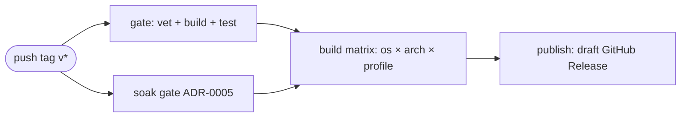

# Releases

> How Jul.IA (`jul`) is built, published, verified, and installed. Releases are
> cut by [`.github/workflows/release.yml`](../.github/workflows/release.yml) when
> a `v*` tag is pushed, and only after the build/test gate **and** the ADR-0005
> soak gate are green — a regression cannot ship under a tag.

## Contents

- [What ships](#what-ships)
- [Variants](#variants)
- [How a release is produced](#how-a-release-is-produced)
- [Release candidates](#release-candidates)
- [Verifying a download](#verifying-a-download)
- [Installing](#installing)

## What ships

Each release attaches, for every platform × profile:

| Asset | What it is |
| --- | --- |
| `jul_<ver>_<os>_<arch>_<profile>.tar.gz` / `.zip` | The archive (binary + `server.toml` + `README` + `SECURITY` + SBOM). `.zip` for Windows, `.tar.gz` otherwise. |
| `…​.sha256` | SHA-256 of that archive. |
| `SHA256SUMS` | One file with the checksums of every archive. |

In addition, each binary carries a **build-provenance** attestation and an
**SBOM (SPDX JSON)** attestation, both keyless-signed via Sigstore and verifiable
with `gh attestation verify` (see [below](#verifying-a-download)). The SPDX SBOM
is also bundled inside each archive as `jul.spdx.json`.

## Variants

Releases are a matrix of **operating system × architecture × profile**.

**OS / arch:**

| OS | `amd64` | `arm64` |
| --- | --- | --- |
| Linux | ✅ | ✅ |
| Windows | ✅ | ✅ |
| macOS (Darwin) | ✅ | ✅ |

**Profiles** (same split as CI):

| Profile | Build tags | Use when |
| --- | --- | --- |
| `lean` | _(none)_ | You want the smallest binary and only need the default HTTP feature set. |
| `full` | `brotli zstd acme console otel grpc http3 importer wasmplugins stream consul kubernetes waf` | You want every opt-in feature (the recommended default). |

The build-tag list is kept in sync with `env.FULL_TAGS` in
[release.yml](../.github/workflows/release.yml) and
[ci.yml](../.github/workflows/ci.yml). See
[Building from source](../README.md) for
what each tag enables.

## How a release is produced



1. **`gate`** — `go vet`/`go build`/`go test` with the full tag set.
2. **`soak`** — the ADR-0005 long-running soak; a red run blocks the release.
3. **`build`** (matrix) — cross-compiles a static (`CGO_ENABLED=0`),
   `-trimpath` binary per cell, stamps `main.version` from the tag, generates
   the SBOM, archives, checksums, and attests provenance + SBOM.
4. **`publish`** — collects every archive, writes `SHA256SUMS`, and opens a
   **draft** GitHub Release. A maintainer reviews the assets and publishes it.

Because the release is created as a draft, publishing is a deliberate human
step, not an automatic side effect of pushing a tag.

## Release candidates

A release-candidate tag uses the normal semantic-version pre-release form:

```text
vX.Y.Z-rc.N
```

It runs the **same** release gate, soak, cross-platform lean/full matrix,
checksums, SBOM generation, and provenance/SBOM attestation as a stable tag. The
workflow still creates a **draft** GitHub Release. An RC draft remains
unpublished unless a maintainer explicitly decides otherwise; it is an artifact
and release-path validation point, not a claim that all selected correctness or
maturity work is complete.

The [current roadmap checkpoint](roadmap/README.md#release-candidate-checkpoint)
is `v1.32.1-rc.1`, to be tagged from the exact integrated `main` SHA only after
PRs #165 and #166 merge and the complete CI pipeline is green. A later stable
`v1.32.1` tag requires a separate publication decision and a fresh release run;
the RC tag is never renamed or reused.

Before creating any tag:

1. confirm the target commit is the intended integrated `main` SHA;
2. confirm required CI is green for that exact SHA;
3. confirm `CHANGELOG.md`, README, security, status, known-limitations and release
   notes describe both delivered fixes and unresolved limitations truthfully;
4. push the immutable tag;
5. review the resulting draft release, assets, checksums, SBOMs, attestations and
   soak artifact before any publication decision.

## Verifying a download

Replace `<file>` with the archive you downloaded.

**Checksum:**

```bash
# Linux / macOS
sha256sum -c <file>.sha256          # or verify against SHA256SUMS
# Windows (PowerShell)
(Get-FileHash <file> -Algorithm SHA256).Hash -eq (Get-Content <file>.sha256)
```

**Build provenance + SBOM** (needs the [GitHub CLI](https://cli.github.com/)):

```bash
# Extract the binary first, then:
gh attestation verify ./jul --repo victornife/jul
```

This confirms the binary was built by this repository's release workflow from a
specific commit, with no local signing keys involved.

## Installing

Extract the archive, then run the binary against a config. The archive expands
into a `jul_<ver>_<os>_<arch>_<profile>/` folder.

**Linux / macOS:**

```bash
tar -xzf jul_<ver>_<os>_<arch>_<profile>.tar.gz
cd jul_<ver>_<os>_<arch>_<profile>
chmod +x ./jul
./jul --config ./server.toml --check   # validate
./jul --config ./server.toml           # run
```

**Windows (PowerShell):**

```powershell
Expand-Archive jul_<ver>_windows_<arch>_<profile>.zip -DestinationPath jul
Set-Location jul\jul_<ver>_windows_<arch>_<profile>
.\jul.exe --config .\server.toml --check
.\jul.exe --config .\server.toml
```

To run Jul.IA as a managed, hardened service (systemd, Docker, or a Windows
service) with the right writable directories, follow
[docs/deployment.md](deployment.md).
