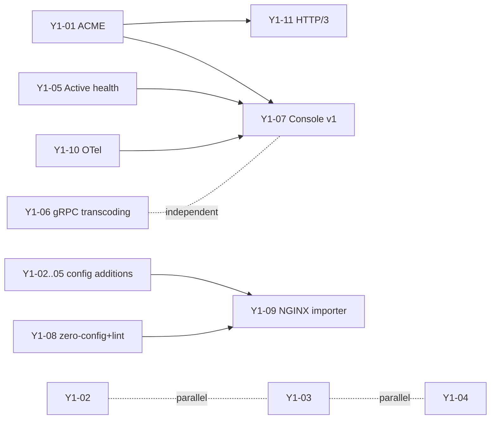

<!-- Engineering execution spec. Detailed source-of-truth for the Year 1 — Credibility & effortlessness roadmap entry.
     Companion to ../roadmap/ and ../vision/. Update when a feature's design changes. -->

# JUL Engineering Execution Plan — YEAR 1 (maximum detail)

> Version 1.1 · Updated 2026-06-21 · Maturity: shipped at **Beta** per
> [ADR 0003](../adr/0003-maturity-and-ga.md), except **Y1-01 (TLS + automatic
> HTTPS)** which is **GA** from the [GA push](../ga-push.md) (soak test is a
> post-GA gate per [ADR 0005](../adr/0005-soak-post-ga-gate.md)).

Delivery model: one year per turn; uniform max detail. Each feature has 11 sections:
Objective/scope · Squad·Priority·Effort · Design · Config(Go+TOML) · New files/interfaces ·
Implementation tasks · Dependencies · Test plan · Acceptance(DoD) · Risks/edge ·
Rollout/flags/build-tags · Docs/README updates.

## Year 1 goal & exit criteria
Ship the credibility+effortlessness trifecta (Auto-HTTPS, JUL Console v1, gRPC<->REST MVP)
plus table-stakes proxy features (compression, rate/conn limiting, auth, active health) and
DX/observability that make JUL adoptable.
EXIT: solo dev goes zero->HTTPS in <60s; platform teams get OTel traces + Console; protocol
differentiation lands as unary MVP; RPS within ~10-15% of NGINX on static+proxy benchmarks.

## Squads (6)
- SQ-EDGE (Edge/TLS): Y1-01 ACME, Y1-11 HTTP/3
- SQ-PROXY (Core/Proxy): Y1-02 Compression, Y1-03 Rate/conn limit, Y1-04 Auth, Y1-05 Active health
- SQ-PROTO (Protocol): Y1-06 gRPC<->REST transcoding MVP
- SQ-CONSOLE: Y1-07 Console v1
- SQ-DX: Y1-08 zero-config + jul lint, Y1-09 NGINX importer
- SQ-OBS: Y1-10 OpenTelemetry + access-log sinks

## Quarter sequencing
- Q1: Compression (quick win), Rate/conn limit, zero-config+lint, ACME design+HTTP-01, Console design+dashboard skeleton, OTel spike.
- Q2: ACME GA (TLS-ALPN-01, DNS-01, OCSP), Auth, Active health, Console config+history+cert panel, gRPC MVP unary, OTel tracing GA.
- Q3: gRPC unary MVP ship, Console v1 ship, NGINX importer, access-log sinks, HTTP/3 spike.
- Q4: HTTP/3 GA, gRPC hardening (->GA early Y2), Console polish, perf gate, docs hardening.

## Dependency graph


## Shared engineering conventions
- CONFIG (6-step): schema.go struct -> parser.go applyDefaults -> validate.go Validate(append errs, errors.Join) -> cmd/jul/main.go factory consume -> config_test.go -> server.toml. New/risky config defaults OFF.
- MIDDLEWARE: type Middleware func(http.Handler)http.Handler; insert into Chain in main.go. Target Year-1 order (outer->inner): AccessLog -> Tracing(Y1-10) -> Metrics -> Recover -> RequestID -> Compression(Y1-02) -> Auth(Y1-04) -> RateLimit(Y1-03) -> [per-location BodyLimit] -> Router. Document order in main.go.
- NEW ACTIONS (proto/graphql/plugin): LocationConfig field + actionOf() case + ActionXxx const + validateLocation + register router.Builder in main.go + handler in internal/handler/.
- BUILD TAGS (keep core lean): grpc, http3, brotli, zstd, acme, acme_dns, otel, console. `make build-min` (core) and `make build-full`. When a tag is off, config validate returns a clear "<feature> not compiled in this build" error.
- FEATURE FLAGS: config-gated; runtime no-op when disabled.
- TESTING: table-driven *_test.go beside code; integration via httptest + real net.Listen (pattern: internal/server/*_test.go); e2e smoke via testdata/*.toml + `go run ./cmd/jul`. CI gates: go test ./..., go vet, golangci-lint, -race on integration, benchmark regression gate (cross-cutting).
- DOCS POLICY (per user): every feature updates README.md (feature table + config reference), server.toml, relevant testdata/*.toml, an examples/<feature>/README.md where applicable, and CHANGELOG.md. Docs PR ships WITH the feature PR (DoD blocks merge without docs).

================================================================
## Y1-01 — ACME Auto-HTTPS + OCSP stapling   [SQ-EDGE · P0 · L]
OBJECTIVE/SCOPE: Automatic cert issuance+renewal (Let's Encrypt/any ACME CA) via HTTP-01, TLS-ALPN-01, DNS-01 + OCSP stapling + hot swap. IN: 3 challenges, on-disk cache, staging/prod toggle, auto-renew. OUT: private CA/PKI, mTLS (Y2).
DESIGN: Implement the existing CertProvider (internal/server/tls.go) with acmeCertProvider backed by CertMagic (caddyserver/certmagic) -> HTTP-01/TLS-ALPN-01/DNS-01 + OCSP + storage. Listener wiring (bind() tls.Config.GetCertificate, dynamicCertProvider.set swap) UNCHANGED. Add "acme-tls/1" to NextProtos when ACME on (TLS-ALPN-01). HTTP-01: mount /.well-known/acme-challenge handler on the plain :80 listener (coexists with RedirectHTTPS). DNS-01 via libdns (build tag acme_dns). Renew+OCSP via CertMagic background; GetCertificate serves new cert with no rebind. Lean alt: x/crypto/acme/autocert (HTTP-01/TLS-ALPN-01 only) if certmagic dep weight rejected.
CONFIG: add `ACME *ACMEConfig` to TLSConfig.
```go
type ACMEConfig struct {
  Enabled      bool     `toml:"enabled"`
  Email        string   `toml:"email"`
  CA           string   `toml:"ca"`            // letsencrypt|letsencrypt-staging|<dir URL>
  Domains      []string `toml:"domains"`        // default: server_names
  Challenge    string   `toml:"challenge"`      // http-01|tls-alpn-01|dns-01
  DNSProvider  string   `toml:"dns_provider"`   // when dns-01
  CacheDir     string   `toml:"cache_dir"`      // default ./jul-data/certs
  OCSPStapling bool     `toml:"ocsp_stapling"`  // default true
}
```
```toml
[[servers]]
listen = "0.0.0.0:443"
server_names = ["example.com","www.example.com"]
  [servers.tls.acme]
  enabled = true
  email = "ops@example.com"
  ca = "letsencrypt"
  challenge = "tls-alpn-01"
```
Validation: acme.enabled -> email required; CA in set or URL; challenge in set; dns_provider required for dns-01; reject both static cert/key AND acme.enabled; relax "tls requires cert+key" when acme on; domains/server_names non-empty.
NEW FILES/INTERFACES: internal/server/acme.go (acmeCertProvider implements CertProvider), internal/server/acme_challenge.go (HTTP-01 handler); modify tls.go (provider selection), server.go bind()/reload. Tags: acme, acme_dns.
IMPLEMENTATION TASKS: (1) ACMEConfig+validation+defaults; (2) vendor certmagic; (3) acmeCertProvider.GetCertificate; (4) provider selection in bind(); (5) acme-tls/1 ALPN + TLS-ALPN-01; (6) HTTP-01 handler on plain listener; (7) DNS-01 + libdns (tag); (8) OCSP stapling; (9) cache dir/storage perms; (10) staging/prod toggle; (11) reload preserves provider; (12) metrics jul_tls_cert_expiry_seconds gauge + renew counter.
DEPENDENCIES: caddyserver/certmagic, libdns/* (optional, tag). Inter-feature: Y1-11 reuses certs; Y1-07 cert panel reads expiry.
TEST PLAN: unit — config validation, provider selection, ALPN set. integration — letsencrypt/pebble issuing via HTTP-01 + TLS-ALPN-01 vs real listener; assert served + renew. e2e — testdata/acme.toml vs pebble in CI; expiry metric present.
ACCEPTANCE: zero->HTTPS <60s on public domain; auto-renew; survives reload; OCSP stapled (openssl s_client -status); staging default in non-prod; clean fallback on failure (no crash).
RISKS/EDGE: LE rate limits (default staging), :80 reachability (HTTP-01), wildcard needs DNS-01, clock skew, storage perms, renew concurrency. Mitigate: certmagic, staging default, `jul lint` preflight.
LANDED (2026-06-21) — **GA**: shipped on `golang.org/x/crypto/acme/autocert` (the lean alt), not CertMagic. Challenges: **HTTP-01 + TLS-ALPN-01**; **DNS-01 deferred** (reserved for an `acme_dns` build, rejected in validation today). OCSP stapling implemented for **ACME-issued certs** (default on, fails open); static-file certs are served unstapled. SNI selection is exact→wildcard→fallback; static certs **hot-reload** (atomic provider swap, no rebind); the ACME domain set is fixed at startup. Metrics `jul_tls_cert_expiry_seconds{domain}` + `jul_acme_renewals_total`. No cipher/session-ticket/0-RTT config (stdlib defaults). GA artifacts: [docs/tls-acme.md](../tls-acme.md) (behaviour matrix + threat note + limits), benchmarks `BenchmarkTLSHandshakeServerAuth` + `BenchmarkSNICertSelection` (0-alloc), and the semver-guarded [compatibility policy](../compatibility.md); the long-running soak test is a **post-GA gate** ([ADR 0005](../adr/0005-soak-post-ga-gate.md)). Console **Status** reports *TLS* and *Automatic HTTPS (ACME)*.
ROLLOUT/FLAGS/TAGS: tag acme (full builds), enabled=false default, acme_dns tag for providers; min build -> validate error if enabled.
DOCS: README Auto-HTTPS section + config table; server.toml; testdata/acme.toml; examples/auto-https/README.md; CHANGELOG.

================================================================
## Y1-02 — Compression (gzip/brotli/zstd + Vary)   [SQ-PROXY · P0 · S/M]
OBJECTIVE/SCOPE: Negotiated response compression with correct Vary + precompressed-file support. IN: gzip/br/zstd, Accept-Encoding negotiation, min-size, MIME allow-list, skip-if-already-encoded, precompressed .gz/.br sidecar for static. OUT: request decompression, dictionary compression.
DESIGN: New middleware Compression() (func(http.Handler)http.Handler) inserted in Chain after RequestID, before Auth/RateLimit. Wrap ResponseWriter with an encoding writer that: picks best encoder from Accept-Encoding q-values; only compresses when body >= min_size and Content-Type in allow-list and no existing Content-Encoding; sets Content-Encoding + appends "Accept-Encoding" to Vary; strips Content-Length (chunked) or buffers small bodies. MUST forward Flush (SSE) and Hijack (WebSocket) — reuse StatusWriter pattern (responsewriter.go). For static (handler.NewStatic): serve sidecar file.gz/file.br when present + acceptable (avoids recomp CPU).
CONFIG: add CompressionConfig to GlobalConfig (server/location override later).
```go
type CompressionConfig struct {
  Enabled   bool     `toml:"enabled"`
  Encoders  []string `toml:"encoders"`   // ["gzip","br","zstd"]
  Level     int      `toml:"level"`      // 1..best per-encoder
  MinSize   Size     `toml:"min_size"`   // default 1k
  Types     []string `toml:"types"`      // MIME allow-list; default text/*,json,js,css,svg,wasm
  Precompressed bool `toml:"precompressed"` // serve .gz/.br sidecars
}
```
```toml
[compression]
enabled = true
encoders = ["zstd","br","gzip"]
min_size = "1k"
```
Validation: encoders subset of {gzip,br,zstd}; level range per encoder; types non-empty when enabled; br/zstd require their build tags.
NEW FILES/INTERFACES: internal/middleware/compress.go (Compression middleware + negotiation), internal/handler/static.go change (sidecar lookup). Tags: brotli, zstd (gzip always in).
IMPLEMENTATION TASKS: (1) Accept-Encoding parser w/ q-values; (2) gzip writer pool (sync.Pool); (3) brotli (andybalholm/brotli) behind tag; (4) zstd (klauspost/compress/zstd) behind tag; (5) min-size buffering + MIME gate; (6) Vary handling + Content-Length strip; (7) Flush/Hijack pass-through; (8) precompressed sidecar in static; (9) config + validate + defaults; (10) wire into Chain; (11) metric jul_http_response_compressed_total{encoding}.
DEPENDENCIES: andybalholm/brotli, klauspost/compress. Inter-feature: ordering vs Metrics (decide: log uncompressed bytes -> Compression inside Metrics).
TEST PLAN: unit — negotiation table (q-values, identity, unknown), min-size, MIME gate, Vary set, no double-encode. integration — gzip/br/zstd round-trip via httptest; SSE not buffered (Flush works); WebSocket upgrade still hijacks. bench — throughput + CPU per encoder.
ACCEPTANCE: correct encoder per Accept-Encoding; Vary: Accept-Encoding always set; SSE/WebSocket unaffected; precompressed served when present; min-size respected; default types only.
RISKS/EDGE: BREACH (don't compress sensitive + secrets together; document; allow disable per-location later), double compression, streaming buffering latency, Content-Length correctness, compressed range requests (skip compression on Range or handle). 
ROLLOUT/FLAGS/TAGS: enabled=false default initially -> enable in zero-config profile; brotli/zstd build tags; gzip-only in min build.
DOCS: README Compression section + config; server.toml; testdata/compression.toml; examples note; CHANGELOG.

================================================================
## Y1-03 — Rate + connection limiting   [SQ-PROXY · P0 · M]
OBJECTIVE/SCOPE: Protect upstreams via request rate limiting (token bucket) + concurrent-connection caps. IN: per-key rate (IP/header/JWT-claim), burst, per-location + global, 429 + Retry-After, connection cap per listener. OUT: distributed limits (Y3), adaptive/AI limits (Y4).
DESIGN: Middleware RateLimit() using golang.org/x/time/rate (token bucket) keyed by configurable key (client IP via existing clientIP(), or header, or JWT claim from Y1-04 context). Sharded map[string]*rate.Limiter with TTL eviction (avoid unbounded growth). Connection limiting via golang.org/x/net/netutil.LimitListener wrapping the net.Listener in server.go bind() (per-addr max). 429 with Retry-After computed from bucket. Per-location override applied in router (like BodyLimit at internal/router/router.go).
CONFIG: RateLimitConfig (global) + per-location fields.
```go
type RateLimitConfig struct {
  Enabled  bool   `toml:"enabled"`
  Key      string `toml:"key"`       // ip|header:<Name>|jwt:<claim>
  Rate     int    `toml:"rate"`      // requests/sec
  Burst    int    `toml:"burst"`
  MaxConns int    `toml:"max_conns"` // per listener; 0=unlimited
}
// LocationConfig += RateLimit *RateLimitConfig (override)
```
```toml
[rate_limit]
enabled = true
key = "ip"
rate = 100
burst = 200
max_conns = 1024
```
Validation: rate>0, burst>=rate, key format valid, max_conns>=0.
NEW FILES/INTERFACES: internal/middleware/ratelimit.go (sharded limiter store + eviction), server.go bind() conn-limit wrap, router.go per-location apply.
IMPLEMENTATION TASKS: (1) key extractor (ip/header/jwt); (2) sharded limiter store + janitor goroutine; (3) 429 + Retry-After; (4) netutil.LimitListener wrap per addr; (5) global + per-location config + validate; (6) wire into Chain (after Auth so JWT key available); (7) metrics jul_http_ratelimited_total{key}, jul_listener_conns gauge.
DEPENDENCIES: x/time/rate, x/net/netutil. Inter-feature: Y1-04 (jwt key), Y1-07 (panel).
TEST PLAN: unit — bucket allows burst then throttles; key extraction; eviction. integration — concurrent clients see 429 + Retry-After; LimitListener caps conns. bench — limiter overhead per req.
ACCEPTANCE: sustained > rate returns 429 w/ Retry-After; burst honored; conn cap enforced; memory bounded under many keys; per-location override works.
RISKS/EDGE: IP spoofing via XFF (use real RemoteAddr unless trusted-proxy configured), shared NAT false positives, memory growth (eviction), clock. 
ROLLOUT/FLAGS/TAGS: core (no tag); enabled=false default.
DOCS: README Rate limiting; server.toml; testdata/ratelimit.toml; CHANGELOG.

================================================================
## Y1-04 — Access control + auth (CIDR/Basic/JWT/forward-auth)   [SQ-PROXY · P0/P1 · M]
OBJECTIVE/SCOPE: Per-location access control. IN: CIDR allow/deny, HTTP Basic, JWT (HS/RS/ES + JWKS), forward-auth subrequest. OUT: full OIDC login flows/sessions (later), mTLS identity (Y2).
DESIGN: Middleware/handler-wrapper Auth(loc) applied per-location in router (needs LocationConfig). Order: CIDR -> (Basic|JWT|forward-auth) as configured. CIDR via net/netip. Basic via subtle.ConstantTimeCompare (htpasswd bcrypt supported). JWT via golang-jwt/jwt/v5; JWKS fetch+cache via MicahParks/keyfunc (auto-refresh); validate iss/aud/exp; expose claims in request context (for rate-limit key + proxy header vars). forward-auth: issue subrequest to external URL with original headers; 2xx=allow (copy configured response headers downstream), else propagate 401/403 (like nginx auth_request / Traefik ForwardAuth).
CONFIG: AuthConfig on LocationConfig (+ reusable named auth blocks optional).
```go
type AuthConfig struct {
  AllowCIDRs []string `toml:"allow"`     // ["10.0.0.0/8"]
  DenyCIDRs  []string `toml:"deny"`
  Basic      *struct{ File string `toml:"file"`; Realm string `toml:"realm"` } `toml:"basic"`
  JWT        *struct{
     JWKSURL string `toml:"jwks_url"`; Issuer string `toml:"issuer"`
     Audience string `toml:"audience"`; Algorithms []string `toml:"algorithms"`
  } `toml:"jwt"`
  ForwardAuth *struct{
     URL string `toml:"url"`; AuthResponseHeaders []string `toml:"auth_response_headers"`
  } `toml:"forward_auth"`
}
// LocationConfig += Auth *AuthConfig
```
```toml
[[servers.locations]]
match = { type = "prefix", path = "/api/" }
proxy_pass = "http://backend"
  [servers.locations.auth.jwt]
  jwks_url = "https://issuer/.well-known/jwks.json"
  issuer = "https://issuer/"
  audience = "jul-api"
```
Validation: CIDRs parse; basic.file exists; exactly-or-compatible auth methods; jwks_url valid; algorithms allow-list; forward_auth.url valid. Treat Auth as a MODIFIER (not a conflicting "action") so it composes with proxy/static/etc.
NEW FILES/INTERFACES: internal/middleware/auth.go (CIDR/Basic), internal/auth/jwt.go (JWKS+validate), internal/auth/forward.go (subrequest); router.go applies Auth wrapper per-location; claims stored via context key (reuse RequestID context pattern).
IMPLEMENTATION TASKS: (1) CIDR allow/deny; (2) Basic + htpasswd(bcrypt) loader; (3) JWT verify + JWKS cache/refresh; (4) claims->context + proxy var $jwt_claim_*; (5) forward-auth subrequest + header copy; (6) per-location wiring + validate; (7) metrics jul_auth_decisions_total{method,result}.
DEPENDENCIES: golang-jwt/jwt/v5, MicahParks/keyfunc, x/crypto/bcrypt. Inter-feature: Y1-03 (jwt rate key), Y1-02 ordering.
TEST PLAN: unit — CIDR matrix; Basic ok/fail; JWT valid/expired/wrong-aud/iss/alg; JWKS rotation. integration — forward-auth against stub (200/401/403, header copy); JWKS server. e2e — testdata/auth.toml.
ACCEPTANCE: deny/allow enforced; Basic prompts 401 w/ realm; JWT rejects bad tokens; JWKS auto-refresh on rotation; forward-auth copies headers + propagates status; claims available to proxy headers.
RISKS/EDGE: JWKS endpoint downtime (cache + stale grace), alg confusion (reject "none", pin algs), bcrypt cost, clock skew (leeway), header injection via forward-auth (sanitize). 
ROLLOUT/FLAGS/TAGS: core; per-location opt-in.
DOCS: README Auth/access-control + examples; server.toml; testdata/auth.toml; examples/jwt-auth/README.md; CHANGELOG.

================================================================
## Y1-05 — Active health checks   [SQ-PROXY · P1 · M]
OBJECTIVE/SCOPE: Proactive upstream probing so backends recover/eject without waiting for live traffic. IN: HTTP/TCP probes, interval/timeout/healthy-unhealthy thresholds, expected status/body, integrates with existing passive health. OUT: outlier detection/EWMA (later), gRPC health (Y2 with gRPC).
DESIGN: Extend upstream.Pool with an active checker goroutine per pool (started by NewPool when configured; stopped on reload/replace). Probe each Backend; on pass call MarkSuccess, on fail MarkFailure (reuse existing fails/downUntil). Add explicit activeHealthy atomic.Bool on Backend; available(now) := passiveAvailable && activeHealthy. Lifecycle owned by a new pool manager so reload can Stop() old checkers (Pool currently has no lifecycle — add Close()). Probes honor context timeout.
CONFIG: HealthCheck on UpstreamConfig.
```go
type HealthCheckConfig struct {
  Enabled            bool     `toml:"enabled"`
  Type               string   `toml:"type"`     // http|tcp
  Path               string   `toml:"path"`     // http
  Interval           Duration `toml:"interval"` // default 5s
  Timeout            Duration `toml:"timeout"`  // default 2s
  HealthyThreshold   int      `toml:"healthy_threshold"`   // default 2
  UnhealthyThreshold int      `toml:"unhealthy_threshold"` // default 3
  ExpectStatus       []int    `toml:"expect_status"`       // default [200]
  ExpectBody         string   `toml:"expect_body"`
}
// UpstreamConfig += HealthCheck *HealthCheckConfig
```
```toml
[[upstreams]]
name = "backend"
servers = ["127.0.0.1:3000","127.0.0.1:3001"]
  [upstreams.health_check]
  enabled = true
  type = "http"
  path = "/healthz"
  interval = "5s"
```
Validation: type in {http,tcp}; http requires path; interval/timeout>0; thresholds>=1; timeout<interval.
NEW FILES/INTERFACES: internal/upstream/health.go (checker); backend.go += activeHealthy + setters; pool.go += Close() + checker start; main.go factory wires Close on reload (track pools to stop old).
IMPLEMENTATION TASKS: (1) Backend.activeHealthy default true; (2) http/tcp probe w/ thresholds; (3) checker goroutine + jitter; (4) Pool.Close lifecycle + reload stop old/start new; (5) available() composes passive+active; (6) metrics jul_upstream_healthy{pool,backend} gauge, probe latency/result; (7) Console feed (Y1-07).
DEPENDENCIES: stdlib. Inter-feature: Y1-07 health panel; reload lifecycle in server/main.
TEST PLAN: unit — threshold transitions (N fails->down, M oks->up); http status/body match; tcp. integration — flaky backend stub ejected then restored; reload stops old goroutines (goleak). 
ACCEPTANCE: unhealthy backend ejected within unhealthy_threshold*interval; recovers within healthy_threshold*interval; no goroutine leak across reloads; passive+active combine; metrics expose per-backend state.
RISKS/EDGE: goroutine leak on reload (must Stop), thundering-herd (jitter), probe load on backends, half-open w/ passive, health endpoint auth. 
ROLLOUT/FLAGS/TAGS: core; per-upstream opt-in.
DOCS: README Health checks; server.toml; testdata/health.toml; CHANGELOG.

================================================================
## Y1-06 — gRPC<->REST/JSON transcoding MVP (unary)   [SQ-PROTO · P0 · L]
OBJECTIVE/SCOPE: Accept REST/JSON, call a gRPC backend, return JSON — the headline differentiator. IN(MVP): unary methods, google.api.http mapping (get/post/put/delete/patch, path vars, body:"*"/field), descriptor from FileDescriptorSet OR server reflection, protojson, status->HTTP mapping. OUT(MVP): streaming (Y2 GA), transcoding errors->problem+json detail (basic now).
DESIGN: New location action grpc_transcode (LocationConfig + actionOf + ActionGRPCTranscode + validate + router.Builder + handler.NewGRPCTranscode). Handler loads protobuf descriptors (via FileDescriptorSet file from protoc --descriptor_set_out, or grpc reflection at startup), builds a route table from google.api.http annotations, matches incoming REST path/method, decodes JSON (protojson) into dynamicpb.Message, dials the gRPC upstream (grpc.ClientConn, reuse upstream pool target), invokes via grpc.Invoke with the method's full name + dynamic request/response, marshals reply protojson, maps grpc/status codes to HTTP. Build tag grpc keeps protobuf/grpc deps out of min build.
CONFIG: add fields to LocationConfig.
```go
// LocationConfig +=
GRPCTranscode *GRPCTranscodeConfig `toml:"grpc_transcode"`

type GRPCTranscodeConfig struct {
  Target        string `toml:"target"`          // upstream name or host:port (h2c/tls)
  DescriptorSet string `toml:"descriptor_set"`  // path to protoc FileDescriptorSet
  UseReflection bool   `toml:"use_reflection"`  // alt to descriptor_set
  TLS           bool   `toml:"tls"`             // backend is TLS (else h2c)
  PreserveNames bool   `toml:"preserve_proto_field_names"`
}
```
```toml
[[servers.locations]]
match = { type = "prefix", path = "/v1/" }
  [servers.locations.grpc_transcode]
  target = "grpcbackend"
  descriptor_set = "/etc/jul/api.pb"
```
Validation: target set (upstream or host:port); exactly one of descriptor_set|use_reflection; descriptor_set file exists+parses; treat as an ACTION (mutually exclusive w/ proxy/root/etc).
NEW FILES/INTERFACES: internal/handler/grpctranscode.go (handler), internal/transcode/{descriptors.go,httprule.go,invoke.go} (descriptor load, google.api.http parse+match, dynamic invoke). Register ActionGRPCTranscode in router/location.go + main.go builders. Tag: grpc.
IMPLEMENTATION TASKS: (1) action plumbing (const/actionOf/validate/builder); (2) descriptor load from FileDescriptorSet; (3) optional reflection client; (4) parse google.api.http -> route table (path template vars, body mapping); (5) REST matcher (path template -> method); (6) protojson decode -> dynamicpb req (path/query/body merge); (7) grpc.ClientConn (h2c/tls) reuse upstream target; (8) dynamic Invoke; (9) protojson encode reply; (10) status.Code->HTTP map; (11) metadata/headers passthrough (auth, deadline from timeout); (12) metrics jul_grpc_transcode_requests_total{method,code}.
DEPENDENCIES: google.golang.org/protobuf (protoreflect/dynamicpb/protojson), google.golang.org/grpc, genproto googleapis/api/annotations, grpc/reflection. Inter-feature: upstream pool target resolution; Y1-04 auth (forward bearer to gRPC metadata); Y1-07 route designer (Y2).
TEST PLAN: unit — httprule parse/match (path vars, body:"*"/field, query params); status mapping; protojson round-trip. integration — real gRPC test server (unary echo) + descriptor set; REST GET/POST -> gRPC -> JSON; error codes. e2e — examples/grpc-gateway with a sample proto.
ACCEPTANCE: unary GET/POST/PUT/DELETE/PATCH mapped per annotations; path vars + body mapping; correct HTTP status from grpc code; deadline from location timeout; works h2c and TLS; descriptor-set and reflection paths both function.
RISKS/EDGE: proto/descriptor drift, reflection unavailable, large/recursive messages, well-known types (timestamp/duration/struct), streaming explicitly rejected w/ 501 in MVP, h2c support to backend. 
ROLLOUT/FLAGS/TAGS: build tag grpc; min build -> validate error if grpc_transcode used; ship as MVP behind docs "preview".
DOCS: README gRPC transcoding (MVP scope, descriptor generation steps); server.toml; examples/grpc-gateway/README.md (+ proto + protoc cmd); CHANGELOG.

================================================================
## Y1-07 — JUL Console v1   [SQ-CONSOLE · P0 · L]
OBJECTIVE/SCOPE: A clean web control plane = the "anyone can operate it" pillar. IN: live dashboard (RPS, p50/95/99, error rate, in-flight, cache hit, upstream health), safe config editing (form + raw) with validate-before-apply, version history + 1-click rollback, TLS/cert panel, setup wizard. OUT: RBAC/SSO (Y3), multi-node (Y3), log tail/plugin mgr (Y2).
DESIGN: Build on existing admin.Server (internal/admin). Replace hand-written HTML (ui.go) with a real but tiny SPA (Preact+Vite OR Svelte) compiled to static assets embedded via go:embed (keeps single-binary). Add JSON APIs: GET /api/stats (snapshot: RPS/latency quantiles/in-flight/cache/health derived from observability — add a stats collector alongside Metrics, OR parse Prometheus registry), GET /api/upstreams (+health from Y1-05), GET/POST config history. Version history: on every successful raw/settings write (handleConfigRaw/Settings already validate+reload), snapshot the previous raw TOML to <cache>/config-history/<ts>.toml; expose list + GET + POST rollback (re-apply snapshot through existing WriteConfigRaw path). Cert panel reads Y1-01 expiry. Charts via uPlot (tiny). Auth reuses existing Bearer token; wizard generates a starter server.toml via the zero-config profile (Y1-08).
CONFIG: extend AdminConfig.
```go
// AdminConfig +=
Console        bool   `toml:"console"`         // default true when admin enabled
HistoryDir     string `toml:"history_dir"`     // default <cache>/config-history
HistoryKeep    int    `toml:"history_keep"`    // default 50
```
NEW FILES/INTERFACES: web/console/ (SPA source) -> built to internal/admin/assets/ (go:embed). internal/admin/server.go new routes: /api/stats, /api/upstreams, /api/history, /api/history/rollback. internal/admin/history.go (snapshot/list/rollback). internal/observability/stats.go (quantile snapshot) or reuse registry. Extend Deps with Stats(), Upstreams(), History hooks. Tag: console (embed assets; min build serves minimal page).
IMPLEMENTATION TASKS: (1) SPA scaffold (Vite) + build pipeline + go:embed; (2) /api/stats collector (latency quantiles via prometheus or hdrhistogram); (3) dashboard charts (uPlot) polling/SSE; (4) config form (curated) + raw editor reusing /api/config endpoints; (5) history snapshot on write + list/get/rollback; (6) cert panel (expiry from Y1-01); (7) upstream+health panel (Y1-05); (8) setup wizard -> writes starter config via WriteConfigRaw; (9) responsive dark theme + a11y; (10) e2e via Playwright; (11) security headers/CSP on console.
DEPENDENCIES: build-time: Node/Vite/Preact|Svelte, uPlot. Go: go:embed (stdlib). Inter-feature: Y1-01 (certs), Y1-05 (health), Y1-08 (wizard/zero-config), Y1-10 (links to traces).
TEST PLAN: unit — history snapshot/rollback; stats serialization. integration — API endpoints w/ auth (401 w/o token); rollback re-applies + reload. e2e — Playwright: load dashboard, edit setting->save->reload, rollback, wizard flow. visual smoke.
ACCEPTANCE: dashboard shows live RPS/latency/errors/cache/health; edit+save validates and hot-reloads (no restart); invalid config rejected w/ message + running config untouched; rollback restores prior config; cert panel shows expiry; wizard produces a valid starter config; single binary still (assets embedded); token auth enforced.
RISKS/EDGE: latency quantiles cost (sampling/hdr), SPA build in CI, CSRF on mutating APIs (token + same-origin), large config editing, history disk growth (HistoryKeep), exposing admin (loopback default; warn if 0.0.0.0). 
ROLLOUT/FLAGS/TAGS: tag console; admin.console flag; loopback default; min build = current basic page.
DOCS: README Console section (screens, wizard, history/rollback); server.toml admin block; examples; CHANGELOG; docs/console.md.

================================================================
## Y1-08 — Zero-config mode + `jul lint`   [SQ-DX · P0/P1 · S/M]
OBJECTIVE/SCOPE: Make the first-run + correctness experience effortless. IN: sane-defaults/zero-config profile (serve a dir or proxy a port with one flag), great error messages, `jul lint` (parse+validate+best-practice warnings), `jul fmt` (canonical TOML), config preflight for ACME/auth/upstream. OUT: full migration (Y1-09 separate).
DESIGN: Extend cmd/jul/main.go CLI (already has -config/-check/-version). Add subcommands: `jul lint [-config f]` (config.Parse + config.Validate + lints), `jul fmt` (config.Marshal canonical), `jul run --serve ./dir` / `--proxy :3000` (synthesize an in-memory Config -> no file needed). Lints = warnings beyond Validate: missing health checks on multi-backend upstreams, admin on 0.0.0.0 without token, TLS without HSTS, no compression, weak min_version, unreachable locations. Reuse Validate's errors.Join style; add a separate Lint(*Config) []Diagnostic with severity.
CONFIG: none new (operates on existing). Adds CLI surface + a built-in "zeroconfig" Config synthesizer.
NEW FILES/INTERFACES: internal/config/lint.go (Lint(*Config) []Diagnostic{Severity,Field,Msg,Hint}), internal/config/zeroconf.go (ServeDir/ProxyTarget -> *Config), cmd/jul/main.go subcommand dispatch + pretty printer (colorized, with file:line if available from go-toml decode errors).
IMPLEMENTATION TASKS: (1) subcommand router in main; (2) Lint rules + Diagnostic type; (3) pretty diagnostics (severity, hint, exit codes: 0 ok, 1 error, 2 warn-only optional); (4) zero-config synthesizer + flags; (5) `jul fmt` via Marshal + stable ordering; (6) wire into Console wizard (Y1-07) to validate generated config; (7) improve go-toml decode error messages (wrap with context/line).
DEPENDENCIES: stdlib + go-toml/v2. Inter-feature: Y1-07 wizard; Y1-09 importer emits then lints.
TEST PLAN: unit — each lint rule fires/doesn't; zeroconf produces valid Config (Validate passes); fmt idempotent. integration — `jul lint` exit codes on good/bad/warn configs; `jul run --serve` actually serves.
ACCEPTANCE: `jul lint` reports all errors+warnings in one pass with hints; `jul run --serve ./public` serves with HTTPS-ready defaults; `jul fmt` canonicalizes; decode errors point to the problem; non-zero exit on errors (CI-friendly).
RISKS/EDGE: false-positive lints (severity + opt-out), go-toml line info availability, Windows paths, flag/file precedence. 
ROLLOUT/FLAGS/TAGS: core; additive CLI (no behavior change to existing flags).
DOCS: README CLI section (lint/fmt/run), Troubleshooting; --help text; CHANGELOG.

================================================================
## Y1-09 — NGINX config importer MVP   [SQ-DX · P1 · M]
OBJECTIVE/SCOPE: Lower switching cost: `jul import nginx /etc/nginx/nginx.conf` -> server.toml. IN(MVP): http/server/location blocks, listen (+ssl), server_name, root/index/try_files, proxy_pass(+upstream), return/rewrite/redirect, basic ssl_certificate. OUT: maps/if/Lua/stream/mail, exotic directives (emit TODO comments).
DESIGN: New `jul import nginx <file>` subcommand. Parse nginx.conf with a real parser (tufanbarisyildirim/gonginx) into a directive tree; translate to config structs (ServerConfig/LocationConfig/UpstreamConfig); Marshal to TOML; run Lint (Y1-08) and print a coverage report (translated vs skipped directives w/ line refs). Map: server->[[servers]], location->[[servers.locations]] with match type (= -> exact, prefix -> prefix, ~/~* -> regex), proxy_pass->ProxyPass(+upstream), root->Root, return->Return/Redirect, rewrite->RewriteConfig, ssl_certificate/key->TLSConfig.
CONFIG: none (tool). Output is standard config.
NEW FILES/INTERFACES: internal/migrate/nginx/{parse.go,translate.go,report.go}, cmd/jul/main.go subcommand. Reuse config.Marshal + config.Lint/Validate.
IMPLEMENTATION TASKS: (1) integrate gonginx parse; (2) directive->struct translators (server/location/upstream/tls/rewrite/return); (3) match-type mapping incl regex; (4) unknown-directive collector -> TODO comments + report; (5) Marshal + Validate + Lint the output; (6) coverage report (counts + skipped w/ line); (7) golden-file tests from real nginx samples.
DEPENDENCIES: tufanbarisyildirim/gonginx. Inter-feature: Y1-08 (lint/validate output), config Marshal.
TEST PLAN: unit — translator per directive. integration/golden — sample nginx.conf set (static site, reverse proxy, upstream w/ weights, TLS, redirects) -> expected TOML; assert Validate passes. 
ACCEPTANCE: common nginx configs import to a Validate-passing server.toml; unsupported directives clearly reported (not silently dropped); regex/prefix/exact mapped; upstreams+weights preserved; output is fmt-canonical.
RISKS/EDGE: nginx semantics (location longest-prefix vs regex precedence already matches JUL matcher), variable usage ($), include directives, semantic gaps -> conservative + report, not silent. 
ROLLOUT/FLAGS/TAGS: optional subcommand (could be build tag importer to keep binary lean) — recommend tag `importer`.
DOCS: README Migrating from NGINX; mapping table (nginx->JUL); examples/migrate/; CHANGELOG.

================================================================
## Y1-10 — OpenTelemetry tracing + access-log sinks   [SQ-OBS · P1 · M/L]
OBJECTIVE/SCOPE: Platform-team credibility: distributed tracing + pluggable access logs. IN: OTel spans (server + proxy + cache + upstream), W3C tracecontext propagation, OTLP exporter, trace_id in slog; access-log sinks (file, json, syslog) + rotation. OUT: metrics via OTel (keep Prometheus; bridge later), profiling.
DESIGN: Tracing middleware near the outer chain (after AccessLog, before Metrics) using go.opentelemetry.io/otel + otelhttp semantics: start server span, inject/extract W3C headers, set http.* attributes, record status. Propagate context into proxy RoundTrip (balancingTransport), cache get/set, upstream Pick (child spans). Add trace_id/span_id to slog records (logging.go) via a handler wrapper reading span context. OTLP gRPC/HTTP exporter configured globally; sampler configurable. Access-log sinks: refactor AccessLog (middleware/logging.go) to write structured events to a configurable sink set (stdout/file w/ lumberjack rotation, json, syslog via log/syslog). Build tag otel to keep deps optional.
CONFIG: ObservabilityConfig in GlobalConfig.
```go
type ObservabilityConfig struct {
  Tracing *struct {
     Enabled bool `toml:"enabled"`; Exporter string `toml:"exporter"` // otlp-grpc|otlp-http
     Endpoint string `toml:"endpoint"`; SampleRatio float64 `toml:"sample_ratio"`
     ServiceName string `toml:"service_name"`
  } `toml:"tracing"`
  AccessLog *struct {
     Sinks []string `toml:"sinks"` // ["stdout","file","syslog"]
     File string `toml:"file"`; Format string `toml:"format"` // text|json
     RotateMaxMB int `toml:"rotate_max_mb"`; RotateKeep int `toml:"rotate_keep"`
  } `toml:"access_log"`
}
```
```toml
[observability.tracing]
enabled = true
exporter = "otlp-grpc"
endpoint = "localhost:4317"
sample_ratio = 0.1
```
Validation: exporter in set; endpoint required if enabled; sample_ratio 0..1; sinks subset; file required if "file".
NEW FILES/INTERFACES: internal/observability/tracing.go (TracerProvider init + Middleware), logging.go change (trace ids + sinks), internal/observability/sinks.go. Propagation hooks in handler/proxy.go (Transport), cache/cache.go, upstream/pool.go. Tag: otel.
IMPLEMENTATION TASKS: (1) TracerProvider + OTLP exporter + sampler + resource(service.name); (2) server tracing middleware + W3C propagators; (3) child spans in proxy/cache/upstream (ctx threading — proxy already ctx-aware); (4) slog trace correlation; (5) access-log sink refactor (stdout/file/json/syslog) + rotation (lumberjack); (6) config+validate+defaults; (7) graceful shutdown flush of exporter.
DEPENDENCIES: go.opentelemetry.io/otel(+sdk,+otlptrace exporters), natefinch/lumberjack. Inter-feature: Y1-07 Console deep-links to traces; ctx already flows through proxy.
TEST PLAN: unit — propagation extract/inject; sampler; sink writers; json format. integration — span exported to an in-memory/otel test collector across proxy->upstream; trace_id in logs; file rotation. 
ACCEPTANCE: end-to-end trace (server->proxy->upstream) visible in a collector w/ correct parenting; W3C propagation in/out; trace_id in access logs; sinks write to file/syslog w/ rotation; exporter flushes on shutdown; tracing off by default (zero overhead).
RISKS/EDGE: cardinality/cost (sampling), exporter backpressure (batch + timeout), PII in attributes (allow-list), syslog on Windows (guard), perf overhead when enabled. 
ROLLOUT/FLAGS/TAGS: build tag otel; enabled=false default.
DOCS: README Observability (tracing + log sinks + Grafana/Tempo note); server.toml; testdata/otel.toml; CHANGELOG.

================================================================
## Y1-11 — HTTP/3 (QUIC) + Alt-Svc   [SQ-EDGE · P1 · L]
OBJECTIVE/SCOPE: Modern transport: HTTP/3 over QUIC with Alt-Svc advertisement. IN: h3 listener on UDP:443, Alt-Svc header from h1/h2, shares TLS certs (incl. ACME), graceful + reload. OUT: 0-RTT tuning/early-data, WebTransport (Y4).
DESIGN: Add a parallel QUIC listener using quic-go/http3 bound to the same addr (UDP) for TLS servers. Reuse the same tls.Config/GetCertificate (dynamicCertProvider) so ACME certs apply. The h3 server wraps the SAME per-addr http.Handler (handlers map) — no routing changes. Add Alt-Svc: h3=":443"; ma=... on responses from the TCP (h1/h2) server so clients upgrade. Integrate into server.go bind(): when TLS+http3 enabled, also start an http3.Server on udp; track in listenerEntry for graceful shutdown + reload (start/stop alongside TCP listener). Add "h3" to ALPN where applicable.
CONFIG: HTTP3 toggle (global + per-server).
```go
// GlobalConfig += or ServerConfig +=
HTTP3 *struct {
  Enabled bool `toml:"enabled"`
  AltSvcMaxAge int `toml:"alt_svc_max_age"` // seconds, default 86400
} `toml:"http3"`
```
```toml
[[servers]]
listen = "0.0.0.0:443"
  [servers.tls.acme] # ... (h3 needs TLS)
  enabled = true
  [servers.http3]
  enabled = true
```
Validation: http3.enabled requires TLS (static or acme) on that server; UDP bind permission; not on plain-HTTP listeners.
NEW FILES/INTERFACES: internal/server/http3.go (start/stop http3.Server, Alt-Svc middleware), server.go bind()/drain()/reload integration, listenerEntry += quic field. Tag: http3.
IMPLEMENTATION TASKS: (1) http3.Server per TLS addr reusing GetCertificate; (2) UDP listener lifecycle + graceful Close; (3) Alt-Svc response header on h1/h2; (4) reload: start/stop h3 with TCP; (5) share handler map (atomic) — verify h3 ResponseWriter supports Flush (SSE) [no Hijack/WebSocket over h3 — document]; (6) metrics jul_http3_connections; (7) firewall/docs for UDP.
DEPENDENCIES: quic-go/quic-go + quic-go/http3. Inter-feature: Y1-01 certs; Y1-07 shows h3 status.
TEST PLAN: unit — Alt-Svc header; config validation. integration — h3 client (quic-go) GET over UDP returns same as h2; reload keeps serving; cert from ACME works. e2e — curl --http3 (where available) in CI.
ACCEPTANCE: clients negotiate h3 via Alt-Svc; h3 serves identical responses to h2; shares ACME certs; survives reload; graceful shutdown drains; SSE works (Flush) and WebSocket/Hijack cleanly unsupported on h3 (falls back to h2).
RISKS/EDGE: UDP buffer sizing (quic-go warnings), middleware boxes blocking UDP/443, Hijack-based middleware (WebSocket) not on h3, MTU/amplification, load-balancer UDP support, quic-go version churn. 
ROLLOUT/FLAGS/TAGS: build tag http3; enabled=false default; advertise only when stable.
DOCS: README HTTP/3 (enable steps, UDP/firewall note, h3 limits); server.toml; CHANGELOG.

================================================================
## Cross-cutting Year-1 workstreams
- PERF HARNESS (SQ-OBS+SQ-PROXY): repeatable benchmarks vs NGINX/Caddy (static, proxy, TLS, compression); wrk/k6 scripts; CI regression gate (fail if >X% RPS/latency regression); buffer pools, sendfile, zero-alloc hot paths. Files: bench/ + Makefile targets.
- SECURITY: golangci-lint + gosec, govulncheck, fuzz (config parser, httprule matcher, auth), SBOM (syft) in release; threat-review auth/forward-auth/console.
- DOCS/README (per user, exhaustive + always in sync): README feature table + full config reference updated PER feature; server.toml kept exhaustive; testdata/*.toml per feature; examples/<feature>/README.md; docs/ pages (console.md, auto-https.md, grpc-transcoding.md, observability.md, migrating-from-nginx.md); CHANGELOG.md (Keep a Changelog); docs build in CI; DoD blocks merge if docs not updated.
- BUILD/RELEASE: extend scripts/build-release.ps1 with build tags (min/full); document tag matrix; reproducible builds.

## Year 1 Definition of Done
- All P0 (ACME, Console v1, gRPC MVP, Compression, Rate/conn limit) shipped + documented + examples.
- zero->HTTPS <60s demoable; Console operates config+reload+rollback; OTel trace demoable; gRPC unary transcoding demoable.
- Perf gate green (within 10-15% NGINX). CI: tests+race+lint+vuln green. README/docs exhaustive and in sync. build-min and build-full both produce working binaries.

## Changelog

| Date | Ver | What changed | What stayed | Source |
| --- | --- | --- | --- | --- |
| 2026-06-21 | 1.1 | **Y1-01 TLS + automatic HTTPS → GA** (GA push): added a Landed note recording the shipped reality (autocert not CertMagic; HTTP-01 + TLS-ALPN-01; DNS-01 deferred; OCSP for ACME certs; static-cert hot reload; expiry/renewal metrics) and the GA artifacts ([tls-acme.md](../tls-acme.md), benchmarks, [compatibility policy](../compatibility.md)). | The entire Year-1 spec body and all other features' Beta status. | [tls-acme.md](../tls-acme.md), [ga-push.md](../ga-push.md); [ADR 0005](../adr/0005-soak-post-ga-gate.md) |
| 2026-06-21 | 1.0 | Added a version stamp and a maturity note (shipped at Beta, not GA); no scope change. | The entire Year-1 spec body. | [review 2026-06-21](../reviews/); [ADR 0003](../adr/0003-maturity-and-ga.md) |
