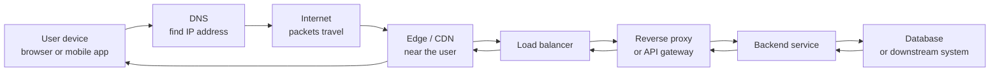

# Appendix: How Web and API Requests Travel Through Modern Infrastructure

> A beginner-friendly guide to HTTP, edge infrastructure, proxies, APIs, TLS, caching, observability, and backend networking.

## 1. Introduction

Modern software feels simple from the outside.

A customer opens a shopping app, searches for a jacket, adds it to the cart, pays, and receives a confirmation.

Behind that simple action, many systems cooperate:

- the phone or browser,
- DNS,
- the internet,
- TLS encryption,
- HTTP,
- an edge server or CDN,
- a load balancer,
- a reverse proxy or API gateway,
- authentication,
- backend services,
- databases,
- caches,
- logs, metrics, and traces,
- security controls,
- and finally the response shown to the user.

This appendix explains those concepts through the journey of one request.

The goal is not to memorize definitions. The goal is to understand how the pieces work together and why they matter.

A fast website improves user experience and conversion.

A secure connection protects customer data.

A proxy or gateway helps teams scale and operate systems safely.

Caching reduces cost and improves speed.

Rate limiting reduces abuse.

Observability helps teams find problems before customers suffer.

Good infrastructure is invisible when it works. This guide shows what is happening behind the scenes.

---

## 2. The big picture: what happens when a user clicks a button

Imagine a customer opens an online shop and searches for `red sneakers`.

The app sends a request such as:

```text
GET https://shop.example.com/api/products?query=red+sneakers
```

A simplified journey looks like this:



The request moves through layers:

1. The device creates a request.
2. DNS translates the domain name into an IP address.
3. The device opens a network connection.
4. TLS protects the connection.
5. HTTP carries the request.
6. Edge/CDN systems may serve cached content or pass the request onward.
7. A load balancer chooses a healthy backend path.
8. A reverse proxy or API gateway applies routing, security, limits, and logs.
9. The backend service runs business logic.
10. A database or another service provides data.
11. The response travels back through the same chain.
12. Caching, compression, and observability happen along the way.

When every layer works well, the user sees a fast, safe response.

When one layer is broken, the user may see a timeout, a security warning, a broken page, or a checkout failure.

---

## 3. Clients and servers

A **client** is something that asks for something.

A **server** is something that responds.

Common clients:

- a browser loading a web page,
- a mobile app calling an API,
- a backend service calling another backend service,
- a command-line tool such as `curl`,
- a payment provider sending a webhook.

Common servers:

- a web server,
- an API service,
- an image server,
- a database proxy,
- a GraphQL server,
- a gRPC service.

The basic pattern is:

```text
Client -> Request -> Server
Client <- Response <- Server
```

For example:

```text
Browser: "Please give me product 123."
Server:  "Here is product 123 as JSON."
```

Backend services can also act as clients.

For example, an order service may call:

- a payment service,
- an inventory service,
- a shipping service,
- a notification service.

This is called **machine-to-machine communication**.

---

## 4. IP addresses, ports, TCP, UDP, and sockets

A domain name like `shop.example.com` is easy for humans to remember.

Computers usually communicate using **IP addresses**, such as:

```text
203.0.113.10
```

A **port** identifies which service on that machine should receive traffic.

Examples:

| Port | Common use |
|---:|---|
| 80 | HTTP |
| 443 | HTTPS |
| 5432 | PostgreSQL |
| 6379 | Redis |
| 3000 | Local Node.js app |
| 8000 | Local Python app |

A **socket** is the combination of:

```text
IP address + port + protocol
```

Example:

```text
203.0.113.10:443 over TCP
```

### Packets

Network data is broken into small pieces called **packets**.

A web page, image, or API response is usually many packets.

Packets may take different paths across the internet.

### TCP

**TCP** stands for Transmission Control Protocol.

TCP is like a careful delivery service:

- it creates a connection,
- it checks that data arrives,
- it retries lost data,
- it keeps data in order.

HTTP/1.1 and HTTP/2 usually run over TCP.

TCP is reliable, but it has some setup cost.

### UDP

**UDP** stands for User Datagram Protocol.

UDP is like dropping postcards into the mail:

- no built-in connection,
- no built-in retry,
- lower overhead,
- applications can build their own reliability when needed.

HTTP/3 uses **QUIC**, which runs over UDP. QUIC adds encryption, streams, and reliability at a higher layer.

### Latency, bandwidth, and round trip time

**Latency** is delay.

**Bandwidth** is how much data can move per second.

**Round trip time** is how long it takes for a message to go from client to server and back.

A small request can still feel slow if the server is far away or many round trips are needed.

---

## 5. DNS

**DNS** means Domain Name System.

It is the internet's address book.

Humans remember:

```text
shop.example.com
```

DNS helps devices find:

```text
203.0.113.10
```

### DNS lookup

When a browser needs `shop.example.com`, it performs a DNS lookup.

The result may include records such as:

| Record | Meaning |
|---|---|
| A | Domain points to an IPv4 address |
| AAAA | Domain points to an IPv6 address |
| CNAME | Domain is an alias for another domain |
| TXT | Text metadata, often used for verification |
| MX | Mail server record |

### TTL

**TTL** means Time To Live.

It tells DNS resolvers how long they may cache an answer.

A low TTL helps changes propagate faster.

A high TTL reduces lookup work and can improve performance, but changes take longer to reach users.

### Business impact

Bad DNS can make a service unreachable even if the application is healthy.

Low TTL can help failover.

High TTL can improve performance but slow down emergency changes.

DNS is simple in concept and very important in production.

---

## 6. HTTP basics

**HTTP** means Hypertext Transfer Protocol.

It is the language browsers, apps, and APIs use to ask for resources and receive responses.

An HTTP request has:

- a method,
- a URL,
- headers,
- sometimes a body.

An HTTP response has:

- a status code,
- headers,
- sometimes a body.

### URL parts

Example:

```text
https://shop.example.com/products/123?color=red
```

| Part | Value | Meaning |
|---|---|---|
| Scheme | `https` | Use encrypted HTTP |
| Host | `shop.example.com` | Server name |
| Path | `/products/123` | Resource location |
| Query string | `color=red` | Extra parameters |

### Common HTTP methods

| Method | Common use |
|---|---|
| GET | Read something |
| POST | Create something or submit an action |
| PUT | Replace something |
| PATCH | Partially update something |
| DELETE | Delete something |
| OPTIONS | Ask what is allowed, often used for CORS preflight |
| HEAD | Like GET, but without the response body |

### Status code groups

| Group | Meaning |
|---|---|
| 2xx | Success |
| 3xx | Redirect or cached response |
| 4xx | Client-side problem |
| 5xx | Server-side or infrastructure problem |

### Important status codes

| Code | Meaning |
|---:|---|
| 200 | OK |
| 201 | Created |
| 204 | Success, no body |
| 301 | Permanent redirect |
| 302 | Temporary redirect |
| 304 | Not modified; cached copy can be used |
| 400 | Bad request |
| 401 | Not authenticated |
| 403 | Authenticated or identified, but not allowed |
| 404 | Not found |
| 409 | Conflict |
| 429 | Too many requests |
| 500 | Internal server error |
| 502 | Bad gateway |
| 503 | Service unavailable |
| 504 | Gateway timeout |

### Example request

```http
GET /api/products/123 HTTP/1.1
Host: shop.example.com
Accept: application/json
Authorization: Bearer eyJ...
```

### Example response

```http
HTTP/1.1 200 OK
Content-Type: application/json
Cache-Control: public, max-age=60

{
  "id": "123",
  "name": "Red Sneakers",
  "price": 79.99
}
```

---

## 7. HTTP versions

HTTP has evolved over time.

### HTTP/1.0

Early version.

Each request often opened a new TCP connection.

This was simple but inefficient.

### HTTP/1.1

Added persistent connections.

A browser could reuse the same TCP connection for multiple requests.

This is called **keep-alive**.

### HTTP/2

HTTP/2 introduced **multiplexing**.

Multiplexing means multiple requests can share one connection at the same time.

HTTP/2 also uses binary framing, which is more efficient for machines.

However, because HTTP/2 usually runs over TCP, packet loss can still affect multiple streams. This is called **head-of-line blocking** at the TCP level.

### HTTP/3

HTTP/3 uses QUIC over UDP.

QUIC supports streams at the transport layer and reduces some connection setup costs.

It can improve performance on unreliable networks, especially mobile networks.

### Beginner summary

| Version | Main benefit |
|---|---|
| HTTP/1.0 | Simple |
| HTTP/1.1 | Reuse connections |
| HTTP/2 | Multiplex requests |
| HTTP/3 | Better behavior over modern networks using QUIC |

---

## 8. HTTPS, TLS, and certificates

**HTTP** sends data without encryption.

**HTTPS** is HTTP protected by **TLS**.

TLS means Transport Layer Security.

TLS provides three important protections:

1. **Encryption** — other people cannot read the traffic.
2. **Integrity** — attackers cannot silently change the traffic.
3. **Authentication** — the client can verify it is talking to the real server.

### Certificates

A certificate is a digital identity document for a server.

It says:

```text
This public key belongs to shop.example.com.
```

Certificates are issued by **Certificate Authorities**, often called CAs.

Browsers trust a set of CAs.

If a certificate is valid and trusted, the browser shows a secure lock icon.

### Public key and private key

A **public key** can be shared.

A **private key** must be kept secret.

The server proves it owns the private key during the TLS handshake.

### Symmetric and asymmetric encryption

Asymmetric encryption is used to establish trust.

Symmetric encryption is then used for the actual data because it is faster.

### TLS handshake

The TLS handshake is the setup conversation before encrypted traffic starts.

It includes:

- choosing TLS version and cryptographic settings,
- validating the certificate,
- agreeing on keys,
- starting encrypted communication.

### SNI

**SNI** means Server Name Indication.

It lets the client tell the server which hostname it wants during the TLS handshake.

This allows one server to host multiple HTTPS sites with different certificates.

### Common TLS failures

| Failure | User impact |
|---|---|
| Expired certificate | Browser warning |
| Wrong hostname | Browser warning |
| Incomplete chain | Some clients reject the site |
| Unsupported TLS version | Connection fails |
| Weak cipher | Compliance or security risk |

### Business value

TLS protects customer data.

It prevents browser warnings.

It supports compliance.

It builds user trust.

Without HTTPS, checkout, login, and account pages are not acceptable for modern systems.

---

## 9. mTLS

**mTLS** means mutual TLS.

Normal TLS usually proves the server identity to the client.

mTLS proves both sides:

```text
Client verifies server.
Server verifies client.
```

This is useful when a service should only accept calls from known clients.

Examples:

- service-to-service APIs,
- partner integrations,
- financial systems,
- internal zero-trust networks,
- admin APIs.

### How mTLS works

Both client and server have certificates.

The server has a trust store of accepted client certificate authorities.

During the handshake, the client presents a certificate.

The server checks:

- is it signed by a trusted CA?
- is it expired?
- is it revoked?
- does it match expected identities?

### Operational challenges

mTLS is powerful but operationally sensitive.

Teams must manage:

- certificate issuance,
- rotation,
- revocation,
- trust stores,
- debugging handshake failures,
- expiration alerts.

Misconfigured mTLS can make healthy services unable to talk to each other.

---

## 10. Proxies

A **proxy** is an intermediary.

It receives traffic and sends it somewhere else.

A proxy is like a reception desk.

Instead of every visitor going directly to every office, the reception desk routes people, checks passes, logs visits, and keeps private areas hidden.

### Forward proxy

A forward proxy sits near the client.

Example:

```text
Employee laptop -> company proxy -> internet
```

It can filter outbound traffic or hide client details.

### Reverse proxy

A reverse proxy sits near the server.

Example:

```text
Internet -> reverse proxy -> backend services
```

It hides internal services and centralizes traffic control.

### Transparent proxy

A transparent proxy intercepts traffic without the client explicitly configuring it.

### Explicit proxy

An explicit proxy is configured by the client or system settings.

### Common proxy uses

- routing,
- logging,
- caching,
- compression,
- TLS termination,
- rate limiting,
- authentication,
- request filtering,
- security policy enforcement.

---

## 11. Reverse proxies

A reverse proxy receives external traffic and forwards it to internal services.

It often sits at the edge of a system.

Example:

```text
Browser -> Reverse Proxy -> Express.js API
Browser -> Reverse Proxy -> Python API
Browser -> Reverse Proxy -> Static files
```

A reverse proxy may:

- terminate TLS,
- route `/api` to one service and `/assets` to another,
- add `X-Forwarded-For`,
- remove unsafe headers,
- enforce body size limits,
- retry safe failed requests,
- apply timeouts,
- compress responses,
- serve static files,
- collect logs and metrics,
- pass through long-lived streams such as Server-Sent Events and WebSockets when designed for it.

### Why reverse proxies are valuable

Backend services become simpler.

Security rules can be applied centrally.

Traffic can be controlled consistently.

Teams can deploy multiple backend instances without exposing each one directly.

A reverse proxy lets application developers focus on business logic while platform teams control the edge.

---

## 12. Edge servers and CDN

An **edge server** is a server close to the user.

A **CDN** is a Content Delivery Network: a distributed network of edge servers.

The **origin server** is the main backend location where content is generated or stored.

A CDN is like placing local warehouses near customers.

Instead of shipping every product from one central warehouse, common items are stored closer to customers.

### Cache hit and cache miss

A **cache hit** means the edge already has the response.

A **cache miss** means the edge must ask the origin.

```text
Cache hit:  User -> Edge -> User
Cache miss: User -> Edge -> Origin -> Edge -> User
```

### What can be cached

Good candidates:

- images,
- JavaScript files,
- CSS files,
- public product data,
- static pages.

Poor candidates:

- login responses,
- payment pages,
- private user data,
- frequently changing personalized content.

### Business value

CDNs reduce latency.

They reduce origin load.

They improve global performance.

They help absorb traffic spikes.

They improve resilience when origin systems are under pressure.

---

## 13. Load balancing

A **load balancer** distributes traffic across multiple backends.

Instead of one server handling everything:

```text
Load Balancer
  -> Backend A
  -> Backend B
  -> Backend C
```

### Backend pool and upstream

A **backend pool** or **upstream** is a group of servers that can handle the same kind of request.

Example:

```text
api-service:
  - 10.0.0.1:3000
  - 10.0.0.2:3000
  - 10.0.0.3:3000
```

### Health checks

A health check asks: "Is this backend healthy?"

**Active health checks** send test requests.

**Passive health checks** observe real traffic failures.

### Algorithms

| Strategy | Meaning |
|---|---|
| Round robin | Send requests in order |
| Least connections | Send to the backend with fewer active requests |
| Weighted routing | Send more traffic to stronger servers |
| Sticky sessions | Keep one user tied to the same backend |

### Layer 4 vs Layer 7

**Layer 4** load balancing uses network information such as IP and port.

**Layer 7** load balancing understands HTTP concepts such as paths, headers, cookies, and methods.

### Business value

Load balancing improves:

- scalability,
- availability,
- maintenance,
- resilience.

If health checks are wrong, traffic may go to broken servers or avoid healthy ones.

---

## 14. API gateways

An **API gateway** is a specialized entry point for APIs.

A simple reverse proxy mainly forwards traffic.

An API gateway often adds API-specific controls:

- authentication,
- authorization,
- quotas,
- rate limits,
- request validation,
- response transformation,
- API versioning,
- analytics,
- developer portals,
- policy enforcement.

A gateway is useful when APIs are public, partner-facing, or shared across many teams.

### Business value

API gateways help companies expose APIs safely.

They provide governance.

They help with monitoring, monetization, partner access, and abuse control.

---

## 15. REST APIs

**REST** is a common style for designing HTTP APIs.

REST APIs are usually organized around **resources**.

Example resources:

```text
/products
/products/123
/carts/abc
/orders/789
```

### REST examples

List products:

```http
GET /api/products?category=shoes&page=1
```

Get product details:

```http
GET /api/products/123
```

Create an order:

```http
POST /api/orders
Content-Type: application/json

{
  "cart_id": "abc"
}
```

Update a customer address:

```http
PATCH /api/customers/42/address
Content-Type: application/json

{
  "city": "Madrid"
}
```

Delete an item from a cart:

```http
DELETE /api/carts/abc/items/sku-123
```

### Statelessness

REST APIs are usually stateless.

Each request should include enough information for the server to process it.

### Idempotency

An operation is **idempotent** if repeating it has the same final effect.

GET, PUT, and DELETE are often idempotent.

POST is usually not.

This matters for retries. Retrying a failed POST may accidentally create two orders if the API is not designed carefully.

### Pagination, filtering, and sorting

Large lists should be paginated.

Example:

```http
GET /api/products?category=shoes&page=2&page_size=20&sort=price
```

### Common REST mistakes

- using POST for everything,
- unclear resource names,
- missing status codes,
- inconsistent errors,
- no pagination,
- exposing internal database shapes directly.

---

## 16. gRPC

**gRPC** is an API technology often used between backend services.

It uses **Protocol Buffers**, often called protobuf, to define services and messages.

A `.proto` file is like a contract.

Example:

```proto
syntax = "proto3";

service ProductService {
  rpc GetProduct(GetProductRequest) returns (Product);
}

message GetProductRequest {
  string id = 1;
}

message Product {
  string id = 1;
  string name = 2;
  double price = 3;
}
```

### gRPC call types

| Type | Meaning |
|---|---|
| Unary | One request, one response |
| Server streaming | One request, many responses |
| Client streaming | Many requests, one response |
| Bidirectional streaming | Both sides send streams |

### REST vs gRPC

REST is often easier for browsers, public APIs, and manual debugging.

gRPC is often better for internal service-to-service communication, strong contracts, and streaming.

| REST | gRPC |
|---|---|
| Human-readable JSON | Compact binary protobuf |
| Broad browser compatibility | Best for service-to-service |
| Flexible, simple to inspect | Strong typed contracts |
| Common public API style | Efficient internal API style |

---

## 17. WebSockets and Server-Sent Events

Normal HTTP is request/response.

The client asks, the server answers, and the exchange ends.

Real-time features need a different pattern.

Examples:

- chat,
- notifications,
- order status updates,
- stock levels,
- dashboards,
- collaborative editing.

### Long polling

The client asks a question and the server waits before answering.

Then the client asks again.

This works almost everywhere but is inefficient.

### Server-Sent Events

**Server-Sent Events**, or SSE, let the server send a stream of events to the browser over HTTP.

The client uses `EventSource`.

SSE is one-way:

```text
Server -> Client
```

Good for:

- notifications,
- status updates,
- dashboards,
- progress updates.

### WebSockets

WebSockets create a long-lived two-way connection.

```text
Client <-> Server
```

Good for:

- chat,
- collaborative editing,
- live games,
- GraphQL subscriptions,
- interactive dashboards.

A WebSocket starts as an HTTP request and then upgrades to a different mode using a `101 Switching Protocols` response.

Reverse proxies need to preserve that upgrade and then pass bytes both ways without treating the traffic like a normal short HTTP response.

### Comparison

| Option | Direction | Best for |
|---|---|---|
| Polling | Client repeatedly asks | Simple status checks |
| Long polling | Client waits for response | Basic near-real-time |
| SSE | Server streams to client | Notifications and live updates |
| WebSocket | Two-way stream | Interactive real-time apps |

---

## 18. Headers

Headers are metadata attached to HTTP requests and responses.

They influence routing, security, caching, compression, authentication, and observability.

Common request headers:

| Header | Meaning |
|---|---|
| Host | Which website/API the client wants |
| User-Agent | Client software |
| Accept | Response types the client accepts |
| Content-Type | Format of the request body |
| Authorization | Credentials such as bearer token |
| Cookie | Browser cookies |
| Accept-Encoding | Compression formats the client supports |
| Origin | Origin of browser request |
| Traceparent | Distributed tracing context |
| Correlation-ID | Request identifier used across systems |

Common response headers:

| Header | Meaning |
|---|---|
| Set-Cookie | Store cookie in browser |
| Cache-Control | Caching rules |
| ETag | Version identifier for cached content |
| Content-Encoding | Compression used |
| Strict-Transport-Security | Force future HTTPS |
| Access-Control-Allow-Origin | CORS permission |
| Content-Type | Response body format |

Proxy-related headers:

| Header | Meaning |
|---|---|
| X-Forwarded-For | Original client IP chain |
| X-Forwarded-Proto | Original scheme, usually http or https |
| Forwarded | Standardized forwarding metadata |

Headers are powerful. Misconfigured headers can cause broken caching, security issues, CORS failures, and confusing routing bugs.

---

## 19. Authentication and authorization

**Authentication** asks:

```text
Who are you?
```

**Authorization** asks:

```text
What are you allowed to do?
```

A user may be authenticated as Alice but not authorized to access Bob's order.

### Common authentication methods

| Method | Meaning |
|---|---|
| Username/password | User proves identity with a secret |
| Session cookie | Browser stores a session ID |
| Bearer token | Client sends token in `Authorization` header |
| API key | Static key for service or developer |
| OAuth 2.0 | Delegated access framework |
| OpenID Connect | Identity layer on top of OAuth 2.0 |
| JWT | Signed token containing claims |

### Claims, roles, and scopes

A token may contain **claims** such as:

```json
{
  "sub": "user-123",
  "role": "admin",
  "scope": "orders:read"
}
```

A **role** is a broad permission group.

A **scope** is a specific permission.

### Common mistakes

- putting tokens in URLs,
- long-lived tokens,
- weak session handling,
- trusting only client-side permissions,
- missing authorization checks,
- accepting unsigned tokens,
- not checking token expiration.

Proxies and gateways can enforce authentication at the edge, but applications still need authorization for business rules.

---

## 20. Cookies, sessions, and browser security

A **cookie** is a small piece of data stored by the browser for a website.

Cookies are often used for sessions.

A **session ID** lets the server recognize the user across requests.

### Cookie flags

| Flag | Purpose |
|---|---|
| HttpOnly | JavaScript cannot read the cookie |
| Secure | Cookie only sent over HTTPS |
| SameSite | Controls cross-site cookie sending |

### XSS

**Cross-Site Scripting**, or XSS, happens when attackers run malicious JavaScript in a user's browser.

HttpOnly cookies help reduce token theft.

### CSRF

**Cross-Site Request Forgery**, or CSRF, tricks a browser into sending an authenticated request.

SameSite cookies and CSRF tokens help protect against it.

### CORS

**CORS** means Cross-Origin Resource Sharing.

Browsers restrict requests from one origin to another.

An origin is:

```text
scheme + host + port
```

Example:

```text
https://shop.example.com
```

If JavaScript from `https://shop.example.com` calls `https://api.example.com`, the browser may require CORS headers.

### Preflight

For some cross-origin requests, the browser sends an `OPTIONS` request first.

This is called a preflight request.

Example:

```http
OPTIONS /api/orders HTTP/1.1
Origin: https://shop.example.com
Access-Control-Request-Method: POST
```

The server must respond with allowed origins and methods.

Common CORS mistakes:

- allowing every origin with credentials,
- missing OPTIONS handling,
- forgetting allowed headers,
- confusing browser CORS with server-to-server security.

---

## 21. Compression

Compression makes responses smaller.

Common algorithms:

- gzip,
- Brotli,
- zstd.

The client says what it supports:

```http
Accept-Encoding: gzip, br
```

The server replies:

```http
Content-Encoding: br
```

Compression helps most with text:

- HTML,
- CSS,
- JavaScript,
- JSON,
- SVG.

It helps less with already-compressed files:

- JPEG,
- PNG,
- MP4,
- ZIP.

### Business value

Compression reduces bandwidth.

It improves mobile performance.

It makes pages load faster.

It can reduce infrastructure costs.

### Trade-offs

Compression uses CPU.

Compressing sensitive data with attacker-controlled input can create security risks in some cases.

Large binary files may not benefit.

---

## 22. Caching

Caching stores a previous result so future requests are faster.

Caches can exist in many places:

- browser cache,
- CDN cache,
- reverse proxy cache,
- application cache,
- database cache.

### Cache-Control

Examples:

```http
Cache-Control: public, max-age=3600
```

Means public caches may store this response for one hour.

```http
Cache-Control: no-store
```

Means do not store this response.

Common directives:

| Directive | Meaning |
|---|---|
| max-age | How long response is fresh |
| no-cache | Store but revalidate before reuse |
| no-store | Do not store |
| public | Shared caches may store |
| private | Only browser cache should store |
| stale-while-revalidate | Serve stale response while refreshing |

### ETag

An **ETag** identifies a version of a resource.

Client:

```http
If-None-Match: "abc123"
```

Server:

```http
304 Not Modified
```

This saves bandwidth because the body is not sent again.

### Cache risks

- serving stale data,
- caching private data,
- cache poisoning,
- hard-to-debug behavior,
- inconsistent invalidation.

Caching is powerful but must be designed carefully.

---

## 23. Timeouts, retries, and circuit breakers

Distributed systems fail in partial ways.

One service can be slow while others are healthy.

### Timeout

A timeout says:

```text
Do not wait forever.
```

Without timeouts, one slow dependency can consume all worker threads or connections.

### Retry

A retry tries again after a failure.

Retries help with temporary network failures.

But retries can also make outages worse.

If a struggling service receives 3 retries for every request, it may receive 3x traffic during an incident.

### Backoff and jitter

**Backoff** waits longer between retries.

**Jitter** adds randomness so all clients do not retry at exactly the same time.

### Circuit breaker

A circuit breaker stops calling a failing service temporarily.

It gives the failing service time to recover.

### Bulkhead

A bulkhead isolates resources.

If payment is slow, it should not consume every connection needed by product search.

### Graceful degradation

Graceful degradation means returning a reduced experience instead of total failure.

Example:

```text
"Recommendations unavailable" is better than the entire product page failing.
```

---

## 24. Rate limiting, throttling, and quotas

Rate limiting controls how much traffic a user, IP, API key, or service can send.

A rate limiter is like a bouncer at a venue.

It protects capacity and fairness.

### Concepts

| Concept | Meaning |
|---|---|
| Rate limit | Maximum requests per time window |
| Throttling | Slowing or limiting traffic |
| Quota | Usage allowance over a longer period |
| Burst | Short spike allowed above normal rate |
| Token bucket | Bucket fills over time; each request spends a token |
| Leaky bucket | Requests drain at a steady rate |

### Example 429 response

```http
HTTP/1.1 429 Too Many Requests
Retry-After: 30
Content-Type: application/json

{
  "error": "rate_limit_exceeded",
  "message": "Try again in 30 seconds."
}
```

### Business value

Rate limiting protects systems.

It prevents abuse.

It controls cost.

It supports API plans.

It improves fairness for all users.

---

## 25. Request and response transformation

Proxies and gateways can transform traffic.

Examples:

- rewrite `/v1/products` to `/products`,
- add `X-Request-ID`,
- remove unsafe headers,
- normalize paths,
- convert HTTP to gRPC,
- transform JSON fields,
- map public API shapes to internal services.

### Benefits

Transformations can protect internal systems and support migrations.

They can let external APIs stay stable while internal services evolve.

### Risks

Too much transformation makes behavior hard to understand.

Business logic hidden in proxy rules is difficult to test.

Protocol conversion should be explicit, documented, and observable.

---

## 26. TLS termination and end-to-end encryption

**TLS termination** means decrypting HTTPS at a certain layer.

Common places:

- CDN,
- edge server,
- load balancer,
- reverse proxy,
- application service.

Example:

```text
User --HTTPS--> Edge proxy --HTTP--> Backend
```

This is simple and allows inspection, logging, and routing.

But internal traffic is plaintext.

Another option:

```text
User --HTTPS--> Edge proxy --HTTPS--> Backend
```

This is called re-encryption.

A stronger model:

```text
User --HTTPS--> Edge --mTLS--> Backend
```

### Trade-offs

| Choice | Benefit | Risk |
|---|---|---|
| Terminate at edge, HTTP inside | Simple, observable | Internal traffic unencrypted |
| Re-encrypt to backend | Better security | More cert management |
| mTLS internally | Strong identity | More operational complexity |
| End-to-end TLS to app | Strong privacy | Harder inspection and routing |

The right model depends on risk, compliance, network trust, and team maturity.

---

## 27. Service mesh

A **service mesh** manages service-to-service communication inside a system.

It often uses sidecar proxies.

A sidecar proxy is a helper process next to each service.

Example:

```text
Service A -> Sidecar A -> Sidecar B -> Service B
```

The service mesh has:

- a **data plane**, the proxies that carry traffic,
- a **control plane**, the system that configures those proxies.

A mesh can provide:

- service discovery,
- mTLS,
- retries,
- traffic splitting,
- metrics,
- tracing,
- policy enforcement.

### API gateway vs service mesh

| API Gateway | Service Mesh |
|---|---|
| North-south traffic | East-west traffic |
| External clients to internal APIs | Internal service to internal service |
| API policies and public exposure | Internal reliability and security |
| Usually fewer entry points | Many sidecars/proxies |

A service mesh is powerful, but complex. It is usually introduced when many services need consistent internal traffic control.

---

## 28. Ingress, egress, and Kubernetes networking

Kubernetes runs applications in **pods**.

A **Service** gives pods a stable network name.

An **Ingress** exposes HTTP traffic from outside the cluster.

An **Ingress Controller** implements the ingress behavior.

The newer **Gateway API** is a more expressive way to model traffic into Kubernetes.

### Ingress

Ingress means traffic entering a system.

Example:

```text
Internet -> Kubernetes cluster -> web service
```

### Egress

Egress means traffic leaving a system.

Example:

```text
Payment service -> external payment provider
```

### Why these abstractions exist

Pods come and go.

IP addresses change.

Services and ingress rules let applications remain reachable even when the underlying pods change.

---

## 29. Observability

Observability helps teams understand what a system is doing.

It usually includes:

- logs,
- metrics,
- traces.

### Logs

Logs are event records.

Example:

```text
2026-06-22T10:00:00Z order_created order_id=123
```

### Metrics

Metrics are numbers over time.

Examples:

- requests per second,
- error rate,
- CPU usage,
- memory usage,
- latency.

### Traces

A trace follows one request across services.

A trace is made of **spans**.

Example:

```text
checkout request
  -> cart service span
  -> payment service span
  -> inventory service span
```

### Correlation IDs

A correlation ID is a shared request identifier.

It helps connect logs from different systems.

### OpenTelemetry

OpenTelemetry is a standard way to collect traces, metrics, and logs.

### SLIs and SLOs

An **SLI** is a service level indicator, such as availability or latency.

An **SLO** is a target.

Example:

```text
99.9% of checkout requests succeed over 30 days.
```

### Percentiles

p95 latency means 95% of requests are faster than that value.

p99 means 99% are faster.

Percentiles show user experience better than averages.

---

## 30. Security controls at the edge and proxy layers

Edge and proxy layers are good places to enforce broad security controls.

Common controls:

- WAF,
- DDoS protection,
- bot protection,
- IP allowlists,
- IP blocklists,
- geo-blocking,
- request size limits,
- header validation,
- malware scanning,
- security headers,
- HSTS,
- CSP,
- rate limiting,
- request smuggling protection.

### WAF

A **Web Application Firewall** looks for suspicious HTTP traffic.

It can block common attack patterns.

### DDoS protection

DDoS means Distributed Denial of Service.

Attackers flood a service with traffic.

Protection may happen at network, CDN, edge, and application layers.

### Security headers

Examples:

```http
Strict-Transport-Security: max-age=31536000
Content-Security-Policy: default-src 'self'
X-Content-Type-Options: nosniff
```

### Business value

Security controls protect revenue, customer trust, customer data, and service availability.

---

## 31. Common failure scenarios

| Failure | What user sees | What may be happening | Where to investigate | Prevention |
|---|---|---|---|---|
| DNS misconfiguration | Site unreachable | Domain points nowhere or wrong place | DNS provider, resolver logs | Change control, monitoring |
| Expired TLS certificate | Browser warning | Certificate expired | Cert manager, edge proxy | Expiry alerts, auto-renewal |
| Wrong certificate | Browser warning | Cert hostname mismatch | TLS config, SNI | Cert validation in CI |
| TLS handshake failure | Connection fails | Unsupported TLS/cipher/mTLS issue | TLS logs, client errors | Compatible TLS policy |
| CORS error | Browser blocks request | Missing/incorrect CORS headers | Browser console, gateway config | Explicit CORS rules |
| 401 Unauthorized | Login required | Missing/invalid credentials | Auth service, gateway logs | Clear auth flow |
| 403 Forbidden | Access denied | User authenticated but not allowed | Authorization rules | Test permissions |
| 404 Not Found | Missing page/API | Wrong path or routing | Router/proxy/app logs | Route tests |
| 429 Too Many Requests | User told to slow down | Rate limit hit | Gateway/rate limiter | Proper limits and Retry-After |
| 500 Internal Server Error | Generic failure | App bug | App logs/traces | Tests, error handling |
| 502 Bad Gateway | Gateway error | Backend connection failed | Proxy and backend health | Health checks |
| 503 Service Unavailable | Temporary outage | No healthy backend or maintenance | Load balancer/proxy | Capacity and readiness checks |
| 504 Gateway Timeout | Timeout | Backend too slow | Proxy timings/traces | Timeouts and performance work |
| Cache serving stale data | Old data visible | Bad cache rules | CDN/proxy/cache logs | Invalidation strategy |
| Compression mismatch | Broken response | Wrong encoding headers | Proxy/app config | Compression tests |
| Redirect loop | Browser loops | HTTP to HTTPS or path redirects conflict | Proxy/app routing | Redirect tests |
| Missing headers | Auth/cache/tracing broken | Proxy stripped or failed to add headers | Gateway logs | Header contract tests |
| Oversized body | Upload fails | Body limit exceeded | Proxy/app logs | Document limits |
| Broken mTLS chain | Service unavailable | Trust store/cert issue | TLS/mTLS logs | Rotation and revocation process |

---

## 32. Performance concepts

Performance is about how quickly and reliably users get useful responses.

### Latency

Delay for one request.

Lower latency feels faster.

### Throughput

How many requests a system can handle per second.

### Payload size

Smaller responses travel faster.

Compression and caching help.

### Connection reuse

Reusing connections avoids repeated handshakes.

Keep-alive, HTTP/2, and HTTP/3 help here.

### TLS handshake cost

TLS setup takes time.

Modern protocols reduce this cost, but connection reuse remains important.

### Connection pooling

Backends often keep pools of reusable connections.

This reduces setup overhead.

### Slow start

TCP may gradually increase sending speed.

Short connections may not reach full speed.

### Browser limits

Browsers limit how many connections they open per host.

HTTP/2 and HTTP/3 improve this by multiplexing.

### Business impact

A faster checkout can improve conversion.

A smaller mobile payload can reduce bounce rate.

Better caching can reduce infrastructure cost.

Better latency can improve search, browsing, and user satisfaction.

---

## 33. Developer examples

### curl request

```bash
curl -i https://shop.example.com/api/products/123
```

- `curl` is the client.
- `-i` shows response headers.
- The URL identifies the resource.

### REST response

```http
HTTP/1.1 200 OK
Content-Type: application/json

{
  "id": "123",
  "name": "Red Sneakers"
}
```

### CORS preflight

```http
OPTIONS /api/orders HTTP/1.1
Origin: https://shop.example.com
Access-Control-Request-Method: POST
Access-Control-Request-Headers: Authorization, Content-Type
```

Response:

```http
HTTP/1.1 204 No Content
Access-Control-Allow-Origin: https://shop.example.com
Access-Control-Allow-Methods: POST
Access-Control-Allow-Headers: Authorization, Content-Type
```

### Compressed response

Request:

```http
Accept-Encoding: gzip, br
```

Response:

```http
Content-Encoding: br
```

The body is compressed with Brotli.

### ETag caching

First response:

```http
ETag: "product-123-v5"
Cache-Control: max-age=60
```

Later request:

```http
If-None-Match: "product-123-v5"
```

If unchanged:

```http
HTTP/1.1 304 Not Modified
```

### Rate limit response

```http
HTTP/1.1 429 Too Many Requests
Retry-After: 60
Content-Type: application/json

{
  "error": "too_many_requests"
}
```

### Reverse proxy example

```text
server:
  listen: 443
  tls: enabled

routes:
  /api/products -> product-service
  /api/orders   -> order-service
  /assets       -> static-files
```

This means the proxy receives one public hostname and routes requests to different internal handlers.

### Gateway routing example

```text
/api/public/*      -> public API, rate limited by IP
/api/partner/*     -> partner API, authenticated by API key
/api/internal/*    -> internal API, mTLS required
```

---

## 34. Business value summary

| Technical concept | Business value |
|---|---|
| TLS | Protects trust and customer data |
| mTLS | Secures internal and partner communication |
| CDN | Improves global speed and resilience |
| Caching | Reduces cost and latency |
| Compression | Speeds up pages and reduces bandwidth |
| Reverse proxy | Simplifies backend services and centralizes control |
| API gateway | Improves API governance and partner exposure |
| Load balancing | Improves availability and scalability |
| Rate limiting | Protects platforms and controls cost |
| Observability | Reduces incident time |
| gRPC | Improves efficiency for internal services |
| REST | Keeps APIs accessible and easy to integrate |
| Timeouts/retries | Prevent cascading failures |
| Security headers/WAF | Reduce attack surface |

Good infrastructure choices improve both engineering outcomes and business outcomes.

---

## 35. Comparison tables

### HTTP vs HTTPS

| HTTP | HTTPS |
|---|---|
| Not encrypted | Encrypted with TLS |
| Vulnerable to eavesdropping | Protects confidentiality |
| No server identity proof | Certificate proves identity |
| Not acceptable for login/payment | Standard for modern systems |

### TLS vs mTLS

| TLS | mTLS |
|---|---|
| Client verifies server | Client and server verify each other |
| Common for websites | Common for internal/partner APIs |
| Server certificate required | Server and client certificates required |
| Simpler operations | More certificate management |

### Forward proxy vs reverse proxy

| Forward proxy | Reverse proxy |
|---|---|
| Near the client | Near the server |
| Controls outbound traffic | Controls inbound traffic |
| Used by clients | Used by service operators |
| Example: corporate web proxy | Example: API edge proxy |

### Reverse proxy vs API gateway

| Reverse proxy | API gateway |
|---|---|
| Routes and forwards traffic | Adds API-specific policy |
| Often lower-level | Often product/API governance layer |
| TLS, headers, retries, compression | Auth, quotas, validation, analytics |
| Good for web/app traffic | Good for managed APIs |

### REST vs gRPC

| REST | gRPC |
|---|---|
| HTTP + JSON commonly | HTTP/2 + protobuf |
| Easy for browsers | Best for services |
| Human-readable | Strongly typed |
| Public API friendly | Internal efficiency friendly |

### WebSockets vs SSE vs polling

| Feature | Polling | SSE | WebSocket |
|---|---|---|---|
| Direction | Client asks repeatedly | Server to client | Two-way |
| Complexity | Low | Low-medium | Medium-high |
| Browser support | Very broad | Broad | Broad |
| Good for | Simple refresh | Notifications | Interactive realtime |

### CDN cache vs browser cache vs application cache

| Cache | Location | Best for |
|---|---|---|
| Browser cache | User device | Static assets |
| CDN cache | Edge network | Public global content |
| Reverse proxy cache | Near backend | Shared repeated responses |
| Application cache | Inside app | Business-specific objects |
| Database cache | Data layer | Query acceleration |

### Layer 4 vs Layer 7 load balancing

| Layer 4 | Layer 7 |
|---|---|
| IP/port level | HTTP/API level |
| Fast and simple | More intelligent routing |
| Does not inspect paths | Can route by path/header |
| Works for many protocols | Best for HTTP APIs |

### Authentication vs authorization

| Authentication | Authorization |
|---|---|
| Who are you? | What can you do? |
| Login, token, certificate | Roles, scopes, permissions |
| Happens first | Happens after identity is known |

---

## 36. Mental models and analogies

Use analogies carefully. They are not perfect, but they help.

| Concept | Analogy |
|---|---|
| DNS | Internet address book |
| TLS | Sealed envelope plus identity check |
| Proxy | Reception desk |
| Load balancer | Queue manager |
| CDN | Local warehouse near customers |
| Cache | Shortcut for repeated information |
| Rate limiter | Bouncer at a venue |
| Observability | Airplane dashboard and black box |
| Circuit breaker | Electrical breaker that prevents fire |
| Service mesh | Traffic rules inside a city |

---

## 37. Glossary

**API** — Application Programming Interface. A way for software systems to communicate.

**API Gateway** — A gateway that applies API-specific rules such as auth, quotas, validation, and analytics.

**Backend** — Server-side application or service.

**Bandwidth** — Amount of data that can move per second.

**Cache** — Stored response or data used to avoid repeated work.

**CDN** — Content Delivery Network. Edge servers distributed near users.

**Certificate** — Digital identity document used by TLS.

**Client** — Software that sends a request.

**CORS** — Browser security mechanism for cross-origin requests.

**DNS** — System that maps domain names to IP addresses.

**Edge** — Infrastructure close to users.

**gRPC** — High-performance RPC framework using protobuf and HTTP/2.

**Header** — HTTP metadata key/value pair.

**HTTP** — Protocol used for web and API communication.

**HTTPS** — HTTP protected by TLS.

**IP address** — Network address of a machine.

**JWT** — JSON Web Token. A signed token carrying claims.

**Latency** — Delay.

**Load balancer** — System that distributes requests across backends.

**mTLS** — Mutual TLS, where both client and server prove identity.

**Origin** — Main source server behind a CDN or edge.

**Packet** — Small unit of network data.

**Port** — Number identifying a service on a machine.

**Proxy** — Intermediary that forwards traffic.

**QUIC** — Modern transport protocol over UDP, used by HTTP/3.

**REST** — Common HTTP API design style based on resources.

**Reverse proxy** — Proxy near servers that handles inbound traffic.

**SSE** — Server-Sent Events, one-way server-to-client streaming over HTTP.

**TCP** — Reliable connection-oriented network protocol.

**TLS** — Transport Layer Security. Protects traffic with encryption and identity.

**Trace** — End-to-end record of a request across systems.

**UDP** — Lightweight datagram protocol.

**URL** — Address of a web resource.

**WebSocket** — Long-lived two-way communication channel over an HTTP upgrade.

---

## 38. References and further reading

These references are useful because they come from standards bodies, official project documentation, or widely used educational sources.

- **MDN Web Docs — HTTP**  
  https://developer.mozilla.org/en-US/docs/Web/HTTP  
  Good beginner-friendly reference for HTTP methods, headers, status codes, caching, cookies, and CORS.

- **MDN Web Docs — CORS**  
  https://developer.mozilla.org/en-US/docs/Web/HTTP/CORS  
  Clear explanation of browser cross-origin rules and preflight requests.

- **MDN Web Docs — HTTP caching**  
  https://developer.mozilla.org/en-US/docs/Web/HTTP/Caching  
  Practical guide to browser and shared caching behavior.

- **MDN Web Docs — Cookies**  
  https://developer.mozilla.org/en-US/docs/Web/HTTP/Cookies  
  Useful for understanding sessions, cookie flags, and browser security.

- **RFC 9110 — HTTP Semantics**  
  https://www.rfc-editor.org/rfc/rfc9110  
  The formal standard for HTTP semantics.

- **RFC 8446 — TLS 1.3**  
  https://www.rfc-editor.org/rfc/rfc8446  
  The formal TLS 1.3 specification.

- **RFC 9000 — QUIC**  
  https://www.rfc-editor.org/rfc/rfc9000  
  The formal QUIC transport specification.

- **RFC 9114 — HTTP/3**  
  https://www.rfc-editor.org/rfc/rfc9114  
  The formal HTTP/3 specification.

- **gRPC documentation**  
  https://grpc.io/docs/  
  Official guide to gRPC, protobuf, streaming, and service definitions.

- **OpenTelemetry documentation**  
  https://opentelemetry.io/docs/concepts/  
  Good introduction to traces, metrics, logs, and observability concepts.

- **OWASP Top 10**  
  https://owasp.org/www-project-top-ten/  
  Widely used overview of common web application security risks.

- **OWASP Cheat Sheet Series**  
  https://cheatsheetseries.owasp.org/  
  Practical security guidance for authentication, headers, TLS, CORS, and more.

- **Kubernetes networking documentation**  
  https://kubernetes.io/docs/concepts/services-networking/  
  Official guide to Services, Ingress, Gateway API, and cluster networking concepts.

- **Google SRE Book**  
  https://sre.google/sre-book/table-of-contents/  
  Strong reference for reliability, SLIs, SLOs, incident response, and distributed systems operations.

- **Envoy documentation**  
  https://www.envoyproxy.io/docs/  
  Useful for understanding modern proxy, gateway, and service-mesh data-plane behavior.

- **NGINX documentation**  
  https://nginx.org/en/docs/  
  Classic reference for reverse proxying, load balancing, TLS, and HTTP server behavior.

- **HAProxy documentation**  
  https://www.haproxy.org/#docs  
  Strong reference for load balancing, health checks, and high-performance proxying.

- **Cloudflare Learning Center — CDN**  
  https://www.cloudflare.com/learning/cdn/what-is-a-cdn/  
  Beginner-friendly explanation of CDNs and edge networks.

---

## Closing thought

A request is not just a packet moving from one machine to another.

It is a chain of trust, performance, routing, security, reliability, and business decisions.

Understanding that chain helps teams build systems that are faster, safer, cheaper, and easier to operate.
