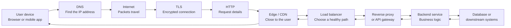

# Appendix: A Guided Journey Through Web and API Infrastructure

> A practical, beginner-friendly, but technically meaningful guide to HTTP, edge infrastructure, proxies, APIs, TLS, caching, reliability, observability, and backend networking.

## How to read this appendix

This appendix is for people who may have heard words like **HTTP**, **TLS**, **proxy**, **REST**, **gRPC**, **CDN**, or **load balancer**, but do not yet have a clear mental picture of how these pieces fit together.

The best way to learn these topics is not to memorize definitions. A definition can tell you that a reverse proxy forwards requests to backend services, but it does not explain why companies use reverse proxies, why they sit at the edge of the system, how they help developers, why they matter to security teams, or why a misconfigured proxy can break checkout for thousands of users.

So this document follows a story.

Imagine a customer opens a shopping website or mobile app. They search for a product, open the product page, add the item to the cart, and check out. That experience feels like a few taps. Under the surface, each tap becomes one or more requests. Those requests travel through networks, encrypted connections, edge servers, proxies, gateways, backend services, caches, and databases before a response returns to the device.

As we follow that journey, we will introduce the main infrastructure concepts in the order a request might meet them. We will start simple, then add technical depth. The goal is that by the end, you can look at a modern web architecture diagram and understand not just what the boxes are, but why each box exists and what can go wrong there.

---

# 1. Introduction

Modern software feels simple when it works. You open an app, search for a product, tap a button, and something happens immediately. If the experience is fast and reliable, most users never think about infrastructure at all.

That invisibility is the point. Good infrastructure hides complexity from users. It gives them speed, safety, and reliability without asking them to understand DNS, TLS, HTTP, caching, or load balancing.

But inside a real system, one click may cross many layers. A mobile app sends a request. DNS finds where the service lives. The network carries packets through the internet. TLS encrypts the connection and proves the identity of the server. HTTP describes what the client wants. A CDN or edge server may answer immediately from cache, or it may pass the request deeper into the system. A load balancer chooses a healthy backend path. A reverse proxy or API gateway applies routing, authentication, rate limits, headers, timeouts, logging, and security rules. A backend service runs business logic. A database or another service provides data. The response returns through many of the same layers, possibly compressed, cached, logged, traced, and measured along the way.

This chain matters because infrastructure is not just technical plumbing. It affects business outcomes directly.

A faster product page can improve conversion. A secure login protects customer trust. A good cache can reduce cloud cost. A rate limiter can stop abusive traffic from taking down a platform. Observability can reduce the time it takes to detect and fix incidents. A well-designed gateway can let many teams publish APIs safely without every team reinventing authentication, logging, and routing.

When infrastructure is missing or misconfigured, the consequences are also visible. Users may see browser certificate warnings, checkout failures, infinite loading spinners, stale product prices, broken images, duplicated orders, or vague errors like `502 Bad Gateway` and `504 Gateway Timeout`. Those errors often look simple on the screen, but they usually come from a chain of systems interacting badly.

This appendix is designed to make that chain understandable.

---

# 2. The big picture: what happens when a user clicks a button

Let us start with a concrete example.

A customer opens a shopping app and searches for “red sneakers.” The app needs product data, so it sends a request to an API:

```text
GET https://shop.example.com/api/products?query=red+sneakers
```

From the user's point of view, the app is just loading search results. From the system's point of view, a request begins a journey.



The first important idea is that the request does not go directly from the user's phone to a database. It passes through layers that each solve a different problem.

The user's device knows the domain name, but not necessarily the server's IP address. DNS solves that. The internet can move data across the world, but it does so in packets that can be delayed, lost, or reordered. TCP or QUIC helps manage communication. TLS protects the traffic from being read or modified by outsiders. HTTP gives the request meaning: method, path, headers, body, and expected response. The edge or CDN can serve cached content close to the user. The load balancer spreads traffic across available servers. The reverse proxy or API gateway applies common infrastructure rules. Backend services execute product-specific business logic. Databases and downstream services provide state.

The response travels back through the same general path. Along the way, systems may compress it, cache it, add headers, record metrics, produce logs, attach trace IDs, or block it if a security rule detects a problem.

A good architecture makes this path predictable. Each layer has a job. Each layer should be observable. Each layer should fail in a controlled way.

---

# 3. Clients and servers

At the center of web infrastructure is a simple pattern: one piece of software asks for something, and another piece of software responds.

The software asking is called the **client**. The software responding is called the **server**.

A browser is a client when it loads a web page. A mobile app is a client when it calls an API. A backend service can also be a client when it calls another backend service. For example, an order service may call a payment service, an inventory service, and a shipping service while processing checkout.

A server is any system that listens for requests and sends responses. It could be a Node.js Express application, an Apollo GraphQL server, a Python FastAPI app, a Java Spring service, a Go microservice, a static file server, or a database-facing API.

The request/response model looks like this:

```text
Client -> Request -> Server
Client <- Response <- Server
```

For example:

```text
Browser: “Please give me product 123.”
Server:  “Here is product 123 as JSON.”
```

This model is easy to understand for one client and one server. Real systems become more interesting because there are many clients, many servers, and many intermediaries.

A web browser may call a reverse proxy. The reverse proxy may call a product service. The product service may call a search service. The search service may call a database. In that chain, each service is a server to the thing before it and a client to the thing after it.

This is why teams talk about **machine-to-machine communication**. Not all traffic comes from humans. Much of the traffic inside modern systems is software calling other software.

---

# 4. IP addresses, ports, TCP, UDP, and sockets

Humans like names. Computers use addresses.

When you type `shop.example.com`, your device needs to find a machine somewhere on the network. That machine has an **IP address**, such as `203.0.113.10`. An IP address identifies a network location.

But a single machine can run many services. It may run a web server, an SSH server, a database, and an internal admin service. A **port** tells the machine which service should receive the traffic.

Common examples are:

| Port | Common use |
|---:|---|
| 80 | HTTP |
| 443 | HTTPS |
| 22 | SSH |
| 5432 | PostgreSQL |
| 6379 | Redis |
| 3000 | Local Node.js app |
| 8000 | Local Python app |

A **socket** is the combination of an IP address, a port, and a transport protocol. For example:

```text
203.0.113.10:443 over TCP
```

That means the client wants to speak to port `443` on IP `203.0.113.10` using TCP.

Network data is broken into smaller pieces called **packets**. A page, image, JSON response, or video is usually split across many packets. Those packets travel through routers, networks, and cables. Sometimes packets are delayed. Sometimes they are lost. Sometimes they arrive out of order.

Different transport protocols handle that reality differently.

## TCP

**TCP** stands for Transmission Control Protocol. It is connection-oriented and reliable.

A useful analogy is a careful courier service. TCP establishes a connection, numbers the data, checks that packets arrive, retransmits missing pieces, and gives the application an ordered stream of bytes.

This reliability is useful for web pages and APIs because applications usually want complete, ordered data. If part of a JSON response is missing, the response is not useful.

HTTP/1.1 and HTTP/2 usually run over TCP.

The trade-off is that TCP has setup cost and some performance limitations. If one packet is lost, later data may have to wait until the missing packet is recovered. This can affect higher-level protocols such as HTTP/2, where many streams share one TCP connection.

## UDP

**UDP** stands for User Datagram Protocol. It is lighter and connectionless.

A useful analogy is sending postcards. You send a message, but UDP itself does not guarantee delivery, ordering, or retries.

That sounds worse, but it can be powerful. Applications can build their own reliability rules on top of UDP. **QUIC**, the transport used by HTTP/3, does exactly that. It uses UDP underneath but adds encryption, streams, retransmission, congestion control, and connection migration at a higher layer.

HTTP/3 uses QUIC over UDP.

## Latency, bandwidth, and round trip time

**Latency** is delay. It is how long a request or packet takes to travel.

**Bandwidth** is capacity. It is how much data can move per second.

**Round trip time**, often called RTT, is the time for a message to go from client to server and back.

These ideas are different. A connection can have high bandwidth but still feel slow if latency is high. Imagine a huge highway between Madrid and Tokyo. It may carry many cars, but the distance is still large. Similarly, a network can carry a lot of data but still have a noticeable delay for each round trip.

This matters because web pages and APIs often require several round trips: DNS lookup, connection setup, TLS handshake, request, response, and sometimes additional resources. Reducing round trips can make systems feel much faster.

---

# 5. DNS

Before a device can connect to `shop.example.com`, it needs an IP address. **DNS**, the Domain Name System, provides that mapping.

DNS is often described as the internet's address book. The user knows the name. DNS helps find the address.

When a browser needs `shop.example.com`, it performs a **DNS lookup**. The answer may say something like:

```text
shop.example.com -> 203.0.113.10
```

In reality, DNS can involve several record types.

| Record | Meaning |
|---|---|
| A | Maps a name to an IPv4 address |
| AAAA | Maps a name to an IPv6 address |
| CNAME | Makes one name an alias for another name |
| MX | Identifies mail servers |
| TXT | Stores text metadata, often for verification or security policies |

A common CDN setup might use a CNAME:

```text
www.example.com -> example.cdn-provider.net
```

The CDN provider then decides which edge IP address should serve the user.

## TTL and caching

DNS answers have a **TTL**, which means Time To Live. TTL tells resolvers how long they can cache an answer.

A high TTL reduces DNS lookup work and may improve performance because clients and resolvers reuse cached answers. But it also means changes take longer to spread. If you need to move traffic away from a failing provider, a high TTL can slow failover.

A low TTL gives more flexibility. Changes propagate faster. But it increases DNS query volume and may slightly increase lookup overhead.

There is no perfect TTL for every system. It is a trade-off between stability, performance, cost, and operational flexibility.

## Business impact

DNS feels basic, but DNS problems are severe. If DNS is wrong, users cannot even reach the first layer of your system. The application can be healthy, the database can be healthy, and the servers can be running, but users still see an outage because the name does not resolve correctly.

Common DNS-related problems include:

- a domain pointing to the wrong load balancer,
- a CNAME removed by accident,
- DNS records not propagated yet,
- a domain expiring,
- a provider outage,
- split-horizon DNS returning different answers internally and externally.

Good DNS management includes clear ownership, monitoring, change review, and awareness of TTL behavior.

---

# 6. HTTP basics

**HTTP** means Hypertext Transfer Protocol. It is the application-level language of the web.

When a browser loads a page, it uses HTTP. When a mobile app calls a REST API, it usually uses HTTP. When a backend service exposes JSON endpoints, it usually uses HTTP. Even many newer protocols, such as gRPC-Web and GraphQL over HTTP, depend on HTTP behavior.

An HTTP exchange has two main parts: the request and the response.

The request says what the client wants.

The response says what happened and returns data if appropriate.

## The structure of a URL

Consider this URL:

```text
https://shop.example.com/products/123?color=red&size=42
```

It has several parts:

| Part | Value | Meaning |
|---|---|---|
| Scheme | `https` | Use HTTP over TLS encryption |
| Host | `shop.example.com` | The server name |
| Path | `/products/123` | The resource being requested |
| Query string | `color=red&size=42` | Extra parameters |

The path usually identifies a resource. The query string usually filters, sorts, searches, or modifies the request.

## Methods

HTTP methods describe the action the client wants to perform.

| Method | Typical meaning | Example |
|---|---|---|
| GET | Read data | Get product details |
| POST | Create or submit | Create an order |
| PUT | Replace | Replace an address |
| PATCH | Partially update | Change one field |
| DELETE | Delete | Remove cart item |
| OPTIONS | Ask what is allowed | CORS preflight |
| HEAD | Get headers only | Check if file changed |

A good API uses methods consistently. If every operation uses POST, clients and infrastructure lose useful information. For example, proxies and gateways can safely retry some GET requests, but retrying POST can accidentally create duplicate orders unless the API is designed for it.

## Headers

Headers are metadata. They tell the server or client more about the request or response.

Example request headers:

```http
Host: shop.example.com
Accept: application/json
Authorization: Bearer eyJ...
User-Agent: Mozilla/5.0
```

Headers can affect authentication, routing, caching, compression, content type, tracing, and security.

## Body

The body contains data sent with the request or response.

A POST request creating an order might contain JSON:

```http
POST /api/orders HTTP/1.1
Host: shop.example.com
Content-Type: application/json

{
  "cart_id": "cart-123",
  "payment_method": "pm-456"
}
```

The response might also contain JSON:

```http
HTTP/1.1 201 Created
Content-Type: application/json

{
  "order_id": "order-789",
  "status": "confirmed"
}
```

## Status codes

Status codes summarize the result.

| Group | Meaning |
|---|---|
| 2xx | Success |
| 3xx | Redirect or cache-related response |
| 4xx | Client-side problem |
| 5xx | Server or infrastructure problem |

Important status codes:

| Code | Meaning | Real-life example |
|---:|---|---|
| 200 | OK | Product returned successfully |
| 201 | Created | Order created |
| 204 | No Content | Item deleted, nothing else to return |
| 301 | Permanent redirect | Old URL moved forever |
| 302 | Temporary redirect | Login flow redirects temporarily |
| 304 | Not Modified | Browser can reuse cached content |
| 400 | Bad Request | Invalid JSON or missing field |
| 401 | Unauthorized | User is not logged in or token is invalid |
| 403 | Forbidden | User is known but not allowed |
| 404 | Not Found | Product or route does not exist |
| 409 | Conflict | Order conflict or duplicate update |
| 429 | Too Many Requests | Rate limit exceeded |
| 500 | Internal Server Error | Application bug |
| 502 | Bad Gateway | Proxy could not reach backend correctly |
| 503 | Service Unavailable | No healthy backend or maintenance |
| 504 | Gateway Timeout | Backend took too long |

Status codes are not just technical labels. They help clients behave correctly. A `401` may trigger login. A `429` may trigger retry later. A `503` may trigger failover. A vague `500` tells the user little and gives operations teams less structure.

---

# 7. HTTP versions

HTTP has evolved because web applications changed.

Early websites were mostly documents. Modern applications load many files, call APIs constantly, stream updates, send telemetry, and run on mobile networks. HTTP versions improved to handle these needs.

## HTTP/1.0

HTTP/1.0 was simple. A client often opened a new TCP connection for each request. That worked for small pages, but it became inefficient as pages started loading many images, scripts, stylesheets, and API calls.

Opening a connection has a cost. If every small resource requires a new connection, the page becomes slower.

## HTTP/1.1

HTTP/1.1 introduced persistent connections, often called **keep-alive**. The client could reuse the same TCP connection for multiple requests.

That reduced overhead and improved performance.

However, HTTP/1.1 still had limitations. Browsers often opened multiple connections to the same site because one connection could not efficiently handle many simultaneous requests. Requests could block behind each other.

## HTTP/2

HTTP/2 introduced **multiplexing**. Multiple requests and responses can share one connection at the same time.

It also uses binary framing. Humans do not read HTTP/2 frames directly, but machines handle them efficiently.

Multiplexing is like having one well-managed highway with multiple lanes instead of opening a new small road for every request.

HTTP/2 is especially useful for pages that load many resources and for protocols such as gRPC.

There is still a limitation: HTTP/2 usually runs over TCP. If a TCP packet is lost, TCP may delay later data until the missing packet is recovered. This can cause head-of-line blocking at the TCP layer.

## HTTP/3

HTTP/3 runs over QUIC, which runs over UDP.

QUIC was designed to improve connection setup, encryption, mobility, and stream handling. It can perform better on unreliable networks, such as mobile connections switching between Wi-Fi and cellular.

HTTP/3 is not magic. It does not make slow backends fast. But it can reduce transport-level delays and improve user experience in some conditions.

## Why this matters

Protocol version affects performance, connection behavior, compatibility, and debugging. Edge servers, CDNs, load balancers, and reverse proxies often support multiple HTTP versions at different points in the request path.

A browser may connect to an edge using HTTP/3, while the edge connects to the backend using HTTP/1.1 or HTTP/2. That is normal. Infrastructure often translates or terminates protocols at boundaries.

---

# 8. HTTPS, TLS, and certificates

HTTP by itself is not encrypted. Anyone who can observe the network path may be able to read or modify traffic.

**HTTPS** is HTTP protected by **TLS**, which means Transport Layer Security.

TLS provides three main protections.

First, it provides **confidentiality**. Other parties cannot read the content of the traffic.

Second, it provides **integrity**. Attackers cannot silently change the traffic without detection.

Third, it provides **authentication**. The client can verify that it is talking to the real `shop.example.com`, not an impostor.

A useful analogy is a sealed envelope plus an identity check. Encryption seals the envelope. The certificate helps prove who owns the receiving address.

## Certificates

A certificate is a digital identity document. It connects a domain name, such as `shop.example.com`, with a public key.

Certificates are issued by **Certificate Authorities**, or CAs. Browsers and operating systems trust a list of CAs. If a certificate is signed by a trusted CA, valid for the hostname, and not expired, the browser accepts it.

If something is wrong, the browser may show a scary warning. Many users abandon the site at that point. For a business, an expired certificate can become an immediate revenue-impacting incident.

## Public and private keys

A TLS certificate includes a public key. The server keeps the matching private key secret.

The public key can be shared. The private key must not leak.

During the TLS handshake, the server proves it controls the private key without sending the private key itself.

## Symmetric and asymmetric encryption

Asymmetric cryptography helps establish identity and negotiate secrets. It is powerful but relatively expensive.

Symmetric encryption is faster and is used for most of the data after the handshake.

In simplified terms, TLS uses asymmetric techniques to safely agree on symmetric keys, then uses those symmetric keys to protect the actual HTTP traffic.

## TLS handshake

Before encrypted HTTP begins, the client and server perform a TLS handshake. They agree on protocol version and cryptographic settings, validate the certificate, and create shared encryption keys.

Modern TLS is efficient, but handshakes still have cost. That is why connection reuse matters. If a client can reuse a TLS connection, it avoids repeating the handshake for every request.

## SNI

**SNI** means Server Name Indication. It allows the client to tell the server which hostname it wants during the TLS handshake.

This matters because one IP address can serve many domains. The server needs to know which certificate to present.

Without SNI, hosting many HTTPS sites on one address would be much harder.

## Certificate expiration and rotation

Certificates expire. Expiration is good for security, but it creates operational responsibility.

Teams need renewal, monitoring, and rotation processes. Automated certificate management, such as ACME-based systems, reduces manual work but still needs monitoring.

## Common TLS failures

| Failure | What happens |
|---|---|
| Expired certificate | Browser warning or failed connection |
| Wrong hostname | Certificate does not match the site |
| Incomplete chain | Some clients cannot validate trust |
| Unsupported TLS version | Older/newer clients may fail |
| Weak cipher policy | Security and compliance risk |
| Lost private key | Cannot prove server identity |

TLS is both a security feature and a trust feature. Users may not understand certificates, but they understand browser warnings.

---

# 9. mTLS

**mTLS** means mutual TLS.

Normal TLS usually proves the server's identity to the client. The browser verifies that it is talking to the real `shop.example.com`.

mTLS proves both identities. The client verifies the server, and the server verifies the client.

```text
Normal TLS:
Client verifies server.

mTLS:
Client verifies server.
Server verifies client.
```

This is useful when a service should only accept requests from known clients.

For example, a public website usually does not require every user's browser to have a client certificate. That would be too difficult. But an internal payment API may require mTLS so only approved services can call it.

## Where mTLS is useful

mTLS is common in:

- service-to-service communication,
- internal APIs,
- zero-trust architectures,
- partner integrations,
- financial systems,
- healthcare systems,
- high-security admin APIs.

Imagine a warehouse system receiving inventory updates from stores. If updates are sensitive, the warehouse API may require every store system to present a valid client certificate. That way, the API is not only asking “do you have a token?” but also “are you one of the systems I trust at the transport layer?”

## Operational complexity

mTLS is powerful, but it is not free.

Teams must manage client certificates, server certificates, certificate authorities, trust stores, rotation, revocation, and debugging. A certificate that expires at midnight can break service-to-service communication even if all application code is healthy.

Common mTLS problems include:

- client certificate expired,
- server does not trust the client CA,
- client does not trust the server CA,
- certificate does not contain the expected identity,
- revocation list is wrong or unavailable,
- clocks are incorrect,
- intermediate certificates are missing.

mTLS improves security, but it requires operational discipline.

---

# 10. Proxies

A **proxy** is an intermediary that receives traffic and forwards it somewhere else.

The easiest analogy is a reception desk. Visitors do not wander through the whole building looking for the right person. They go to reception. Reception checks who they are, asks what they need, routes them to the right place, and may record the visit.

A proxy does something similar for network traffic.

## Forward proxy

A forward proxy sits near the client.

```text
Employee laptop -> Company proxy -> Internet
```

Companies may use forward proxies to control employee access to the internet, apply security scanning, or hide internal client details.

## Reverse proxy

A reverse proxy sits near the servers.

```text
Internet -> Reverse proxy -> Internal services
```

Users connect to the reverse proxy, not directly to every backend. The reverse proxy decides where the request should go.

This is one of the most important patterns in web infrastructure.

## Transparent and explicit proxies

An explicit proxy is configured intentionally by a client or system.

A transparent proxy intercepts traffic without the client explicitly choosing it.

Transparent proxies can be useful in some network environments but can also make debugging harder because traffic is being modified or routed by a layer the client may not know about.

## Why proxies exist

Proxies provide a place to apply shared infrastructure behavior:

- routing,
- logging,
- caching,
- compression,
- TLS termination,
- authentication,
- rate limiting,
- request filtering,
- security policy,
- header management,
- backend hiding.

Without proxies, every application team may need to implement these behaviors separately. That leads to inconsistent security, duplicated work, and harder operations.

---

# 11. Reverse proxies

A reverse proxy is usually one of the first systems a request reaches inside your infrastructure.

It receives external traffic and forwards it to internal services.

For example:

```text
https://shop.example.com/api/products -> product-service
https://shop.example.com/api/orders   -> order-service
https://shop.example.com/assets/logo.png -> static file server
```

The user sees one hostname. Internally, many services may handle different paths.

## What reverse proxies do

A reverse proxy can terminate TLS, meaning it receives HTTPS traffic, decrypts it, and forwards the request internally.

It can route by host or path. For example, `api.example.com` may go to API services, while `admin.example.com` goes to an admin service.

It can add headers such as `X-Forwarded-For`, which tells the backend the original client IP address.

It can remove unsafe headers, enforce body size limits, apply timeouts, retry safe requests, compress responses, serve static files, and record access logs.

It can also hide internal topology. Users do not need to know that product search runs on three Node.js servers and checkout runs on two Python services.

## Example: Express, Apollo, and Python behind one edge

A realistic setup might look like this:

```text
Browser / Mobile App
        |
        v
Reverse Proxy / Edge Server
        |---- /graphql  -> Apollo Server on Node.js
        |---- /api      -> Express.js REST API
        |---- /ml       -> Python FastAPI service
        |---- /assets   -> static files
```

This makes sense because the proxy owns cross-cutting infrastructure concerns, while each application owns its business logic.

Apollo should own GraphQL schemas and resolvers. Express should own application routes. FastAPI should own Python business logic. The proxy should own TLS, routing, load balancing, logging, limits, and common security policies.

## Business value

Reverse proxies let teams add and change backend services without changing the public entry point. They reduce exposure of internal services. They centralize operational controls. They make it easier to scale horizontally by adding more backend instances behind an upstream pool.

A good reverse proxy does not just forward traffic. It gives the platform a stable front door.

---

# 12. Edge servers and CDN

An **edge server** is a server close to the user.

A **CDN**, or Content Delivery Network, is a distributed network of edge servers around the world.

The main backend is often called the **origin**.

A useful analogy is retail logistics. If every customer order ships from one central warehouse, distant customers wait longer and the central warehouse gets overloaded. A CDN places popular content in local warehouses near users.

## Cache hits and misses

If the edge already has a response, that is a **cache hit**.

```text
User -> Edge cache -> User
```

If the edge does not have it, that is a **cache miss**.

```text
User -> Edge -> Origin -> Edge -> User
```

Cache hits are faster and cheaper because the origin does not need to work.

## Static and dynamic content

Static content is usually easy to cache:

- images,
- CSS,
- JavaScript,
- fonts,
- product images,
- downloadable files.

Dynamic content is harder:

- cart contents,
- account details,
- checkout state,
- private recommendations,
- payment pages.

Some dynamic content can still be cached carefully. For example, a public product page may be cached for a short time, while a user's cart must not be stored in a shared cache.

## Edge logic

Modern edge systems may do more than cache files. They may redirect users, block malicious traffic, choose origins, add security headers, normalize URLs, or run small pieces of logic close to users.

This can improve latency and reduce origin load, but it also introduces another place where logic can live. Teams need clear ownership and observability.

---

# 13. Load balancing

A load balancer distributes requests across multiple backends.

If one server handles all traffic, that server becomes a bottleneck and a single point of failure. With load balancing, several servers can share the work.

```text
Load balancer
  -> Backend A
  -> Backend B
  -> Backend C
```

The group of backends is often called a **backend pool** or **upstream**.

## Health checks

A load balancer should not send traffic to a broken backend.

Health checks help decide which backends are usable.

An **active health check** sends a test request, such as `GET /health`, and expects a healthy response.

A **passive health check** observes real traffic. If a backend repeatedly fails, the load balancer marks it unhealthy.

Both approaches have trade-offs. Active checks can detect failure before users do, but a health endpoint may be too shallow. Passive checks observe real behavior, but users may experience failures before the backend is marked unhealthy.

## Routing strategies

Common strategies include:

| Strategy | Meaning | Example use |
|---|---|---|
| Round robin | Send requests in order | Similar servers |
| Least connections | Pick server with fewer active requests | Long-lived requests |
| Weighted routing | Send more traffic to stronger servers | Mixed capacity servers |
| Sticky sessions | Keep a user on same backend | Legacy session-in-memory apps |

Sticky sessions can be useful, but they are often a sign that application state is not shared properly. Modern scalable systems usually store session state in a shared store rather than memory on one backend.

## Layer 4 vs Layer 7

**Layer 4** load balancing works at the transport level. It mainly sees IP addresses and ports.

**Layer 7** load balancing understands application protocols such as HTTP. It can route by path, host, header, cookie, or method.

Layer 4 is simpler and fast. Layer 7 is more flexible and aware of application behavior.

---

# 14. API gateways

A reverse proxy forwards traffic and applies general infrastructure controls.

An **API gateway** is a more API-focused entry point. It usually sits in front of APIs and applies policies that matter specifically to API products and API consumers.

An API gateway may handle:

- routing,
- authentication,
- authorization,
- rate limits,
- quotas,
- request validation,
- response transformation,
- API versioning,
- analytics,
- developer portals,
- API keys,
- partner onboarding,
- monetization.

The difference between a reverse proxy and an API gateway is not always strict. Many products do both. The useful mental model is that a reverse proxy is a traffic front door, while an API gateway is a governed API front door.

## Example

A company exposes a partner API:

```text
GET /partner/v1/orders
POST /partner/v1/returns
```

The API gateway can require partner API keys, enforce monthly quotas, validate request shapes, record usage analytics, and produce clear error responses.

Without a gateway, every backend team might implement partner authentication differently. That creates inconsistency and risk.

## Business value

API gateways help companies expose APIs safely. They provide central control, governance, analytics, and policy enforcement. For public or partner APIs, that can be the difference between a maintainable platform and a collection of fragile custom integrations.

---

# 15. REST APIs

**REST** is a common style for designing HTTP APIs around resources.

A resource is a thing your API exposes: products, orders, carts, customers, payments, shipments.

REST uses URLs to identify resources and HTTP methods to express actions.

For example:

```text
GET    /api/products
GET    /api/products/123
POST   /api/orders
PATCH  /api/customers/42/address
DELETE /api/carts/abc/items/sku-123
```

This style is popular because it fits naturally with HTTP, is easy to call from many clients, and is readable during debugging.

## Example: listing products

```http
GET /api/products?category=shoes&page=1&page_size=20 HTTP/1.1
Host: shop.example.com
Accept: application/json
```

The response might be:

```http
HTTP/1.1 200 OK
Content-Type: application/json

{
  "items": [
    { "id": "p1", "name": "Red Sneakers", "price": 79.99 },
    { "id": "p2", "name": "Trail Shoes", "price": 99.99 }
  ],
  "page": 1,
  "next_page": 2
}
```

## Statelessness

REST APIs are usually stateless. That means each request should contain enough information for the server to understand it.

For example, the request includes an authentication token. The server should not depend on a previous request being handled by the same backend instance.

Statelessness helps with load balancing because any healthy backend can handle the next request.

## Idempotency

An operation is **idempotent** if repeating it has the same final effect.

A `GET` should be idempotent because reading the same product twice should not change it.

A `PUT` replacing an address can be idempotent because sending the same replacement twice leaves the address the same.

A `POST /orders` may not be idempotent because sending it twice might create two orders.

This matters for retries. Infrastructure can safely retry some operations but must be careful with others.

## Common mistakes

REST APIs become hard to use when teams use POST for everything, ignore status codes, return inconsistent error formats, forget pagination, expose internal database structures, or change response shapes without versioning.

A good REST API is not just one that works today. It is one that clients can understand, debug, and trust over time.

---

# 16. gRPC

**gRPC** is an API technology often used between backend services.

Instead of designing endpoints around URLs and JSON, gRPC defines services and messages in `.proto` files using **Protocol Buffers**, often called protobuf.

A `.proto` file is a contract. It defines what methods exist, what fields are required, and what types those fields have.

Example:

```proto
syntax = "proto3";

service ProductService {
  rpc GetProduct(GetProductRequest) returns (Product);
  rpc WatchInventory(WatchInventoryRequest) returns (stream InventoryUpdate);
}

message GetProductRequest {
  string id = 1;
}

message Product {
  string id = 1;
  string name = 2;
  double price = 3;
}

message WatchInventoryRequest {
  string sku = 1;
}

message InventoryUpdate {
  string sku = 1;
  int32 available = 2;
}
```

From this definition, tools generate client and server code.

## Call types

gRPC supports several communication patterns.

A **unary** call is one request and one response. It is similar to a normal API call.

A **server-streaming** call is one request and many responses. For example, a client asks to watch inventory changes, and the server sends updates over time.

A **client-streaming** call is many requests and one response. For example, a client uploads many events and receives a summary.

A **bidirectional streaming** call lets both sides send messages over time.

## REST vs gRPC

REST is often simpler for public APIs, browser clients, and human debugging. You can call it with `curl`, read JSON, and inspect it easily.

gRPC is often better for internal service-to-service communication where teams want strong contracts, efficient binary encoding, generated clients, and streaming.

Neither is universally better. They solve different problems.

A common architecture uses REST or GraphQL for external clients and gRPC between internal services.

---

# 17. WebSockets and Server-Sent Events

Normal HTTP is request/response. The client asks, the server answers, and the exchange ends.

Some features need ongoing communication.

Examples include live chat, delivery tracking, order status updates, notifications, stock price dashboards, multiplayer games, and collaborative editing.

There are three common approaches: polling, Server-Sent Events, and WebSockets.

## Polling and long polling

With polling, the client asks the server again and again:

```text
Any updates?
Any updates?
Any updates?
```

This is simple, but wasteful if updates are rare.

Long polling improves this by letting the server hold the request open until something happens or a timeout occurs. It works almost everywhere but still creates repeated request cycles.

## Server-Sent Events

**Server-Sent Events**, or SSE, allow the server to stream events to the client over HTTP.

The browser uses `EventSource`, and the server replies with `text/event-stream`.

SSE is one-way:

```text
Server -> Client
```

It is good for notifications, progress updates, dashboards, and order status.

Example event stream:

```text
event: order_status
data: {"order_id":"123","status":"packed"}

event: order_status
data: {"order_id":"123","status":"shipped"}
```

## WebSockets

WebSockets create a long-lived two-way connection.

```text
Client <-> Server
```

The connection starts as HTTP, then upgrades to the WebSocket protocol using a `101 Switching Protocols` response.

WebSockets are useful when both sides need to send messages at any time. Chat is the classic example: the client sends messages, and the server pushes messages from other users.

GraphQL subscriptions often use WebSockets.

## Choosing between them

If the server only needs to push updates to the browser, SSE is often simpler.

If both client and server need frequent two-way communication, WebSockets are usually better.

If updates are rare and simplicity matters most, polling may be enough.

---

# 18. Headers

HTTP headers are key-value metadata attached to requests and responses.

They are small, but they carry a lot of meaning. Headers influence routing, authentication, caching, compression, observability, browser security, and compatibility.

## Common request headers

| Header | Why it matters |
|---|---|
| Host | Tells server which site/API is being requested |
| User-Agent | Identifies client software |
| Accept | Tells server what response formats are acceptable |
| Content-Type | Describes request body format |
| Authorization | Carries credentials such as bearer tokens |
| Cookie | Sends browser cookies |
| Accept-Encoding | Lists compression algorithms the client supports |
| Origin | Used by browsers for CORS |
| Traceparent | Carries distributed tracing context |
| Correlation-ID | Helps connect logs across services |

## Common response headers

| Header | Why it matters |
|---|---|
| Content-Type | Tells client how to interpret the body |
| Set-Cookie | Stores cookie in browser |
| Cache-Control | Controls caching behavior |
| ETag | Identifies a version of a resource |
| Content-Encoding | Shows compression used |
| Strict-Transport-Security | Tells browser to use HTTPS in future |
| Access-Control-Allow-Origin | Allows cross-origin browser access |

## Forwarded headers

When a reverse proxy sends a request to a backend, the backend may see the proxy's IP rather than the real user's IP. Headers such as `X-Forwarded-For` and `X-Forwarded-Proto` preserve original information.

For example:

```http
X-Forwarded-For: 198.51.100.20
X-Forwarded-Proto: https
```

These headers are useful, but they must be trusted carefully. If the public internet can send arbitrary `X-Forwarded-For` values and the backend trusts them blindly, attackers may spoof client IPs. Usually the edge proxy should regenerate or sanitize these headers.

---

# 19. Authentication and authorization

Authentication and authorization are related but different.

**Authentication** means proving identity.

```text
Who are you?
```

**Authorization** means deciding permissions.

```text
What are you allowed to do?
```

A user may be authenticated as Alice but not authorized to view Bob's order.

## Common authentication methods

A username and password is the classic method. The user proves they know a secret.

A session cookie is common for browser apps. After login, the server creates a session and the browser stores a session ID in a cookie.

A bearer token is common for APIs. The client sends:

```http
Authorization: Bearer eyJ...
```

An API key identifies a developer, application, or partner integration.

OAuth 2.0 is a framework for delegated access. OpenID Connect adds identity on top of OAuth 2.0.

A JWT, or JSON Web Token, is a signed token that can carry claims.

## Claims, roles, and scopes

A token may contain information such as:

```json
{
  "sub": "user-123",
  "role": "admin",
  "scope": "orders:read orders:write",
  "exp": 1893456000
}
```

`sub` identifies the subject. `role` may describe a broad permission group. `scope` may describe specific permissions. `exp` is expiration time.

## Where gateways help

A proxy or API gateway can validate tokens before traffic reaches backend services. This reduces duplicated work and blocks unauthenticated traffic early.

However, gateways should not replace application-level authorization. A backend still needs to check business rules. For example, a gateway can verify that Alice is logged in, but the order service must verify that Alice can access order `123`.

## Common mistakes

Common mistakes include putting tokens in URLs, using long-lived tokens, accepting unsigned JWTs, failing to check expiration, trusting frontend-only permissions, and forgetting authorization checks on internal APIs.

Authentication answers who the user is. Authorization protects what they can do.

---

# 20. Cookies, sessions, and browser security

Browsers have their own security model because they run code from many websites on the same device.

Cookies, CORS, CSRF, XSS, and same-origin rules are part of that model.

## Cookies and sessions

A cookie is a small piece of data stored by the browser for a website.

A common use is a session ID. After a user logs in, the server creates a session and sends:

```http
Set-Cookie: session_id=abc123; HttpOnly; Secure; SameSite=Lax
```

On later requests, the browser sends:

```http
Cookie: session_id=abc123
```

The server uses the session ID to find the logged-in user.

## Cookie flags

`HttpOnly` prevents JavaScript from reading the cookie. This helps reduce damage from XSS.

`Secure` means the cookie is only sent over HTTPS.

`SameSite` controls whether the browser sends the cookie on cross-site requests. This helps reduce CSRF risk.

## XSS

**Cross-Site Scripting**, or XSS, happens when attacker-controlled JavaScript runs in a user's browser as if it belonged to the trusted site.

XSS can steal data, perform actions as the user, or modify the page.

## CSRF

**Cross-Site Request Forgery**, or CSRF, tricks the browser into sending an authenticated request the user did not intend.

For example, if a banking site relies only on cookies and has no CSRF protection, a malicious site might cause the browser to submit a transfer request.

SameSite cookies and CSRF tokens help defend against this.

## CORS

**CORS** means Cross-Origin Resource Sharing.

Browsers enforce the **same-origin policy**. An origin is:

```text
scheme + host + port
```

For example:

```text
https://shop.example.com
```

If JavaScript from `https://shop.example.com` calls `https://api.example.com`, the browser may require permission from the API. That permission is expressed with CORS headers.

Some requests trigger a **preflight**. The browser sends an `OPTIONS` request first:

```http
OPTIONS /api/orders HTTP/1.1
Origin: https://shop.example.com
Access-Control-Request-Method: POST
Access-Control-Request-Headers: Authorization, Content-Type
```

The server must respond with allowed origins, methods, and headers.

CORS is often misunderstood. It is a browser protection, not a general server-to-server security mechanism. Backend services can call each other without CORS because CORS is enforced by browsers.

---

# 21. Compression

Compression makes responses smaller.

Smaller responses usually travel faster and cost less bandwidth.

Common web compression algorithms include gzip, Brotli, and zstd.

The client advertises what it supports:

```http
Accept-Encoding: gzip, br
```

The server chooses an encoding and replies:

```http
Content-Encoding: br
```

Compression is especially helpful for text-based formats:

- HTML,
- CSS,
- JavaScript,
- JSON,
- SVG.

It is less helpful for files that are already compressed, such as JPEG, PNG, MP4, ZIP, and many font formats.

## Business value

Compression improves mobile user experience because mobile networks may have higher latency and lower bandwidth.

It can reduce CDN and bandwidth cost.

It can improve Core Web Vitals and perceived performance.

## Trade-offs

Compression uses CPU. High compression levels may save bytes but cost processing time.

There are also security considerations. Compressing sensitive responses that include attacker-controlled input can create side-channel risks in some situations. Teams should be especially careful with secrets, tokens, and reflected user input.

---

# 22. Caching

Caching stores a result so future requests can be served faster.

A cache is a shortcut. Instead of doing the same work repeatedly, the system reuses a previous answer.

Caching can happen at many layers:

```text
Browser cache
CDN cache
Reverse proxy cache
Application cache
Database cache
```

Each cache has a different purpose.

The browser cache helps one user avoid downloading the same file repeatedly.

A CDN cache helps many users in a region receive public content quickly.

A reverse proxy cache reduces repeated load on backend services.

An application cache stores business-specific data, such as product details.

A database cache speeds repeated queries.

## Cache-Control

HTTP caching is mostly controlled with headers.

```http
Cache-Control: public, max-age=3600
```

This means shared caches may store the response for one hour.

```http
Cache-Control: no-store
```

This means the response should not be stored.

Important directives include:

| Directive | Meaning |
|---|---|
| max-age | How long the response is fresh |
| no-cache | Store, but revalidate before reuse |
| no-store | Do not store |
| public | Shared caches may store |
| private | Only the user's browser should store |
| stale-while-revalidate | Serve stale content while refreshing |

## ETags and conditional requests

An **ETag** is a version identifier for a response.

The server may send:

```http
ETag: "product-123-v5"
```

Later, the client asks:

```http
If-None-Match: "product-123-v5"
```

If the content has not changed, the server can reply:

```http
HTTP/1.1 304 Not Modified
```

No body is needed, which saves bandwidth.

## Risks

Caching can create serious bugs if used carelessly.

A shared cache must never store private user data and serve it to someone else. A product page cache must not serve old prices after a critical update. A poisoned cache can serve malicious or incorrect content to many users.

The hardest problem in caching is not storing data. It is knowing when cached data is safe to reuse and when it must be invalidated.

---

# 23. Timeouts, retries, and circuit breakers

Distributed systems often fail slowly before they fail completely.

A database may become slow. A payment provider may respond after 20 seconds. A recommendation service may hang. If callers wait forever, one slow dependency can consume resources across the whole system.

## Timeouts

A timeout says: stop waiting after a certain time.

For example, an API gateway may wait 3 seconds for a backend. If the backend does not respond, the gateway returns a timeout error.

Timeouts protect systems from endless waiting. They also force teams to decide what user experience is acceptable.

## Retries

Retries can help with temporary failures. If a network packet is lost or a backend restarts, trying again may succeed.

But retries can also make outages worse. If every client retries three times during an incident, a struggling service may receive three times more traffic.

Retries should usually use **backoff** and **jitter**.

Backoff means waiting longer between attempts.

Jitter means adding randomness so all clients do not retry at the same moment.

## Circuit breakers

A circuit breaker stops calling a failing dependency for a while.

It is like an electrical breaker. When too much goes wrong, it opens the circuit to prevent more damage.

In software, a circuit breaker can protect a failing service from being overwhelmed and protect callers from wasting resources.

## Bulkheads

A bulkhead isolates parts of a system.

On a ship, bulkheads prevent flooding in one area from sinking the entire ship. In software, separate connection pools or worker pools prevent one slow dependency from consuming all resources.

## Graceful degradation

Graceful degradation means the system returns a reduced experience instead of failing entirely.

If recommendations are down, the product page can still show the product. If reviews are slow, checkout should still work. Not every dependency is equally important.

---

# 24. Rate limiting, throttling, and quotas

Rate limiting controls how much traffic a client can send.

A rate limiter is like a bouncer at a venue. Even if many people want to enter, the venue has a safe capacity.

Rate limiting protects systems from abuse, bugs, spikes, and excessive cost.

## Common limit dimensions

A system can limit by:

- client IP,
- user ID,
- API key,
- JWT claim,
- route,
- tenant,
- partner,
- service account.

A public login endpoint might limit by IP and username. A paid API might limit by API key and plan. An internal AI gateway might limit by team or project because each request costs money.

## Token bucket

A token bucket is a common algorithm.

Imagine a bucket that refills at a fixed rate. Each request spends a token. If the bucket has tokens, the request is allowed. If the bucket is empty, the request is rejected or delayed.

This allows short bursts while still enforcing an average rate.

## 429 Too Many Requests

When a client exceeds the limit, the server often returns:

```http
HTTP/1.1 429 Too Many Requests
Retry-After: 30
Content-Type: application/json

{
  "error": "rate_limit_exceeded",
  "message": "Try again in 30 seconds."
}
```

Good rate limit responses help legitimate clients recover gracefully.

## Business value

Rate limits protect platform availability, reduce abuse, control cost, and support commercial API plans. They also create fairness so one noisy client does not degrade everyone else's experience.

---

# 25. Request and response transformation

Proxies and gateways sometimes transform traffic.

They may rewrite paths:

```text
/public/v1/products -> /products
```

They may add headers:

```http
X-Request-ID: req-123
```

They may remove unsafe headers, normalize requests, convert protocols, transform JSON payloads, or map an external API shape to internal services.

## Why transformation exists

Transformation is useful during migrations. A company may keep a public API stable while changing internal services.

It also helps hide internal details. External clients should not need to know how many internal services exist or what their internal URLs are.

Protocol conversion can also be useful. For example, a gateway may expose a REST/JSON API externally while calling an internal gRPC service.

## Risks

Transformation can become dangerous if it hides too much logic.

If important business behavior lives in proxy configuration, it may be harder to test, version, debug, and review. Teams may not know whether a value was changed by the client, the gateway, or the backend.

A good rule is: use infrastructure transformations for clear boundary concerns, not core business logic.

---

# 26. TLS termination and end-to-end encryption

TLS termination means decrypting HTTPS at a specific layer.

For example:

```text
User --HTTPS--> Edge proxy --HTTP--> Backend
```

Here, the edge proxy terminates TLS. The user's connection to the edge is encrypted, but the connection from edge to backend is plaintext.

This can be acceptable if the internal network is trusted and controlled. It also makes routing, logging, inspection, and debugging easier.

A more secure model is re-encryption:

```text
User --HTTPS--> Edge proxy --HTTPS--> Backend
```

An even stronger internal model may use mTLS:

```text
User --HTTPS--> Edge proxy --mTLS--> Backend
```

## Trade-offs

Terminating TLS at the edge improves operational visibility. The proxy can inspect HTTP paths, headers, and status codes. It can apply WAF rules, route traffic, and collect useful logs.

End-to-end encryption improves confidentiality between layers but may reduce inspection and increase certificate management complexity.

The right choice depends on trust boundaries, compliance, internal network security, operational maturity, and threat model.

A payment system may require encryption all the way to the application. A low-risk internal dashboard may accept TLS at the edge and plaintext on a private network. Many systems use a mix.

---

# 27. Service mesh

A service mesh manages service-to-service traffic inside a system.

It is most common in microservice environments where many services call each other.

A service mesh often uses **sidecar proxies**. A sidecar is a helper process running next to the application.

```text
Service A -> Sidecar A -> Sidecar B -> Service B
```

The application sends traffic locally to its sidecar. The sidecar handles mTLS, retries, routing, metrics, and policy.

## Data plane and control plane

The **data plane** carries traffic. In a mesh, this usually means the sidecar proxies.

The **control plane** configures the proxies. It tells them what services exist, what certificates to use, what traffic policies apply, and where to send requests.

## What a mesh can provide

A service mesh can provide:

- service discovery,
- internal mTLS,
- retries,
- timeouts,
- traffic splitting,
- canary releases,
- observability,
- policy enforcement.

## API gateway vs service mesh

An API gateway usually handles north-south traffic: external clients entering the system.

A service mesh usually handles east-west traffic: internal services talking to each other.

The gateway is the front door of the building. The mesh is the traffic system inside the building.

A mesh is powerful, but it adds complexity. It is usually justified when organizations have many services and need consistent internal traffic security and observability.

---

# 28. Ingress, egress, and Kubernetes networking

Kubernetes introduces its own networking vocabulary.

A **pod** is a running unit of application containers.

A **Service** gives a stable network identity to a group of pods. Pods can come and go, but the Service remains.

An **Ingress** exposes HTTP traffic from outside the cluster to services inside the cluster.

An **Ingress Controller** is the actual software that implements those ingress rules.

The newer **Gateway API** provides a more expressive and role-oriented way to configure traffic into Kubernetes.

## Ingress

Ingress means traffic entering a system.

```text
Internet -> Kubernetes cluster -> Service -> Pods
```

For example, requests to `api.example.com` enter the cluster and route to the API service.

## Egress

Egress means traffic leaving a system.

```text
Service -> External payment provider
```

Egress controls matter because internal services often call external APIs. Organizations may want to restrict which services can call the internet, log outbound traffic, or route it through security inspection.

## Why these abstractions exist

Containers are dynamic. Pods are created, destroyed, rescheduled, and replaced. Their IP addresses change.

Kubernetes networking abstractions let applications remain reachable despite that movement.

Instead of hardcoding pod IPs, services talk through stable names and routing rules.

---

# 29. Observability

Observability is how teams understand what a system is doing.

It helps answer questions such as:

- Is the system working?
- Where is it slow?
- Who is affected?
- What changed?
- Is this a client problem, network problem, proxy problem, or backend problem?

The three classic pillars are logs, metrics, and traces.

## Logs

Logs are event records.

Example:

```text
2026-06-22T10:00:00Z level=info msg="order created" order_id=123 user_id=456
```

Logs are useful for details. They help explain what happened in a specific case.

## Metrics

Metrics are numbers over time.

Examples:

- requests per second,
- error rate,
- p95 latency,
- CPU usage,
- memory usage,
- active connections,
- cache hit ratio.

Metrics are useful for dashboards and alerts.

## Traces

A trace follows one request across multiple systems.

For checkout, a trace might show:

```text
checkout request
  -> cart service: 20 ms
  -> inventory service: 45 ms
  -> payment service: 900 ms
  -> order database: 30 ms
```

This immediately shows that payment was the slow part.

Each step in a trace is called a **span**.

## Correlation IDs

A correlation ID is a request identifier shared across systems.

If every log line includes the same request ID, teams can reconstruct the journey of one request.

## OpenTelemetry

OpenTelemetry is a standard for collecting telemetry: traces, metrics, and logs.

It helps avoid every team inventing a different instrumentation format.

## SLIs and SLOs

An **SLI** is a service level indicator, such as availability, error rate, or latency.

An **SLO** is a target for that indicator.

Example:

```text
99.9% of checkout requests should complete successfully over 30 days.
```

SLOs help teams decide what reliability means in business terms.

---

# 30. Security controls at the edge and proxy layers

The edge and proxy layers are natural places to apply broad security controls because most traffic passes through them before reaching backend services.

Common controls include:

- WAF,
- DDoS protection,
- bot protection,
- IP allowlists,
- IP blocklists,
- geo-blocking,
- request size limits,
- header validation,
- malware scanning,
- security headers,
- HSTS,
- CSP,
- rate limiting,
- request smuggling protection.

## WAF

A **Web Application Firewall**, or WAF, inspects HTTP traffic for suspicious patterns.

It may block common attacks such as SQL injection attempts, cross-site scripting payloads, path traversal attempts, or suspicious request shapes.

A WAF is not a replacement for secure application code. It is an additional layer of defense.

## DDoS protection

DDoS means Distributed Denial of Service. Attackers flood a system with traffic to exhaust capacity.

DDoS protection may happen at multiple layers: network provider, CDN, edge, load balancer, gateway, and application.

## Security headers

Security headers instruct browsers to enforce safer behavior.

Examples:

```http
Strict-Transport-Security: max-age=31536000
Content-Security-Policy: default-src 'self'
X-Content-Type-Options: nosniff
```

These headers can reduce risk from downgrade attacks, XSS, MIME confusion, and clickjacking.

## Business value

Security controls protect revenue, data, trust, and availability. They also help meet compliance obligations and reduce incident response cost.

---

# 31. Common failure scenarios

Failures are easier to understand when you know where to look in the request path.

| Failure | What the user may see | What may be happening | Where to investigate | How to prevent it |
|---|---|---|---|---|
| DNS misconfiguration | Site does not load | Domain points to wrong place or no place | DNS provider, resolver checks | Change review and DNS monitoring |
| Expired TLS certificate | Browser warning | Certificate is past validity date | Certificate manager, edge logs | Renewal automation and expiry alerts |
| Wrong certificate | Browser warning | Certificate does not match hostname | SNI and cert config | Cert validation before deploy |
| TLS handshake failure | Connection fails | TLS version, cipher, chain, or mTLS problem | TLS logs, client error details | Compatibility testing and clear policy |
| CORS error | Browser blocks API call | Missing or wrong CORS headers | Browser console, gateway/app config | Explicit CORS tests |
| 401 Unauthorized | Login prompt or API failure | Missing/invalid credentials | Auth logs, token validation | Clear auth flow and token monitoring |
| 403 Forbidden | Access denied | User known but not permitted | Authorization logic | Permission tests |
| 404 Not Found | Missing page or API | Wrong path, route, or deployment | Proxy route and app logs | Route tests and documentation |
| 429 Too Many Requests | User told to slow down | Rate limit exceeded | Gateway/rate limiter | Fair limits and clear Retry-After |
| 500 Internal Server Error | Generic error | App bug or unhandled exception | Application logs and traces | Testing and error handling |
| 502 Bad Gateway | Gateway error page | Proxy cannot connect or gets bad response | Proxy and backend health | Health checks and backend monitoring |
| 503 Service Unavailable | Service temporarily unavailable | No healthy backend or maintenance | Load balancer/proxy | Readiness checks and capacity planning |
| 504 Gateway Timeout | Request times out | Backend too slow | Proxy timing, traces, backend metrics | Timeouts and performance budgets |
| Redirect loop | Browser spins or errors | Conflicting redirects | Proxy/app redirect rules | Redirect integration tests |
| Cache serving stale data | Old price/status visible | Bad TTL or invalidation | CDN/proxy cache logs | Clear cache strategy |
| Compression mismatch | Broken response | Wrong Content-Encoding | Proxy/app compression config | Compression tests |
| Oversized request body | Upload fails | Body limit exceeded | Proxy/app logs | Documented limits and client handling |
| Broken mTLS chain | Service cannot connect | Trust store or cert issue | mTLS handshake logs | Rotation process and alerts |

A useful debugging question is: where did the request last succeed? If DNS resolves, TLS connects, the proxy logs the request, but the backend has no log, the problem is likely between proxy and backend. If the backend logs success but the user sees failure, the problem may be on the return path, in the proxy, cache, browser, or client code.

---

# 32. Performance concepts

Performance is not one thing. It is a combination of latency, throughput, payload size, connection behavior, backend capacity, and user perception.

## Latency

Latency is delay for one operation.

Users feel latency directly. A product search that takes 200 ms feels fast. One that takes 5 seconds feels broken.

## Throughput

Throughput is how much work a system can handle over time, such as requests per second.

A system can have low latency at low traffic and terrible latency when overloaded. That is why performance testing must consider load.

## Payload size

Large responses take longer to transfer and parse.

Reducing JavaScript bundle size, compressing JSON, resizing images, and avoiding unnecessary fields can all improve user experience.

## Connection reuse

Creating new connections is expensive compared with reusing existing ones. TCP setup and TLS handshakes add round trips.

Keep-alive, HTTP/2, HTTP/3, and connection pools reduce repeated setup cost.

## Backend saturation

A backend is saturated when it is at or near its capacity: CPU, memory, database connections, thread pools, or external dependency limits.

When saturation happens, latency often rises before errors appear. This is why p95 and p99 latency are important.

## Business impact

Small improvements can matter.

A faster checkout can reduce abandonment. A smaller mobile payload can improve conversion in weaker network conditions. Better cache hit rates can lower infrastructure cost. Faster APIs can make internal teams more productive.

Performance is user experience and business efficiency at the same time.

---

# 33. Developer examples

This section connects the concepts to practical examples.

## A simple curl request

```bash
curl -i https://shop.example.com/api/products/123
```

`curl` is the client. `-i` shows response headers. The URL identifies the resource.

A response might be:

```http
HTTP/1.1 200 OK
Content-Type: application/json
Cache-Control: public, max-age=60

{
  "id": "123",
  "name": "Red Sneakers"
}
```

## CORS preflight

A browser may send:

```http
OPTIONS /api/orders HTTP/1.1
Origin: https://shop.example.com
Access-Control-Request-Method: POST
Access-Control-Request-Headers: Authorization, Content-Type
```

The server replies:

```http
HTTP/1.1 204 No Content
Access-Control-Allow-Origin: https://shop.example.com
Access-Control-Allow-Methods: POST
Access-Control-Allow-Headers: Authorization, Content-Type
```

This tells the browser that the real POST is allowed.

## Compressed response

The client says:

```http
Accept-Encoding: gzip, br
```

The server replies:

```http
Content-Encoding: br
```

The response body is compressed with Brotli.

## ETag caching

First response:

```http
ETag: "product-123-v5"
Cache-Control: max-age=60
```

Later request:

```http
If-None-Match: "product-123-v5"
```

If unchanged:

```http
HTTP/1.1 304 Not Modified
```

The client can reuse its cached copy.

## Rate limit response

```http
HTTP/1.1 429 Too Many Requests
Retry-After: 60
Content-Type: application/json

{
  "error": "too_many_requests",
  "message": "Try again in 60 seconds."
}
```

## Reverse proxy routing example

A vendor-neutral reverse proxy configuration might express this idea:

```yaml
listeners:
  - address: 0.0.0.0:443
    tls: true
    routes:
      - path: /graphql
        upstream: apollo
      - path: /api
        upstream: express-api
      - path: /ml
        upstream: fastapi
      - path: /assets
        static_root: /var/www/assets

upstreams:
  apollo:
    - 10.0.1.10:4000
    - 10.0.1.11:4000
  express-api:
    - 10.0.2.10:3000
    - 10.0.2.11:3000
  fastapi:
    - 10.0.3.10:8000
```

The exact syntax changes by product, but the architecture is common: one public edge routes to multiple internal services.

---

# 34. Business value summary

Infrastructure concepts matter because they connect directly to business outcomes.

TLS protects customer data and prevents browser warnings. Without it, users lose trust and compliance teams raise alarms.

A CDN improves global experience by serving content closer to users. This can make international traffic faster and reduce origin load.

Caching reduces repeated work. That can lower cost and make systems more resilient during spikes.

Compression improves page speed, especially on mobile networks.

Reverse proxies simplify architecture by giving systems a stable front door. Backend teams can deploy services without exposing every internal process directly to the internet.

API gateways improve governance. They help companies expose APIs to partners and internal teams with consistent authentication, limits, monitoring, and versioning.

Rate limiting protects platforms from abuse, bugs, and unexpected cost.

Observability reduces incident time. When something breaks, teams can find the cause faster.

mTLS improves internal trust, especially in service-to-service and partner integrations.

gRPC improves efficiency and contract safety for internal services.

REST improves accessibility and compatibility for public APIs and browser-friendly integrations.

Timeouts, retries, and circuit breakers reduce cascading failures.

The business lesson is simple: infrastructure choices shape user experience, reliability, security, cost, and team speed.

---

# 35. Comparison tables

## HTTP vs HTTPS

| HTTP | HTTPS |
|---|---|
| Not encrypted | Encrypted with TLS |
| Can be read or modified on the network | Protects confidentiality and integrity |
| Does not prove server identity | Certificate proves server identity |
| Not acceptable for login or payment | Standard for modern systems |

## TLS vs mTLS

| TLS | mTLS |
|---|---|
| Client verifies server | Client and server verify each other |
| Common for websites | Common for internal and partner APIs |
| Server certificate required | Server and client certificates required |
| Simpler operations | More certificate management |

## Forward proxy vs reverse proxy

| Forward proxy | Reverse proxy |
|---|---|
| Near the client | Near the server |
| Controls outbound traffic | Controls inbound traffic |
| Used by client organizations | Used by service operators |
| Example: corporate internet proxy | Example: API edge proxy |

## Reverse proxy vs API gateway

| Reverse proxy | API gateway |
|---|---|
| Routes and forwards traffic | Adds API governance and policy |
| General web/app traffic | API-specific traffic |
| TLS, headers, retries, compression | Auth, quotas, validation, analytics |
| Infrastructure front door | Managed API front door |

## REST vs gRPC

| REST | gRPC |
|---|---|
| HTTP + JSON commonly | HTTP/2 + protobuf commonly |
| Easy to call from browsers | Best for service-to-service |
| Human-readable | Strongly typed and compact |
| Public API friendly | Internal efficiency friendly |

## WebSockets vs SSE vs polling

| Feature | Polling | SSE | WebSocket |
|---|---|---|---|
| Direction | Client repeatedly asks | Server streams to client | Two-way |
| Complexity | Low | Low-medium | Medium-high |
| Good for | Simple refresh | Notifications and dashboards | Chat and collaborative apps |
| Transport | Repeated HTTP requests | Long HTTP response | HTTP upgrade to WebSocket |

## Cache types

| Cache | Location | Best for |
|---|---|---|
| Browser cache | User device | Static assets for one user |
| CDN cache | Edge network | Public global content |
| Reverse proxy cache | Near backend | Shared repeated responses |
| Application cache | Inside app | Business-specific data |
| Database cache | Data layer | Query acceleration |

## Layer 4 vs Layer 7 load balancing

| Layer 4 | Layer 7 |
|---|---|
| IP and port level | HTTP/API level |
| Fast and generic | More application-aware |
| Does not inspect paths | Can route by host, path, header |
| Works for many protocols | Best for HTTP-aware routing |

## Authentication vs authorization

| Authentication | Authorization |
|---|---|
| Who are you? | What can you do? |
| Login, token, certificate | Roles, scopes, permissions |
| Comes first | Requires known identity |

---

# 36. Mental models and analogies

Analogies are imperfect, but they help build intuition.

DNS is like an address book. You know the name of the shop, but you need the address.

TLS is like a sealed envelope plus an identity check. Others cannot read the content, and you can verify who receives it.

A reverse proxy is like a reception desk. It receives visitors, checks rules, and sends them to the right internal office.

A load balancer is like a queue manager. It sends the next customer to an available counter.

A CDN is like a local warehouse near customers. Popular items do not need to ship from the central warehouse every time.

A cache is a shortcut for repeated information. It avoids doing the same work again when the answer is still valid.

A rate limiter is like a bouncer. It protects the venue from overcrowding.

Observability is like an airplane dashboard and black box. It tells you what is happening now and helps explain what happened during an incident.

A circuit breaker is like an electrical breaker. It stops repeated failure from causing wider damage.

A service mesh is like an internal traffic system inside a city. It controls how services move between each other after they are already inside the system.

Use these models to orient yourself, but remember that real systems have details and trade-offs.

---

# 37. Glossary

**API** — Application Programming Interface. A way for software systems to communicate.

**API Gateway** — A gateway that applies API-specific rules such as authentication, quotas, validation, and analytics.

**Backend** — A server-side application or service.

**Bandwidth** — The amount of data that can move per second.

**Cache** — Stored data or responses used to avoid repeated work.

**CDN** — Content Delivery Network. A distributed network of edge servers.

**Certificate** — A digital identity document used by TLS.

**Client** — Software that sends a request.

**CORS** — Cross-Origin Resource Sharing. Browser rules for cross-origin requests.

**DNS** — Domain Name System. Maps names to addresses.

**Edge** — Infrastructure close to users.

**gRPC** — An RPC framework using protobuf and commonly HTTP/2.

**Header** — HTTP metadata key-value pair.

**HTTP** — The main protocol used for web and API communication.

**HTTPS** — HTTP protected by TLS.

**IP address** — A network address for a machine or interface.

**JWT** — JSON Web Token. A signed token carrying claims.

**Latency** — Delay.

**Load balancer** — A system that distributes requests across backends.

**mTLS** — Mutual TLS. TLS where both client and server prove identity.

**Origin** — The main source server behind a CDN or edge.

**Packet** — A small unit of network data.

**Port** — A number identifying a service on a machine.

**Proxy** — An intermediary that forwards traffic.

**QUIC** — A modern transport protocol over UDP, used by HTTP/3.

**REST** — A common HTTP API design style based on resources.

**Reverse proxy** — A proxy near servers that handles inbound traffic.

**SSE** — Server-Sent Events. One-way server-to-client streaming over HTTP.

**TCP** — Reliable connection-oriented transport protocol.

**TLS** — Transport Layer Security. Provides encryption, integrity, and identity.

**Trace** — A record of one request as it moves across systems.

**UDP** — Lightweight datagram transport protocol.

**URL** — The address of a web resource.

**WebSocket** — A long-lived two-way communication channel that starts as an HTTP upgrade.

---

# 38. References and further reading

These references are useful because they come from standards bodies, official documentation, or widely used educational sources.

- **MDN Web Docs — HTTP**  
  https://developer.mozilla.org/en-US/docs/Web/HTTP  
  A beginner-friendly reference for HTTP methods, headers, status codes, caching, cookies, and CORS.

- **MDN Web Docs — CORS**  
  https://developer.mozilla.org/en-US/docs/Web/HTTP/CORS  
  A clear explanation of browser cross-origin rules and preflight requests.

- **MDN Web Docs — HTTP caching**  
  https://developer.mozilla.org/en-US/docs/Web/HTTP/Caching  
  Practical guidance on browser and shared caching.

- **MDN Web Docs — Cookies**  
  https://developer.mozilla.org/en-US/docs/Web/HTTP/Cookies  
  Useful for understanding sessions, cookie flags, and browser security.

- **RFC 9110 — HTTP Semantics**  
  https://www.rfc-editor.org/rfc/rfc9110  
  The formal standard for HTTP semantics.

- **RFC 8446 — TLS 1.3**  
  https://www.rfc-editor.org/rfc/rfc8446  
  The formal TLS 1.3 specification.

- **RFC 9000 — QUIC**  
  https://www.rfc-editor.org/rfc/rfc9000  
  The formal QUIC transport specification.

- **RFC 9114 — HTTP/3**  
  https://www.rfc-editor.org/rfc/rfc9114  
  The formal HTTP/3 specification.

- **gRPC documentation**  
  https://grpc.io/docs/  
  Official guide to gRPC, protobuf, streaming, and service definitions.

- **OpenTelemetry documentation**  
  https://opentelemetry.io/docs/concepts/  
  Good introduction to traces, metrics, logs, and observability concepts.

- **OWASP Top 10**  
  https://owasp.org/www-project-top-ten/  
  Widely used overview of common web application security risks.

- **OWASP Cheat Sheet Series**  
  https://cheatsheetseries.owasp.org/  
  Practical security guidance for authentication, headers, TLS, CORS, and more.

- **Kubernetes Services, Load Balancing, and Networking**  
  https://kubernetes.io/docs/concepts/services-networking/  
  Official guide to Services, Ingress, Gateway API, and Kubernetes networking concepts.

- **Google SRE Book**  
  https://sre.google/sre-book/table-of-contents/  
  Strong reference for reliability, SLIs, SLOs, incident response, and distributed systems operations.

- **Envoy documentation**  
  https://www.envoyproxy.io/docs/  
  Useful for understanding modern proxy, gateway, and service-mesh data-plane behavior.

- **NGINX documentation**  
  https://nginx.org/en/docs/  
  Classic reference for reverse proxying, load balancing, TLS, and HTTP server behavior.

- **HAProxy documentation**  
  https://www.haproxy.org/#docs  
  Strong reference for load balancing, health checks, and high-performance proxying.

- **Cloudflare Learning Center — CDN**  
  https://www.cloudflare.com/learning/cdn/what-is-a-cdn/  
  Beginner-friendly explanation of CDNs and edge networks.

---

# Closing thought

A request is not just a packet moving from one machine to another.

It is a chain of trust, performance, routing, security, reliability, and business decisions.

When you understand that chain, infrastructure stops looking like a collection of mysterious boxes. It becomes a map. You can see where speed comes from, where failures happen, where security is enforced, and where business value is created.

That is the real purpose of this appendix: to help readers see the whole system, one request at a time.
